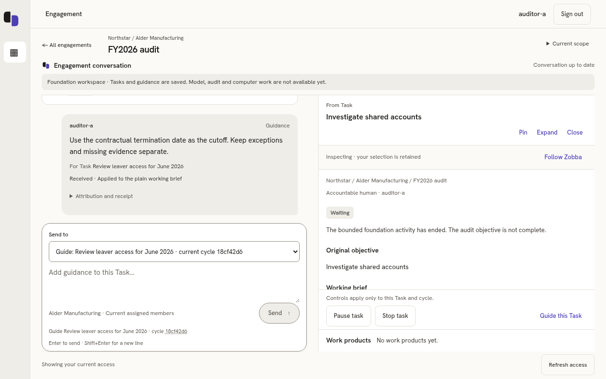

# Running foundation demonstration

These are captures of the actual local Rust API, PostgreSQL, HTTPS OIDC fixture
and React application, using synthetic users and objectives. They are not design
mockups. The browser followed the real sign-in callback. Root reproduced the
journey and visually inspected the desktop and narrow layouts; the browser
reported zero page errors. [Capture facts](facts.json).

1. Sign in as the synthetic assigned auditor and open **FY2026 audit**.
2. Create **Review leaver access for June 2026** and **Investigate shared accounts**
   in the same engagement conversation.
3. Select Guide for the leaver-access Task, open the shared-accounts Task, and send
   the contractual-cutoff guidance. Inspection does not retarget the composer.
4. Inspect the first Task's retained plain working brief. Reload and verify one
   accepted guidance message and the same two Tasks.
5. Keep an editable next draft through same-scope access revalidation; use
   Shift+Enter, Escape/focus return and the narrow Conversation/Workspace tabs.

[Two Tasks](two-active-tasks-1280.png) ·
[Guide A while inspecting B](two-tasks-guide-a-inspect-b-1280.png) ·
[Retained working brief](retained-working-brief-1280.png) ·
[320px conversation](conversation-320.png) ·
[320px workspace](workspace-320.png)



## Interruption and control proof

Captured from the final passing 46-case actual browser run:
[Pause received, cessation pending](task-pausing-awaiting-worker.png) ·
[Stop received, cessation pending](task-stopping-awaiting-worker.png) ·
[Child cessation observed, Stopped](task-stopped-observed.png) ·
[Lost reply, original request retained](lost-ack-original-request-retained.png) ·
[Original receipt recovered: one Task](lost-ack-one-task-recovered.png).


The executable demonstration is
[`conversation.spec.ts`](../../../../zobba/web/tests/browser/conversation.spec.ts).
Its actual owned API/worker processes demonstrate retained guidance after restart,
a dropped committed response followed by reload and original-key recovery,
changed-meaning 409 refusal, and received versus factually observed Pause/Stop.
Resume retains its cycle; explicit Continue creates another. A consumed activity
interrupted by a real worker crash stays unresolved and is not replayed.

The adjacent `conversation-races.spec.ts` adds two-tab and actor/scope recovery,
bounded paging and control responsiveness while ordinary reads are held. Faults
are test-only process signals or transport delays/loss around real accepted work;
no fabricated successful API responses establish acceptance.

Reproduce with the pinned toolchain and guarded disposable PostgreSQL bindings in
[the browser README](../../../../zobba/web/tests/browser/README.md). From `zobba/`:

```sh
ZOBBA_BROWSER_EXECUTABLE=/usr/bin/chromium \
  pnpm --filter @zobba/web exec playwright test conversation.spec.ts
```

The dev URLs are loopback services in the execution workspace, not public preview
links. No customer account, external system effect, model, live computer or audit
conclusion is demonstrated. Waiting means the bounded foundation activity ended;
it does not mean the audit objective is complete. The work-product shelf is
honestly empty. Credential forms and generated secrets are excluded from these
captures. [Final acceptance and regression results](../BATCH-CHECKPOINT.md) include the
independent review and preserved source manifest.
