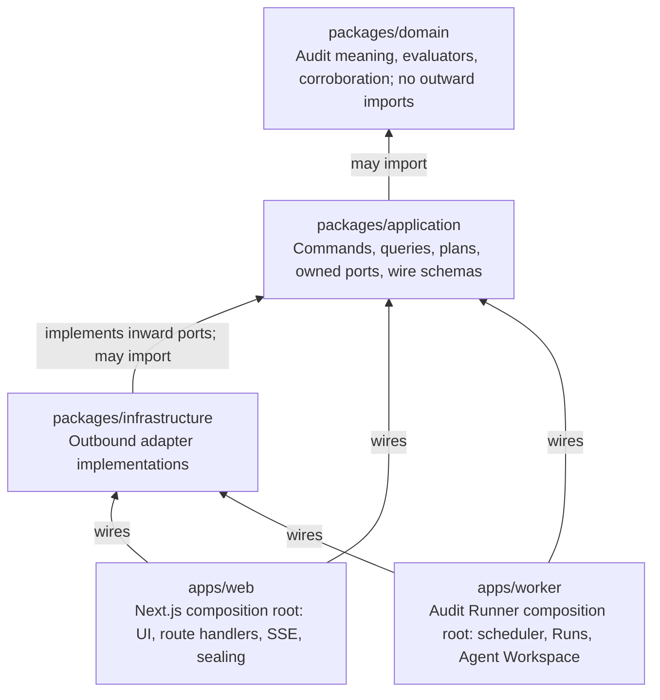
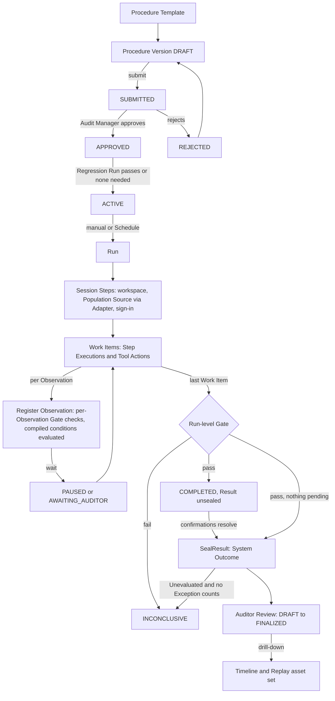
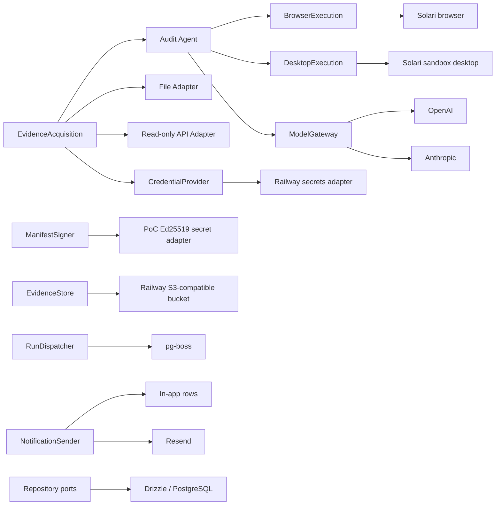
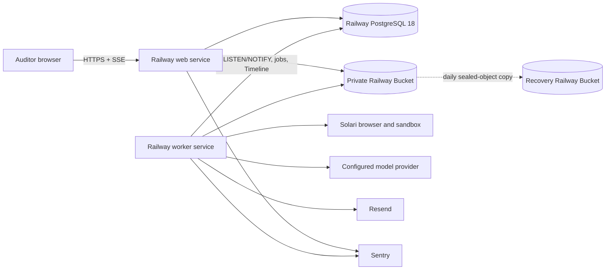

# Architecture Spine — IntelliFin Audit

## 0. Owner-approved timing correction — 2026-09-04

Approval of a regression-gated successor records pending regression and its successor relationship without a speculative handover date. Actual activation after regression passes sets the authoritative boundary strictly after activation. The owner explicitly selected this behavior. This supersedes approval-time wording and invalidates prior downstream timing reviews: Story 2.8 and later Regression Run/scheduler contracts require revalidation. Execution and scheduler handover remain outside Epic 2.

### Owner-approved adapter retry policy — 2026-09-05

For adapter Work Items, AD-3's general retry/skip Escalation rule is superseded by one automatic additional bounded retry cycle after first exhaustion. A second exhaustion marks the Work Item `FAILED`; the Run continues and incomplete coverage yields `INCONCLUSIVE`. Each cycle uses the frozen retry bound and every attempt consumes Run budgets. Agent-driven Escalations, Session Step exhaustion and denied-action mappings remain unchanged. This aligns the architecture with addendum revision 3 and Story 3.8; prior downstream adapter retry reviews require revalidation.

## Design Paradigm

Ports-and-adapters modular monolith. The inward-owned audit model defines meaning and ports; two independently runnable delivery processes compose replaceable infrastructure around it. Runs are durable, asynchronous, and interruptible by a human at defined wait states.





## Invariants & Rules

### AD-1 — [ADOPTED] Strict inward dependency direction

- **Binds:** all source code and package boundaries
- **Prevents:** frameworks, vendors, persistence models, or delivery processes redefining the audit domain
- **Rule:** `domain` imports no outward layer; `application` imports only `domain`; `infrastructure` implements ports owned by `application` or `domain`; `apps/web` and `apps/worker` are composition roots. Business/application code must not import Drizzle, pg-boss, Solari, Vercel AI SDK, Resend, S3, Railway, Better Auth, Next.js, Pino, or Sentry types. Enforce these boundaries in CI.

### AD-2 — [ADOPTED] The audit core owns product meaning and state

- **Binds:** Control, Procedure Template, Procedure, Procedure Version, Target System registration, Population Source binding, Run (Audit Assignment), Session Step, Work Item, Observation, Evidence Package, Evidence Quality Gate, Evaluation, Result, Exception, Escalation, Auditor Review
- **Prevents:** web screens, jobs, Adapters, the model, or database schemas becoming competing definitions of an Audit Run or a Procedure
- **Rule:** the domain model owns entities, value objects, lifecycle rules, and deterministic invariants. Application command handlers are the only mutation path. A Procedure Version is authored from a Template in the Builder by an Auditor and approved by an Audit Manager who is not its author; approval freezes the compiled plan, Population Source binding, Target System registration digests, per-condition applicability predicates and compiled/uncompiled status, confidence threshold, Evidence Requirements, model/prompt/tool configuration, limits, and Schedule. A Run carries `kind ∈ {STANDARD, REGRESSION}`: a `STANDARD` Run references only an `ACTIVE` version; a `REGRESSION` Run references the `APPROVED` version it gates (AD-19). A registration digest is SHA-256 over the RFC 8785 canonical JSON of exactly `{kind, allowed_origins | application_identity, credential_ref, permitted_actions, attribute_label_patterns, secondary_key}`, computed by one domain function owned by `registrations`; the configuration tuple compared for Regression gating is (model, prompt version, tool configuration, registration digests) against the most recent version of the same Procedure that reached `ACTIVE`, and a first version needs no Regression Run. The compiled plan is a versioned executable contract (AD-14) consumed byte-for-byte by the worker; the worker never re-derives. Any change to those fields, a platform-side model/prompt/tool change, or a referenced registration change mints a new `DRAFT` (platform-authored when the platform caused it); a Regression Run gates `ACTIVE` when configuration digests differ. Templates are data owned by the procedures module. Each module owns its repository ports and data; no module reads or writes another module's tables through an infrastructure shortcut.

### AD-3 — [ADOPTED] Runs execute durably, asynchronously, and incrementally

- **Binds:** FR-16..FR-23, FR-29, FR-33, FR-34, FR-40, NFR-8, RunDispatcher, apps/web, apps/worker
- **Prevents:** long-running audit work inside web requests, duplicate business effects, irrecoverable partially completed Runs, and Gate or evaluation decisions that cannot be traced to the Observation that triggered them
- **Rule:** web commands create one durable job per Run; the worker executes the application-owned plan as ordered Session Steps and Work Items, each Work Item as Step Executions of Tool Actions. Every Tool Action and every state change appends a Timeline event in the same transaction as its effect, before anything else can observe it. At Observation registration the worker runs the per-Observation Gate checks and the deterministic evaluator for compiled conditions in one transaction; after the last Work Item it runs the Run-level Gate and `CompleteRun` commits the Gate decision, the Result, the Run state, final checkpoint, and audit events atomically, or none (publication and sealing per AD-21). Every stage is idempotent with a revisioned checkpoint; retry resumes at the first incomplete stage. One application retry policy owns the closed outcome mapping: at most 3 bounded-backoff retries per Step Execution, then a *retry or skip* Escalation, then Work Item `FAILED` on a second exhaustion; Session Step exhaustion, a denied action or scope violation (also a security event), and a during-Run integrity mismatch are `RUN_FAILED`; Run-level Step Execution, time, or token exhaustion is `INCONCLUSIVE` with partial Evidence preserved. Every Gate check outcome, with its diagnostic, is a Timeline event, and the Run-level Gate summary is a Timeline event; Adapter extractions may register Observations in batches, one transaction and one Timeline event per batch carrying the Observation digests. With pg-boss, Run state and dispatch commit in the same PostgreSQL transaction; a future dispatcher that cannot join it must use a transactional outbox. Run uniqueness for `STANDARD` Runs is enforced transactionally on `(Procedure, effective period)`; `InitiateRun` resolves the version from the period's ownership (AD-19) and refuses periods no version owns. `CancelRun` writes `cancel_requested` on the Run: the worker performs the `CANCELED` transition for `RUNNING`, `PAUSED`, and `AWAITING_AUDITOR` at the next Tool Action boundary or wake, and the web command performs it for `QUEUED` and cancels the dispatch job; every worker stage first re-reads Run state and stops on `cancel_requested`. An Escalation *abort* is a cancel with reason. `SealPackage` (AD-5) is invoked inside every terminal transition by whichever process performs it. Rerun always creates a linked new Run. Queue delivery never implies exactly-once business side effects.

### AD-4 — [ADOPTED] Evidence acquisition is the product boundary, on two paths

- **Binds:** FR-3, FR-6, FR-7, FR-19..FR-21, FR-31, EvidenceAcquisition, BrowserExecution, DesktopExecution, ModelGateway
- **Prevents:** browser or desktop automation, Solari, an LLM, or a source protocol leaking into the audit model; and two acquisition paths producing two Observation shapes
- **Rule:** application use cases invoke an application-owned `EvidenceAcquisition` port that returns Observations in one canonical schema with structured provenance. Adapters implement it deterministically for Population Sources and file/API Target Systems, without a model; the Audit Agent implements it for web and desktop Target Systems through `BrowserExecution` and `DesktopExecution`. An Agent Workspace exists only for Runs with agent-driven Steps. Persist only opaque `CredentialRef` values; a `CredentialProvider` supplies a Source/environment-scoped credential just in time to the worker adapter and audits retrieval without secret values. No mutation capability is exposed through an inward port. The `BrowserExecution` and `DesktopExecution` conformance contracts govern origin/application allowlists, read-only actions, redirects and downloads, structural snapshot capture (accessibility tree or DOM for web; control tree for desktop), focused-record identity, sanitized Tool Action logging, cancellation acknowledgment, timeout accounting, and trace ordering. Execution adapters suppress Structural Snapshot and frame capture during credential-entry Tool Actions and redact secret-typed input values from every captured artifact before registration; an artifact found to contain a credential value fails registration, and a seeded negative test proves it. Solari's browser SDK implements `BrowserExecution` for the PoC with request interception denying traffic outside the Procedure allowlist. For `DesktopExecution` the Solari sandbox desktop provides session, action transport, screenshots, and stream only; control-tree snapshots and focused-record identity come from an in-VM snapshot agent that reads the synthetic LedgerDesk application's localhost JSON snapshot endpoint on a project-owned desktop template (no AT-SPI dependency), invoked through the desktop `exec`/`fs` actions immediately after the reading Tool Action. Building that agent is a prerequisite for any Rule-Classified desktop condition; a desktop attribute with no snapshot is declared model-read on the Procedure Version.

### AD-5 — [ADOPTED] Evidence is sealed, attributable, and tamper-evident

- **Binds:** FR-10, FR-13, FR-31..FR-35, FR-45..FR-47, NFR-3, EvidenceStore
- **Prevents:** overwritten evidence, unverifiable exports, and conclusions detached from their source observations
- **Rule:** application reserves each logical artifact in PostgreSQL with a stable idempotency key and unique provisional object key before upload. `EvidenceStore` conditionally creates that key, streams/hash-closes the object, and verifies availability, size, and digest before one transaction marks it Registered. Retries reuse the reservation/key and reconcile existing bytes; a periodic reconciler detects pending, orphaned, or missing objects. Artifact kinds are Structural Snapshot, screenshot, recording segment (a platform-stored frame sequence), source excerpt, Adapter extract, and uploaded Population Source file; all are artifacts under this rule, captured or stored by the platform and, where applicable, bound to the Tool Action that produced them. A manual upload is stored as a binding artifact at upload time and acquired by the Adapter through `EvidenceAcquisition` as the Run's initial Evidence item. Artifacts carry `role ∈ {required, replay}`: `required` artifacts (Evidence-Requirement snapshots and screenshots, source excerpts, absence snapshots, Adapter extracts) gate the package seal; `replay` frames follow the same idempotent registration, but a missing or failed frame is a Timeline `frame_missing` event flagged on Replay and export, never a Gate failure. `SealPackage` is an evidence-module command invoked in every terminal transition; a package seals only when every `required` artifact is Registered and verified, open reservations are marked `abandoned` and listed on the Result and export, and any unresolved mismatch blocks evaluation and follows addendum H. Sealing makes metadata immutable. Authorized reads/exports receive application-mediated access of at most five minutes and never raw bucket credentials or durable URLs; every consumption verifies SHA-256. A post-Run integrity mismatch is an audit event and a flag on the Result and export, never a state change.

  A Workpaper Bundle is exportable for any terminal Run as one archive with a fixed layout: a signed `manifest.json` at the root (AD-22), `keys/` holding the public verification bundle, `artifacts/<sha256>` for every preserved input, Structural Snapshot, screenshot, and Replay frame addressed by digest, and versioned JSON members for the Procedure Version, Observations with grounding, per-condition evaluations with origin and confirmation history, Escalations and answers, Timeline, reviews, and the audit excerpt, so reproduction needs neither live Sources, the Workspace Provider, nor source-code access. Railway provides platform storage encryption at rest but no S3-style SSE, versioning, or object lock; the PoC is tamper-evident, not WORM-certified.

### AD-6 — [ADOPTED] Grounded, corroborated Observations gate deterministic per-condition evaluation

- **Binds:** FR-9, FR-20, FR-31, FR-33, FR-36..FR-40, addendum B.1, E, H
- **Prevents:** false assurance from uncorroborated agent assertions, unproven absence, silently skipped conditions, and model-generated control conclusions
- **Rule:** every Observation attribute carries grounding (Evidence id, locator, field label, extracted text) into a Structural Snapshot or file Evidence item, never a screenshot or recording; `found = true` Observations carry an identity attribute grounded in the same Structural Snapshot as each value attribute (one identity grounding per snapshot when attributes span several); platform key matching over search-result rows is a separate `match` provenance node (candidate-rows snapshot, matched-row locator, key compared) required in addition to page identity, and for `match_origin = human-matched` identity corroboration compares the declared secondary key re-read from the page snapshot and is never skipped; Absence evidence is defined per `capture_method`: for the agent, the query string is the sanitized `type` Tool Action into the search control the registration declares by locator pattern, the empty-result page is a Structural Snapshot, and completeness is all result pages consumed; for an Adapter, every lookup or extraction is an Adapter Action on the Timeline with the same sanitized-action schema, the query string is the request key recorded by the platform from the request, the empty result is the stored response artifact, and completeness is the addendum H extraction check. A `found = false` Observation missing its path's absence fields makes the Work Item (agent) or the record (adapter batch) `UNINSPECTED`; an adapter batch Work Item is `OBSERVED` only when every covered record has an Observation with `found ∈ {true, false}`. The domain owns a deterministic corroboration function that re-reads value, label, and identity from the stored snapshot; a mismatch marks the attribute contradictory and the record Unevaluated. Every Compliance Rule condition carries a compiled applicability predicate; the deterministic evaluator applies compiled conditions per applicable record at registration and records origin `RULE`; uncompiled conditions are evaluated by the agent and recorded with origin `AGENT_JUDGED`, confirmation `pending`, and a confidence in [0, 1]; below the version's confidence threshold the evaluation is stored with value `UNEVALUATED`, origin `AGENT_JUDGED`, confidence retained, and no confirmation required; a human rejection replaces a pending evaluation with origin `HUMAN` and retains history. Unevaluated is a value with an origin. The compiled condition and applicability-predicate expression is a versioned `application` contract (AD-14) with one domain interpreter shared by the Builder preview, the Regression comparison, and the worker evaluator; predicates evaluate over `found`, `match_origin`, and normalized values of attributes whose corroboration is `matched`; a predicate referencing an absent, `contradictory`, or `model_read` attribute evaluates applicable (fail-closed) and the condition's evaluation is `UNEVALUATED` with a diagnostic; `found = ambiguous` makes every condition applicable and Unevaluated; model-read attributes may not appear in predicates. The Observation registration envelope carries the agent's evaluations for every uncompiled applicable condition, and registration is one transaction. The evaluation module creates an Exception in the transaction that records the first `EXCEPTION` evaluation for a record, assigns its Run-stable identifier and fingerprint then, and never deletes it; `counts_toward_outcome` is computed at `SealResult` (true when any current `EXCEPTION` evaluation has origin `RULE`, confirmed `AGENT_JUDGED`, or `HUMAN`; an Exception whose every `EXCEPTION` evaluation was rejected is retained with `counts_toward_outcome = false`), and `review` assignment and disposition are permitted only after sealing. At the Run-level Gate any current `UNEVALUATED` evaluation whose origin is not `HUMAN` is a condition-completeness failure → `INCONCLUSIVE` at `CompleteRun`; only human rejection introduces `UNEVALUATED` after `COMPLETED`. Per-Observation checks are: grounding present, required Evidence, identity and value corroboration, absence completeness, unnamed value, ambiguous match, and Target System freshness; condition completeness and the remaining addendum H rows run at Run level, because an uncompiled condition's evaluation may arrive later in the Work Item. A compiled condition over a model-read attribute is applied by the deterministic evaluator to the model-read value and recorded with origin `AGENT_JUDGED` and the agent's read confidence. Agent output is Evidence and evaluation input, never the System Outcome. Exceptions receive an environment-scoped HMAC-SHA-256 fingerprint over canonical Procedure/condition identity and normalized business keys, with key ID retained. Comparisons are valid only across versions declared compatible at approval — same Procedure, same matching key, same Compliance Rule digest (addendum B) — and a scheduled Run's predecessor for change comparison is the previous period's Run of the same Procedure.

### AD-7 — [ADOPTED] Human decisions are separate, attributable, revision-guarded state

- **Binds:** FR-2, FR-13, FR-25..FR-27, FR-38, FR-40..FR-44, Auditor, Audit Manager, PoC Administrator
- **Prevents:** reviewers rewriting machine outcomes, identity-provider roles becoming audit authority, and human input reaching the agent as instruction
- **Rule:** immutable sealed System Outcome, per-condition evaluations, and review/disposition state are separate aggregates. Procedure Version, Run, Result (sealing and version), Auditor Review, Exception, and Work Item transitions follow the state machines in Consistency Conventions; every transition records actor, time, prior state, decision, rationale, and aggregate revision. Mutations — including confirmations, Escalation answers, pause/resume, and dispositions — require the expected revision. Rejection of a Result is an event returning `SUBMITTED → DRAFT`. Finalized freezes the Result, evaluations, Exceptions, dispositions, Reviews, Timeline, and Evidence against all later commands. Better Auth establishes identity/session only; application-owned roles authorize every command, query, Evidence read, export, and Live View stream. Initiation snapshots the human authorization decision; the worker executes the approved Run as a service principal and records initiator and execution principal. Later role revocation blocks new human actions but does not silently cancel a Run. Free text from humans (Escalation notes, rationale) is stored and audited and is never passed to the model. Fields designated sensitive on the Population Source binding are masked in list views and unmasked only in Exception Detail and exports for Auditors and Audit Managers, each unmasked read audited. Submission for Auditor Review requires a sealed `COMPLETED` Result.

### AD-8 — [ADOPTED] PostgreSQL is the transactional system of record

- **Binds:** repositories, lifecycle state, checkpoints, Timeline, provenance, audit trail, Schedules, notifications, pg-boss dispatch
- **Prevents:** split-brain lifecycle state, a second real-time store, and infrastructure-specific queries spreading through the core
- **Rule:** PostgreSQL owns relational product state, the Timeline, Schedules, notification records, and queue state; Drizzle repositories implement inward-owned ports and explicit reviewed migrations change schema. An application-owned `UnitOfWork` may coordinate multiple module repositories on one shared PostgreSQL transaction without exposing tables or Drizzle inward. Binary evidence remains in `EvidenceStore`. State snapshots and append-only transition/audit/Timeline events update in the same transaction. Direct database access is confined to infrastructure adapters and migration tooling.

### AD-9 — [ADOPTED] Agentic execution is bounded, typed, replayable, and provider-neutral

- **Binds:** FR-23, FR-27, FR-29, FR-30, NFR-2, NFR-4, ModelGateway, BrowserExecution, DesktopExecution
- **Prevents:** provider lock-in, prompt injection expanding scope, an open channel from retrieved content or humans to the agent, and untraceable model behavior
- **Rule:** `ModelGateway` and tool ports use application-owned request/result types and one conformance contract for ordered tool calls, cancellation, timeout/token accounting, structured uncertainty, and terminal failures. Each Procedure Version fixes allowed origins and applications, read-only tools/actions, Step Execution/time/token limits, objective, model data policy, and cancellation checks; retrieved content cannot change them. Escalations are typed application objects with closed answer sets — *choose candidate*: pick by the version's declared secondary key or mark ambiguous; *unnamed value*: mark Unevaluated and continue, or abort; *retry or skip*: retry, skip, or abort — where *unnamed value* and *retry or skip* are raised by the platform and *choose candidate* only when platform key matching finds no unique grounded row; no answer evaluates a record Compliant or Exception or changes scope, credentials, tools, or the Compliance Rule; the agent receives the chosen option identifier and nothing else. Agent narration is agent output; platform-derived step descriptions from sanitized Tool Actions are the trusted narration source, and any agent narration shown is labeled as such. Only minimized/redacted fields permitted by the model data policy leave for a provider whose retention, training, and residency configuration is accepted. The PoC uses direct OpenAI and Anthropic provider adapters. Persist provider route, provider/model identity, model configuration, Procedure/prompt versions, deployed build version, sanitized tool activity, limits, and terminal reason. Agent narration, questions, and rationales are stored as untrusted content and rendered inert; traces are redacted before persistence, display, or export. The platform-owned Replay asset set (per Tool Action: frame, sanitized action, Observation delta; per Escalation; per Session Step) is captured during execution so Replay never needs the Workspace Provider. Exhaustion or uncertainty fails safely. Model selection remains benchmark configuration, not an AD.

### AD-10 — [ADOPTED] Operational telemetry and product audit evidence are distinct

- **Binds:** NFR-1, NFR-10, NFR-12, web, worker, external providers
- **Prevents:** logs being mistaken for audit evidence and loss of cross-process diagnosability
- **Rule:** propagate one correlation chain across request, Run, job, Session Step, Work Item, Tool Action, provider call, Evidence capture, notification, and SSE stream. All logs/traces pass through one allowlist-based telemetry sanitizer: code-owned scalar fields only, static Pino redaction, Sentry `sendDefaultPii: false`, AI input/output capture disabled, and scrubbed events/spans/breadcrumbs. Raw provider objects, Evidence, tool payloads, snapshots, credentials, and signed URLs are forbidden; seeded negative tests enforce this. Diagnostics (Target System connectivity, Workspace Provider and Audit Runner health, latency, limit consumption) are rows the worker writes and the web reads; the web process never probes Target Systems or providers. Immutable product audit events (chained per AD-22) cover security/configuration, authoring and approval, Schedule, execution, waits and answers, transformation, Evidence access/denial, signed-access issuance, notification delivery, export, errors, review, and disagreement with actor/agent/Adapter, Source/artifact, decision, UTC time, session identifier, and correlation ID — never the access token itself.

### AD-11 — [ADOPTED] Deployment remains replaceable

- **Binds:** PoC environments, Railway, NFR-8, NFR-10, NFR-11, NFR-13..NFR-15
- **Prevents:** PoC hosting becoming a product boundary or blocking a future private/customer-hosted runner
- **Rule:** ship web and worker as separate container processes from one repository; configuration and secrets enter only their infrastructure composition roots. The single-tenant synthetic PoC uses Railway services, `ghcr.io/railwayapp-templates/postgres-ssl:18`, and a credential-private S3-compatible bucket over its public endpoint; verify `server_version` at bootstrap. Operations — not Railway — own tuning, backup, monitoring, and restore. Daily PostgreSQL backups and a daily copy/inventory of sealed Evidence plus public verification keys to a separately credentialed recovery bucket form one recovery unit; recovery credentials are unavailable to web/worker. Restore drills reconstruct a sealed finalized Run and verify every object digest, audit-chain link, and signature against the 24-hour RPO/eight-hour RTO target. Retain PoC data for its lifetime and delete only through documented teardown. Core runtime majors are Node.js 24 LTS, Next.js 16, and PostgreSQL 18. Production/customer storage, tenant isolation, residency, and key management require new adopted decisions.

### AD-12 — [ADOPTED] Tests defend domain and adapter seams

- **Binds:** all packages, CI, four PoC Templates and their golden datasets
- **Prevents:** coding agents introducing dependency inversions, nondeterminism, or silently incompatible adapters
- **Rule:** deterministic domain/evaluator/corroboration tests use frozen fixtures including the addendum D seeds (transcription error, wrong-page identity, wrong-element label, mistyped key, silent timeout, injection via Escalation, the three scope-widening instructions); golden datasets, expected terminal outcomes, and confirmation scripts are versioned product data on each Template (AD-19) and are mirrored into `tests/fixtures` from that source; every outbound port uses one shared conformance suite. Repository, atomic publication/dispatch, crash points around upload/register/checkpoint/seal, wait-state resume, retry/failure budgets, optimistic concurrency, canonical vectors, Regression Run comparison, and full recovery run against real PostgreSQL/object-storage-compatible test infrastructure. Replay must pass with the Workspace Provider blocked at the network. Playwright covers Builder submission through approval, Run initiation, Live View with pause and an Escalation answer, review/export, keyboard access, and automated WCAG 2.1 AA checks. CI runs type checking, dependency-boundary checks, migrations, unit, integration, critical end-to-end, security-negative, and NFR acceptance tests.

### AD-13 — [ADOPTED] PoC thesis evidence is product data

- **Binds:** FR-50, success metrics SM-1, SM-4, SM-11
- **Prevents:** a technically functioning demo that cannot establish setup effort, repeatability, or reusable product value
- **Rule:** capture authoring and approval time, Escalations and interventions per Run, false-positive dispositions, approval and rejection counts, tokens and Workspace Provider time per Run, procedure-specific code, reusable versus procedure-specific components including Adapters, Run-to-Run consistency, and maintenance effort including Regression Runs as structured Run/Procedure metrics queryable across the four Templates.

### AD-14 — Durable contracts are explicitly versioned

- **Binds:** jobs, checkpoints, Observations, Structural Snapshots, Timeline events, Replay assets, Escalations and answers, notifications, Templates, compiled plans, audit events, manifests, Workpaper Bundles
- **Prevents:** separately deployed producers and consumers accepting TypeScript types yet disagreeing on durable bytes or graph semantics
- **Rule:** `application` owns a Zod wire schema and explicit `schemaVersion` for every serialized boundary, plus upcasters for the supported compatibility window. Changes are additive within a rolling release; unknown additive fields are ignored, required-field removal/semantic change requires a new version, and old-producer/new-consumer plus new-producer/old-consumer fixtures run in CI. Canonical provenance is a directed graph with stable IDs for artifact, snapshot, Source record, Observation, attribute grounding, transformation, match, condition evaluation, Escalation, and Exception; edges, cardinality, ordering, ambiguity, exclusion, origin, and original/normalized representation are normative fixtures, not reconstructed from logs.

### AD-15 — Releases preserve active Runs and durable data

- **Binds:** web/worker deployment, PostgreSQL migrations, durable jobs, waiting Runs, rollback
- **Prevents:** a valid new web build, old worker, and migrated schema becoming mutually incompatible during rollout, or a waiting Run losing its resume path
- **Rule:** the release pipeline alone applies migrations; web and worker never auto-migrate. Use expand → migrate/backfill → deploy backward-compatible web/worker → drain old workers → contract in a later release. Each process checks supported schema and contract ranges at startup and refuses incompatible operation. Durable jobs, checkpoints, wait states, Schedules, and compiled plans remain consumable through the declared compatibility window; a Run in `PAUSED` or `AWAITING_AUDITOR` must resume on a new worker build; rollback may not cross a destructive migration or unsupported contract version.

### AD-16 — Human-in-the-loop waits are durable Run states

- **Binds:** FR-18, FR-24..FR-27, addendum E, RunDispatcher, apps/worker
- **Prevents:** a worker process holding an in-memory wait, a lost workspace on restart, two answers applied to one Escalation, or the web process deciding timeouts
- **Rule:** `PAUSED` and `AWAITING_AUDITOR` are persisted Run states with a checkpoint, an open wait record (kind, options, deadline), and a workspace lease. Deadlines are 30 minutes for `PAUSED` and 4 hours for `AWAITING_AUDITOR` (PRD assumptions). Exactly one durable job exists per wait, created in the wait-entry transaction with `startAfter = deadline` and singleton key `wait:<wait id>` (pg-boss has no release primitive, so the worker completes the current job in the same transaction); the Agent Workspace stays alive under a lease to the deadline. Every closure — answer, resume, cancel, abort — is one application command that, in one transaction, locks the wait row, requires it open and the expected Run revision, writes `{closed_at, closure_kind, answer_option_id, actor}` on the wait record (the Escalation references the wait and never holds the authoritative answer), and moves the wait job's start to now; a second closure fails the precondition. The wake handler locks the same row and applies exactly one of: closed → act on `closure_kind`; open and past deadline → `INCONCLUSIVE` with Evidence preserved; open and early → reschedule. The job payload is `{schemaVersion, runId, waitId}` only. Every terminal transition and a periodic sweep reap orphaned workspaces and revoke their credentials (NFR-5). The checkpoint carries the workspace lease identity (provider session identifier). On wake the worker enforces the deadline (`INCONCLUSIVE` with Evidence preserved) and, on resume, reattaches to the leased workspace (`attach(WorkspaceRef)` preserving the signed-in session and `release` are conformance requirements of both execution ports) and restarts the current Step Execution from its first Tool Action as a new attempt not charged to the retry budget, the earlier attempt's Tool Actions remaining on the Timeline marked `superseded_by_resume`; no model conversation state is persisted across a wait and the model is re-briefed from the frozen plan, the Work Item, and the chosen option identifier; if the workspace is gone, it re-runs the sign-in Session Steps for the current Target System under the Session Step retry budget, records the reattach on the Timeline, and continues; exhaustion is `RUN_FAILED`. Pause applies at the next Tool Action boundary and is refused while a Run is awaiting an answer.

### AD-17 — The Timeline is the single live-state source; SSE fans it out

- **Binds:** FR-24, FR-29, FR-30, FR-48, NFR-7, apps/web, apps/worker
- **Prevents:** a second real-time store, Live View and Replay drifting apart, and clients missing events on reconnect
- **Rule:** live state is read only from Timeline events in PostgreSQL. Timeline events are the Run aggregate's AD-22 chain events; `seq` is the chain sequence allocated under the Run head row lock, gapless and commit-ordered across web and worker writers, and the writer issues one `NOTIFY` per appended event in the same transaction carrying Run id and sequence; a web route handler streams Server-Sent Events per Run to authorized clients, using the last-seen sequence as cursor and replaying `seq > cursor` in order from the Timeline on reconnect, never skipping; the Runs dashboard uses the same channel per list. Live View and Replay share one renderer over the Replay asset set; a live frame is a Replay asset the moment it is registered. Streams send a heartbeat comment at most every 30 seconds, cap their own lifetime below 15 minutes so reconnects are planned rather than proxy-forced (Railway closes responses after 5 minutes idle and 15 minutes total), and tear down their LISTEN subscription on request abort. Subscribing surfaces are Live View, Run Detail while the Run is active, the Runs list, Overview counts, and the notification badge; other surfaces are request-time reads. No WebSocket server, Redis, or provider stream is a source of truth. Revisit if fan-out exceeds one web instance.

### AD-18 — One Observation contract for Adapters and the Agent

- **Binds:** FR-6, FR-7, FR-21, FR-22, FR-31, FR-33, addendum B.1, C
- **Prevents:** adapter-acquired and agent-driven Target Systems producing Observations the Gate and evaluator treat differently, and per-record coverage computed over inconsistent units
- **Rule:** both paths emit the application-owned Observation schema with `capture_method`, grounding, identity attribute, and `match_origin`. Work Items are one per record per agent-driven Target System unless the Template's coverage rule declares one per page or extraction (addendum C, P-4), and one per extraction for adapter-acquired Target Systems; each Work Item owns one Observation per record it covers, and `found` may be `true`, `false`, or `ambiguous`. Per-record coverage and Run-level completeness are computed over Observations. Expected field labels and the secondary matching key are declared on the Target System registration and frozen by digest into the Procedure Version, which is the authority at Run time; an agent-extracted declared count (ProdConsole) is reconciled by the Gate like any other. Population parsing and inclusion filtering are Adapter (platform) work; an agent's reading of a file is never the population of record. Reference Sources are acquired by an Adapter as a Session Step, registered and digest-recorded as artifacts under AD-5, and frozen into the Evidence Package before evaluation; the evaluator receives their parsed content as an input value and performs no I/O; they produce no Work Items. Structural Snapshots and screenshots are captured by the execution adapter, bound to the reading Tool Action with URL or window title; the Structural Snapshot contract enumerates substrate kinds `{web_tree, desktop_tree, sheet, json}`, each with a locator grammar and a label rule (accessible name; control name; header cell; property key path); the domain extractor implements all four, reads stored snapshots only, and the Gate never skips corroboration by `capture_method`.

### AD-19 — Schedules are application data executed idempotently

- **Binds:** FR-11, FR-14, FR-15, FR-17, NFR-9, apps/worker
- **Prevents:** duplicate or skipped scheduled Runs, two versions running the same period, and the queue library becoming the Schedule of record
- **Rule:** a Schedule (frequency, fixed UTC start, period derivation) is frozen on the Procedure Version. A worker-side scheduler polls due Schedules and enqueues one Run per (Procedure Version, effective period) under a unique constraint, recording the derived period and initiator; a missed or failed start is recorded as an event and surfaced, never skipped silently. Approval requiring regression records pending regression and the successor relationship with no speculative date. `handover_at` is computed once by the command that actually activates the successor (approval when no regression is needed, activation after `RegressionPassed` otherwise) as the first period start (per the successor's Schedule) strictly after activation and stored on both versions; the predecessor owns every effective period starting before `handover_at` and the successor every period starting at or after it; the scheduler performs `ACTIVE → RETIRED` for the predecessor, with actor "Schedule", in the transaction that enqueues the first Run the successor owns or on the first tick after `handover_at`. A `REGRESSION` Run is started only by the approval command when configuration digests differ, runs on the `APPROVED` version with the Template's golden Population Source binding substituted for that Run only and the version's frozen registrations kept (golden Target System fixtures are the synthetic systems seeded with the golden dataset), is exempt from the overlap rule, never enters Review, never notifies, is labeled on the dashboard and recorded on the version; the approver confirms its Agent-Judged evaluations from the Template's confirmation script; the procedures module compares terminal outcome and evaluations to the golden expectations, every expected terminal outcome must reproduce except records addendum D exempts, and it records `RegressionPassed | RegressionFailed` on the version; only `RegressionPassed` (or no regression needed) moves `APPROVED → ACTIVE`. Manual initiation targets the version owning the requested period; a `once` Schedule creates no scheduler entry and is run manually. Reference Sources are acquired at Run start, before any Work Item. pg-boss cron may drive the poll tick but is never the Schedule of record.

### AD-20 — Notifications are audited product events behind one port

- **Binds:** FR-27, FR-28, FR-45, NotificationSender
- **Prevents:** email becoming an unaudited side channel or carrying Evidence
- **Rule:** entering `AWAITING_AUDITOR` or an Auditor flag creates notification records for the initiating Auditor (or Procedure author for scheduled Runs) and every Audit Manager in the same transaction as the state change; version submission notifies every Audit Manager and approval or rejection notifies the author, in-app only `[ASSUMPTION]`; a worker delivers them through `NotificationSender` (one email provider adapter) with at-least-once delivery and idempotent send keys, locks the wait and skips delivery as `superseded` when it is already closed, computes time remaining at send, and records each delivery outcome as an audit event; the in-app Notifications surface is a query over open wait records and open flags, and notification records are delivery tracking only. Content names Procedure, Run, Escalation kind, and time remaining, and never contains Evidence values, questions, or secrets.

### AD-21 — Results are published once and sealed by one command

- **Binds:** FR-38, FR-40, FR-43, addendum E, E.1, CompleteRun, SealResult, apps/web, apps/worker
- **Prevents:** rule-only or unattended Runs never reaching a System Outcome, two processes computing the outcome, or a sealed outcome changing
- **Rule:** `CompleteRun` publishes the Result with every evaluation recorded and computes the pending-confirmation count. `ConfirmEvaluation` and `RejectEvaluation` are refused unless the Run is `COMPLETED` and its Result unsealed (pending evaluations are read-only in Live View while `RUNNING`); both carry the expected Result revision, lock the Result row, mutate the evaluation, increment the Result revision, and evaluate the seal condition inside that lock, so the Result row serializes every mutation that can change the pending count or the outcome. `SealResult` is one application command invocable from either process: `CompleteRun` invokes it in the same transaction when no evaluation is pending; otherwise the confirmation or rejection that empties the pending set invokes it under the same lock. Sealing computes the System Outcome exactly once from the current evaluations, increments the Result version, seals Control Failure with Unevaluated records listed when any Exception counts, moves `COMPLETED → INCONCLUSIVE` only when a condition is Unevaluated and no Exception counts (addendum E.1 order), and thereafter refuses every evaluation mutation. Submission for Auditor Review requires a sealed Result.

### AD-22 — [ADOPTED] Audit events chain and manifests are signed

- **Binds:** every module that writes audit events, FR-45..FR-47, NFR-3, ManifestSigner
- **Prevents:** privileged relational mutation going undetected and bundles that cannot be independently verified
- **Rule:** there is one product event store: the Timeline is the Run aggregate's chain, and system-wide events (authentication, registration, Procedure Version, Schedule, notification, export) chain on their own aggregate or on a `platform` aggregate. Product audit events form one chain per aggregate, using a transactionally allocated sequence/head; an Observation registration event carries the Observation's digest so pre-finalization modification of an Observation row is detectable. Event and manifest bytes are UTF-8 RFC 8785 canonical JSON; SHA-256 links each event to its predecessor. Finalization first obtains an Ed25519 signature, then one transaction stores the versioned manifest/signature, audit event/head, and `FINALIZED` state or stores none. The signature envelope records format version, algorithm, key ID, public-key fingerprint, and signing time. `ManifestSigner` is an inward port; the PoC key is a Railway secret and historical public keys form a retained verification bundle. This detects PostgreSQL/bucket-only tampering, not compromise of the running application; production requires isolated KMS/HSM signing. Golden and tampered vectors bind independent producers/verifiers.

### AD-23 — Plan derivation and condition compilation are owned, deterministic, and recorded

- **Binds:** FR-6, FR-8, FR-9, FR-11, FR-12, FR-37, procedures module, apps/web
- **Prevents:** two Builders compiling the same conditions differently, a model silently deciding what a rule means, and Procedure Versions whose evaluations cannot be reproduced
- **Rule:** the procedures module owns a `PlanCompiler`: condition compilation and applicability derivation are deterministic domain functions with a compiler version frozen on the Procedure Version; identical inputs compile identically. Plan derivation is a `procedures` command executed as a queued worker job (never inside a web request) that may call `ModelGateway` for derivation only, with the derivation model identity and prompt version recorded on the version; every re-derivation is recorded, the Builder shows the plan as re-deriving until the job lands, and an underivable plan blocks submission. Builder invariants are domain validation rules: a manual upload binding requires a `once` Schedule; a declared-count mechanism is required; the zero-record-Pass opt-in and versioned-duplicate permission are flags on the version; every comparison carries explicit boundary semantics; default applicability is `found = true`; record derivation order is Exception, then Unevaluated, then Compliant; Audit Instructions are checked against the registration allowlist for scope-widening at authoring, with execution-time denial the enforced control.

## Consistency Conventions

| Concern | Convention |
| --- | --- |
| Modules | `identity` (users, roles, sessions, authorization), `registrations` (Target System registrations, Population Source bindings, credential references rejected if write-capable, allowlists, expected labels, secondary keys, masking designations, registration digests, and the change events that `procedures` handles in the same UnitOfWork to mint platform-authored drafts), `procedures` (templates, builder, versions, schedules), `runs` (execution, supervision, waits), `evidence` (store, snapshots, corroboration), `evaluation` (evaluations, Result, sealing, Exception creation and fingerprints), `review` (Auditor Review, and a disposition/assignment aggregate keyed by Exception id), `notifications`; imports cross modules only through public domain/application contracts. |
| Ports | Capability names without vendor suffixes: `EvidenceAcquisition`, `BrowserExecution`, `DesktopExecution`, `EvidenceStore`, `ModelGateway`, `CredentialProvider`, `ManifestSigner`, `RunDispatcher`, `NotificationSender`, and module repository ports. |
| IDs and time | UUIDv7 identifiers; UTC `timestamptz` in storage; ISO 8601 UTC at boundaries; identifiers are strings preserving leading zeros. |
| Versioning | Procedure Version freezes objective, scope, Population Source binding (with masking designation and declared-count mechanism), Target System registration digests (labels, secondary key), Audit Instructions, compiled plan and compiler version, derivation model and prompt version, conditions with applicability and compiled status, confidence threshold, zero-record-Pass and versioned-duplicate flags, compatibility declaration, Evidence Requirements, evaluator, schema/normalizer, execution prompt, model/tool configuration, limits, and Schedule; Run also records deployed build and actual provider/model configuration. |
| State machines | Procedure Version: `DRAFT → SUBMITTED → APPROVED \| REJECTED`; `REJECTED → DRAFT` on edit; `APPROVED → ACTIVE` immediately or after the Regression Run; `ACTIVE → RETIRED` at the first period boundary after a successor is `ACTIVE`. Run (addendum E, verbatim): `QUEUED → RUNNING`; `RUNNING ⇄ PAUSED`; `RUNNING → AWAITING_AUDITOR → RUNNING`; after the last Work Item `RUNNING → COMPLETED` on Gate pass, `RUNNING → INCONCLUSIVE` on Gate fail; `RUNNING → RUN_FAILED` on Session Step exhaustion or denied action; `PAUSED → INCONCLUSIVE` and `AWAITING_AUDITOR → INCONCLUSIVE` at deadline; `COMPLETED → INCONCLUSIVE` only at sealing when a rejection leaves a condition Unevaluated; *Active* = `QUEUED, RUNNING, PAUSED, AWAITING_AUDITOR` and any active state `→ CANCELED` on explicit cancel or Escalation *abort*; terminal `INCONCLUSIVE \| RUN_FAILED \| CANCELED`, and `COMPLETED` once sealed. Work Item: `PENDING → IN_PROGRESS → OBSERVED \| UNINSPECTED \| AMBIGUOUS \| FAILED`, `AMBIGUOUS → IN_PROGRESS`, `IN_PROGRESS → AWAITING → IN_PROGRESS \| UNINSPECTED`. Review: `DRAFT → SUBMITTED → APPROVED → FINALIZED`; rejection is an event `SUBMITTED → DRAFT`. Exception: `OPEN → UNDER_REVIEW → CONFIRMED \| NOT_AN_EXCEPTION`. Evaluation origin: `RULE`, `AGENT_JUDGED(pending\|confirmed\|rejected)`, `HUMAN`; value: `COMPLIANT`, `EXCEPTION`, `UNEVALUATED`. |
| Commands and mutation | Imperative application commands; one transaction boundary per state transition; append event plus update current snapshot atomically; expected-revision precondition on every human mutation. |
| Waits | Wait record `{kind, options, deadline, closed_at?, closure_kind?, answer_option_id?, actor?}` per Escalation or Pause; exactly one durable job per wait keyed `wait:<wait id>`; closure locks the wait row; deadlines enforced by the worker on wake. |
| Live channel | `NOTIFY run_timeline(run_id, seq)`; SSE route `/runs/<run-id>/events?after=<seq>`; clients replay from the Timeline on reconnect; 5-second freshness, 15-second stale indicator. |
| Rerun/change comparison | Every rerun records predecessor and reason. Stable Exception fingerprints identify new, unchanged, and resolved Exceptions only when version compatibility is declared; otherwise the UI labels the Runs non-comparable. |
| Errors | The application owns the closed failure taxonomy and outcome/retry mapping (addendum E); adapters translate vendor failures into it without deciding product state. |
| Timeline actions | Tool Actions (agent) and Adapter Actions (Adapter) share one sanitized-action schema on the Timeline; frames and snapshots reference the action that produced them. |
| Principals | Audit events distinguish human initiator, worker service principal, Adapter, and external agent/model; delegation never collapses them into one actor field. |
| Durable contracts | All persisted or queued envelopes carry `schemaVersion`; compatibility and upcasting follow AD-14. The Observation wire schema records `UNEVALUATED` as a value with an origin, following the UX spines rather than addendum B.1's origin list. |
| Configuration | Runtime-validated environment configuration is read only in composition roots/infrastructure; no ambient `process.env` access inward. |
| Serialization | Zod schemas validate external/provider inputs at adapter boundaries; domain constructors validate core invariants. |
| PoC acceptance envelope | Hero: up to 50 records across two agent-driven Target Systems, 95% of Runs within 30 minutes excluding waits; adapter-only Runs: up to 10,000 records within 5 minutes; Live View within 5 seconds; 95% of core views within 2 seconds at 5 concurrent users; Schedule start within 5 minutes; daily backup with 24-hour RPO/8-hour RTO; WCAG 2.1 AA and keyboard-accessible core flows. |

## Stack

Seed verified 2026-09-01. Exact dependency versions pass to the lockfile once bootstrapped; AD-11 binds only the stated runtime majors.

| Name | Version |
| --- | --- |
| Node.js | 24.20.0 LTS |
| TypeScript | 7.0.2 (direct dependency of `apps/web`; per-package `tsc --noEmit` in CI; fallback pin 6.x if the Next.js TS-7 checker regresses) |
| Next.js | 16.3.4 |
| React | 19.2.8 |
| PostgreSQL | 18.6 |
| pnpm | 11.25.0 |
| Drizzle ORM / Kit | 0.45.2 / 0.31.10 |
| postgres.js | 3.4.9 |
| pg-boss | 12.29.0 |
| Better Auth | 1.7.2 |
| Vercel AI SDK | 7.0.89 |
| AI SDK OpenAI / Anthropic providers | 4.0.55 / 4.0.47 |
| Solari browser SDK (@solarisdk/browser) | 0.1.2 |
| Solari sandbox SDK (@solarisdk/sandbox, desktop via createDesktop) | 0.1.2 |
| Resend (email) | 6.25.0 |
| AWS SDK S3 client | 3.1124.0 |
| Zod | 4.5.4 |
| Pino | 10.3.1 |
| Sentry Next.js / Node SDK | 10.73.0 / 10.73.0 |
| Vitest | 4.1.11 |
| Playwright | 1.62.1 |
| Railway | managed PoC platform, verified 2026-09-01 |

## Structural Seed

```text
apps/
  web/                     # Next.js UI (Builder, Live View, Replay, Review), route handlers, SSE, sealing, composition root
  worker/                  # pg-boss consumer, scheduler, Run executor, Agent Workspace lifecycle, notification delivery
packages/
  domain/                  # entities, value objects, state machines, evaluators, corroboration, deterministic rules
  application/             # commands, queries, plans, wait records, owned ports, wire schemas
  infrastructure/          # Drizzle, pg-boss, Better Auth, Solari browser/sandbox, AI providers, S3, Resend, telemetry adapters
tests/
  fixtures/                # frozen golden and adversarial evidence, addendum D seeds, canonical vectors
  integration/             # real PostgreSQL and adapter contracts, wait-state resume, Replay with provider blocked
  e2e/                     # Builder → approval → Run → Live View → review → export
```





## Capability → Architecture Map

| Capability / Area | Lives in | Governed by |
| --- | --- | --- |
| FR-1..FR-3 identity, roles, read-only boundary | web + identity and registrations modules | AD-1, AD-4, AD-7, AD-9 |
| FR-4..FR-12 Procedure Builder, Templates, plan preview | procedures module + web Builder | AD-2, AD-14, AD-23 |
| FR-13..FR-15 approval, versioning, Regression Run | procedures module + web Version review + worker | AD-2, AD-7, AD-19 |
| FR-16..FR-18 initiation, Schedules, lifecycle | runs module + worker scheduler | AD-3, AD-16, AD-19 |
| FR-19..FR-23 Agent Workspace, Steps, Adapters, limits | runs module + worker + execution adapters | AD-3, AD-4, AD-9, AD-18 |
| FR-24..FR-28 Live View, pause, cancel, Escalation, notification | runs supervision + web SSE + notifications module | AD-7, AD-16, AD-17, AD-20 |
| FR-29..FR-30 Timeline and Replay | runs module + EvidenceStore + web renderer | AD-5, AD-9, AD-17 |
| FR-31..FR-35 Evidence capture, grounding, Gate, immutability | evidence module + adapters + domain corroboration | AD-4, AD-5, AD-6, AD-18 |
| FR-36..FR-40 evaluation, confirmation, sealing | evaluation module + domain evaluators + SealResult | AD-3, AD-6, AD-7, AD-21 |
| FR-41..FR-44 Exceptions, review, disagreement | evaluation (Exception creation) + review (dispositions, assignment) + web | AD-5, AD-7, AD-8, AD-21 |
| FR-45..FR-47 audit trail, export, reproduction | application + repositories + EvidenceStore | AD-5, AD-8, AD-10, AD-14, AD-22 |
| FR-48..FR-49 dashboard, diagnostics | web queries + SSE + operational telemetry | AD-10, AD-17 |
| FR-50 instrumentation | runs/procedures metrics | AD-13 |
| NFR-1..NFR-15 cross-cutting envelope | all layers and deployment | AD-1..AD-23 |

## Deferred

- Agent-recommended scope, conversational authoring, parallel Work Items across agents, finding-triggered escalation, documents as Sources, and control packs remain outside the PoC; the Work Item model and wait records must not preclude parallel Work Items in one Run.
- The default model is `claude-sonnet-5` through the Anthropic provider, OpenAI wired as fallback; revisit after the hero benchmark on golden and adversarial cases across the configured providers.
- Revisit pg-boss and the LISTEN/NOTIFY-plus-SSE live channel if measured queue or fan-out load harms product transactions, more than one web instance is needed, or cross-region/customer-hosted dispatch is required.
- Revisit authentication for enterprise SSO, federation, provisioning, and tenant administration before a design-partner production pilot.
- Select production evidence storage, encryption/key management, WORM/retention controls, backup, residency, and customer-hosted topology before any customer data.
- The PoC is single-tenant; decide tenant context across authorization, repositories, jobs, object namespaces, telemetry, exports, audit chains, and keys before a design-partner production pilot.
- Finalized records never reopen; define a linked supersession/correction workflow before external assurance reliance or signing-key compromise handling.
- Replace the PoC environment-held signer with isolated KMS/HSM signing before customer data.
- Desktop control tree (resolved 2026-09-01): the Solari desktop exposes no accessibility tree, so LedgerDesk serves its control tree as JSON on localhost and the in-VM snapshot agent (AD-4) reads it; building both is a prerequisite for any Rule-Classified LedgerDesk condition.
- Provider recordings are copied into platform object storage at Run end as SealPackage input, provider retention is set to its minimum, and the provider region matches the Railway region; re-evaluate Solari region, retention, maturity, and private-runner requirements before production. Provider replay is never the authoritative execution record.
- Separation of the Audit Manager who confirms evaluations from the one who approves the Result; notification on Run completion; additional Workpaper Bundle export formats beyond the bound archive layout.
- Split packages or services only when measured ownership, deployment, scaling, or isolation requirements cannot be met by the modular monolith; add Turborepo only on a measured task-graph or caching problem.
