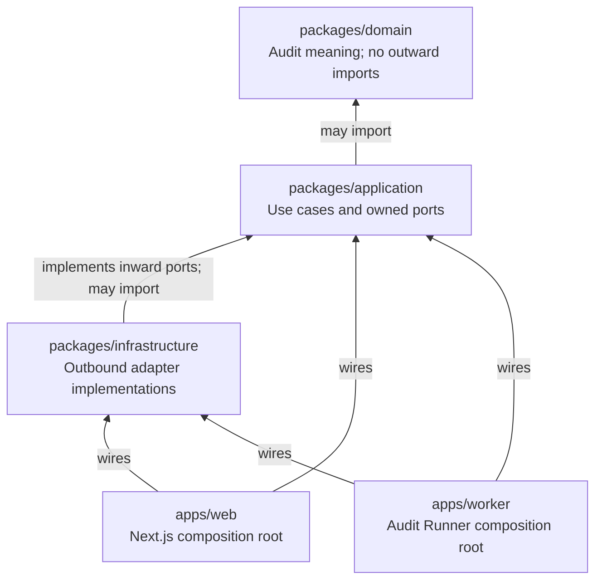
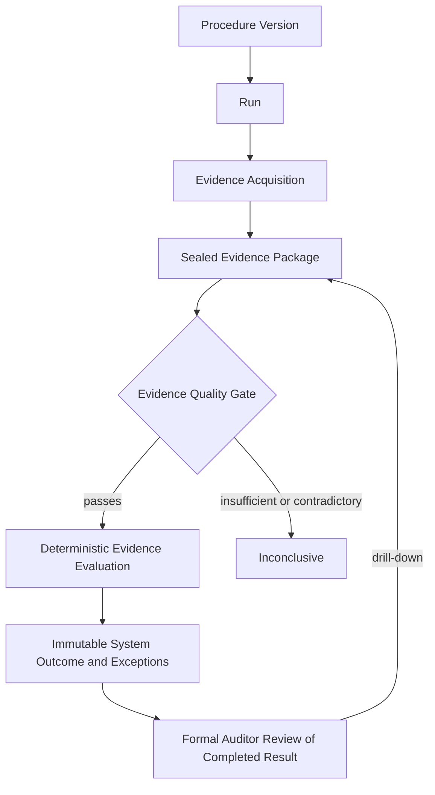
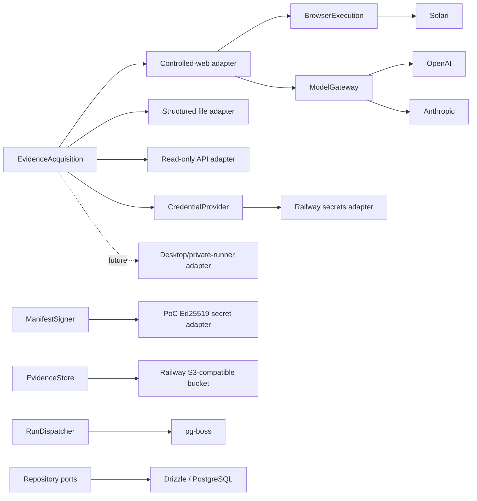
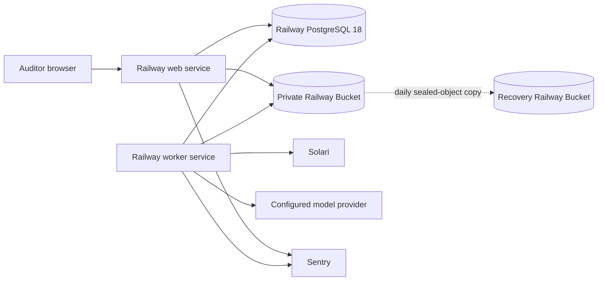

# Architecture Spine — IntelliFin Audit

## Design Paradigm

Ports-and-adapters modular monolith. The inward-owned audit model defines meaning and ports; independently runnable delivery processes compose replaceable infrastructure around it.





## Invariants & Rules

### AD-1 — [ADOPTED] Strict inward dependency direction

- **Binds:** all source code and package boundaries
- **Prevents:** frameworks, vendors, persistence models, or delivery processes redefining the audit domain
- **Rule:** `domain` imports no outward layer; `application` imports only `domain`; `infrastructure` implements ports owned by `application` or `domain`; `apps/web` and `apps/worker` are composition roots. Business/application code must not import Drizzle, pg-boss, Solari, Vercel AI SDK, S3, Railway, Better Auth, Next.js, Pino, or Sentry types. Enforce these boundaries in CI.

### AD-2 — [ADOPTED] The audit core owns product meaning and state

- **Binds:** Procedure, Run, Evidence Package, Evidence Quality Gate, Control Result, Exception, Auditor Review
- **Prevents:** web screens, jobs, source adapters, or database schemas becoming competing definitions of an Audit Run
- **Rule:** the domain model owns entities, value objects, lifecycle rules, and deterministic invariants. Application command handlers are the only mutation path. A Run may reference and dispatch only an approved, frozen Procedure Version; changing logic, Source mapping, Evidence requirements, model configuration, or tool configuration mints a new Procedure Version. Each module owns its repository ports and data; no module reads or writes another module's tables through an infrastructure shortcut.

### AD-3 — [ADOPTED] Runs execute durably and asynchronously

- **Binds:** FR-6..FR-8, NFR-7, RunDispatcher, apps/web, apps/worker
- **Prevents:** long-running audit work inside web requests, duplicate business effects, and irrecoverable partially completed Runs
- **Rule:** web commands create one durable job per Run; the worker executes the application-owned ordered stage plan. Every stage is idempotent and records a revisioned checkpoint before the next stage begins; retry resumes at the first incomplete stage. One application retry policy owns the maximum three Source attempts and bounded backoff; adapters may not hide additional retries. With pg-boss, Run state and dispatch commit in the same PostgreSQL transaction; a future dispatcher that cannot join it must use a transactional outbox. One active Run per Procedure Version/effective period is enforced transactionally. Cancellation is cooperative, stops new external calls, and preserves partial Evidence; rerun always creates a linked new Run. Queue delivery guarantees never imply exactly-once business side effects, and retries must not duplicate Results or Evidence artifacts. One `CompleteRun` unit of work atomically commits the Gate decision, Result, Exceptions, terminal Run state, final checkpoint, and audit events; none is externally published alone.

### AD-4 — [ADOPTED] Evidence acquisition is the product boundary

- **Binds:** FR-3, FR-9..FR-12, FR-30, EvidenceAcquisition, BrowserExecution, ModelGateway
- **Prevents:** browser automation, Solari, an LLM, or a source protocol leaking into the audit model
- **Rule:** application use cases invoke an application-owned `EvidenceAcquisition` port that returns canonical acquisition observations and structured provenance. File, API, controlled-web, future desktop, and future private-runner adapters implement that boundary. Persist only opaque `CredentialRef` values; a `CredentialProvider` supplies a Source/environment-scoped credential capability just in time to the worker adapter and audits retrieval without secret values. No mutation capability is exposed through an inward port. Controlled-web acquisition alone may use `BrowserExecution`; its conformance contract governs redirects, subresources/downloads, resolved-IP/origin allowlists, read-only actions, stable snapshot/count observations, cancellation acknowledgment, timeout/limit accounting, and trace ordering. Solari implements it for the PoC, with request interception denying traffic outside the Procedure allowlist.

### AD-5 — [ADOPTED] Evidence is sealed, attributable, and tamper-evident

- **Binds:** FR-10, FR-13, FR-24..FR-27, NFR-3, EvidenceStore
- **Prevents:** overwritten evidence, unverifiable exports, and conclusions detached from their source observations
- **Rule:** application reserves each logical artifact in PostgreSQL with a stable idempotency key and unique provisional object key before upload. `EvidenceStore` conditionally creates that key, streams/hash-closes the object, and verifies availability, size, and digest before one transaction marks it Registered. Retries reuse the reservation/key and reconcile existing bytes; a periodic reconciler detects pending, orphaned, or missing objects. A package seals only when every required artifact is Registered and verified; any unresolved mismatch blocks evaluation and follows addendum H. Sealing makes metadata immutable. Authorized reads/exports receive application-mediated access of at most five minutes and never raw bucket credentials or durable URLs; every consumption verifies SHA-256.

  Product audit events form one chain per aggregate, using a transactionally allocated sequence/head. Event and manifest bytes are UTF-8 RFC 8785 canonical JSON; SHA-256 links each event to its predecessor. Finalization first obtains an Ed25519 signature, then one transaction stores the versioned manifest/signature, audit event/head, and `FINALIZED` state or stores none. The signature envelope records format version, algorithm, key ID, public-key fingerprint, and signing time. `ManifestSigner` is an inward port; the PoC key is a Railway secret and historical public keys form a retained verification bundle. This detects PostgreSQL/bucket-only tampering, not compromise of the running application or Railway project; production requires isolated KMS/HSM signing and compromise/revocation procedures. Golden and tampered vectors bind independent producers/verifiers.

  A Workpaper Bundle includes preserved inputs, provenance/transformations, criteria and versions, reviews, audit excerpt, and the signed manifest so reproduction needs neither live Sources nor source-code access. Railway provides platform storage encryption at rest, but its bucket API supplies no S3-style SSE, versioning, or object lock; the PoC is tamper-evident, not WORM-certified.

### AD-6 — [ADOPTED] Evidence quality gates deterministic evaluation

- **Binds:** FR-11..FR-17, addendum H, System Outcome
- **Prevents:** false assurance from incomplete evidence and model-generated control conclusions
- **Rule:** exact population reconciliation and the normative Evidence Quality Gate run against the sealed Evidence Package before evaluation. Preserve original and normalized values, exact match keys, transformations/calculations, ambiguity, exclusions, and unevaluated status in canonical provenance. Only versioned deterministic evaluators may classify records or issue Pass/Control Failure; ambiguous, unmatched, excluded, or unevaluated records never count as compliant. Addendum H and one closed application-owned failure taxonomy own retryability, partial-data status, and mapping to Inconclusive or Run Failed. Agent output is evidence/provenance input, never the System Outcome. Exceptions receive an environment-scoped HMAC-SHA-256 fingerprint over canonical Procedure/rule identity and normalized business keys, with key ID retained; clear business keys remain access-controlled. Comparisons are valid only across declared-compatible Procedure/evaluator/schema versions.

### AD-7 — [ADOPTED] Human review is separate, attributable state

- **Binds:** FR-18..FR-23, Auditor, Reviewer/Audit Manager, Admin
- **Prevents:** reviewers rewriting machine outcomes or identity-provider roles becoming audit authority
- **Rule:** immutable System Outcome and review/disposition state are separate. Only a Completed Result may enter formal review. Run, Review, and Exception transitions follow the state machines below; every transition records actor, time, prior state, decision, rationale, and aggregate revision. Mutations require the expected revision. Finalized freezes the Result, Exceptions, dispositions, Reviews, and Evidence against all later commands. Better Auth establishes identity/session only; application-owned roles authorize every command, query, Evidence read, and export. Initiation snapshots the human authorization decision; the worker executes the approved Run as a service principal and records both initiator and execution principal. Later human-role revocation blocks new human actions but does not silently cancel a queued/running Run; cancellation is explicit. Evidence access reauthorizes on each short-lived issuance.

### AD-8 — [ADOPTED] PostgreSQL is the transactional system of record

- **Binds:** repositories, lifecycle state, checkpoints, provenance, audit trail, pg-boss dispatch
- **Prevents:** split-brain lifecycle state and infrastructure-specific queries spreading through the core
- **Rule:** PostgreSQL owns relational product state and queue state; Drizzle repositories implement inward-owned ports and explicit reviewed migrations change schema. An application-owned `UnitOfWork` may coordinate multiple module repositories on one shared PostgreSQL transaction without exposing tables or Drizzle inward. Binary evidence remains in `EvidenceStore`. State snapshots and append-only transition/audit events update in the same transaction. Direct database access is confined to infrastructure adapters and migration tooling.

### AD-9 — [ADOPTED] Agentic execution is bounded, replayable, and provider-neutral

- **Binds:** FR-25, FR-30..FR-31, NFR-2, NFR-4, ModelGateway, BrowserExecution
- **Prevents:** provider lock-in, prompt injection expanding scope, and untraceable model behavior
- **Rule:** `ModelGateway` and tool ports use application-owned request/result types and one conformance contract for ordered tool calls, cancellation, timeout/token accounting, structured uncertainty, and terminal failures. Each Procedure Version fixes allowed origins, read-only tools/actions, step/time/token limits, objective, model data policy, and cancellation checks; retrieved content cannot change them. Only minimized/redacted fields permitted by that policy may leave for a provider whose retention, training, and residency configuration is accepted. The PoC uses direct OpenAI and Anthropic provider adapters, not Vercel AI Gateway. Persist provider route, provider/model identity, model configuration, Procedure/prompt versions, deployed build version, sanitized tool activity, limits, and terminal reason before Solari replay expiry. Retrieved markup and prompt-like content is stored as untrusted data and rendered inert; traces are redacted before persistence, display, or export. Exhaustion or uncertainty fails safely. Model selection remains benchmark configuration, not an AD.

### AD-10 — [ADOPTED] Operational telemetry and product audit evidence are distinct

- **Binds:** NFR-1, NFR-10, web, worker, external providers
- **Prevents:** logs being mistaken for audit evidence and loss of cross-process diagnosability
- **Rule:** propagate one correlation chain across request, Run, job, stage, provider call, and Evidence capture. All logs/traces pass through one allowlist-based telemetry sanitizer: code-owned scalar fields only, static Pino redaction, Sentry `sendDefaultPii: false`, AI input/output capture disabled, and scrubbed events/spans/breadcrumbs. Raw provider objects, Evidence, tool payloads, credentials, and signed URLs are forbidden; seeded negative tests enforce this. Immutable product audit events cover security/configuration, execution, transformation, Evidence access/denial, signed-access issuance, export, errors, review, and disagreement with actor/agent, Source/artifact, decision, UTC time, session identifier, and correlation ID—never the access token itself.

### AD-11 — [ADOPTED] Deployment remains replaceable

- **Binds:** PoC environments, Railway, NFR-8, NFR-11..NFR-13
- **Prevents:** PoC hosting becoming a product boundary or blocking a future private/customer-hosted runner
- **Rule:** ship web and worker as separate container processes from one repository; configuration and secrets enter only their infrastructure composition roots. The single-tenant synthetic PoC uses Railway services, `ghcr.io/railwayapp-templates/postgres-ssl:18`, and a credential-private S3-compatible bucket over its public endpoint; verify `server_version` at bootstrap. Operations—not Railway—own tuning, backup, monitoring, and restore. Daily PostgreSQL backups and a daily copy/inventory of sealed Evidence plus public verification keys to a separately credentialed recovery bucket form one recovery unit; recovery credentials are unavailable to web/worker and used only by the backup/restore process. Restore drills reconstruct a sealed finalized Run and verify every object digest, audit-chain link, and signature against the 24-hour RPO/eight-hour RTO target. Retain PoC data for its lifetime and delete only through documented teardown. Core runtime majors are Node.js 24 LTS, Next.js 16, and PostgreSQL 18; bootstrap and patch to latest compatible security-supported releases. Production/customer storage, tenant isolation, residency, and key management require new adopted decisions.

### AD-12 — [ADOPTED] Tests defend domain and adapter seams

- **Binds:** all packages, CI, four PoC Procedures
- **Prevents:** coding agents introducing dependency inversions, nondeterminism, or silently incompatible adapters
- **Rule:** deterministic domain/evaluator tests use frozen fixtures; every outbound port uses one shared conformance suite. Repository, atomic publication/dispatch, crash points around upload/register/checkpoint/seal, retry/failure budgets, optimistic concurrency, canonical vectors, and full recovery run against real PostgreSQL/object-storage-compatible test infrastructure. Playwright covers Run initiation through review/export, keyboard access, and automated WCAG 2.1 AA checks. CI runs type checking, dependency-boundary checks, migrations, unit, integration, critical end-to-end, security-negative, and NFR acceptance tests.

### AD-13 — [ADOPTED] PoC thesis evidence is product data

- **Binds:** FR-31, success metric SM-9, all four PoC Procedures
- **Prevents:** a technically functioning demo that cannot establish setup effort, repeatability, or reusable product value
- **Rule:** capture setup hours, manual interventions, acquisition/evaluation duration, Source retries, reusable versus Procedure-specific components, and maintenance effort after the seeded Source change as structured Run/Procedure metrics queryable across the four Procedures.

### AD-14 — Durable contracts are explicitly versioned

- **Binds:** jobs, checkpoints, Evidence observations, provenance, audit events, manifests, Workpaper Bundles
- **Prevents:** separately deployed producers and consumers accepting TypeScript types yet disagreeing on durable bytes or graph semantics
- **Rule:** `application` owns a Zod wire schema and explicit `schemaVersion` for every serialized boundary, plus upcasters for the supported compatibility window. Changes are additive within a rolling release; unknown additive fields are ignored, required-field removal/semantic change requires a new version, and old-producer/new-consumer plus new-producer/old-consumer fixtures run in CI. Canonical provenance is a directed graph with stable IDs for artifact, Source record, field observation, transformation, match, calculation, rule evaluation, and Exception; edges, cardinality, ordering, ambiguity, exclusion, and original/normalized representation are normative fixtures, not reconstructed from logs.

### AD-15 — Releases preserve active Runs and durable data

- **Binds:** web/worker deployment, PostgreSQL migrations, durable jobs, rollback
- **Prevents:** a valid new web build, old worker, and migrated schema becoming mutually incompatible during rollout
- **Rule:** the release pipeline alone applies migrations; web and worker never auto-migrate. Use expand → migrate/backfill → deploy backward-compatible web/worker → drain old workers → contract in a later release. Each process checks supported schema and contract ranges at startup and refuses incompatible operation. Durable jobs, checkpoints, and Procedure execution plans remain consumable through the declared compatibility window; rollback may not cross a destructive migration or unsupported contract version.

## Consistency Conventions

| Concern | Convention |
| --- | --- |
| Modules | `identity`, `procedures`, `runs`, `evidence`, `evaluation`, `review`; imports cross modules only through public domain/application contracts. |
| Ports | Capability names without vendor suffixes: `EvidenceAcquisition`, `BrowserExecution`, `EvidenceStore`, `ModelGateway`, `CredentialProvider`, `ManifestSigner`, `RunDispatcher`, and module repository ports. |
| IDs and time | UUIDv7 identifiers; UTC `timestamptz` in storage; ISO 8601 UTC at boundaries. |
| Versioning | Procedure Version freezes objective, logic, Sources/mappings, Evidence contract, evaluator, schema/normalizer, prompt, model/tool configuration, and expected limits; Run also records deployed build and actual provider/model configuration. |
| State machines | Run: `QUEUED → RUNNING → COMPLETED \| INCONCLUSIVE \| RUN_FAILED \| CANCELED`. Review: `DRAFT → SUBMITTED → APPROVED → FINALIZED`; rejection is an event returning `SUBMITTED → DRAFT`. Exception: `OPEN → UNDER_REVIEW → CONFIRMED \| NOT_AN_EXCEPTION`. Only `APPROVED → FINALIZED` is valid. |
| Commands and mutation | Imperative application commands; one transaction boundary per state transition; append event plus update current snapshot atomically. |
| Rerun/change comparison | Every rerun records predecessor and reason. Stable Exception fingerprints identify new, unchanged, and resolved Exceptions only when version compatibility is declared; otherwise the UI labels the Runs non-comparable. |
| Errors | The application owns the closed failure taxonomy and outcome/retry mapping; adapters translate vendor failures into it without deciding product state. |
| Principals | Audit events distinguish human initiator, worker service principal, and external agent/model; delegation never collapses them into one actor field. |
| Durable contracts | All persisted or queued envelopes carry `schemaVersion`; compatibility and upcasting follow AD-14. |
| Configuration | Runtime-validated environment configuration is read only in composition roots/infrastructure; no ambient `process.env` access inward. |
| Serialization | Zod schemas validate external/provider inputs at adapter boundaries; domain constructors validate core invariants. |
| PoC acceptance envelope | Up to 10,000 records/Source; 95% of Runs within five minutes excluding simulated outages; 95% of core views within two seconds at five concurrent users; daily backup with 24-hour RPO/eight-hour RTO target; WCAG 2.1 AA and keyboard-accessible core flows. |

## Stack

Seed verified 2026-09-01. Exact dependency versions pass to the lockfile once bootstrapped; AD-11 binds only the stated runtime majors.

| Name | Version |
| --- | --- |
| Node.js | 24.20.0 LTS |
| TypeScript | 7.0.2 |
| Next.js | 16.3.4 |
| React | 19.2.8 |
| PostgreSQL | 18.6 |
| pnpm | 11.25.0 |
| Drizzle ORM / Kit | 0.45.2 / 0.31.10 |
| postgres.js | 3.4.9 |
| pg-boss | 12.29.0 |
| Better Auth | 1.7.2 |
| Vercel AI SDK | 7.0.87 |
| AI SDK OpenAI / Anthropic providers | 4.0.53 / 4.0.46 |
| Solari browser SDK | 0.1.2 |
| AWS SDK S3 client | 3.1123.0 |
| Zod | 4.5.4 |
| Pino | 10.3.1 |
| Sentry Next.js / Node SDK | 10.73.0 / 10.73.0 |
| Vitest | 4.1.11 |
| Playwright | 1.62.1 |
| Railway | managed PoC platform, verified 2026-09-01 |

## Structural Seed

```text
apps/
  web/                     # Next.js UI, route handlers, composition root
  worker/                  # pg-boss consumer, runner composition root
packages/
  domain/                  # entities, value objects, policies, deterministic rules
  application/             # commands, queries, orchestration, owned ports
  infrastructure/          # Drizzle, pg-boss, Better Auth, Solari, AI, S3, telemetry adapters
tests/
  fixtures/                # frozen golden and adversarial evidence
  integration/             # real PostgreSQL and adapter contracts
  e2e/                     # critical auditor workflows
```





## Capability → Architecture Map

| Capability / Area | Lives in | Governed by |
| --- | --- | --- |
| FR-1..FR-3 identity, roles, read-only boundary | web + identity application module + acquisition policies | AD-1, AD-4, AD-7, AD-9 |
| FR-4..FR-8 Procedures and Run control | domain/application + worker | AD-2, AD-3, AD-8 |
| FR-9..FR-13 Evidence acquisition and quality | evidence application module + adapters + EvidenceStore | AD-4, AD-5, AD-6 |
| FR-14..FR-17 deterministic testing | domain evaluators | AD-2, AD-6, AD-12 |
| FR-18..FR-23 Results, Exceptions, review | domain/application review module + web | AD-2, AD-7, AD-8 |
| FR-24..FR-27 audit trail, reproduction, export | application + repositories + EvidenceStore | AD-5, AD-8, AD-10, AD-12 |
| FR-28..FR-29 oversight and diagnostics | web queries + operational telemetry | AD-2, AD-10 |
| FR-30..FR-31 agentic proof and instrumentation | worker + controlled-web/model adapters | AD-4, AD-9, AD-10, AD-12, AD-13 |
| NFR-1..NFR-13 cross-cutting envelope | all layers and deployment | AD-1..AD-15 |

## Deferred

- Scheduling, author-authored Procedures, connector marketplace, notifications, and write-back remain outside the PoC.
- Select the default model only after the IAM-001 quality/safe-failure benchmark across `gpt-5.6-sol`, `gpt-5.6-terra`, and `claude-sonnet-5`.
- Revisit pg-boss if measured queue load harms product transactions, cross-region/customer-hosted dispatch is required, or workflow complexity exceeds checkpointed single-Run jobs.
- Revisit authentication for enterprise SSO, federation, provisioning, and tenant administration before a design-partner production pilot.
- Select production evidence storage, encryption/key management, WORM/retention controls, backup, residency, and customer-hosted topology before any customer data.
- The PoC is a single-tenant deployment and makes no multi-tenant isolation claim; decide and bind tenant context across authorization, repositories, jobs, object namespaces, telemetry, exports, audit chains, and keys before a design-partner production pilot.
- Finalized records never reopen. Define a linked supersession/correction workflow before external assurance reliance or signing-key compromise handling is required.
- Replace the PoC environment-held signer with isolated KMS/HSM signing, retained verification keys, and compromise/revocation procedures before customer data.
- Re-evaluate Solari region, replay-retention, maturity, and private-runner requirements before production; provider replay is never the authoritative execution record.
- Split packages or services only when measured ownership, deployment, scaling, or isolation requirements cannot be met by the modular monolith.
- Add Turborepo only when pnpm workspace scripts and CI duration create a measured task-graph or caching problem.
