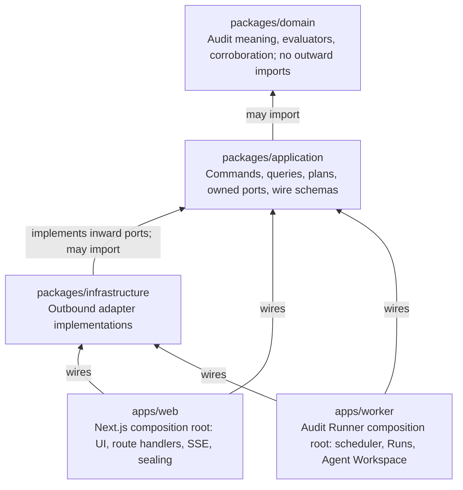
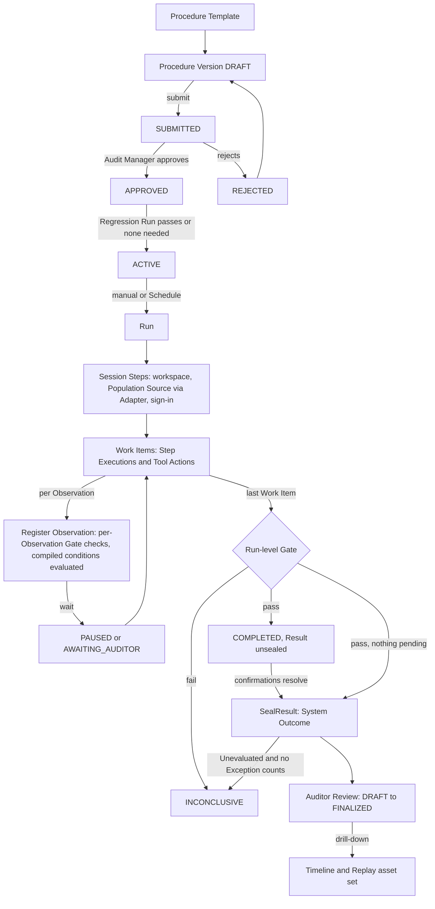
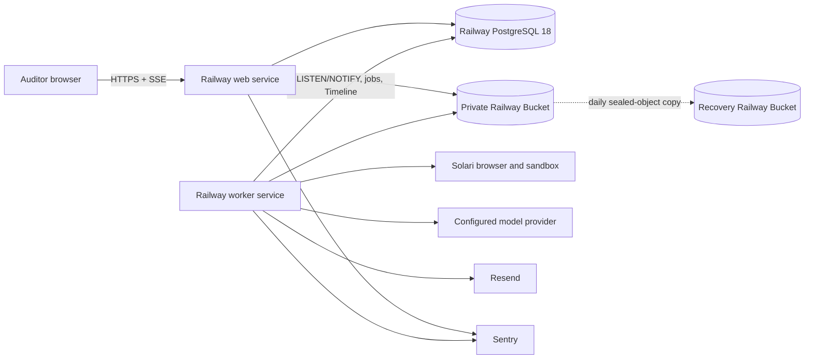

# Architecture Spine — Zobba

## 0. Owner-approved timing correction — 2026-09-04

Approval of a regression-gated successor records pending regression and its successor relationship without a speculative handover date. Actual activation after regression passes sets the authoritative boundary strictly after activation. The owner explicitly selected this behavior. This supersedes approval-time wording and invalidates prior downstream timing reviews: Story 2.8 and later Regression Run/scheduler contracts require revalidation. Execution and scheduler handover remain outside Epic 2.

### Owner-approved adapter retry policy — 2026-09-05

For adapter Work Items, AD-3's general retry/skip Escalation rule is superseded by one automatic additional bounded retry cycle after first exhaustion. A second exhaustion marks the Work Item `FAILED`; the Run continues and incomplete coverage yields `INCONCLUSIVE`. Each cycle uses the frozen retry bound and every attempt consumes Run budgets. Agent-driven Escalations, Session Step exhaustion and denied-action mappings remain unchanged. This aligns the architecture with addendum revision 3 and Story 3.8; prior downstream adapter retry reviews require revalidation.

### 0.1 Course correction — 2026-09-24/25

The owner approved a course correction in Proposals 1–4b (`../../course-correction-2026-09-24/`). The product, now named **Zobba** (formerly IntelliFin Audit), becomes a conversation-led audit harness: an auditor directs an Agent Task inside an Engagement; the agent works under versioned Agent Permissions through connectors, a sandbox and document processing; it produces evidence-linked artifacts that people review, approve and issue; and a method proven in a task can be promoted into an approved recurring check executed as a Run. The recurring-check path of revisions 1–4 is retained as compiler-1 and extended by compiler-2; both paths share one evidence, chain, wait and approval substrate. Revision 5 consolidates Proposals 3a–3d and the architecture-relevant parts of 4b. Each of AD-1..AD-23 keeps its text and carries a **Revision 5** verdict block (HOLDS, EXTENDED, AMENDED or SUPERSEDED IN PART; no AD is deleted); AD-24..AD-34 are new; the durable contract inventory is the companion `CONTRACT-REGISTER.md`.

`[ADOPTED by course correction 2026-09-24/25]` records that the owner approved the design. It does not say that anything is built or verified: approved design, implemented behaviour and verified behaviour stay distinct, deferred capabilities stay unavailable and the transitions that depend on them stay blocked. **No implementation is authorised.** Implementation stories (Proposal 5) establish each contract and the tests that demonstrate it; implementation selections must satisfy the contracts, and a material incompatibility goes through the scoped change process. Do not change application code or retire existing tests prematurely merely to make the planning documents pass; tests move with their corresponding implementation and legacy disposition.

Naming: product prose says **Zobba**, and the concept of the agent's bounded authority is **Permissions** after the owner's terminology correction of 2026-09-25 (Agent Permissions, Engagement Permissions, Permissions Policy, Permissions Version, Effective Permissions, Permissions Summary). Technical identifiers — `@intellifin/*` packages, `INTELLIFIN_*` variables, the repository, telemetry service names, `roles.ts` identifiers such as `poc-administrator`, and the folder names of planning artifacts — stay until the dedicated, compatibility-tested rename story (D-4b-1). Historical evidence, signed content and every identifier existing records depend on are never renamed.

| Decision | Approved choice (short form) | Carried in |
|---|---|---|
| D-3a-1 | RLS plus application filters, with role, transaction-context and migration safeguards | AD-8, AD-24 |
| D-3a-2 | Engagement and Agent Task beside `audit_run`; `audit_run.version_id` stays non-null; one-time work fully capable without promotion | AD-25 |
| D-3a-3 | Effective Permissions are an intersection of frozen and current authority, evaluated per operation | AD-26 |
| D-3a-4 | Worker-side credential broker; encrypt-only handoff from the callback; the OAuth transaction fully specified | AD-27 |
| D-3b-1 | Three sealing units: registration, task manifest, artifact-version approval binding | AD-5, AD-28, AD-29 |
| D-3b-2 | A concrete, documented, tested sandbox profile; network-disabled first delivery; `local` development-only, never a fallback | AD-30 |
| D-3b-3 | Authored formats `.docx` and `.xlsx`; PDF as export and input; approval binds the presented deliverable | AD-29 |
| D-3b-4 | Working material is never evidence in place; derivations retain their dependencies | AD-28 |
| D-3c-1 | Native tool-calling through the application-owned execution boundary | AD-31 |
| D-3c-2 | Scope-owned memory; lifecycle status separate from verification status | AD-32 |
| D-3c-3 | Skills and methodology packs as versioned tenant data under mandatory platform safeguards | AD-33 |
| D-3c-4 | A promoted check is a compiler-2 Procedure Version; the method is frozen; bounded `assist` steps | AD-23, AD-34 |
| D-3d-1 | A versioned, reviewed regression case set gates a compiler-2 version requiring regression | AD-19, AD-34 |
| D-3d-2 | Scoped approval authority and independent review, not a job title | AD-2, AD-7, AD-24 |
| D-3d-3 | Human-response windows for task waits, separate from action validity | AD-16, AD-25 |
| D-3d-4 | Compiler-1 authoring retired; read, verify, export and execution compatibility retained while compiler-1 work exists | AD-10, AD-23, Blocked transitions |
| D-4b-1 | Zobba and Permissions in product language now; technical rename in one compatibility-tested story | this section |
| D-4b-2 | Navigation per the Zobba pack; Reviews shown by responsibility and capability; complete attention view from the bell | AD-26 (visibility), UX spine |
| D-4b-3 | User-owned connections in the first release; organisation-managed connections deferred | AD-27 |
| D-4b-4 | Model and effort selection within administrator and disclosure policy, recorded per invocation; replacement for a check through versioned change control | AD-27, AD-31, AD-34 |
| D-4b-5 | Tenant roles Auditor · Audit manager · Admin; Admin manages methodology as configuration approval, never audit approval | AD-2, AD-24, AD-33 |
| D-4b-6 | WCAG 2.2 AA, automated and manual checks, no allowlist | AD-12, Consistency Conventions |
| D-4b-7 | The design pack's open questions decided individually (4b §6a) | UX spine; Q13 → `model-policy-v1` |

## Design Paradigm

Ports-and-adapters modular monolith; durable, asynchronous, human-interruptible execution on two paths — conversational Agent Tasks under versioned Agent Permissions, and approved recurring checks executed as Runs — over one evidence, chain, wait and approval substrate. The inward-owned audit model defines meaning and ports; two independently runnable delivery processes compose replaceable infrastructure around it. Runs and Agent Tasks are durable, asynchronous, and interruptible by a human at defined wait states.





The second diagram above is the compiler-1 Procedure Version and Run lifecycle, unchanged by revision 5. Revision 5 adds the Agent Task path and compiler-2 beside it, over one substrate:

```mermaid
flowchart LR
  subgraph taskpath[Agent Task path]
    eng[Engagement] --> conv[Conversation]
    conv --> task[Agent Task: step ledger, waits, receipts]
    task -->|every proposed operation| gate{Permissions gate}
    gate -->|allowed| ports[Connectors, CodeExecution, internal tools]
    gate -->|needs-clarification or needs-confirmation| twait[Task wait]
    ports --> art[Artifact versions: claims, review, approval, issue]
  end
  subgraph runpath[Recurring-check path]
    c1[compiler-1: Template, existing versions] --> pv[Procedure Version]
    method[Approved method artifact] -->|promotion, compiler-2| pv
    pv -->|scoped approval, activation, execution delegation| run[Run]
  end
  art -->|promotable-method| method
  subgraph substrate[Shared substrate]
    ev[Evidence: registration, acquisitions, derivations, manifests]
    chain[Audit chain per aggregate, envelope v2]
    waits[Durable waits and receipts]
    appr[Approval, independence, lifecycle records]
  end
  task --> substrate
  run --> substrate
```



## Invariants & Rules

### AD-1 — [ADOPTED] Strict inward dependency direction

- **Binds:** all source code and package boundaries
- **Prevents:** frameworks, vendors, persistence models, or delivery processes redefining the audit domain
- **Rule:** `domain` imports no outward layer; `application` imports only `domain`; `infrastructure` implements ports owned by `application` or `domain`; `apps/web` and `apps/worker` are composition roots. Business/application code must not import Drizzle, pg-boss, Solari, Vercel AI SDK, Resend, S3, Railway, Better Auth, Next.js, Pino, or Sentry types. Enforce these boundaries in CI.

**Revision 5 — EXTENDED.** Add to the forbidden-import list: Google and Microsoft SDKs, libsodium/HPKE libraries, the sandbox runtime client, document-processing libraries. Add rules `no-connection-broker-in-web`, `no-code-execution-in-web`, `no-connector-adapter-in-web` beside the four existing worker-only rules. *Trace:* 3a C4, 3b C8.

### AD-2 — [ADOPTED] The audit core owns product meaning and state

- **Binds:** Control, Procedure Template, Procedure, Procedure Version, Target System registration, Population Source binding, Run (Audit Assignment), Session Step, Work Item, Observation, Evidence Package, Evidence Quality Gate, Evaluation, Result, Exception, Escalation, Auditor Review
- **Prevents:** web screens, jobs, Adapters, the model, or database schemas becoming competing definitions of an Audit Run or a Procedure
- **Rule:** the domain model owns entities, value objects, lifecycle rules, and deterministic invariants. Application command handlers are the only mutation path. A Procedure Version is authored from a Template in the Builder by an Auditor and approved by an Audit Manager who is not its author; approval freezes the compiled plan, Population Source binding, Target System registration digests, per-condition applicability predicates and compiled/uncompiled status, confidence threshold, Evidence Requirements, model/prompt/tool configuration, limits, and Schedule. A Run carries `kind ∈ {STANDARD, REGRESSION}`: a `STANDARD` Run references only an `ACTIVE` version; a `REGRESSION` Run references the `APPROVED` version it gates (AD-19). A registration digest is SHA-256 over the RFC 8785 canonical JSON of exactly `{kind, allowed_origins | application_identity, credential_ref, permitted_actions, attribute_label_patterns, secondary_key}`, computed by one domain function owned by `registrations`; the configuration tuple compared for Regression gating is (model, prompt version, tool configuration, registration digests) against the most recent version of the same Procedure that reached `ACTIVE`, and a first version needs no Regression Run. The compiled plan is a versioned executable contract (AD-14) consumed byte-for-byte by the worker; the worker never re-derives. Any change to those fields, a platform-side model/prompt/tool change, or a referenced registration change mints a new `DRAFT` (platform-authored when the platform caused it); a Regression Run gates `ACTIVE` when configuration digests differ. Templates are data owned by the procedures module. Each module owns its repository ports and data; no module reads or writes another module's tables through an infrastructure shortcut.

**Revision 5 — AMENDED.** **Binds** gains: Tenant, Client, Engagement, Engagement Permissions, Agent Task, Task Step, Task Wait, Conversation, Connection, Source Snapshot, Acquisition, Working Material, Derivation, Artifact and Artifact Version, Claim, Memory Item, Methodology Pack, Skill, Execution Record. The sentence "A Procedure Version is authored from a Template in the Builder by an Auditor" becomes "A Procedure Version is compiled from an approved method artifact (compiler-2) or, for existing versions, authored from a Template (compiler-1); approval by an Audit Manager who is not its author freezes …" with the frozen list extended by the compiler-2 inputs (3c C12). "Templates are data owned by the procedures module" becomes "Templates and methodology are versioned tenant data (methodology packs); the procedures module owns the compiled Procedure Version". The approver sentence ("an Audit Manager who is not its author") is kept verbatim and gains D-3d-2's scoping: the approver must hold the capability, current tenant/client/engagement access, and the version's independence and review requirements; a pack may require stricter review within supported capabilities, and an unsupported stricter workflow is blocked, not approximated. Role scoping (D-4b-5): the approving capability belongs to the Audit manager role group; an Admin's approval of a methodology pack, skill or template is configuration approval (AD-33) and never approval of a Procedure Version, working paper, finding, report or recurring-check definition, and Admin authority alone confers no audit-review, audit-approval or issuance right. Independence evaluates the responsible human and human contributors, never a service identity. *Trace:* D-3a-2, D-3c-3, D-3c-4, D-3d-2, D-4b-5.

### AD-3 — [ADOPTED] Runs execute durably, asynchronously, and incrementally

- **Binds:** FR-16..FR-23, FR-29, FR-33, FR-34, FR-40, NFR-8, RunDispatcher, apps/web, apps/worker
- **Prevents:** long-running audit work inside web requests, duplicate business effects, irrecoverable partially completed Runs, and Gate or evaluation decisions that cannot be traced to the Observation that triggered them
- **Rule:** web commands create one durable job per Run; the worker executes the application-owned plan as ordered Session Steps and Work Items, each Work Item as Step Executions of Tool Actions. Every Tool Action and every state change appends a Timeline event in the same transaction as its effect, before anything else can observe it. At Observation registration the worker runs the per-Observation Gate checks and the deterministic evaluator for compiled conditions in one transaction; after the last Work Item it runs the Run-level Gate and `CompleteRun` commits the Gate decision, the Result, the Run state, final checkpoint, and audit events atomically, or none (publication and sealing per AD-21). Every stage is idempotent with a revisioned checkpoint; retry resumes at the first incomplete stage. One application retry policy owns the closed outcome mapping: at most 3 bounded-backoff retries per Step Execution, then a *retry or skip* Escalation, then Work Item `FAILED` on a second exhaustion; Session Step exhaustion, a denied action or scope violation (also a security event), and a during-Run integrity mismatch are `RUN_FAILED`; Run-level Step Execution, time, or token exhaustion is `INCONCLUSIVE` with partial Evidence preserved. Every Gate check outcome, with its diagnostic, is a Timeline event, and the Run-level Gate summary is a Timeline event; Adapter extractions may register Observations in batches, one transaction and one Timeline event per batch carrying the Observation digests. With pg-boss, Run state and dispatch commit in the same PostgreSQL transaction; a future dispatcher that cannot join it must use a transactional outbox. Run uniqueness for `STANDARD` Runs is enforced transactionally on `(Procedure, effective period)`; `InitiateRun` resolves the version from the period's ownership (AD-19) and refuses periods no version owns. `CancelRun` writes `cancel_requested` on the Run: the worker performs the `CANCELED` transition for `RUNNING`, `PAUSED`, and `AWAITING_AUDITOR` at the next Tool Action boundary or wake, and the web command performs it for `QUEUED` and cancels the dispatch job; every worker stage first re-reads Run state and stops on `cancel_requested`. An Escalation *abort* is a cancel with reason. `SealPackage` (AD-5) is invoked inside every terminal transition by whichever process performs it. Rerun always creates a linked new Run. Queue delivery never implies exactly-once business side effects.

**Revision 5 — EXTENDED.** The durability guarantees (one durable job, revisioned checkpoint, Timeline event in the same transaction, idempotent stages, first-incomplete-stage resume) apply equally to an Agent Task's step ledger: a tool call is a step; an external-effect step carries an operation identity, attempt identities and a dispatch claim committed before dispatch; outcomes are recorded per attempt. **Uniqueness is logical**: standard scheduled execution is uniquely identified by the scoped logical check (the Procedure) and its effective period, as revision 4 already says; succession resolves which approved version owns that period, so changing versions can never create a second ordinary scheduled execution for the same check and period; Regression Runs and explicitly authorised reruns have distinct identities and lineage. "In the same transaction as its effect" is scoped to **database state changes**: external I/O follows the intent, dispatch-claim and receipt protocol and never becomes transactionally atomic by this extension. *Trace:* 3a C2.

### AD-4 — [ADOPTED] Evidence acquisition is the product boundary, on two paths

- **Binds:** FR-3, FR-6, FR-7, FR-19..FR-21, FR-31, EvidenceAcquisition, BrowserExecution, DesktopExecution, ModelGateway
- **Prevents:** browser or desktop automation, Solari, an LLM, or a source protocol leaking into the audit model; and two acquisition paths producing two Observation shapes
- **Rule:** application use cases invoke an application-owned `EvidenceAcquisition` port that returns Observations in one canonical schema with structured provenance. Adapters implement it deterministically for Population Sources and file/API Target Systems, without a model; the Audit Agent implements it for web and desktop Target Systems through `BrowserExecution` and `DesktopExecution`. An Agent Workspace exists only for Runs with agent-driven Steps. Persist only opaque `CredentialRef` values; a `CredentialProvider` supplies a Source/environment-scoped credential just in time to the worker adapter and audits retrieval without secret values. No mutation capability is exposed through an inward port. The `BrowserExecution` and `DesktopExecution` conformance contracts govern origin/application allowlists, read-only actions, redirects and downloads, structural snapshot capture (accessibility tree or DOM for web; control tree for desktop), focused-record identity, sanitized Tool Action logging, cancellation acknowledgment, timeout accounting, and trace ordering. Execution adapters suppress Structural Snapshot and frame capture during credential-entry Tool Actions and redact secret-typed input values from every captured artifact before registration; an artifact found to contain a credential value fails registration, and a seeded negative test proves it. Solari's browser SDK implements `BrowserExecution` for the PoC with request interception denying traffic outside the Procedure allowlist. For `DesktopExecution` the Solari sandbox desktop provides session, action transport, screenshots, and stream only; control-tree snapshots and focused-record identity come from an in-VM snapshot agent that reads the synthetic LedgerDesk application's localhost JSON snapshot endpoint on a project-owned desktop template (no AT-SPI dependency), invoked through the desktop `exec`/`fs` actions immediately after the reading Tool Action. Building that agent is a prerequisite for any Rule-Classified desktop condition; a desktop attribute with no snapshot is declared model-read on the Procedure Version.

**Revision 5 — AMENDED.** "No mutation capability is exposed through an inward port" becomes "**No source-mutation capability is exposed through any port**: original received evidence, preserved snapshots and audited operational source records cannot be written through the Agent Permissions, a second-person approval, a connector, a script or a browser. Effects on other resources exist only as declared connector operations with an effect class (`read`, `draft`, `write-output`, `external-effect`) admitted per operation by the Permissions gate at the port call site." The two acquisition paths become three: deterministic Adapters, the Audit Agent's browser, and connectors (the browser is one connector). `CredentialProvider` stays for Run-path registrations; connections are a second, per-user credential source through the broker. The Solari sandbox desktop clause for `DesktopExecution` stays the compiler-1 design for the Epic 7 desktop path; it is not a stack selection until that epic reselects its provider (consolidation note 6). *Trace:* 3a C3, C4.

### AD-5 — [ADOPTED] Evidence is sealed, attributable, and tamper-evident

- **Binds:** FR-10, FR-13, FR-31..FR-35, FR-45..FR-47, NFR-3, EvidenceStore
- **Prevents:** overwritten evidence, unverifiable exports, and conclusions detached from their source observations
- **Rule:** application reserves each logical artifact in PostgreSQL with a stable idempotency key and unique provisional object key before upload. `EvidenceStore` conditionally creates that key, streams/hash-closes the object, and verifies availability, size, and digest before one transaction marks it Registered. Retries reuse the reservation/key and reconcile existing bytes; a periodic reconciler detects pending, orphaned, or missing objects. Artifact kinds are Structural Snapshot, screenshot, recording segment (a platform-stored frame sequence), source excerpt, Adapter extract, and uploaded Population Source file; all are artifacts under this rule, captured or stored by the platform and, where applicable, bound to the Tool Action that produced them. A manual upload is stored as a binding artifact at upload time and acquired by the Adapter through `EvidenceAcquisition` as the Run's initial Evidence item. Artifacts carry `role ∈ {required, replay}`: `required` artifacts (Evidence-Requirement snapshots and screenshots, source excerpts, absence snapshots, Adapter extracts) gate the package seal; `replay` frames follow the same idempotent registration, but a missing or failed frame is a Timeline `frame_missing` event flagged on Replay and export, never a Gate failure. `SealPackage` is an evidence-module command invoked in every terminal transition; a package seals only when every `required` artifact is Registered and verified, open reservations are marked `abandoned` and listed on the Result and export, and any unresolved mismatch blocks evaluation and follows addendum H. Sealing makes metadata immutable. Authorized reads/exports receive application-mediated access of at most five minutes and never raw bucket credentials or durable URLs; every consumption verifies SHA-256. A post-Run integrity mismatch is an audit event and a flag on the Result and export, never a state change.

  A Workpaper Bundle is exportable for any terminal Run as one archive with a fixed layout: a signed `manifest.json` at the root (AD-22), `keys/` holding the public verification bundle, `artifacts/<sha256>` for every preserved input, Structural Snapshot, screenshot, and Replay frame addressed by digest, and versioned JSON members for the Procedure Version, Observations with grounding, per-condition evaluations with origin and confirmation history, Escalations and answers, Timeline, reviews, and the audit excerpt, so reproduction needs neither live Sources, the Workspace Provider, nor source-code access. Railway provides platform storage encryption at rest but no S3-style SSE, versioning, or object lock; the PoC is tamper-evident, not WORM-certified.

**Revision 5 — EXTENDED.** Reservation keys are owner-namespaced (`run`, `task`, `artifact-version`); kinds are extended by name (source-snapshot, extraction-record, derived-output, generated-document, execution-log); three sealing units (registration, task manifest, artifact-version approval binding); content identity and acquisition identity are separate records; deletion follows the retention contract (decision, holds, dependencies, availability status). The Workpaper Bundle gains an engagement export: tasks, artifact versions with claims and citations, derivations with retained method objects, acquisition records, quality assessments, memory items relied on, and the ownership bindings, verifying with no other tenant's rows. **Path scoping:** revision 4's "sealing only after every required artifact is registered and verified" keeps its meaning for compiler-1 Runs; a Task's terminal manifest may be empty or incomplete and says so, and compiler-2 evidence contracts use the generalised requirements with completeness, support, review and execution outcomes kept separate. Legacy bytes are verified under their **original** envelope and canonicalisation before any projection or upcast; a v1-to-v2 reader manufactures no historical tenant binding and never verifies transformed bytes as the original signed material. *Trace:* 3b C5, C6, C7; 3a C1.

### AD-6 — [ADOPTED] Grounded, corroborated Observations gate deterministic per-condition evaluation

- **Binds:** FR-9, FR-20, FR-31, FR-33, FR-36..FR-40, addendum B.1, E, H
- **Prevents:** false assurance from uncorroborated agent assertions, unproven absence, silently skipped conditions, and model-generated control conclusions
- **Rule:** every Observation attribute carries grounding (Evidence id, locator, field label, extracted text) into a Structural Snapshot or file Evidence item, never a screenshot or recording; `found = true` Observations carry an identity attribute grounded in the same Structural Snapshot as each value attribute (one identity grounding per snapshot when attributes span several); platform key matching over search-result rows is a separate `match` provenance node (candidate-rows snapshot, matched-row locator, key compared) required in addition to page identity, and for `match_origin = human-matched` identity corroboration compares the declared secondary key re-read from the page snapshot and is never skipped; Absence evidence is defined per `capture_method`: for the agent, the query string is the sanitized `type` Tool Action into the search control the registration declares by locator pattern, the empty-result page is a Structural Snapshot, and completeness is all result pages consumed; for an Adapter, every lookup or extraction is an Adapter Action on the Timeline with the same sanitized-action schema, the query string is the request key recorded by the platform from the request, the empty result is the stored response artifact, and completeness is the addendum H extraction check. A `found = false` Observation missing its path's absence fields makes the Work Item (agent) or the record (adapter batch) `UNINSPECTED`; an adapter batch Work Item is `OBSERVED` only when every covered record has an Observation with `found ∈ {true, false}`. The domain owns a deterministic corroboration function that re-reads value, label, and identity from the stored snapshot; a mismatch marks the attribute contradictory and the record Unevaluated. Every Compliance Rule condition carries a compiled applicability predicate; the deterministic evaluator applies compiled conditions per applicable record at registration and records origin `RULE`; uncompiled conditions are evaluated by the agent and recorded with origin `AGENT_JUDGED`, confirmation `pending`, and a confidence in [0, 1]; below the version's confidence threshold the evaluation is stored with value `UNEVALUATED`, origin `AGENT_JUDGED`, confidence retained, and no confirmation required; a human rejection replaces a pending evaluation with origin `HUMAN` and retains history. Unevaluated is a value with an origin. The compiled condition and applicability-predicate expression is a versioned `application` contract (AD-14) with one domain interpreter shared by the Builder preview, the Regression comparison, and the worker evaluator; predicates evaluate over `found`, `match_origin`, and normalized values of attributes whose corroboration is `matched`; a predicate referencing an absent, `contradictory`, or `model_read` attribute evaluates applicable (fail-closed) and the condition's evaluation is `UNEVALUATED` with a diagnostic; `found = ambiguous` makes every condition applicable and Unevaluated; model-read attributes may not appear in predicates. The Observation registration envelope carries the agent's evaluations for every uncompiled applicable condition, and registration is one transaction. The evaluation module creates an Exception in the transaction that records the first `EXCEPTION` evaluation for a record, assigns its Run-stable identifier and fingerprint then, and never deletes it; `counts_toward_outcome` is computed at `SealResult` (true when any current `EXCEPTION` evaluation has origin `RULE`, confirmed `AGENT_JUDGED`, or `HUMAN`; an Exception whose every `EXCEPTION` evaluation was rejected is retained with `counts_toward_outcome = false`), and `review` assignment and disposition are permitted only after sealing. At the Run-level Gate any current `UNEVALUATED` evaluation whose origin is not `HUMAN` is a condition-completeness failure → `INCONCLUSIVE` at `CompleteRun`; only human rejection introduces `UNEVALUATED` after `COMPLETED`. Per-Observation checks are: grounding present, required Evidence, identity and value corroboration, absence completeness, unnamed value, ambiguous match, and Target System freshness; condition completeness and the remaining addendum H rows run at Run level, because an uncompiled condition's evaluation may arrive later in the Work Item. A compiled condition over a model-read attribute is applied by the deterministic evaluator to the model-read value and recorded with origin `AGENT_JUDGED` and the agent's read confidence. Agent output is Evidence and evaluation input, never the System Outcome. Exceptions receive an environment-scoped HMAC-SHA-256 fingerprint over canonical Procedure/condition identity and normalized business keys, with key ID retained. Comparisons are valid only across versions declared compatible at approval — same Procedure, same matching key, same Compliance Rule digest (addendum B) — and a scheduled Run's predecessor for change comparison is the previous period's Run of the same Procedure.

**Revision 5 — EXTENDED.** Grounding widens from record Observations to **claims**: a factual claim cites evidence at a locator with a provenance class and carries a platform-owned support status (`supported`, `unsupported`, `contradicted`, `pending-review`, `not-machine-checkable`); deterministic corroboration decides exact checks, human review decides proposed interpretations; the four check kinds (integrity, reproducibility, analytical validation, audit assessment) are separate records. Substrates gain `pdf`, `doc`, `mail`, `image`. **Path scoping:** revision 4's "never a screenshot or recording" grounding rule keeps its meaning for compiler-1 record Observations; claims under `artifact-version-v1` may be corroborated visually against the preserved page image or by the human review the pack requires, with the distinct statuses 3b approved, and an implementer never chooses between the two sentences because each names its path. *Trace:* 3b C6, C7, C8.

### AD-7 — [ADOPTED] Human decisions are separate, attributable, revision-guarded state

- **Binds:** FR-2, FR-13, FR-25..FR-27, FR-38, FR-40..FR-44, Auditor, Audit Manager, PoC Administrator
- **Prevents:** reviewers rewriting machine outcomes, identity-provider roles becoming audit authority, and human input reaching the agent as instruction
- **Rule:** immutable sealed System Outcome, per-condition evaluations, and review/disposition state are separate aggregates. Procedure Version, Run, Result (sealing and version), Auditor Review, Exception, and Work Item transitions follow the state machines in Consistency Conventions; every transition records actor, time, prior state, decision, rationale, and aggregate revision. Mutations — including confirmations, Escalation answers, pause/resume, and dispositions — require the expected revision. Rejection of a Result is an event returning `SUBMITTED → DRAFT`. Finalized freezes the Result, evaluations, Exceptions, dispositions, Reviews, Timeline, and Evidence against all later commands. Better Auth establishes identity/session only; application-owned roles authorize every command, query, Evidence read, export, and Live View stream. Initiation snapshots the human authorization decision; the worker executes the approved Run as a service principal and records initiator and execution principal. Later role revocation blocks new human actions but does not silently cancel a Run. Free text from humans (Escalation notes, rationale) is stored and audited and is never passed to the model. Fields designated sensitive on the Population Source binding are masked in list views and unmasked only in Exception Detail and exports for Auditors and Audit Managers, each unmasked read audited. Submission for Auditor Review requires a sealed `COMPLETED` Result.

**Revision 5 — SUPERSEDED IN PART.** "human input reaching the agent as instruction" (Prevents) and "free text from humans … is never passed to the model" (Rule) are retired. Replacement: *auditor free text is model input on a request channel and never authority; authority changes only through typed, attributable, revision-guarded commands.* **External-effect confirmations** are bound to the exact operation through the typed decision and receipt mechanism; external content or vague assent cannot satisfy them. **An authenticated user's explicit instruction to retain information** is itself the recorded confirmation `memory-v1` permits when the user has authority over that scope — no redundant prompt. Revision 4's "later role revocation does not silently cancel a Run" is **qualified**: approval freezes the authorised definition and preserves its historical, attributable decision (the approver's later role change does not unsign it); runtime operations remain subject to current execution delegation, membership and grants, administrator restrictions, connection state, resource restrictions and disclosure policy; revocation prevents affected new dispatches and produces the recorded stop or recovery state, and it neither rewrites the historical approval nor claims to undo a dispatched effect. Independence checks evaluate the responsible human and human contributors, never a service identity. Role note (D-4b-5): the initial tenant roles are Auditor, Audit manager and Admin (AD-24); the "PoC Administrator" named in **Binds** is displayed "Admin", and its stored identifier `poc-administrator` stays until the rename story (D-4b-1). Preparers may self-check and revise their own work and cannot satisfy a required independent review or approval of work they authored or substantively contributed to; role changes cannot erase authorship or contributor history. *Trace:* 3a C2, 3c C9, C10, D-3d-2, D-4b-5.

### AD-8 — [ADOPTED] PostgreSQL is the transactional system of record

- **Binds:** repositories, lifecycle state, checkpoints, Timeline, provenance, audit trail, Schedules, notifications, pg-boss dispatch
- **Prevents:** split-brain lifecycle state, a second real-time store, and infrastructure-specific queries spreading through the core
- **Rule:** PostgreSQL owns relational product state, the Timeline, Schedules, notification records, and queue state; Drizzle repositories implement inward-owned ports and explicit reviewed migrations change schema. An application-owned `UnitOfWork` may coordinate multiple module repositories on one shared PostgreSQL transaction without exposing tables or Drizzle inward. Binary evidence remains in `EvidenceStore`. State snapshots and append-only transition/audit/Timeline events update in the same transaction. Direct database access is confined to infrastructure adapters and migration tooling.

**Revision 5 — EXTENDED.** The runtime connects as a `NOSUPERUSER NOBYPASSRLS` role that owns no table; every protected table has forced RLS with a scoped permissive grant policy and restrictive boundary policies; ownership columns are immutable by trigger; the migrator owns DDL. Every scoped transaction runs inside the principal wrapper. *Trace:* D-3a-1, 3a C1; detail in AD-24.

### AD-9 — [ADOPTED] Agentic execution is bounded, typed, replayable, and provider-neutral

- **Binds:** FR-23, FR-27, FR-29, FR-30, NFR-2, NFR-4, ModelGateway, BrowserExecution, DesktopExecution
- **Prevents:** provider lock-in, prompt injection expanding scope, an open channel from retrieved content or humans to the agent, and untraceable model behavior
- **Rule:** `ModelGateway` and tool ports use application-owned request/result types and one conformance contract for ordered tool calls, cancellation, timeout/token accounting, structured uncertainty, and terminal failures. Each Procedure Version fixes allowed origins and applications, read-only tools/actions, Step Execution/time/token limits, objective, model data policy, and cancellation checks; retrieved content cannot change them. Escalations are typed application objects with closed answer sets — *choose candidate*: pick by the version's declared secondary key or mark ambiguous; *unnamed value*: mark Unevaluated and continue, or abort; *retry or skip*: retry, skip, or abort — where *unnamed value* and *retry or skip* are raised by the platform and *choose candidate* only when platform key matching finds no unique grounded row; no answer evaluates a record Compliant or Exception or changes scope, credentials, tools, or the Compliance Rule; the agent receives the chosen option identifier and nothing else. Agent narration is agent output; platform-derived step descriptions from sanitized Tool Actions are the trusted narration source, and any agent narration shown is labeled as such. Only minimized/redacted fields permitted by the model data policy leave for a provider whose retention, training, and residency configuration is accepted. The PoC uses direct OpenAI and Anthropic provider adapters. Persist provider route, provider/model identity, model configuration, Procedure/prompt versions, deployed build version, sanitized tool activity, limits, and terminal reason. Agent narration, questions, and rationales are stored as untrusted content and rendered inert; traces are redacted before persistence, display, or export. The platform-owned Replay asset set (per Tool Action: frame, sanitized action, Observation delta; per Escalation; per Session Step) is captured during execution so Replay never needs the Workspace Provider. Exhaustion or uncertainty fails safely. Model selection remains benchmark configuration, not an AD.

**Revision 5 — AMENDED.** "Each Procedure Version fixes allowed origins … read-only tools/actions … retrieved content cannot change them" becomes "**Agent Permissions** (administrator ceiling ∩ auditor grants ∩ engagement scope ∩ delegation ∩ connection state, evaluated per operation) fixes tools, resources, effect classes, budgets and confirmation requirements for a Task; a Procedure Version freezes them for a Run's **definition**, and the Run's execution remains subject to the current execution delegation, grants, connection state and disclosure policy at every claim and dispatch (the AD-7 qualification). Retrieved content, memory, skills and conversation cannot change them; the model sees a Permissions Summary, never the Permissions documents." The closed Escalation answer sets stay for the Run path; the Task path adds `clarify`, `confirm-action` and `reconcile` waits whose free-text answers are data. Native tool-calling under the application-owned execution boundary; prompt injection stays a residual risk evaluated behaviourally. The closing sentence "Model selection remains benchmark configuration, not an AD" is qualified by 4b §6: on the task path model and effort selection is governed by `model-policy-v1` and `disclosure-policy-v1` (AD-27) and recorded per invocation (AD-31); a scheduled check's model configuration is frozen on its version (AD-34); choosing defaults remains configuration. *Trace:* 3a C3, 3c C9, D-3c-1, D-4b-4.

### AD-10 — [ADOPTED] Operational telemetry and product audit evidence are distinct

- **Binds:** NFR-1, NFR-10, NFR-12, web, worker, external providers
- **Prevents:** logs being mistaken for audit evidence and loss of cross-process diagnosability
- **Rule:** propagate one correlation chain across request, Run, job, Session Step, Work Item, Tool Action, provider call, Evidence capture, notification, and SSE stream. All logs/traces pass through one allowlist-based telemetry sanitizer: code-owned scalar fields only, static Pino redaction, Sentry `sendDefaultPii: false`, AI input/output capture disabled, and scrubbed events/spans/breadcrumbs. Raw provider objects, Evidence, tool payloads, snapshots, credentials, and signed URLs are forbidden; seeded negative tests enforce this. Diagnostics (Target System connectivity, Workspace Provider and Audit Runner health, latency, limit consumption) are rows the worker writes and the web reads; the web process never probes Target Systems or providers. Immutable product audit events (chained per AD-22) cover security/configuration, authoring and approval, Schedule, execution, waits and answers, transformation, Evidence access/denial, signed-access issuance, notification delivery, export, errors, review, and disagreement with actor/agent/Adapter, Source/artifact, decision, UTC time, session identifier, and correlation ID — never the access token itself.

**Revision 5 — EXTENDED.** Correlation extends to engagement, task, step, connector call, sandbox execution and memory operation; the sanitizer's forbidden list gains provider continuation items, tokens, sealed envelopes and program stdout/stderr. "The web process never probes Target Systems or providers" gains "and never composes an execution model; the authoring assistant's model composition in the web is retired with the Builder (Proposal 7)". `ModelGateway` remains in the worker for retained compiler-1 **execution** as well as derivation, under the current security boundaries, until D-3d-4's transition completes. Invitation secrets join the forbidden list (FR-95). *Trace:* 3c C9, Proposal 7, D-3d-4, 4b §7.

### AD-11 — [ADOPTED] Deployment remains replaceable

- **Binds:** PoC environments, Railway, NFR-8, NFR-10, NFR-11, NFR-13..NFR-15
- **Prevents:** PoC hosting becoming a product boundary or blocking a future private/customer-hosted runner
- **Rule:** ship web and worker as separate container processes from one repository; configuration and secrets enter only their infrastructure composition roots. The single-tenant synthetic PoC uses Railway services, `ghcr.io/railwayapp-templates/postgres-ssl:18`, and a credential-private S3-compatible bucket over its public endpoint; verify `server_version` at bootstrap. Operations — not Railway — own tuning, backup, monitoring, and restore. Daily PostgreSQL backups and a daily copy/inventory of sealed Evidence plus public verification keys to a separately credentialed recovery bucket form one recovery unit; recovery credentials are unavailable to web/worker. Restore drills reconstruct a sealed finalized Run and verify every object digest, audit-chain link, and signature against the 24-hour RPO/eight-hour RTO target. Retain PoC data for its lifetime and delete only through documented teardown. Core runtime majors are Node.js 24 LTS, Next.js 16, and PostgreSQL 18. Production/customer storage, tenant isolation, residency, and key management require new adopted decisions.

**Revision 5 — AMENDED.** "The single-tenant synthetic PoC" becomes "The PoC is multi-tenant by construction from the first scoped migration (tenant, client, engagement); the owner's synthetic tenant is the first". The sandbox backend is a separate process or VM selected and documented per D-3b-2; `local` execution and `local` workspace modes are development-only. Recovery units gain the ownership bindings and the retention ledger. *Trace:* D-3a-1, D-3b-2.

### AD-12 — [ADOPTED] Tests defend domain and adapter seams

- **Binds:** all packages, CI, four PoC Templates and their golden datasets
- **Prevents:** coding agents introducing dependency inversions, nondeterminism, or silently incompatible adapters
- **Rule:** deterministic domain/evaluator/corroboration tests use frozen fixtures including the addendum D seeds (transcription error, wrong-page identity, wrong-element label, mistyped key, silent timeout, injection via Escalation, the three scope-widening instructions); golden datasets, expected terminal outcomes, and confirmation scripts are versioned product data on each Template (AD-19) and are mirrored into `tests/fixtures` from that source; every outbound port uses one shared conformance suite. Repository, atomic publication/dispatch, crash points around upload/register/checkpoint/seal, wait-state resume, retry/failure budgets, optimistic concurrency, canonical vectors, Regression Run comparison, and full recovery run against real PostgreSQL/object-storage-compatible test infrastructure. Replay must pass with the Workspace Provider blocked at the network. Playwright covers Builder submission through approval, Run initiation, Live View with pause and an Escalation answer, review/export, keyboard access, and automated WCAG 2.2 AA checks. CI runs type checking, dependency-boundary checks, migrations, unit, integration, critical end-to-end, security-negative, and NFR acceptance tests.

**Revision 5 — EXTENDED.** Conformance suites gain: connector (per adapter, with the hostile fake), sandbox negatives against the deployed profile, pack-schema validation, the mutation harness on the agent loop's one call site, the isolation suite with positive and negative cases, the behavioural injection evaluations reported per model and prompt version. Golden datasets stay per compiler-1 Template; compiler-2 baselines follow D-3d-1. The accessibility level is **WCAG 2.2 AA** (D-4b-6) — updated in place in the rule text above — with automated and manual checks and no allowlist of accepted violations, applied to every new flow (model picker, invitation and sign-in, review notes, panel interactions), including 2.2's dragging alternatives, redundant entry and accessible authentication criteria. *Trace:* 3a–3c verification sections, D-4b-6.

### AD-13 — [ADOPTED] PoC thesis evidence is product data

- **Binds:** FR-50, success metrics SM-1, SM-4, SM-11
- **Prevents:** a technically functioning demo that cannot establish setup effort, repeatability, or reusable product value
- **Rule:** capture authoring and approval time, Escalations and interventions per Run, false-positive dispositions, approval and rejection counts, tokens and Workspace Provider time per Run, procedure-specific code, reusable versus procedure-specific components including Adapters, Run-to-Run consistency, and maintenance effort including Regression Runs as structured Run/Procedure metrics queryable across the four Templates.

**Revision 5 — EXTENDED.** Metrics gain engagement and task scope: turns, tool calls, waits, corrections, proposals confirmed or rejected, promotions, and the four Result statuses for scheduled runs. Model and effort usage and cost are reportable to administrators by engagement (4b §6, Q15). *Trace:* Proposal 6, 4b §6.

### AD-14 — Durable contracts are explicitly versioned

- **Binds:** jobs, checkpoints, Observations, Structural Snapshots, Timeline events, Replay assets, Escalations and answers, notifications, Templates, compiled plans, audit events, manifests, Workpaper Bundles
- **Prevents:** separately deployed producers and consumers accepting TypeScript types yet disagreeing on durable bytes or graph semantics
- **Rule:** `application` owns a Zod wire schema and explicit `schemaVersion` for every serialized boundary, plus upcasters for the supported compatibility window. Changes are additive within a rolling release; unknown additive fields are ignored, required-field removal/semantic change requires a new version, and old-producer/new-consumer plus new-producer/old-consumer fixtures run in CI. Canonical provenance is a directed graph with stable IDs for artifact, snapshot, Source record, Observation, attribute grounding, transformation, match, condition evaluation, Escalation, and Exception; edges, cardinality, ordering, ambiguity, exclusion, origin, and original/normalized representation are normative fixtures, not reconstructed from logs.

**Revision 5 — HOLDS.** New envelopes (task step, Permissions documents, connector call and result, memory item, artifact version, derivation, execution record, audit-event envelope v2, model invocation record, model policy) follow it. The provenance graph gains `acquisition`, `derivation` and `claim` node kinds and the `transformation` node AD-14 named is implemented as `derivation`. *Trace:* 3b.

### AD-15 — Releases preserve active Runs and durable data

- **Binds:** web/worker deployment, PostgreSQL migrations, durable jobs, waiting Runs, rollback
- **Prevents:** a valid new web build, old worker, and migrated schema becoming mutually incompatible during rollout, or a waiting Run losing its resume path
- **Rule:** the release pipeline alone applies migrations; web and worker never auto-migrate. Use expand → migrate/backfill → deploy backward-compatible web/worker → drain old workers → contract in a later release. Each process checks supported schema and contract ranges at startup and refuses incompatible operation. Durable jobs, checkpoints, wait states, Schedules, and compiled plans remain consumable through the declared compatibility window; a Run in `PAUSED` or `AWAITING_AUDITOR` must resume on a new worker build; rollback may not cross a destructive migration or unsupported contract version.

**Revision 5 — EXTENDED.** Applies to waiting Tasks; the scoped migration's drain-and-revalidate step (3a C1 f) and the `SUPPORTED_SCHEMA_MIN/MAX` move are release rules; the expand step is the last reversible point before RLS is forced. *Trace:* 3a C1.

### AD-16 — Human-in-the-loop waits are durable Run states

- **Binds:** FR-18, FR-24..FR-27, addendum E, RunDispatcher, apps/worker
- **Prevents:** a worker process holding an in-memory wait, a lost workspace on restart, two answers applied to one Escalation, or the web process deciding timeouts
- **Rule:** `PAUSED` and `AWAITING_AUDITOR` are persisted Run states with a checkpoint, an open wait record (kind, options, deadline), and a workspace lease. Deadlines are 30 minutes for `PAUSED` and 4 hours for `AWAITING_AUDITOR` (PRD assumptions). Exactly one durable job exists per wait, created in the wait-entry transaction with `startAfter = deadline` and singleton key `wait:<wait id>` (pg-boss has no release primitive, so the worker completes the current job in the same transaction); the Agent Workspace stays alive under a lease to the deadline. Every closure — answer, resume, cancel, abort — is one application command that, in one transaction, locks the wait row, requires it open and the expected Run revision, writes `{closed_at, closure_kind, answer_option_id, actor}` on the wait record (the Escalation references the wait and never holds the authoritative answer), and moves the wait job's start to now; a second closure fails the precondition. The wake handler locks the same row and applies exactly one of: closed → act on `closure_kind`; open and past deadline → `INCONCLUSIVE` with Evidence preserved; open and early → reschedule. The job payload is `{schemaVersion, runId, waitId}` only. Every terminal transition and a periodic sweep reap orphaned workspaces and revoke their credentials (NFR-5). The checkpoint carries the workspace lease identity (provider session identifier). On wake the worker enforces the deadline (`INCONCLUSIVE` with Evidence preserved) and, on resume, reattaches to the leased workspace (`attach(WorkspaceRef)` preserving the signed-in session and `release` are conformance requirements of both execution ports) and restarts the current Step Execution from its first Tool Action as a new attempt not charged to the retry budget, the earlier attempt's Tool Actions remaining on the Timeline marked `superseded_by_resume`; no model conversation state is persisted across a wait and the model is re-briefed from the frozen plan, the Work Item, and the chosen option identifier; if the workspace is gone, it re-runs the sign-in Session Steps for the current Target System under the Session Step retry budget, records the reattach on the Timeline, and continues; exhaustion is `RUN_FAILED`. Pause applies at the next Tool Action boundary and is refused while a Run is awaiting an answer.

**Revision 5 — AMENDED.** "No model conversation state is persisted across a wait and the model is re-briefed from the frozen plan" becomes "Conversation and turn state are persisted, encrypted and re-fed on resume; **no authority is carried in conversation state**: Effective Permissions are re-derived from the Agent Permissions and the delegation at every resume". Wait kinds gain `clarify`, `confirm-action`, `reconcile`; the one-open-wait rule applies per task; response windows per D-3d-3, separate from action validity and from external-operation reconciliation; a task wait holds no execution claim or workspace lease. Run-path deadlines and the workspace lease rule are unchanged for their legacy scope. *Trace:* 3a C2, 3c C9, D-3d-3.

### AD-17 — The Timeline is the single live-state source; SSE fans it out

- **Binds:** FR-24, FR-29, FR-30, FR-48, NFR-7, apps/web, apps/worker
- **Prevents:** a second real-time store, Live View and Replay drifting apart, and clients missing events on reconnect
- **Rule:** live state is read only from Timeline events in PostgreSQL. Timeline events are the Run aggregate's AD-22 chain events; `seq` is the chain sequence allocated under the Run head row lock, gapless and commit-ordered across web and worker writers, and the writer issues one `NOTIFY` per appended event in the same transaction carrying Run id and sequence; a web route handler streams Server-Sent Events per Run to authorized clients, using the last-seen sequence as cursor and replaying `seq > cursor` in order from the Timeline on reconnect, never skipping; the Runs dashboard uses the same channel per list. Live View and Replay share one renderer over the Replay asset set; a live frame is a Replay asset the moment it is registered. Streams send a heartbeat comment at most every 30 seconds, cap their own lifetime below 15 minutes so reconnects are planned rather than proxy-forced (Railway closes responses after 5 minutes idle and 15 minutes total), and tear down their LISTEN subscription on request abort. Subscribing surfaces are Live View, Run Detail while the Run is active, the Runs list, Overview counts, and the notification badge; other surfaces are request-time reads. No WebSocket server, Redis, or provider stream is a source of truth. Revisit if fan-out exceeds one web instance.

**Revision 5 — EXTENDED.** The live channel serves any chained aggregate: `/api/runs/<id>/events`, `/api/tasks/<id>/events`, `/api/engagements/<id>/events`, same cursor, replay and heartbeat rules. Task streams carry the step ledger envelope, never payloads. *Trace:* 3a C2.

### AD-18 — One Observation contract for Adapters and the Agent

- **Binds:** FR-6, FR-7, FR-21, FR-22, FR-31, FR-33, addendum B.1, C
- **Prevents:** adapter-acquired and agent-driven Target Systems producing Observations the Gate and evaluator treat differently, and per-record coverage computed over inconsistent units
- **Rule:** both paths emit the application-owned Observation schema with `capture_method`, grounding, identity attribute, and `match_origin`. Work Items are one per record per agent-driven Target System unless the Template's coverage rule declares one per page or extraction (addendum C, P-4), and one per extraction for adapter-acquired Target Systems; each Work Item owns one Observation per record it covers, and `found` may be `true`, `false`, or `ambiguous`. Per-record coverage and Run-level completeness are computed over Observations. Expected field labels and the secondary matching key are declared on the Target System registration and frozen by digest into the Procedure Version, which is the authority at Run time; an agent-extracted declared count (ProdConsole) is reconciled by the Gate like any other. Population parsing and inclusion filtering are Adapter (platform) work; an agent's reading of a file is never the population of record. Reference Sources are acquired by an Adapter as a Session Step, registered and digest-recorded as artifacts under AD-5, and frozen into the Evidence Package before evaluation; the evaluator receives their parsed content as an input value and performs no I/O; they produce no Work Items. Structural Snapshots and screenshots are captured by the execution adapter, bound to the reading Tool Action with URL or window title; the Structural Snapshot contract enumerates substrate kinds `{web_tree, desktop_tree, sheet, json}`, each with a locator grammar and a label rule (accessible name; control name; header cell; property key path); the domain extractor implements all four, reads stored snapshots only, and the Gate never skips corroboration by `capture_method`.

**Revision 5 — HOLDS (scope-limited).** One Observation contract for the Run path. For document work the safeguard sentence stays: an agent's reading of a file is never the population of record; derived outputs are registered through their own derivation seam. *Trace:* 3b C6.

### AD-19 — Schedules are application data executed idempotently

- **Binds:** FR-11, FR-14, FR-15, FR-17, NFR-9, apps/worker
- **Prevents:** duplicate or skipped scheduled Runs, two versions running the same period, and the queue library becoming the Schedule of record
- **Rule:** a Schedule (frequency, fixed UTC start, period derivation) is frozen on the Procedure Version. A worker-side scheduler polls due Schedules and enqueues one Run per (Procedure Version, effective period) under a unique constraint, recording the derived period and initiator; a missed or failed start is recorded as an event and surfaced, never skipped silently. Approval requiring regression records pending regression and the successor relationship with no speculative date. `handover_at` is computed once by the command that actually activates the successor (approval when no regression is needed, activation after `RegressionPassed` otherwise) as the first period start (per the successor's Schedule) strictly after activation and stored on both versions; the predecessor owns every effective period starting before `handover_at` and the successor every period starting at or after it; the scheduler performs `ACTIVE → RETIRED` for the predecessor, with actor "Schedule", in the transaction that enqueues the first Run the successor owns or on the first tick after `handover_at`. A `REGRESSION` Run is started only by the approval command when configuration digests differ, runs on the `APPROVED` version with the Template's golden Population Source binding substituted for that Run only and the version's frozen registrations kept (golden Target System fixtures are the synthetic systems seeded with the golden dataset), is exempt from the overlap rule, never enters Review, never notifies, is labeled on the dashboard and recorded on the version; the approver confirms its Agent-Judged evaluations from the Template's confirmation script; the procedures module compares terminal outcome and evaluations to the golden expectations, every expected terminal outcome must reproduce except records addendum D exempts, and it records `RegressionPassed | RegressionFailed` on the version; only `RegressionPassed` (or no regression needed) moves `APPROVED → ACTIVE`. Manual initiation targets the version owning the requested period; a `once` Schedule creates no scheduler entry and is run manually. Reference Sources are acquired at Run start, before any Work Item. pg-boss cron may drive the poll tick but is never the Schedule of record.

**Revision 5 — EXTENDED.** A promoted check's Schedule is frozen on its compiler-2 Procedure Version; scheduled Runs execute under an execution delegation created at activation. **Regression (D-3d-1):** a version requiring regression is gated by a versioned, reviewed regression case set bound to the candidate with its comparator; expected results come from validated and reviewed outputs, never from whatever the candidate produces; the successor's review identifies expected differences from the predecessor with their justification, so regression checks equivalence where required and the approved new expectations where behaviour intentionally changes; byte comparators, semantic comparators and model-behaviour evaluations stay distinct and a passing replay proves the properties tested, not universal correctness. Regression over retained evidence uses the bound inputs and never substitutes live sources; external-effect operations are excluded; connector compatibility and live acquisition are tested separately against designated synthetic resources. Regression requirements come from the platform minimum, the applicable methodology and the approved configuration-change rules — a pack cannot waive a platform-required gate, and no universal extensive suite is imposed on every ordinary first activation. Missed starts, handover under succession and drift detection are later epics with their transitions blocked until built. A model or effort replacement for a promoted check is a proposed configuration change through this gate (AD-34); a check shows "Awaiting approval" until approved and "Pending regression" while a regression requirement is unmet, and has no next run while either holds. *Trace:* D-3c-4, D-3d-1, D-4b-4, 4b §5 rows 2–3.

### AD-20 — Notifications are audited product events behind one port

- **Binds:** FR-27, FR-28, FR-45, NotificationSender
- **Prevents:** email becoming an unaudited side channel or carrying Evidence
- **Rule:** entering `AWAITING_AUDITOR` or an Auditor flag creates notification records for the initiating Auditor (or Procedure author for scheduled Runs) and every Audit Manager in the same transaction as the state change; version submission notifies every Audit Manager and approval or rejection notifies the author, in-app only `[ASSUMPTION]`; a worker delivers them through `NotificationSender` (one email provider adapter) with at-least-once delivery and idempotent send keys, locks the wait and skips delivery as `superseded` when it is already closed, computes time remaining at send, and records each delivery outcome as an audit event; the in-app Notifications surface is a query over open wait records and open flags, and notification records are delivery tracking only. Content names Procedure, Run, Escalation kind, and time remaining, and never contains Evidence values, questions, or secrets.

**Revision 5 — HOLDS (clarified).** Platform notifications stay behind `NotificationSender`, in-app only. An email or invitation the agent sends is an `external-effect` connector operation under the Agent Permissions, recorded on the step ledger with its receipt, and is not a notification. A recurring notification policy is a later, separate contract. OS or push delivery stays deferred with that contract (4b §5 row 9). A first-release tenant invitation (FR-95) is a link an Admin copies — neither a notification, nor platform email, nor the agent using anybody's connected mailbox. *Trace:* 3a C4, 3c C12, 4b §5, §7.

### AD-21 — Results are published once and sealed by one command

- **Binds:** FR-38, FR-40, FR-43, addendum E, E.1, CompleteRun, SealResult, apps/web, apps/worker
- **Prevents:** rule-only or unattended Runs never reaching a System Outcome, two processes computing the outcome, or a sealed outcome changing
- **Rule:** `CompleteRun` publishes the Result with every evaluation recorded and computes the pending-confirmation count. `ConfirmEvaluation` and `RejectEvaluation` are refused unless the Run is `COMPLETED` and its Result unsealed (pending evaluations are read-only in Live View while `RUNNING`); both carry the expected Result revision, lock the Result row, mutate the evaluation, increment the Result revision, and evaluate the seal condition inside that lock, so the Result row serializes every mutation that can change the pending count or the outcome. `SealResult` is one application command invocable from either process: `CompleteRun` invokes it in the same transaction when no evaluation is pending; otherwise the confirmation or rejection that empties the pending set invokes it under the same lock. Sealing computes the System Outcome exactly once from the current evaluations, increments the Result version, seals Control Failure with Unevaluated records listed when any Exception counts, moves `COMPLETED → INCONCLUSIVE` only when a condition is Unevaluated and no Exception counts (addendum E.1 order), and thereafter refuses every evaluation mutation. Submission for Auditor Review requires a sealed Result.

**Revision 5 — HOLDS.** For Runs. Tasks never write `run_result`; their assessments are artifacts with lifecycle records. Execution status, input and coverage status, assessment and review or issue status are four separate facts on a Result. *Trace:* D-3a-2, 3c C12.

### AD-22 — [ADOPTED] Audit events chain and manifests are signed

- **Binds:** every module that writes audit events, FR-45..FR-47, NFR-3, ManifestSigner
- **Prevents:** privileged relational mutation going undetected and bundles that cannot be independently verified
- **Rule:** there is one product event store: the Timeline is the Run aggregate's chain, and system-wide events (authentication, registration, Procedure Version, Schedule, notification, export) chain on their own aggregate or on a `platform` aggregate. Product audit events form one chain per aggregate, using a transactionally allocated sequence/head; an Observation registration event carries the Observation's digest so pre-finalization modification of an Observation row is detectable. Event and manifest bytes are UTF-8 RFC 8785 canonical JSON; SHA-256 links each event to its predecessor. Finalization first obtains an Ed25519 signature, then one transaction stores the versioned manifest/signature, audit event/head, and `FINALIZED` state or stores none. The signature envelope records format version, algorithm, key ID, public-key fingerprint, and signing time. `ManifestSigner` is an inward port; the PoC key is a Railway secret and historical public keys form a retained verification bundle. This detects PostgreSQL/bucket-only tampering, not compromise of the running application; production requires isolated KMS/HSM signing. Golden and tampered vectors bind independent producers/verifiers.

**Revision 5 — EXTENDED.** Envelope v2 puts `tenantId` (and `engagementId` where applicable) inside the hashed canonical envelope for new segments; historical segments are bound by a signed ownership binding per aggregate; a tenant export verifies alone; a reassignment is detectable. Event families stay closed: connector, memory, artifact and sandbox events use `execution.`, `configuration.`, `security.` and `lifecycle.`. *Trace:* 3a C1.

### AD-23 — Plan derivation and condition compilation are owned, deterministic, and recorded

- **Binds:** FR-6, FR-8, FR-9, FR-11, FR-12, FR-37, procedures module, apps/web
- **Prevents:** two Builders compiling the same conditions differently, a model silently deciding what a rule means, and Procedure Versions whose evaluations cannot be reproduced
- **Rule:** the procedures module owns a `PlanCompiler`: condition compilation and applicability derivation are deterministic domain functions with a compiler version frozen on the Procedure Version; identical inputs compile identically. Plan derivation is a `procedures` command executed as a queued worker job (never inside a web request) that may call `ModelGateway` for derivation only, with the derivation model identity and prompt version recorded on the version; every re-derivation is recorded, the Builder shows the plan as re-deriving until the job lands, and an underivable plan blocks submission. Builder invariants are domain validation rules: a manual upload binding requires a `once` Schedule; a declared-count mechanism is required; the zero-record-Pass opt-in and versioned-duplicate permission are flags on the version; every comparison carries explicit boundary semantics; default applicability is `found = true`; record derivation order is Exception, then Unevaluated, then Compliant; Audit Instructions are checked against the registration allowlist for scope-widening at authoring, with execution-time denial the enforced control.

**Revision 5 — AMENDED.** The procedures module owns two compilers: compiler-1 (Templates, existing versions, frozen) and **compiler-2** (approved method artifact → closed step vocabulary including bounded `assist` steps; deterministic over a validated specification; unresolved issues block submission; a reviewable mapping; a model may check and never decides). Builder invariants apply to compiler-1 only. Compiler-1's authoring write path (Builder, guided preparation, the web-composed authoring assistant) is retired from the primary experience; its read, verify, export and execution-compatibility paths are retained while any compiler-1 version or Run exists (D-3d-4). *Trace:* D-3c-4, 3c C12, D-3d-4.

### AD-24 — [ADOPTED by course correction 2026-09-24/25] Tenancy, scope and principals are enforced in the database and the application

- **Binds:** FR-53, FR-54, FR-83, FR-84, FR-94, FR-95; `tenancy` and `identity` modules; every protected table; the release-migrator and application-runtime database roles; `tenancy-v1`, `audit-event-envelope-v2`
- **Prevents:** a repository or handler that forgets a filter reading or writing another tenant's, client's or engagement's rows; ownership columns relabelled across scopes; background work running under an unrestricted worker identity; a role label (an administrator or a globally named Audit manager) reaching every client's work by itself; access that outlives its removal in queued, resumed or retried work
- **Rule:** every table is classified — tenant-owned, user-owned, client/engagement-owned, global authentication, platform infrastructure — in a checked-in table that a test reads; an unclassified table fails the build, and authentication and infrastructure tables are not given a tenant policy to satisfy a count. Protected tables carry `tenant_id NOT NULL` and `client_id`, `engagement_id` or `owner_user_id` where the record's meaning requires them; a foreign key to a protected parent is composite over scope (`(tenant_id, parent_id)`, `(tenant_id, engagement_id, parent_id)`), so a permitted row cannot reference another scope's object through a valid id. Two database roles: the release migrator owns every table and alone runs DDL and backfills; the application runtime role used by web and worker is `NOSUPERUSER NOBYPASSRLS` and owns no table. Every protected table has `ENABLE` and `FORCE ROW LEVEL SECURITY`, an explicitly scoped permissive grant policy per supported command (scoped to the principal's membership, so it never grants beyond it) and the mandatory restrictive policies for its boundaries (tenant, client, engagement, owner); no additional permissive policy may bypass a restriction; the policy inventory beside the classification documents the combination for ordinary members, execution delegations and maintenance principals. Missing or invalid principal context yields zero rows and no writes.

  Ownership columns are immutable by a migrator-installed `BEFORE UPDATE` trigger the runtime role cannot alter. The one permitted ownership change is the **initial binding** of an unbound draft engagement (`client_id IS NULL → client`), a validated, audited command admitted only by a migrator-owned `SECURITY DEFINER` function hardened with a fixed safe `search_path`, no untrusted-schema resolution, `REVOKE EXECUTE FROM PUBLIC` and a narrow `GRANT EXECUTE` in the same deployment transaction; it validates the trusted actor, the actor's membership of the client and the engagement's current state, cooperates with the immutability trigger and RLS, and commits the binding with its audit record, so the permitted transition is never a general privilege bypass nor a route for relabelling existing client material. Every scoped transaction opens through the **principal wrapper**, which sets `app.actor_id` and `app.tenant_id` with `SET LOCAL` from the authenticated session after a bounded membership query; only trusted infrastructure establishes principal context, and model-generated SQL and sandbox code never reach the application database. Background audit work runs under an `execution_delegation` (delegating user, tenant, engagement, scope, approver, created-at, revoked-at) re-read together with the delegating user's current membership at every claim and resume; platform maintenance runs as named **service principals** with narrow RLS policies and column-level privileges (the reconciliation principal may update only the receipt columns of `task_step`); there is no general-purpose worker identity. Retrieval rows, caches and summaries carry the same scope and are filtered by it before ranking. The scoped migration follows the ordered plan in `tenancy-v1` (classify; add and backfill columns to the owner's tenant with a per-table mapping; create roles and rotate connection strings; enable and force RLS; route every `UnitOfWork` and raw transaction site through the wrapper; drain and revalidate queued work under a migration-time delegation; move the supported schema range; reversible only before RLS is forced). Historical chains are bound to their tenant by a signed ownership binding per aggregate (AD-22).

  **Roles and access (D-3d-2, D-4b-5).** The initial tenant roles are **Auditor**, **Audit manager** and **Admin**, user-facing capability groups read from application-owned rows on every request and never cached (AD-7). Authority additionally requires current tenant, client and engagement membership, applicable grants and object-specific independence rules; engagement assignments (lead auditor, auditor, reviewer) are scoped responsibilities, not tenant roles; `run.control-transfer` stays a separately granted permission. There is no standalone Methodology owner role: Admin manages methodology under AD-33. **Invitations** are bound to the intended recipient, tenant, permitted role assignments and any proposed engagement access, and are expiring, revocable and single-use; acceptance requires an authenticated identity verified as the intended recipient and rechecks the invitation's current validity and the inviter's current authority; a forwarded link alone confers nothing; the invitation secret never enters model context or ordinary logs; there is no open sign-up and no self-selected privileged role; first-release delivery is a copied link. **Removal** from an engagement, removal from a tenant and a global account action are three separate commands; removing tenant access leaves the person's other tenant memberships untouched; revocation is enforced on the next protected request and on agent dispatch, resume and retry, including background work, pending invitations and affected delegations are handled explicitly, and already-dispatched external actions keep their reconciliation path; historical authorship and approvals are preserved and reinstatement restores no old grant silently. The last active administrator cannot be removed or demoted, enforced transactionally; a pending invitation is not an active replacement. The stored identifier `poc-administrator` is displayed "Admin" until the rename story (D-4b-1).

  **Residual threat, stated.** RLS addresses a forgotten filter, a query against the wrong scope and a mistaken code path running ordinary queries with a legitimate principal. It does not contain a fully compromised trusted database client executing arbitrary SQL with the runtime role's privileges; the code boundaries, the runtime role's limited privileges and the audit chain are mitigating controls, not containment. Accepted for the synthetic-data phase and re-assessed before any real data.
- **Trace:** 3a C1, D-3a-1, D-3d-2, 4b §7 (FR-94, FR-95), D-4b-1, D-4b-5

### AD-25 — [ADOPTED by course correction 2026-09-24/25] The Engagement is the primary business object and the Agent Task is the unit of directed work

- **Binds:** FR-52, FR-55, FR-56, FR-57, FR-59, FR-87, FR-88; `engagements` and `tasks` modules; `engagement-task-v1`, `live-channel-v2`
- **Prevents:** directed one-time work forced through the recurring-check lifecycle; client material entering an engagement with no client bound; a task writing Run-path conclusions; an external effect dispatched twice, or reported as done without a receipt; one open question freezing unrelated work; a stop reported as cessation before it happened
- **Rule:** the Engagement is draft-capable — every field but tenant and creator nullable at creation. Before any client material (a snapshot, a connection scoped to a client location, a client memory item) enters its context, the engagement is bound to a client by the typed binding command (AD-24); with no client bound only tenant-wide resources and the user's own are reachable, and a missing client never means unrestricted client access. The engagement-scoped Conversation reuses the immutable-metadata plus encrypted-content split under its own key. The **Agent Task** carries owner, engagement, conversation, Permissions Version reference and digest, revision, lease and a budget with reserved and consumed counters, and follows `QUEUED → RUNNING ⇄ WAITING`, `RUNNING ⇄ PAUSED`, `RUNNING → COMPLETED | FAILED`, any active state `→ CANCELED` (explicit cancel, `wait-expired`, revoked delegation). One-time work is fully capable of evidence-linked assessments, candidate findings, limitations and reviewable artifacts without promotion; tasks never write `run_result`, `run_gate_check` or `run_exception`, and `audit_run.version_id` stays `NOT NULL`.

  The step ledger (`task_step`) records every tool call as a step. An external-effect step has a durable **operation identity** (task, step, bound material details, digest), one or more **attempt identities** and a **dispatch claim** (worker, lease epoch, claimed-at) committed before dispatch; dispatch happens outside any database transaction. Outcomes are recorded per attempt: `not-dispatched`, `possibly-dispatched`, `accepted`, `confirmed`, `unresolved`, with `unresolved → resolved-by-human` (an attributable human resolution with its reference, never a provider confirmation) or `unresolved → abandoned`, and a late receipt on an `unresolved` attempt recorded as a linked supplement. A replacement worker finding a `possibly-dispatched` attempt starts no new attempt while the earlier one may complete: it waits out the declared completion window and reconciles; a positive lookup records the actual state; a negative lookup permits a new attempt only where the connector declares `lookup-establishes-absence`; reissue under a provider idempotency guarantee is a separate mechanism bound to the original details, key scope, lifetime and payload; expiry of a local window, lease or timeout never proves that an effect did not or cannot occur. An `unresolved` attempt opens a `reconcile` wait — keep observing · mark done manually with its reference · retry, never presented as duplicate-free where duplication remains possible · abandon — and late receipts land on the original attempt through the reconciliation service principal.

  Task waits are `clarify`, `confirm-action`, `reconcile` and the existing closed-option kinds; one open wait per task, freezing only its own task, never the engagement's other tasks or conversations. Response windows follow D-3d-3 (pack-configurable, platform defaults 7, 7 and 30 days) and are separate from the proposed action's validity conditions (bound material details, resource versions, time-sensitive parameters, current authority, connector requirements): confirming a stale or materially changed action authorises no dispatch. A wait holds no execution claim, sandbox or browser lease; resume reacquires the environment and rechecks authority. An expired wait ends the task `CANCELED` with reason `wait-expired`, work preserved; an expired `reconcile` wait establishes nothing about the external operation, which stays visible and unresolved and is named in the terminal manifest. Reused per task: the claim/lease/revision guard, the controller lease, the deadline job keyed `wait:<id>`, the receipt ledger's "first use of a request key decides", the audit chain, the live channel, and the pause and cancel boundaries. The interface shows "stop requested" until the worker records cessation; an action already performed is never described as undone.
- **Trace:** 3a C2, D-3a-2, D-3d-3, 4b §5 row 1

### AD-26 — [ADOPTED by course correction 2026-09-24/25] Authority is versioned Agent Permissions evaluated per operation at the port call site

- **Binds:** FR-3, FR-60, FR-61, FR-62, FR-83; `permissions` module; `permissions-v1`; every port call site on the task path and inside compiler-2 `assist` steps
- **Prevents:** authority arriving through retrieved content, memory, skills or conversation; an unrelated narrowing refusing an otherwise permitted operation; source mutation by any route; a denied operation retried through another tool; the model probing its limits; enforcement living in a replaceable adapter
- **Rule:** `permissions_policy` (the administrator ceiling per tenant: allowed connectors, effect classes, confirmation defaults, budgets) and `engagement_permissions` (the auditor's grant for an engagement: connections named, source locations, output locations, effect classes enabled within the ceiling, confirmation choices) are versioned canonical documents stored in full; a task freezes the Permissions Version reference and its digest; a digest alone never describes permissions. **Effective Permissions** per operation = the task's frozen authority ∩ the current administrator ceiling ∩ current membership and grants ∩ the current execution delegation ∩ current engagement and resource restrictions ∩ applicable connection restrictions; frozen {A, B} and current {B, C} yield {B}; confirmation requirements combine conservatively; budgets account for reserved and consumed amounts. `authorizeToolCall(effectivePermissions, call)` in `packages/domain/src/permissions/` is pure, ordered, first decisive rule wins, and returns **allowed**, **needs-clarification**, **needs-confirmation** or **denied** with a closed reason, in the order: connection or internal capability permitted → operation declared → effect class enabled → resource inside the permitted location class for that effect → parameters valid against the declared schema → budget → confirmation. It is called at the application port call site (`performToolCall`), never in an adapter. `denied` is `security.action-denied`, terminal for that operation (never for the task or the engagement), never retried and never re-attempted through another tool; a later explicitly authorised amendment supports only a new, linked attempt; `needs-confirmation` is not a security event. Internal tools declare `connection: none` and pass the same gate with the connection rule skipped, not faked. The model receives a **Permissions Summary** (usable tools, addressable resources, relevant limits, which operations ask first), never the Permissions documents.

  Resources are identified by **canonical account and resource identity** per connector (a Drive file or folder id and its drive; a mailbox account and label id; a calendar id; for browser and HTTP targets an origin plus path after redirect resolution), never by display path; aliases, shortcuts and moved files resolve before the check; overlapping source and output locations resolve **source-wins**; a redirect is re-checked at its destination; a write whose actual target cannot be safely established does not execute. **Source protection is absolute:** original received evidence, preserved snapshots and audited operational source records cannot be made writable through a Permissions change or a second-person approval; editable work is a distinct authorised output copy in an output location. The Reviews surface and review actions are shown by assigned review responsibility and the required capability, never by role label alone (4b §7). Revision 4's `PERMITTED_READ_ACTIONS` and write-verb ban (`tool-action-v1`) stay in force for Run-path Target System registrations.
- **Trace:** 3a C3, D-3a-3, 4b §7

### AD-27 — [ADOPTED by course correction 2026-09-24/25] Connections, connectors and credentials

- **Binds:** FR-63..FR-68, FR-89, FR-91, FR-92; `connections` module; `connector-v1`, `connection-v1`, `disclosure-policy-v1`, `model-policy-v1`; `ConnectorPort`, `ConnectionBroker`, `DisclosurePolicy`
- **Prevents:** an adapter's plausible success being trusted without a provider reference; a timeout after dispatch reported as unreachable; provider tokens, client secrets or broker keys reaching the web; a single-use authorisation code reused after possible dispatch; OAuth mix-up; a late refresh reactivating a disabled connection; content reaching a provider the disclosure policy does not approve; a model-picker toggle overriding the engagement's data policy
- **Rule:** each connector has a `ConnectorDescriptor` (id, version; operations with name, effect class `read | draft | write-output | external-effect`, parameter schema, confirmation default, idempotency capability with its guarantee, key scope, expiry and payload binding; reconciliation capability `none | lookup-positive | lookup-establishes-absence`; location types; result validation rules; the provider's mix-up defence), implemented behind one application `ConnectorPort` per provider in infrastructure and exercised by a shared conformance suite with a hostile fake; internal tools use the same descriptor, gate and ledger. Results are two-axis: invocation outcome `not-dispatched | accepted-pending | confirmed | denied | failed-before-effect | unknown-after-dispatch` and returned-data quality `complete | partial | empty-under-contract | unknown`. Claimed effects are verified by provider references, operation-specific validation and read-back where supported; the status shown to people is derived from the step ledger.

  **Connections** are per user and per tenant; "user-owned" means credentials owned by and authorised for a user, whatever the provider account type, and organisation-managed and shared service connections are deferred with their own contract (D-4b-3). `connection` follows `pending-attempt → active ⇄ disabled → revoked` with `refresh-unresolved`; `connection_secret` holds refresh and access tokens under AES-256-GCM with `CONNECTION_SECRET_KEY`, AAD-bound to tenant, connection, provider, account and secret and key version, re-wrapped on rotation inside the broker. Disable is written and audited in one transaction and read by the gate inside the dispatch-claim transaction; a refresh completing after disable cannot reactivate; provider revocation is a separate state reached by a maintenance principal. **OAuth:** `connection_attempt` is single-use and bound to user, session, tenant, connector, requested scopes, exact redirect URI, `state` and an S256 PKCE challenge. The named authentication-initiation handler generates `state` and the verifier, seals the verifier for the broker at once (sealed box or vetted HPKE) and sends only the challenge; the named callback route validates `state` against the attempt and the current session, applies the provider's mix-up defence (RFC 9207 `iss`, or an issuer-bound redirect URI per provider; a provider offering neither is unsupported), seals the code and enqueues the exchange; these two handlers may transiently process the verifier and the code and hold no client secret or token, and the exceptions grant no other web handler secret access. The worker-only broker (`no-connection-broker-in-web`) unseals, rechecks the initiating user's current authority, exchanges with PKCE, validates the token response and scopes, encrypts, activates and audits; an `exchange_attempt` (`not-dispatched → failed-before-dispatch | dispatched-outcome-unknown → redeemed | abandoned`) is committed before the token request, a code is never resent after possible dispatch, and an unknown result is never an active connection. Refresh is serialised per connection and follows each adapter's recorded rotation-recovery behaviour, ending `active` only on a verified token. `connector-credentials.ts` resolves a `ResolvedCredential` bound to the approved destination and operation, wrapped by `guardedCredentials`. `CredentialProvider` and `CREDENTIAL_TOKENS` stay for Run-path registrations.

  **Disclosure policy** per tenant, narrowed (never widened) per engagement, decides which provider deployment may receive which content; derived material inherits its inputs' restrictions unless an authorised transformation records otherwise; it applies before every outbound model request, including resumed context, fallback and any embedding or observability service; an unknown classification or unapproved destination blocks the request and never silently selects another provider. **Model policy (4b §6)** lives in `model-policy-v1`, owned by `connections` beside the disclosure policy because both decide which provider deployment may receive a request and FR-92 requires one authoritative enforcement path: the Admin enables approved provider deployments and their supported capabilities, sets the default model and effort, and sets whether auditors may change the model or choose the highest effort; configuration cannot declare a processing region or data-handling guarantee the configured service has not established; the picker offers only what the disclosure policy permits for the engagement's content and shows other choices disabled with the reason; effort is a closed product vocabulary with a per-adapter mapping and grants no execution budget and no evidential status; defaults and every change are versioned and audited; a tenant default change alters no active task's selection and no scheduled check's approved configuration; no automatic task-based routing is implied; cost and usage are visible to administrators by engagement.
- **Trace:** 3a C4, D-3a-4, D-4b-3, D-4b-4, 4b §6 (FR-91, FR-92)

### AD-28 — [ADOPTED by course correction 2026-09-24/25] Sources, working material and derived outputs

- **Binds:** FR-69..FR-72, FR-81 (retention); `evidence` module; `evidence-package-v2`, `acquisition-v1`, `derivation-v1`, `input-quality-v1`, `retention-v1`
- **Prevents:** losing the fact that a later check re-read its source; ordinary new-period data flagging approved conclusions; "bytes saved" read as "complete"; working material cited as evidence; a reproducible but wrong method supporting a claim; generated narrative evidencing the facts it narrates; an incomplete population producing population-wide assurance; deletion as an unrestricted administrative bypass
- **Rule:** reservations are owner-namespaced — `evidence-v2:<ownerKind>:<ownerId>:<kind>:<scope>`, `ownerKind ∈ {run, task, artifact-version}`, object layout `<tenant>/<ownerKind>/<ownerId>/<kind>/<scope>` — while the `evidence-v1` prefix and Run layout stay for Run owners; the same `freezeArtifact`, credential guard, `putIfAbsent`, read-back and digest rule apply; kinds `source-snapshot`, `extraction-record`, `derived-output`, `generated-document`, `execution-log` are added by name. A `source_snapshot` records connector and canonical account, external id, path at acquisition, revision, modified-at, owner at source, the connection and principal or delegation used, the acquisition instant, the request that produced it, the representation acquired and a closed `limitations` list; nothing is invented. **Content identity and acquisition identity are separate:** a later independent acquisition is a new record even when the bytes match; a retry of the same logical acquisition reconciles to its first record; byte storage may be deduplicated within one tenant's store while provenance, access and retention stay per acquisition, and grants name acquisitions, never digests. Source evolution is recorded as `subsequent-observation | correction | explicit-replacement | unknown` with its basis; only a correction, an invalidated extraction, altered criteria or a newly established coverage limitation creates an **impact record**; newer material is a notification. Extraction records freeze request parameters, pages or cursors and the provider's count or continuation facts, carry the two-axis result, and keep traversal coverage and point-in-time consistency as separate facts.

  Sealing units (D-3b-1): each registration is immutable; a terminal task **always** records its package manifest, even empty or incomplete, with a deferred "terminal without a manifest" trigger on `agent_task`; an artifact-version approval binds its cited set (AD-29); late receipts and validations are linked supplements, never rewrites. Read grants are `(actor, owner, evidence, locator)`; the web never reads object storage; the integrity sweep walks every owner kind. Every evidence row and citation carries one provenance class — `acquired`, `received`, `derived`, `generated`; generated narrative is never independent evidence of the facts it narrates and a citation chain that never reaches an `acquired`, `received` or `derived` record is refused as circular. **Working material** (`working_material` with append-only revisions) is mutable in meaning and never evidence; a working copy names the snapshot it came from. A **derived output** is reserved, uploaded and verified through `freezeArtifact`, then registered in one transaction with its `derivation` record — inputs (evidence ids and digests, the working-material revisions used, explicitly retained), the actual method retained as an object with canonical parameters and dependency versions, the execution record, the producing principal and its validation records; recovery reconciles `reserved`, `uploaded`, `verified`, `registered`, and an unregistered object supports nothing. **Integrity, reproducibility (byte identity or a declared semantic comparator with tolerances), analytical validation and audit assessment** are four separate records; the pack declares the required checks and no single label suffices. Lineage is walked upward for an assertion's basis and downward for what a superseded snapshot affects. **Input quality** is a versioned assessment over independent dimensions — availability and acquisition, freshness or data-as-at, completeness and coverage, period relevance, provenance and validation — each admitting `unknown`, with provider `modified_at` never standing in for the business period; a limitation propagates only through the dependencies it affects, and supported record-level exceptions stay visible. **Retention:** deletion requires the applicable retention decision, a preservation-hold check and a retained-dependency check; it records what was removed and why, keeps the digest and permitted metadata, and updates the availability status of the item and of every dependent export and reproduction; a digest proves presence, never inspectability.
- **Trace:** 3b C5, C6, D-3b-1, D-3b-4

### AD-29 — [ADOPTED by course correction 2026-09-24/25] Artifacts are immutable versions with attributable lifecycle records

- **Binds:** FR-73..FR-76, FR-90, FR-96; `artifacts` module; `artifact-version-v1`, `rendering-v1`, `export-v2`; `RenderingEngine`
- **Prevents:** rewriting what a version contained or what was approved; self-approval by a preparer or contributor; a decision taken against a stale revision; a model making its own assertion authoritative; an approval carrying forward to a new version; a saved draft treated as issuance; approving a rendering nobody reviewed; returned work mutated; review notes leaking into client renderings
- **Rule:** `artifact` (engagement-scoped, type from the loaded pack, current version pointer) and `artifact_version` (content object and digest, structured content for claim anchoring, author record, `supersedes`); **content, claims, citations and authorship are immutable per version** whatever its review state. Review, approval, issue and reconsideration are separate **lifecycle records** (`artifact_version_decision`: version, kind, actor, basis, instant, revision taken against) from which the state is projected: `draft → reviewed → approved → issued` as the pack requires, plus the `review-requested` record (shown "In review") and the `returned` record (shown "Returned · n notes") (4b §5 row 6); `needs-reconsideration` is a flag, not a state; the state model does not change meaning. The author record names the responsible human and every human contributor beside any agent or delegation identity; independence is evaluated over those humans, never over a service identity; preparers may inspect, self-check and revise their own work and cannot satisfy a required independent review or approval of it; the same eligible independent person may satisfy review and approval where the methodology permits and one interaction may record both decisions; a workflow requiring different people is enforced or reported unsupported. Every decision binds the content, claim-set, citation-set and (for a deliverable) rendering digests it was taken against; a stale decision is refused.

  **Claims** anchor spans of structured content to a closed class — `factual`, `assumption`, `hypothesis`, `inference`, `limitation`, `unverified`, `instruction`, `decision`, `recommendation`, `plan`; a `factual` claim cites evidence with a provenance class and carries a platform-owned support status. Only deterministic checks move a claim to `supported` or `contradicted` without a person; semantic, visual and professional-judgement interpretations enter `pending-review` or `not-machine-checkable` and become `supported` only through the review the pack requires; a model returning `supported` moves nothing; `instruction`, `decision`, `recommendation` and `plan` are refused as control evidence. `artifact_dependency` links a version to what it cites and relies on; an impact record flags dependents `needs-reconsideration` through the platform-authored-draft mechanism, cleared only by a new version or a recorded "reviewed, unchanged" decision; an approval belongs to exactly one version. **Approval binds the deliverable:** the content and claim set, cited evidence and artifact versions, validation records and input-quality versions relied on, the template and pack version, and the specific rendering presented. **Produced files** are `.docx` and `.xlsx` rendered in the sandbox from pack templates (kind `generated-document`, provenance `generated`), validated beyond a round trip against the structured content, calculations, embedded content and reference renderings, under a per-template supported-feature matrix whose blocking defects prevent approval and issue; PDF is an export of an approved rendering, validated and bound the same way. A rendering reaches an output location only through a `write-output` operation under the Agent Permissions with its confirmation; the platform copy is the record. **Issuance** is its own lifecycle record naming the version, rendering and recipient or location; delivery claims are bounded by the connector receipt. **Review notes (FR-96)** are anchored to a location and record their author, the exact version and location, the response and the disposition; returning work never mutates the submitted version and a revised submission preserves the earlier notes and history; notes are excluded from ordinary client-facing renderings by default, retained in the review record and includable in an authorised workpaper, archive or verification export under the scope and disclosure rules; marking work reviewed neither approves nor issues it, and unresolved substantive notes stay visible under the methodology's decision rules. Artifact types and templates come from the pack; none is a platform constant.
- **Trace:** 3b C7, D-3b-1, D-3b-3, 4b §5 row 6, §7 (FR-96), D-4b-5

### AD-30 — [ADOPTED by course correction 2026-09-24/25] Untrusted code executes in a documented, tested sandbox

- **Binds:** FR-70 (method execution), FR-81, FR-82; `execution` module; `code-execution-v1`, `document-extraction-v1`; `CodeExecution`, `ExtractionProgram`
- **Prevents:** untrusted code reaching the application database, the credential broker, object-storage credentials, host services or a metadata endpoint, or another workspace; a silent fallback to `local`; program output taken as an execution receipt; path escape at output collection; active document content executing; a stale cached spreadsheet value presented as recalculated; OCR confidence taken as transcription correctness; absence inferred from an incomplete search
- **Rule:** `CodeExecution` is a worker-only port (`no-code-execution-in-web`): `execute({task, step, program, inputs, parameters, limits, network})` returns exit status, collected outputs, bounded and scanned stdout/stderr, usage and an execution record id. Before acceptance a **concrete sandbox backend and enforced profile** are selected and documented — backend, runtime and image versions, dropped capabilities, no privileged mode, read-only root, seccomp and no-new-privileges, user namespace, mount allowlist, resource limits, network disabled — and recorded on every execution record; a label is not acceptance evidence, the deployed configuration and its negative tests are. `CODE_EXECUTION_MODE=local` is explicitly enabled development behaviour over manually staged synthetic fixtures, recorded on the record, refused in production, never an automatic fallback and never sufficient for personal-account connector acceptance. Analysis is **network-disabled** in the first delivery; a later egress contract never bypasses connector authorisation, the disclosure policy or the ledger; the sandbox never holds a connector credential. The trusted supervisor's observations (identity, mounted-input manifest, enforced limits, timings, termination state) are the execution record; program stdout, stderr and any program-written manifest are untrusted output; collection admits only declared locations and rejects links, special files, oversized output and path escape. Inputs are read-only mounts digest-checked at mount; outputs become working material or, where the step says so, derived outputs with derivations (AD-28); `execution_record` is frozen as `execution-log`. Limits are Permissions budgets reserved before execution; exhaustion keeps partial outputs as working material only. The sandbox is disposable and holds nothing durable.

  **Document processing** runs platform extraction programs through the same port: PDF (text with page and region locators, plus page images), `.docx` and `.xlsx`, CSV, MIME email (attachments registered as `received` snapshots), images and scanned pages (OCR with per-line confidence and geometry). Each produces an `extraction-record` with a closed `content_status` per region (`extracted`, `unsupported`, `missing`, `uncertain:<reason>`), each region bound to the source digest, the program version and a stable source location; claims are corroborated against the preserved source representation, and OCR confidence never bypasses the pack's verification of a transcribed value. Spreadsheets distinguish formula text, cached value and a value recalculated by a recorded engine and version; a received source is never recalculated in place. `structural-snapshot-v1` gains substrates `pdf`, `doc`, `mail`, `image` under the one locator grammar; an unimplemented substrate stays `corroboration-unsupported`. Tool results state what was searched and what was not; absence is never inferred from an incomplete search; page images reach a model only under the disclosure policy. Macros, external links and remote resources never execute because a document is opened or rendered.
- **Trace:** 3b C8, D-3b-2

### AD-31 — [ADOPTED by course correction 2026-09-24/25] The agent loop is one platform-owned execution boundary

- **Binds:** FR-56..FR-59, FR-61, FR-62, FR-88, FR-89, FR-91, FR-93; `tasks` module (executor); `ModelInvocation`; `agent-loop-v1`, `working-context-v1`
- **Prevents:** the SDK executing a tool, advancing an autonomous loop or performing a provider-hosted action; partially streamed arguments being dispatched; a completed effect repeated after restart or regeneration; a conflicting target silently rebound; a permission denial presented as a schema repair; provider continuation state leaking across providers; unchecked model text shown as a verified finding; prompt injection claimed as eliminated; a model change regenerating completed work
- **Rule:** `ModelInvocation` in application carries messages, tool schemas derived from the Permissions Summary and the provider, model and prompt version to use; infrastructure implements it over the AI SDK's tool-calling API as **transport only** (`maxSteps` stays 1, no tool `execute` handlers, no provider-hosted action outside Zobba's authorisation, budget, dispatch and receipt mechanisms). The disclosure policy is applied to the assembled context before every call, including resumed ones; the credential guard scans every request and response; rejected or malformed output is classified and never retained. **Invocation record (4b §6):** every model call records the requested selection and the actual provider, deployment or endpoint, model identifier, prompt version and effort parameters as mapped and sent, with token usage and finish reason, linked to its task step; a step with several model calls keeps each call's configuration; non-model operations acquire no fictitious model setting; an unsupported effort choice is unavailable or explicitly remapped and recorded, never silently ignored. **Response contract:** text, zero or more tool calls, or a wait request; every accepted turn and proposed call has a durable identity (`task_turn`, `task_tool_call`: turn, ordinal, descriptor version, effective parameters, state) written before execution; calls execute serially; a call is bound only when its arguments are complete and validated; a call following a `needs-confirmation` or `needs-clarification` in the same response is held until that wait closes; completed calls are replayed into context on resume and never executed again, and the operation identity (AD-25) refuses a regenerated proposal of a completed external action.

  **Turn cycle** (worker-only, under a delegation): assemble context from durable state only → reserve the turn's budget before paid I/O → call → validate each call (platform-owned scope and authority fields are excluded from the model-authored schema and injected from trusted state; a conflicting explicit target is refused, not rebound; safe defaults are recorded as such; the effective operation is fully bound before confirmation and a material change invalidates it) and pass the Permissions gate → dispatch with the ledger written first → return the result as untrusted data with its two-axis outcome and input-quality assessment → run the lifecycle boundary (pause, cancel, revoked delegation, exhausted budget, lost lease) after every result and every answer. A schema mistake gets bounded correction feedback; a denial gets none and is never retried through another tool. **Model changes (4b §6):** a changed model or effort selection applies from the next safe execution boundary; it never regenerates completed work, repeats completed operations or modifies earlier records; a policy revocation before the next call blocks that call with the cause recorded. **Provider continuity:** provider-bound continuation items are retained under the conversation's scope, encryption, retention and disclosure controls and are never forwarded to another provider; a provider switch rebuilds context from portable authorised state at a boundary, rechecks the disclosure policy and never replays a completed effect; each adapter passes capability tests (tool calling, structured parameters, images, continuation, cancellation) before it is selectable. **Waits and resume:** a free-text answer is a conversation message that informs the next turn and executes nothing; exact decisions go through the receipt mechanism; resume re-derives Effective Permissions, re-reads the delegation and reassembles context; conversation state is persisted encrypted and carries no authority. Five instruction categories — platform controls, authenticated user requests, approved skills and methodology and active preferences, retrieved evidence and external messages, proposed memory and unapproved packs or skills — keep their provenance visible, and none grants authority by appearing in context. Self-review is scoped to material findings, conclusions and substantive changes, records what it examined, is never human approval, and presents limitations rather than implying a pass. Prompt injection is a residual risk evaluated behaviourally per model and prompt version. `agent-execution-v1` stays in force for compiler-1 Runs.
- **Trace:** 3c C9, D-3c-1, D-4b-4, 4b §6 (FR-91, FR-93)

### AD-32 — [ADOPTED by course correction 2026-09-24/25] Context, retrieval and memory are governed, scoped and non-authoritative

- **Binds:** FR-79, FR-80, FR-87, FR-89; `memory` module; `working-context-v1`, `memory-v1`; `RetrievalIndex`
- **Prevents:** a compaction converting a hypothesis into a fact or discarding an unresolved limitation; an incomplete or stale index implying that evidence does not exist; one client's knowledge appearing in another client's work; memory acting as authority or evidence; a pending proposal acting as an instruction; memory amending an approved methodology; one hard-coded precedence imposed on every firm
- **Rule:** the working context for a task is bounded, not minimal: conversation and tool history the task needs, selected source material, unresolved questions, prior decisions, current artifact versions, the engagement summary, loaded skills and pack instructions and the Permissions Summary; it is reconstructed from durable records on restart and compacted only when necessary, each compaction recording its inputs, range and limitations with links to the authoritative records; summaries and indexes are derived context with their own provenance and replace no evidence, decision or approval. The retrieval index stores `tenant_id`, `client_id`, `engagement_id` and classification on every row under RLS and filters by each item's actual scope before ranking, engagement isolation by default; results carry provenance, effective dates, the sources and versions covered, indexing freshness, truncation and exclusions; retrieval is one access path beside enumeration, full reads and visual inspection; a prior engagement's material is reached through a governed reference and grant, never by promotion into firm memory; summaries, caches and continuation items are re-evaluated when their underlying access or disclosure changes; methodology currency is judged for the period examined and every applicable version is returned with its range; embeddings are computed only by a disclosure-approved provider.

  `memory_item` has six scopes — `user-preference`, `firm-methodology`, `client-knowledge`, `engagement-facts-and-decisions`, `conversation-and-execution-state`, `confirmed-lessons` — with owner, scope keys, provenance, effective dates, version and `supersedes`. Lifecycle: `proposed → active` on the scope owner's confirmation, or **direct `active`** on an explicit instruction from a user with authority over the scope (that instruction is the confirmation; no second prompt), `active → superseded`, `active → retired` (ends active use at once and is visible on decisions that relied on it), `proposed → rejected`. **Verification status is a separate dimension** — `user-reported`, `source-supported`, `disputed`, `awaiting-verification`; an active item is not a verified fact. `conversation-and-execution-state` is the conversation, ledger and task rows and is never written by proposals. Methodology memory references the approved pack version and cannot amend it (a change opens the pack workflow, AD-33); engagement memory locates decisions whose authoritative record is the application record; scope owners may delegate maintenance. Agent-inferred items are `proposed`, shown labelled as pending and never fed to the model as instructions; cross-scope promotion follows the destination scope's approval and confidentiality rules and client knowledge never leaves its client. Precedence is the active pack's approved configuration under the mandatory authority boundaries; structured conflicts are checked mechanically and prose conflicts are recorded as proposed, never silently decided. A memory item is never citable as support for a factual claim and never changes the gate; retention and deletion follow `retention-v1`.
- **Trace:** 3c C10, D-3c-2

### AD-33 — [ADOPTED by course correction 2026-09-24/25] Skills and methodology packs are versioned tenant data under mandatory platform safeguards

- **Binds:** FR-76..FR-78, FR-85, FR-86, FR-94 (Admin); `packs` module; `methodology-pack-v1`, `skill-v1`, `run-level-gate-v2`
- **Prevents:** a pack removing evidence integrity, scope enforcement, required quality limitations, truthful outcomes or mandatory approvals; a document shaped like a skill acting as instructions; a skill granting permissions or bypassing a decision; P-1..P-4 loaded silently as universal methodology; an approved check silently adopting a new pack version; methodology approval passing as audit approval; a missing pack blocking all useful work
- **Rule:** `methodology_pack` is tenant-owned, versioned and immutable per version, with status `proposed → approved → active → retired`, and holds phases and gates, artifact types with their required review states and who may move them, templates with their supported-feature matrix, rating scales, sampling conventions, the criteria authority order, reporting structures, approval and independence requirements, the required validation checks per method and claim class, and Gate parameters for recurring checks; packs are validated against a versioned pack schema and a failing pack is refused with its reason. Example packs ship as data, P-1..P-4 among them as one optional pack; none is loaded by default. **Admin** creates, maintains, approves, activates and retires methodology packs, skills and templates and approves methodology-related knowledge promotion, each versioned, recorded and subject to the configuration-change controls; each pack and skill records its **creator, maintainer and approver** as accountability records, not a fourth role (D-4b-5). Methodology approval is **configuration approval**: it is never approval of an engagement's working paper, finding, report or recurring-check definition; Admin authority alone confers no audit-review, audit-approval or issuance right; a methodology change cannot bypass a platform-mandatory safeguard, an independent approval or a client or engagement access restriction. Activating a pack version is an audited command; an engagement records the pack version it runs under, and an approved check keeps its pack version until a separate reviewed rebinding.

  **Mandatory minimum:** Gate requirements are the platform-mandatory minimum plus applicable methodology checks; every existing Gate rule is classified `platform-mandatory`, `methodology-configurable` or `legacy-template-specific` in a checked-in table with a test, and a pack omitting a platform-mandatory rule is refused by name. **Starting without a pack:** a new workspace can converse, read permitted material, run exploratory analysis and prepare provisional outputs; formal methodology-dependent outputs, ratings, approvals and promotion name the configuration still required; the product offers explicit starter-pack selection or conversational pack preparation, and a minimal neutral example template for bootstrap is clearly distinguished from an adopted firm methodology. **Skills** (identifier, purpose, applicable context, required capabilities, expected outputs, instruction text) are loaded as labelled instructions only when registered under the tenant and approved; a proposed or unapproved skill, or an external document resembling one, is inspectable content only; required capabilities are matched against the Permissions Summary and gaps are reported, never satisfied by widening authority; loaded skill and pack versions are recorded on the task. A pack proposed from methodology documents is a `generated` artifact citing its sources, approved by an Admin as a configuration change. Compiler-1 Templates become the example pack's data; the constants and compatibility resources compiler-1 versions depend on are retained while any compiler-1 version or Run exists (D-3d-4).
- **Trace:** 3c C11, D-3c-3, D-4b-5, 4b §6a (Q12)

### AD-34 — [ADOPTED by course correction 2026-09-24/25] Promotion produces a reviewed definition, never an exploratory trace

- **Binds:** FR-51, FR-13..FR-18 as applied to promoted checks, FR-72, FR-84, FR-91, FR-93; `procedures` module (promotion, compiler-2); `promotion-v1`, `executable-plan-v2`, `regression-case-set-v1`, `run-level-gate-v2`
- **Prevents:** scheduling an exploratory trace verbatim; historical acquisition ids used as future-period bindings; one-off collaboration repeated every period; execution inventing a test or changing a criterion; unsupported semantics compiled silently into executable code; an unapproved or unregressed configuration executing; a model replacement amending an active definition in place; investigation mutating a frozen definition or a sealed result
- **Rule:** promotion starts from an artifact satisfying the validated **`promotable-method`** schema (a semantic capability of the artifact type, whatever the pack names it): approach, criteria, analytical steps with retained code or queries, **acquisition rules** (connector, canonical location, selection and period rules, required quality dimensions), period parameters, required validations, outcome vocabulary and review responsibility. The agent constructs it by **selection** from the task's ledger and derivations, excluding historical literal values, exploratory branches, failed attempts and one-off collaboration actions; a method naming a historical acquisition id where an acquisition rule is required is refused; the auditor edits and approves it like any artifact. The task-menu entry and an in-conversation schedule proposal are both only the start of this path (4b §5 rows 2, 17). **Compiler-2** compiles the approved method deterministically over a closed step vocabulary — `acquire-source`, `execute-method`, `assist` (frozen instructions, tools, inputs, limits and an output contract separating deterministically corroborated values from model-proposed judgements, which enter `pending-review`), `validate`, `evaluate` (reusing the compiler-1 condition grammar where it applies), `assess-quality`, `report`; there is no `send`, `create` or `investigate` step. Unsupported or ambiguous semantics are unresolved issues that block submission; the compiler emits a reviewable mapping from method to definition; a model may check the compilation and never decides, and a material discrepancy it names must be resolved before activation. Approval binds the selected method and the compiled definition; one decision may cover both where the pack allows.

  A promoted check is a `compiler = 2` Procedure Version freezing the method artifact version, compiled definition and mapping, pack and skill versions, acquisition rules, retained code objects and digests, parameters, validation requirements, every `assist` contract, the **approved model and effort configuration** (recorded, not a promise of identical output), the Schedule, the review responsibility and the delegation template; the existing lifecycle applies (`DRAFT → SUBMITTED → APPROVED → ACTIVE`, scoped approval by someone other than the author, frozen fields, regression requirement, platform-authored drafts), each command exercised with a `compiler = 2` version in acceptance. Scheduled Runs execute under an execution delegation created at activation, re-checked at each claim and before each dispatch; model turns occur only inside declared `assist` steps; quality and validation checks constrain dependent steps where they are established; the Run-level Gate is the platform-mandatory rows plus the pack's checks over the closed diagnostic mechanism; execution, input and coverage, assessment, and review or issue status are four separate facts on the Result. **FR-51 change classes, by identity and meaning:** new contents within the approved rules are ordinary input; an expired or revoked connection yields a truthful access failure, a recovery request and a constrained assessment, and reconnection that restores the approved canonical account and resources needs no re-approval; a rename preserving canonical identity and containment is a metadata change; a boundary-changing move, a changed matching rule, criterion, methodology applicability or execution behaviour is a material change that mints a platform-authored draft and is not executed. **Model availability (4b §6):** a scheduled check keeps the model and effort it was approved with; temporary provider failure, model retirement and policy revocation are distinct recorded causes that block or interrupt execution under `agent-limits-recovery-v1` (Run path) or `engagement-task-v1` (tasks); a replacement **proposes** a configuration change (a platform-authored draft) through independent approval and the regression the platform minimum and the methodology require, never an in-place amendment, and previously completed results remain unchanged (the earlier "not a full re-approval unless criteria change" exception is withdrawn). A check shows "Awaiting approval" until approved and "Pending regression" while a regression requirement is unmet, with no next run while either holds. A signal found during a run is recorded on the Result and may start an investigative Agent Task only within an existing approved delegation and budget, otherwise a proposal; investigation never mutates the definition or a sealed result and records its consequences as linked evidence, an impact record and a correction or rerun proposal. The thin recurring proof includes durable run identity and period ownership, duplicate-delivery suppression, interruption recovery, authority checks before each dispatch, verification that the pinned definition is the one executing, required input checks and truthful result states; every transition that depends on a deferred capability is blocked.
- **Trace:** 3c C12, D-3c-4, D-3d-1, D-4b-4, 4b §5 rows 2–3, §6 (FR-91, FR-93)

## Consistency Conventions

| Concern | Convention |
| --- | --- |
| Modules | `identity` (users, roles, sessions, authorization), `registrations` (Target System registrations, Population Source bindings, credential references rejected if write-capable, allowlists, expected labels, secondary keys, masking designations, registration digests, and the change events that `procedures` handles in the same UnitOfWork to mint platform-authored drafts), `procedures` (templates, builder, versions, schedules), `runs` (execution, supervision, waits), `evidence` (store, snapshots, corroboration), `evaluation` (evaluations, Result, sealing, Exception creation and fingerprints), `review` (Auditor Review, and a disposition/assignment aggregate keyed by Exception id), `notifications`; imports cross modules only through public domain/application contracts. |
| Ports | Capability names without vendor suffixes: `EvidenceAcquisition`, `BrowserExecution`, `DesktopExecution`, `EvidenceStore`, `ModelGateway`, `CredentialProvider`, `ManifestSigner`, `RunDispatcher`, `NotificationSender`, and module repository ports. |
| IDs and time | UUIDv7 identifiers; UTC `timestamptz` in storage; ISO 8601 UTC at boundaries; identifiers are strings preserving leading zeros. |
| Versioning | Procedure Version freezes objective, scope, Population Source binding (with masking designation and declared-count mechanism), Target System registration digests (labels, secondary key), Audit Instructions, compiled plan and compiler version, derivation model and prompt version, conditions with applicability and compiled status, confidence threshold, zero-record-Pass and versioned-duplicate flags, compatibility declaration, Evidence Requirements, evaluator, schema/normalizer, execution prompt, model/tool configuration, limits, and Schedule; Run also records deployed build and actual provider/model configuration. |
| State machines | Procedure Version: `DRAFT → SUBMITTED → APPROVED \| REJECTED`; `REJECTED → DRAFT` on edit; `APPROVED → ACTIVE` immediately or after the Regression Run; `ACTIVE → RETIRED` at the first period boundary after a successor is `ACTIVE`. Run (addendum E, verbatim): `QUEUED → RUNNING`; `RUNNING ⇄ PAUSED`; `RUNNING → AWAITING_AUDITOR → RUNNING`; after the last Work Item `RUNNING → COMPLETED` on Gate pass, `RUNNING → INCONCLUSIVE` on Gate fail; `RUNNING → RUN_FAILED` on Session Step exhaustion or denied action; `PAUSED → INCONCLUSIVE` and `AWAITING_AUDITOR → INCONCLUSIVE` at deadline; `COMPLETED → INCONCLUSIVE` only at sealing when a rejection leaves a condition Unevaluated; *Active* = `QUEUED, RUNNING, PAUSED, AWAITING_AUDITOR` and any active state `→ CANCELED` on explicit cancel or Escalation *abort*; terminal `INCONCLUSIVE \| RUN_FAILED \| CANCELED`, and `COMPLETED` once sealed. Work Item: `PENDING → IN_PROGRESS → OBSERVED \| UNINSPECTED \| AMBIGUOUS \| FAILED`, `AMBIGUOUS → IN_PROGRESS`, `IN_PROGRESS → AWAITING → IN_PROGRESS \| UNINSPECTED`. Review: `DRAFT → SUBMITTED → APPROVED → FINALIZED`; rejection is an event `SUBMITTED → DRAFT`. Exception: `OPEN → UNDER_REVIEW → CONFIRMED \| NOT_AN_EXCEPTION`. Evaluation origin: `RULE`, `AGENT_JUDGED(pending\|confirmed\|rejected)`, `HUMAN`; value: `COMPLIANT`, `EXCEPTION`, `UNEVALUATED`. |
| Commands and mutation | Imperative application commands; one transaction boundary per state transition; append event plus update current snapshot atomically; expected-revision precondition on every human mutation. |
| Waits | Wait record `{kind, options, deadline, closed_at?, closure_kind?, answer_option_id?, actor?}` per Escalation or Pause; exactly one durable job per wait keyed `wait:<wait id>`; closure locks the wait row; deadlines enforced by the worker on wake. |
| Live channel | `NOTIFY run_timeline(run_id, seq)`; SSE route `/runs/<run-id>/events?after=<seq>`; clients replay from the Timeline on reconnect; 5-second freshness, 15-second stale indicator. |
| Rerun/change comparison | Every rerun records predecessor and reason. Stable Exception fingerprints identify new, unchanged, and resolved Exceptions only when version compatibility is declared; otherwise the UI labels the Runs non-comparable. |
| Errors | The application owns the closed failure taxonomy and outcome/retry mapping (addendum E); adapters translate vendor failures into it without deciding product state. |
| Timeline actions | Tool Actions (agent) and Adapter Actions (Adapter) share one sanitized-action schema on the Timeline; frames and snapshots reference the action that produced them. |
| Principals | Audit events distinguish human initiator, worker service principal, Adapter, and external agent/model; delegation never collapses them into one actor field. |
| Durable contracts | All persisted or queued envelopes carry `schemaVersion`; compatibility and upcasting follow AD-14. The Observation wire schema records `UNEVALUATED` as a value with an origin, following the UX spines rather than addendum B.1's origin list. |
| Configuration | Runtime-validated environment configuration is read only in composition roots/infrastructure; no ambient `process.env` access inward. |
| Serialization | Zod schemas validate external/provider inputs at adapter boundaries; domain constructors validate core invariants. |
| PoC acceptance envelope | Hero: up to 50 records across two agent-driven Target Systems, 95% of Runs within 30 minutes excluding waits; adapter-only Runs: up to 10,000 records within 5 minutes; Live View within 5 seconds; 95% of core views within 2 seconds at 5 concurrent users; Schedule start within 5 minutes; daily backup with 24-hour RPO/8-hour RTO; WCAG 2.2 AA and keyboard-accessible core flows. |

### Revision 5 conventions

The table above holds for the Run path. Each row below adds to the revision-4 row of the same concern; a revision-4 convention is replaced only where the row says so.

| Concern | Revision 5 convention |
| --- | --- |
| Modules | Add `tenancy` (tenant, client, membership, delegation, principal wrapper, invitations), `engagements` (engagement, conversation), `tasks` (Agent Task, step ledger, waits, receipts, executor), `permissions` (policy, Engagement Permissions, gate, Permissions Summary), `connections` (descriptors, connections, broker, disclosure policy, model policy), `artifacts` (artifact, version, claims, dependencies, review notes, rendering), `memory` (items, retrieval, working context), `packs` (methodology packs, skills), `execution` (`CodeExecution`, extraction programs). `procedures` keeps compiler-1, gains compiler-2 and promotion. `runs`, `evidence`, `evaluation`, `review`, `notifications`, `identity`, `registrations` remain; `evidence` gains acquisitions, derivations, quality assessments and retention. Cross-module imports stay through public contracts. |
| Ports | Add `ConnectorPort` (per connector, one application port), `ConnectionBroker` (worker-only), `CodeExecution` (worker-only), `ModelInvocation` (the task path), `DisclosurePolicy`, `RetrievalIndex`, `RenderingEngine`, `ExtractionProgram`; `ModelGateway` stays for compiler-1 derivation **and execution** per D-3d-4. Capability names, no vendor suffixes. |
| IDs and time | Unchanged. Canonical resource identity per connector is a typed value, never a display path. |
| Versioning | A compiler-2 Procedure Version freezes: method artifact version, compiled definition and mapping, pack and skill versions, acquisition rules, retained code objects and digests, parameters, validation requirements, `assist` step contracts, pinned model and effort configuration (recorded, not promised), Schedule, review responsibility, delegation template. Artifact versions, memory items, packs, skills, Permissions documents, disclosure policies and model policies are versioned canonical documents with `supersedes`. |
| State machines | Add: **Agent Task** `QUEUED → RUNNING ⇄ WAITING`, `RUNNING ⇄ PAUSED`, `RUNNING → COMPLETED \| FAILED`, any active `→ CANCELED` (explicit cancel, `wait-expired`, revoked delegation); **Artifact version**: content immutable, lifecycle records `draft → reviewed → approved → issued` as the pack requires, with `review-requested` and `returned` records, `needs-reconsideration` as a flag not a state; **Connection** `pending-attempt → active ⇄ disabled → revoked`, with `refresh-unresolved`; **Memory item** `proposed → active` (owner confirmation) or **direct `active`** on an explicit instruction from a user with authority over the scope, `active → superseded`, `active → retired` (ends active use, visible on dependent decisions), `proposed → rejected`, with verification status (`user-reported`, `source-supported`, `disputed`, `awaiting-verification`) as a separate dimension; **Pack** `proposed → approved → active → retired`; **Exchange attempt** `not-dispatched → failed-before-dispatch \| dispatched-outcome-unknown → redeemed \| abandoned`; **Operation attempt** `not-dispatched \| possibly-dispatched → accepted → confirmed \| unresolved`, and `unresolved → resolved-by-human` (a human resolution with its reference, never a provider confirmation) or `unresolved → abandoned`; a late receipt on an `unresolved` attempt records the provider outcome as a linked supplement; **Invitation** created → accepted \| expired \| revoked, single-use. A shorthand diagram never removes a valid transition or merges separate outcome dimensions; `engagement-task-v1`, `memory-v1` and `tenancy-v1` carry the complete machines and the forms here are projections of them. Run and Procedure Version machines unchanged. |
| Commands and mutation | Unchanged; adds "every scoped transaction opens through the principal wrapper" and "an external-effect step commits its dispatch claim before dispatch". |
| Waits | Task waits `{kind ∈ clarify \| confirm-action \| reconcile \| closed-option, deadline per D-3d-3, closed_at?, closure_kind?, answer?, actor?}`, one open wait per task, no execution claim and no workspace lease; response window separate from action validity. Run waits unchanged. |
| Live channel | `NOTIFY <aggregate>_timeline(id, seq)` per chained aggregate; SSE routes per Run, task and engagement; same cursor rules. |
| Principals | Audit events distinguish human initiator, execution delegation (delegating human named), service principal by name, connector adapter, sandbox execution, and external model; delegation never collapses them. |
| Roles | Initial tenant role groups Auditor · Audit manager · Admin (AD-24); engagement assignments are scoped responsibilities; stored identifiers (`auditor`, `audit-manager`, `poc-administrator`) stay until the rename story. |
| Errors | The closed failure taxonomy gains the two-axis connector result, the sandbox termination states and the three model-unavailability causes (temporary provider failure, model retirement, policy revocation); adapters translate and never decide product state. |
| Configuration | Worker-only secrets gain `CONNECTION_SECRET_KEY`, the broker private key, OAuth client secrets, sandbox backend credentials and model-provider credentials for the task path; web holds none of them. `CODE_EXECUTION_MODE=local` and `WORKSPACE_MODE=local` are refused in production. Administrator model policy is versioned product data (`model-policy-v1`), not environment configuration. |
| Acceptance envelope | Adds the conversational envelope from Proposal 6 (turn latency, tool-call latency, wait resumption time) beside the existing Run envelope. Accessibility is WCAG 2.2 AA (D-4b-6) with automated and manual checks and no allowlist of accepted violations; the revision-4 row's level is updated in place. |

## Stack

Seed verified 2026-09-01. Exact dependency versions pass to the lockfile once bootstrapped; AD-11 binds only the stated runtime majors.

| Name | Version |
| --- | --- |
| Node.js | 24.20.0 LTS |
| TypeScript | 7.0.2 (direct dependency of `apps/web`; per-package `tsc --noEmit` in CI; fallback pin 6.x if the Next.js TS-7 checker regresses) |
| Next.js | 16.3.4 |
| React | 19.2.8 |
| PostgreSQL | 18.6 |
| pnpm | 11.25.0 |
| Drizzle ORM / Kit | 0.45.2 / 0.31.10 |
| postgres.js | 3.4.9 |
| pg-boss | 12.29.0 |
| Better Auth | 1.7.2 |
| Vercel AI SDK | 7.0.89 |
| AI SDK OpenAI / Anthropic providers | 4.0.55 / 4.0.47 |
| Solari browser SDK (@solarisdk/browser) | 0.1.2 |
| Resend (email) | 6.25.0 |
| AWS SDK S3 client | 3.1124.0 |
| Zod | 4.5.4 |
| Pino | 10.3.1 |
| Sentry Next.js / Node SDK | 10.73.0 / 10.73.0 |
| Vitest | 4.1.11 |
| Playwright | 1.62.1 |
| Railway | managed PoC platform, verified 2026-09-01 |

**Revision 5.** The `@solarisdk/sandbox` row leaves the table: it was never installed and listing an unselected backend would present a selection nobody took (consolidation note 6); the Epic 7 desktop path reselects its provider. **Implementation selections, not decided here** — each is chosen in the epic that needs it, recorded with its rationale, and must satisfy the approved contracts: sandbox backend — candidates gVisor (`runsc`) containers, Firecracker microVMs, or a managed sandbox service, selected by the D-3b-2 profile criteria; sealed-box library — libsodium (`sodium-native`) or a vetted HPKE implementation; Google and Microsoft API SDKs (worker-only); document processing — a PDF text and render library, an OOXML library for `.docx` and `.xlsx`, an email MIME parser, an OCR engine, all inside the sandbox images; a spreadsheet calculation engine, recorded by version; the retrieval index and any embeddings provider; the supported model-provider deployments and effort mappings under `model-policy-v1` (4b Q13). The rest of the stack is unchanged.

## Structural Seed

```text
apps/
  web/                     # Next.js UI (Builder, Live View, Replay, Review), route handlers, SSE, sealing, composition root
                           # rev 5: conversation, engagement, artifact, Reviews, connection-settings, Settings › Administration (users and roles, models and providers, methodology and skills) surfaces; OAuth initiation and callback handlers (no tokens); legacy Builder surfaces follow Proposal 7
  worker/                  # pg-boss consumer, scheduler, Run executor, Agent Workspace lifecycle, notification delivery
                           # rev 5: task executor, scheduler for promoted checks, credential broker, sandbox supervisor, reconciliation and maintenance principals
packages/
  domain/                  # entities, value objects, state machines, evaluators, corroboration, deterministic rules
    src/tenancy/ engagements/ tasks/ permissions/ connections/ artifacts/ memory/ packs/ execution/   # rev 5 modules
  application/             # commands, queries, plans, wait records, owned ports, wire schemas
                           # rev 5: matching commands; ConnectorPort, ConnectionBroker, CodeExecution, ModelInvocation, DisclosurePolicy, RetrievalIndex, RenderingEngine, ExtractionProgram; the task executor
  infrastructure/          # Drizzle, pg-boss, Better Auth, Solari browser/sandbox, AI providers, S3, Resend, telemetry adapters
                           # rev 5: RLS principal wrapper and database roles, connector adapters, credential broker, sandbox adapter, extraction images, retrieval index, rendering engine
tests/
  fixtures/                # frozen golden and adversarial evidence, addendum D seeds, canonical vectors
  integration/             # real PostgreSQL and adapter contracts, wait-state resume, Replay with provider blocked
  e2e/                     # Builder → approval → Run → Live View → review → export
```

```mermaid
flowchart LR
  acquisition[EvidenceAcquisition]
  browser[BrowserExecution]
  desktop[DesktopExecution]
  model[ModelGateway]
  store[EvidenceStore]
  credentials[CredentialProvider]
  signer[ManifestSigner]
  dispatcher[RunDispatcher]
  notify[NotificationSender]
  repos[Repository ports]

  acquisition --> file[File Adapter]
  acquisition --> api[Read-only API Adapter]
  acquisition --> agent[Audit Agent]
  agent --> browser --> solaribrowser[Solari browser]
  agent --> desktop --> solarisandbox[Solari sandbox desktop]
  agent --> model
  acquisition --> credentials --> secrets[Railway secrets adapter]
  model --> openai[OpenAI]
  model --> anthropic[Anthropic]
  signer --> pocsigner[PoC Ed25519 secret adapter]
  store --> bucket[Railway S3-compatible bucket]
  dispatcher --> pgboss[pg-boss]
  notify --> inapp[In-app rows]
  notify --> resend[Resend]
  repos --> drizzle[Drizzle / PostgreSQL]
```





The port diagram above shows the Run-path ports; the revision-5 ports are listed in Revision 5 conventions.

## Capability → Architecture Map

Revision-4 rows keep their modules; "rev 5" names the ADs added or amended for them.

| Capability / Area | Lives in | Governed by |
| --- | --- | --- |
| FR-1..FR-3 identity, roles, read-only boundary | web + identity and registrations modules | AD-1, AD-4, AD-7, AD-9; rev 5: AD-1 extended, AD-4 and AD-9 amended, AD-7 superseded in part, AD-24, AD-26 |
| FR-4..FR-12 Procedure Builder, Templates, plan preview | procedures module + web Builder | AD-2, AD-14, AD-23; rev 5: AD-2, AD-23 amended (compiler-1 authoring write path retired, read paths retained, D-3d-4), AD-33 |
| FR-13..FR-15 approval, versioning, Regression Run | procedures module + web Version review + worker | AD-2, AD-7, AD-19; rev 5: AD-2 amended (scoped approval), AD-19 extended, AD-34 |
| FR-16..FR-18 initiation, Schedules, lifecycle | runs module + worker scheduler | AD-3, AD-16, AD-19; rev 5: AD-3 extended (logical uniqueness), AD-16 amended, AD-34 |
| FR-19..FR-23 Agent Workspace, Steps, Adapters, limits | runs module + worker + execution adapters | AD-3, AD-4, AD-9, AD-18; rev 5: AD-4, AD-9 amended, AD-27 (the browser is one connector on the task path) |
| FR-24..FR-28 Live View, pause, cancel, Escalation, notification | runs supervision + web SSE + notifications module | AD-7, AD-16, AD-17, AD-20; rev 5: AD-7 superseded in part, AD-16 amended, AD-17 extended, AD-20 clarified |
| FR-29..FR-30 Timeline and Replay | runs module + EvidenceStore + web renderer | AD-5, AD-9, AD-17; rev 5: unchanged for the Run path |
| FR-31..FR-35 Evidence capture, grounding, Gate, immutability | evidence module + adapters + domain corroboration | AD-4, AD-5, AD-6, AD-18; rev 5: AD-4 amended, AD-5 and AD-6 extended with path scoping |
| FR-36..FR-40 evaluation, confirmation, sealing | evaluation module + domain evaluators + SealResult | AD-3, AD-6, AD-7, AD-21; rev 5: AD-7 superseded in part, AD-21 holds for Runs |
| FR-41..FR-44 Exceptions, review, disagreement | evaluation (Exception creation) + review (dispositions, assignment) + web | AD-5, AD-7, AD-8, AD-21; rev 5: AD-7 superseded in part, AD-8 extended |
| FR-45..FR-47 audit trail, export, reproduction | application + repositories + EvidenceStore | AD-5, AD-8, AD-10, AD-14, AD-22; rev 5: AD-22 extended (envelope v2, ownership binding), AD-24, `export-v2` |
| FR-48..FR-49 dashboard, diagnostics | web queries + SSE + operational telemetry | AD-10, AD-17; rev 5: both extended |
| FR-50 instrumentation | runs/procedures metrics | AD-13; rev 5: extended to engagements and tasks |
| FR-3, FR-51 source protection, promotion change classes | `permissions`, `procedures` | AD-26, AD-34 |
| FR-52..FR-54, FR-83, FR-84 engagements, scope, delegation | `tenancy`, `engagements` | AD-24, AD-25 |
| FR-55..FR-59, FR-87, FR-88 tasks, conversation, agent loop, context | `tasks`, `memory` | AD-25, AD-31, AD-32 |
| FR-60..FR-63, FR-89 Agent Permissions, credentials, disclosure | `permissions`, `connections` | AD-26, AD-27 |
| FR-64..FR-68 connectors and connections | `connections` | AD-27 |
| FR-69..FR-72 sources, derivations, input quality | `evidence`, `execution` | AD-28, AD-30 |
| FR-73..FR-76, FR-90 artifacts and produced files | `artifacts` | AD-29 |
| FR-77..FR-80, FR-85, FR-86 memory, skills, methodology packs | `packs`, `memory` | AD-32, AD-33 |
| FR-81, FR-82 code execution and document processing | `execution` | AD-30 |
| FR-91..FR-93 model and effort choice, administrator model policy, unavailable models | `connections` (model policy beside the disclosure policy), `tasks` (per-invocation record) | AD-27, AD-31 (FR-93 for scheduled checks also AD-34) |
| FR-94, FR-95 roles, invitations, removal | `tenancy`, `identity` | AD-24 (Admin methodology authority: AD-33) |
| FR-96 review notes and return | `artifacts` | AD-29 |
| NFR-1..NFR-15 cross-cutting envelope | all layers and deployment | AD-1..AD-34; WCAG 2.2 AA (D-4b-6) |

## Deferred

Removed in revision 5, because each is now in scope in the epics of Proposal 5: conversational authoring, documents as Sources, control packs, and "the PoC is single-tenant" (AD-24, AD-25, AD-28, AD-30, AD-33).

- Agent-recommended scope beyond the Agent Permissions, parallel Work Items across agents, and finding-triggered escalation outside an existing approved delegation and budget remain outside the PoC; the Work Item model and wait records must not preclude parallel Work Items in one Run.
- The default model is `claude-sonnet-5` through the Anthropic provider, OpenAI wired as fallback; revisit after the hero benchmark on golden and adversarial cases across the configured providers. (Revision 5: this is the compiler-1 benchmark default; task-path defaults are Admin configuration under `model-policy-v1`, and no automatic task-based model routing is implied — any later routing policy needs its own selection rules, destinations, budget behaviour, provenance and acceptance tests.)
- Revisit pg-boss and the LISTEN/NOTIFY-plus-SSE live channel if measured queue or fan-out load harms product transactions, more than one web instance is needed, or cross-region/customer-hosted dispatch is required.
- Revisit authentication for enterprise SSO, federation and provisioning before a design-partner production pilot. (Revision 5: tenant administration — roles, invitations, removal — is in scope under AD-24.)
- Select production evidence storage, encryption/key management, WORM/retention controls, backup, residency, and customer-hosted topology before any customer data.
- Finalized records never reopen; define a linked supersession/correction workflow before external assurance reliance or signing-key compromise handling.
- Replace the PoC environment-held signer with isolated KMS/HSM signing before customer data.
- Desktop control tree (resolved 2026-09-01): the Solari desktop exposes no accessibility tree, so LedgerDesk serves its control tree as JSON on localhost and the in-VM snapshot agent (AD-4) reads it; building both is a prerequisite for any Rule-Classified LedgerDesk condition. The desktop path is Epic 7.
- Provider recordings are copied into platform object storage at Run end as SealPackage input, provider retention is set to its minimum, and the provider region matches the Railway region; re-evaluate Solari region, retention, maturity, and private-runner requirements before production. Provider replay is never the authoritative execution record.
- Separation of the Audit Manager who confirms evaluations from the one who approves the Result; notification on Run completion; additional Workpaper Bundle export formats beyond the bound archive layout.
- Split packages or services only when measured ownership, deployment, scaling, or isolation requirements cannot be met by the modular monolith; add Turborepo only on a measured task-graph or caching problem.
- Network egress contract for the sandbox; analysis is network-disabled in the first delivery (AD-30).
- Recurring notification policy, including OS or push delivery (AD-20).
- Missed starts beyond "not started, surfaced", handover under succession for compiler-2, regression on changed configuration and drift detection — their transitions are blocked until built (Blocked transitions and deferred capabilities).
- Authored produced-file formats beyond `.docx` and `.xlsx`; PDF export of an approved rendering is in scope (AD-29).
- Embeddings provider selection under the disclosure policy (AD-32).
- Organisation-managed and shared service connections, each with its own contract (admin consent, service identity, per-engagement availability, validation); Microsoft connectors after the Google first acceptance (D-4b-3, 4b §5 row 10).
- Email delivery of invitations as an explicit transactional-mail capability (FR-95).
- A Partner or Approver tenant role (not in this release, 4b §6a Q14).
- Cross-scope memory promotion beyond the same client (AD-32).

## Ownership and boundaries

| Object | State owner | Authorises | Executes | Holds secrets | Model may see |
|---|---|---|---|---|---|
| Tenant, client, engagement, membership, delegation | `tenancy` / `engagements` domain; PostgreSQL under RLS | membership and grants; administrator ceiling | — | — | engagement summary only |
| Invitations and removal (4b) | `tenancy` domain | Admin; recipient identity verified and inviter authority rechecked at acceptance; last-administrator rule | — | the invitation secret, never in model context or ordinary logs | never |
| Agent Task, steps, waits, receipts | `tasks` domain; application executor | Permissions gate per operation; delegation re-read per claim | worker only | — | ledger tail as data |
| Run, compiler-2 | `runs` domain | Procedure Version approval (scoped, D-3d-2); delegation for scheduled runs, re-checked per claim and dispatch | worker only | — | inside declared `assist` steps only |
| Run, compiler-1 (retained) | `runs` domain | Procedure Version approval (scoped, D-3d-2); the existing initiation snapshot plus current delegation and grants | worker only | — | per `agent-execution-v1` and its supported legacy model contract, under the current security boundaries |
| Evidence, acquisitions, derivations, quality assessments | `evidence` domain; object store immutable | registration through `freezeArtifact`; grants by owner | worker registers; web reads through grants | — | excerpts under disclosure policy, labelled |
| Artifacts, versions, claims, decisions, review notes | `artifacts` domain | lifecycle records; pack-required reviewers; platform independence minimum | agent drafts, humans decide | — | content and claim statuses |
| Memory items | `memory` domain | scope owner or delegated maintainer | — | — | active items labelled by category; proposals labelled pending |
| Skills, packs | `packs` domain (tenant data) | Admin (configuration approval, never audit approval); creator, maintainer and approver recorded; platform mandatory minimum | — | — | approved instructions labelled |
| Model policy and defaults (4b) | `connections` domain, beside the disclosure policy | Admin, versioned and audited; one enforcement path with the disclosure policy | worker model invocations | worker only (provider credentials) | never; the model sees only its own invocation |
| Connections and credentials | `connections` domain; `connection_secret` | user consent; Engagement Permissions name the connection | broker and adapters, worker only | worker only (`CONNECTION_SECRET_KEY`, broker key, client secrets) | never |
| Run-path registrations and `CREDENTIAL_TOKENS` | `registrations` domain | registration commands | worker only | worker only | never |
| Sandbox executions | `execution` domain | Permissions budget and `CodeExecution` descriptor | worker supervisor; sandbox process | none inside the sandbox | program output as untrusted data |
| Approvals and independence | `artifacts`, `procedures` | platform minimum plus pack requirements | humans | — | decision records as data |

## Blocked transitions and deferred capabilities

- **Blocked until built:** activation of a compiler-2 version whose configuration requires a regression gate (stays `APPROVED`, shown "Pending regression", no next run); succession handover under a compiler-2 successor; missed-start recording beyond "not started, surfaced"; drift detection; recurring notification policy, including OS or push delivery; sandbox network exceptions; any **authored** deliverable format beyond `.docx` and `.xlsx` (PDF **export** of an approved rendering is in scope per `rendering-v1`); cross-scope memory promotion beyond the same client; embeddings until a disclosure-approved provider is selected; organisation-managed and shared service connections; email delivery of invitations; automatic task-based model routing; any run of a check shown "Awaiting approval".
- **Development-only:** `CODE_EXECUTION_MODE=local`, `WORKSPACE_MODE=local`, the synthetic preview mode already on `main`.
- **Retired write paths with retained read paths (D-3d-4):** compiler-1 authoring and derivation, guided preparation, the Builder's authoring assistant; every compiler-1 version and Run stays readable, verifiable and exportable, retained compiler-1 execution keeps its interpreter, Templates, `ModelGateway` and adapters until the approved transition completes, and the populated-upgrade proof covers it at every migration.

## Traceability

| Requirements | Contracts | ADs | Decisions |
|---|---|---|---|
| FR-3, FR-60..63, FR-89 | permissions-v1, connection-v1, disclosure-policy-v1 | AD-4, AD-9, AD-26, AD-27 | D-3a-3, D-3a-4 |
| FR-52..54, FR-83, FR-84 | tenancy-v1, engagement-task-v1, audit-event-envelope-v2 | AD-8, AD-11, AD-22, AD-24, AD-25 | D-3a-1, D-3a-2 |
| FR-55..59, FR-87, FR-88 | engagement-task-v1, agent-loop-v1, working-context-v1, live-channel-v2 | AD-3, AD-7, AD-16, AD-17, AD-31 | D-3c-1, D-3d-3 |
| FR-64..68 | connector-v1, connection-v1 | AD-27 | D-3a-4, D-4b-3 |
| FR-69..72 | evidence-package-v2, acquisition-v1, derivation-v1, input-quality-v1, retention-v1 | AD-5, AD-6, AD-28 | D-3b-1, D-3b-4 |
| FR-73..76, FR-90 | artifact-version-v1, rendering-v1, export-v2 | AD-29 | D-3b-3 |
| FR-77..80, FR-85, FR-86 | memory-v1, skill-v1, methodology-pack-v1 | AD-32, AD-33 | D-3c-2, D-3c-3 |
| FR-81, FR-82 | code-execution-v1, document-extraction-v1 | AD-30 | D-3b-2 |
| FR-51, FR-13..18 (promoted checks) | promotion-v1, executable-plan-v2, regression-case-set-v1, run-level-gate-v2 | AD-19, AD-21, AD-23, AD-34 | D-3c-4, D-3d-1, D-3d-2 |
| FR-91, FR-92 | model-policy-v1, disclosure-policy-v1, agent-loop-v1 | AD-27, AD-31 | D-4b-4 |
| FR-93 | model-policy-v1, agent-loop-v1, promotion-v1, executable-plan-v2, agent-limits-recovery-v1, engagement-task-v1 | AD-19, AD-31, AD-34 | D-4b-4 |
| FR-94, FR-95 | tenancy-v1, permissions-v1, methodology-pack-v1, skill-v1 | AD-2, AD-7, AD-24, AD-33 | D-3d-2, D-4b-1, D-4b-5 |
| FR-96 | artifact-version-v1, rendering-v1, export-v2 | AD-29 | D-4b-5 |
| FR-1..FR-50 (Run path) | held contracts | AD-1..AD-23 as amended | — |

## Implementation selections left open

Left explicit for the epics: the sandbox backend and profile (D-3b-2 criteria), the sealed-box library, the document-processing libraries and calculation engine, the retrieval index and any embeddings provider, the first connector adapters' SDK versions, and the supported model-provider deployments with their effort mappings (4b Q13, under `disclosure-policy-v1` and `model-policy-v1`). Each is recorded with its selection rationale in the epic that makes it. **Implementation selections must satisfy the approved contracts.** If a candidate backend, library or provider cannot, the candidate is rejected or an explicit, scoped architecture-change proposal is raised; a contract is never silently weakened and an unsupported capability is never claimed. The design pack's reference screens name illustrative providers, models, regions and defaults; none is an approved selection.

## Verification obligations added by revision 5

- **Regression (D-3d-1):** a candidate that reproduces a previously incorrect recorded result fails because the case set's expected result was validated, not recorded; a predecessor's last completed Run with an Inconclusive assessment or unresolved review is refused as a case; an intentional method correction passes only against its approved changed expectations and fails the unchanged-equivalence cases it was not meant to change; an incomplete-input case yields the expected Inconclusive; a missing required case leaves the gate unsatisfied; a regression attempt that reaches a live source or repeats a collaboration action is refused.
- **Approval authority (D-3d-2):** an Audit Manager without engagement access cannot approve; a contributing human's self-approval refused; an administrator without the capability refused; a pack requiring a multi-reviewer workflow the platform lacks is reported unsupported and the version cannot be approved under a single review.
- **Waits (D-3d-3):** answer-versus-expiry race produces exactly one outcome; a confirmation given inside the response window but after the action's validity expired (a meeting time in the past, a changed recipient) authorises no dispatch and asks for a new bound decision; an expired `reconcile` wait leaves the operation unresolved and visible, a later successful receipt lands as a supplement, and nothing dispatches under the cancelled task; a continued linked task performs no duplicate dispatch; a long wait holds no lease and resume reacquires the environment with authority rechecked.
- **Legacy compatibility (D-3d-4):** retire the Builder while an active compiler-1 version still executes and it executes; resume an existing paused compiler-1 Run on the new build; verify and export an older Result after the scoped migration under its original envelope; an attempt to remove a compatibility dependency still in use fails the build; an export naming evidence deleted under `retention-v1` states the limitation.
- **Model selection (D-4b-4, 4b §6):** an unsupported effort for the selected model is unavailable or explicitly remapped and recorded; a model change mid-task applies from the next boundary with no regenerated or repeated work; a policy revocation before the next call blocks that call with the cause recorded; requested versus actual configuration recorded per invocation; a scheduled check's replacement cannot bypass required approval or regression; a tenant default change leaves active tasks and checks unchanged; the three unavailability causes are recorded distinctly.
- **Roles, access and review (D-4b-5, 4b §7):** self-check permitted and self-approval refused; an Admin approving a pack cannot approve a working paper, a finding, a report or a recurring-check definition and cannot issue; an Admin's methodology change cannot disable a platform-mandatory Gate rule, waive an independent approval or reach client evidence; an approved check keeps its pack version after a new pack version is activated; a pack records its creator, maintainer and approver; invitation choices offer Auditor, Audit manager and Admin only; role reassignment leaves contributor restrictions in force; every outstanding decision discoverable from the attention view without searching old conversations; wrong recipient, expired, replayed and revoked invitations refused; an inviter who lost authority before acceptance; concurrent last-administrator removal refused; cross-tenant membership preserved on tenant removal; background dispatch after access removal refused with a reason; a returned version unchanged and its notes retained on the next submission; notes absent from a client rendering and present in an authorised archive export.
- **Accessibility (D-4b-6):** WCAG 2.2 AA with automated and manual checks and no allowlist of accepted violations on every new flow — model picker, invitation and sign-in, review notes, panel interactions — including 2.2's dragging alternatives, redundant entry and accessible authentication criteria.
- **Design acceptance (4b §9):** a rendered mockup is not proof that an integration, security control or execution behaviour works; permissions enforcement, confirmation invalidation, per-operation outcome reporting and evidence capture are verified in the implemented system.
- **Consolidation consistency:** the spine's state-machine projections match the complete machines in `engagement-task-v1`, `memory-v1` and `tenancy-v1` (direct `active`, `retired`, `resolved-by-human` present); the contract inventory test reads `docs/contracts/` and `CONTRACT-REGISTER.md` and fails on a contract in one and not the other; the blocked list admits PDF export; revision 5's frontmatter binds DESIGN.md and EXPERIENCE.md revision 2 (Proposal 4 and 4b approved — this supersedes 3d §11's "lists Proposal 4 as pending"); every addendum clause with a `[COMPILER-1 PATH]` disposition is named in the addendum's next revision.

## Revision 5 consolidation notes

Contradictions found while consolidating Proposals 3a–3d and 4b, each with the smallest correction applied above.

1. **AD-16 deadlines against conversational waits.** Revision 4 fixes 30 minutes and 4 hours because a Run wait holds a workspace lease. A `clarify` wait on a Task holds no lease and an auditor may answer a day later (the 3c walkthrough). Correction: D-3d-3, deadlines per wait kind, Run path unchanged.
2. **AD-19's regression baseline.** Regression compares against Template golden datasets; a compiler-2 check has none. Correction: D-3d-1.
3. **AD-2's role sentence against pack-configured review.** Packs may require stricter review; nothing may weaken the independence rule. Correction: D-3d-2, and AD-2's approver sentence kept verbatim.
4. **AD-20's "in-app only" against agent-sent email.** Not a contradiction once the two are separated: platform notifications stay in-app behind one port; an agent-sent email is an external-effect operation with a receipt. Recorded as a clarification, not a change.
5. **AD-10's "the web never probes providers" against the web-composed authoring model.** Already bent on `main`; the Builder's authoring assistant is retired with the Builder (Proposal 7) and the web composes no model afterwards. Correction: the AD-10 sentence.
6. **The Stack table names a sandbox SDK that was never installed.** Correction: it leaves the table until the D-3b-2 selection is made; listing an unselected backend as the stack would present a selection nobody took.
7. **`INCONCLUSIVE` as a Task terminal state.** 3a C2 listed `COMPLETED | CANCELED | FAILED`; an expired task wait needs a terminal state and `INCONCLUSIVE` is an assessment word on the Run path. Correction: `CANCELED` with reason `wait-expired` (D-3d-3); the work is preserved.
8. **AD-3's uniqueness key.** The first draft wrote `(Procedure Version, period)`; revision 4 says `(Procedure, effective period)` with the version resolved by succession. Correction: the logical key is restored (AD-3 block).
9. **AD-7's revocation sentence.** "Later role revocation does not silently cancel a Run" read as though a frozen approval preserved execution access. Correction: the AD-7 qualification (historical decision preserved; runtime subject to current delegation, grants, connection state and policy).
10. **AD-7's confirmation sentence against `memory-v1`.** "Never inferred from a message" would have reintroduced the redundant memory prompt 3c removed. Correction: external-effect confirmations bound through the receipt mechanism; explicit retention instructions from a scope owner are their own confirmation.
11. **AD-5 and AD-6 legacy sentences.** Both kept revision-4 wording that contradicts the Task manifest and visual corroboration rules. Correction: each names its path (compiler-1 versus task and compiler-2) rather than leaving the choice to an implementer.
12. **The blocked-format line against `rendering-v1`.** "Any produced format beyond `.docx` and `.xlsx`" blocked the approved PDF export. Correction: authored formats limited, PDF export in scope.
13. **`ModelGateway` and the ownership row conflated the two paths.** Correction: `ModelGateway` retained for compiler-1 execution as well as derivation; the ownership table has one row per compiler.
14. **Role consolidation (D-4b-5).** The design pack proposed four roles including a Methodology owner, and 3c C11 spoke of "the tenant's designated role" for pack approval. Correction: three tenant roles — Auditor, Audit manager, Admin — as capability groups; Admin manages methodology packs, skills and templates as configuration approval, never audit approval; creator, maintainer and approver are accountability records; engagement assignments are scoped responsibilities (AD-2, AD-7, AD-24, AD-33, ownership table).
15. **Terminology: Permissions.** The agent-authority concept carried an earlier name in the drafts of 3a–3d; after the owner's correction of 2026-09-25 it is Permissions everywhere (Agent Permissions, Engagement Permissions, Permissions Policy, Permissions Version, Effective Permissions, Permissions Summary; `permissions-v1`, `packages/domain/src/permissions/`, `permissions_policy`, `engagement_permissions`, `authorizeToolCall(effectivePermissions, call)`). Terminology only: every intersection, versioning, confirmation, source-protection, administrator-limit, revocation and enforcement rule is unchanged, and provider or OAuth connection scopes remain distinct from agent permissions.
16. **Proposal 4 is a binding, not pending.** 3d §1 and §11 wrote that DESIGN.md and EXPERIENCE.md revisions were pending because Proposal 4 was not yet approved. Proposal 4 and 4b are approved (2026-09-25). Correction: the frontmatter binds revision 2 of both; the revision-1 UX spines stay listed as the source for the compiler-1 Run-path surfaces.
17. **Accessibility level.** Revision 4 named WCAG 2.1 AA in AD-12 and the acceptance envelope; D-4b-6 approves WCAG 2.2 AA. Correction: the level is updated in place in both places and the AD-12 block records it.
18. **Product name.** "IntelliFin Audit" is "Zobba" in the spine's name, title and prose; technical identifiers, package names, environment variables and planning-folder paths stay until the dedicated rename story (D-4b-1).
