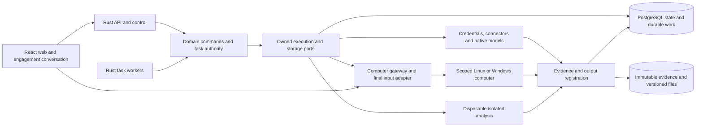

# Architecture Spine — Zobba

## 0. Active authority and replacement

The user accepted **Zobba product-and-architecture design revision 3** and authorised active planning consolidation. This spine is its implementation substrate. It replaces revision 5, including the former dual-engine, compiler-2, legacy-preservation and configuration-approval assumptions. It does not claim that the new architecture is implemented.

The [accepted design](../../zobba-product-architecture-2026-09-30/Zobba-Product-and-Architecture-Design.md) governs product meaning and qualified infrastructure behaviour. This spine fixes shared architectural invariants; the [contract register](CONTRACT-REGISTER.md) fixes the owned boundaries. Implementation stories must establish executable schemas and failure tests before their producers/consumers ship. Old application contracts remain documentation of existing code until replaced in implementation; they are not an alternate target architecture.

Exact prior files are preserved in [archive/2026-09-30-pre-rust-rev5](archive/2026-09-30-pre-rust-rev5/README.md). Historical review files assess their stated revision only. The prior memlog remains append-only; the 30 September update records the explicit override. Downstream specifications, epic/story plans and tests that assume the retired architecture require reconciliation before reuse. No application rewrite or deployment is performed by this consolidation.

**Stable identifiers.** AD-1, AD-8, AD-10, AD-12 and AD-14 retain their invariant meanings; their obsolete vendor/package and procedure-lifecycle bindings are replaced explicitly below. All other earlier IDs are retired, not reused. New decisions start at AD-35.

| Retired IDs | Former commitment no longer active | Destination |
|---|---|---|
| AD-2, AD-3, AD-9, AD-16, AD-17, AD-21, AD-23, AD-25, AD-31 | Procedure/Run ownership, compiled plans, AI SDK loop, Run-specific waits/publication and task beside legacy Run | AD-35–37, AD-39, AD-49 |
| AD-4, AD-26, AD-27, AD-30 | Old acquisition/mutation vocabulary, user-only connections, fixed provider rules and former sandbox profile | AD-38–41 |
| AD-5, AD-18, AD-22, AD-28 | Old evidence envelopes, Observation graph, exact legacy chain/signing and sealing units | AD-42–43; retain useful integrity vectors, not obsolete bytes/schema |
| AD-6, AD-7, AD-29 | Compiler-condition evaluations and universally independent version approvals | AD-43–44 |
| AD-11, AD-13, AD-15, AD-20, AD-24 | Legacy provider/deployment, four-template PoC metrics, active-Run compatibility, notification shapes and migration-specific tenancy | AD-35, AD-38, AD-47–49 |
| AD-19, AD-32, AD-33, AD-34 | Procedure scheduling, proposed/accepted memory, configuration approval and compiler-2 promotion | AD-45–47 |

## Design paradigm and boundaries

One Rust modular backend owns commands and domain state. API/control and task workers are separate deployments of that codebase. A continuing engagement conversation coordinates distinct Tasks; every Task has one durable authority. Computers, broker custody and isolated analysis are execution/trust boundaries, not additional owners of audit state.

```mermaid
flowchart LR
  UI[React web and engagement conversation] --> API[Rust API and control]
  API --> CORE[Domain commands and task authority]
  WORK[Rust task workers] --> CORE
  CORE --> PORTS[Owned execution and storage ports]
  PORTS --> PG[(PostgreSQL state and durable work)]
  PORTS --> BROKER[Credentials, connectors and native models]
  PORTS --> GATE[Computer gateway and final input adapter]
  PORTS --> ANALYSIS[Disposable isolated analysis]
  UI --> GATE
  GATE --> VM[Scoped Linux or Windows computer]
  BROKER --> REG[Evidence and output registration]
  VM --> REG
  ANALYSIS --> REG
  REG --> S3[(Immutable evidence and versioned files)]
  REG --> PG
```

Arrows denote owned interfaces, not general network reachability. The browser has no backend authority or machine credential. Vendor/browser/analysis adapters cannot mutate domain tables directly.

## Invariants and rules

### AD-1 — [ADOPTED; invariant retained] Strict inward dependency direction

- **Binds:** Rust modules, web clients, adapters and composition roots.
- **Prevents:** framework, persistence or tool types defining audit meaning.
- **Rule:** domain types/rules import no delivery or vendor layer; application commands own ports; infrastructure implements them; API/worker composition roots wire dependencies. SQLx, provider SDK/wire types, cloud clients and browser drivers stay outside domain types. Generate web contracts from owned interfaces. Enforce import/module boundaries in CI. Former TypeScript/Next/Drizzle package bindings are retired.

### AD-8 — [ADOPTED; invariant retained] PostgreSQL is the transactional system of record

- **Binds:** state, accepted commands, events, queue/outbox, leases and budgets.
- **Prevents:** split-brain work ownership and acknowledgements without durable work.
- **Rule:** one scoped PostgreSQL transaction commits domain changes, durable accepted receipt and wakeup/outbox together. Module-owned repositories can share an application unit of work; delivery and adapters cannot bypass them. Binary objects stay in S3. SQLx replaces Drizzle; leased work tables replace pg-boss. LISTEN/NOTIFY is an accelerator, never durability. External effects and S3 writes are not represented as part of a PostgreSQL transaction.

### AD-10 — [ADOPTED; invariant retained] Operational telemetry and audit records are distinct

- **Binds:** all processes, model/tool requests, evidence and notifications.
- **Prevents:** logs becoming evidence and sensitive payloads becoming telemetry.
- **Rule:** propagate organisation/engagement/task/operation/attempt correlation through authorised paths. Telemetry uses allowlisted non-content fields; exclude evidence, raw prompts/results, credentials, capability URLs, continuation objects and private sign-in. Audit actions retain attributable domain records and observed outcomes under their own retention. Negative fixtures test the content exclusions. Former Pino/Sentry/Run-specific bindings are retired.

### AD-12 — [ADOPTED; invariant retained] Tests defend domain and adapter seams

- **Binds:** changed domain rules, ports, persistence, control and interface flows.
- **Prevents:** independently compliant-looking components breaking composed guarantees.
- **Rule:** each port has conformance tests including refusal, partial data, uncertain effects and cancellation. Exercise real database transactions, scope barriers, stale epochs, upload/registration crash points, identity changes, descendant cleanup, slow consumers and exact-version review. Audit fixtures test known populations, conflicts, coverage and judgment. Critical browser journeys include engagement multi-task routing, private sign-in/takeover, evidence inspection, team/solo review and WCAG 2.2 AA automated/manual checks. Legacy Builder/four-template tests are not obligations of the new runtime; preserve only surviving behaviour and useful golden inputs.

### AD-14 — [ADOPTED; invariant retained] Durable contracts are explicitly versioned

- **Binds:** commands, events, model/tool envelopes, evidence/derivation records, evaluation bases, configuration and issued manifests.
- **Prevents:** producers and consumers silently disagreeing on stored meaning.
- **Rule:** application-owned schemas carry explicit versions. Semantic/required-field changes create a new version; declared rolling compatibility has old/new producer-consumer fixtures. Verify original immutable bytes before any projection. Exact code/library pins live in lockfiles and execution manifests. A fresh development schema is authorised; this does not require readers for retired synthetic history. Former Zod/compiler graph bindings are retired; Rust schemas and generated OpenAPI/JSON interfaces replace them.

### AD-35 — [ADOPTED] One Rust backend, fresh schema and owned domain commands

- **Binds:** implementation boundaries and all shared data.
- **Prevents:** dual engines, compatibility scaffolding and several writers defining the same lifecycle.
- **Rule:** build the fresh Rust task backend and schema; retire compiler-1, compiler-2, procedure-first Builder and Node domain orchestration. Modules own their commands, invariants, repositories and records. Conversation coordinates; Task authority transitions work; runtime proposes; Permissions admits; workspaces execute; evidence/evaluation/work products own their results. Preserve useful fixtures/methodology/assets selectively, not legacy active sessions or synthetic histories. No module writes another module's data through an infrastructure shortcut.

### AD-36 — [ADOPTED] Engagement conversation binds exact work targets

- **Binds:** messages, work cards, speech, input requests and multi-task commands.
- **Prevents:** chat focus, ambiguous pronouns or audience changes granting authority or controlling the wrong work.
- **Rule:** persist incoming messages before interpretation. Bind each resulting command to explicit engagement, Task/decision/computer, author, audience and idempotency identity. Pure discussion need not create a Task; questions and new objectives do not silently cancel existing work. Resolve material ambiguity before dispatch; record accepted/applied outcomes per target. The coordinator uses authorised summaries/references, not every Task's full transcript. Opening a Task does not enlarge its audience. Text and speech use the same command system; visible control buttons identify their target.

### AD-37 — [ADOPTED] Durable task ownership and operation reconciliation

- **Binds:** Task revisions, controls, helpers, operations and recovery.
- **Prevents:** stale worker effects, swallowed guidance, duplicate remote actions and fictional recovery.
- **Rule:** Task commands are the only transition path. Admission commits a durable receipt and wakeup; one worker holds the current time-bounded owner epoch. Guidance has an intent revision: model requests and resulting proposals bind the producing revision, and Task admission rejects or rebases contradictory stale proposals before a dispatch claim becomes usable. A valid owner/execution epoch alone does not make old guidance current. Applying guidance revalidates or invalidates conflicting unconsumed claims before they can be consumed; a claim already consumed remains possibly dispatched and must reconcile. Retain useful observations under their actual basis; Applied means the change has reached the relevant work boundary. Pause/Stop fences further dispatch independently of model progress. Pause holds the objective; Stop ends its current work cycle, and a later explicit continuation records a new cycle without deleting prior work. Persist operation, attempts, canonical request, one-use dispatch claim and observed receipts separately. Gateway claim consumption under current authority is the cutoff before remote I/O; a crash after that cutoff is possibly dispatched. Reconcile with the real provider/application before retry unless the exact idempotency contract makes retry safe. Late stale workers may supply narrowly authorised receipts but cannot resume work or commit new proposals. Descendant delegations and shared budgets inherit parent limits.

### AD-38 — [ADOPTED] Scope and purpose are enforced at every effect boundary

- **Binds:** identity, rows/objects/search, connectors, MCP, computers and delegations.
- **Prevents:** cross-client access, source mutation disguised as testing and authority from untrusted content.
- **Rule:** current authority is the intersection of organisation limits, engagement membership/scope, task authority, actual account/resource restrictions and bounded delegation. Use application filters plus forced RLS, non-owner runtime roles, scoped foreign keys and transaction-local context reset. Every operation binds one purpose: Live inspection, Test workflows or Audit coordination. Live inspection requires source-enforced read-only access or a validated adapter restriction that also survives takeover; otherwise use separately attributed manual acquisition. Test authority binds an actual designated environment. Connection scopes and prompts never grant task authority. Confirmations bind canonical account/resource, parameters, content, recipients, purpose, version and expiry; material changes invalidate them. Admin role alone grants no evidence inspection or audit sign-off.

### AD-39 — [ADOPTED] Native model/tool interfaces and credential custody

- **Binds:** provider adapters, tool catalog, connectors and connection broker.
- **Prevents:** SDK-owned loops, partial tool execution, hidden account/provider substitutions and credential leakage.
- **Rule:** native OpenAI Responses and Anthropic Messages adapters implement Zobba's portable request/stream envelope; the runtime alone owns the loop. Admit complete size/schema/semantic-checked calls against canonical tool identity, account, effective parameters, effect class, resource, cancellation and reconciliation contract. MCP annotations are advisory. Record requested/actual model, capability profile, context manifest, destination and usage; no silent destination/capability downgrade. Broker custody handles scoped personal or firm connections, OAuth state/PKCE, token exchange/refresh and revocation; models, general analysis and web clients receive neither provider secrets nor general session capability. Refresh cannot reactivate revoked access or change accounts. Tool success, asynchronous acceptance and returned-data completeness remain separate.

### AD-40 — [ADOPTED] One computer input holder and private observation boundaries

- **Binds:** machine lifecycle, viewing, takeover, sign-in and file paths.
- **Prevents:** old driver retries after handoff, private frames reaching observers and stale screenshots posing as live state.
- **Rule:** bind every command to workspace, generation, controller, epoch/expiry and viewport where applicable. The final local adapter fences the entire driver operation, releases held inputs and acknowledges quiescence before new input control. All keyboard, pointer, CDP/driver, clipboard, capture, DOM/OCR and transfer routes participate. Protected sign-in admits only the authorised human; suppress other viewers, queued frames, agent observations, replay and voice capture until explicit handback and verified account/environment. Human disconnection fences input without automatic handback. Recovery increments generation and observes/reconciles actual state; retained disk does not prove preserved RAM, unsaved work or login.

### AD-41 — [ADOPTED] Analysis and document processing are isolated from credentials

- **Binds:** model-authored programs, conversion/OCR, staging and output collection.
- **Prevents:** a spreadsheet/parser/program gaining live browser, cloud role or backend access.
- **Rule:** execute selected immutable inputs in disposable bounded analysis jobs with versioned program/environment, no general egress and no credential-bearing ECS task role. A privileged sidecar in the same task is not isolation. Trusted external staging/collection exposes only scoped input/output handles. Validate bytes, hashes, paths, links, file kinds and aggregate limits before registration. Confirm complete job/descendant termination; a program's receipt is not supervisor proof. Credential-bearing computers expose vetted browser/desktop actions, not general shell/CDP to the model. Additional source data requires broker acquisition and new admitted inputs.

### AD-42 — [ADOPTED] Evidence lineage and integrity survive every derivation

- **Binds:** source acquisition, analysis, claims, retention and exports.
- **Prevents:** generated claims evidencing themselves, mutable working files becoming originals and successful upload implying complete evidence.
- **Rule:** preserve immutable original bytes plus separate acquisition identity, account/location/version/time, query/selection, known coverage and content digest. Derived/extracted/generated outputs retain exact input, method and environment references; editable copies remain distinct. Reserve object identity, conditionally upload, verify stored bytes, then register; retry registration using the same reservation, quarantine orphan uploads. Maintain scoped versioned tamper-evident audit records and protected issued manifests with canonical verification vectors. Hash integrity never proves source truth/completeness. Retention/legal holds apply to dependency sets; deletion leaves honest availability records. The former Run-package signing/envelope algorithm is not silently inherited.

### AD-43 — [ADOPTED] Typed audit evaluation keeps basis, grain and judgment explicit

- **Binds:** criteria, facts, populations/samples, evaluation revisions and findings.
- **Prevents:** invented failure/pass, double-counted exceptions and model confidence replacing evidence.
- **Rule:** an assessment binds criterion authority/effective period, typed facts, source locators, population/selection and exact program or rubric. Keep applicability, execution, verdict, origin and human disposition separate. Missing/unavailable evidence or evaluator failure yields no fabricated verdict. Preserve unit/currency/ID/time semantics and row-to-subject-to-criterion grain mappings; unknown denominator is not zero. Sampling inference needs a validated method and assumptions. Aggregate supported local exceptions even when overall assurance is limited. Human corrections create attributed fact/basis/evaluation successors; waivers do not rewrite arithmetic or coverage. A finding has continuing identity and separate period occurrences.

### AD-44 — [ADOPTED] Work product versions carry truthful human responsibility

- **Binds:** documents, claims, review, approval, issuance and corrections.
- **Prevents:** approval silently following edits, Admin/model sign-off and self-review labelled independent.
- **Rule:** draft edits save immutable successor versions with stable claim/block anchors and expected-base checks; merge only nonconflicting valid dependencies. Review binds exact content, assessment basis/evaluations and required evidence. Accepting responsibility for agent-prepared content records that person as its human preparer/contributor even without a manual edit; successors retain relevant material contributor lineage. Team independent review requires an eligible assigned Audit manager outside that set. Declared Admin-configured solo mode permits the eligible practitioner to self-review, exported as no independent review. Review and approval may be one action; Issue remains separately authorised with exact rendering/destination/manifest. Reviewed/issued history is never overwritten; material changes create successors/reconsideration. Firm templates govern deliverables, and known conversion/rendering limitations remain visible.

### AD-45 — [ADOPTED] Methodology and skills use ordinary Admin Save from the first task

- **Binds:** packages, templates, skill catalog, effective assignments and task/check bindings.
- **Prevents:** late-added audit method, hidden policy changes and invented configuration approval ceremonies.
- **Rule:** Admin validates and Saves attributable immutable versions and scope/effective assignment in one transaction, without a default second approver. Imported interpretations remain proposals until Save. Default changes apply to new tasks; applying to active tasks commits a visible safe-boundary binding change and reworks affected drafts. Business policy effective period differs from save time. Installed skill manifests carry applicability, inputs/outputs, resources/digests and requested capabilities; discovery and on-demand loading record actual versions, never grant authority. Methodology, useful skills and working knowledge feed the first complete task's criteria, analysis, rendering and review. A recalled invalid version cannot continue merely because pinned; changes to a Check's assurance follow AD-47, not a separate settings approval.

### AD-46 — [ADOPTED] Working knowledge is scoped, source-linked and revocable

- **Binds:** task context, memory, search, compaction and model disclosure.
- **Prevents:** cross-client knowledge, optional advice overriding a person, stale summaries defeating revocation and acceptance paperwork for every fact.
- **Rule:** distinguish configured requirements, optional skills, explicit decisions/preferences, working facts and retrieved evidence. Record instructions/decisions directly and source-backed facts with confidence/period, not blanket acceptance cards. Scope/access/applicability filters precede retrieval ranking; missing indexes and material conflicts remain explicit. Each fragment and compaction has source/version/scope/disclosure/dependency manifest. Rehydrate exact decisions, unresolved effects and review state from durable records. Recheck immediately before outbound disclosure and before admitting late results to viewers/context/work products; invalidate inseparable summaries, embeddings, previews and provider continuations on revocation. Knowledge never grants authority or substitutes for cited source evidence.

### AD-47 — [ADOPTED] Continuing and recurring work use the same accountable task engine

- **Binds:** standing requests, triggers, Check definitions, occurrences and notifications.
- **Prevents:** compiled replay of exploration, duplicate periods/effects and absence of a repeated exception being called remediation.
- **Rule:** a Check pins reviewed assertion, criteria/source semantics, population/sample, exact method/rubric, outputs, current-compatible routing, review rules, budget and narrow revocable delegation. Navigation remains adaptive. Activation follows team or labelled solo audit review, not Admin configuration approval. Calendar identity is scoped check plus logical period, independent of schedule/version; reruns are linked revisions. Events re-fetch exact source identity/version and deduplicate. Default one active occurrence and bounded waiting/catch-up; expired decisions cannot dispatch, while uncertain submitted effects continue reconciliation. Material assurance changes require a Check revision; harmless maintenance does not. Standing work may resume from evidence without a schedule; suggestions alone activate nothing. Notifications are scoped outbox effects with actual receipts and no unapproved disclosure.

### AD-48 — [ADOPTED] Deployment, resource limits and recovery are explicit operating contracts

- **Binds:** API/workers, computers, analysis, data, identity and releases.
- **Prevents:** hidden warm-compute costs, unbounded waits, unsafe shutdown and backups replaying external actions.
- **Rule:** use accepted AWS boundaries: ECS/Fargate Rust API/workers, RDS PostgreSQL, S3/KMS, Cognito OIDC with Rust sessions, private broker and EC2 computers. Bound independently task/helper/model/tool/computer/analysis/output/subscriber capacity and reserve budgets before paid work. Human/evidence waits release compute; preserve unresolved paid-attempt accounting. Use fair organisation/engagement admission and reserved interactive/control capacity. Stop computers only after safe checkpoint/quiescence; clean/reprovision pooled capacity before reassignment. Distinguish ready, warm, restart and cold/first-enrolment cases; measure the accepted design §7 readiness targets, not an assumed SLA. Use release-only migrations, tested versioned images and restore tests; reconcile effects beyond a restored database horizon before retry. Region, retention and customer app/licensing terms remain explicit commercial configuration.

### AD-49 — [ADOPTED] The working interface projects durable truth without stealing focus

- **Binds:** events, engagement/task views, live media, work products and reconnect.
- **Prevents:** received meaning applied, completed meaning passed, reconnect meaning control or incoming output replacing inspected work.
- **Rule:** authorise projections/subscriptions per current audience/scope; replay bounded events by durable cursor with gap/resynchronisation behaviour. Keep control acceptance, application and observed outcomes distinct. Show multiple attributed task cards, persistent Needs you, Computers and work-product shelf, plus a since-last-visit digest. Pin/selection suspends following until explicit Follow Zobba. Live, stale, replay and protected states are labelled; output previews disclose truncation and do not replace full stored results. Pausing/Stopping remain pending until acknowledged facts justify completion. Narrow/keyboard interfaces preserve target-specific controls, context, evidence return and truthful team/solo state.

## Implementation ownership and contract boundaries

| Module group | Exclusive responsibility | Shared boundary |
|---|---|---|
| Identity/scope; Permissions | Membership, assignments, session authority, action admission and revocation | Scoped principal/capability, not role-name-only access |
| Conversation; Task authority/runtime | Attributed routing versus durable transition/dispatch ownership | Message-to-command receipt; one Task owner epoch |
| Models/context; connections/tools | Native model protocol versus provider account/tool custody | Canonical admitted request and observed receipt |
| Workspaces; analysis | Computer generation/input/observation versus credential-free job execution | Fenced operation and validated transfer manifest |
| Evidence; evaluation; work products | Acquired/derived objects versus assessment meaning versus human lifecycle | Immutable source/basis/evaluation/content references |
| Methodology/knowledge; continuing work | Saved requirements/scoped facts versus reviewed recurring definitions | Exact task/method bindings; current authority recheck |

Schema/payload field definitions and negative examples belong in the owned contracts listed in the register. Do not implement each row as a service. No library owns a second queue, hidden workflow or tool executor.

## Stack seed and version ownership

Accepted choices are Rust with Axum/Tokio/Serde/SQLx; React/TypeScript/Vite; native provider adapters; PostgreSQL 18 with full-text search/pgvector; S3; Cognito; ECS/Fargate; and EC2/Guacamole. Linux baseline is Ubuntu 24.04 with Chromium/Playwright. Qualified Windows uses Server 2022 and, where licensed/supported, Office LTSC 2024. Isolated programs use Python, DuckDB/Polars and vetted conversion/OCR tools.

This is an accepted design seed, not an installed dependency manifest. Pin exact compiler/crate/npm/container versions in implementation lockfiles and image manifests, verify supported combinations then, and record them per execution. The accepted design's §§7 and 13 identify the bounded technology evidence; no new latest-version assertion is made here. A linter pass cannot establish deployed isolation, licensing or performance.

## Verification and deferred detail

Conformance must cover every register boundary before it is used. The accepted design §§4.5 and 8.6 define the complete audit journey and fault cases: method/skill/knowledge selection, source/computer/analysis work, interruption, evaluation with coverage limits, cited work products, team/solo review and a later recurring occurrence. Controls must remain responsive under slow models/media; scope revocation must survive cached context and late results.

Implementation owns exact crate structure, payload schema fields, database indexes, lockfile pins and measured instance tuning under these invariants. Customer application qualification, launch region/processing destinations, contractual retention and price/allowances remain the commercial commitments in accepted design §12. They do not reopen Rust, fresh schema, managed computers or standing Permissions. Unsupported profiles stay visibly unavailable; useful independent work continues.
