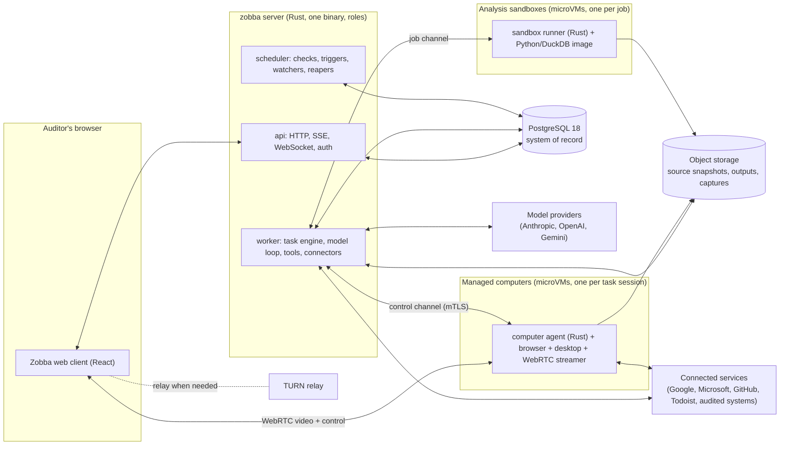
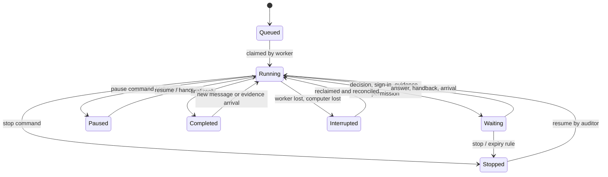
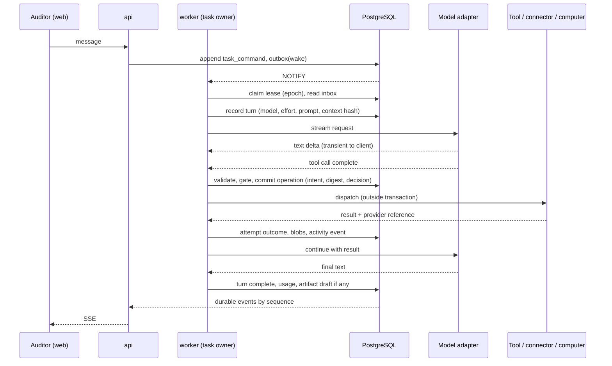
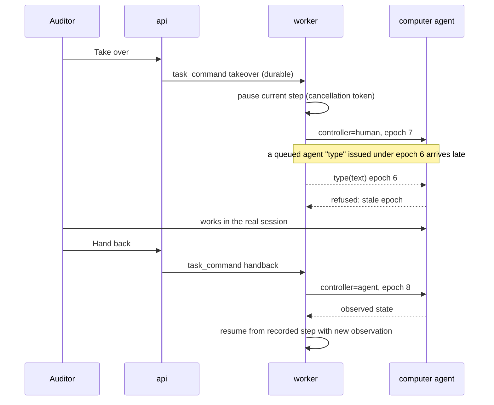
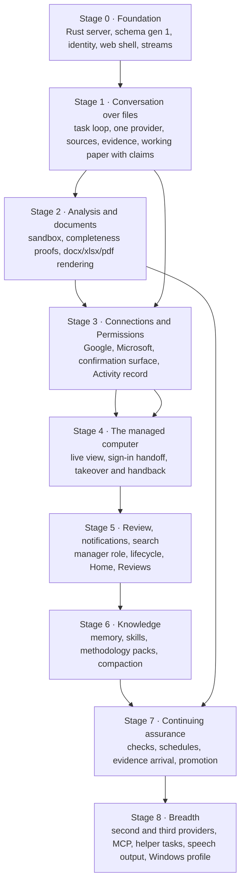

# Zobba — Product and architecture design

**The design we intend to build.** One package: the working experience, the architecture that delivers it, what happens to the code we already have, which planning documents change, and the order in which the architecture becomes a usable product. It is a draft for the owner's review. Nothing in it is approved, scheduled or started. The implementation plan is derived from it after review.

How to read it:

| Part | Who it is for | What it settles |
|---|---|---|
| **§0 Summary and the decisions for the owner** | The owner | The eight choices that shape the experience, the commercial model, the operating cost or the whole architecture, each with a recommendation |
| **§1 Product design** | Everyone | The working relationship: objects, workflows, interaction states, roles, Permissions, what is deliberately not in the product |
| **§2 Target architecture** | Engineering | The Rust engine and backend, persistence, workspace and execution, sign-in and takeover, knowledge and model use, work products and continuing assurance, deployment, verification |
| **§3 Existing-code disposition** | Engineering and the owner | Keep, adapt, rebuild or remove, area by area, with the destination |
| **§4 Planning-document revision** | The planning workflow | Which documents are replaced, which are rewritten, which are retired |
| **§5 Capability dependencies** | Planning | The order in which capabilities become a product; the basis for the next epics |
| **§6 Sources, evidence labels and limits** | Reviewers | What each claim rests on |

Labels used for claims: **[OBSERVED]** read in source or documents at the pinned revisions · **[MEASURED]** a number produced in the study environments · **[EXTERNAL]** a vendor or public figure checked on 2026-09-30 and to be re-verified before commitment · **[DESIGN]** a choice this document makes · **[OWNER]** a choice only the owner can make.

---

## 0. Summary for the owner

### 0.1 What Zobba is

Zobba is an audit agent with its own working environment. An auditor gives it an objective in conversation. Zobba reads the material, uses applications and analytical programs, investigates what is relevant, asks only when the answer changes the work, and produces audit work in the firm's own templates. The auditor watches the real computer Zobba is using, inspects any claim down to its evidence, guides, takes over, hands back, corrects and reviews. Successful work can become a recurring check. New evidence can wake an unfinished task.

The reasoning models are replaceable. The harness, the working environment, the audit semantics, the Permissions, the evidence and the work product are ours.

### 0.2 What this design does

1. **Builds the product around the conversation, the task and the engagement**, not around a procedure definition. The Builder, the compiler-1 procedure engine, the Run/Work Item execution model and the 24-action gating table are retired. Their lessons and their test data are kept.
2. **Makes Rust the engine and the whole application backend.** One Rust workspace owns identity, tasks, the model loop, Permissions, tools, connectors, managed computers, analysis sandboxes, evidence, artifacts, scheduling and the API. The web interface is a React application that renders and talks to that API; it holds no business logic, no database access and no model access. Browser drivers, analytical programs and document tooling use the languages that suit them inside isolated computers and sandboxes.
3. **Gives Zobba a real managed computer.** Each task that needs applications gets its own Linux computer (a microVM) with a browser, a desktop and file tooling, streamed live to the auditor over WebRTC, with takeover at the input gateway inside the computer. Analytical work runs in a separate sandbox that never holds credentials. Both feel like one workspace.
4. **Starts a fresh schema and a fresh contract set.** No compatibility layer, no dual engine, no migration programme. Golden datasets, the synthetic Northstar systems, the canonical-JSON golden vectors and the tests of behaviours we still want are carried forward as fixtures and acceptance cases for the new system.
5. **Keeps every audit safeguard we learned to value**, restated for the new shape: one durable owner per task; operations recorded as intent, attempt and observed outcome; reconciliation before any retry that could duplicate an effect; provenance on every piece of context; bounded resources; explicit tool contracts; execution, coverage, assessment and review as four separate facts; independent human review and issuance; source protection that no prompt, skill, memory or second approval can lift.

### 0.3 The decisions for the owner

Eight decisions shape the experience, the commercial model, the operating cost or the whole architecture. Everything else in this document is an engineering choice already made, with its reason. Each decision below has a recommendation; the detailed reasoning is in the section cited.

| # | Decision | Recommendation | Why it matters | Detail |
|---|---|---|---|---|
| **D1** | Retire the compiler-1 engine, the Builder, the Run model and the current schema completely, and start Zobba on a fresh schema with no compatibility bridge | **Yes.** Keep the golden data, Northstar, the canonical-JSON vectors and the behaviour tests as fixtures. Freeze the current `main` as a tagged, read-only history. | Two engines and a 61-generation schema would cost more than they return and would keep the procedure-first shape alive inside the new product. The product has no customer data to migrate. | §3, §2.13 |
| **D2** | Make Rust the whole application backend, including identity and sessions, not only the agent engine | **Yes.** One Rust server binary with roles (api, worker, scheduler); Better Auth, Drizzle, pg-boss and the Next.js server side are retired. The web tier becomes a React client. | Two backends (a Rust engine behind a TypeScript application) would recreate the "two owners of one state" problem the studies warn about, and would keep two toolchains for the lifetime of the product. | §2.2, §2.4 |
| **D3** | Managed-computer infrastructure: own Linux computer image on Firecracker microVMs, hosted on Fly Machines first, with a path to owned Hetzner hardware; hosted browser providers only as an optional profile | **Yes.** Fly Machines for the first year (per-second billing, suspend/resume, Machines API). Move steady load to owned Firecracker hosts when sandbox-hours exceed about 300 a month per tenant. Solari/Browserbase-class providers are not the base: they offer no desktop, no input gateway we own, and the credentialed session lives with the provider. | This is the largest operating-cost line and the capability that makes the workspace real. Estimated cost at first-year scale: about US$0.03–0.05 per computer-hour on Fly, about US$0.01 on owned hardware **[EXTERNAL]**. | §2.5, §2.14 |
| **D4** | Windows desktop applications | **Later, as a separate OS profile** on cloud Windows VMs, after the Linux computer is proven. Not in the first usable product. | Windows licensing, boot time (minutes, not seconds) and cost per hour are 5–10× the Linux profile. Most audited applications reachable today are web applications. | §2.5.3 |
| **D5** | Model providers and who pays for tokens | **Native adapters for Anthropic Messages and OpenAI Responses first, Gemini third. Tenants bring their own provider accounts or region-pinned deployments; Zobba does not resell tokens in the first release.** Admins configure permitted models, regions and defaults; auditors choose within that. | It fixes the commercial model (subscription plus the tenant's provider bill) and the data-processing posture (the tenant's contract with the provider). Reselling can be added later without redesign. | §2.9 |
| **D6** | Tenancy and deployment shape | **Multi-tenant SaaS from the first schema** (tenant on every row, PostgreSQL row-level security as the second lock), deployable as a single-tenant instance for a firm that requires it. | It decides the schema, the credential custody and the operating model. Single-tenant-only would be simpler to build and harder to run. | §2.4 |
| **D7** | Review, approval and issue | **Three distinct human states with configurable role mapping per methodology pack.** Default: the preparer submits; an audit manager reviews and approves; an audit manager issues. A firm can require a separate approver. | The design pack's open question Q14. It changes the review workflow, the Reviews queue and the artifact state machine. | §1.5, §2.11 |
| **D8** | Speech | **Speech input in the first usable product** (browser speech recognition into the same composer, one task system); spoken replies later. | Small cost, and it settles that speech is a way to talk to the same task, not a second path. | §1.3.14 |

Two further owner choices from the design pack are answered here rather than reopened: **Q3** the provenance footer stays on by default and is switchable per firm; **Q8** a task can become a scheduled check when its method is complete enough to freeze (§1.3.12), whatever skill it used.

### 0.4 What it costs and what it removes

- **Removed:** about 92,000 lines of TypeScript in the three packages, most of 66,000 lines in the web application, 62 migrations, 25 contracts, and the epic structure of 2026-09-24. Each removal is listed in §3 with what, if anything, is carried out of it.
- **Carried forward:** the golden datasets and the synthetic Northstar systems; the canonical-JSON and digest golden vectors; the Zobba design system v1.0; the credential-containment and source-protection guarantees; the audit-chain design; the failure-focused tests as behaviour specifications; the lessons recorded in `CLAUDE.md`, which become the seed of the new engineering notes.
- **New:** a Rust workspace of about fifteen crates (§2.3), a fresh schema (§2.4), a managed-computer platform (§2.5), native model adapters (§2.9) and a rebuilt web client on the Zobba design system (§2.12).

The build order that turns this into a usable product is in §5. The first usable milestone is a conversation over uploaded files that produces a working paper with claims tied to evidence; the managed computer and connections follow in the third and fourth stages.

---

## 1. Product design

### 1.1 The working relationship

Zobba is used the way the owner already works with a coding agent over an engagement folder: the auditor states an objective, the agent reads, uses tools, notices what matters, explains, produces, and the auditor directs and judges. The product turns that into something a firm can rely on: every action is recorded as an operation with an outcome; every conclusion sits beside its evidence; every external effect happens inside Permissions the firm set; every deliverable is a versioned artifact in the firm's template with named human accountability.

Five statements define the relationship. They are the product's invariants and every later section serves them.

1. **The auditor directs; Zobba works.** Objectives, guidance, corrections and decisions come from the auditor in conversation. Zobba chooses tools, investigates within the objective and Permissions, and asks only when the answer changes the work.
2. **The workspace is real.** What the auditor watches is the actual computer, document, table or draft Zobba is using. There is no simulated activity display.
3. **Every claim is a pair.** A conclusion is shown with its evidence, an analysis with its method and inputs, an action with its recorded outcome, a draft with its changes.
4. **Four facts stay separate.** Whether work ran, whether its inputs were complete, what the audit assessment is, and who reviewed or issued it are four different statements and are never merged.
5. **Firms configure; Zobba does not presume.** Methodology, templates, rating scales, review rules and Permissions come from the firm. Zobba ships neutral defaults and one optional example pack.

### 1.2 The objects an auditor works with

The product has a small vocabulary. Each object below is a real, durable thing with an owner, a history and a place in the interface. The names are the product's words; the design pack's fixed labels are used where they exist.

| Object | What it is | Where it lives in the interface |
|---|---|---|
| **Firm** (tenant) | The organisation using Zobba: people, roles, methodology, Permissions defaults, connections policy, models | Settings › Administration |
| **Client** | An audited organisation. Client work is separated: nothing from one client reaches another's engagements | Engagements list, Search scope |
| **Engagement** | The unit of audit work: a client, a period, an objective, the people assigned, its Permissions, its sources, tasks, artifacts, findings and checks. Draft-capable: it can exist before a client is bound | Sidebar › Engagements; the Engagement page |
| **Task** | One objective given to Zobba inside an engagement, with its conversation, its computer sessions, its analyses and the artifacts it produced. A task can run while the auditor is away and can be resumed by new evidence | Sidebar › Recent tasks; the task view |
| **Conversation** | The exchange around a task: auditor messages, Zobba's replies, activity lines, questions, decisions, guidance acknowledgements, system events | The centre column |
| **Workspace panel** | The thing being inspected: a computer session, working data, a document, an artifact page, evidence, changes, a draft message, a scheduled result | The right panel, pinnable |
| **Computer session** | A managed computer Zobba is using for this task: browser and desktop, files, sign-in state, who is in control | Workspace panel › Browser or Desktop |
| **Source** | Something Zobba read: a file, a folder, an email thread, a system record, a page. Preserved as a **source snapshot** with identity, version, acquisition time and integrity | Evidence drawer; Engagement › Sources |
| **Analysis** | A reproducible computation over working copies: method (script or query), engine and version, inputs by snapshot, outputs by digest, and what it did not cover | Workspace › Working data; cited from artifacts |
| **Artifact** | A deliverable in the firm's template: plan, request list, walkthrough note, working paper, finding, report, memo. Immutable versions; claims tied to evidence; human review states | Workspace › Artifact; Engagement › Artifacts |
| **Finding** | A candidate or confirmed exception with its support and limitations; carried into artifacts and into recurring checks | Inside artifacts; Engagement › Findings |
| **Limitation** | A recorded gap in coverage, access or evidence, numbered (L1, L2) and carried into the artifact | Activity lines, working data, artifacts |
| **Decision** | A human answer Zobba waited for: a clarification, a permission for an external action, a review, a takeover. Bound to exactly what was shown | Conversation cards; Activity record |
| **Check** | A recurring definition made from a finished task: method, sources, period rules, criteria, expected outputs, Permissions, model, schedule or trigger, review responsibility. Produces **results** | Sidebar › Scheduled checks |
| **Connection** | An account Zobba may use through a connector (Google, Microsoft, GitHub, Todoist, a system reached by browser), with its state | Sidebar › Connections |
| **Permissions** | What Zobba may read, write, must ask before, and must never do, in this engagement, within the firm's limits; plus the Activity record of what it did | Engagement page, composer chip, confirmation footer |
| **Skill** | A reusable way of approaching a kind of work (leaver access test, population completeness, walkthrough preparation), versioned and approved by the firm | Settings › Methodology and skills; the composer's + menu; "How it ran" |
| **Methodology pack** | The firm's configuration: phases, artifact types and templates, rating scales, sampling conventions, criteria authority, review and issue rules | Settings › Methodology and skills |
| **Memory** | What Zobba may remember: user preferences, firm conventions, client knowledge, engagement facts and decisions, confirmed lessons, each with source, scope, confidence and status | Settings › Profile (own); Engagement › What Zobba knows; proposals in conversation |

Three things in the current product have no successor object: the **Procedure Version** with its frozen compiled plan, the **Run** with Work Items and a twenty-row Gate, and the **Target System registration** with a six-key digest. What they protected is carried by Check (a frozen method with criteria and review), Task (durable execution with per-operation records) and Connection plus Permissions (accounts, scope and read-only enforcement).

### 1.3 Principal workflows

Each workflow is described as the auditor experiences it, then what the system guarantees underneath. The design pack's reference screens are cited where they show the state (RS nn).

#### 1.3.1 Start work

The auditor opens **New task**, chooses the engagement (or lets Zobba create a draft engagement from the request and name the client later), and types the objective. There is no form. Zobba replies in first person with its approach when that helps, starts reading, and reports meaningful activity beneath its reply ("Found 4 relevant files in Northstar shared folder › Q3 ITGC", "Reading control documentation · page 4 of 11 · Inspect") (RS 02).

Underneath: a Task is created in QUEUED and claimed by an engine worker; the task freezes the engagement's Permissions version; the first turn assembles working context from the engagement (methodology pack, skills that match, engagement facts, connected sources) with provenance on every fragment.

#### 1.3.2 Guide, pause, stop

While Zobba works the composer stays live. Text typed is **guidance**, acknowledged as "Guidance queued for the next step" and later "Applied your guidance · …" (R1.4, RS 02–03). **Stop** is a separate control that is always reachable; it halts the current step, keeps the work so far and says what was kept. **Pause** holds the task without ending it (used before a long absence or before takeover). None of these depends on the model or a tool answering: the controls are handled by the task owner, not by the turn in flight.

Underneath: guidance is a durable command appended to the task's inbox and applied at the next step boundary; Stop cancels the running step's cancellation token, marks in-flight external operations for reconciliation, and records what completed; Pause is the same without abandoning the step's intent.

#### 1.3.3 Clarification

Zobba asks a question only when the answer changes the work, one question per turn, with suggested replies and free text, naming the paused step (R1.5, RS 08). The task shows "Zobba needs your input"; the sidebar row shows the waiting mark; a notification goes to the auditor if the tab is closed. Other tasks continue.

Underneath: a Decision of kind `clarify` is opened with the exact question and options; the worker is released; the answer is bound to that decision's digest; a stale or duplicate answer is refused; the task resumes at the recorded step.

#### 1.3.4 Watching the computer

When Zobba needs an application, the workspace panel shows the real browser or desktop session with a URL bar, back and forward, "Zobba is viewing", and **Take over** (RS 04). The header states the connection's scope ("read-only connection") and the task it belongs to. Zobba's cursor, typing and navigation are visible as they happen. Working data, documents and artifacts appear in the same panel when they are more useful than the screen; incoming content never replaces a pinned panel or one used in the last 30 seconds (R2.2).

Underneath: the computer is a per-task microVM streamed over WebRTC; the panel receives a session token scoped to the task, the viewer and a time window; the stream carries video and control state, never the credentials inside the machine.

#### 1.3.5 Sign-in handoff

When a page needs the auditor's own credentials, Zobba stops before the form, says "This needs your sign-in", and hands the panel to the auditor with the keyboard and mouse live and the state chip "You are signing in · Zobba is waiting". The auditor signs in inside the streamed browser, including any second factor on their phone. Nothing typed enters the conversation, the transcript, the model context or the activity record. When the session is established, the auditor presses **Hand back**; Zobba reads the current page, confirms it can proceed, and continues. If the sign-in session expires later, Zobba asks again rather than guessing.

Underneath: the in-computer agent switches the input gateway to the human, suppresses screenshots and page-content capture while a credential field is focused or the handoff is active, and records a Decision of kind `sign-in` with the site, the time and the person, not the credential. Session cookies stay inside the computer; the computer is destroyed at task end unless the engagement's Permissions allow a retained profile for that system.

#### 1.3.6 Take over and hand back

"Let me take over for a moment." The auditor presses **Take over** (or asks in conversation). The chip changes to "You have control · Zobba is paused"; Zobba's pending inputs are dropped at the gateway so nothing it was about to type lands after the person starts. The auditor works in the real session. On **Hand back**, Zobba captures the current state (page, URL, visible content, open files), states what it observes ("You've opened the sign-in history for AG-91377; I'll continue from here"), and continues. Zobba stays responsive to conversation throughout, and other tasks keep running.

Underneath: control is a property of the input gateway inside the computer, changed by a fenced command with an epoch; late agent inputs carrying an older epoch are refused; the human period is recorded as a segment in the session timeline and shown in "How it ran".

#### 1.3.7 Analysis rather than copying

When a comparison is needed, Zobba uses an analytical program over working copies rather than reading rows through the interface. The activity says so ("Compared 23 leavers against 1,516 accounts · 3 still active") and the working data panel shows the result table with real counts, unmatched records under their own header with a reason, and limitation references (RS 03). The auditor can ask "Show me why you think this is an exception" and Zobba opens the analysis and the supporting records.

Underneath: each analysis runs in a sandbox without credentials or network, over source snapshots mounted read-only; the method (script or query), engine and version, inputs and outputs are registered as an Analysis; outputs are digested; what was not covered is recorded as a limitation, never inferred as absence.

#### 1.3.8 Inspecting a claim

Every conclusion in an artifact is a claim with citations. Selecting a claim highlights it and shows a citation preview; opening the citation opens the evidence drawer with readable identity first (source, location in the source's own terms, what it supports) and technical provenance behind "Technical details"; **Back to claim** returns focus (R4, RS 05–06).

Underneath: claims, citations and evidence references are part of the immutable artifact version; a citation resolves to a source snapshot region, an analysis output row, a computer capture or a decision; a citation that cannot be resolved is shown as such, never silently dropped.

#### 1.3.9 Correcting a draft

"This conclusion is overstated. We only have evidence for part of the period." Zobba revises the affected artifact as a new draft ("Draft 2 saved · View changes · Undo"), shows a typographic diff, names changed conclusions and limitations, and points out related conclusions or approvals that now need reconsideration (R5, RS 07). Direct edits in the artifact page save the same way. Zobba never silently changes a conclusion; its own proposals are offered for acceptance.

Underneath: artifact versions are immutable; a correction creates a version with a dependency record; a version derived from approved or issued work returns to review with the approved version preserved; reconsideration flags are set on dependent claims.

#### 1.3.10 External actions

Sending an email, creating a calendar invitation, creating a task in Todoist, saving a document to a client folder, submitting an approval in a test environment: each leaves Zobba or changes something outside working copies, so each is a meaningful boundary (R7). Zobba prepares the drafts beside one decision surface that lists every material detail (what, sender, recipients, content, attachments, date, time and time zone, destination) with **Allow and send · Edit first · Don't send** (RS 09). A change to any material detail invalidates the decision. Outcomes are reported per operation, including "unknown after dispatch" and "partial".

Underneath: the operation is recorded before dispatch with its bound details and digest; the connector performs it outside any database transaction; the outcome is recorded per attempt; an uncertain outcome opens a reconciliation step that queries the provider by the operation's own reference before any retry; the Activity record shows the decision basis and the actual outcome.

#### 1.3.11 Review and issue

The preparer submits an artifact for review. An audit manager sees it in **Reviews** (Waiting for your review · Returned with your notes · Reviewed recently), can ask Zobba about the paper with cited answers, anchors notes to locations, and either **Return with n notes** or **Mark as reviewed** (RS 20–21). Approval and issue are separate human steps with named people and dates. An administrator cannot review or approve; a preparer cannot review their own work. Review status is always shown separately from the assessment and from execution.

Underneath: lifecycle records (submitted, returned, reviewed, approved, issued, superseded, needs-reconsideration) attach to an immutable version; independence is evaluated over humans who authored or contributed content, never over Zobba; the role mapping (who may approve, who may issue) comes from the methodology pack within the firm's rules (D7).

#### 1.3.12 Making it recurring

"Run this check each month and bring the exceptions to me." Zobba proposes a Check from the finished task: objective and criteria, sources and their identities, population and period rules including how completeness is proven, matching rules, method (the analyses, frozen by digest), expected outputs, Permissions (a copy of what the task had, narrowed to what the check needs, never wider), model and effort, schedule or trigger, review responsibility. The auditor reviews the definition as an artifact; it is approved by someone permitted to approve checks; then it runs unattended. A check never takes an "asks first" action; it waits (R9.2).

Results lead with a readable conclusion, then Exceptions · Coverage · Evidence · How it ran (RS 13). "Didn't run" is an execution state with no assessment; "Completed" is execution, not a pass; an incomplete population is Inconclusive, never a pass. Open exceptions carry forward rather than being raised again. A pattern outside the check's objective is recorded as a signal for the auditor, not investigated by the check.

Underneath: a Check is a frozen, versioned definition; a change to method, criteria, sources, Permissions or model is a new version that needs approval again; each result is a Task of kind `check-run` with the same operation records, evidence and artifacts as any task; drift (schema, value domains, methodology version, model withdrawn) pauses the check and asks its owner.

#### 1.3.13 Evidence arrival and standing requests

"Check whether they have sent the evidence we requested." Zobba searches the correspondence and folders it may read, inspects matching attachments, updates or proposes an update to the request list, and never treats an email saying "done" as verified closure. An unfinished task can wait for evidence: when a watched folder, mailbox or system shows new material that matches the wait, the task resumes and tells the responsible person what arrived and what it changed.

Underneath: a wait of kind `evidence` names the source and the match rule; connector watchers (change notifications where the provider offers them, bounded polling otherwise) create arrival events; the task resumes from its recorded step and re-checks Permissions and connection state first.

#### 1.3.14 Away, back, and on a narrow screen

Work continues after the tab closes. Notifications name the task and the reason: needs your input, needs your permission, completed with exceptions, didn't run, connection needs reconnecting. **Home** shows a Continue list of tasks that need the person and recent work (RS 01). On a phone the conversation is the default view, the workspace opens full-screen with a back control, Stop and open decisions stay reachable without scrolling (RS 17–18). Speech input goes through the same composer into the same task (D8).

Underneath: notifications are product events with delivery records; the live stream resumes from a durable cursor, so a reconnect shows every decision and result that happened while away; a viewer on a narrow screen receives the same stream at a lower frame rate.

#### 1.3.15 Connections and Permissions setup

Connections are made by the person who owns the account, through the provider's own sign-in, and show plain-words scope and state ("Read-only · users and sign-in history only · Connected") (RS 14). An engagement's Permissions are set by the auditor within the firm's limits and shown at a glance ("Can read selected sources and work on copies. Asks before sending messages or invitations."), in detail as seven sections plus the Activity record (RS 16). Three operating purposes are named per engagement or per source: **inspect live operational sources** (read-only, no writes ever), **exercise workflows in a designated test environment** (writes allowed within named systems and accounts, clearly marked as test), and **coordinate audit work** through documents, email and calendars (drafts by default, sending with confirmation or standing permission).

Underneath: Permissions are versioned documents; the task freezes a version; Effective Permissions per operation are the intersection of the frozen version, the current firm ceiling, current membership, the current connection's scope and the resource's class; source protection is absolute and not lift-able by any grant or approval; the purpose classification of a system decides which effect classes exist at all.

#### 1.3.16 Administration and methodology

Administrators manage users and roles (invitations, removal, last-administrator rule), models and providers (permitted models, regions, defaults, whether auditors may change the model or choose Max effort), the connections policy, administrator limits, data and retention, and the audit log (RS 22–23). Methodology owners maintain skills, templates and packs in Settings › Methodology and skills, including a guided path that turns supplied methodology documents into a proposed pack for approval. Configuration approval is never audit approval.

### 1.4 Interaction states

The interface states are the design pack's six status dimensions plus two this design adds for the computer session and the human-in-control period. They are separate facts and are never merged into one chip.

| Dimension | Values | Owner of the truth |
|---|---|---|
| Execution (task, check run) | Not started · Running ("Zobba is reading / analysing / comparing / …") · Paused · Stopped by you · Completed · Didn't run · Interrupted | Task owner |
| Wait | Needs your input · Needs your permission · Needs your sign-in · Waiting for evidence · Queued (guidance) | Task owner |
| Control (computer session) | Zobba is viewing · Zobba is working · You have control · You are signing in · Reconnecting · Suspended · Ended | Input gateway in the computer, mirrored to the task |
| Input and coverage | Complete · Partial (L-ref) · Unavailable · Stale | Analysis and source registration |
| Audit assessment | No exception · Exception(s) · Inconclusive · Not assessed | Artifact and check result |
| Review and issue | Draft · Not reviewed · In review · Reviewed by [name] · Approved · Issued · Superseded | Artifact lifecycle records |
| Connection | Connected · Connecting · Limited · Needs reconnecting · Disabled · Error · Not connected | Connection record |
| Operation outcome (per external action) | Not sent · Sent · Failed before sending · Unknown after dispatch · Partial · Reconciled | Operation record |

Rules carried from the pack and kept: every chip has a word and a glyph; the Pair mark identifies the actor and never a result; "Completed" is execution, not assessment; "Didn't run" shows no assessment; an unavailable source never looks empty; a partial read never looks complete; an uncertain action never looks definitely done or definitely failed.

### 1.5 Roles and responsibilities

| Role | Adds | Can | Cannot |
|---|---|---|---|
| **Auditor** | — | Run tasks in assigned engagements; set the engagement's Permissions within firm limits; allow Zobba's external actions; prepare and submit work; take over and hand back; connect their own accounts; propose checks | Review own work; change firm limits; approve packs |
| **Audit manager** | **Reviews** | Everything an auditor can; review, return with notes, approve, issue (default mapping, D7); approve checks; see team work in engagements they review; transfer control of a task with a recorded reason | Change firm limits |
| **Admin** | **Settings › Administration** | Manage people, roles, invitations, models and providers, connections policy, firm limits, data and retention; approve methodology packs and skills; read the audit log | Review, approve or issue audit work; read client work product without an engagement assignment |
| Methodology owner (a capability, not a fourth role) | — | Maintain skills, templates and packs for approval | — |

Separation of duties is enforced by the platform: independence is evaluated over the humans who authored or contributed content; Zobba is never preparer or reviewer of record; an admin's configuration approval confers no audit approval.

### 1.6 What is deliberately not in the product

- **No setup wizard, no procedure Builder, no execution scripts** authored by the auditor. A recurring Check is proposed by Zobba from finished work and reviewed as an artifact.
- **No provenance fields typed by hand.** Sources, analyses and decisions are recorded as they happen.
- **No approval ceremony for routine work.** Reads, calculations, drafts and edits to working copies proceed within Permissions. Confirmation is for what leaves Zobba or changes something outside working copies.
- **No simulated activity.** If a computer session cannot be shown, the panel says so; it never shows a rendering that stands in for the real screen.
- **No universal methodology.** Rating scales, sampling conventions, review rules and templates come from the firm's pack; the example pack is optional and never loaded by default.
- **No credential in the conversation, ever.** Sign-in happens in the streamed computer or through the provider's own OAuth flow.

---

## 2. Target architecture

### 2.1 Principles the architecture is built on

Each principle comes from the two studies or from a lesson recorded in this repository, restated for the new shape.

1. **One owner per task.** A task's state lives in PostgreSQL and is changed only by the engine worker that holds the task's lease (fenced by an epoch). Guidance, decisions, stop and pause are durable commands in the task's inbox. Active work is a cancellable step; the owner outlives any step. (Report A P0 loop ownership; Report B L1–L8.)
2. **Operations, not messages.** Every action against the world is an operation record: intent (bound details and digest) committed before dispatch, one or more attempts, an observed outcome per attempt, and a reconciliation record where the outcome was unknown. Resume reads the ledger; it never replays a transcript. (Report A trace B; Report B D1–D10.)
3. **Context carries provenance.** Every fragment in a model request names its source, scope, version and the authority that admitted it. Revocation invalidates dependents and provider continuation. (Report A trace C; Report B C1–C8.)
4. **Bounded everything.** Per-tenant and per-task budgets for concurrency, model usage, bytes streamed, operation attempts and time; slow clients are dropped or coalesced, never allowed to hold a worker or a database connection. (Report A section 5.1; Report B I1–I13.)
5. **Tools are contracts.** A tool call binds descriptor version, account, canonical parameters, effect class, Permissions decision and operation key. Visibility of a tool and a remote tool's self-description are never permission. (Report A P0 prepared dispatch; Report B T1–T11.)
6. **Native adapters.** Zobba owns its model envelope and speaks each provider's wire protocol directly, with capability tests per adapter. (Report A P1 model portability; Report B M1–M8.)
7. **Two environments, one workspace.** Credential-bearing application sessions run in the managed computer; analytical execution runs in a sandbox that never holds credentials. Data moves between them only through the evidence store. (Direction §8B.)
8. **The platform enforces; prompts inform.** Permissions, source protection, credential containment and independence are enforced in the engine, the connectors and the computers. Prompts, skills and memory can narrow behaviour, never widen authority.
9. **Fail-closed on facts, fail-open on reads.** Unknown is a first-class outcome. Nothing infers success from silence, absence from an incomplete search, or a pass from a completed run.
10. **One toolchain per tier.** Rust for everything that owns state or authority; TypeScript only for the web client and the synthetic test systems; Python only inside the analysis sandbox image.

### 2.2 System shape and deployment boundaries



**Deployment boundaries and why each exists**

| Boundary | Contents | Why it is separate |
|---|---|---|
| `zobba` server | One Rust binary run with a role flag: `api`, `worker`, `scheduler`, or `all` for development. Same code, same schema access, different loops | One codebase and one authority; independent scaling and restart of the API from the engine; no second backend |
| Managed computer | A microVM per task session: Linux desktop, Chromium, LibreOffice, file tools, the Rust computer agent, a WebRTC streamer | Credentialed sessions and the auditor's sign-ins must be isolated per task and destroyed cleanly; the input gateway must live where the input lands |
| Analysis sandbox | A microVM per job: Python, DuckDB, document libraries, the Rust runner; no network, no credentials, read-only evidence mounts, one output directory | Untrusted generated code must not reach credentials, other tenants or the network; outputs must be measured, not trusted |
| PostgreSQL | System of record: tenancy, identity, tasks, ledger, evidence metadata, artifacts, checks, jobs, outbox, audit chain | One transactional truth |
| Object storage | Immutable blobs by content digest: snapshots, outputs, captures, rendered documents, recordings | Large, immutable, cheap; never the authority |
| Web client | React application built on the Zobba design system; static assets served by the API or a CDN | Renders and talks to the API; holds no secrets, no business logic |
| TURN relay | coturn or the provider's relay for WebRTC when a direct path is blocked | Firms' networks often block peer-to-peer media |

There is no separate "BFF", no Server Actions and no second worker language. The web tier's server side is limited to serving static files and forwarding the session cookie.

### 2.3 The Rust workspace

A single Cargo workspace under `crates/`. Names are proposals; boundaries are the point.

| Crate | Owns | Must not own |
|---|---|---|
| `zobba-core` | Identifiers, tenancy types, the task state machine, status dimensions, Permissions evaluation (pure), operation and outcome vocabularies, the audit-chain canonicaliser and hashing, error taxonomy | I/O of any kind |
| `zobba-store` | sqlx access to PostgreSQL: migrations, the principal wrapper (`SET LOCAL zobba.tenant`), repositories, the outbox and job queue, LISTEN/NOTIFY wakeups, the audit-chain appender, encryption of stored secrets and conversation content | Business decisions |
| `zobba-engine` | Task owner actors, the turn loop, step ledger, guidance inbox, waits and decisions, leases and fencing, budgets, cancellation, compaction orchestration, "How it ran" | Provider wire formats, tool implementations |
| `zobba-model` | The Zobba model envelope (messages, tool schemas, media references, streaming events, usage, finish reasons, continuation objects) and the adapter trait; per-provider crates `zobba-model-anthropic`, `zobba-model-openai`, later `zobba-model-gemini`; capability conformance tests | Tool execution, Permissions |
| `zobba-context` | Working-context assembly with provenance, skill and pack loading, memory reads, retrieval, compaction records, revocation propagation, the Permissions Summary for the model | Model calls, storage schema |
| `zobba-tools` | Tool registry and descriptors, argument validation, the gate call site, prepared dispatch, operation records, MCP client (`rmcp`) for external tool servers behind the same gate | Connector-specific logic |
| `zobba-connectors` | Connector framework and adapters: Google (Drive, Gmail, Calendar), Microsoft (OneDrive/SharePoint, Outlook mail and calendar), GitHub, Todoist, IMAP/SMTP for generic mail, HTTP for registered APIs; the credential broker and OAuth transactions; watchers for evidence arrival; the conformance suite and a hostile fake | Permissions decisions, task state |
| `zobba-computer` | Managed-computer control plane: provisioning (Fly Machines API first, Firecracker driver second), image versions, session lifecycle, suspend and resume, control-transfer epochs, display session tokens, file transfer, capture requests, recording | Rendering the display in the browser |
| `zobba-computer-agent` | The binary inside each computer: input gateway (agent vs human, epochs), browser control over CDP (`chromiumoxide`), desktop control (uinput and X11 via `xdotool`-class calls), page and screen capture with credential-field suppression, file transfer to and from the evidence store, WebRTC signalling for the streamer sidecar, session cookies and profile custody | Any Zobba credential other than its own session token; database access |
| `zobba-analysis` | Analysis sandbox supervisor: job specification (method, engine, inputs by snapshot, limits), provisioning, measured outputs (bytes, digests, exit), output validation (traversal, size, types), registration as an Analysis; document extraction jobs (PDF text and OCR, docx, xlsx, email) | Deciding what the analysis means |
| `zobba-evidence` | Sources and snapshots, working copies, derivations and dependencies, artifacts and versions, claims and citations, findings and limitations, lifecycle records, rendering requests (docx, xlsx, pdf) and export packages, retention | Task orchestration |
| `zobba-schedule` | Checks and their versions, schedules and triggers, evidence-arrival waits, reapers for suspended computers and expired sessions, notification fan-out | Task execution itself |
| `zobba-api` | axum routers, authentication and sessions, authorization at the edge, SSE and WebSocket streams with durable cursors, request validation, rate limits, file upload, static serving | Business rules |
| `zobba-proto` | The typed API and event schema (serde + JSON Schema), from which TypeScript types are generated for the web client; versioned | Behaviour |
| `zobba-server` | The binary: configuration, role selection, telemetry (`tracing`, OpenTelemetry), health, graceful drain | Anything else |

Dependency direction is enforced by the workspace (a crate cannot import a crate above it) and by a small `cargo-deny`/`cargo-machete` gate, replacing dependency-cruiser.

Libraries chosen (ordinary engineering, stated for the record): `tokio`, `axum`, `tower`, `hyper`; `sqlx` with compile-time checked queries against PostgreSQL 18; `serde`, `schemars`; `reqwest` with `eventsource-stream` for SSE; `tokio-tungstenite` for WebSocket; `rmcp` 3.x for MCP; `chromiumoxide` (or the maintained `spider_chromiumoxide` fork) for CDP; `aws-sdk-s3` for object storage; `ring`/`aws-lc-rs` and `chacha20poly1305` or `aes-gcm` for envelope encryption; `argon2` for passwords; `openidconnect` for SSO; `tracing` + `opentelemetry`. Toolchain: stable Rust, edition 2024, pinned in `rust-toolchain.toml`. Build cost is real: the Codex core crate measured 15 m 51 s cold and 23 s incremental on 4 vCPU [MEASURED]; Zobba's workspace is far smaller, and CI will cache the target directory and split the fleet binaries from the server build.

### 2.4 Persistence

**PostgreSQL 18 is the system of record.** A fresh schema, generation 1 of Zobba, owned by sqlx migrations in `crates/zobba-store/migrations`. Nothing from the 61-generation IntelliFin schema is migrated (D1). Migrations run only in the release pipeline; the server refuses to start against a schema outside its supported range (the guard we already have, re-implemented).

**Tenancy.** Every protected table carries `tenant_id NOT NULL`, and client- or engagement-scoped tables carry `client_id` / `engagement_id` with composite foreign keys so a row cannot point across scopes. Two database roles: the migrator (owns DDL) and the runtime (`NOSUPERUSER NOBYPASSRLS`, owns no table). `FORCE ROW LEVEL SECURITY` with a restrictive boundary policy on every protected table; the principal is set per transaction with `SET LOCAL` by the store's principal wrapper; every repository call requires a principal. RLS is the second lock; the first is that the Rust code scopes every query. A test walks `pg_tables` and fails on an unclassified table.

**Schema families** (tables are grouped, not exhaustively listed):

| Family | Principal tables | Notes |
|---|---|---|
| Identity | `tenant`, `user`, `membership` (role per tenant), `invitation`, `session`, `credential` (password hash, passkey), `sso_provider` | Sessions are opaque tokens hashed at rest; roles are read per request, never cached in a cookie |
| Engagement | `client`, `engagement`, `engagement_member`, `engagement_permissions` (versioned document), `permissions_policy` (firm ceiling, versioned) | Draft engagement allowed; client binding is a typed command |
| Task | `task`, `task_command` (inbox: message, guidance, stop, pause, resume, answer, takeover, handback), `task_turn`, `task_step`, `operation`, `operation_attempt`, `operation_reconciliation`, `decision`, `wait`, `task_budget`, `task_lease` | The ledger. `task_step` outcome vocabulary: requested · accepted · confirmed · unknown · refused |
| Conversation | `conversation_message` (immutable metadata + encrypted content), `activity_event` | Encryption AAD-bound to tenant, engagement, task, message |
| Computer | `computer_session`, `computer_control_segment` (who had control, from, to, epoch), `computer_capture`, `computer_recording` | Never holds cookies or credentials |
| Evidence | `source`, `source_snapshot`, `working_copy`, `analysis`, `analysis_input`, `analysis_output`, `limitation`, `blob` (digest, size, media type, storage key) | Blobs are content-addressed; a snapshot is immutable |
| Artifact | `artifact`, `artifact_version`, `claim`, `citation`, `finding`, `artifact_lifecycle` (submitted, returned, reviewed, approved, issued, superseded, reconsideration), `review_note`, `rendering` | Versions immutable; lifecycle attaches to a version |
| Check | `check`, `check_version`, `check_schedule`, `check_trigger`, `check_result` (points at the task that ran it) | Version change requires approval again |
| Connection | `connector` (registry of descriptors), `connection`, `connection_secret` (encrypted, versioned key), `oauth_attempt`, `watch` | Broker-only decryption |
| Knowledge | `methodology_pack`, `pack_version`, `skill`, `skill_version`, `memory_item`, `memory_proposal`, `retrieval_index` | Pack and skill versions immutable; memory has scope, source, confidence, status |
| Model | `model_policy`, `model_deployment`, `model_usage` | Per turn: requested vs actual provider, model, effort, tokens, finish reason |
| Platform | `audit_event` (hash chain per aggregate), `audit_event_head`, `notification`, `notification_delivery`, `job`, `outbox`, `schema_meta` | The chain design is kept: canonical JSON (RFC 8785), SHA-256 over previous hash and canonical bytes, sequence from a locked head row |

**Jobs and outbox, no pg-boss.** Work that must happen after a commit (dispatch a turn, deliver a notification, start a computer, run an analysis, fire a webhook) is written to `outbox` in the same transaction as the state change. A `job` table with `FOR UPDATE SKIP LOCKED` claiming, lease epochs, attempts, backoff and a dead-letter state is the queue; `LISTEN/NOTIFY` is the wake-up, never the data; a periodic sweep catches lost notifications. Singleton keys give at most one live job per task. This is one implementation in Rust, replacing pg-boss's five queues and their recovery sweeps.

**Object storage.** S3-compatible (Tigris on Fly, or any S3). Keys are `tenant/digest-prefix/digest`; writes are put-if-absent and read back by digest before registration (the guarantee we already have). Snapshots, outputs, captures and rendered documents are blobs; PostgreSQL holds the metadata and the provenance.

**Encryption.** Conversation content, connection secrets, memory content and provider continuation objects are encrypted at rest under per-purpose keys with versions; AAD binds each ciphertext to its tenant and owner so a row cannot be moved. Key material comes from the deployment's secret store, never from the database.

**Audit chain.** Kept as designed: one canonicaliser, eleven-key envelope, previous-hash chaining, locked head row, sequence replay for live streams. The Rust canonicaliser is proven byte-for-byte against the existing Python-produced golden vectors (`audit-chain-golden.json`, the digest goldens) before anything writes a chain. Event families are new (the vocabulary is the task's, not the Run's); the mechanism is the same.

### 2.5 Workspace and execution

#### 2.5.1 The managed computer

**What it is.** A Linux microVM created for a task session from a versioned image: a minimal desktop (Openbox or a similar window manager under Xorg, later a Wayland compositor), Chromium with a task-scoped profile, LibreOffice and PDF tooling, file managers and a shared `~/work` directory, the `zobba-computer-agent`, and a WebRTC streamer (a Selkies-GStreamer-class pipeline: X11 capture, software VP9 or H.264 encode, a data channel for control). No Zobba database credentials, no object-store credentials beyond a short-lived scoped upload token, no provider keys. Size: 2 vCPU and 4 GiB by default; a "heavy" profile of 4 vCPU and 8 GiB for large spreadsheets.

**Lifecycle.**

| Phase | What happens | Guarantee |
|---|---|---|
| Provision | The engine records `computer_session` (task, image version, profile) in `PROVISIONING`, commits, then calls the provider API. The agent inside boots and calls home over mTLS with a one-time enrolment token bound to the session | A session that exists is recorded before it exists; an orphan can always be found and destroyed |
| Ready | The agent reports `READY` with its capabilities; the engine records it and issues a display session token to the auditor's client | No display without a recorded session |
| Working | The engine sends actions over the control channel (navigate, click, type, read page, capture, open file, upload, download); each action is an operation in the ledger with its attempt and outcome | Every action is recorded before it is sent |
| Human control | Sign-in handoff or takeover switches the input gateway; agent actions with a stale epoch are refused by the agent | Nothing the agent queued lands after a person takes control |
| Suspend | Idle beyond a threshold (default 10 minutes with no action, no human control and no wait that needs the machine): the engine snapshots memory (Fly suspend, or Firecracker snapshot) and records `SUSPENDED`; billing stops except storage | Idle compute is not paid for |
| Resume | The next action or the auditor opening the panel resumes the machine in under a second (provider figure, hundreds of milliseconds [EXTERNAL]); the agent re-registers; the engine verifies the session cookie jar is intact and re-establishes the display | Work continues where it was |
| Recover | If the machine is lost (host failure, expired snapshot), the engine records `INTERRUPTED`, opens a wait `Needs your sign-in` if a credentialed session existed, and re-provisions on the next action | The task never pretends the old session survived |
| End | Task completion, cancellation or the retention rule destroys the machine; the recording (if enabled for the engagement) and the final captures are already in the evidence store | No credentialed session outlives the task unless a retained profile is explicitly permitted |

**Infrastructure choice (D3).** Fly Machines first: Firecracker microVMs with a Machines API, per-second billing, suspend and resume that preserves memory and returns in hundreds of milliseconds, private networking to the server, and regions in Europe and Africa-adjacent locations [EXTERNAL]. Estimated cost for the default profile at list prices is about US$0.03–0.05 per running hour, storage only while suspended [EXTERNAL]. Owned hardware second: one Hetzner AX-class dedicated server (about €45–115 a month) runs six to twelve concurrent 2-vCPU sandboxes at roughly US$0.01 per sandbox-hour; the published crossover against metered sandboxes is about 300 sandbox-hours a month [EXTERNAL]. The `zobba-computer` crate has a provisioning trait with two drivers (`fly`, `firecracker`) so the move is an operations change, not a redesign. Hosted browser providers (Solari, Browserbase, Kernel) are kept as an optional third driver for a browser-only profile; they are not the base because they offer no desktop, the input gateway is theirs, and the credentialed session lives on their infrastructure.

**Display transport.** WebRTC from the streamer in the computer to the auditor's browser, signalled through the API, with TURN relay when a direct path fails. Target latency under 150 ms on a normal connection; 720p at 30 frames per second with software encoding is the published capability of the Selkies pipeline [EXTERNAL]. The stream is one-way video plus a control data channel that carries input only while the viewer holds control. Multiple viewers (an audit manager watching) receive video without control. A still image fallback (one capture per second over the API) exists for restricted networks and is labelled as such.

**File transfer.** Files enter the computer only from the evidence store (working copies of snapshots) and leave it only into the evidence store as captures, downloads or produced files, each registered with digest and provenance. There is no direct upload from the auditor's machine into the computer; uploads go to the engagement's sources first.

**Operating-system profiles.** `linux-desktop` (default), `linux-heavy`, `browser-only` (hosted provider, no desktop). `windows-desktop` is a later profile (D4) on cloud Windows VMs with the same agent protocol; it is priced and licensed separately and is not required for the first product.

#### 2.5.2 The analysis sandbox

A separate microVM per job from an `analysis` image: Python with pandas, polars and DuckDB, openpyxl and python-docx, PDF text extraction and OCR (Tesseract), LibreOffice headless for rendering, and the `zobba-analysis` runner. Network disabled. Inputs are source snapshots and working copies mounted read-only; the only writable location is the output directory. The runner measures what the program produced (bytes, digests, exit status, wall time, memory) and validates outputs (no traversal, no links, size and type limits) before the engine registers them as an Analysis. The program's stdout is a claim, never evidence. Rendering of artifacts into the firm's `.docx`/`.xlsx`/PDF templates runs in the same image as a job kind with the template as an input.

Why two environments: the computer holds the auditor's and the firm's credentials and sessions; the sandbox runs code the model wrote. Neither can reach the other except through registered blobs. The auditor sees both as "the workspace".

#### 2.5.3 Cost and capacity model

Per task session: one computer (about US$0.04 an hour running, near zero suspended) plus analysis jobs (seconds to minutes each). A busy auditor running four hours of computer work a day costs on the order of US$4–8 a month in compute at list prices before storage and TURN; an owned host brings that below US$1 [EXTERNAL]. These are planning figures to be confirmed against real usage in the first stage that provisions computers (§5, stage 4).

### 2.6 The task engine

#### 2.6.1 Ownership

Each active task is owned by one actor inside one `worker` process, holding a lease row (`task_lease`: worker id, epoch, expires). Every write to the task's state carries the epoch; a write with a stale epoch is refused by the store. The actor has one mailbox: the durable `task_command` inbox, read in order. The actor runs steps; a step is the only thing that can be cancelled mid-flight. Human controls are commands to the actor, never calls into the step, so a slow model or tool never makes Stop, Pause or Take over unresponsive.



A completed task is not closed: a new message or an evidence arrival makes it run again with its whole ledger intact. Only an engagement's closure or a retention rule archives it.

#### 2.6.2 The turn

A turn is one model round: assemble context, call the model, handle its output (text, tool calls, a question, a permission request, a completion). Steps within a turn are the tool calls. The loop:

1. **Admit.** Read new inbox commands (guidance, answers, handback). Re-check the task's budgets and current Effective Permissions. Record the turn with the model, effort and prompt version to be used.
2. **Assemble.** `zobba-context` builds the request from durable records: system and developer instructions (platform rules, then the active methodology pack's requirements, then the selected skills' guidance, then the auditor's standing preferences), the conversation and ledger summary, working context fragments (each with provenance), the Permissions Summary and the tool schemas derived from it. The assembled request is hashed and recorded.
3. **Call.** The adapter streams. Text deltas go to the client as transient events; completed tool-call items are handled as they complete (the Codex pattern of acting before `response.completed`).
4. **Prepare and gate.** Each tool call is validated against the descriptor's schema, resources are resolved to canonical identities, the gate returns `allowed | needs-clarification | needs-confirmation | denied`; the operation record is committed (intent, bound details, digest, decision) **before** any I/O. Denied calls are recorded and returned to the model as refusals with a reason.
5. **Dispatch.** Outside any transaction, the tool runs: a connector call, a computer action, an analysis job, an evidence read, an artifact edit, a memory proposal. The attempt is recorded before and its outcome after.
6. **Record and continue.** Results (bounded, with full content stored as blobs and referenced) return to the model. Serial tool execution in the first release; parallel only for tools declared read-only and independent, later.
7. **Boundary.** After each tool result: apply queued guidance, honour stop or pause, check budgets, check for revocation (Permissions version, connection state) and rebuild context if anything changed.
8. **End of turn.** Final text, a question (opens a `clarify` decision), a permission request (opens a `confirm` decision with the drafts), or a wait. The turn's usage is recorded in `model_usage` and "How it ran".

Provider continuation objects (reasoning items, response identifiers) are stored encrypted and scoped to the task and provider; they are dropped when the provider changes or when a revocation touches anything they may contain.

#### 2.6.3 Operations and outcomes

Every external action, computer action and analysis is an `operation` with `operation_attempt` rows. Outcome vocabulary per attempt: `not-dispatched · dispatched · confirmed · failed-before-effect · unknown-after-dispatch · denied`. Returned data carries a quality: `complete · partial · empty-under-contract · unknown`. An `unknown-after-dispatch` outcome opens a reconciliation step: query the provider by the operation's own reference (message id, event id, file id) where the connector declares that lookup establishes presence or absence; otherwise a `reconcile` decision asks the auditor to check. A retry is a new attempt of the same operation only when the connector's idempotency contract permits it; a change to any material detail is a new operation and a new decision.

#### 2.6.4 Waits and decisions

A `wait` has a kind (`clarify`, `confirm`, `sign-in`, `takeover`, `evidence`, `reconcile`, `review`), a target (the exact content shown, by digest), an owner, an optional deadline and a closure (`answered`, `withdrawn`, `expired`, `superseded`). One open wait per task that blocks the task; other tasks are unaffected. Answers are bound to the digest; a stale answer is refused. Unattended checks never open `confirm` waits; they end in `Needs your permission` for the auditor to act on later.

#### 2.6.5 Budgets and bounds

Per task: turns, model tokens (reserved before each call, settled after), operation attempts, computer minutes, analysis CPU-seconds, streamed bytes. Per tenant: concurrent running tasks, concurrent computers, provider spend rate. A waiting task holds no worker, no computer time (suspended) and no database connection. Streams to clients coalesce transient deltas and never buffer durable events beyond a byte cap; a slow subscriber is disconnected and resumes from its cursor.

#### 2.6.6 Recovery

On worker start, the engine reclaims leases whose epoch expired: for each task it reads the ledger, marks attempts that were `dispatched` with no outcome as `unknown-after-dispatch` (opening reconciliation where needed), re-verifies computer sessions with the agent, and resumes at the last recorded boundary. Nothing is replayed from the transcript. A late result arriving for a superseded attempt is recorded against that attempt and shown; it never triggers a second effect.

### 2.7 Tools, Permissions and connectors

#### 2.7.1 Tool registry

Tools are Rust implementations of a `Tool` trait with a versioned `ToolDescriptor`: name and namespace, parameter schema, effect class (`read · analyse · draft · write-output · external-effect · control`), location class (which resource identities it touches), confirmation default, idempotency and reconciliation capability, result validation, and whether it is parallel-safe. The registry refuses name collisions and reserved names. Internal tools (read source, run analysis, edit artifact, propose memory, ask, request permission, propose check, open computer, navigate, click, type, capture) and connector tools share one descriptor shape. MCP servers registered by an admin appear as connectors whose descriptors are imported once per version and pinned; a server's live description can never widen what a pinned descriptor allows.

#### 2.7.2 Permissions

Two versioned documents: `permissions_policy` (the firm's ceiling: connectors permitted, effect classes, confirmation defaults, budgets, systems classified by purpose) and `engagement_permissions` (the auditor's grant inside it: connections, source locations, output locations, effect classes, confirmation choices, retained profiles). A task freezes the engagement version's digest. **Effective Permissions** for an operation are the intersection of the frozen version, the current ceiling, the current membership, the current connection's granted scope and state, and the resource's class. A broadened grant does not reach a running task until the auditor re-freezes; a narrowed one applies at the next boundary.

The gate (`zobba-core::permissions::authorize`) is pure and ordered: connection permitted → operation declared → effect class enabled → resource inside the permitted location by canonical identity → source protection → confirmation rule → budget. First decisive rule wins. Outcomes are `allowed`, `needs-clarification`, `needs-confirmation`, `denied` with a closed reason. It is unit-tested by rule and by a mutation harness on the source-protection and intersection rules.

**Operating purposes.** Every system Zobba can reach is classified in the ceiling as `live-operational` (read-only effect classes only; no grant can add a write), `test-environment` (writes allowed to named systems and accounts, every write labelled "test" in the ledger and the Activity record), or `collaboration` (documents, mail, calendars, tasks: drafts and output locations by default, sending and creating with confirmation or a standing permission the auditor set). Purpose is a property of the system and account, not of the task, so the same connector behaves differently against a production ledger and a UAT copy.

**Source protection.** Original received evidence, source snapshots and live-operational records are never writable through any Permissions change or approval. An editable version is always a distinct working copy in an output location.

#### 2.7.3 Connectors and the credential broker

Each connector implements one `ConnectorPort` in Rust with a shared conformance suite: refusal, partial data, failure before effect, timeout after dispatch (must be `unknown-after-dispatch`), a plausible but unverifiable success (fails validation), accepted-but-pending, idempotent retry, empty versus unreachable. A hostile fake connector runs the suite in CI. Connections are user-owned first (the person who signs in owns the account), organisation-owned later. OAuth uses PKCE, a single-use attempt bound to the initiating session, per-provider mix-up defence, and a broker that alone holds decryption keys and performs token exchange and refresh; the API never sees plaintext tokens. Credentials reach a connector call as a closure bound to the already-authorised destination and operation (the containment shape we already have), and every artifact freeze and model request is scanned for held secrets before it leaves.

First connectors: Google Drive, Gmail, Google Calendar; Microsoft OneDrive/SharePoint, Outlook mail and calendar; GitHub; Todoist; generic IMAP/SMTP; registered HTTP APIs. Browser-reached systems are handled by the managed computer under the same gate, with the connection's classification supplying the effect classes.

**Watchers.** Connectors that support change notifications (Drive, Graph subscriptions) register them per watched location; others are polled within a bounded interval. Arrivals become `evidence-arrival` events that resume waiting tasks or trigger checks.

### 2.8 Sign-in, takeover and human collaboration

The input gateway lives in `zobba-computer-agent`. It holds a `controller` (agent or human), an `epoch`, and a `mode` (`working`, `handoff-sign-in`, `human-control`, `suspended`). Only the engine can change it, through a fenced command, and the engine only does so in response to a durable `task_command` (takeover, handback, sign-in request) or its own decision to request sign-in. Agent inputs carry the epoch they were issued under; the gateway refuses inputs from a stale epoch. Human inputs arrive over the WebRTC data channel from a viewer session that the API authorised for control; the gateway refuses input from a viewer without control.

Capture suppression: while a password or one-time-code field is focused, while `mode` is `handoff-sign-in`, and while the human holds control, the agent takes no page-content captures or screenshots for the task record; the display stream continues to the person signing in, who sees their own screen. The recording, if the engagement enables one, is paused for the same intervals and the gap is recorded as a segment. Session cookies and tokens set during sign-in stay in the computer's browser profile and never appear in captures, logs, the ledger or the model context. The credential-containment scan runs on every capture and on every model request as a second lock.

After handback the agent reports the current state (URL, title, visible text extract, open windows) as an ordinary read operation; Zobba states what it observes before continuing. If the person left the browser on an unexpected page, that is what Zobba sees and says.

Watch, guide, pause, stop, take over and hand back are six distinct controls with distinct records: watch (a viewer session without control), guide (`task_command` guidance), pause (`task_command` pause; the machine suspends after the idle threshold), stop (`task_command` stop; in-flight operations reconciled), take over (`task_command` takeover → gateway human-control), hand back (`task_command` handback → gateway agent, epoch advanced). All six are handled by the task owner, independent of the running step, and all survive reconnection because they are durable and the client resumes from a cursor.

### 2.9 Model use

**Adapters.** Zobba's envelope covers messages with text and media references, tool schemas, streaming events (text delta, tool-call item complete, refusal, usage, done, error), finish reasons, requested and actual model, effort mapping, and an opaque continuation object. `zobba-model-anthropic` speaks the Messages API (tool use, images, extended thinking with effort mapping, streaming); `zobba-model-openai` speaks the Responses API (tool calls, reasoning items, streaming); Gemini follows. Each adapter passes a conformance suite over recorded streams: early tool-call completion, mid-stream failure, cancellation, usage accounting, image capability, refusal. No SDK owns the loop; there are no hidden tool executors in the transport.

**Routing.** The firm's `model_policy` lists permitted deployments (provider, model, processing region, engagements allowed), the default model and effort, and whether auditors may change them. The composer's chip shows the current choice; a change applies from the next step and is recorded. Roles inside a task use the policy's mapping: conversation and planning (the chosen model), visual computer use (a model with image capability from the permitted list; if none, the task says so rather than falling back to text), analysis code generation (the chosen model), review assistance for managers (the chosen model at the firm's review effort). A helper task inherits the parent's policy. Every turn records requested and actual provider, deployment, model, effort, tokens and finish reason; "How it ran" and the Activity record show them; artifacts never do.

**Who pays (D5).** Tenants configure their own provider accounts or region-pinned deployments in Models and providers; keys are stored by the broker like connection secrets. Usage is metered per task and shown to admins by engagement. Zobba-managed provider accounts can be added later behind the same policy without changing the engine.

**Disclosure.** A per-firm disclosure policy decides which content classes may go to which deployments; an item that may not be disclosed blocks the call rather than degrading silently, and derived summaries inherit their inputs' restrictions.

### 2.10 Knowledge: context, memory, skills, methodology

**Working context** is assembled from durable records for every turn: instructions in precedence order, a rolling summary of the conversation and ledger, the fragments relevant to the current step (source excerpts with snapshot and location, analysis results with digests, artifact sections, decisions), the Permissions Summary and tool schemas. Each fragment carries provenance (source, version, scope, sensitivity, admitting authority) and a size; the assembler works to a budget and records what it left out. Full documents live in the evidence store and are read by page, range or visual read on request; an empty search is never treated as exhaustive absence unless index coverage is known.

**Instruction precedence** is modelled, not hard-coded: platform rules (cannot be overridden) → methodology-pack requirements marked `required` (cannot be overridden by the auditor; a pack version change is approved by the firm) → pack guidance marked `optional` → selected skills → the auditor's standing preferences → the auditor's in-task guidance → retrieved content (never instructions). A presentation instruction from the auditor overrides optional skill guidance; it cannot remove a required review step. Each instruction fragment names its level, so "How it ran" can show why Zobba did something.

**Compaction** is a derived record, not a replacement: when the working context exceeds its budget, a compaction turn produces a summary that preserves decisions, open questions, limitations, source references and unresolved operations; the summary is verified against the ledger (every referenced decision and operation must exist) and stored with the fragments it covers. Revocation of any covered fragment invalidates the summary and the provider continuation, and the next turn rebuilds from records.

**Memory** has scopes (user, firm, client, engagement), kinds (preference, convention, client fact, engagement fact, decision, lesson), source (the message or evidence it came from), confidence and status (`proposed → accepted → active → superseded / rejected`). Zobba proposes; a person accepts. Engagement facts and decisions are accepted by the task's auditor in conversation; firm conventions and cross-client lessons are accepted by a methodology owner; client knowledge never crosses to another client. Memory informs; it is never evidence or authority, and deterministic read-time exclusions remove anything the current principal may not see.

**Skills** are versioned, firm-owned packages (`SKILL.md` plus resources) with a manifest: name, description, when it applies, the tools and effect classes it needs, the artifact types it produces, and its approval state. Discovery is deterministic (the composer's + menu, an explicit request, or a match on the objective that Zobba proposes and names in the activity: "Using Leaver access test v3"). Loading a skill never widens Permissions. A file named `SKILL.md` found in evidence is content, not an installed skill.

**Methodology packs** are versioned firm configuration: phases, artifact types and their templates (`.docx`/`.xlsx`), rating scales, sampling conventions, criteria authority order, independence and review rules (D7 mapping), required validations, result vocabularies. A guided path reads supplied methodology documents and proposes a pack for a methodology owner to approve. One optional example pack (built from the P-1..P-4 controls and the Northstar data) ships for demonstration and is never loaded by default.

### 2.11 Work products and continuing assurance

**From source to conclusion.** Source → source snapshot (immutable, identity, version, acquired-at, digest, limitations) → working copy (in the sandbox or the computer) → analysis (method, engine, inputs, outputs, coverage) → finding (support, limitations) → claim in an artifact version (citations to snapshots, analysis outputs, captures, decisions) → review, approval, issue. Every arrow is a stored dependency, so a changed source, a re-run analysis or a corrected claim marks its dependents `needs reconsideration`.

**Four facts, always separate:** execution outcome (did the task or check run and finish), input completeness (was the population complete, the read complete, the source fresh), audit assessment (the finding vocabulary from the pack: no exception, exception, inconclusive, not assessed), human review (draft, in review, reviewed by, approved, issued). The result page and the artifact footer show them as separate chips; the platform's rules keep an incomplete input from ever producing a pass.

**Checks.** A `check_version` freezes objective, criteria, sources by canonical identity, population and period rules with the completeness proof, matching rules, the analyses by method digest, expected outputs and their templates, the Permissions subset, the model and effort, the schedule or triggers, and the review responsibility. A run is a task of kind `check-run` under a service delegation with the check's Permissions; it never opens `confirm` waits. Drift detection compares the sources' schemas, value domains, the pack version and the model's availability with the frozen definition and pauses the check with a reason. Exceptions carry a fingerprint (finding identity without the run) so open ones carry forward. Results notify the responsible person and appear in Reviews when the pack requires review of unattended results.

**Evidence arrival.** A `wait` of kind `evidence` or a `check_trigger` names the watched location and a match rule; arrivals resume the task or start a run. New information can revise a conclusion only through a new artifact version that returns to review.

### 2.12 The web client and the realtime protocol

The web client is a React application built on the Zobba design system v1.0 (tokens, components, rules R1–R12, the 23 reference screens as the acceptance reference). Next.js stays as the application framework for routing and static optimisation, in a mode with no server-side business logic: no Server Actions, no route handlers except the static server, no database or model access. It authenticates with the Rust API's session cookie, reads through typed endpoints generated from `zobba-proto`, and subscribes to one SSE stream per open task plus one per user for notifications. Each stream carries durable events with sequence numbers (resume by cursor) and transient events (text deltas, presence) that are never replayed. The computer view is a WebRTC element negotiated through the API, with a still-image fallback.

Form controls exist only in Settings; everything an auditor decides during a task is asked in the conversation. The no-JavaScript guarantees of the current product do not carry over: a live conversational client requires script, and the product says so on a page that fails to load it. Accessibility keeps WCAG 2.2 AA with the pack's verification list (streaming announcements at step granularity, drawer focus return, keyboard access to the full-screen workspace, forced colours, reduced motion).

### 2.13 Migration posture: a clean start

There is no data migration and no compatibility layer (D1). The current `main` is tagged `intellifin-audit-final` and left read-only. Development continues in the same repository (renamed to `zobba` at cut-over), restructured as: `crates/` (the Rust workspace), `apps/web` (rebuilt client), `apps/northstar` (kept as the synthetic test bed, in TypeScript), `fixtures/` (golden datasets, expectation files, the digest and chain golden vectors, the credential-containment vectors), `docs/contracts/` (a new, small contract set: `task-ledger-v1`, `permissions-v1`, `connector-v1`, `computer-session-v1`, `evidence-v1`, `artifact-v1`, `check-v1`, `context-v1`, `model-envelope-v1`, `api-events-v1`), `.github/workflows/` (rewritten), and `_bmad-output/` (planning, with §4's revisions). The IntelliFin packages, the Builder, the Run surfaces, the pg-boss queues, Better Auth, Drizzle, the AI SDK adapters and their 62 migrations are deleted from the tree once the fixtures and tests worth keeping have been extracted (§3).

### 2.14 Deployment and operations

| Component | First deployment | Later |
|---|---|---|
| `zobba` server (api, worker, scheduler) | Fly Machines in one region close to the firm (EU for the first tenants), two api machines, two workers, one scheduler; images built in CI | Per-region deployments; owned hosts for workers if cost demands |
| PostgreSQL 18 | A managed PostgreSQL with point-in-time recovery (Fly Managed Postgres or an equivalent managed service in the same region) | Read replica for reporting |
| Object storage | Tigris (S3-compatible, on Fly) or the region's S3-compatible store; versioning and object lock for retention | Cross-region replication for legal hold |
| Managed computers | Fly Machines, image `zobba-computer:<version>`, private network to the workers, suspend after idle | Firecracker on Hetzner dedicated hosts behind the same driver trait |
| Analysis sandboxes | Fly Machines, image `zobba-analysis:<version>`, no public network, destroyed after each job | Same owned hosts |
| TURN | coturn on a small machine per region, or the WebRTC provider's relay | — |
| Web client | Static assets served by the api role behind the same origin (one cookie, no CORS) | CDN |
| Secrets | The platform's secret store injected as environment; key versions in configuration | A KMS for envelope keys |
| Telemetry | `tracing` → OpenTelemetry → the hosted collector already in use (Sentry) plus logs; the allowlist sanitiser is re-implemented: payloads, prompts, tool output and secrets are never routine telemetry | — |
| Release | CI builds and tests, then a release job applies migrations and deploys server images; computer and sandbox images are versioned separately and rolled forward per tenant | — |

Railway is left. Its container model has no per-task microVM primitive, no suspend and resume, and no private fleet API, and it is the reason the current worker needed a hosted browser provider. Leaving it costs a redeployment of a product that is being rebuilt anyway.

Estimated fixed cost of the first deployment: about US$150–300 a month for the server machines, the managed database, object storage and the relay at small scale, plus the per-hour computer and sandbox cost above, plus the tenant's own model spend [EXTERNAL]. These are planning figures to be replaced by measured bills in stage 4.

### 2.15 Verification strategy

The failure-focused testing of the studies becomes the standard of the new codebase.

| Layer | What it proves | How |
|---|---|---|
| Unit (Rust) | State machines, the gate rule by rule, canonicalisation against Python goldens, envelope parsing against recorded provider streams, truncation and buffering | `cargo test`; property tests for the ledger vocabularies |
| Store integration | RLS with real roles and pooled connections, principal reset, cross-scope refusal, outbox and job claiming under contention, lease fencing, chain append order | `sqlx` tests against a real PostgreSQL 18 in CI, one database per test file |
| Engine integration | Interruption at every step boundary, stale worker resumes and cannot commit, late results land on the original attempt, guidance applied at the next boundary, stop during dispatch, revocation between dispatch and resume, compaction then revocation | A deterministic fake model adapter and a recording connector; crash injection at named points |
| Connector conformance | The suite in §2.7.3 against each adapter and the hostile fake | CI on every adapter change; personal-account acceptance on designated test resources, never enterprise data |
| Computer | Boot, ready, action, capture suppression during sign-in, control epochs refusing stale input, suspend and resume, loss and recovery, destruction | An integration job that provisions a real computer image on the CI runner's Firecracker or the provider's test tier |
| Sandbox | No network, no credentials, read-only inputs, output validation, resource limits, descendant cleanup | The same job |
| Browser (Playwright) | The design pack's acceptance checks per screen, keyboard and screen-reader paths, WCAG 2.2 AA with no allowlist, the six status dimensions never merged, the confirmation surface invalidated by a material change | Against the running api with fixtures |
| Mutation | The gate's source-protection rule, the intersection, the epoch check at the gateway, the credential scan | A harness in the style of the current `verify-*-mutations.mjs`, in Rust |
| Golden | Northstar populations through analysis to the expected findings; the audit chain and digest vectors | Fixtures kept from the current repository |
| Injection | Evidence that asks to read another client, disclose a credential, write to a source, approve its own finding or install a skill; before and after compaction and memory retrieval | Deterministic gate tests plus a model-quality evaluation kept separate |

### 2.16 Sequences

#### A. A normal turn



#### B. An external action with an uncertain outcome

```mermaid
sequenceDiagram
    participant U as Auditor
    participant W as worker
    participant DB as PostgreSQL
    participant C as Connector (Outlook)
    W->>DB: decision(confirm) with drafts and digest
    U->>W: Allow and send (bound to digest)
    W->>DB: operation: intent bound, decision recorded
    W->>C: send message
    Note over W,C: timeout after dispatch
    W->>DB: attempt outcome = unknown-after-dispatch
    W->>C: lookup by operation reference (Sent items id)
    alt found
        W->>DB: reconciled = confirmed; "Sent at 15:06"
    else not found and lookup establishes absence
        W->>DB: reconciled = not sent; retry allowed as new attempt
    else lookup cannot establish absence
        W->>DB: wait(reconcile): "I sent the email, but Outlook didn't confirm delivery. Check Sent items before resending."
    end
```

#### C. Sign-in handoff

```mermaid
sequenceDiagram
    participant Z as worker
    participant G as computer agent (input gateway)
    participant U as Auditor (WebRTC viewer)
    participant DB as PostgreSQL
    Z->>G: navigate to system
    G-->>Z: page needs credentials (password field present, no session)
    Z->>DB: wait(sign-in), task_command handoff, mode=handoff-sign-in, epoch+1
    Z->>G: set controller=human, epoch
    G-->>U: control enabled on data channel; captures suppressed
    U->>G: types credentials, second factor on phone
    U->>Z: Hand back
    Z->>DB: task_command handback, epoch+1
    Z->>G: set controller=agent, epoch
    G-->>Z: current state (URL, title, visible text)
    Z->>DB: decision closed (site, time, person; no credential), captures resume
```

#### D. Takeover, then a stale agent input



#### E. Worker restart during dispatch

```mermaid
sequenceDiagram
    participant W1 as worker 1 (dies)
    participant DB as PostgreSQL
    participant W2 as worker 2
    participant T as Connector
    W1->>DB: operation committed, attempt = dispatched
    W1->>T: call
    Note over W1: process lost
    W2->>DB: lease expired → reclaim with epoch+1
    W2->>DB: attempts dispatched without outcome → unknown-after-dispatch
    W2->>T: reconcile by reference
    T-->>W2: found / not found / cannot say
    W2->>DB: reconciliation recorded; task resumes at last boundary
    Note over W1,DB: any late write from worker 1 carries the old epoch and is refused
```

#### F. Scheduled check with evidence arrival

```mermaid
sequenceDiagram
    participant S as scheduler
    participant DB as PostgreSQL
    participant W as worker
    participant C as Connector watcher
    participant R as Reviewer
    S->>DB: due check_version → task(kind=check-run) under service delegation
    W->>W: run frozen method; never opens confirm waits
    alt population incomplete
        W->>DB: result: execution Completed, coverage Partial, assessment Inconclusive
    else complete
        W->>DB: result: Completed, Complete, No exception / Exception(s) with fingerprints carried forward
    end
    W->>DB: notification to responsible person; Reviews entry if the pack requires
    C-->>DB: evidence-arrival (new file in watched folder)
    DB-->>S: matches a waiting task
    S->>DB: task_command resume(arrival)
    W->>W: continue; a changed conclusion becomes a new artifact version in review
    R->>DB: Mark as reviewed (named, dated)
```

#### G. Compaction followed by revocation

```mermaid
sequenceDiagram
    participant W as worker
    participant CX as context assembler
    participant DB as PostgreSQL
    participant P as Provider
    W->>CX: budget exceeded → compaction turn
    CX->>DB: compaction record: summary + covered fragments + verified references
    Note over W,DB: admin narrows the engagement's source grant; connection scope reduced
    DB-->>W: Permissions version changed (boundary check)
    W->>CX: invalidate fragments from the revoked source and every summary covering them
    W->>DB: drop provider continuation object for this task
    W->>CX: rebuild context from permitted records only
    W->>P: fresh request, no continuation
    Note over W,P: content already sent to the provider cannot be unsent; the ledger records the cutoff
```

---

## 3. Existing-code disposition

Baseline: `main` at `9c17d19` (Story 10.12 merged), inventoried on 2026-09-30 [OBSERVED]. Sizes: `apps/web` 65.8k lines in 434 files; `packages/domain` 17.3k; `packages/application` 42.9k; `packages/infrastructure` 31.6k; `apps/worker` 1.2k; `apps/northstar` 3.9k; 62 migrations (generation 61); 62 integration test files; about 62 browser specs; 38 cross-cutting unit files; 25 contracts.

The rule applied: **keep** what is language-neutral data or a design we adopt as is; **adapt** what carries a behaviour or a guarantee we want, re-implemented in the new shape (a Rust port, a fixture, or a specification); **rebuild** what the product still needs but whose current form is tied to the retired model; **remove** what serves only the procedure-first product. "Adapt" never means a compatibility layer.

### 3.1 Backend

| Area (current) | Disposition | Destination in the new design | Reason |
|---|---|---|---|
| Canonical JSON (RFC 8785), SHA-256/HMAC, audit-event envelope and chain, Python-produced golden vectors | **Adapt** | `zobba-core` canonicaliser and chain; `fixtures/golden/` keeps `audit-chain-golden.json`, `registration-`, `binding-`, `observation-`, `web-tree-` and `snapshot-extraction-golden.json` as cross-language vectors | The chain design is right; the vectors are the proof a Rust port is byte-identical |
| Credential containment (`ResolvedCredential` closure shape, `compileSecret` scanning at three base64 alignments, capture suppression, `FORBIDDEN_PAYLOAD_KEYS`) | **Adapt** | `zobba-connectors` credential broker and guard; `zobba-computer-agent` capture suppression; the scan vectors become fixtures | The guarantee is a product invariant; the mechanism ports cleanly |
| Source protection and read-only enforcement (`PERMITTED_READ_ACTIONS`, `withinFrozenOrigin`, canonical resource containment) | **Adapt** | `zobba-core::permissions` gate rules (source protection, canonical identity containment, purpose classes) | The rule survives; the vocabulary changes from registrations to connections and purposes |
| Evidence store (`putIfAbsent`, digest read-back, reserve-before-write, integrity sweep) | **Adapt** | `zobba-evidence` blob registration and the integrity sweep | Same guarantees, new owner and namespaces |
| Run request token ("first use decides") | **Adapt** | `task_command` idempotency and the operation idempotency contract | The pattern is the model for every idempotent command |
| Durable waits, one-open-wait, deadline wake, revision-guarded answers (`run_wait`, `durable-escalation-v1`, `run-pause-v1`) | **Adapt** | `wait` and `decision` in `zobba-engine`; the wait-kinds widen (clarify, confirm, sign-in, takeover, evidence, reconcile, review) | The strongest existing asset for human decisions, as Report B concluded |
| Receipt ledger for conversation commands (received → interpreted → queued → applied / refused / superseded) | **Adapt** | `task_command` states and guidance acknowledgement (queued → applied) | Same discipline, generalised |
| Controller lease with epochs, renewal receipts, manager transfer with reason | **Adapt** | Task lease fencing and computer control epochs; `run.control-transfer` becomes the manager's task-transfer command | The fencing design is exactly what the input gateway needs |
| Live channel (LISTEN/NOTIFY wake-ups, sequence replay, heartbeat, cursor resume; the 10.8 clock rules) | **Adapt** | `zobba-api` SSE streams and the bounded delivery layer; the cadence tests become the specification | Cursor truth is right; delivery bounds are added |
| Telemetry sanitiser allowlist, closed message union | **Adapt** | `zobba-server` telemetry layer with an allowlist and a test that a dropped field fails | A field that vanishes silently was a repeated lesson |
| Schema-range startup guard | **Adapt** | Server refuses to start outside its supported generation range | Same guard, Rust |
| Workspace provisioning, Solari and local Chromium browser execution, capture, web-tree structural snapshot, preview broker (image polling), reaper | **Rebuild** | `zobba-computer` control plane, `zobba-computer-agent` in the microVM, WebRTC display; a hosted-browser driver keeps the Solari lessons (opaque identities, lifetime, release-before-replace, reattach limits) | The requirements (desktop, takeover at the gateway, credentialed sessions we own) exceed the current design; the lessons transfer |
| Agent execution loop (`agent-execution-v1`, closed action envelope, tool planner, model gateway over the AI SDK, prompt versions 1–4) | **Remove** (lessons kept) | Replaced by the turn loop in §2.6 with native adapters; the guard tests (reservation before I/O, no call after lost claim, secret-bearing output refused, invented tool id is a terminal denial) become engine tests | The constrained P-1/P-4 loop is the procedure-first shape; its invariants are re-stated as engine rules |
| Compiler-1 (`plan-compiler.ts`, `executable-plan.ts`, `compliance-draft.ts`, `equivalentExecutablePlan`, derivation queue, prompt for plan agreement) | **Remove** | Checks freeze analyses by method digest and criteria in the pack's vocabulary (§2.11); no compiled plan, no interpreter contract | The compiled-plan idea assumed the auditor authors a procedure; Zobba derives a check from work done |
| Procedure Templates P-1..P-4 (`templates.ts`, addendum §C pinning tests) | **Adapt (as data)** | One optional example methodology pack: control statements, criteria, expected outputs, using the Northstar data | The controls are good demonstration content; they stop being build constants |
| Procedure and version lifecycle (`DRAFT → SUBMITTED → APPROVED → ACTIVE`, succession, handover timing, platform-authored drafts, frozen fields, generation-14 trigger) | **Remove** (pattern kept) | `check_version` approval with independence rules; artifact lifecycle for deliverables | The lifecycle applied to procedures; checks and artifacts each get a simpler, explicit one |
| Population acquisition (cover sheets, declared counts, reconciliation checks, inclusion rules), adapter extraction, closed collection envelope | **Rebuild** | `zobba-connectors` HTTP connector plus `zobba-analysis` completeness proofs (record counts, control totals, source-to-output reconciliation) as analysis kinds; the "honest absence has three legs" rule becomes a completeness check | The need (prove a population complete) stays; the mechanism becomes a general analysis rather than a stage |
| Observation registration, digests, corroboration against the stored snapshot, deterministic evaluation, Exceptions with fingerprints, the twenty-row Gate, outcome table, sealed Result | **Remove** (three rules kept) | Kept: exception fingerprint without the run identity; "an incomplete input never passes"; four separate facts. Implemented as check-result rules and artifact-level assessment in §2.11 | The Observation model was built for per-record compiler execution; the audit rules survive as pack-configurable validations |
| Human evaluation review, evaluation-review queue, sealing | **Remove** | Artifact review lifecycle and review notes | Review attaches to deliverables, not to machine evaluations |
| Escalations (choose-candidate, retry-or-skip, unnamed value), notifications, inbox and bell | **Rebuild** | `clarify` decisions with options; notifications as product events; Home's Continue list and the badge counts | Same purpose, conversational shape |
| Identity: Better Auth, sessions, rate limiting in PostgreSQL, `disableSignUp`, seed scripts | **Rebuild** | `zobba-api` authentication: password (argon2) and passkeys, sessions hashed at rest, database-backed rate limits, invitations instead of seeding, SSO later | The rules (no sign-up endpoint, rate limit real and stored, fail-closed sign-in audit) carry; the library does not (D2) |
| Roles: the 24-action gating table and denial sentences | **Remove** (three roles kept) | Auditor, Audit manager, Admin with capability groups and engagement membership; separation of duties over humans | The table enumerated procedure-first actions |
| Target System registrations, credential capability manifest, probe runner | **Remove** | Connections with purpose classification; connector health as connection state | Registrations modelled systems the platform would drive by frozen plan; connections model accounts a person authorised |
| Population Source bindings | **Remove** | Sources and source snapshots | Superseded by evidence-first sourcing |
| pg-boss queues (five), recovery sweeps, queue maintenance on a dedicated client | **Remove** | The outbox and `job` table in `zobba-store` | One Rust implementation; the maintenance lesson (a raw transaction needs its own connection) is moot |
| Drizzle schema, 62 migrations, `schema-compat` exact inventories | **Remove** | sqlx migrations, generation 1; a `pg_tables` classification test replaces the exact-inventory test | Fresh schema (D1) |
| Conversation storage: encrypted content with immutable metadata, AAD binding, synthetic-only mode | **Adapt** | `conversation_message` in `zobba-store` with the same split and AAD rule | Correct design, ports directly |
| Record review presentation snapshots and HMAC cursors | **Remove** | Working-data tables paged by the API over stored analysis outputs | The per-record review queue was a compiler-1 surface |
| Workspace preview transport (503-on-moved-sample, privacy coordinator) | **Remove** (one rule kept) | WebRTC replaces image polling; the private-input suppression rule moves to the input gateway | Superseded |
| Northstar synthetic systems (LoanCore with form sign-in, ProdConsole, AccessGate, ApproveNow, CoreDirectory, LedgerFlow, PeopleHub), datasets, expectations, `generate.py`, seeded prompt-injection strings | **Keep** | `apps/northstar` unchanged (TypeScript is fine for a test fixture); datasets and expectations under `fixtures/` | The one thing that lets the whole system be exercised without a real client |
| Golden evaluation cases (P-1..P-4 expected outcomes, clean pass and control failure populations) | **Adapt** | Acceptance cases for the example pack: given these sources, a check must reach these findings and these limitations | Same truth, asserted against artifacts and check results instead of `run_result` |
| Mutation harnesses (`verify-*-mutations.mjs`) and the detached-worktree rule | **Adapt** | A Rust mutation harness for the gate, the epoch check and the credential scan | The practice is worth more than the scripts |
| `scripts/` (seed identity, seed Northstar, platform configuration, acceptance truth, output tail, boundary check) | **Remove**, except `seed-northstar` (**Adapt** to register connections in the new API) and `playwright-output-tail.mjs` (**Keep**) | — | Most seed and configuration scripts are for retired objects |
| dependency-cruiser boundaries and the AD-1 rule set | **Remove** | Cargo workspace direction plus `cargo-deny`; a small ESLint import rule for the web client | The boundary is enforced by crate structure |
| CI workflows: `ci.yml`, `release.yml`, acceptance and mutation workflows, `story-10-visual.yml`; Dockerfiles; `.railway/railway.ts` | **Rebuild** | Rust build and test jobs with target caching; store and engine integration against PostgreSQL 18; computer and sandbox image jobs; Playwright and axe; release with migrations then deploy to Fly | Different toolchain and platform (§2.14) |

### 3.2 Web

| Surface (current) | Disposition | Destination | Reason |
|---|---|---|---|
| Design system components (Button, Banner, StatusBadge, ConfirmDialog, DataTable, Tabs, Digest, Identifier, Timestamp, TechnicalDetails, PageHeader, Sidebar) and `tokens.css` pinned to DESIGN.md | **Rebuild** on Zobba tokens | The Zobba design system v1.0: tokens JSON, components per COMPONENT-INVENTORY, the pinning tests re-pointed at the pack (tokens, status vocabulary, fixed labels, contrast) | The visual contract changed; the discipline (tokens tested against the source document, words pinned, a rule for every class) stays |
| Copy and words modules pinned to EXPERIENCE.md (`copy.ts`, `*-words.ts`, `plain-words.ts`, `status-words.ts`) | **Adapt (the practice)** | Fixed labels and safety-critical patterns from the pack's R12 in one words module with a test that reads the pack off disk | Retyped copy drifted; the test caught it every time |
| Shell, breadcrumbs, bell, Overview | **Rebuild** | Pack navigation: New task · Search · Scheduled checks · Engagements · Recent tasks · Connections · Settings; Reviews for managers; Home with Continue | New information architecture |
| Procedures list and detail, Version review, plan preview, Builder (steps, guided preparation, writing assistant, authoring chat, readiness), `procedures.spec.ts` family | **Remove** | Checks are proposed from tasks and reviewed as artifacts | Procedure-first surfaces |
| Runs list, Run Detail (Timeline, Exceptions, Evidence, Result, Review), Live View, Replay, Auditor Workspace (record review, conversation console, controller lease, preview) | **Rebuild** | The task view (conversation + workspace panel), the computer view with takeover, the evidence drawer, "How it ran", scheduled results; Replay becomes the recording plus captures of a task session | Same needs, task-shaped; the Replay rules about bounded lists and exact counts become API contracts |
| Evidence inspector (grounding, technical details, worker-signed read grants) | **Adapt** | Evidence drawer with readable identity first; reads authorised per request by the API, blobs streamed through it | The "web never touches object storage directly" rule stays |
| Administration (users, registrations, sources) | **Rebuild** | Settings › Administration per the pack (Users and roles with invitations, Models and providers, Connections policy, Administrator limits, Data and retention, Audit log) | New scope |
| Sign-in page and the hydration-readiness guard (`data-signin-ready`, disabled fieldset) | **Adapt** | Sign-in against the Rust API, same guard against typing before hydration | The defect it prevents is real in any React app |
| Route boundary words, "nothing changed" pattern | **Adapt** | The client's error boundary never claims nothing changed after an action; the API returns operation receipts to check | Same lesson |
| Browser specs and the a11y gate, `held-routes.ts`, `run-control.ts` helpers | **Adapt (selectively)** | Rewritten against the new surfaces; the patterns (wait for readiness before clicking, one page read per poll, count constructions before asserting, screenshots read as a reader would) become the harness guide | Most assertions name retired surfaces; the methods are the value |

### 3.3 Planning and engineering notes

| Item | Disposition | Destination |
|---|---|---|
| `CLAUDE.md` (about 5,000 lines of dated notes) | **Adapt** | The general working rules stay at the top; the dated notes are moved to `docs/engineering-history/intellifin-audit-notes.md` and read as a source of lessons; new notes start under Zobba headings. Reusable lessons (verification harness rules, test hygiene, the "limit belongs to the cardinality of the read" rule, Railway and Solari facts) are extracted into a short `docs/engineering-notes.md` |
| `AGENTS.md` policies (memlogs, review files, never renumber, upstream invalidates downstream, epic delivery protocol) | **Keep** | Unchanged as repository policy |
| `_bmad-output/implementation-artifacts/*` (specs, reviews, reports, sprint status) | **Keep as history**; `sprint-status.yaml` reset | §4 |
| `docs/contracts/*.md` (25) | **Remove** as binding documents; **Keep** as history under `docs/contracts/history/` | The new contract set in §2.13 |
| `docs/prototypes/auditor-workspace` | **Remove** | Superseded by the design pack |

### 3.4 Where a clean start is the better decision

Three places tempted a bridge and were refused:

- **Running compiler-1 Runs beside tasks** so that P-1..P-4 keep executing. It would keep two engines, two schemas of tables and the old surfaces alive to serve four demonstration controls. The example pack and the Northstar data reproduce the demonstration on the new engine at a fraction of the cost.
- **Keeping Next.js Server Actions and Better Auth in front of a Rust engine.** It would leave identity, sessions and half the commands in TypeScript, with two processes able to write related state. The web tier becomes a client.
- **Migrating the schema forward** to add tenancy and tasks to the existing tables (the 2026-09-24 plan's NE-1). The tables to migrate are all procedure-first; a fresh generation 1 with tenancy on every row from the first migration is smaller and safer.

---

## 4. Planning-document revision

The planning chain (brief → PRD and addendum → UX → architecture spine and contract register → epics → sprint) currently describes two products at once: the compiler-1 Run path (FR-1..50, addendum §C–§H, AD-1..23, 25 contracts, Epics 1–10) and the 2026-09-24 conversational harness layered on top of it (FR-51..96, AD-24..34, 23 planned contracts, Epics 11–19). This design replaces the second and retires the first. The revision principle is the owner's: replace obsolete assumptions, do not accumulate contradictory addenda.

| Document and its current state [OBSERVED] | Revision |
|---|---|
| **Product brief** (`briefs/brief-IntelliFin Audit-2026-08-31`), the PoC thesis brief | **Replace** with a Zobba brief derived from `Zobba_Product_and_Architecture_Direction.md` and §1 of this document; the old brief is kept as history |
| **PRD** `prd.md` rev 4 (final, 2026-09-25): FR-1..50 `[COMPILER-1 PATH]`, FR-51..96 new, NFR-1..17, SM-1..11, UJ-1..6 | **Rewrite as revision 5, a new document**: the vision from §1.1; requirements organised by the capability table in the direction brief (conversation and tasks; managed computer; live viewing and control; tools and connections; analysis and documents; context and memory; methodology and skills; continuing work; delegated work; deliverables and review; users and organisation); NFRs for isolation, latency of controls, recovery, accessibility, tenancy proof, disclosure; success metrics restated as the first-usable-product journeys of §5. FR-1..50 are retired, not marked; a mapping table in §0 says which retired FR's intent survives where (for example FR-31's evidence fields survive in the snapshot record). Identifiers are never renumbered: new FRs continue from FR-97; retired ones are listed as retired |
| **Addendum** `addendum.md` (§A Northstar, §B data rules, §C Templates, §D golden datasets, §E state models, §F bundle, §G standards, §H Gate, §I migration map, §J execution rationale) | **Split**: §A, §D and the synthetic scenario become `fixtures/README.md` and the example pack's documentation; §C becomes the example pack's control statements; §E and §H are retired with the Run model (the "incomplete input never passes" rule and the four-facts rule move into the PRD); §G is kept as the standards basis; §B, §F, §I and §J are retired |
| **UX**: `ux-IntelliFin Audit-2026-09-01` (EXPERIENCE/DESIGN rev 1, retained for Run surfaces), `ux-Zobba-2026-09-25` (rev 2, final), `zobba-design-system-v1.0` (the pack) | **The pack becomes the experience contract.** `ux-Zobba` EXPERIENCE.md is rewritten to reference the pack's rules R1–R12 and to add the states this design defines (sign-in handoff, control, evidence waits, operation outcomes, §1.4) and the answered open questions (Q3, Q7, Q8, Q13–Q15 as decided). `ux-IntelliFin Audit-2026-09-01` is retired to history |
| **Architecture spine** rev 5 (AD-1..34) and **contract register** (54 rows) | **Replace with a new spine, revision 6, written from §2**: about twenty decisions (one owner per task; operations ledger; fresh schema with tenancy and RLS; Rust workspace boundaries; two execution environments; input gateway and epochs; native adapters and model policy; context provenance and compaction; artifacts and lifecycle; checks; outbox and jobs; audit chain; telemetry; deployment). AD-1..34 are retired with a mapping of which invariant each new decision carries. The register shrinks to the ten contracts in §2.13, each written before the story that implements it |
| **Contracts** `docs/contracts/*.md` (25 v1) | **Retire to history**; write the new set as the stages in §5 need them |
| **Course-correction folder** (direction, analyses, proposals 1–7, reference brief) | **Keep as history**; a one-page note at its top says it is superseded by this design for everything except the reference brief's observations of the working experience and its memory and continuous-audit sections, which this design adopts |
| **Epics** `epics.md` (Epics 1–19) and **sprint status** | **Replace**: Epics 1–10 closed as delivered history of the retired product; Epics 11–19 (NE-1..9) withdrawn unstarted; new epics derived from §5's stages after the owner's review of this design. Sprint status is reset with a note pointing at the tag `intellifin-audit-final` |
| **Implementation artifacts** (specs, reviews, reports, walkthroughs, the design-acceptance register, the legacy closure register) | **Keep as history**; the design-acceptance register is restarted against the pack's acceptance checks |
| **Research** (`codex-source-study.md` and appendix; Report A when filed) | **Keep**; both are inputs to this design and their prototype and language positions are superseded by it |
| `CLAUDE.md` and `AGENTS.md` | Per §3.3 |

Two things this revision must say explicitly, because the current documents say the opposite: the TypeScript architecture is no longer authoritative (Report A section 1 and the spine's "no implementation is authorised" line applied to the previous plan), and the Run-path contracts no longer hold. A downstream document derived from the old PRD is stale until re-derived; the new PRD's §0 lists them.

---

## 5. Capability dependencies: the order in which this becomes a product

Stages, not epics. Each stage ends with something an auditor can use, names what it depends on, and names the contracts it needs written first. The stages are the basis for the next epics and stories once the design is approved; they are not bound to the previous numbering.



| Stage | What becomes usable | Depends on | Contracts written first | Proof it is done |
|---|---|---|---|---|
| **0 · Foundation** | Sign in, create a firm and an engagement, open a task and see events stream. Nothing audits yet | Repository restructure; tag of the old `main`; Fly deployment | `api-events-v1`, `task-ledger-v1` (skeleton) | Store tests with real RLS roles; lease fencing test; a browser spec that signs in and opens the shell on the pack's navigation |
| **1 · Conversation over files** | Upload an engagement's files; state an objective; Zobba reads, asks one question when needed, produces a working paper in a neutral template with claims and citations; guidance and Stop work; "How it ran" exists | Stage 0; the Anthropic adapter; `zobba-context` v1 without memory; `zobba-evidence` sources and snapshots; artifact versions | `model-envelope-v1`, `context-v1`, `evidence-v1`, `artifact-v1` | The owner's leaver-access scenario over the Northstar files produces a paper whose every claim resolves to a snapshot region; interruption tests at every boundary; the injection fixtures cannot make Zobba act outside its tools |
| **2 · Analysis and documents** | Zobba runs comparisons in the sandbox; working data with real counts and limitations; population completeness proofs; PDFs, scans, Office files and email read; papers rendered in the firm's `.docx`/`.xlsx` templates and exported to PDF | Stage 1; the analysis image; rendering jobs | `analysis-v1` (part of `evidence-v1`) | The golden P-1..P-4 cases reach their expected findings and limitations from the Northstar data; no network and no credentials in the sandbox are proven by test |
| **3 · Connections and Permissions** | Google and Microsoft connections; Zobba finds documents in Drive/SharePoint, reads mail and calendars, drafts and, with one confirmation surface, sends or creates; the Permissions detail, purposes and the Activity record; per-operation outcomes including unknown and reconciliation | Stage 1; the credential broker | `permissions-v1`, `connector-v1` | The conformance suite on every adapter and the hostile fake; the personal-account acceptance (find, preserve, analyse, produce, use mail and calendar context, one authorised action; prohibited source change refused; failures reported honestly) |
| **4 · The managed computer** | Zobba uses a browser and desktop in a real computer beside the conversation; the auditor watches, signs in, takes over and hands back; suspend and resume; captures as evidence | Stage 3 (connection classification, purposes); the computer image; WebRTC and TURN | `computer-session-v1` | The Northstar LoanCore sign-in through handoff with no credential anywhere in the record; stale-epoch refusal; loss and recovery; measured cost per hour recorded |
| **5 · Review, notifications, search** | Submit, Reviews queue, notes, return, reviewed, approved, issued; notifications and Home's Continue list; scoped Search | Stage 1 | `artifact-v1` lifecycle section | Independence tests over humans; separate-fact chips never merged; a manager cannot approve their own preparation; an admin cannot approve |
| **6 · Knowledge** | Memory proposals and acceptance by scope; skills selected and named in activity; methodology packs with templates, rating scales and review rules; guided pack creation from documents; compaction with revocation | Stages 1 and 5 | `context-v1` (memory, skill and pack sections) | Compaction-then-revocation test; a client fact never crosses clients; a required pack rule cannot be overridden by guidance |
| **7 · Continuing assurance** | Promote a task to a check; approval of the check; unattended runs with results, coverage and fingerprints carried forward; evidence-arrival triggers; drift pauses | Stages 2, 3, 5, 6 | `check-v1` | The reference brief's demonstration step 9: a scheduled run with one deliberately broken input yields Inconclusive; a changed method needs approval again |
| **8 · Breadth** | OpenAI and Gemini adapters; MCP servers as connectors; helper tasks for independent analyses; spoken replies; the Windows profile; organisation-owned connections and SSO | Stages 4 and 7 | Extensions of existing contracts | Adapter conformance; helper results persisted independently of presentation |

Speech input (D8) ships in stage 1's composer. The first usable product for a firm is stages 0–5; stages 6 and 7 turn it into the continuous-assurance product; stage 8 widens it.

Three dependencies decide the shape of the early stories and are worth naming now: the audit chain and canonicaliser must be proven against the Python goldens in stage 0 before anything writes a chain; the operation ledger must exist before the first connector call in stage 3, so it is built in stage 1 for internal tools; and the computer image must be built and measured in stage 4 before any cost figure in this document is treated as more than an estimate.

---

## 6. Sources, evidence labels and limits

### 6.1 Inputs

| Input | Used for |
|---|---|
| `Zobba_Product_and_Architecture_Direction.md` (owner, 2026-09-30) | The product statement, the experience target, the established direction, the capability table, the lessons to carry forward, the parts to design, the deliverable |
| Report A, `Zobba-Codex-Source-Study-2026-09-29.md` | Task ownership, the operation and recovery model, context revocation, bounded resources, the option analysis and its "one authority" rule; its recommendation to keep TypeScript authoritative is superseded by the direction brief |
| Report B, `codex-source-study.md` and appendix A00–A11, B1–B5 | The 103-row adaptation matrix (mechanisms adopted: prepared dispatch, registry identity, checkpoint compaction, generation checks, head/tail buffers, cancellation structure, failure-focused tests), the measured Rust build facts, the execpolicy probe, the reuse and licence notes; its Option 1 recommendation is superseded by the direction brief |
| Zobba design system handoff v1.0 (25 Sep 2026) | Rules R1–R12, the six status dimensions, navigation, roles, model choice, patterns, reference screens 01–23, open questions Q1–Q15 |
| Course correction 2026-09-24 (direction, proposals 1–7, reference brief) | The Effective Permissions intersection, the two-axis connector result, the operation vocabulary, the memory scopes, the continuous-audit definition; the epic plan it produced is withdrawn |
| Repository `main` at `9c17d19` | The inventory in §3 |
| `CLAUDE.md` engineering notes | Lessons carried into §2.15 and §3.3 |

### 6.2 External facts checked on 2026-09-30

To be re-verified before commitment; sources are named so they can be.

- Fly Machines: per-second billing, suspend and resume preserving memory and resuming in hundreds of milliseconds, suspended machines billed as storage only; shared-cpu-1x 256 MB about US$1.94 a month at list price ([Fly docs, suspend/resume](https://fly.io/docs/reference/suspend-resume/); [Fly pricing](https://fly.io/docs/about/pricing/)).
- Selkies-GStreamer: WebRTC Linux desktop streaming in unprivileged containers, at least 30 fps at 720p with software encoding; TURN latency ideally under 50 ms ([selkies-gstreamer](https://github.com/selkies-project/selkies-gstreamer)).
- Metered sandboxes: E2B about US$0.166 per 2-vCPU/4-GiB sandbox-hour and about 125–150 ms cold start; Kernel and Browserbase browser-only pricing tiers ([E2B pricing](https://e2b.dev/pricing); [Kernel pricing](https://www.kernel.sh/docs/info/pricing); [Browserbase pricing](https://www.browserbase.com/pricing)).
- Owned hardware: a Hetzner AX41-class server at about €45 a month running six concurrent 2-vCPU sandboxes gives about US$0.011 per sandbox-hour; published crossover against metered sandboxes near 300 sandbox-hours a month ([self-hosting Firecracker analysis](https://bex.co/blog/2026/08/07/self-hosting-firecracker-sandboxes-ai-agents-cost-crossover)).
- Rust libraries: `rmcp` 3.4.1 (official MCP Rust SDK, 2026-09-23) ([rmcp](https://docs.rs/crate/rmcp/latest)); `chromiumoxide` and its maintained `spider_chromiumoxide` fork for CDP ([chromiumoxide](https://github.com/mattsse/chromiumoxide)); several Anthropic Messages and OpenAI Responses client crates exist, none official; this design writes its own thin adapters over `reqwest` and treats those crates as references only.

### 6.3 What this document does not establish

- No code was written and no benchmark was run for this design. The Rust build figures are Report B's measurements of the Codex crates, not of Zobba's.
- The cost figures are list prices and published analyses, not measured bills; stage 4 measures them.
- The managed-computer design assumes Firecracker-class microVMs with suspend and resume; if the chosen platform cannot suspend, the idle-cost model changes and the design falls back to stop-and-recreate with a longer resume.
- The design pack does not show sign-in handoff, handback, control states, desktop sessions, voice or parallel tasks (design-pack digest §9); §1.3.5, §1.3.6, §1.4 and §2.8 define them and need a design pass on the pack before the stories that build them.
- Report A and Report B both recommended keeping the TypeScript backend authoritative pending a proof. This design follows the owner's direction to start from a Rust engine; the studies' risk notes about a second toolchain, build times and provider-adapter work remain true and are addressed in §2.3, §2.9 and §2.15 rather than dismissed.
- Enterprise account, tenant and permission requirements for Google and Microsoft organisation connections are identified as stage 8 work and are not claimed by the personal-account acceptance in stage 3.
