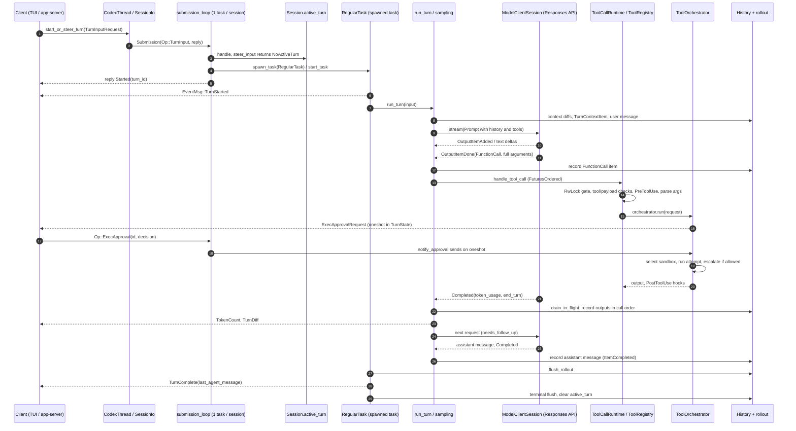

# 01 — Agent loop and work ownership (+ Trace A: normal work)

Codex commit `8ffd91e42aa001b7e897bea812b02f89264f9fa0` (2026-09-29). Paths are relative to the codex repo root.
Evidence classes: [OBSERVED] read in code · [TEST] a test exists (none were executed) · [INFERENCE] my reasoning · [DOC] stated in comments/docs only.

## Summary (10 lines)

1. A request enters as `Op::TurnInput { request, mode, reply }` on a bounded (512) channel; one tokio task per session (`submission_loop`) handles every `Op` in order and replies with a routing decision (`Started` / `Steered` / `NotSubmitted{reason}`) before any hook, persistence or model call.
2. `Session.active_turn: Mutex<Option<ActiveTurn>>` holds at most one `RunningTask` (spawned tokio task + `CancellationToken` + `Arc<TurnContext>`); per-turn waiters and queued input live in `TurnState`.
3. New user input during a turn steers the running Regular turn (queued, merged at the next sampling boundary); Review/Compact turns refuse steering; `spawn_task` (compact, review, `!shell`) replaces a running turn with `TurnAbortReason::Replaced`.
4. Interrupt = cancel token → 100 ms grace → hard abort → model-visible `<turn_aborted>` marker flushed → `TurnAborted`; pending approvals resolve to `Abort`, queued steered input is cleared.
5. `run_turn` repeats sampling while the model emitted tool calls or input is pending; tool calls start at `OutputItemDone` and run concurrently (FuturesOrdered + RwLock gate); outputs are recorded in call order after the stream completes.
6. Authority boundary: registry checks (unknown tool, payload kind, PreToolUse hooks) then the per-tool `ToolOrchestrator` (exec-policy requirement → hooks → Guardian → user approval → sandbox → escalate on denial).
7. Human decisions are in-memory `oneshot`s keyed by call id; `Op::ExecApproval` carries no actor; approval/question request events are classified transient and are not written to the rollout.
8. Planning is advisory: `update_plan` emits a transient `PlanUpdate`; Plan mode's "no mutation" rule is prompt text — the tool plan does not remove mutating tools.
9. `ThreadManager` keeps an in-memory `HashMap<ThreadId, Arc<CodexThread>>` with one shared `AuthManager`; a root turn can be suspended and recovered by another worker, but waiters and queued input are dropped at handoff.
10. Adopt the serial op loop, typed start/steer admission, and cancel/marker/flush ordering; implement decisions and plan-as-constraint independently as durable, attributable records.

## 1. From `Op` submission to a running task

| # | Step | Reference | Class |
|---|---|---|---|
| 1 | Client calls `CodexThread::start_or_steer_turn(TurnInputRequest)`; non-steer modes first run an advisory capacity check. | `codex-rs/core/src/codex_thread.rs:L378-L384`, `:L533-L545`, `:L1187-L1199` | [OBSERVED] |
| 2 | `SessionIo::submit_turn_input` wraps the request in `Submission{id: UUIDv7, op: Op::TurnInput{request, mode, reply}}`, sends on `tx_sub`, awaits the oneshot. Dropping the waiter does not retract the call. | `codex-rs/core/src/session/mod.rs:L995-L1021`, `:L984-L993`, `:L1077-L1079` | [OBSERVED]/[DOC] |
| 3 | Channels created at spawn: `bounded(SUBMISSION_CHANNEL_CAPACITY=512)` for ops, `unbounded()` for events; `submission_loop` spawned as one tokio task. | `codex-rs/core/src/session/mod.rs:L503`, `:L585-L586`, `:L931-L937` | [OBSERVED] |
| 4 | `submission_loop` matches each `Op` serially; `TurnInput` → `turn_input::handle`, reply sent after routing; unknown ops are ignored (`_ => false`). | `codex-rs/core/src/session/handlers.rs:L420-L491`, `:L638` | [OBSERVED] |
| 5 | `handle` dispatches on `TurnInputMode` (`StartOrSteer`, `StartIfIdle`, `ContinueIfIdle`, `Steer`). `start_or_steer` first calls `steer_input`; on `NoActiveTurn` it checks host drain admission, applies settings, builds a `TurnContext`, and calls `spawn_task(.., RegularTask::new())`. | `codex-rs/core/src/session/turn_input.rs:L211-L265`, `:L299-L396`; modes `codex-rs/protocol/src/turn_input.rs:L131-L143` | [OBSERVED] |
| 6 | `spawn_task` = `abort_all_tasks(Replaced)` + `start_task`. `start_task` records the turn id under the `active_turn` lock, drains mailbox mail into the turn, creates a `CancellationToken` and `Notify`, `tokio::spawn`s `task.run(...)`, then stores `RunningTask` in `active_turn`. | `codex-rs/core/src/tasks/mod.rs:L271-L279`, `:L286-L420` | [OBSERVED] |
| 7 | The spawned body runs `SessionTask::run`, flushes the rollout, and (if not cancelled) calls `on_task_finished`, which emits `TurnComplete`/`TurnAborted`. | `codex-rs/core/src/tasks/mod.rs:L364-L403`, `:L629-L887` | [OBSERVED] |
| 8 | `RegularTask::run` emits `TurnStarted`, runs start contributors and prewarm, then loops `run_turn` until no pending input remains or a terminal error is set. | `codex-rs/core/src/tasks/regular.rs:L40-L125` | [OBSERVED] |
| 9 | Events go through `send_event` → persist (policy-filtered) → `tx_event.send` → `CodexThread::next_event`. | `codex-rs/core/src/session/mod.rs:L2237-L2297`, `:L2449-L2508`; `codex-rs/core/src/codex_thread.rs:L706-L708` | [OBSERVED] |

## 2. State ownership

| Object | Owner / lifetime | Primitive | Reference |
|---|---|---|---|
| `Session` | `Arc`, one per thread; comment: "at most 1 running task at a time" | many `Mutex`/`Semaphore` fields | `codex-rs/core/src/session/session.rs:L57-L100` [OBSERVED]/[DOC] |
| `SessionIo` | cloned into `CodexThread`; dropping all `tx_sub` ends the loop | `async_channel` Sender/Receiver, `watch::Receiver<AgentStatus>`, shared termination future | `codex-rs/core/src/session/mod.rs:L398-L412` [OBSERVED] |
| `ActiveTurn` | `Session.active_turn: Mutex<Option<ActiveTurn>>` | `task: Option<RunningTask>`, `turn_state: Arc<Mutex<TurnState>>` | `codex-rs/core/src/state/turn.rs:L31-L35`; `session.rs:L92` [OBSERVED] |
| `RunningTask` | inside `ActiveTurn`; dropping aborts the task | `AbortOnDropHandle<()>`, `CancellationToken`, `Notify`, `TaskKind` (Regular/Review/Compact), optional `AgentExecutionGuard` | `codex-rs/core/src/state/turn.rs:L67-L85` [OBSERVED] |
| `TurnState` | per turn | maps of `oneshot::Sender` for approvals, permissions, user input, elicitations, dynamic tools; `pending_input` queue; tool-call counter; token baseline | `codex-rs/core/src/state/turn.rs:L87-L106` [OBSERVED] |
| `TurnContext` / `StepContext` | `Arc`, turn-scoped; `StepContext` frozen per sampling request (tools, MCP binding, settings); `next_step_settings: ArcSwap` lets `Op::TurnSettings` change later steps only | `ArcSwap`, `Arc<Mutex<Option<ErrorEvent>>>` terminal error | `codex-rs/core/src/session/turn_context.rs:L303-L363`; `session/step_context.rs:L20-L43`; `protocol/src/protocol.rs:L480-L506` [OBSERVED] |
| `ModelClientSession` | created per turn, reused across retries; holds websocket and `x-codex-turn-state` sticky token | `OnceLock<String>` | `codex-rs/core/src/client.rs:L277-L305` [OBSERVED] |
| `ToolCallRuntime` | per sampling request | `Arc<RwLock<()>>` parallel gate | `codex-rs/core/src/tools/parallel.rs:L44-L65` [OBSERVED] |

**One-active-task rule.** Enforced by (a) the `Option<ActiveTurn>` slot guarded by one mutex; (b) `start_or_steer` trying `steer_input` under that lock before starting (`turn_input.rs:L655-L743`); (c) `start_if_idle` reserving an empty `ActiveTurn` and refusing `NotIdle` (`turn_input.rs:L453-L468`); (d) `spawn_task` aborting any running task with `Replaced` (`tasks/mod.rs:L277`; callers include review `session/review.rs:L218` and an idle `!shell` `session/handlers.rs:L120-L128`); (e) `debug_assert!(turn.task.is_none())` (`tasks/mod.rs:L319`, `:L335`) [OBSERVED]. `Op::Compact` aborts the current turn with `Replaced` before its own task (`session/handlers.rs:L244-L252`) [OBSERVED].

## 3. Mid-turn guidance, interruption, pending questions, multiple sessions

### 3.1 Steering (new guidance while a task runs)
- `steer_input` accepts only while a task exists; checks expected turn id, refuses Review/Compact (`ActiveTurnNotSteerable`), empty input, and a different `final_output_json_schema`; stamps an acceptance order and appends to `TurnState.pending_input` (`codex-rs/core/src/session/turn_input.rs:L655-L743`) [OBSERVED]. All refusal reasons are typed (`codex-rs/protocol/src/turn_input.rs:L218-L252`) [OBSERVED].
- Settings in a steered request apply to later turns only (`turn_input.rs:L193-L204`; `protocol/src/turn_input.rs:L89-L97`) [OBSERVED].
- Steered input is merged at the next sampling boundary: `run_turn` drains `pending_input` at each loop iteration and records it with `PersistContext::SteeredUserInput` (`codex-rs/core/src/session/turn.rs:L426-L448`) [OBSERVED]. Cutting the in-flight response early (`watch_user_input` cancels a `preempt` token, `codex-rs/core/src/session/input_queue.rs:L246-L266`) only happens when feature `instant_interrupt` is on; it is `UnderDevelopment`, default off (`codex-rs/core/src/session/mod.rs:L3875-L3880`; `codex-rs/features/src/lib.rs:L1093-L1098`) [OBSERVED]. Inter-agent mailbox mail, by contrast, preempts after a commentary/reasoning item by default (`turn.rs:L2796-L2815`; `defer_mailbox_preemption` default off, `features/src/lib.rs:L1343-L1348`) [OBSERVED].
- `UserShellCommandTask` reports `TaskKind::Regular` (`codex-rs/core/src/tasks/user_shell.rs:L76-L78`), so a steer into a standalone `!shell` turn is accepted; at task end the leftover input is recorded (`tasks/mod.rs:L671-L695`) but only mailbox mail starts a new turn (`tasks/mod.rs:L448-L460`) [INFERENCE: the user message enters history without a model reply].
- Additional channels: `inject_if_running` / `inject_no_new_turn` push items into the active turn or record them without a turn (`codex-rs/core/src/session/inject.rs:L17-L37`, `:L170-L188`) [OBSERVED].

### 3.2 Interruption
- `Op::Interrupt` → `interrupt_task` → `abort_all_tasks(Interrupted)` (`session/handlers.rs:L436-L439`, `:L57-L59`; `session/mod.rs:L4975-L4982`) [OBSERVED].
- `handle_task_abort`: cancel token; wait for `done` or `GRACEFULL_INTERRUPTION_TIMEOUT_MS = 100`; `handle.abort()`; task `abort` hook; record and flush the interrupted-turn marker; run Interrupt hooks; emit `TurnAborted`; flush (`codex-rs/core/src/tasks/mod.rs:L70`, `:L921-L1018`) [OBSERVED].
- In-flight tools return a synthetic output ("Wall time: X seconds\naborted by user" for `exec_command`) that is drained into history (`codex-rs/core/src/tools/parallel.rs:L251-L282`, `:L330-L347`) [OBSERVED].
- After abort, `clear_pending` drops all waiters and queued input of the aborted turn (`tasks/mod.rs:L562-L566`; `session/input_queue.rs:L269-L273`) [OBSERVED]. The comment "Conditional interruption preserves queued input" and `Op::InterruptIfNoPendingInput` exist for callers that must not lose it (`codex-rs/core/src/session/extension_interruption.rs:L1-L2`, `:L61-L99`) [OBSERVED]. Consequence: an input already acknowledged as `Steered` but not yet drained is discarded by a plain interrupt [INFERENCE].
- The app-server checks the expected turn id against its own tracked state, then submits the untargeted `Op::Interrupt` (`codex-rs/app-server/src/request_processors/turn_processor.rs:L1598-L1660`) [OBSERVED]; a turn that ends and is replaced between check and dispatch would be the one interrupted [INFERENCE].

### 3.3 Pending questions (approvals, user input, elicitation)
- Exec approval: insert `oneshot` keyed by `approval_id` or `call_id` into `TurnState`, emit `ExecApprovalRequest`, await; a cleared entry yields `ReviewDecision::Abort` (`codex-rs/core/src/session/mod.rs:L2719-L2807`). Patch approval is the same shape (`:L2814-L2849`) [OBSERVED]. The wait has no timeout of its own; it ends by decision or turn cancellation [OBSERVED].
- `Op::ExecApproval { id, turn_id, decision }` has no actor field (`codex-rs/protocol/src/protocol.rs:L670-L678`); the handler routes by `id` only, turns `Abort` into an interrupt, else `notify_approval`, which logs a warning if no waiter exists (`codex-rs/core/src/session/handlers.rs:L174-L212`; `session/mod.rs:L3301-L3320`) [OBSERVED].
- Precedence: PermissionRequest hooks → Guardian reviewer (if enabled) → user; the source (Hook/Guardian/User) goes to OpenTelemetry only (`codex-rs/core/src/tools/approvals.rs:L479-L551`, `:L873-L885`) [OBSERVED]. `ApprovedForSession` is cached in an in-memory `ApprovalStore` with only `get`/`put` — no revoke path (`codex-rs/core/src/tools/sandboxing.rs:L40-L114`; uses at `state/service.rs:L71`, `session/session.rs:L1703`, `mcp_tool_call.rs:L2249-L2254`) [OBSERVED].
- `request_user_input`: root thread only, mode-gated (default: Plan mode only), one waiter per turn keyed by turn id (`codex-rs/core/src/tools/handlers/request_user_input.rs:L67-L84`; `session/mod.rs:L3036-L3071`; `tools/handlers/request_user_input_spec.rs:L91-L103`) [OBSERVED].
- Durability: the rollout writer filters by `should_persist_event_msg`, which lists `ExecApprovalRequest`, `ApplyPatchApprovalRequest`, `RequestUserInput`, `ElicitationRequest`, `GuardianAssessment`, `Error` and `PlanUpdate` under "Transient, non-durable events" (`codex-rs/rollout/src/policy.rs:L92-L206`; applied at `codex-rs/thread-store/src/local/live_writer.rs:L330`) [OBSERVED]. The durable trace of a decision is the tool call and its output text, e.g. the client's `Denied{rejection}` string or "rejected by user" (`tools/approvals.rs:L443-L473`) [OBSERVED].

### 3.4 Multiple sessions and turn handoff
- `ThreadManager` → `ThreadManagerState { threads: Arc<RwLock<HashMap<ThreadId, Arc<CodexThread>>>>, auth_manager, thread_created_tx (1024), ... }` — one auth manager for all threads, no tenant/principal field (`codex-rs/core/src/thread_manager.rs:L116`, `:L236-L241`, `:L399-L430`) [OBSERVED]. Each thread is an independent `Session` with its own loop [OBSERVED].
- Sub-agent capacity: `DEFAULT_AGENT_MAX_THREADS = Some(6)`, V2 max 4 concurrent threads per session, max depth 1 (`codex-rs/core/src/config/mod.rs:L256-L266`); admission is advisory and not an atomic reservation per its own doc (`codex-rs/core/src/agent/api.rs:L95-L109`) [OBSERVED]/[DOC].
- `Op::SuspendTurnAndShutdown` flushes, re-checks under the lock, cancels without a terminal event, drops waiters and queued input ("Handoff intentionally drops that state"), closes the writer, then announces `ShutdownComplete`; `RecoverTurn` restarts under the same turn id (`codex-rs/core/src/session/turn_suspension.rs:L13-L119`; `session/turn_input.rs:L273-L297`; `codex_thread.rs:L427-L480`) [OBSERVED].

## 4. Planning vs execution

- `update_plan`: refused in Plan mode; otherwise emits `EventMsg::PlanUpdate(args)` and returns "Plan updated" (`codex-rs/core/src/tools/handlers/plan.rs:L66-L99`). Registered only if `config.update_plan_enabled` (`codex-rs/core/src/tools/spec_plan.rs:L1153-L1155`). `PlanUpdate` is transient (`rollout/src/policy.rs:L189`). Nothing reads the plan to constrain tools [OBSERVED].
- Plan mode (`ModeKind::Plan`, `protocol/src/config_types.rs:L674-L684`): the template says "You must not perform **mutating** actions" (`codex-rs/collaboration-mode-templates/templates/plan.md:L17-L40`) and is injected as instructions (`core/src/context/world_state/collaboration_mode.rs:L32`) [DOC]/[OBSERVED]. `spec_plan.rs` contains no `ModeKind`, `.mode()` or `collaboration_mode` reference (grep), and registers `ExecCommandHandler`/`ApplyPatchHandler` without a mode check (`spec_plan.rs:L1097-L1115`, `:L1269-L1272`) [OBSERVED]. Code-level Plan gates: automatic turns cannot run in or enter Plan (`session/turn_input.rs:L65-L81`, `:L423-L431`), `request_user_input` availability, `update_plan` refusal, `<proposed_plan>` parsing (`session/turn.rs:L2611-L2613`) [OBSERVED]. Approval and sandbox policies still apply in Plan mode [INFERENCE from orchestrator having no mode input].
- The `<proposed_plan>` result is durable: `ItemCompleted(TurnItem::Plan)` is persisted in both history modes (`rollout/src/policy.rs:L96-L106`) [OBSERVED].

## 5. Turn completion and event order

- Loop rule: `needs_follow_up = model_needs_follow_up || has_pending_input` (`codex-rs/core/src/session/turn.rs:L566`). A tool call sets `needs_follow_up` (`stream_events_utils.rs:L356`, `:L424`); `end_turn == Some(false)` forces a follow-up (`turn.rs:L2994-L2996`). With no follow-up: Stop hooks may block and inject a continuation prompt (`turn.rs:L653-L700`), optional post-turn compaction (`:L716-L752`), then `break` [OBSERVED].
- `on_task_finished` records leftover input, computes per-turn token deltas, runs Interrupt hooks on abort, emits `TurnComplete{turn_id, last_agent_message, error, timing}` or `TurnAborted`, clears `active_turn`, emits idle lifecycle, flushes, and wakes pending mailbox work (`codex-rs/core/src/tasks/mod.rs:L629-L887`) [OBSERVED].
- `AgentStatus` is derived from emitted events (`TurnStarted`→Running, `TurnComplete`→Completed/Errored, `TurnAborted`→Interrupted/Errored) (`codex-rs/core/src/agent/status.rs:L6-L24`) [OBSERVED].
- Typical order for one tool round: [`ThreadSettingsApplied`] → `TurnStarted` → user-message `ItemStarted/ItemCompleted` → per response: `ItemStarted` / deltas / `ItemCompleted` (legacy `ExecCommandBegin/End` are projections of item events, `protocol/src/legacy_events.rs:L185-L199`) → approval request (if any) → tool output items → `TokenCount` (deferred until tools finish, `turn.rs:L3172-L3179`) → `TurnDiff` (`:L3185-L3193`) → next response … → `TurnComplete` [OBSERVED].

## 6. Trace A — normal work

Tools run concurrently with the stream (hops 13–20 overlap 10–21); the diagram is linearised.

1. `codex-rs/core/src/codex_thread.rs:L378-L384`, `:L533-L545` [OBSERVED]
2. `codex-rs/core/src/session/mod.rs:L995-L1021` (512-slot channel `:L503`) [OBSERVED]
3. `codex-rs/core/src/session/handlers.rs:L485-L491`; `session/turn_input.rs:L299-L341`, `:L655-L667` [OBSERVED]
4. `session/turn_input.rs:L342-L389` (drain admission `:L358`); `tasks/mod.rs:L271-L279`, `:L286-L420` (`tokio::spawn` `:L364`) [OBSERVED]
5. `session/handlers.rs:L490-L491`; `session/turn_input.rs:L393-L395` [OBSERVED]
6. `tasks/regular.rs:L50-L51`; `session/mod.rs:L2218-L2234`, persist `:L2481-L2482`, deliver `:L2500-L2508` [OBSERVED]
7. `tasks/regular.rs:L104-L114`; `session/turn.rs:L163` [OBSERVED]
8. `session/turn.rs:L258-L301`, `:L368-L378`; `session/mod.rs:L4598-L4675` (one `TurnContextItem` per turn `:L4666-L4669`); `hook_runtime.rs:L716-L740`; `session/mod.rs:L3459-L3479`, `:L4463-L4471`; filter `thread-store/src/local/live_writer.rs:L330` [OBSERVED]
9. `session/turn.rs:L517-L533`, `:L1648-L1693`; `build_prompt` `:L1589-L1607` (`parallel_tool_calls: true`); stream `:L2572-L2586`; `client.rs:L2218-L2269` (websocket, else HTTP) [OBSERVED]
10. `session/turn.rs:L2817-L2896`, `:L3002-L3033` [OBSERVED]
11. `session/turn.rs:L2688`, `:L2780-L2790`; `stream_events_utils.rs:L315-L323`; `tools/router.rs:L248-L262` (arguments stay a raw string) [OBSERVED]
12. `stream_events_utils.rs:L346-L347`, `:L79-L104` [OBSERVED]
13. `stream_events_utils.rs:L349-L357`; `session/turn.rs:L2787-L2789`; `tools/parallel.rs:L77-L122` [OBSERVED]
14. `tools/parallel.rs:L196-L209`; `tools/router.rs:L327-L386`; `tools/registry.rs:L527-L661`; `tools/handlers/unified_exec/exec_command.rs:L155-L300`; `tools/handlers/mod.rs:L86-L93` [OBSERVED]
15. `unified_exec/process_manager.rs:L1479-L1505`, `:L1534-L1536`; `tools/orchestrator.rs:L122-L222` [OBSERVED]
16. `tools/approvals.rs:L479-L524`, `:L679-L730`; `session/mod.rs:L2719-L2807` [OBSERVED]
17. `protocol/src/protocol.rs:L670-L678`; `session/handlers.rs:L571-L578` [OBSERVED]
18. `session/handlers.rs:L174-L203`; `session/mod.rs:L3301-L3320` [OBSERVED]
19. `tools/orchestrator.rs:L223-L317`, denial handling `:L318-L420` [OBSERVED]
20. `tools/registry.rs:L684-L778`; `tools/parallel.rs:L95-L120`, failures `:L303-L328` [OBSERVED]
21. `session/turn.rs:L2952-L3000` [OBSERVED]
22. `session/turn.rs:L3162-L3171`, `:L2472-L2500` [OBSERVED]
23. `session/turn.rs:L3172-L3193`; `session/mod.rs:L4846-L4853` [OBSERVED]
24. `session/turn.rs:L541-L566`, `:L426`; re-read history `:L1653-L1662` [OBSERVED]
25. `stream_events_utils.rs:L359-L398`; `session/turn.rs:L653-L755` [OBSERVED]
26. `stream_events_utils.rs:L389-L395` [OBSERVED]
27. `tasks/mod.rs:L378-L394` [OBSERVED]
28. `tasks/mod.rs:L844-L858` [OBSERVED]
29. `tasks/mod.rs:L860-L886` [OBSERVED]

## 7. Findings

**F1 — Serial per-session operation loop.** ADOPT PATTERN — one ordered queue per session removes a class of races cheaply.
- Problem: UI, app-server, sub-agents, realtime and hooks all mutate one session; ordering of settings, starts, steers and decisions must be deterministic.
- Code/state: `SessionIo` + `submission_loop` (§1 rows 2–4). Handlers must stay short; long work is spawned (`run_user_shell_command` `session/handlers.rs:L96-L129`) [OBSERVED].
- Tests: [TEST] `turn_input_submission_reports_started_and_steered_for_concurrent_submissions` (`codex-rs/core/tests/suite/turn_input_submission.rs:L643-L745`) asserts two concurrent submissions yield exactly one `Started` and one `Steered` with the same turn id, and the second model request contains both messages — detects double-start and lost steers.
- Assumptions: unbounded event channel gives no back-pressure on a stalled client [INFERENCE]; unknown ops are silently ignored (`handlers.rs:L638`).
- General; not coding-specific.
- Audit harness: persist the op (with actor, idempotency key) before acknowledging; place each session on one worker via a lease.

**F2 — One active turn with typed start/steer admission.** ADOPT PATTERN — explicit `NotSubmittedReason` is a good contract for human guidance.
- Code: §2 rule, §3.1. Tests: [TEST] `start_only_rejects_active_turn_without_injecting` (`codex-rs/core/src/session/turn_input_tests.rs:L213-L246`, asserts `NotIdle` and nothing enqueued); `steer_only_enforces_expected_turn_id` (`:L858-L949`, asserts `ExpectedTurnMismatch`); `rejects_non_regular_turns` (`:L950-L1017`, Review/Compact refuse steering); `steers_during_tool_drain_preserve_tool_output_and_each_input` (`core/tests/suite/pending_input.rs:L1289-L1391`, asserts three prompts arrive in order and the tool output is recorded exactly once). `injected_user_input_triggers_follow_up_request_with_deltas` is `#[ignore = "TODO(aibrahim): flaky"]` (`pending_input.rs:L788`) — not run by default.
- Limits: steers are accepted in memory only; a plain interrupt discards un-drained steers (§3.2).
- Audit harness: a steer is attributable human guidance — make it durable before ack and link it to the step that consumed it.

**F3 — Cancellation lifecycle with marker-before-terminal and flush barriers.** ADOPT PATTERN — the ordering guarantees are directly reusable.
- Code: §3.2. Tests: [TEST] `interrupt_long_running_tool_emits_turn_aborted` (`core/tests/suite/abort_tasks.rs:L29-L71`); `interrupt_tool_records_history_entries` (`:L205-L303`, asserts the next request contains the aborted `function_call_output` matching `Wall time ... aborted by user`); `abort_regular_task_emits_marker_before_turn_aborted` (`core/src/session/tests.rs:L12143-L12184`, marker `RawResponseItem` precedes `TurnAborted`, no later events); `turn_complete_flushes_terminal_event_after_delivery` / `turn_aborted_flushes_terminal_event_after_delivery` (`:L12068-L12141`, 2 and 3 flushes); `interrupt_if_no_pending_input_checks_turn_and_queue` (`pending_input.rs:L1890-L1990`, conditional interrupt refuses for stale turn or queued input).
- Defaults: 100 ms grace is hard-coded (`tasks/mod.rs:L70`).
- Audit harness: cancellation is a human decision — record who cancelled, and keep partial tool effects as evidence.

**F4 — In-memory, unattributed pending decisions.** IMPLEMENT INDEPENDENTLY — Codex's model assumes one local user in the same process.
- Code: §3.3. Tests: [TEST] `approval_resolution_aborts_turn_when_approval_is_aborted` (`core/src/tools/approvals_tests.rs:L38-L53`, unix-only module) asserts `Abort` maps to `TurnAborted`; `approval_matrix_covers_group` (`core/tests/suite/approvals.rs:L1920-L1944`) runs sandbox×approval scenarios (skipped without network, `:L1929`); `request_user_input_interrupt_emits_deferred_token_count` (`core/tests/suite/request_user_input.rs:L238-L318`). No test found asserting that approval events are not persisted (searched `should_persist_event_msg|is_persisted_rollout_item` in test files: only `rollout/src/recorder_tests.rs:L462`, for `SecurityRiskScore`).
- Limits: no actor, no timeout, no durable request/decision record, session grants not revocable, waiters dropped on suspend.
- Audit harness: durable decision objects (request, evidence, actor, role, reason, time, expiry, revocation) that survive restart.

**F5 — Tool dispatch pipeline and authority boundary.** ADAPT IDENTIFIED CODE — the layering (registry → hooks → orchestrator) is sound; lift the design, not the crate.
- Code: §6 hops 11–20; parallel default `false` (`codex-rs/tools/src/tool_executor.rs:L122-L124`), `exec_command` opts in (`exec_command.rs:L142-L144`); registration-time `tool_policy` filter (`tools/registry.rs:L345`, `:L361`, `:L385`). Argument parse errors are returned to the model, not treated as fatal (`tools/handlers/mod.rs:L86-L93`).
- Tests: [TEST] `read_file_tools_run_in_parallel` (`core/tests/suite/tool_parallelism.rs:L92-L152`) asserts two barrier-synchronised calls finish under 1,600 ms — detects accidental serialisation.
- Audit harness: bind each decision to a principal and a revocable grant; write the decision and the exact arguments to an immutable log before execution.

**F6 — Plan is advisory; Plan mode is a prompt contract.** IMPLEMENT INDEPENDENTLY — an audit plan must constrain execution in code.
- Code: §4. Tests: [TEST] `start_turn_if_idle_keeps_automatic_plan_rejections_atomic` (`core/tests/suite/turn_input_submission.rs:L379-L453`, automatic input cannot enter/leave Plan; settings unchanged on rejection); `request_user_input_unavailable_messages_respect_default_mode_feature_flag` (`core/src/tools/handlers/request_user_input_spec_tests.rs:L158-L170`); `plan_mode_emits_plan_item_from_proposed_plan_block` (`core/tests/suite/items.rs:L458-L515`). No test found that a mutating tool is refused in Plan mode (grep `not allowed in Plan mode`, `fn .*plan_mode`).
- Audit harness: approved plan = versioned artifact; executor checks each step against it; deviation needs a recorded approval.

**F7 — Turn completion rule and durability barriers.** ADOPT PATTERN — "loop until no tool call and no pending input", with flushes around terminal events.
- Code: §5. Limits: rollout write failures are logged and the turn continues (`session/mod.rs:L4463-L4471`; warning text `tasks/mod.rs:L378-L394`) [OBSERVED] — best-effort durability.
- Audit harness: a failed evidence write must stop or park the operation.

**F8 — Suspend/recover by turn id.** ADOPT PATTERN — closest Codex primitive to a durable operation handoff.
- Code: §3.4. Limits: drops waiters and queued input; refuses with live descendants (`turn_suspension.rs:L29-L38`, `:L96-L98`).
- Audit harness: persist pending decisions and queued guidance so a new worker can resume them.

**F9 — Multi-session registry.** IMPLEMENT INDEPENDENTLY — in-memory map with one auth identity is single-user.
- Code: §3.4. Audit harness: tenant/principal on every thread, per-tenant credentials, persistent registry, eviction and leases.

## 8. Hosted-service dependencies (requires hosted service)

- Model wire protocol: only `WireApi::Responses` ("The Responses API exposed by OpenAI at `/v1/responses`", `codex-rs/model-provider-info/src/lib.rs:L104-L108`); websocket transport with the `x-codex-turn-state` sticky-routing contract (`codex-rs/core/src/client.rs:L277-L305`) [OBSERVED].
- `CyberAccessProgram` — "for a ChatGPT-authenticated Codex turn … server-owned" (`codex-rs/protocol/src/turn_input.rs:L145-L154`) [DOC].
- Model catalogue refresh after auth change / ETag (`tasks/mod.rs:L470-L474`; `session/turn.rs:L2945-L2951`) and tool/plugin recommendations using auth (`session/turn.rs:L1753-L1789`) [OBSERVED].
- Guardian auto-review is an extra model-backed reviewer (routing only read here, `tools/approvals.rs:L556-L620`) [OBSERVED].

## 9. Hard numbers

| Value | Reference |
|---|---|
| Op channel capacity 512; event channel unbounded | `core/src/session/mod.rs:L503`, `:L585-L586` |
| Interrupt grace 100 ms | `core/src/tasks/mod.rs:L70` |
| Stream retries default 5 (cap 100); request retries default 4 (cap 100); stream idle timeout 300,000 ms | `model-provider-info/src/lib.rs:L63-L72`, `:L492-L511` |
| Backoff 200 ms × 2^n, ±10 % jitter | `async-utils/src/backoff.rs:L7-L17` |
| User shell timeout 1 h | `core/src/tasks/user_shell.rs:L48` |
| Thread-created broadcast buffer 1,024 | `core/src/thread_manager.rs:L116` |
| Sub-agents: 6 threads (V1), 4 per session (V2), depth 1; V2 waits 10 s min / 30 s default / 1 h max | `core/src/config/mod.rs:L256-L266` |
| Analytics tool-call ids per response 256 | `core/src/session/turn.rs:L2599` |
| Submission ids are UUIDv7 | `core/src/session/mod.rs:L1077-L1079` |

## 10. Coverage and limits

- Read in full or near-full: `protocol/src/turn_input.rs`, `session/submission.rs`, most of `session/handlers.rs` (L55-L240, L338-L718), `session/turn_input.rs`, `tasks/mod.rs`, `tasks/regular.rs`, `state/turn.rs`, `session/turn_suspension.rs`, `session/extension_interruption.rs`, `tools/handlers/plan.rs`, `tools/parallel.rs` (L1-L341). Read in part: `session/turn.rs` (run_turn, sampling, stream loop), `session/mod.rs`, `client.rs` (structs, `stream`), `tools/{registry,router,orchestrator,approvals,sandboxing}.rs`, `stream_events_utils.rs`, `thread_manager.rs`, `rollout/src/policy.rs`, one app-server processor.
- Not read: compaction internals, Guardian reviewer, MCP/elicitation internals (`session/mcp*.rs`), code-mode, realtime, `rollout_reconstruction.rs` (resume), multi-agent spawn/control, websocket/HTTP transport bodies (`client.rs` L1343-L2200), `ext/queue` durable user-message queue beyond its start path (`app-server/src/request_processors/thread_queue_processor.rs:L186-L241`), TUI.
- No build or test was run; [TEST] lines state what a test asserts, not that it passes.

## 11. Reuse candidates

| Candidate | Deps (Cargo.toml) | Licence | Liftable? | Changes needed |
|---|---|---|---|---|
| `codex-rs/async-utils` (`OrCancelExt`, `backoff`) — 110 lines incl. tests | `rand`, `tokio`, `tokio-util` | Apache-2.0 (workspace) | Yes, self-contained | None; trivial to re-implement |
| `codex-rs/protocol/src/turn_input.rs` (`TurnInputMode`, `TurnInputSubmission`, `NotSubmittedReason`) | protocol crate: 33 direct deps (10 `codex-*`, incl. `codex-execpolicy`, `codex-network-proxy`), ICU, `ts-rs` | Apache-2.0 | Types only — copy the enums, not the crate | Add actor, idempotency key, durable ids |
| `codex-rs/core` loop (`submission_loop`, `tasks`, `state`) | 105 direct deps, 69 of them `codex-*` crates | Apache-2.0; root `NOTICE` credits Ratatui (MIT) | No — tightly coupled to `Session` services, MCP, rollout, telemetry | Re-implement the pattern |
| `codex-rs/core-api` + `thread-manager-sample` (500-line driver) | 17 direct deps, all `codex-*`, incl. `codex-core` | Apache-2.0 | Reference only | Shows the minimal client event loop (`thread-manager-sample/src/main.rs:L406-L500`) |
