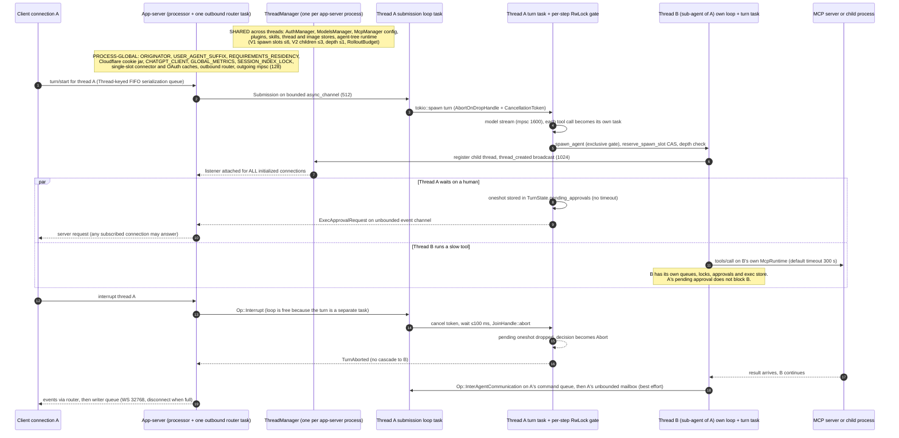

# 02: Concurrency and scheduling, with Trace D (concurrent work)

Codex commit `8ffd91e42aa001b7e897bea812b02f89264f9fa0` (2026-09-29). Paths are relative to the Codex repository root. Every line range below was read. Evidence classes: [OBSERVED], [TEST], [INFERENCE], [DOC].

## Summary (10 lines)

1. Each thread is an actor: one spawned loop reads a bounded 512-slot command queue, and events leave on an **unbounded** channel. The turn runs in its own task, owned by an `AbortOnDropHandle` and a `CancellationToken`.
2. Because the turn runs in its own task, the loop can take interrupts, approval answers and steering at any time. A thread runs at most one turn.
3. `Op::Interrupt`: cancel the token, wait ≤100 ms, `abort()`, then clean up. Commands get SIGTERM, then SIGKILL, on their process group. Yielded `exec_command` terminals **survive** an interrupt.
4. Each tool call runs in its own task and starts while the model is still streaming. A per-step `RwLock<()>` gives shared access to parallel-safe tools and exclusive access to all others. `FuturesOrdered` keeps results in call order.
5. Approvals are in-memory `oneshot` senders with no timeout, and a dropped sender becomes `Abort`. In the app-server, any subscribed connection can answer, except for user-verification requests.
6. Core never blocks when it emits an event. The app-server bounds each hop (128 / 32,768) and disconnects a slow WebSocket client, but stdio makes the router wait, and one router task serves all connections.
7. A sub-agent is a full thread. Limits per root tree: V1 depth ≤1 and ≤6 sub-agents; V2 ≤4 concurrent threads, with LRU eviction. The code documents the V2 running-turn check as advisory, not atomic.
8. A child inherits its parent's approval policy, permission profile, cwd, exec policy, `AuthManager` and tree budget. The parent gets only a best-effort message in its mailbox.
9. The app-server runs one `AuthManager` and one `ThreadManager` per process, plus process-global statics (originator, residency, cookie jar, metrics, single-slot caches). Every new thread is attached to every connection.
10. [INFERENCE] Sound for one principal. Multi-tenant use needs tenant-scoped services, durable decisions bound to a principal, and bounded queues with quotas. Adopt the patterns, not the process model.

## 1. Primitive inventory (`codex-rs/core/src`)

Method: `grep -rn --include=*.rs <pattern> codex-rs/core/src`, excluding `*_tests.rs` and `/tests/`. Inline `#[cfg(test)]` blocks are still counted, so the counts are upper bounds. [OBSERVED]

| Primitive | Hits | Main uses |
|---|---|---|
| `tokio::spawn` | 66 | session loop, turn task, one task per tool call, output readers, eviction, token bridges |
| `CancellationToken` | 223 | turn, tool and exec cancellation (`child_token()` 15, `drop_guard()` 6, `or_cancel(` 17) |
| `AbortOnDropHandle` | 24 | turn task, tool-call task, prewarm tasks |
| `async_channel::bounded` / `unbounded` | 23 / 12 | command queue (512), event queue (unbounded), delegate bridges (512), code-mode dispatch (unbounded) |
| `tokio::sync::mpsc::channel` | 3 | model response stream (1,600) |
| `oneshot` / `watch` / `broadcast` | 25 / 18 / 3 | approval waiters; agent status; thread-created (1,024), exec output (64) |
| `tokio::sync::Mutex` / `std::sync::Mutex` | 40 / 59 | `Session.state`, `active_turn`, `TurnState`; std locks for short critical sections |
| `tokio::sync::RwLock` / `Semaphore` | 6 / 29 | per-step tool gate, thread registry, residency gate / settings persistence, refresh serialization |
| `select!` / `Notify` / `JoinSet` | 39 / 28 / 0 | cancellation races / turn `done` signal / not used (the app-server uses it) |
| `OnceLock` / `LazyLock` | 60 / 13 | lazy state, some of it process-global (§C7) |

## 2. Findings

### C1: The per-thread actor (command queue, event queue, turn task)

1. **Problem.** The thread must accept commands (input, interrupt, approvals) at any time while a long turn runs, and keep one thread's state changes in order.
2. **Code and ownership [OBSERVED].**
   - `Session::spawn_internal` creates `(tx_sub, rx_sub) = async_channel::bounded(SUBMISSION_CHANNEL_CAPACITY)` and `(tx_event, rx_event) = async_channel::unbounded()` (`codex-rs/core/src/session/mod.rs:L585-L586`). `SUBMISSION_CHANNEL_CAPACITY: usize = 512` (`:L503`).
   - `rx_sub` moves into the loop task `tokio::spawn(async move { submission_loop(...) })` (`:L933-L937`). `tx_sub` and `rx_event` live in `SessionIo` (`:L404-L413`), which `CodexThread.io` owns (`codex-rs/core/src/codex_thread.rs:L201-L205`). `Session` owns `tx_event` (`codex-rs/core/src/session/session.rs:L63`).
   - `submission_loop` handles one command at a time: `while let Ok(sub) = rx_sub.recv().await { match sub.op { ... } }` (`codex-rs/core/src/session/handlers.rs:L420-L648`). When every sender is dropped, the loop still runs teardown (`:L649-L658`).
   - The turn runs in a separate task. `start_task` spawns it with `tokio::spawn` and stores `RunningTask { handle: AbortOnDropHandle::new(handle), cancellation_token, done: Arc<Notify>, _agent_execution_guard, .. }` in `ActiveTurn` (`codex-rs/core/src/tasks/mod.rs:L364-L419`; struct at `codex-rs/core/src/state/turn.rs:L74-L86`). `spawn_task` first calls `abort_all_tasks(TurnAbortReason::Replaced)` (`tasks/mod.rs:L271-L280`). A doc comment states the rule: "A session has at most 1 running task at a time" (`session.rs:L59`).
   - Events: `deliver_event_raw` calls `self.tx_event.send(event).await`, which never waits on an unbounded channel (`session/mod.rs:L2500-L2508`). The event is first persisted to the rollout (`:L2480-L2483`), but a persistence error is only logged (`:L4463-L4470`). The rollout writer is a bounded `mpsc::channel::<RolloutCmd>(256)` (`codex-rs/rollout/src/recorder.rs:L1001`), so slow storage back-pressures only that thread's producers.
3. **Tests.** [TEST] `interrupt_long_running_tool_emits_turn_aborted` (`codex-rs/core/tests/suite/abort_tasks.rs:L30-L71`) sends `Op::Interrupt` while `sleep 60` runs and waits for `TurnAborted`. It fails if the turn blocks the loop.
4. **Limits.** At most 512 queued commands per thread. The event queue has no bound, so a stalled consumer grows memory without limit [INFERENCE]. `queued_event_count()` exposes the queue depth (`codex_thread.rs:L710-L716`).
5. **General vs local.** The split between the actor and the turn task is general. The unbounded event queue assumes a local consumer that always drains it.
6. **Audit harness.** It needs bounded event buffers with an explicit overflow policy (spill to a durable log, then let clients resume from an offset). Commands that carry human decisions must be durable.
7. **ADOPT PATTERN.** A bounded queue per entity plus a separately cancellable work task is the right shape. Replace the unbounded event channel.

### C2: Back-pressure and fan-out (core, app-server, connection)

1. **Problem.** A slow reader must not stall unrelated connections or threads.
2. **Code [OBSERVED].**
   - Chain: core `rx_event` (unbounded). Then one listener task per thread runs `conversation.next_event()` (`codex-rs/app-server/src/request_processors/thread_lifecycle.rs:L277-L362`). Then `OutgoingMessageSender.sender`, a bounded `mpsc` with `CHANNEL_CAPACITY = 128` (`codex-rs/app-server-transport/src/transport/mod.rs:L21-L24`; created at `codex-rs/app-server/src/lib.rs:L512-L516`). Then **one** outbound router task for all connections (`lib.rs:L912-L964`). Last, a writer queue per connection: WebSocket `32 * 1024` (`codex-rs/app-server-transport/src/transport/websocket.rs:L46-L49`), stdio 128 (`.../transport/stdio.rs:L53`).
   - Overflow policy in `send_message_to_connection` (`codex-rs/app-server/src/transport.rs:L140-L176`). A connection that can be disconnected gets `try_send`. When the queue is `Full`, the router logs "disconnecting slow connection after outbound queue filled" and cancels that connection's token. A stdio connection (`disconnect_sender: None`, `stdio.rs:L61`) gets `writer.send(..).await`, which parks the shared router. A remote-control transport (hosted) can run beside the local transport (`lib.rs:L856-L868`). [INFERENCE] If both run, a stalled stdio reader delays remote-control delivery.
   - When the ping control queue is full, the WebSocket closes (`websocket.rs:L364-L370`).
   - Inbound requests: each request goes either into a keyed `RequestSerializationQueues` or into its own `tokio::spawn` (`codex-rs/app-server/src/message_processor.rs:L1050-L1060`). The keyed queue is FIFO per key. `Exclusive` requests run alone, `SharedRead` requests run in batches, and each non-empty key has one drain task (`codex-rs/app-server/src/request_serialization.rs:L25-L56`, `L194-L329`). The queues are unbounded `VecDeque`s with a gauge.
   - `ConnectionRpcGate` skips queued work when its connection closes, or when the auth owner generation changes (`codex-rs/app-server/src/connection_rpc_gate.rs:L32-L50`; `codex-rs/app-server-transport/src/connection_auth.rs:L40-L43`). `TurnAdmission` only closes admission during a drain. It does not limit concurrency (`codex-rs/app-server/src/turn_admission.rs:L48-L65`).
   - No cap on connections, root threads or inbound requests was found. Searched `max_threads|max_connections|connection_limit|MAX_CONNECTIONS` in `app-server/src` and `app-server-transport/src`. The only hit is `fuzzy_file_search.rs` `MAX_THREADS = 12`.
3. **Tests.** [TEST]
   - `broadcast_does_not_block_on_slow_connection` (`codex-rs/app-server/src/transport_tests.rs:L418-L505`) asserts that a broadcast returns within 100 ms, the slow connection is removed and its token cancelled, and the fast connection receives the message. It detects a regression to blocking sends.
   - `to_connection_stdio_waits_instead_of_disconnecting_when_writer_queue_is_full` (`:L507-L580`) asserts that stdio messages are delivered in order after the wait, not dropped.
   - In `request_serialization.rs`, these tests detect writer starvation, reordering and cross-key blocking: `later_shared_reads_do_not_jump_ahead_of_queued_write` (`:L861`), `later_shared_read_waits_behind_writer_queued_during_running_read` (`:L669`), `same_key_requests_run_fifo` (`:L341`) and `different_keys_run_concurrently` (`:L384`).
4. **Limits.** "128 messages should be plenty for an interactive CLI" (`transport/mod.rs:L21-L23`). [DOC]
5. **General vs local.** General: disconnecting a slow consumer, keyed exclusive/shared queues, invalidation by generation. Local: the stdio wait, the single router task, unbounded inbound queues.
6. **Audit harness.** It needs per-tenant quotas at admission. Disconnecting a slow consumer must not lose audit events.
7. **ADAPT IDENTIFIED CODE.** `request_serialization.rs` and the generation gate are small and coherent. Replace the router's stdio wait and the unbounded queues.

### C3: Parallel tool calls

1. **Problem.** Let read-only tools overlap, stop side-effecting tools from interleaving, and keep results in call order.
2. **Code [OBSERVED].**
   - Dispatch starts during streaming. For each tool-call output item, `handle_output_item_done` calls `ctx.tool_runtime.clone().handle_tool_call(call, cancellation_token.child_token())` (`codex-rs/core/src/stream_events_utils.rs:L346-L356`). The sampler pushes the resulting future into a `FuturesOrdered` (`codex-rs/core/src/session/turn.rs:L2589`, `L2787-L2789`).
   - The call starts **eagerly**: `AbortOnDropHandle::new(tokio::spawn(...))` runs before the returned future is polled (`codex-rs/core/src/tools/parallel.rs:L196-L244`).
   - The gate: `ToolCallRuntime { parallel_execution: Arc<RwLock<()>> }` is created once per sampling request (`parallel.rs:L45-L65`; `turn.rs:L1638-L1642`). Each call takes `if supports_parallel { lock.read().await } else { lock.write().await }` (`parallel.rs:L205-L209`).
   - Which tools can share: `supports_parallel_tool_calls` defaults to `false` (`codex-rs/tools/src/tool_executor.rs:L122-L124`), and a hidden tool is never parallel (`codex-rs/core/src/tools/registry.rs:L518-L521`). The value is `true` for `exec_command` (`core/src/tools/handlers/unified_exec/exec_command.rs:L142-L144`), `write_stdin`, `view_image`, `tool_search` and MCP resource reads. MCP tools are parallel when they declare it or are read-only (`core/src/tools/handlers/mcp.rs:L148-L152`). `apply_patch`, the multi-agent tools, `plan` and `request_user_input` keep the default, so they run exclusively (grep of `handlers/`).
   - Order: `drain_in_flight` awaits the `FuturesOrdered` after the stream ends and records the outputs in call order (`turn.rs:L2472-L2500`, `L3162-L3171`).
   - Failure isolation: a normal error becomes a failed output for that call only (`parallel.rs:L303-L328`). A panic in a tool task becomes `FunctionCallError::Fatal` (`:L299-L301`). During the drain, a fatal error goes to `error_or_panic`: a panic in debug builds, a log line in release builds (`codex-rs/core/src/util.rs:L81-L87`). Prompt normalization then adds an `"aborted"` output for any call that has none (`codex-rs/core/src/context_manager/normalize.rs:L21-L66`).
   - Cancellation: the tool task is aborted unless it already reached a terminal outcome. The model then sees "aborted by user after {secs}s" (`parallel.rs:L246-L282`, `L330-L346`).
3. **Tests.** [TEST]
   - `read_file_tools_run_in_parallel`, `shell_tools_run_in_parallel` and `mixed_parallel_tools_run_in_parallel` (`codex-rs/core/tests/suite/tool_parallelism.rs:L92-L223`) use a two-participant barrier with a 1 s timeout and assert that the turn takes less than 1.6 s. They detect accidental serialization.
   - `tool_results_grouped` (`:L225-L301`) asserts that all calls come before all outputs and that outputs follow call order.
   - `shell_tools_start_before_response_completed_when_stream_delayed` (`:L303`) detects the loss of eager dispatch.
   - `cancellation_after_handler_finishes_preserves_completed_lifecycle` (`core/src/tools/parallel.rs:L733-L807`) checks that a completed result survives a late cancel. `cancellation_before_dispatch_admission_logs_dispatch_only_timing` (`:L556`) checks that a call waiting on the gate still returns a response when cancelled.
4. **Limits.** The gate covers one sampling request only. `exec_command` is parallel-safe, so two side-effecting shell commands can overlap [INFERENCE]. The code-mode worker creates its own `ToolCallRuntime`, with a separate gate (`codex-rs/core/src/tools/code_mode/delegate.rs:L118-L124`). So this lock does not serialize code-mode nested calls against direct calls [INFERENCE, not verified end to end].
5. **General vs local.** General: a reader/writer gate chosen by declared side effects, and ordered collection of results. Local: the tool or MCP server declares its own parallel safety.
6. **Audit harness.** Parallel safety must be server-side policy per tool, not a self-declaration. Exclusive tools must also serialize across sessions that share a target, such as one evidence store.
7. **ADOPT PATTERN.** About 20 lines of logic: reimplement it, do not lift it.

### C4: Approval waits

1. **Problem.** A tool must pause for a human decision while the rest of the system keeps running.
2. **Code [OBSERVED].**
   - `request_command_approval` takes the `active_turn` lock, then the `turn_state` lock, and inserts a `oneshot::Sender<ReviewDecision>`. It then emits `ExecApprovalRequest` and runs `rx_approve.await.unwrap_or(ReviewDecision::Abort)` (`codex-rs/core/src/session/mod.rs:L2719-L2807`). There is no timeout. With no active turn, the sender is dropped at once, so the result is `Abort`. A duplicate id overwrites the older entry and only logs a warning (`:L2753`).
   - `Op::ExecApproval` (`handlers.rs:L571`) leads to `notify_approval`, which removes the entry by id and sends the decision (`session/mod.rs:L3301-L3320`). The pending maps are in `TurnState` (`state/turn.rs:L88-L107`). `abort_all_tasks` drops them only after the task sees the cancellation (`tasks/mod.rs:L562-L566`).
   - App-server: `take_connection_callback` binds a response to one owner connection only for user-verification requests (`codex-rs/app-server/src/outgoing_message.rs:L561-L580`). For all other requests, the first matching response from any connection wins. Pending requests are replayed to connections that attach later (`:L446-L460`).
   - The waiters are not durable. A code comment says so: "Pending accepted input and interactive waiters live only in this process" (`codex-rs/core/src/session/turn_suspension.rs:L96-L97`). [DOC]
3. **Tests.** [TEST] `interrupting_command_preparation_does_not_start_the_command` (`codex-rs/core/tests/suite/command_lifecycle_tests.rs:L264-L324`) asserts: no approval request, `TurnAborted`, and no `must-not-run.txt` file. `cancelled_guardian_network_review_fails_closed_without_rewriting_turn_state` (`core/tests/suite/network_approval.rs:L396`) checks the same "fail closed" rule for a cancelled review.
4. **Limits.** The wait has no bound. Decisions are keyed by call id, and the only binding to a person is for user-verification requests.
5. **General vs local.** General: failing closed to `Abort` when the waiter is dropped. Local: an unauthenticated in-memory waiter.
6. **Audit harness.** An approval must be a durable record bound to an authenticated principal, with expiry and revocation, that survives a restart.
7. **DO NOT ADOPT.** Keep only the fail-closed rule, and implement durable approvals bound to a principal.

### C5: What `Op::Interrupt` cancels

1. **Problem.** Stop work quickly without leaving orphan processes or corrupt history.
2. **Code [OBSERVED].**
   - Call path: `interrupt`, then `interrupt_task`, then `abort_all_tasks(Interrupted)` (`handlers.rs:L57-L59`; `session/mod.rs:L4975-L4982`).
   - `handle_task_abort`: cancels the token (`tasks/mod.rs:L934`), and optionally interrupts code-mode cells. It then waits up to `GRACEFULL_INTERRUPTION_TIMEOUT_MS = 100` for `done` (`:L70`, `:L950-L958`), and calls `task.handle.abort()` (`:L960`). Last, it runs `SessionTask::abort`, writes the interrupt marker, flushes the rollout and emits `TurnAborted` (`:L921-L1024`). So the task is cooperative first and hard-aborted second.
   - One-shot exec on cancel: `terminate_process_group` (SIGTERM), then a wait of `CANCELLATION_TERMINATION_GRACE_PERIOD = 50 ms`, then `kill_process_group` and `start_kill`. On timeout, the process group is killed at once (`codex-rs/core/src/exec.rs:L71`, `L1024-L1082`). The default exec timeout is 10,000 ms (`:L63`).
   - Backstops for a hard abort: `cmd.kill_on_drop(true)` and, on Linux, a parent-death signal (`codex-rs/core/src/spawn.rs:L95-L141`). [INFERENCE] `kill_on_drop` kills only the direct child. The process-group kill happens only on the cooperative path.
   - `tokio::signal::ctrl_c()` is a `select!` branch in exec (`exec.rs:L1077-L1081`). [INFERENCE] A server that receives SIGINT kills every command in flight.
   - Yielded `exec_command` processes stay in a per-session store (≤64, `codex-rs/core/src/unified_exec/mod.rs:L82`; LRU pruning keeps the 8 most recent, `unified_exec/process_manager.rs:L1723-L1790`). An interrupt does **not** end them. Only `Op::CleanBackgroundTerminals` (`handlers.rs:L61-L63`) or session shutdown (`handlers.rs:L287-L326`) calls `terminate_all_processes`. The interrupt test itself sends `CleanBackgroundTerminals` after `TurnAborted` (`abort_tasks.rs:L70`).
   - Model HTTP stream: `ResponseStream::drop` cancels `consumer_dropped`, so the mapper task drops the provider stream (`codex-rs/core/src/client_common.rs:L135-L139`; `client.rs:L2386-L2407`). The channel holds 1,600 events (`client.rs:L2346`).
   - MCP: aborting the tool task drops the rmcp request future. The default tool timeout is 300 s and the startup timeout 30 s (`codex-rs/codex-mcp/src/rmcp_client.rs:L105-L106`). Whether the protocol's `notifications/cancelled` is sent on drop depends on the rmcp crate; not verified.
   - No cascade from a parent's interrupt to its children was found (searched `descendant|subtree` in `tasks/mod.rs` and `session/handlers.rs`). A child is interrupted only by an explicit tool call (`codex-rs/core/src/agent/control/interrupt.rs:L8-L50`).
3. **Tests.** [TEST]
   - `code_mode_interrupt_terminates_active_cells_and_nested_tools` (`core/tests/suite/code_mode.rs:L5883`).
   - `cancelling_tool_aborts_its_guardian_review`, with direct, code-mode-turn and code-mode-cell cases (`core/tests/suite/guardian_review_cancellation.rs:L39-L43`).
   - `dropped_backpressured_response_stream_traces_cancelled_partial_output` (`core/src/client_tests.rs:L1782-L1830`) asserts that the inference is recorded as `Cancelled` and keeps its partial item.
   - `forward_events_filters_private_events_before_blocked_send_is_cancelled` (`core/src/codex_delegate_tests.rs:L36-L130`) asserts that a cancelled delegate receives `Interrupt` and `Shutdown`.
4. **Limits.** The grace periods (100 ms, 50 ms) are hard-coded. Background terminals and children need separate, explicit cleanup.
5. **General vs local.** General: two-phase cancellation, process-group termination, drop guards. Local: the Ctrl-C branch, and background terminals that outlive the turn.
6. **Audit harness.** A cancellation is also a decision, so record who cancelled and why. Background processes need a lifetime scoped to their owner, and a quota.
7. **ADOPT PATTERN.** Two-phase cancellation with process-group termination carries over directly. Add durable cancellation records and owner-scoped cleanup.

### C6: Sub-agents

1. **Problem.** Delegate subtasks without runaway fan-out, and without escalating permissions.
2. **Code [OBSERVED].**
   - **Multi-agent threads.** `multi_agent` (V1) is stable and on by default. `multi_agent_v2` is stable and off by default (`codex-rs/features/src/lib.rs:L1331-L1342`). `spawn_agent_internal` reserves a slot and calls `spawn_new_thread_with_source`. The child is an ordinary thread with its own loop, queues and turn task (`codex-rs/core/src/agent/control/spawn.rs:L630-L760`).
   - **Delegates** (review and guardian: `run_codex_thread_interactive` and `run_codex_thread_one_shot`). They refuse any approval policy other than `never` (`codex-rs/core/src/codex_delegate.rs:L63-L68`). They forward events through bounded 512-slot bridges, and on cancel they send `Interrupt` and then `Shutdown` (`:L158-L183`, `:L333-L348`).
   - **Limits.** `DEFAULT_AGENT_MAX_THREADS = Some(6)`, `DEFAULT_MULTI_AGENT_V2_MAX_CONCURRENT_THREADS_PER_SESSION = 4`, `DEFAULT_AGENT_MAX_DEPTH = 1`. The V2 wait is 10 s to 1 h, default 30 s (`codex-rs/core/src/config/mod.rs:L256-L266`). In V2, the child cap is the per-session value minus 1 (`:L1621-L1635`).
   - **Spawn slots.** `reserve_spawn_slot` increments a counter with a CAS loop (`try_increment_spawned`). `SpawnReservation` is RAII and releases the slot on drop (`codex-rs/core/src/agent/registry.rs:L89-L106`, `L330-L345`, `L386-L395`). The V1 handler checks depth and returns "Agent depth limit reached. Solve the task yourself." (`codex-rs/core/src/tools/handlers/multi_agents/spawn.rs:L73-L80`). The spawn tool is also hidden past that depth (`codex-rs/core/src/tools/spec_plan.rs:L672-L679`).
   - **V2 running turns.** `AgentExecutionLimiter` checks capacity and increments the count in separate steps. The trait doc says: "This advisory check does not reserve a slot" and "it does not atomically reserve capacity" (`codex-rs/core/src/agent/api.rs:L95-L104`; `control/execution.rs:L34-L90`). [OBSERVED + DOC]
   - **V2 residency.** The children form an LRU list. When the list is full, one idle child (completed, errored or interrupted, with no active turn and an empty mailbox) is shut down under its `residency_gate` write lock (`codex-rs/core/src/agent/control/residency.rs:L100-L212`, `L266-L276`). A submission in progress holds a read guard on that gate (`handlers.rs:L643`).
   - **What a child shares.** It gets the parent config, with the runtime approval policy, reviewer, cwd and permission profile copied from the live turn (`codex-rs/core/src/agent/child_config.rs:L166-L193`). It inherits the exec policy and environments (`spawn.rs:L678-L688`). It uses the same `AuthManager` and managers (`codex-rs/core/src/thread_manager.rs:L402-L429`) and the tree-wide `LocalAgentRuntime`: registry, limiter, residency and `RolloutBudget` (`codex-rs/core/src/agent/control/runtime.rs:L21-L40`).
   - **Event routing.** The child's events stay on the child thread. The app-server attaches a listener to every thread it creates (`lib.rs:L1282-L1300`). The parent gets only a terminal-status `InterAgentCommunication` in its mailbox, delivered "best effort" (`codex-rs/core/src/agent/control/completion.rs:L1-L4`, `L110-L130`). It arrives as `Op::InterAgentCommunication` on the parent's command queue (`codex-rs/core/src/agent/control.rs:L250-L280`). The mailbox is an unbounded `VecDeque` (`codex-rs/core/src/session/input_queue.rs:L97`).
3. **Tests.** [TEST]
   - `commit_holds_slot_until_release`, `reservation_drop_releases_slot` and `thread_spawn_depth_increments_and_enforces_limit` (`core/src/agent/registry_tests.rs:L48-L114`).
   - `execution_guards_count_active_v2_subagent_turns` (`core/src/agent/control/execution_tests.rs:L18-L46`). It is single-threaded and does not exercise the race.
   - `interrupted_v2_agent_is_lost_after_residency_eviction` (`core/src/agent/control/residency_tests.rs:L74-L140`) asserts that an evicted interrupted child stays `ThreadNotFound`.
   - `run_codex_thread_interactive_rejects_approval_policy_that_can_prompt` (`core/src/codex_delegate_tests.rs:L373`).
4. **Limits.** Because the V2 check is advisory, concurrent starts can exceed the limit [INFERENCE]. Eviction can lose an interrupted child for good [TEST]. Completion delivery is best effort.
5. **General vs local.** General: RAII reservations, depth limits, results delivered as mail. Local: authority passed on by cloning the parent's config and its single `AuthManager`.
6. **Audit harness.** A sub-agent must carry the delegating human's authority explicitly. Its evidence must survive eviction. Its limits must be atomic and per tenant.
7. **ADAPT IDENTIFIED CODE** for the reservation pattern. **DO NOT ADOPT** residency eviction.

### C7: Many sessions in one process, and process-global state

1. **Problem.** Share expensive resources (auth, model catalogues, MCP configuration) across threads.
2. **Code [OBSERVED].**
   - `ThreadManager` (the deprecated alias `ConversationManager` is at `codex-rs/core/src/lib.rs:L161-L162`) owns `threads: Arc<RwLock<HashMap<ThreadId, Arc<CodexThread>>>>`. It also owns one `AuthManager`, the models manager, skills, plugins, `McpManager`, extensions, the thread/image stores and the environment manager (`thread_manager.rs:L402-L429`). The app-server builds one `AuthManager` (`codex-rs/app-server/src/lib.rs:L579-L582`) and one `ThreadManager` (`codex-rs/app-server/src/message_processor.rs:L327-L360`).
   - Per thread, in `SessionServices` (`codex-rs/core/src/state/service.rs`): `mcp_runtime` ("The single owner of live MCP connections for this thread"), `unified_exec_manager`, `tool_approvals`, `model_client`, `exec_policy` and `network_proxy`.
   - When a thread is created, the app-server attaches it to **all** initialized connections, with no ownership filter (`lib.rs:L1282-L1300`). If the broadcast lags, the code says "Assumes thread creation volume is low enough that lag never happens" and skips resync (`:L1302-L1308`). [DOC]
   - Process-global statics that affect behaviour across threads [OBSERVED]:

| Static | Location | Risk if tenants shared a process |
|---|---|---|
| `ORIGINATOR`, `USER_AGENT_SUFFIX` | `codex-rs/login/src/auth/default_client.rs:L41`, `L54` | one client identity for every outbound request |
| `REQUIREMENTS_RESIDENCY` ("process-wide residency requirement") | `codex-rs/model-provider-info/src/lib.rs:L46-L62` | one data-residency policy per process |
| `SHARED_CHATGPT_CLOUDFLARE_COOKIE_STORE` ("process-global and may be shared across auth contexts") | `codex-rs/http-client/src/chatgpt_cloudflare_cookies.rs:L17-L22` | cookie jar shared by design (limited to infrastructure cookies) |
| `CHATGPT_CLIENT` | `codex-rs/chatgpt/src/chatgpt_client.rs:L26-L45` | one cached HTTP client |
| `ACCESSIBLE_CONNECTORS_CACHE`, `CONNECTOR_DIRECTORY_CACHE` | `codex-rs/core/src/connectors.rs:L47-L63`; `codex-rs/connectors/src/lib.rs:L91` | single-slot caches; the first is keyed by account, so accounts overwrite each other |
| `MCP_OAUTH_CACHE`, `EPHEMERAL_AUTH_STORE` | `codex-rs/secrets/src/local.rs:L45`; `codex-rs/login/src/auth/storage.rs:L459-L461` | secrets cache (one slot); auth keyed by `codex_home` |
| `GLOBAL_METRICS`, `SESSION_INDEX_LOCK` | `codex-rs/otel/src/metrics/mod.rs:L28`; `codex-rs/rollout/src/session_index.rs:L21` | shared metrics sink; one mutex for every thread-name write |

3. **Tests.** No test was found that asserts isolation between two principals in one process. Searched test function names for `tenant|cross_account|isolat`. The hits concern sandbox write roots (`core/tests/suite/multi_exec_server_sandbox.rs:L103`) and review history (`core/tests/suite/review.rs:L1082`).
4. **Limits.** One identity per `ThreadManager`. No per-connection ownership of threads.
5. **General vs local.** General: services shared behind `Arc`, with per-thread runtimes for connections and processes. Local: a single user owns everything.
6. **Audit harness.** It needs a tenant-scoped container (auth, stores, caches, metrics labels), thread subscriptions filtered by ownership, and no process-global policy.
7. **IMPLEMENT INDEPENDENTLY.** Keep the per-thread runtime split, and replace the process model.

### C8: Queue extension (`ext/queue`)

1. **Problem.** Keep user messages queued durably while a thread is busy, and start them when it becomes idle.
2. **Code [OBSERVED].** The crate describes itself as a "Durable, storage-neutral user-message queue and idle dispatch" (`codex-rs/ext/queue/src/lib.rs:L1`). It uses a SQLite `QueueStore` with ≤100 items per thread (`codex-rs/state/src/lib.rs:L104`). A watcher polls every 10 s and spawns one dispatch task per changed thread, so that "a blocked or failed thread" cannot starve the other queues (`codex-rs/ext/queue/src/service.rs:L88-L91`, `L204-L241`). A per-thread `dispatch_lock` serializes queue edits (`:L247-L262`). An item is deleted only after `start_turn_if_idle` returns `Started` (`:L399`, `:L446`). [INFERENCE] Delivery is at-least-once: a crash between the start and the delete dispatches the item again.
3. **Tests.** [TEST] `externally_changed_queues_dispatch_independently_and_retry_failed_wakes` (`codex-rs/ext/queue/tests/queue_service.rs:L594`), `registered_queue_lifecycle_starts_messages_in_fifo_order` (`:L517`) and `interrupted_turns_pause_queued_messages_but_failed_turns_drain_them` (`:L479`).
4. **Limits.** The 10 s poll adds latency, and there is no idempotency key on the started turn.
5. **General vs local.** A durable queue with one dispatch task per entity is general. SQLite in `codex_home` is local.
6. **Audit harness.** Queued work needs a tenant key, an idempotency key, and an owner recorded with each item.
7. **ADOPT PATTERN.** Use a durable queue with one dispatch task per entity. Make idempotency explicit.

## 3. Trace D: two threads run while one waits on an approval

**Isolation per thread [OBSERVED]:** command queue, event queue, turn task and token, `TurnState` approval map, tool gate, unified-exec store (≤64), MCP runtime, model client.
**Shared per agent tree [OBSERVED]:** registry slots, execution limiter, residency LRU, rollout budget.
**Shared per process in the app-server [OBSERVED]:** `ThreadManager`, `AuthManager`, the outbound router and the statics listed in §C7.

## 4. [INFERENCE] Many engagements and many tenants

- **Many engagements for one principal: workable.** Each thread's actor isolates its queues, locks, approvals and processes, so a slow tool or a pending approval in one engagement does not stall another. Tokio's multi-thread runtime (`codex-rs/arg0/src/lib.rs:L295-L300`) schedules them fairly.
- **Many tenants in one process: not supported without a rebuild.**
  1. Identity is per process in the app-server: one `AuthManager` and one `codex_home`, plus process-global originator and residency statics.
  2. Every new thread is attached to every initialized connection, and a non-verification approval can be answered by any subscribed connection.
  3. There are no quotas. Root threads, connections and inbound requests have no cap, and the event queue and mailbox have no bound. Agent limits apply per root tree, and the V2 limit is advisory.
  4. Approvals and queued input live in memory and are lost on restart. Residency eviction can drop an interrupted sub-agent.
- **Least-change route.** Run one process per tenant (one `ThreadManager`, `codex_home` and `AuthManager` each), strip the process-global statics, filter subscriptions by owner, and move human decisions into a durable store bound to a principal. For a server-first harness, reimplementing the actor pattern with tenant-scoped services is cheaper than hosting this process.

## 5. Hard numbers

| Item | Value | Reference |
|---|---|---|
| Command queue | 512 (bounded) | `core/src/session/mod.rs:L503` |
| Event queue | unbounded | `core/src/session/mod.rs:L586` |
| Model stream channel | 1,600 | `core/src/client.rs:L2346` |
| Interrupt grace / exec kill grace | 100 ms / 50 ms | `core/src/tasks/mod.rs:L70`; `core/src/exec.rs:L71` |
| Default exec timeout / IO drain | 10,000 ms / 2,000 ms | `core/src/exec.rs:L63`, `L94` |
| Unified exec processes | 64 per session (8 protected by recency) | `core/src/unified_exec/mod.rs:L82`; `process_manager.rs:L1773-L1779` |
| MCP startup / tool timeout | 30 s / 300 s | `codex-mcp/src/rmcp_client.rs:L105-L106` |
| V1 sub-agents / depth | 6 / 1 | `core/src/config/mod.rs:L256`, `L266` |
| V2 concurrent threads per session | 4 (root + 3); wait 10 s–1 h, default 30 s | `core/src/config/mod.rs:L257-L260`, `L1621-L1635` |
| Thread-created broadcast | 1,024 | `core/src/thread_manager.rs:L116` |
| App-server channels / WS writer | 128 / 32,768 | `app-server-transport/src/transport/mod.rs:L24`; `websocket.rs:L48` |
| Rollout writer channel | 256 | `rollout/src/recorder.rs:L1001` |
| Queue items per thread / poll | 100 / 10 s | `state/src/lib.rs:L104`; `ext/queue/src/service.rs:L96` |
| Idle thread unload delay | 60 s default | `core/src/config/mod.rs:L3916-L3917` |

## 6. Feature flags and hosted-service dependencies

- `multi_agent` (V1): on by default. `multi_agent_v2`: off by default, but can be enabled per model. `CodeModeInterrupt`, `DeferMailboxPreemption` and `features.rollout_budget` are optional (`features/src/lib.rs:L1331-L1346`; `core/src/config/mod.rs:L2892-L2950`).
- **Requires hosted service:** remote control (connects to `chatgpt_base_url`, `app-server/src/lib.rs:L856-L868`); the ChatGPT connector caches and client (§C7); the Guardian review paths (the reviewer's model, not studied in depth).

## Coverage and limits

- Read in full or in the relevant parts: the session actor, handlers, task start and abort, `TurnState`, `parallel.rs`, the approval functions, exec cancellation, the agent registry/limiter/residency/spawn/child config/completion, the delegate module, the app-server fan-out, the request queues, the RPC gate, the queue extension, and the global statics listed above.
- Not read in depth: the `orchestrator.rs` retry flow beyond the approval call sites; guardian reviewer internals; realtime conversation channels; code-mode runtime internals; the rmcp crate (drop-time cancellation not verified); `exec-server` remote processes; `thread_status.rs`; the TUI and CLI clients; Windows paths.
- Counts in §1 are grep-based upper bounds. No test was executed.

## Reuse candidates

| Candidate | Deps (Cargo.toml) | Licence | Coherent to lift? | Changes needed |
|---|---|---|---|---|
| `codex-rs/async-utils` (`OrCancelExt`, backoff) | `rand`, `tokio`, `tokio-util` | Apache-2.0 (workspace) | Yes, tiny | none |
| `codex-rs/app-server/src/request_serialization.rs` (keyed exclusive/shared FIFO) | inside `codex-app-server`: `tokio`, `futures`, `codex-diagnostics` Gauge, protocol scope type, `ConnectionRpcGate` | Apache-2.0 | Yes, about 330 lines plus tests | replace the key enum and the gauge; add queue-depth limits |
| `connection_rpc_gate.rs` + `app-server-transport/src/connection_auth.rs` (invalidation by generation) | `tokio`, `tokio-util` `TaskTracker`, `codex-login` watch | Apache-2.0 | Pattern, about 100 lines | substitute a tenant or permission revision for `AuthManager` |
| `codex-rs/utils/pty` process-group helpers | `anyhow`, `portable-pty`, `tokio`, `libc` | Apache-2.0 | Yes, for Unix process-group kill and parent-death signal | none for Unix |
| Tool gate (`core/src/tools/parallel.rs`), `SpawnReservation` (`core/src/agent/registry.rs`) | deeply coupled to `codex-core` | Apache-2.0 | No | reimplement the pattern (small) |

NOTICE credits only Ratatui (MIT), which none of these crates include.
