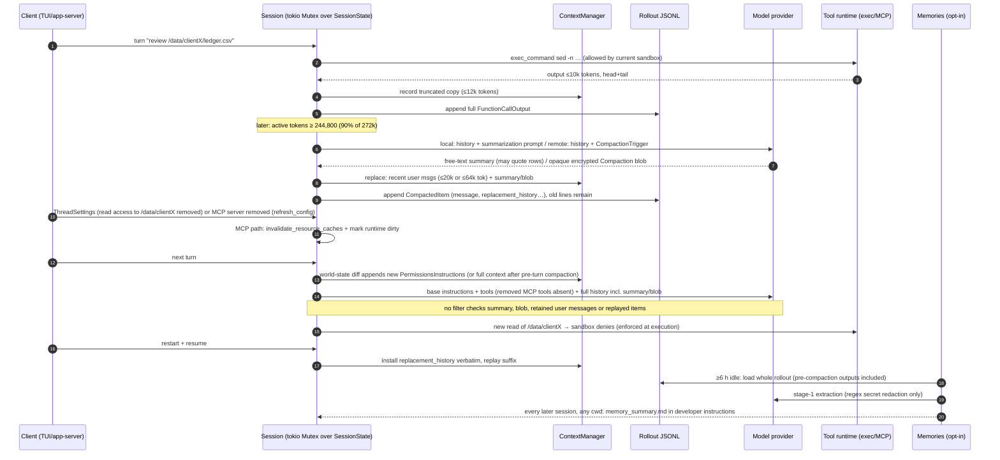

# 06 — Context and memory, plus Trace C (context and permission change)

Codex checkout: commit `8ffd91e42aa001b7e897bea812b02f89264f9fa0` (2026-09-29). Paths are relative to the Codex repo root. Licence Apache-2.0 (root `LICENSE`, workspace `license = "Apache-2.0"` at `codex-rs/Cargo.toml:L167`; `NOTICE` names only Ratatui-derived code).

## Summary (10 lines)

1. One `ContextManager` (`Arc<Vec<ResponseItemEnvelope>>`, copy-on-write) lives in `SessionState`, guarded by `Session.state: tokio::sync::Mutex`; every sampling request re-sends the whole normalized history with `store: false`.
2. Prompt = model base instructions + tools + history. The head of history is an initial-context bundle (developer policy, permissions, memories; user-role AGENTS.md and environment) rendered from a "world state" and diffed on each later turn.
3. Changes (AGENTS.md removed, permissions changed) are appended as replacement notices. Stale text leaves the window only when compaction replaces history.
4. Auto-compaction fires at min(config, 90%) of the context window (244,800 of the 272,000 catalog default); a hard cap is 95% (258,400). Counts = server usage + 4-bytes-per-token estimates.
5. Tool output: live history keeps at most 12,000 tokens (10k policy × 1.2, head+tail), but the rollout keeps the untruncated item. Exec output is capped at 1 MiB collected and 10k tokens shown.
6. Local compaction: the model writes a free-text handoff that must include "critical data, examples, or references"; history becomes ≤20k tokens of recent user messages + summary. Tool calls/outputs, assistant text and developer messages are dropped.
7. Remote compaction (OpenAI, Azure Responses, Bedrock; requires hosted service) returns one opaque encrypted `Compaction` item; the client keeps ≤64k tokens of user messages plus the blob and cannot inspect or redact it.
8. Resume and fork install `CompactedItem.replacement_history` verbatim and replay the suffix; no step re-checks content against current permissions.
9. Memories (opt-in, default off) read whole rollout files from every project under `CODEX_HOME`, extract with a model, store in `memories_1.sqlite` and `~/.codex/memories`, and inject a ≤2,500-token summary into every later session.
10. Trace C: after revocation Codex re-checks at tool execution and refreshes policy text, but summaries, retained user messages, opaque blobs, the rollout and memories still carry the excerpt into later model requests.

## 1. History ownership and per-turn prompt assembly

**State ownership [OBSERVED].** `Session` (shared as `Arc<Session>`) holds `state: Mutex<SessionState>` (`codex-rs/core/src/session/session.rs:L60-L68`; the `Mutex` is `tokio::sync::Mutex`, imported at `codex-rs/core/src/session/mod.rs:L188`). `SessionState.history: ContextManager` (`codex-rs/core/src/state/session.rs:L69-L77`). `ContextManager.items: Arc<Vec<ResponseItemEnvelope>>` is shared by snapshots until a writer calls `Arc::make_mut` (`codex-rs/core/src/context_manager/history.rs:L89-L125`). Readers clone under the lock and release it (`codex-rs/core/src/session/mod.rs:L4473-L4476`); a 1-permit `thread_settings_persistence` semaphore orders settings commits against compaction checkpoints (`session.rs:L66-L68`). `history_reset: CancellationToken` is cancelled when compaction invalidates reviews or history is reset, stopping work bound to discarded history (`state/session.rs:L76-L77`, `L186-L205`).

**Per-request assembly [OBSERVED].** Each step clones history and calls `for_prompt`, which only normalizes (call/output pairing, image/audio stripping) (`codex-rs/core/src/session/turn.rs:L515-L522`, `L1656-L1672`; `history.rs:L581-L593`, `L929-L945`). `build_prompt` fills `Prompt { input, tools, parallel_tool_calls, base_instructions, output_schema, … }` (`turn.rs:L1588-L1605`; struct at `codex-rs/core/src/client_common.rs:L21-L43`). The request sets `store: false` (`codex-rs/core/src/client.rs:L997`). Base instructions are the model catalog's `instructions_template` (`codex-rs/prompts/src/model_instructions.rs:L8-L17`, `session/mod.rs:L1489-L1506`); for `use_responses_lite` models they and the tools become the first input items (`client.rs:L894-L939`).

**Order of model-visible content [OBSERVED]**

| # | Item | Role | Source |
|---|---|---|---|
| 0 | `instructions` = base instructions; `tools` = tool router specs | top-level | `turn.rs:L1588-L1605` |
| 1 | Developer bundle: model-switch notice first, config `developer_instructions`, extension thread/turn fragments (e.g. memories read-path), world-state developer sections (permissions, collaboration mode, persistent mode, apps, plugins, skills catalog), recommended plugins | developer | `session/mod.rs:L4222-L4410` |
| 2 | Separate developer messages (token-budget context, multi-agent role, fragments that require separation), then multi-agent mode | developer | `session/mod.rs:L4411-L4430` |
| 3 | Contextual user message: AGENTS.md (`# AGENTS.md instructions … <INSTRUCTIONS>`), then environment context (cwd roots, shell, date, timezone, network, filesystem policy, subagents) | user | `session/mod.rs:L4431-L4436`; `codex-rs/core/src/context/user_instructions.rs:L10-L35`; `codex-rs/core/src/context/world_state/environment.rs:L198-L218` |
| 4 | Guardian policy (guardian subagents only), managed developer instructions | developer | `session/mod.rs:L4437-L4458` |
| 5 | Conversation: user/assistant messages, reasoning, tool calls and (truncated) outputs, later context diffs, selected `<skill>` contents (user role), compaction summary | mixed | `history.rs:L533-L576`; `codex-rs/ext/skills/src/fragments.rs:L39-L110` |

Section order comes from an `IndexMap` filled in `codex-rs/core/src/session/world_state.rs:L116-L330` (AGENTS.md at `L163`, permissions at `L184-L201`, environments at `L238`); the skills catalog (`host_skills`, `codex-rs/ext/skills/src/world_state.rs:L14`) is shifted before permissions (`codex-rs/core/src/context/world_state/mod.rs:L358-L381`). AGENTS.md discovery belongs to another reviewer.

**Steady-state diffs [OBSERVED].** The first turn (or any turn after `reference_context_item` is cleared) injects full context; later turns emit only world-state diffs (`session/mod.rs:L4598-L4676`, full-injection condition at `L4609`; `history.rs:L446-L466`). AGENTS.md diffs append "These AGENTS.md instructions replace all previously provided AGENTS.md instructions." or "The previously provided AGENTS.md instructions no longer apply." (`codex-rs/core/src/context/world_state/agents_md.rs:L9-L11`, `L52-L79`). A permission change re-emits full `PermissionsInstructions`; newly approved command prefixes emit only an "approved prefix" note; removing a prefix re-emits the full block (`codex-rs/core/src/context/world_state/permissions.rs:L94-L130`). Nothing removes the superseded text from history [OBSERVED: no removal path in `history.rs` besides compaction/rollback/`remove_first_item`].

[TEST] `removing_an_approved_prefix_renders_full_permissions` (`codex-rs/core/src/context/world_state/permissions_tests.rs:L158-L175`) fails if revoking an approved prefix produces no model-visible update. `snapshots` (`codex-rs/core/src/context/world_state/agents_md_tests.rs:L5-L29`) pins replacement/removal notices.

## 2. Token budgeting (numbers)

| Quantity | Default | Reference |
|---|---|---|
| Context window | 272,000 (catalog; overrides up to `max_context_window` 872,000); unknown-model fallback 272,000 | `codex-rs/models-manager/models.json:L34-L35`; `codex-rs/models-manager/src/model_info.rs:L19-L29`, `L127-L133` |
| Usable window (hard cap) | `effective_context_window_percent` 95 → 258,400 | `codex-rs/protocol/src/openai_models.rs:L389-L391`, `L519-L523`; `codex-rs/core/src/session/context_window.rs:L84-L86` |
| Auto-compact limit | min(config/catalog value, 90% of window) → 244,800 | `openai_models.rs:L525-L536` |
| Limit scope | `Total` (alternative `BodyAfterPrefix`) | `codex-rs/protocol/src/config_types.rs:L49-L55`; `context_window.rs:L60-L81` |
| Trigger | scope tokens ≥ limit + fallback buffer (0 unless `auto_compact_fallback_prompt`), or active ≥ hard cap | `context_window.rs:L98-L115`; `codex-rs/core/src/config/mod.rs:L1283-L1289` |
| Post-turn compaction | 0 = disabled | `codex-rs/config/src/config_toml.rs:L185-L189`; `config/mod.rs:L4290-L4292`; `turn.rs:L715-L736` |
| Token estimate | ceil(bytes/4); image 7,373 bytes ≈ 1,844 tokens; original-detail ≤10,000 patches | `codex-rs/utils/string/src/truncate.rs:L4`, `L71-L84`; `history.rs:L1040-L1060` |

Usage = last server-reported `total_tokens` plus estimates for items recorded after the last model-generated item, plus older encrypted reasoning when the server does not account for it (`history.rs:L863-L927`). `rollout_budget.rs` is a separate session-tree weighted token budget with reminders and a hard stop (`codex-rs/core/src/rollout_budget.rs:L18-L67`). `memory_usage.rs` is only memory-read telemetry, not budgeting (`codex-rs/core/src/memory_usage.rs:L9-L34`). Triggers: pre-turn (`turn.rs:L1298-L1326`), mid-turn when follow-up is needed (`turn.rs:L600-L631`), model downshift or `comp_hash` change (`turn.rs:L1366-L1468`), manual `Op::Compact`, which first aborts running tasks (`codex-rs/core/src/session/handlers.rs:L244-L252`, `L603-L606`).

[TEST] `auto_compact_clamps_config_limit_to_context_window` (`codex-rs/core/tests/suite/compact.rs:L4653-L4712`) fails if a configured limit above the window (200 vs 100) is not clamped to 90%.

## 3. Tool output truncation and full-document access

- **History copy [OBSERVED].** `record_item_with_metadata` truncates a clone of each `FunctionCallOutput`/`CustomToolCallOutput` to the saved per-item limit or policy × 1.2 (`history.rs:L533-L576`; `codex-rs/utils/output-truncation/src/lib.rs:L14-L18`, `L41-L56`). The doc comment says: "Tool output truncation applies only to live history, preserving full rollout payloads" (`history.rs:L494-L509`). `record_prepared_conversation_items` records the truncated copy and appends the original to the rollout (`session/mod.rs:L3489-L3503`, `L3575`, `L3585-L3591`).
- **Policy [OBSERVED].** The catalog sets `truncation_policy {mode: tokens, limit: 10000}` (`models.json:L15-L18`); the fallback is 10,000 bytes (`model_info.rs:L127`); `tool_output_token_limit` overrides it (`model_info.rs:L32-L44`; `config_toml.rs:L337-L338`).
- **Method [OBSERVED].** Middle truncation with a 50/50 head/tail split and the marker `…N tokens truncated…`, plus a header "Warning: truncated output (original token count: N) / Total output lines: M" (`truncate.rs:L15-L69`, `L126-L136`; `output-truncation/src/lib.rs:L20-L31`).
- **Exec [OBSERVED].** The collection cap is `UNIFIED_EXEC_OUTPUT_MAX_BYTES` = 1 MiB and model-facing `DEFAULT_MAX_OUTPUT_TOKENS` = 10,000, min'd with the model policy; the text is fitted to the serialization budget so history does not truncate twice (`codex-rs/core/src/unified_exec/mod.rs:L79-L81`, `L227-L229`; `codex-rs/core/src/tools/context.rs:L379-L394`, `L482-L489`, `L550-L574`).
- **MCP [OBSERVED].** Event copies are collapsed to a 1 MiB preview (`codex-rs/core/src/mcp_tool_call.rs:L123-L124`, `L975-L1017`; `codex-rs/utils/pty/src/lib.rs:L25`). The model-visible output is truncated only in live history.
- **Full documents [OBSERVED].** No local whole-file read tool exists: handlers are listed in `codex-rs/core/src/tools/handlers/`, and `read_file` appears only as the hosted `notes` namespace (`codex-rs/core/src/tools/handlers/extension_tools.rs:L82-L94`). Files reach the model through `exec_command` excerpts (head/tail when large) or through user-configured MCP servers [INFERENCE: the model pages by issuing ranged reads]. `view_image` turns a file into a data URL; images are resized to 2048 px / 2,500 patches (high) or 6000 px / 10,000 patches (original), and inputs over 1 GiB are refused (`codex-rs/utils/image/src/lib.rs:L24-L32`, `L73-L84`, `L275-L302`). `AttachmentStore` is a storage-neutral upload/resolve interface with a TTL-bounded fresh URL; only an inline implementation ships (`codex-rs/attachment-store/src/lib.rs:L23-L70`, `L163`).

[TEST] `record_items_truncates_function_call_output_content` and `record_items_respects_custom_token_limit` (`codex-rs/core/src/context_manager/history_tests.rs:L1997-L2040`, `L2075-L2103`) fail if an oversized output is stored untruncated or without the marker. No test found asserts that the rollout keeps the full payload (searched `history_tests.rs` and `core/tests/suite/truncation.rs` names for "rollout").

## 4. Compaction

**Local (summarising) [OBSERVED].** `run_compact_task_inner_impl` clones history, appends the summarization prompt as a user message, and streams a normal Responses request to the configured provider (`codex-rs/core/src/compact.rs:L245-L300`). On `ContextWindowExceeded` it drops the oldest item and retries (`compact.rs:L311-L338`). Summary = `SUMMARY_PREFIX` + the last assistant message (`compact.rs:L343-L356`). The prompt asks for "Current progress and key decisions", "What remains to be done" and "Any critical data, examples, or references needed to continue" (`codex-rs/prompts/templates/compact/prompt.md:L1-L9`). The new history is the newest user messages within a 20,000-token budget (older ones truncated, non-text media dropped), followed by one user-role `CompactionSummary` (`compact.rs:L55`, `L662-L735`; `codex-rs/core/src/context/compaction_summary.rs:L17-L36`). Everything else is dropped: tool calls, tool outputs, assistant messages, reasoning and developer/contextual messages. Pre-turn and manual compaction leave `reference_context_item = None`, so the next turn reinjects fresh full context; mid-turn compaction inserts current initial context before the last real user message (`compact.rs:L57-L71`, `L359-L389`, `L591-L653`). A warning follows: "Heads up: Long threads and multiple compactions can cause the model to be less accurate…" (`compact.rs:L396-L400`).

**Remote v2 [OBSERVED; requires hosted service].** Selected when `provider.capabilities().remote_compaction == V2`: OpenAI and Azure Responses (`codex-rs/model-provider/src/provider.rs:L37-L44`, `L461-L473`) and Amazon Bedrock (`codex-rs/model-provider/src/amazon_bedrock/mod.rs:L283`); other providers use local compaction (`turn.rs:L1500-L1530`). Before sending, the newest tool outputs are replaced with "Output exceeded the available model context and was truncated" until the estimate fits (`codex-rs/core/src/compact_remote_history.rs:L16-L17`, `L66-L125`). The whole history plus `CompactionTrigger {}` is sent (`codex-rs/core/src/compact_remote_v2_attempt.rs:L39-L87`), and exactly one `ResponseItem::Compaction { encrypted_content }` is required back (`codex-rs/core/src/compact_remote_v2.rs:L440-L501`). The client keeps user messages and hook prompts (≤64,000 tokens; agent messages ≤10,000 tokens) and appends the opaque blob (`compact_remote_v2.rs:L75-L79`, `L504-L530`, `L555-L601`). If previous-model compaction fails, it retries with the current model (`codex-rs/core/src/compact_model_fallback.rs:L9-L16`; `turn.rs:L1337-L1362`).

**Token-budget reset [OBSERVED; feature `token_budget`, UnderDevelopment, default off].** Compaction installs a fresh window with no summary: initial context plus optionally retained client developer messages (`codex-rs/core/src/compact_token_budget.rs:L19-L84`; `session/mod.rs:L4525-L4575`; `codex-rs/features/src/lib.rs:L1709-L1713`). The `new_context_window` tool lets the model request this: "A new context window will start without summarizing conversation history." (`codex-rs/core/src/tools/handlers/new_context_window.rs:L13-L14`). The optional history-notes extension exposes server-side `alpha/history/v2/*` and `alpha/notes/v2/*` tools (requires OpenAI provider + Codex-backend auth; requires hosted service) (`codex-rs/ext/history-notes/src/extension.rs:L45-L65`; `codex-rs/ext/history-notes/src/tools.rs:L87-L95`).

**Persistence and resume [OBSERVED].** `replace_compacted_history` swaps history under the state lock, then appends `RolloutItem::Compacted(CompactedItem{ message, replacement_history, guardian_history, retained_context, mcp_resource_origins, window ids, compaction_response_id, latest_token_usage_record, resume_metadata })`, a world-state checkpoint, an optional `TurnContext` and a settings event (`session/mod.rs:L4025-L4135`; `codex-rs/history/src/lib.rs:L275-L295`). The rollout is append-only JSONL under `CODEX_HOME/sessions` (`codex-rs/rollout/src/lib.rs:L86-L87`; `Compacted` always persisted at `codex-rs/rollout/src/policy.rs:L10-L25`), so pre-compaction items stay on disk. Resume selects the newest compaction that has `replacement_history`, installs it verbatim and replays only later items, re-truncating tool outputs with the current model policy (`codex-rs/core/src/session/rollout_reconstruction.rs:L59-L90`, `L395-L470`). Compact hooks receive `transcript_path` and may stop compaction, not edit it (`codex-rs/core/src/hook_runtime.rs:L544-L569`). [INFERENCE] `replace_compacted_history` performs no version check between the pre-summary clone and the swap, so correctness depends on the single-writer turn discipline and on manual compaction aborting tasks first.

**Tests.**
- [TEST] `local_compaction_respects_tool_metadata_state` (`codex-rs/core/src/compact_tests.rs:L26-L201`) fails if local compaction sends a `compaction_trigger`, drops tool outputs from the summarisation request or omits the prefixed summary.
- [TEST] `build_token_limited_compacted_history_truncates_overlong_user_messages` (`compact_tests.rs:L428-L476`) fails if retained user text exceeds the budget, loses its id, or the summary is not last.
- [TEST] `build_compacted_history_preserves_user_message_passthrough_metadata` (`compact_tests.rs:L501-L555`) fails if images or audio survive local compaction.
- [TEST] `build_v2_compacted_history_filters_to_installed_retention_shape` (`compact_remote_v2.rs:L853-L893`) fails if developer, system or assistant messages, function calls or older compaction blobs survive remote compaction.
- [TEST] `compact_resume_and_fork_preserve_model_history_view` (`codex-rs/core/tests/suite/compact_resume_fork.rs:L197-L352`) fails if resume or fork alters the post-compaction prompt prefix; it asserts the summary is carried forward byte for byte.
- [TEST] `manual_compaction_refreshes_global_instructions_for_next_turn` and `mid_turn_compaction_uses_refreshed_global_instructions` (`codex-rs/core/tests/suite/compact.rs:L5410-L5485`, `L5489-L5559`) fail if the stale AGENTS.md fragment survives compaction or is duplicated. The mock summary is the literal "summary", so no test checks what a real summary quotes.

## 5. Retained decisions after compaction

- **Session-scoped permission grants [OBSERVED].** `request_permissions` grants with `PermissionGrantScope::Session` live in `SessionState.granted_permissions_by_environment_id` (`state/session.rs:L103`, `L416-L438`; `session/mod.rs:L3185-L3212`), outside history, so compaction does not touch them. Turn-scoped grants live in `TurnState`. No `RolloutItem` variant carries grants (`codex-rs/history/src/lib.rs:L201-L217`) [INFERENCE: they are lost on resume].
- **Approved command prefixes [OBSERVED].** They live in exec-policy state (another reviewer); after pre-turn or manual compaction the next turn re-renders full permission instructions with them (`session/mod.rs:L4609`).
- **RetainedContext [OBSERVED].** Verified `request_user_input` answers and retained user/assistant text, bounded to 8 records, 16 KiB per record and 64 KiB per family, are kept "outside the model's compaction contract" and persisted in `CompactedItem` (`codex-rs/history/src/retained_context.rs:L1-L42`). Consumers are Guardian review and multi-agent authorization, not the main prompt (grep of `retained_context()` consumers: `codex-rs/core/src/guardian/prompt.rs:L293`, `codex-rs/core/src/agent/control/user_authorization.rs:L103`).
- **Plan state [OBSERVED/INFERENCE].** `update_plan` stores the plan only in its call arguments; the output is the literal "Plan updated" (`codex-rs/core/src/tools/handlers/plan.rs:L21-L43`). Both compaction modes drop function calls, so the plan survives only as prose in the summary [INFERENCE].
- **Pending tool results [OBSERVED].** Local compaction discards them; normalization synthesizes outputs for orphan calls (`codex-rs/core/src/context_manager/normalize.rs:L21`, `L155`).
- **Goals [OBSERVED].** The goal extension keeps goals via the state runtime (`codex-rs/ext/goal/src/extension.rs:L61`; `goals_1.sqlite` at `codex-rs/state/src/sqlite.rs:L29`); user goal text over 700 bytes is omitted whole "so truncation cannot turn a restriction into a grant" (`codex-rs/core/src/context/user_goal.rs:L1-L11`).

## 6. Memories: extraction, storage, scope, loading, retirement

- **Gate [OBSERVED].** Feature `memories` is Stable but default off (`features/src/lib.rs:L1159-L1164`). It is skipped for ephemeral and sub-agent sessions (`codex-rs/memories/write/src/start.rs:L24-L38`). It is triggered on every app-server `turn/start` with input, not only at session start as `memories/README.md` says (`codex-rs/app-server/src/request_processors/turn_processor.rs:L596`, `L686-L698`); the README's `core/src/memories/` path no longer exists [DOC stale].
- **Rate-limit guard [OBSERVED; requires hosted service when Codex-backend auth is used].** It calls the ChatGPT backend and skips below 25% remaining (`codex-rs/memories/write/src/guard.rs:L9-L49`).
- **Phase 1 [OBSERVED].** It claims up to 2 rollouts per start (idle ≥6 h, age ≤10 days, `memory_mode = 'enabled'`, `cwd_filters: None`, `project_id: None`, excluding the current thread) (`codex-rs/state/src/runtime/memories.rs:L224-L256`; defaults at `codex-rs/config/src/types.rs:L55-L60`). It loads the **entire rollout file** (`codex-rs/memories/write/src/phase1.rs:L267`). It keeps user/assistant messages and all tool calls/outputs; it drops developer messages, AGENTS.md and `<skill>` fragments (`codex-rs/memories/write/src/rollout_input.rs:L260-L296`). Input is truncated to 70% of the usable window (180,880 tokens) or 150,000 (`codex-rs/memories/write/src/prompts.rs:L121-L129`; `codex-rs/memories/write/src/lib.rs:L80-L102`). It applies four `redact_secrets` regexes (bearer tokens, OpenAI keys, AWS key IDs, secret assignments) (`phase1.rs:L397-L422`; `codex-rs/secrets/src/sanitizer.rs:L15-L22`), runs 8 parallel low-effort extractions with a strict JSON schema, and writes `stage1_outputs` in `CODEX_HOME/memories_1.sqlite` (`codex-rs/state/src/sqlite.rs:L28-L33`).
- **Phase 2 [OBSERVED].** It syncs `raw_memories.md` and `rollout_summaries/` under `CODEX_HOME/memories` (git-baselined) and runs an ephemeral consolidation agent with approval `Never`, no MCP, write access only to the memory root and no network. If the triggering session had `PermissionProfile::Disabled`, the agent inherits the disabled sandbox (`codex-rs/memories/write/src/phase2.rs:L294-L340`).
- **Loading [OBSERVED].** `memory_summary.md`, truncated to 2,500 tokens, is injected as developer instructions into every thread with memories enabled (`codex-rs/ext/memories/src/extension.rs:L45-L103`; `codex-rs/ext/memories/src/prompts.rs:L35-L64`; `codex-rs/ext/memories/src/lib.rs:L16`). The memory root is added as a sandbox-readable root (`config/mod.rs:L4169-L4176`). The template tells the model to open `rollout_summaries/` ("evidence snippets") and to "search over `rollout_path`" for exact evidence (`codex-rs/ext/memories/templates/memories/read_path.md:L21-L40`).
- **Retirement [OBSERVED].** Unselected outputs unused for 30 days are pruned (`memories.rs:L403-L436`; `phase1.rs:L97-L118`). A manual clear exists (`codex-rs/memories/write/src/control.rs:L3-L13`). The only content-triggered retraction: with `disable_on_external_context` (default false), a thread that received web or tool search results or an unpaired tool output is marked `polluted`, excluded, and re-consolidation is queued if it fed the last baseline (`codex-rs/core/src/stream_events_utils.rs:L158-L184`; `session/mod.rs:L3594`; `memories.rs:L628-L664`). Permission revocation triggers nothing.

[TEST] `classifies_memory_excluded_fragments` (`codex-rs/memories/write/src/rollout_input_tests.rs:L22-L60`) fails if AGENTS.md or skill text leaks into extraction input, or if environment context is wrongly excluded. `list_stage1_outputs_for_global_includes_paginated_and_skips_polluted_threads` (`memories.rs:L3418`) checks the polluted exclusion.

## 7. Four stores, and leakage across sessions or cwd

| Store | Scope | Leaks across sessions/cwd? |
|---|---|---|
| Working context (`ContextManager`) | one thread; copied into forks | forks carry the summary [TEST `compact_resume_and_fork_preserve_model_history_view`] |
| Session history (rollout JSONL) | one thread, append-only, tool outputs before history truncation | read later by memories phase 1 from **any** cwd [OBSERVED] |
| Reusable knowledge: memories | global per `CODEX_HOME` (`memories`/`memories_v2`, `memories_1.sqlite`) | yes, by design: no cwd or project filter [OBSERVED] |
| Reusable knowledge: AGENTS.md, skills | per cwd/root (other reviewer) | re-read at request boundaries [TEST `mid_turn_compaction_uses_refreshed_global_instructions`] |
| `~/.codex/history.jsonl` | global, mode 0o600, default `SaveAll`, unredacted ("TODO: check `text` for sensitive patterns") | used only by TUI composer recall, not model context (`codex-rs/message-history/src/lib.rs:L1-L15`, `L104-L150`, TODO at `L119`; consumers only under `codex-rs/tui/`) |
| Prompt cache key | `session_id`; internal sub-agents share `{source}:{parent_thread_id}` | provider-side cache per session tree (`client.rs:L575-L587`) [INFERENCE: no invalidation call exists] |
| Authority: grants, exec policy | session memory / exec-policy files | grants are not in history; exec policy is another reviewer's area |

## 8. Trace C: compaction or resume, then revocation

**What Codex does.**
- [OBSERVED] Steps 3–9: dual copy, compaction and persistence (sections 3–5).
- [OBSERVED] Steps 10–11: the MCP refresh bumps the resource-cache generation, marks the runtime dirty and publishes the new config; history is not edited (`codex-rs/core/src/session/config_refresh.rs:L49-L179`, esp. `L165-L168`; `codex-rs/codex-mcp/src/runtime.rs:L398-L402`). Widget reads re-resolve through the current binding (`runtime.rs:L285-L300`).
- [OBSERVED] Steps 13–14: new policy text is appended (`permissions.rs:L94-L130`) and every request re-sends full history (`turn.rs:L1656-L1672`). `normalize.rs` has no permission, MCP or revocation filter (grep `mcp|permission|sandbox|revok`: none).
- [INFERENCE] Step 15: denial happens at execution under the current profile (another reviewer's area).
- [OBSERVED] Steps 16–17: resume reinstalls the summary (`rollout_reconstruction.rs:L395-L470`) [TEST `compact_resume_and_fork_preserve_model_history_view`]. Steps 18–20: section 6.
- [INFERENCE] The summary holds the excerpt whenever the model obeyed "critical data, examples"; with remote compaction it may sit inside the blob, which the client cannot verify or remove. Provider prompt caches and `previous_response_id` chains are outside client control.
- Re-checked: tool execution, MCP widget reads, AGENTS.md and permission text on the next diff, fresh initial context after pre-turn compaction. Not re-checked: summary, blob, retained user messages, replayed suffix, rollout, memories, `history.jsonl`.

**[PROPOSED] What an audit harness must enforce after revocation.**
1. **Provenance per context item.** Every excerpt carries source id, grant id and policy version in its envelope. Codex's `ResponseItemEnvelope` + `CodexHarnessMetadata` sidecar is the right shape; the fields are missing.
2. **Pre-request gate.** Codex re-sends the whole history on every request, so the harness can check every item's grant at one point just before the request is sent (`for_prompt`/`build_prompt` equivalents). Items that fail are removed or replaced by a stub that states the excerpt was withdrawn.
3. **Lineage for summaries.** A summary records the ids of its inputs. Revoking any input invalidates the summary, which is then regenerated from permitted inputs or dropped. Summaries cite evidence ids instead of copying protected text. Opaque provider blobs must never be used for protected evidence.
4. **Cache hygiene.** On revocation, rotate the prompt-cache key or session identity, break incremental response chains, and purge derived caches.
5. **Durable record separate from reusable context.** Keep an attributable access log (hashes and metadata). Content copies in transcripts are encrypted per grant so revocation can crypto-shred them, subject to legal hold.
6. **Memory scoped per tenant/engagement.** Memory is scoped per tenant and engagement, never per machine, and every entry carries lineage. Revocation retracts entries and re-consolidates (generalise Codex's `polluted` → forget path).
7. **Authority is never history.** Grants are attributable records with scope and expiry. Background agents get explicit least authority, never the authority of whichever session triggered them (contrast `phase2.rs:L324-L339`).
8. **Resume re-validates.** Replay re-checks grants instead of installing checkpoints verbatim.
9. **Tests on request bodies.** After revocation, the next request body must contain no revoked excerpt. Codex's mock-server request inspection (`core/tests/suite/compact*.rs`) is the pattern to copy.

## 9. Seven-point matrix (problems, code and tests are in sections 1–6)

| Finding | Assumptions / defaults | General vs local-agent | Audit harness difference | Label |
|---|---|---|---|---|
| F1 Single owned history, copy-on-write, full resend (`store:false`) | one writer per turn; in-memory | general | per-tenant durable store; pre-request gate | ADOPT PATTERN: one choke point for model-bound context |
| F2 World-state diffs with "no longer applies" notices | stale text kept until compaction | general | must also remove superseded content | ADAPT IDENTIFIED CODE: keep section diffs, add removal by provenance |
| F3 Thresholds 90%/95%, 4-byte estimates | tied to OpenAI catalog (272k) | general mechanism, local constants | per-tenant cost budgets | IMPLEMENT INDEPENDENTLY: numbers are catalog-specific |
| F4 Truncated live copy, full durable copy | 10k tokens ×1.2; 1 MiB exec cap | general | durable copy needs access control and hashing | ADOPT PATTERN: separate model view from record |
| F5 Local free-text summary | prompt requests "critical data" | local-agent convenience | loses lineage; leaks after revocation | DO NOT ADOPT for protected evidence |
| F6 Remote opaque compaction blob | OpenAI/Azure/Bedrock; hosted | hosted-specific | uninspectable and irrevocable | DO NOT ADOPT: cannot redact or audit |
| F7 Reset without summary | feature off by default | general | revocation-friendly | ADOPT PATTERN: clean-slate window |
| F8 Checkpoint + suffix replay | verbatim install | general | must re-validate | ADAPT IDENTIFIED CODE: add grant checks on replay |
| F9 Authority and verified answers outside history; cancellation token bound to history lifetime | grants in memory only | general | persist attributable grants | ADOPT PATTERN: authority is not context |
| F10 Global memories from all rollouts | opt-in; no cwd filter; regex redaction | single-user only | cross-tenant leak | DO NOT ADOPT scope; ADAPT the polluted→re-consolidate retraction |
| F11 `history.jsonl` global prompt log | unredacted, 0o600 | single-user | not acceptable multi-tenant | DO NOT ADOPT |

## Hosted-service dependencies
- Remote compaction v2: provider endpoint returns an encrypted compaction item (OpenAI, Azure Responses, Bedrock).
- History-notes `alpha/history|notes/v2/*`: OpenAI provider + Codex-backend (ChatGPT) auth.
- Memories rate-limit guard: ChatGPT backend `get_rate_limits_many` when Codex-backend auth is used.
- Local compaction and memory extraction call the configured model provider; any provider works.

## Hard numbers (references in sections 2–6)
- Window 272,000 (max 872,000); usable 95%; auto-compact 90%; post-turn 0. Tool policy 10,000 tokens; history ×1.2; exec 1 MiB; MCP event preview 1 MiB.
- Retained user text: local 20,000 tokens, remote 64,000 (agent messages 10,000); remote stream retries 2. Images: 7,373-byte estimate; 2048 px/2,500 patches; 6000 px/10,000 patches; 1 GiB guard.
- Memories: 2 rollouts per start; ≤10 days; ≥6 h idle; 25% rate-limit floor; 30 days unused; 256 raw memories; concurrency 8; 3,600 s lease/retry; 2,500-token summary; 8,900-byte fragments (`codex-rs/core/src/context/memory.rs:L41`); input 70% or 150,000 tokens.
- RetainedContext 8 records / 16,384 B / 65,536 B; goal objective 700 B.

## Coverage and limits
- Read: `context_manager/*`, most of `context/*` and `world_state/*`, `compact*.rs`, `session/{context_window,rollout_reconstruction,config_refresh}.rs`, prompt and turn assembly, memories read/write crates, `ext/memories`, `ext/history-notes` headers, `message-history`, truncation utilities.
- Not read in depth: guardian review windows, `normalize.rs` bodies, `realtime_*`, exec-policy persistence, sandbox enforcement, AGENTS.md discovery, V2 memory tiered input (`rollout_input.rs:L1-L259`), `compact_remote_v2_images.rs`.
- No code was executed; every [TEST] statement describes assertions only.
- "Remote blob contains the excerpt" is unverifiable client-side.

## Reuse candidates
| Crate | Deps (Cargo.toml) | Coherent? | Changes needed |
|---|---|---|---|
| `codex-rs/utils/output-truncation` (`codex-utils-output-truncation`) | `codex-protocol`, `codex-utils-string` | yes, 215 lines | replace `codex-protocol` types (`TruncationPolicy`, `FunctionCallOutputPayload`) with own |
| `codex-rs/utils/string` truncate (`truncate.rs`) | `regex-lite`, `serde`, `serde_json` | yes | none; UTF-8-safe head/tail |
| `codex-rs/context-fragments` | `codex-protocol`, `codex-utils-string`, `serde_json` | yes, 521 lines | marker-based typed fragments; add provenance fields |
| `codex-rs/attachment-store` | `serde`, `tracing` | yes, trait only | add tenant scope and revocation to `resolve` |
| `ContextManager`, compaction, memories | `core`, guardian, extension-api, state, backend-client | no, tightly coupled to core session and hosted services | re-implement the patterns |
