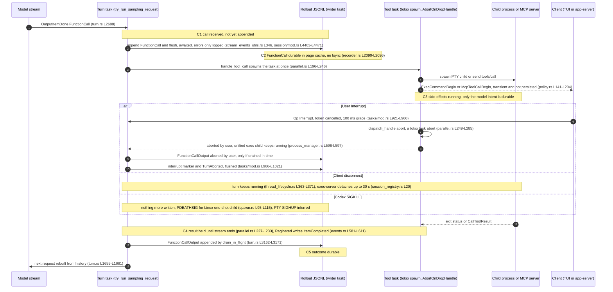

# 07 — Durability and recovery, with Trace B (interruption and uncertainty)

Codex commit `8ffd91e42aa001b7e897bea812b02f89264f9fa0` (2026-09-29). Paths are relative to the Codex repo root. Every line cited was read. Labels: [OBSERVED] source, [TEST] test exists (not executed), [INFERENCE] reasoning, [DOC] docs/comments only.

## Summary (10 lines)

1. The canonical record is one append-only JSONL rollout per thread; SQLite (WAL, `synchronous=NORMAL`) is a rebuildable projection that "can lag JSONL … but can never get ahead". [OBSERVED]
2. Each session append is awaited through a background writer task (bounded mpsc 256) that `write()`s and `flush()`es each line; the live path never calls `fsync`, so process death is survivable, power loss is not guaranteed. [OBSERVED]
3. The model's `FunctionCall` is appended before the tool task is spawned, but append errors are only logged, and no "dispatched", approval or decision record is persisted (these events are classed "transient"). [OBSERVED]
4. A finished tool's output is appended only after the model stream ends and earlier calls drain, so a completed side effect can be undurable for the rest of the stream. [OBSERVED]
5. Resume rebuilds model history from `ResponseItem`s only; an unpaired call gets a prompt-only synthetic `"aborted"` output that is never persisted and never re-executed. [OBSERVED]
6. Interrupt = cancel token, 100 ms grace, tokio `abort()`; tool tasks die via `AbortOnDropHandle` and report "aborted by user", plus a marker saying aborted tools "may have partially executed". [OBSERVED]
7. Default unified-exec processes deliberately survive an interrupt (test-pinned) while the transcript says "aborted by user"; one-shot commands are killed; after SIGKILL only Linux PDEATHSIG (one-shot) or an inferred PTY SIGHUP stops children. [TEST]
8. So yes: an operation can complete after Codex loses it, and the model-visible transcript says "aborted"; in Paginated mode a UI-facing completion item may be durable at the same time, so the record disagrees with itself. [INFERENCE]
9. Recovery exists only for graceful restarts (snapshot + a continuation turn that asks the model to "check the current state"); exec-server offers 30 s in-memory session resumption with seq replay and stdin write-id dedup. [OBSERVED]
10. An audit harness needs a transactional operation/attempt ledger committed before dispatch, an UNKNOWN outcome with reconciliation, confirmed cancellation, idempotency keys and persisted, attributable approvals. [PROPOSED]

## 1. What is authoritative

- **Format.** A line is `RolloutLine { timestamp, ordinal: Option<u64>, #[serde(flatten)] item }`; `RolloutItem` ∈ {SessionMeta, ResponseItem (+harness metadata), InterAgentCommunication(+Metadata), Compacted, TurnContext, TokenUsageRecord, WorldState, SecurityRiskScore, RetainedContext, EventMsg, RealtimeItem} (`codex-rs/history/src/lib.rs:L199-L218`, `L345-L357`); wire form is `{"type","payload"}` (`codex-rs/history/src/rollout_payload.rs:L31-L74`) [OBSERVED]. The first `SessionMeta` read defines the thread id; later ones may be fork copies (`codex-rs/rollout/src/recorder.rs:L1133-L1141`) [OBSERVED].
- **Writer ownership.** `RolloutRecorder { tx, writer_task, rollout_path }` is a cloneable handle (`recorder.rs:L85-L90`). A spawned tokio task owns `RolloutWriterState` (file, `pending_items`, ordinals) and the thread's `WriterLockGuard` (`L146-L151`, `L996-L1024`); commands `AddItems/Persist/Flush/Shutdown/Discard` travel on `mpsc::channel(256)` (`L128-L143`, `L1001`) [OBSERVED]. `record_canonical_items` only enqueues (`L1035-L1047`); `flush` waits for the writer's ack (`L1074-L1089`) [OBSERVED].
- **Durability level.** Each line is `write_all` + `tokio::fs::File::flush` (`L2090-L2096`); items leave `pending_items` only after a successful write (`L1903-L1932`); on error the handle is dropped, reopened and retried once, then the error returns to the caller (`L1817-L1842`) [OBSERVED]. `sync_all` appears only in compression (`codex-rs/rollout/src/compression.rs:L151`, `L161`, `L878`) and migration publish (`codex-rs/thread-store/src/local/rollout_migration/publish.rs:L136-L257`), not on the live path (grep of `rollout`, `thread-store`, `state`, `core/src`) [OBSERVED]. A flushed line survives process death; power loss can drop it [INFERENCE].
- **Every session append is awaited.** `Session::persist_rollout_items` → `LiveThread::append_items` → `write_and_project` → `durable_write` = `record_canonical_items` + `recorder.flush()` (`codex-rs/core/src/session/mod.rs:L4463-L4471`; `codex-rs/thread-store/src/live_thread.rs:L238-L290`; `codex-rs/thread-store/src/local/live_writer.rs:L317-L372`) [OBSERVED]. Appends are serialised per thread (`live_writer.rs:L325`) and across processes by an OS lock per thread id that returns `WouldBlock` (`codex-rs/rollout/src/writer_lock.rs:L42-L83`) [OBSERVED]. `ThreadStore::flush_thread` promises "durable/readable" (`codex-rs/thread-store/src/store.rs:L175-L176`) [DOC]; the local store delivers "readable" [OBSERVED].
- **SQLite is a projection.** "SQLite is a rebuildable view. The flush barrier must win before projection starts so it can lag JSONL after failure, but can never get ahead of canonical history" (`live_writer.rs:L343-L344`) [OBSERVED]. Paginated threads project appends into `thread_turns`/`thread_items` keyed by `next_rollout_byte_offset` (`codex-rs/state/thread_history_migrations/0001_thread_history.sql`), projecting only the newline-terminated prefix and skipping malformed lines with anomaly metrics (`codex-rs/thread-store/src/local/thread_history_materialization.rs:L123-L185`) [OBSERVED]. Thread metadata (`threads`: cwd, sandbox_policy, approval_mode, rollout_path; `codex-rs/state/migrations/0001_threads.sql`) is backfilled from rollout files behind a startup gate of ≤30 s (`codex-rs/rollout/src/state_db.rs:L36`, `L130-L185`); failed init returns `None` and Codex runs without SQLite (`L45-L57`); a corrupt DB is moved to `db-backups` and recreated (`codex-rs/state/src/runtime/recovery.rs:L1-L7`, `L71-L80`); stale rows are read-repaired from the filesystem (`state_db.rs:L606-L675`). Engine: WAL, `synchronous=NORMAL`, busy 5 s, 5 connections (`codex-rs/state/src/sqlite.rs:L310-L346`) [OBSERVED].
- **Torn tails.** Reopen appends `\n` to an unterminated file (`recorder.rs:L2042-L2055`); readers skip and count bad lines (`L1091-L1131`); on reopen the next ordinal comes from the last valid record found by a reverse scan, and a subagent rollout whose inherited prefix was only partly copied is refused (`codex-rs/rollout/src/ordinal.rs:L55-L101`) [OBSERVED]. Tests: `resumed_paginated_subagent_rollout_rejects_incomplete_prefix` (`codex-rs/rollout/src/recorder_tests.rs:L1140`) fails if such a rollout is resumed; `append_repair_terminates_nonempty_rollout_tail` (`codex-rs/rollout/src/recorder_tests.rs:L146-L156`) fails if a torn tail is not terminated exactly once; `resumed_paginated_rollout_repairs_unsafe_tail` (`L1067-L1116`) fails on ordinal reuse after a valid or invalid unterminated tail; `persist_reports_filesystem_error_and_retries_buffered_items` (`L889-L943`) fails if buffered items are lost after a failed persist; `catch_up_preserves_trailing_partial_line_boundaries` (`codex-rs/thread-store/src/local/thread_history_materialization_tests.rs:L2021-L2075`) fails if the projection passes a partial line [TEST].

## 2. Persisted before versus after execution

| Point | What is written, by whom | Sync? | Lost if the process dies before this point |
|---|---|---|---|
| (a) model emits a call (`OutputItemDone`) | `handle_output_item_done` awaits `record_completed_response_item` → `record_conversation_items` → `ResponseItem::FunctionCall` (`codex-rs/core/src/stream_events_utils.rs:L324-L357`; `core/src/session/mod.rs:L3585-L3592`) [OBSERVED] | awaited write+flush; errors only logged, returns `false` (`mod.rs:L4463-L4471`) [OBSERVED] | the call; the tool never ran |
| (b) dispatch | `handle_tool_call` runs `tokio::spawn` (in `AbortOnDropHandle`) when the future is built, before it is polled (`codex-rs/core/src/tools/parallel.rs:L77-L95`, `L196-L246`) [OBSERVED] | nothing durable: `ExecCommandBegin`, `McpToolCallBegin`, `PatchApplyBegin`, `ItemStarted`, `ExecApprovalRequest`, `ApplyPatchApprovalRequest`, `RequestPermissions`, `GuardianAssessment` are "Transient, non-durable" (`codex-rs/rollout/src/policy.rs:L141-L204`) [OBSERVED] | nothing more than model intent |
| (c) tool finishes | result waits in the turn's `FuturesOrdered`; "collects results in order only after its stream ends" (`parallel.rs:L227-L233`). Exec emitters send `ItemCompleted(CommandExecution)`, persisted in Paginated mode only (`codex-rs/core/src/tools/events.rs:L581-L611`; `policy.rs:L96-L112`) [OBSERVED] | output not yet in rollout | a side effect's outcome (Legacy); Paginated keeps a UI item |
| (d) output recorded, sent | `drain_in_flight` after the stream loop appends `FunctionCallOutput` (`codex-rs/core/src/session/turn.rs:L3162-L3171`, `L2472-L2497`); next request is built from history (`turn.rs:L1655-L1661`) [OBSERVED] | awaited, before the next request | — |

`send_event` persists before delivering to the client channel; a closed channel drops the event (`mod.rs:L2479-L2507`) [OBSERVED]. A failed end-of-turn flush only warns "Codex will continue retrying" (`codex-rs/core/src/tasks/mod.rs:L376-L394`) [OBSERVED].

## 3. Resume and fork

- Resume reopens the same JSONL for append under the writer lock (`recorder.rs:L981-L990`; `live_writer.rs:L40-L128`) [OBSERVED]. `reconstruct_history_from_rollout` picks the newest usable compaction, reverse-scans turn segments (`TurnStarted/TurnComplete/TurnAborted/ThreadRolledBack`), and replays only `ResponseItem`/inter-agent/retained-context items; other `EventMsg`s are ignored (`codex-rs/core/src/session/rollout_reconstruction.rs:L169-L377`, `L413-L470`). It restores `last_started_turn_id`, previous-turn settings, the last `TurnContextItem` as a diff baseline, world state and window ids (`L11-L25`) [OBSERVED].
- **Unfinished call.** No re-dispatch path exists in reconstruction or `thread_manager.rs` [OBSERVED]. Each prompt build runs `ensure_call_outputs_present`, inserting `FunctionCallOutput("aborted")` after any unpaired call (`codex-rs/core/src/context_manager/normalize.rs:L21-L138`; `history.rs:L589-L594`, `L933-L940`). The comment calls these "prompt-only" outputs that normalization produces "without persisting" (`normalize.rs:L140-L145`) [OBSERVED]. Unpaired `CustomToolCall` (freeform tools such as `apply_patch`) and `LocalShellCall` hit `error_or_panic`, a panic in debug builds (`normalize.rs:L84-L130`; `codex-rs/core/src/util.rs:L81-L87`) [OBSERVED]. Tests: `normalize_adds_missing_output_for_function_call_inserts_output` (`codex-rs/core/src/context_manager/history_tests.rs:L2436-L2470`) fails if "aborted" is not inserted directly after the call; `normalize_adds_missing_output_for_custom_tool_call` (release only, `L2200-L2238`) and `..._panics_in_debug` (`L2569-L2583`) pin both builds [TEST].
- **Settings.** `TurnContextItem` persists per turn cwd, approval_policy, sandbox_policy, permission_profile, network and model (`codex-rs/protocol/src/protocol.rs:L3301-L3357`); core uses it as a diff baseline, not an enforced grant (`mod.rs:L4598-L4675`). The app-server applies the persisted approval policy/reviewer/profile only if the resuming client did not override them (`codex-rs/app-server/src/request_processors/persisted_resume_settings.rs:L14-L48`; `thread_processor.rs:L4230-L4265`) [OBSERVED], so a resuming client can widen permissions [INFERENCE].
- **Human decisions.** Pending approval requests are replayed to a reconnecting client from memory (`codex-rs/app-server/src/outgoing_message.rs:L446-L465`; `thread_lifecycle.rs:L807-L809`) [OBSERVED]. `ReviewDecision` appears in no storage crate (grep of `rollout/src`, `state/src`, `thread-store/src`, `history/src`) [OBSERVED].
- **Fork.** `ForkSnapshot::Interrupted` copies history and, if the source ends mid-turn, appends the interrupt marker and a synthetic `TurnAborted` (`codex-rs/core/src/thread_manager.rs:L199-L206`, `L2599-L2670`) [OBSERVED].
- Test: `root_turn_suspension_preserves_unfinished_turn_history` (`codex-rs/core/tests/suite/abort_tasks.rs:L73-L203`) fails if suspension writes a terminal turn event or if a replacement runtime cannot recover the same turn id [TEST].

## 4. Retries and duplicate delivery

- Stream retries: default 5, capped at 100 (`codex-rs/model-provider-info/src/lib.rs:L63-L70`, `L500-L504`); connection backoff 5 s→60 s (`codex-rs/core/src/responses_retry.rs:L22-L23`, `L96-L119`) [OBSERVED]. Completed items were already recorded and their tools are drained before the error returns (`turn.rs:L3162-L3171`); the retry rebuilds its prompt from history (`turn.rs:L1655-L1661`). So completed calls are neither discarded nor re-run [INFERENCE]. Partial deltas are dropped, with an open "TODO: Reconcile any response item already being presented to the client" (`turn.rs:L2655`) [OBSERVED]. No test pins this (searched test names for retry/stream/drain/partial in `core/tests/suite` and `core/src/session/*tests.rs`).
- MCP: transient retries only for `tools/list` (`codex-rs/rmcp-client/src/rmcp_client.rs:L1495-L1509`); `tools/call` is re-sent only after `SessionExpired404` reinitialisation (`L1397-L1409`, `L1511-L1529`); auth challenges are kept "without replaying the rejected tool call" (`L919-L920`) [OBSERVED]. No idempotency keys are sent (grep `idempot` in `cloud-tasks-client`, `backend-client`, `codex-api`, `codex-client`, `core/src/client.rs`: none) [OBSERVED].

## 5. Cancellation: what is actually stopped

- `Op::Interrupt` → `abort_all_tasks(Interrupted)` (`codex-rs/core/src/session/handlers.rs:L436-L439`; `mod.rs:L4975-L4982`) → `handle_task_abort`: cancel the token, wait for completion or 100 ms, `task.handle.abort()`, record+flush the marker, run interrupt hooks, emit+flush `TurnAborted` (`codex-rs/core/src/tasks/mod.rs:L70`, `L921-L1021`) [OBSERVED].
- A tool future that sees cancellation calls `dispatch_handle.abort()` (tokio abort: the handler future is dropped at its next await) unless `terminal_outcome_reached` is set (`codex-rs/core/src/tools/registry.rs:L791-L801`), and returns "Wall time: X seconds\naborted by user" (`parallel.rs:L249-L285`, `L330-L346`) [OBSERVED]. If draining exceeds the 100 ms grace, the turn abort drops the `FuturesOrdered`, `AbortOnDropHandle` kills the tool tasks and no output is appended [INFERENCE].
- The marker (on by default, `codex-rs/core/src/config/mod.rs:L3907-L3911`) says "Any running unified exec processes may still be running in the background. If any tools/commands were aborted, they may have partially executed." (`codex-rs/core/src/context/turn_aborted.rs:L10-L11`) [OBSERVED].
- Tests: `interrupt_tool_records_history_entries` (`abort_tasks.rs:L212-L302`) fails unless the next request carries the call and an output matching `^Wall time: … seconds\naborted by user$`; `interrupt_persists_turn_aborted_marker_in_next_request` (`L304-L371`) [TEST].

| Executor | User Interrupt | Client disconnect | Codex SIGKILL |
|---|---|---|---|
| One-shot exec (`shell_tool`) | killed: `kill_on_drop(true)` SIGKILL to direct child (`codex-rs/core/src/spawn.rs:L141`); group TERM→50 ms→KILL if its own cancel branch wins the race (`codex-rs/core/src/exec.rs:L1040-L1071`) [OBSERVED]; `managed_one_shot_command_is_terminated_when_the_turn_is_interrupted` (`codex-rs/core/tests/suite/unified_exec.rs:L3390-L3448`) fails if the pid survives [TEST] | n/a | Linux `PR_SET_PDEATHSIG` SIGTERM to the direct child only (`spawn.rs:L95-L115`; `codex-rs/utils/pty/src/process_group.rs:L29-L42`); nothing on macOS [OBSERVED] |
| Unified exec (default, `codex-rs/features/src/lib.rs:L991-L996`) | kept alive by design: "Persist live sessions … so interrupting the turn cannot … terminate the background process" (`codex-rs/core/src/unified_exec/process_manager.rs:L596-L597`) [OBSERVED]; `unified_exec_interrupt_preserves_long_running_session` (`unified_exec.rs:L2948-L3032`) fails if the pid dies after `TurnAborted` [TEST] | keeps running | PTY child is `setsid` with a controlling TTY and no PDEATHSIG (`codex-rs/utils/pty/src/pty.rs:L645-L675`); SIGHUP on master close is POSIX behaviour, not tested [INFERENCE] |
| Exec-server process | `process/terminate` | session detached, killed after 30 s TTL (`codex-rs/exec-server/src/server/session_registry.rs:L17-L20`, `L136-L153`, `L182-L198`); stdio cannot resume (`codex-rs/exec-server/src/server/transport.rs:L173-L174`) [OBSERVED] | same as disconnect [INFERENCE] |
| MCP call | future dropped; no `notifications/cancelled` sent by Codex code for `tools/call` (rmcp 3.2.0 drop behaviour not in checkout, unverified) | continues | stdio server group terminated only by a destructor (`codex-rs/rmcp-client/src/stdio_server_launcher.rs:L421-L437`), which does not run [INFERENCE] |
| `apply_patch` | files written one by one, in-memory delta, no rollback (`codex-rs/apply-patch/src/lib.rs:L470-L600`) [OBSERVED] | — | partial writes remain [INFERENCE] |

Background processes end only on `CleanBackgroundTerminals` (`tasks/mod.rs:L902-L907`), session shutdown (`handlers.rs:L287-L310`) or LRU pruning above 64 (`process_manager.rs:L1226-L1236`) [OBSERVED]. When one exits later, its watcher emits `ItemCompleted(CommandExecution)` with the real exit code (`codex-rs/core/src/unified_exec/async_watcher.rs:L158-L238`), persisted in Paginated mode (`policy.rs:L96-L100`), the local default (`codex-rs/thread-store/src/local/mod.rs:L477-L479`) [OBSERVED]; it is never merged into the model-visible `FunctionCallOutput` [INFERENCE].

## 6. Recovery after a graceful restart (none after SIGKILL)

- On managed shutdown (SIGTERM) the app-server snapshots loaded root threads and each uncancelled regular turn whose input was recorded (turn id, schema, tier, local environment) (`codex-rs/app-server/src/request_processors/daemon_snapshot.rs:L15-L55`; `codex-rs/core/src/session/daemon_recovery.rs:L13-L45`), writes it atomically (`codex-rs/app-server-transport/src/daemon_recovery.rs:L69-L82`) and consumes it once at startup (`codex-rs/app-server/src/daemon_thread_recovery.rs:L32-L50`) [OBSERVED].
- A continuation runs only if the last `TurnStarted` matches with no terminal event, the environment is local and thread-configured, and the permission profile equals the saved turn's ("Recovery must not override a stricter saved or newly configured policy"). It appends `TurnAborted` for the old turn, then starts a new turn with: "The server restarted and interrupted the previous turn. … Check the current state before repeating actions that may already have completed." (`codex-rs/app-server/src/request_processors/daemon_continuation.rs:L40-L118`) [OBSERVED]. Outcome reconciliation is delegated to the model.
- Test: `managed_shutdown_records_interrupted_turn` (`codex-rs/app-server/tests/suite/v2/daemon_update_recovery.rs:L462-L758`, 9 cases) fails if the snapshot is wrong, if continuation happens for read-only/stricter/different-environment/legacy/completed/cancelled/compacting cases, or if the continuation prompt lacks the original input [TEST].
- Turn suspension handoff: flush first, cancel without a terminal event, 100 ms then abort, flush and close the writer before `ShutdownComplete`; "Pending accepted input and interactive waiters live only in this process" (`codex-rs/core/src/session/turn_suspension.rs:L13-L119`) [OBSERVED].

## 7. exec-server: the only detached executor

- `initialize` accepts `resume_session_id` (`codex-rs/exec-server-protocol/src/protocol.rs:L79-L83`). A closed connection detaches the session for 30 s; resume is refused while attached; expiry shuts the processes down (`session_registry.rs:L67-L153`) [OBSERVED]. The README still says closing "terminates any remaining managed processes" (`codex-rs/exec-server/README.md:L181-L182`) [DOC], which the code has superseded.
- The client waits for in-flight starts, resumes within 25 s, replays output from `last_published_seq` via `process/read`, fails on a gap, and otherwise fails all in-flight work (`codex-rs/exec-server/src/client_recovery.rs:L59-L65`, `L364-L438`, `L487-L580`) [OBSERVED]. Retention: 1 MiB / 50,000 chunks per process, exited processes 30 s (`codex-rs/exec-server/src/local_process.rs:L85-L96`) [OBSERVED].
- Duplicate suppression: `process/start` rejects a reused `processId` (`README.md:L275`) [DOC]; `process/write` carries `write_id`, and the last 4,096 accepted ids per process are remembered "without writing the same bytes to child stdin twice" (`protocol.rs:L483-L487`; `local_process.rs:L127-L155`) [OBSERVED].
- The client keeps the session id in a `OnceLock` (`codex-rs/exec-server/src/client.rs:L290`, `L805-L808`); nothing persists it, so a restarted Codex cannot resume [INFERENCE].
- Tests: `exec_server_resumes_detached_session_without_killing_processes` (`codex-rs/exec-server/tests/process.rs:L706`) fails if reconnect+resume loses the process; `remote_exec_process_recovers_after_transport_disconnect` (`codex-rs/exec-server/tests/exec_process.rs:L1557`) fails if output produced while disconnected is lost or out of sequence [TEST].

## 8. Cloud tasks (requires hosted service)

`TaskId`, `TaskStatus {Pending, Ready, Applied, Error}`, best-of-N `AttemptStatus` (with `Cancelled`, `Unknown`), and a dry-run `apply_task_preflight` before `apply_task` returning `ApplyOutcome {Success, Partial, Error}` plus skipped/conflict paths (`codex-rs/cloud-tasks-client/src/api.rs:L23-L198`) [OBSERVED]. Durable task state lives server side. `create_task` takes no idempotency key (`L168-L175`) [OBSERVED], so a retried create could duplicate [INFERENCE].

## 9. rollout-trace: an attempt lifecycle not used for recovery

Opt-in via `CODEX_ROLLOUT_TRACE_ROOT` (`codex-rs/rollout-trace/src/thread.rs:L44`, `L101-L110`) [OBSERVED]; the README says tracing is best-effort and "must never make a Codex session fail" (`codex-rs/rollout-trace/README.md`) [DOC]. It records `ToolCallStarted`, `ToolCallRuntimeStarted/Ended`, `ToolCallEnded`, `InferenceCancelled` with partial payload (`codex-rs/rollout-trace/src/raw_event.rs:L111-L162`), and its reducer's `ExecutionStatus::Running` means "the trace ended before its terminal event" (`codex-rs/rollout-trace/src/model/session.rs:L85-L96`) [OBSERVED]. The writer flushes a `BufWriter` per event without fsync (`codex-rs/rollout-trace/src/writer.rs:L114-L134`); resume never reads it [OBSERVED].

## 10. Trace B — tool proposed, dispatched, interrupted

| # | Crash point | Durable at this point | What stopping actually stops | Restart / resume | Label |
|---|---|---|---|---|---|
| C1 | after `OutputItemDone`, before append completes | earlier lines only | nothing started | call forgotten; model re-plans | [OBSERVED] |
| C2 | appended and flushed, task spawned, no side effect yet | `FunctionCall`; Paginated SQLite row | clean abort | prompt-time `"aborted"` (true) | [OBSERVED] |
| C2′ | append failed (for example ENOSPC) | nothing | tool still dispatched | no trace of the call | [OBSERVED] |
| C3-I | running, user Interrupt | `FunctionCall`; `FunctionCallOutput("…aborted by user")` if drained ≤100 ms; marker; `TurnAborted` | tokio abort of the tool task; one-shot child killed; unified-exec child kept alive; MCP future dropped; `apply_patch` partial writes stay | model sees "aborted by user" and "may have partially executed" (output and survival are test-pinned; one-shot kill and MCP drop are read in source) | [TEST] |
| C3-D | running, client disconnects | normal persistence continues (thread unloads only when not `Running`, `thread_lifecycle.rs:L363-L371`) | nothing; exec-server processes run ≤30 s | client resumes; approvals replayed from memory; seq replay if resumed ≤25 s | [OBSERVED] |
| C3-K | running, Codex SIGKILL | `FunctionCall` only; no marker, no `TurnAborted` | no destructors run; PDEATHSIG only for Linux one-shot direct child | manual resume: unpaired call shown as `"aborted"`; no snapshot, no continuation (durable state is read in source; child fate is inferred) | [INFERENCE] |
| C4 | tool done, output waiting for stream end | `FunctionCall`; Paginated: `ItemCompleted` with real exit code | — | model told `"aborted"` although the side effect completed and the rollout may record completion | [INFERENCE] |
| C5 | output appended, before next request | call and output | — | model sees the real output | [OBSERVED] |
| C6 | follow-up stream fails mid-response | completed items; deltas lost | — | retry from history, no re-execution | [INFERENCE] |
| C7 | background process from C3-I finishes later | Paginated: late `ItemCompleted` after `TurnAborted` | — | never reconciled into model history | [INFERENCE] |
| C8 | power loss after any flush | unsynced tail may vanish; WAL `NORMAL` may lose last commits | — | torn tail repaired and skipped; SQLite rebuilt | [INFERENCE] |

**Answer.** Yes, an external operation can still complete after Codex loses its response. It happens by design on user Interrupt with default unified exec (C3-I/C7: process alive per `unified_exec.rs:L2948-L3032`, output "aborted by user" per `abort_tasks.rs:L212-L302`). It can also happen after SIGKILL (C3-K), for up to 30 s on a disconnected exec-server (C3-D), and on any remote MCP server. The model-visible transcript then records the call as `"aborted"` (persisted on Interrupt, prompt-synthesised after a crash). An auditor cannot tell "never started" from "started and completed", because dispatch is never persisted. The only hedges are the marker's prose ("may have partially executed") and, in Paginated mode, a UI-facing completion item that contradicts the model view.

## 11. [PROPOSED] What an audit harness needs instead

1. A transactional ledger (not a flushed file) with `operation_id` (stable across retries) and `attempt_id`, committed before dispatch: `PROPOSED → APPROVED(actor, policy version) → DISPATCHED(executor, pid+start time or remote request id) → COMPLETED | FAILED | CANCEL_REQUESTED → CANCEL_CONFIRMED | UNKNOWN`.
2. Dispatch gated on the commit of `DISPATCHED`; a failed write blocks the side effect (the opposite of `mod.rs:L4463-L4471`).
3. On recovery, any `DISPATCHED` attempt without an outcome becomes `UNKNOWN`, never "aborted". A reconciler probes the executor or target by `operation_id`; unresolved cases go to an attributable human decision.
4. Cancellation is a request, not a fact: `CANCEL_CONFIRMED` only after the executor reports the process group reaped or the remote cancel acknowledged.
5. Idempotency keys on every external call (MCP `_meta`, HTTP headers) and executor-side dedup, generalising exec-server's `write_id` to starts and calls, backed by a unique constraint.
6. Executors that outlive the orchestrator, with persisted session identity and a late-result inbox keyed by `operation_id`; late outcomes are appended to the ledger and surfaced to the model as a reconciliation note.
7. Approvals and permissions persisted with actor, time and scope; resume re-binds to the recorded grant or requires re-approval (unlike `thread_processor.rs:L4230-L4265`).
8. The model transcript is a derived view of the ledger (as SQLite is of the JSONL in Codex), never the evidence itself.

## 12. Finding register (seven parts)

| ID | Problem solved; code and state owner | Tests | Limits / defaults | General vs local | Audit-harness difference | Recommendation |
|---|---|---|---|---|---|---|
| F1 [OBSERVED] | Ordered, lossless local transcript; writer task owns file and lock (`recorder.rs`, `live_writer.rs`) | recorder tail/retry tests (§1) | no fsync; 256-slot channel; one reopen retry | pattern general; single host | needs transactional commit and multi-tenant ownership | ADOPT PATTERN (canonical log + projection that never leads) |
| F2 [OBSERVED] | Intent recorded before dispatch (`stream_events_utils.rs:L324-L357`) | none found for failed-append gating | append errors swallowed; no dispatch record | general idea | dispatch must be gated and recorded | DO NOT ADOPT the swallow; ADAPT the ordering |
| F3 [OBSERVED] | Model always sees a paired call (`normalize.rs`) | normalize tests (§3) | prompt-only `"aborted"`; debug panic | local coding convenience | must be `UNKNOWN` plus reconciliation | DO NOT ADOPT for evidence |
| F4 [OBSERVED] | Bounded interrupt latency (`tasks/mod.rs`, `parallel.rs`) | `abort_tasks.rs` tests | 100 ms grace; tokio abort | general | record cancel requested vs confirmed | ADAPT IDENTIFIED CODE |
| F5 [TEST] | Long-running shells survive turns (`process_manager.rs`) | `unified_exec.rs:L2948`, `L3390` | 64 processes; kill on clean/shutdown | local interactive UX | processes must be owned by durable operations | DO NOT ADOPT |
| F6 [INFERENCE] | Retries without re-running tools (`turn.rs`, `rmcp_client.rs`) | none for tool-survives-retry | 5 retries; `tools/call` only on 404 | general | add idempotency keys | ADOPT PATTERN (retry from committed history) |
| F7 [OBSERVED] | Continue after planned restart (`daemon_continuation.rs`) | `daemon_update_recovery.rs:L462` | graceful only; model reconciles | general guard | reconcile in code; keep the permission-equality guard | ADOPT PATTERN (guard), IMPLEMENT INDEPENDENTLY (reconciliation) |
| F8 [OBSERVED] | Survive transport drops (`session_registry.rs`, `client_recovery.rs`, `local_process.rs`) | exec-server tests (§7) | 30 s TTL, 25 s recovery, 4,096 ids, in memory | general | make session and dedup durable | ADOPT PATTERN |
| F9 [OBSERVED] | Explain runs after the fact (`rollout-trace`) | reducer tests (not read) | opt-in, best-effort | general | the same states must be authoritative | ADOPT PATTERN (state model) |
| F10 [OBSERVED] | Crash-safe publish (`publish.rs`) | migration tests (not read) | journal + fsync + rename + dir fsync | general | use for evidence exports | ADAPT IDENTIFIED CODE |
| F11 [OBSERVED] | Resume with prior settings (`persisted_resume_settings.rs`) | `resume.rs:L97` (host-restored override) | client override wins | local | bind to recorded grant | DO NOT ADOPT |

## 13. Hard numbers

| Value | Where |
|---|---|
| Rollout channel 256; 1 reopen retry | `recorder.rs:L1001`, `L1817-L1842` |
| Interrupt grace 100 ms | `tasks/mod.rs:L70` |
| Exec cancel TERM→KILL grace 50 ms; I/O drain 2 s; default exec timeout 10 s | `exec.rs:L63`, `L71`, `L94` |
| Stream retries 5 (max 100); request retries 4; idle timeout 300 s | `model-provider-info/src/lib.rs:L63-L70` |
| Connection retry 5 s → 60 s | `responses_retry.rs:L22-L23` |
| Unified exec: 64 processes, yield 250 ms–30 s, background poll max 300 s, 1 MiB output | `unified_exec/mod.rs:L73-L82` |
| Exec-server: detach TTL 30 s, client recovery 25 s (retry 100 ms), 1 MiB / 50,000 chunks, exited retention 30 s, 4,096 write ids | `session_registry.rs:L20`; `client_recovery.rs:L63-L64`; `local_process.rs:L85-L96` |
| SQLite: WAL, `synchronous=NORMAL`, busy 5 s, 5 connections; backfill gate 30 s | `sqlite.rs:L310-L346`; `state_db.rs:L36` |
| App-server thread shutdown wait 10 s | `app-server/src/request_processors/thread_lifecycle.rs:L409` |
| `history.jsonl` lock retries 10 × 100 ms | `codex-rs/message-history/src/lib.rs:L58-L59` |

## 14. Hosted-service dependencies and flags

Cloud tasks (§8), remote exec-server registration and Noise relay (ChatGPT sign-in or API key, `exec-server/README.md:L38-L60`) and the Responses API stream all require a hosted service. Flags met: `unified_exec` (stable, default on), `UnboundedConnectionRetries`, `CodeModeInterrupt`, `DeferMailboxPreemption`, `agents.interrupt_message` (default true), `CODEX_ROLLOUT_TRACE_ROOT`.

## Coverage and limits

Read: rollout writer/policy/state_db/writer_lock; thread-store live writer, materialization, publish; state sqlite/recovery/migrations 0001, 0008, 0047 and thread-history 0001; core turn/stream/tool runtime/abort/normalize/reconstruction/exec/spawn/unified-exec manager; app-server daemon recovery, resume settings and unload paths; exec-server registry/recovery/local process; cloud-tasks API; rollout-trace writer/events. Not read: rmcp 3.2.0 source (not in checkout; drop-time cancellation unverified), Windows job-object paths, `thread-store` rollout migration orchestration beyond `publish.rs`, `message-history` batching, TUI reconnect, `code-mode` cancellation, rollout-trace reducer tests, `state` goals/queue migrations. No tests were executed.

## Reuse candidates

| Candidate | Crate / module | Dependencies (Cargo.toml) | Licence | Coherent to lift? | What must change |
|---|---|---|---|---|---|
| Durable-store seam | `codex-thread-store` `ThreadStore` trait (`thread-store/src/store.rs`) | chrono, codex-app-server-protocol, codex-rollout, codex-state, sqlx, tokio, zstd and 8 codex utilities | Apache-2.0 (workspace `codex-rs/Cargo.toml:L167`; no crate LICENSE) | trait yes; implementation tied to Codex protocol types | swap payload types; add fsync/commit semantics and tenant id |
| Crash-safe publish | `thread-store/src/local/rollout_migration/publish.rs` | tokio, zstd | Apache-2.0 | small, self-contained helpers | extract from migration context |
| Torn-tail repair and ordinals | `rollout/src/recorder.rs` (`ensure_rollout_is_newline_terminated`), `rollout/src/ordinal.rs` | codex-history, codex-protocol, tokio, serde_json | Apache-2.0 | yes as pattern | replace `RolloutItem` with ledger records |
| Session resume, seq replay, write-id dedup | `exec-server/src/server/session_registry.rs`, `local_process.rs`, `exec-server-protocol` | base64, serde(_json), codex-file-system, codex-network-proxy, codex-protocol, codex-shell-command, codex-utils-path-uri | Apache-2.0 | protocol crate liftable; server entangled with sandboxing and relay | persist session state; extend dedup to starts |
| Attempt state model | `rollout-trace/src/model/session.rs` `ExecutionStatus` | anyhow, codex-code-mode, codex-protocol, http, serde, uuid | Apache-2.0 | copy the enum and semantics, not the crate | add `UNKNOWN`/`CANCEL_CONFIRMED` |
