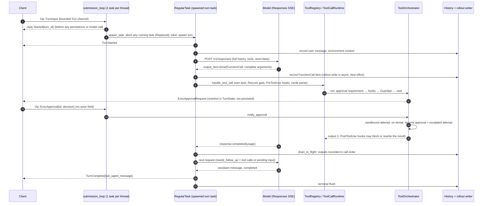
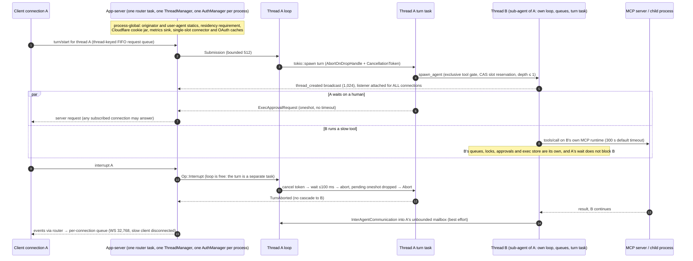
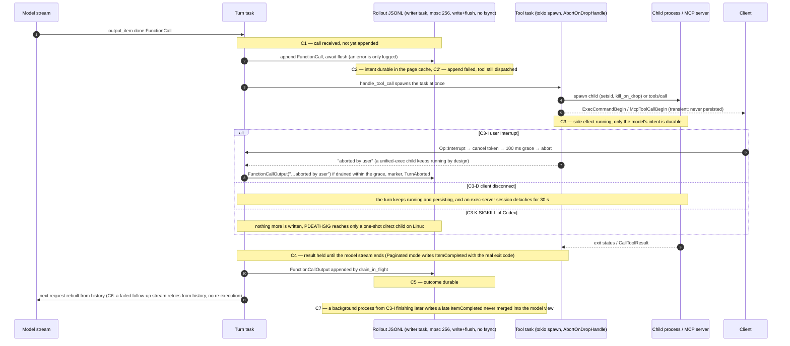
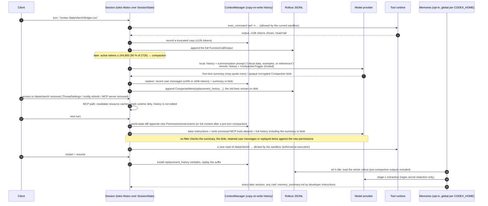

# Codex source study — engineering patterns for the Zobba audit harness, and a Rust assessment

**Purpose.** Answer the owner's brief: study the actual implementation and tests of OpenAI Codex, identify the engineering patterns and specific code Zobba should learn from or adapt when building its own audit-specific harness, evaluate Rust seriously as a possible principal backend or runtime language including migration implications, and deliver a reviewable report. The brief excludes one answer in advance — embedding the unchanged Codex runtime behind the Zobba interface — and §6.8 states why the study agrees.

**How to read this report.** Every substantive statement carries one of these labels, either inline or as the evidence class of the table row it sits in:

| Label | Meaning |
|---|---|
| **OBSERVED** | Read in the pinned source. Cited as `codex-rs/<crate>/src/<file>.rs:L<a>-L<b>` relative to the Codex checkout, or as a repository-relative path for Zobba. |
| **TEST** | A test exists at the cited location and asserts what the sentence says. It does not mean the test was observed passing, unless the row also says EXECUTED. |
| **EXECUTED** | Run during this study in an isolated, synthetic environment. Logs and inputs are in the appendix. |
| **DOC** | Stated in repository documentation of the reference, not verified in code. |
| **INFERENCE** | A conclusion drawn from observed facts. Each one says what would confirm it. |
| **PROPOSED** | A recommendation, design or plan for Zobba. Nothing proposed here is approved, scheduled or started. |
| **requires hosted service** | Behaviour that depends on OpenAI's backend, the ChatGPT relay, Statsig, Sentry or another service outside the public client; the report describes only what the client code implies. |

Zobba's approved direction is referred to by its own identifiers: the architecture spine revision 5 decisions AD-24 to AD-34, the contract register rows, and the numeric epics 10 to 19. Story titles are quoted only where a recommendation lands on one.

**Boundaries honoured.** No real client data, production credentials, paid provider calls or external business actions were used. The Codex checkout is an isolated, read-only reference copy outside the repository; nothing from it was vendored, imported or modified. No Zobba application code, schema, dependency, production test, sprint status, approved contract or architecture document was changed. No migration, rewrite or runtime integration was started. Where a test could not run, the report says so rather than asserting a pass.

**Contents**

1. Executive conclusion
2. Baseline and source boundary
3. Architecture map and the four traced paths
4. Engineering lessons and adaptation matrix
5. Proposed Zobba-owned architecture
6. Rust assessment
7. Compatibility and migration implications (options assessment, not a plan)
8. Decisions for the owner
9. Source and test appendix, and coverage limitations

---

## 1. Executive conclusion

**What was studied.** OpenAI Codex at commit `8ffd91e42aa001b7e897bea812b02f89264f9fa0` (2026-09-29): a 1.97-million-line Rust workspace whose core is a local, single-user coding agent. Ten parallel reviews read the loop, concurrency, tool dispatch, permissions and sandboxing, model adapters, context and memory, durability, execution, the App Server protocol, verification, and skills, each finding labelled observed, test-backed, documented or inferred, and pinned to file and line. Two crates' tests and one focused policy probe were executed; the `core` crate was built and timed (15 m 51 s on 4 vCPU; 23 s incremental). Zobba's baseline is `main` `d9c72c8`: the course correction is approved as design (spine revision 5, 54-row contract register, Epics 10–19) and, on the conversational path, unbuilt.

**The strongest lessons** (ranked by value to Zobba's approved architecture):

1. **One ordered owner per unit of work, with the work itself separately cancellable.** Codex's per-thread command loop plus a spawned, token-cancellable turn is why an interrupt or a human answer is never blocked by running work. Zobba's task runtime should have exactly this shape, with the loop's commands as durable rows.
2. **Commit whole items, dispatch only on complete arguments, and record the call before the tool runs.** Codex never accumulates partial tool arguments and records the model's call before dispatch; it then undermines both by logging rather than failing a lost write. Zobba's approved ledger-before-dispatch is the same ordering with the gate closed.
3. **A canonical record and projections that never lead it.** "SQLite can lag the JSONL but never get ahead" is the rule Zobba should state for its conversation view, Timeline and caches against PostgreSQL rows.
4. **Everything about human decisions must be done differently.** In Codex an approval is an in-memory waiter with no timeout and no actor, answerable by any connection, not persisted, not revocable, and an interrupted call is shown to the model as "aborted" even when the side effect completed. The four traces converge on this: it is the defining difference between a coding agent and an audit harness, and Zobba's existing durable waits and receipt ledger are already the right foundation.
5. **Authority is never context, and context needs provenance.** Codex keeps grants outside history (good) but compacts protected content into summaries and global memories that survive revocation (bad). Zobba's pre-request gate over provenance-tagged items, with summaries citing evidence ids, closes that. The reference's skills and instructions layer shows the same failure mode from the other side: repository files become instructions with no trust step, a mentioned skill can rewrite tool configuration, precedence lives in prose ("user beats skills"), and nothing persisted proves which approved text a turn ran under (§4.10).
6. **Backpressure is a policy per edge:** answer overload on requests, never drop responses, disconnect a slow subscriber only because the stream is resumable by cursor. Zobba's cursor-replayed Timeline already makes the last part safe.
7. **The permission engine's tiering and its two escapes** (an `allow` that means unsandboxed; a user path rule that pre-empts an admin forbid, confirmed by execution here) are the precise reasons Zobba's gate is pure, ordered, ceiling-first and never widened by a lower layer.
8. **Test designs worth copying:** request-body assertions against a gated fake model server, interrupt-between-publish-and-persist with live = persisted = reconstructed, sentinel-backed log-secrecy tests, schema-fixture drift tests, and an isolation suite that can never skip itself green.

**Recommended direction.** Build Zobba's runtime in the approved TypeScript stack (Option 1), adopting the patterns above and adapting a short list of small Apache-2.0 units as designs, not vendored code. Name two Rust-eligible carve-outs behind existing contracts (sandbox programs; possibly a separate code-execution executor once Story 17.1 selects the backend), and keep a Rust task runtime (Option 2) as a conditional path with written, measurable triggers. Do not pursue Rust as the principal language (Option 3), and do not embed the Codex runtime. The reasoning and the flip conditions are in §6.

**Unresolved evidence.** No Codex `core` or App Server test was executed (build cost); the two reviewer inferences about approval reuse on escalation retry and about drop-time MCP cancellation remain inferences; the reference publishes no performance numbers, so every performance statement here is qualitative until the proof plan in §6.7 is run; the skills review did not open the extension-side skill selector or the guardian's asynchronous scorer, and did not search for tests that pin the precedence sentences; and nothing in this report has been tried against a live provider or a personal account.

## 2. Baseline and source boundary

### 2.1 Exact revisions studied

| Repository | Revision | Notes |
|---|---|---|
| `raeltec-systems/intellifin-audit` (Zobba) | `d9c72c80976dda5308353f9ce22e8e32fd1a11a9` (= `origin/main`, 2026-09-29 18:54 +0200, "Merge PR #64: Story 10.10") | Working tree clean at the start of the study. The study branch `claude/compassionate-thompson-en0rl9` was created from this commit; the only files it adds are under `_bmad-output/planning-artifacts/research/`. |
| `openai/codex` (reference) | `8ffd91e42aa001b7e897bea812b02f89264f9fa0` (2026-09-29 18:53 UTC, "Enable multi-agent V2 and Ultra reasoning on Amazon Bedrock (#49345)") | Read-only, depth-1 checkout in the session scratchpad, outside the Zobba tree. Newest release tags on the remote at study time: `rust-v0.158.0`, `rust-v0.159.0`, `rust-v0.159.1`; whether `8ffd91e` sits inside `rust-v0.159.1` could not be established from a shallow clone, so the report cites the commit only. |

Codex at this revision is a Rust workspace of 100+ crates under `codex-rs/`, about 1.97 million lines of Rust (the `tui` crate alone is 432k lines, `core` 434k of which 311k are test files, `app-server` 188k of which 137k are tests), pinned to Rust 1.95.0, with a 1,472-package `Cargo.lock`. The root licence is Apache-2.0 and all 127 workspace crates inherit it; `NOTICE` names MIT-licensed code derived from Ratatui; `codex-rs/vendor/bubblewrap` is vendored under the GNU Library GPL 2 (its own `COPYING`), and `third_party/` holds PowerShell, V8, voice, WezTerm and Wine assets that carry their own terms. Every reuse candidate in §9.4 therefore names the exact crate and its licence rather than relying on the root file.

### 2.2 Implementation versus planning in Zobba (what is approved, built and tested)

The course correction of 2026-09-24/25 is approved as design and is essentially unbuilt on the conversational path:

- **Approved requirement and architecture.** Proposals 1, 2, 3a–3d, 4, 4b, 5, 6 and 7 and the Sprint Change Proposal are all approved by the owner (2026-09-24/25). Architecture spine revision 5 (status `final`, updated 2026-09-25) adopts AD-24 to AD-34. The contract register lists 54 rows (23 NEW, 8 EXTENDED, 20 HOLDS, 2 SUPERSEDED, 1 RETIRED). The spine's stack table keeps Node 24.20.0, TypeScript 7.0.2, Next.js 16.3.4, PostgreSQL 18.6, pg-boss and the Vercel AI SDK 7 and closes with "The rest of the stack is unchanged"; no planning document mentions Rust or a runtime rewrite, and the direction says "Do not assume a full rewrite or a language migration. Equally, do not assume the existing architecture can support this merely by changing its screens. Assess that from the code."
- **Implemented and tested today** (all on the retained compiler-1 Run path, Epics 1–5): the audit chain, immutable evidence packages with digest read-back and worker-signed grants, durable waits and escalations, pause/cancel boundaries, the controller lease, the encrypted Run conversation with its receipt ledger, the twenty-row Evidence Quality Gate and the sealed Result, the browser workspace with credential containment, and the LISTEN/NOTIFY live channel. The current model layer calls the AI SDK's `generateText` with the tool catalogue serialised **inside a JSON prompt string** and parses the model's chosen action out of the text: there is no native tool calling today (`packages/infrastructure/src/runs/agent-model-gateway.ts:337–347, 647–660`).
- **Proposal only (design approved, nothing built):** tenancy and row-level security (no `tenant_id` column, no policy, no classification inventory exists at HEAD; schema range 61..61; Story 11.1 is `backlog`), Engagements and Agent Tasks, Effective Permissions, connectors and the OAuth broker, sources and derivations, artifact lifecycle records, memory and packs, the sandbox and document extraction, promotion. The register's 23 NEW contracts have no file under `docs/contracts/` yet; the 25 existing files are the pre-correction set, eight of them amended by Stories 10.6–10.10.
- **Authorised implementation** is narrow: Stories 10.6–10.10 (compiler-1 surface repairs) were authorised on 2026-09-26 and merged on 2026-09-29 (PRs #60–#64). The sprint file shows 10.7 still `review`, and the dispositions file still says these stories were not authorised: two tracking-status drifts that this study reports and does not correct.
- **Sprint state at HEAD:** Epics 1–3 `done`; 4–5 `in-progress` (closure verdicts pending for 4.7, 4.8, 5.1–5.8); 10 `in-progress`; 11–17 and 19 `backlog`; 18 `in-progress` with only 18.2 done. Delivery order is set by slices 0–4, not by epic number.

Three planning drifts material to this study are recorded in Appendix A.11 (the Zobba baseline review): the Story 12.4 title still allows a stub `allowed`-only gate, which D-5-4 forbids; `epics.md` mechanically repeats parent "demonstrated by" lists on bounded parts; `AGENTS.md`'s managed block still describes nine epics and AD-1..23.

### 2.3 What the study inspected, and what it could not

- **Inspected in Codex:** the `protocol`, `core` (session, tasks, state, tools, sandboxing, context management, compaction, client), `app-server`, `app-server-protocol`, `exec`, `exec-server`, `execpolicy`, `linux-sandbox`, `sandboxing`, `rollout`, `thread-store`, `state`, `hooks`, `skills`, `memories`, `codex-mcp`/`rmcp-client`, `model-provider`, `codex-api`, `otel`, `config` and `features` crates, with the tests beside them, through ten parallel reviewers whose findings files are the evidence base of Appendix A. Each finding is labelled OBSERVED (read in source), TEST (a test exists; what it asserts), DOC (repository documentation) or INFERENCE. No claim is made about OpenAI's hosted backend, the ChatGPT-side services, the desktop app or cloud tasks beyond what the public client code implies; those are marked "requires hosted service".
- **Not inspected:** the `tui` crate beyond its boundary with `core`; the Windows sandbox service internals; `third_party/` and `vendor/` code; Bazel build files; Python and TypeScript SDKs beyond their layout.
- **Executed during this study** (isolated, synthetic, no provider calls, no repository change):
  - `cargo test -p codex-execpolicy -p codex-apply-patch` under Rust 1.95.0 on the study machine (4 vCPU, 15 GB): cold build plus run took 8 m 16 s wall clock and produced 617 dependency rlibs (5.3 GB target directory). `codex-execpolicy`: 7 unit + 27 integration tests passed. `codex-apply-patch`: 30 integration tests passed; 67 of 69 unit tests passed. The two failures, `test_apply_patch_fails_on_write_error` and `test_failed_move_returns_committed_destination_delta`, provoke a write error by setting a directory to mode `0o555` (`codex-rs/apply-patch/src/lib.rs:1368`) and this container runs as uid 0, which bypasses permission bits; they are an environment artefact, not a Codex defect, and are reported as such rather than as passes.
  - A timed `cargo build -j 2 -p codex-core` on the same machine and toolchain, started with the 617 dependency rlibs of the previous run already present: 15 m 51 s wall clock (952 s), 617 → 1,154 rlibs. An incremental rebuild after touching `core/src/safety.rs`: 22.97 s. A first `cargo check` of the same crate after that touch: 9 m 54 s (595 s). Target directory after all three runs: 16 GB. The numbers and their interpretation are in §6.5; the raw log is Appendix B.3.
  - A focused probe of the built `codex-execpolicy` binary against three synthetic rule files (an administrator `forbidden` prefix rule for `git push`; a user `allow` rule keyed on the exact path `/usr/bin/git`; a user `allow` rule keyed on the basename `git`), five invocations in all. It confirmed, at crate level, the reviewer's inference that an exact-path user rule pre-empts an administrator forbid when the command names the same absolute path, and that with both rules keyed on `git` the stricter decision wins. The rule files, commands and JSON answers are Appendix B.1; the finding is P3 in §4.8. The core-level merge of requirement rules into the same policy remains an OBSERVED-not-executed claim.
  - Registry snapshots of crates.io and npm metadata for candidate libraries (2026-09-29T19:30Z), used only as maintenance-activity evidence in §6.
  - No Zobba test suite was run: the study changes no application code, and the study container has Node 22 rather than the repository's pinned 24.20.0. CI timings quoted in §6 come from the GitHub Actions run `36182016079` on `main` (`429e08c`, 2026-09-25, seven of seven jobs green).
- **Not executed:** any Codex test that needs network, credentials or a provider; any Codex test in `core` or `app-server` (the `core` library itself built in 15 m 51 s, but its test target compiles a further 311k lines of tests plus their development dependencies, which exceeded the study budget); any benchmark. The benchmark plan in §6.7 is a proposal, not a result. Two reviewer inferences were left unexecuted and are named as such where they appear: approval reuse across an escalation retry (§4.8 P5) and drop-time cancellation of an in-flight MCP call (§4.2 C6).

## 3. Architecture map and the four traced paths

### 3.1 The public boundaries in Codex (what is a boundary and what is not)

| Boundary | Transport and schema | What crosses it | Evidence class |
|---|---|---|---|
| **Client ↔ core** (TUI, headless `exec`, app-server all sit on this) | In-process: `Submission{id, op: Op}` on a bounded `async_channel` (512) into one `submission_loop` task per thread; `Event{id, msg: EventMsg}` back on an **unbounded** channel. `Op` and `EventMsg` are `#[non_exhaustive]` Rust enums; the doc says submissions are "in-process Rust types rather than a stable serde wire contract" | user turns, steering input, interrupts, approval decisions, settings; streamed items, approval requests, token counts, turn completion | OBSERVED (`codex-rs/core/src/session/mod.rs:L503, L585-L586, L931-L937`; `codex-rs/docs/protocol_v1.md`) |
| **App Server ↔ external clients** | JSON-RPC over stdio or WebSocket (`app-server-transport`), v1 and v2 protocol crates with generated TypeScript/JSON schema, per-connection bounded outgoing queues (128; WebSocket writer 32,768) and one router task per process | thread lifecycle, turn start/steer/interrupt, server-initiated approval requests answered by any subscribed connection, item notifications | OBSERVED (`codex-rs/app-server/src/lib.rs:L512-L516, L912-L964`; `app-server-transport/src/transport/mod.rs:L21-L24`) |
| **Core ↔ model** | Responses API only (`WireApi::Responses`); HTTP SSE with full-history resend and `store:false`, or OpenAI-only WebSocket v2 with `previous_response_id` | request items and tool specs out; item-level stream events in; usage on `response.completed` | OBSERVED (`codex-rs/model-provider-info/src/lib.rs:L101-L108`; `codex-rs/core/src/client.rs:L2218-L2270`) |
| **Core ↔ tools** | `ToolExecutor` trait behind a per-step `ToolRegistry`/`ToolRouter` snapshot; MCP servers over stdio or streamable HTTP (`rmcp`); hooks as shell commands or MCP tools; child processes through the sandbox layer | tool specs advertised per step; calls matched by exact name; approval requests; outputs as items | OBSERVED (`codex-rs/tools/src/tool_executor.rs:L101-L130`; `codex-rs/core/src/tools/registry.rs:L288-L299`) |
| **Core ↔ durable state** | JSONL rollout per thread written by a background writer (bounded 256) with a persistence policy that drops "transient" events; SQLite state database; user-home files under `CODEX_HOME` | items, session metadata, token usage; approvals and questions are **not** persisted | OBSERVED (`codex-rs/rollout/src/policy.rs:L94-L190`; `codex-rs/rollout/src/recorder.rs:L1001`) — detail in Trace B |
| **Core ↔ hosted services** | ChatGPT auth, Codex backend model catalogue, remote compaction, Apps MCP server, cloud tasks, WebSocket v2 | not studied beyond the client side; marked "requires hosted service" wherever met | DOC/OBSERVED client side only |

Two things that look like boundaries and are not: **tool exposure** (`Direct`/`Deferred`/`Hidden`) controls what the model is told, but dispatch does not consult it, so a hidden tool runs if the model names it exactly (`codex-rs/core/src/tools/registry.rs:L552-L573`, INFERENCE from the read); and **Plan mode**, which is a prompt-template contract plus a few code gates (automatic turns cannot enter it, `update_plan` refused inside it), not a filter on mutating tools (`codex-rs/collaboration-mode-templates/templates/plan.md:L17-L40`; no mode check in `spec_plan.rs:L1097-L1115`).

### 3.2 How Zobba's approved architecture lines up

| Zobba concept (approved) | Nearest Codex mechanism | Same or different in kind |
|---|---|---|
| Agent Task with `QUEUED → RUNNING ⇄ WAITING`, lease, budget, revision (AD-25) | `Session` with at most one `RunningTask`, `TurnState`, in-memory `ActiveTurn` | Different in kind: Codex state is process memory; a Zobba task is a PostgreSQL row under a lease |
| Turn cycle with ledger written before dispatch (AD-31) | `run_turn` sampling loop; tool call item recorded to history when `output_item.done` arrives, then dispatched | Same shape, weaker durability: the rollout write is best effort and asynchronous |
| `authorizeToolCall` at the port call site, four outcomes (AD-26) | `ToolPolicy` at registration, `PreToolUse` hooks, `ToolOrchestrator` approval → sandbox → escalate | Same layering; different authority model (no principal, no revocation, hooks fail open) |
| Durable waits `clarify`/`confirm-action`/`reconcile` with response windows (AD-25) | `oneshot` waiters keyed by call id, no timeout, dropped on restart | Different in kind |
| Operation and attempt identities with dispatch claims (AD-25) | `call_id` as the only join key; no attempt record; retry resends history | Different in kind |
| `ModelInvocation`, AI SDK as transport only (AD-31) | `ModelClient` over Responses; item-done commit; two retry layers | Same idea (the harness owns the loop, not the SDK); Codex owns its own wire layer |
| Live channel per aggregate over LISTEN/NOTIFY + SSE (AD-17, `live-channel-v2`) | unbounded event channel → app-server router → per-connection queues, disconnect slow clients | Different transport; the slow-client policy is a real lesson |
| Tenancy under RLS (AD-24) | one `AuthManager`, one `ThreadManager`, process-global statics | No counterpart |

### 3.3 Trace A — normal work (Codex, observed)

The sequence below is Codex's path; the reference list is in Appendix A.1. What Zobba's approved loop would do differently is stated after the diagram.

Where Zobba's approved loop (AD-25, AD-26, AD-31) differs, point by point: the acknowledgement of a request is a committed row with an actor and an idempotency key, not an in-memory reply; the `task_tool_call` row is written and committed before dispatch, and a write failure parks the operation rather than logging a warning; the gate runs on complete, schema-validated arguments and returns `allowed | needs-clarification | needs-confirmation | denied`; a `needs-confirmation` opens a durable `confirm-action` wait bound to the operation's material details; approvals carry the deciding principal and are revocable; calls execute serially in the first implementation; and the result is recorded with its two-axis outcome before the next model call is assembled from durable state.

### 3.4 Trace D — concurrent work (Codex, observed, with the shared resources named)

What this establishes for Zobba's multi-engagement and multi-tenant question (INFERENCE, from the observed sharing): the per-thread actor isolates one engagement's waits and slow tools from another's for a single principal, and that part of the shape transfers directly to "one task, one worker claim". Nothing in the process model separates tenants: identity, caches, metrics, residency policy and the connector directory are process-wide, every new thread is attached to every connection, non-verification approvals can be answered by any connection, and there is no cap on connections, root threads or inbound requests. A server-first harness therefore reimplements the actor pattern with tenant-scoped services rather than hosting this process per tenant (the least-change route the reviewer names, one process per tenant, would still leave approvals in memory and subscriptions unfiltered).

### 3.5 Trace B — interruption and uncertainty (Codex, observed; crash points labelled)

| Crash point | Durable at that point | What stopping actually stops | On restart or resume | Class |
|---|---|---|---|---|
| C1 | earlier lines only | nothing started | the call is forgotten; the model re-plans | OBSERVED |
| C2 | the `FunctionCall` line | clean abort | prompt-time synthetic `"aborted"` (true here) | OBSERVED |
| C2′ | nothing | the tool is still dispatched | no trace of the call | OBSERVED (`session/mod.rs:L4463-L4471`) |
| C3-I | call; `aborted by user` output if drained in 100 ms; marker; `TurnAborted` | tokio abort of the tool task; one-shot child killed via process group; unified-exec child kept alive; MCP future dropped; partial `apply_patch` writes stay | the model sees "aborted by user" and a marker saying tools "may have partially executed" | OBSERVED/TEST (`abort_tasks.rs:L212-L302`; `unified_exec.rs:L2948-L3032`) |
| C3-D | persistence continues | nothing | client resumes; pending approvals replayed from memory; exec-server output replayed by sequence if resumed within 25 s | OBSERVED/TEST |
| C3-K | the `FunctionCall` only | no destructors run | manual resume shows the unpaired call as `"aborted"`; no snapshot, no continuation | OBSERVED/INFERENCE |
| C4 | call (+ a UI item in Paginated mode) | — | the model is told `"aborted"` although the side effect completed and the rollout may record completion | INFERENCE |
| C5–C6 | call and output | — | the model sees the real output; a retried stream never re-executes a recorded call | OBSERVED |
| C7 | a late `ItemCompleted` after `TurnAborted` | — | never reconciled into model history | INFERENCE |
| C8 (power loss) | an unsynced tail may vanish; SQLite `synchronous=NORMAL` | — | torn tail repaired and skipped; SQLite rebuilt from JSONL | INFERENCE |

**The brief's specific question.** Yes: in Codex an external operation can complete after the client has lost its response, and the transcript then records the call as aborted. It happens by design on a user interrupt with the default unified exec (the child survives and its late completion is never merged into the model's view), after a SIGKILL of the process (no marker, no cancellation, a synthetic "aborted" on resume), for up to 30 seconds on a disconnected exec-server, and on any remote MCP server whose call future was dropped. Dispatch is never persisted, so an auditor reading the record cannot tell "never started" from "started and completed". Recovery after a graceful restart exists (a snapshot plus a continuation turn that tells the model to "check the current state before repeating actions that may already have completed") and delegates reconciliation to the model. This is the single most important divergence from Zobba's approved AD-25, which commits a dispatch claim before dispatch, records `possibly-dispatched` and `unresolved` as states, waits out a declared completion window before any new attempt, and closes an unresolved attempt only by an attributable human decision.

### 3.6 Trace C — context and permission change (Codex, observed; Zobba obligations labelled proposed)

**What Codex does (observed):** the dual copy (truncated in live history, full in the rollout) is real; a permission change appends the new policy text and MCP refresh invalidates caches, but nothing removes superseded content from history, `normalize.rs` has no permission or revocation filter, resume reinstalls the compaction summary byte for byte (a test pins exactly that), and the opt-in memories subsystem reads whole rollouts from every project under `CODEX_HOME` with no cwd or project filter. What is re-checked after revocation: tool execution, MCP widget reads, the AGENTS.md and permission text on the next diff, and fresh initial context after a pre-turn compaction. What is not re-checked: summary text, the encrypted blob, retained user messages, replayed suffix items, the rollout, memories, the global `history.jsonl`, and provider-side prompt caches.

**What Zobba must enforce (proposed, consistent with AD-24, AD-26, AD-32 and `working-context-v1`):**

1. Every context item carries provenance (source id, grant id, policy version); Codex's `ResponseItemEnvelope` plus its harness-metadata sidecar is the right shape with the wrong fields.
2. One pre-request gate: because the whole context is assembled per request, every item's grant can be checked at one point just before the request; an item that fails is removed or replaced by a stub that says the excerpt was withdrawn.
3. Summaries record the ids of their inputs and cite evidence ids instead of quoting protected text; revoking an input invalidates the summary, which is regenerated from permitted inputs or dropped; opaque provider blobs are never used for protected evidence.
4. On revocation, rotate the prompt-cache key or session identity, break incremental response chains, purge derived caches.
5. Keep the durable access record (hashes and metadata) separate from reusable context; content copies in transcripts are encrypted per grant so revocation can shred them, subject to holds (`retention-v1`).
6. Memory is scoped per tenant, client and engagement with lineage on every entry (AD-32's six scopes); revocation retracts entries and re-consolidates, generalising Codex's `polluted → forget` path.
7. Authority is never carried in history (AD-16 as amended); background work runs under an explicit delegation, never the authority of whichever session triggered it.
8. Resume re-validates grants instead of installing a checkpoint verbatim.
9. The test is on request bodies: after revocation the next model request must contain no revoked excerpt; Codex's mock-server request inspection in `core/tests/suite/compact*.rs` is the pattern to copy.

## 4. Engineering lessons and adaptation matrix

Each row names the reference mechanism, its evidence (source and test, commit `8ffd91e`), the Zobba requirement it meets or collides with, the recommended treatment, and the risk of adopting or ignoring it. Treatments use the brief's four verbs: **adopt the pattern** (learn the approach, write our own), **adapt identified code** (a coherent unit we could port with changes), **implement independently** (the reference solves a different problem), **do not adopt**. Rows are ranked within each area by engineering value to Zobba. Line references are in Appendix A.

### 4.1 Agent loop and work ownership

| # | Reference mechanism | Evidence | Zobba requirement | Treatment | Risk |
|---|---|---|---|---|---|
| L1 | **One ordered command loop per thread, turn work in a separate cancellable task.** Every `Op` (input, steer, interrupt, approval) is handled serially by `submission_loop`; the turn runs under `AbortOnDropHandle` + `CancellationToken`, so interrupts and answers are never blocked by a running turn | OBSERVED `core/src/session/handlers.rs:L420-L648`, `tasks/mod.rs:L286-L420`; TEST `turn_input_submission_reports_started_and_steered_for_concurrent_submissions` (one `Started`, one `Steered`, both messages in the next request) | AD-25's one active claim per task; AD-31's lifecycle boundary after every result | **Adopt the pattern**: one worker claim per task, commands as durable rows consumed in order, the turn as a separately cancellable unit | Ignoring it reproduces the "control read blocks safety action" incident class the notes record for Next's action queue |
| L2 | **Typed admission for new guidance**: `TurnInputMode` (`StartOrSteer`, `StartIfIdle`, `ContinueIfIdle`, `Steer`) with a closed `NotSubmittedReason`; steered input is merged at the next sampling boundary, refused for Review/Compact turns and for a different output schema | OBSERVED `session/turn_input.rs:L211-L397, L655-L743`; TEST `start_only_rejects_active_turn_without_injecting`, `steer_only_enforces_expected_turn_id`, `steers_during_tool_drain_preserve_tool_output_and_each_input` | Direction §A: the auditor supplies corrections mid-work without a form; Proposal 7 §1a: successive operations without a message each | **Adopt the pattern**, with the steer persisted before acknowledgement and linked to the step that consumed it (Codex keeps it in memory and a plain interrupt discards an acknowledged steer) | A lost correction is an attributable human instruction lost |
| L3 | **Cancellation ordering**: cancel token → 100 ms grace → hard abort → model-visible `<turn_aborted>` marker flushed → `TurnAborted`; in-flight tools yield a synthetic "aborted by user" output; pending approvals resolve to `Abort` | OBSERVED `tasks/mod.rs:L921-L1018`; TEST `abort_regular_task_emits_marker_before_turn_aborted`, `interrupt_tool_records_history_entries` | AD-25: "stop requested" shown until cessation recorded; an action performed is never described as undone | **Adopt the pattern** for ordering and flush barriers; **implement independently** the record: who cancelled, when, and the partial effect kept as evidence rather than a synthetic output | A synthetic "aborted" output hides a lost result (see D2) |
| L4 | **Turn completion rule**: loop while the model emitted tool calls or input is pending; Stop hooks may block completion; token deltas computed per turn | OBSERVED `session/turn.rs:L541-L566, L653-L755` | AD-31 turn cycle | **Adopt the pattern** | — |
| L5 | **Pending human decisions as in-memory `oneshot`s keyed by call id**, no timeout, no actor, not persisted (approval, question and elicitation events are classified "transient" by the rollout policy) | OBSERVED `session/mod.rs:L2719-L2807`; `rollout/src/policy.rs:L94-L190`; `protocol/src/protocol.rs:L670-L678` (`Op::ExecApproval` has no actor) | AD-25 waits are durable rows with response windows; AD-7 decisions are attributable; FR-83 revocation | **Do not adopt**; keep only the fail-closed rule (a dropped waiter is `Abort`). Zobba already has the durable wait shape (`durable-escalation-v1`, `run-pause-v1`) | Adopting Codex's model would regress an existing Zobba guarantee |
| L6 | **Plan is advisory** (`update_plan` emits a transient event; Plan mode is prompt text plus a few code gates) | OBSERVED `tools/handlers/plan.rs:L66-L99`; `collaboration-mode-templates/templates/plan.md:L17-L40`; no mutating-tool refusal in Plan mode found | AD-34: promotion produces a reviewed definition; AD-29: an approved plan is an artifact version the executor is held to | **Implement independently**: the approved plan or method constrains execution in code (compiler-2 vocabulary), and a deviation needs a recorded approval | A plan the runtime does not enforce is a document, not a control |
| L7 | **Suspend and recover a turn by id across workers** (`Op::SuspendTurnAndShutdown` / `RecoverTurn`); waiters and queued input are dropped at handoff by design | OBSERVED `session/turn_suspension.rs:L13-L119` | AD-25: a wait holds no execution claim; resume reacquires the environment and rechecks authority | **Adopt the pattern** for the handoff shape; the dropped state is exactly what Zobba's durable waits and receipts keep | — |
| L8 | **Multi-session registry**: in-memory `HashMap<ThreadId, Arc<CodexThread>>` with one `AuthManager` and no principal | OBSERVED `core/src/thread_manager.rs:L116, L236-L241, L399-L431` | AD-24 tenancy; per-tenant credentials | **Implement independently** | — |

### 4.2 Concurrency and scheduling

| # | Reference mechanism | Evidence | Zobba requirement | Treatment | Risk |
|---|---|---|---|---|---|
| C1 | **Bounded command queue (512), unbounded event queue**; core never blocks on emitting an event; the rollout writer is a bounded 256 channel, so slow storage back-pressures only that thread's producers | OBSERVED `session/mod.rs:L503, L585-L586, L2500-L2508`; `rollout/src/recorder.rs:L1001` | `live-channel-v2` gap-and-duplicate property; audit events must never be lost | **Adopt the pattern** for the split; **replace** the unbounded event queue with a durable log clients resume from by offset (Zobba's Timeline already is that log: the channel forwards sequence numbers, never payloads) | An unbounded in-memory queue assumes a consumer that always drains |
| C2 | **Slow-client policy at the transport**: per-connection bounded queues (128; WebSocket 32,768), `try_send` and disconnect the slow WebSocket client; stdio makes the single router wait; keyed FIFO request queues with exclusive/shared-read batching; invalidation of queued work by connection close or auth-owner generation | OBSERVED `app-server/src/transport.rs:L140-L176`, `request_serialization.rs:L25-L56, L194-L329`, `connection_rpc_gate.rs:L32-L50`; TEST `broadcast_does_not_block_on_slow_connection` (returns within 100 ms, slow connection removed), `later_shared_reads_do_not_jump_ahead_of_queued_write` | AD-17 SSE fan-out; the "controller read held in Next's router queue blocked renewal and safety actions" incident | **Adapt identified code**: `request_serialization.rs` (~330 lines + tests) and the generation gate are coherent; replace the key type and add queue-depth limits. Disconnecting a slow consumer is right only because Zobba's stream is resumable by cursor | — |
| C3 | **Parallel tool calls behind a per-step `RwLock<()>`**: parallel-safe tools take the read lock, all others the write lock; calls start while the model is still streaming; results recorded in call order via `FuturesOrdered`; a panic in one tool becomes `Fatal` for that call only | OBSERVED `tools/parallel.rs:L196-L244`; `stream_events_utils.rs:L346-L356`; TEST `read_file_tools_run_in_parallel` (two barrier-synchronised calls under 1.6 s), `tool_results_grouped` (all calls before all outputs, in order) | AD-31: calls execute serially in the first implementation; parallelism is an open owner question (§8) | **Adopt the pattern later, with a difference**: parallel safety is server-side policy per tool (Codex lets `exec_command` self-declare parallel-safe, so two side-effecting shells can overlap), and exclusive tools serialise across tasks that share a target | Adopting self-declared safety would let a connector declare itself read-only |
| C4 | **Two-phase cancellation for processes**: SIGTERM to the process group, 50 ms, SIGKILL; `kill_on_drop` and a parent-death signal as backstops; the model HTTP stream is dropped when its consumer is dropped | OBSERVED `core/src/exec.rs:L71, L1024-L1082`; `core/src/spawn.rs:L95-L141`; `client_common.rs:L135-L139` | AD-30: the supervisor's observations are the execution record; `CodeExecution` limits end with diagnostics | **Adopt the pattern** in the sandbox supervisor (process-group kill, drop guards); Zobba's supervisor is outside the sandbox, so the same rules apply to the container runtime's kill path | `kill_on_drop` kills only the direct child; a hard abort without the cooperative path can orphan a process tree |
| C5 | **Background terminals survive an interrupt** (≤64 per session, LRU-pruned to 8), cleaned only by an explicit op or shutdown | OBSERVED `unified_exec/mod.rs:L82`; `process_manager.rs:L1723-L1790` | AD-25: a wait holds no sandbox lease; the sandbox is disposable | **Do not adopt**: every process is scoped to its owning step or task and reaped with it | — |
| C6 | **Sub-agents as full threads** with RAII spawn-slot reservation, depth ≤ 1, ≤6 (V1) or ≤4 concurrent (V2), an advisory (non-atomic) V2 capacity check, LRU eviction that can lose an interrupted child, inherited approval policy, sandbox profile, cwd and the one `AuthManager`, results delivered best-effort as mail | OBSERVED `agent/registry.rs:L89-L106, L330-L345`; `agent/api.rs:L95-L104` (doc: "does not atomically reserve capacity"); TEST `interrupted_v2_agent_is_lost_after_residency_eviction` | Spine: parallel Work Items across agents are out of the PoC; AD-34: investigative tasks start only within an existing delegation and budget | **Adapt identified code** for the RAII reservation shape; **do not adopt** residency eviction or inherited authority: a delegated task carries its own delegation record, budget and evidence that survive eviction | — |
| C7 | **Process-global statics** (originator, residency requirement, cookie jar, metrics, single-slot caches) and one `ThreadManager`/`AuthManager` per app-server; every new thread attached to every connection; no cap on connections or root threads | OBSERVED `login/src/auth/default_client.rs:L41`; `model-provider-info/src/lib.rs:L46-L62`; `app-server/src/lib.rs:L1282-L1300`; no isolation test found | AD-24: tenant scope on every row, subscription, cache and metric label | **Implement independently**: a tenant-scoped service container; subscriptions filtered by ownership; admission quotas per tenant | Hosting the reference process per tenant would still leave approvals in memory and subscriptions unfiltered |
| C8 | **Durable per-thread user-message queue** (`ext/queue`): SQLite store ≤100 items per thread, a 10 s poller spawning one dispatch task per changed thread, an item deleted only after the turn started (at-least-once) | OBSERVED `ext/queue/src/service.rs:L88-L91, L204-L262, L399, L446`; TEST `externally_changed_queues_dispatch_independently_and_retry_failed_wakes` | AD-25 one open wait per task; the receipt ledger's "first use of a request key decides" | **Adopt the pattern** (one dispatch task per entity, durable items), with the idempotency key Codex lacks; Zobba's receipt ledger already supplies it | — |

### 4.3 Tool registry and dispatch

| # | Reference mechanism | Evidence | Zobba requirement | Treatment | Risk |
|---|---|---|---|---|---|
| T1 | **One trait binds spec to runtime** (`ToolExecutor`: `spec()`, `exposure()`, `supports_parallel_tool_calls()`, `handle()`); two-level error (`RespondToModel` vs `Fatal`); typed payload union | OBSERVED `codex-rs/tools/src/tool_executor.rs:L101-L130`, `function_call_error.rs:L4-L10` | `connector-v1` descriptor with operations, effect classes and parameter schemas; internal tools through the same descriptor | **Adopt the pattern**; Zobba's descriptor adds what Codex omits: effect class, idempotency capability, reconciliation capability, descriptor version | — |
| T2 | **The tool plan is a per-step immutable snapshot** ("Capture once so context, advertised tools, and tool calls share one request view"); a `ToolPolicy` allowlist filters at registration | OBSERVED `session/turn.rs:L461-L498`; `tools/spec_plan.rs:L123-L188`; TEST `allowed_tools_filter_sources_before_code_mode_and_discovery` | AD-31: tool schemas derived from the Permissions Summary; the invocation record | **Adopt the pattern** and persist the snapshot (tool names and spec digests) on the step, so a reviewer can prove what the agent was offered | — |
| T3 | **Exposure is presentation, not authorisation**: dispatch does not consult `Direct`/`Deferred`/`Hidden`; a hidden tool runs if named exactly | OBSERVED `tools/registry.rs:L552-L573`; `tools/src/tool_executor.rs:L78-L79` (INFERENCE for the consequence) | AD-26: `denied` for an operation not declared or not permitted | **Implement independently**: the gate checks that the called name was in this step's advertised plan | A model that guesses a name gains a capability nobody offered |
| T4 | **No JSON-Schema validation of arguments**; serde parse per handler, unknown fields accepted by most handlers, `strict:false` with a "TODO: Validation" comment; a parse error is returned to the model and the turn continues; MCP arguments never checked against `inputSchema` | OBSERVED `tools/handlers/mod.rs:L86-L93`; `tools/src/responses_api.rs:L32-L45`; `mcp_tool_call.rs:L145-L160`; TEST `update_plan_tool_rejects_malformed_payload` | AD-31: a call is bound only when arguments are complete and validated; platform fields injected from trusted state; a schema mistake gets bounded feedback | **Implement independently**: validate against the declared schema, reject unknown fields, fail closed before hooks or approval, and record the rejected call | — |
| T5 | **`call_id` is the only join** between call, approval, hooks and output; a `ToolCallState` flag guarantees exactly one terminal outcome per call; three trace layers (ids only; payload trace to rollout; an optional bounded recorder off by default) | OBSERVED `tools/context.rs:L47-L81`; `registry.rs:L791-L802`; `executed_tool_calls.rs:L48-L67` | AD-25 operation and attempt identities; `agent-loop-v1` call identity | **Adapt identified code** for the exactly-one-terminal-outcome flag; bind arguments actually executed, decision, approver and result in one content-addressed record | A hook rewrite produces arguments that differ from the recorded ones (the payload trace starts before `PreToolUse`) |
| T6 | **History normalisation** inserts a synthetic `FunctionCallOutput("aborted")` for any unanswered call and deletes orphan outputs before the next request | OBSERVED `context_manager/normalize.rs:L21-L138`; TEST `normalize_adds_missing_output_for_function_call_inserts_output` | AD-25: `unresolved` is a recorded state that opens a `reconcile` wait | **Do not adopt** the synthetic output; keep the invariant (every call has an outcome) with an explicit `unresolved`/`lost` state that a person or reconciliation closes | A synthetic output converts an unknown outcome into a false negative |
| T7 | **MCP hygiene**: stdio servers start from a cleared environment with an allowlist, new process group, `kill_on_drop`; per-call catalogue snapshot with revalidation (server exists, filter allows, tool present with the same connector, model-visible); pagination caps; names sanitised, prefixed and hashed to ≤128 bytes; results converted per content type with placeholders for unsupported modalities | OBSERVED `rmcp-client/src/utils.rs:L16-L59`; `codex-mcp/src/connection_manager/tool_catalog.rs:L459-L502`; `codex-mcp/src/pagination.rs:L9-L13` | `connector-v1`; the official MCP TypeScript SDK exists at 1.31.0 | **Adopt the pattern** (environment clearing, snapshot-and-revalidate, caps) in whichever SDK Zobba uses; pin servers by identity and version; validate against `inputSchema` | — |
| T8 | **MCP approval by server annotations** (`readOnlyHint`, `destructiveHint`); "Writes" mode trusts `readOnlyHint` alone; "remember" persists an amendment to config | OBSERVED `mcp_tool_call.rs:L2466-L2497`; TEST `writes_mode_does_not_require_approval_for_read_only_tools` (passes `destructive=true`) | AD-26: effect classes are declared by the operator-owned descriptor, never by the server | **Do not adopt**; annotations are untrusted input | Trusting a server's self-description is authority arriving through external content |
| T9 | **Hooks (Claude Code format, 12 events)**: hash-pinned trust, `PreToolUse` can block, rewrite input or inject context, `PermissionRequest` any-deny-wins, `PostToolUse` can block a result after the tool ran; **fail open** on timeout, crash or bad JSON; default timeout 600 s; several rewriting hooks race and the last wins | OBSERVED `hooks/src/events/pre_tool_use.rs:L193-L310, L205-L212`; `hooks/src/engine/dispatcher.rs:L115-L188`; TEST `unsupported_permission_decision_fails_open` | AD-26 gate is pure and ordered; AD-33 skills cannot grant authority | **Adopt** the event model and hash-pinned trust as a specification for pack-declared checks; **do not adopt** fail-open, racing rewrites or a hook that sees partial arguments | A policy hook that fails open is a control that turns itself off under load |
| T10 | **Approval scoping and caching**: session approvals keyed by a JSON key of {environment, argv0, canonical command, cwd, tty, permissions, policy fingerprint}; "approved command prefixes" append `prefix_rule(allow)` lines to a user rules file; network approvals cached per {environment, host, protocol, port}; denial and operational failure share `ToolError::Rejected` | OBSERVED `tools/sandboxing.rs:L40-L117`; `exec_policy.rs:L464-L509`; `tools/network_approval.rs:L131-L159`; `tools/events.rs:L449-L474` | AD-26: `denied` is terminal and never retried; `permissions-v1` versioned documents; FR-83 revocation | **Adopt the pattern** of a canonical, fingerprinted approval key (cwd, command, permission profile); **implement independently** as versioned, attributable, revocable grants; keep denial and failure as distinct outcomes | — |
| T11 | **Apps, plugin install, Code Mode (V8 scripts making nested tool calls)** | OBSERVED `codex-mcp/src/mcp/mod.rs:L602-L634`; `tools/code_mode/mod.rs:L368-L412` | AD-31 records every call as a step | **Do not adopt** (hosted, or hides the per-call trail inside scripts) | — |

### 4.4 Model adapters

| # | Reference mechanism | Evidence | Zobba requirement | Treatment | Risk |
|---|---|---|---|---|---|
| M1 | **Item-level commit: whole items on `response.output_item.done`; argument deltas ignored; tools dispatched before `response.completed`; truncation detected by EOF-before-completed and a 300 s idle timeout** | OBSERVED `codex-api/src/sse/responses.rs:L344-L506, L553-L569`; TEST `parses_tool_call_input_deltas` (a function-arguments delta produces no event), `error_when_missing_completed` | AD-31: partially streamed arguments are never dispatched | **Adopt the pattern**; add fail-closed handling for an item that fails to deserialise (Codex debug-logs and drops it, so it is neither executed nor recorded) | A dropped item vanishes from the next resend |
| M2 | **Stateless full-history resend, `store:false`, reasoning round-tripped as `encrypted_content`; `previous_response_id` only on OpenAI's WebSocket v2 after a completed response with an exhaustive request-equality check** | OBSERVED `core/src/client.rs:L885-L1008, L1384-L1447`; TEST `responses_websocket_v2_after_error_uses_full_create_without_previous_response_id` | AD-31 provider continuity: continuation items retained under conversation controls, never forwarded to another provider; context rebuilt from portable state at a boundary | **Adopt** full resend as the authoritative path (it is reproducible and hashable as evidence); **do not adopt** connection-scoped server state as a correctness mechanism | — |
| M3 | **Two nested retry layers with typed classification**: HTTP layer (4 retries, 200 ms doubling, 5xx and transport, never 429, `Retry-After` honoured as a deadline) inside a stream layer (5 retries, prompt rebuilt from history); a Stable-on feature retries connection failures **indefinitely**; no idempotency key; usage counted only from `response.completed` | OBSERVED `codex-client/src/retry.rs:L22-L52, L84-L118`; `core/src/responses_retry.rs:L56-L172, L92-L117`; TEST `responses_http_uses_retry_after`, `retries_on_early_close` (exactly two requests) | AD-31: budget reserved before paid I/O; the invocation record with usage and finish reason per call; AD-25 attempts | **Adapt identified code** for the classification tables and the `RetryAfter` deadline type; bound retries by deadline and budget; journal every attempt including lost ones | Unbounded retries against tenant budgets; a lost stream is billed and unaccounted |
| M4 | **Provider record + runtime trait with a capability upper bound** (`namespace_tools`, `web_search`, `remote_compaction`, …), provider-owned auth recovery and error mapping; identity by display name and URL heuristics | OBSERVED `model-provider/src/provider.rs:L46-L70, L141-L352`; `model-provider-info/src/lib.rs:L608-L610` | `model-policy-v1`: enabled deployments with supported capabilities, versioned and audited; per-adapter capability tests before selection | **Adopt the pattern** (capability upper bound, per-provider error mapping); model and provider records as versioned tenant data; refuse unknown models rather than degrade | Codex's fallback for an unknown slug silently drops `apply_patch` |
| M5 | **One wire protocol** (Responses API only; the chat path was removed and its config value is a hard error); the internal item model is the OpenAI Responses schema | OBSERVED `model-provider-info/src/lib.rs:L97-L131`; TEST `test_deserialize_chat_wire_api_shows_helpful_error` | Multi-provider portability including tools, images, continuation and recovery (brief §1) | **Implement independently**: a vendor-neutral, versioned internal item model; the AI SDK already gives Zobba a provider-neutral request/stream surface, which is what AD-31 keeps as transport | Adopting Codex's item model binds Zobba's evidence records to one vendor's schema |
| M6 | **Usage accounting** per response, per turn and per thread persisted to the rollout; context percentage from the last `total_tokens` against 95 % of the window minus a 12,000-token baseline; rate limits from Codex-specific headers only | OBSERVED `session/mod.rs:L4690-L4770`; `protocol.rs:L2419-L2465`; TEST `observed_response_usage_accumulates_per_turn_and_thread` | FR-91 invocation record; cost visible per engagement | **Adapt** the `TokenUsage` shape; attribute usage per attempt and tenant, failures included | — |
| M7 | **Credential handling**: `AuthProvider` that signs the final request (SigV4 for Bedrock), single-flight refresh, bounded 401 recovery; a separate `responses-api-proxy` process that holds the key (mlock, zeroize, non-dumpable, forwards only `POST /v1/responses`) | OBSERVED `codex-api/src/auth.rs:L30-L71`; `login/src/auth/manager.rs:L2042-L2056`; `responses-api-proxy/src/lib.rs:L52-L53, L163-L218` | AD-27 worker-only broker; `credential-containment-v1` | **Adopt the pattern** of the key-holding proxy as a per-tenant egress and signing gateway with audit logging; the `apply_auth(request)` seam fits signing providers | — |
| M8 | **Remote compaction (provider-encrypted summary item)** | OBSERVED `core/src/compact_remote_v2.rs:L440-L502` | AD-32: each compaction records inputs, range and limitations with links to authoritative records | **Do not adopt** (opaque to auditors, hosted); local summarisation with the transcript retained | — |

### 4.5 Context and memory

| # | Reference mechanism | Evidence | Zobba requirement | Treatment | Risk |
|---|---|---|---|---|---|
| X1 | **One owned history behind one lock, copy-on-write snapshots, full resend with `store:false`**; every model request is assembled from that history through `for_prompt`/`build_prompt` | OBSERVED `context_manager/history.rs:L89-L127, L581-L593`; `session/turn.rs:L1588-L1605` | `working-context-v1`: context reconstructed from durable records; disclosure policy applied before every outbound request (AD-27) | **Adopt the pattern**: one choke point for all model-bound context is exactly where the disclosure and grant gate belongs | — |
| X2 | **World-state diffs**: after the first turn only changed sections are re-sent, with explicit "no longer applies" notices for removed AGENTS.md or permissions; superseded text is not removed from history | OBSERVED `context/world_state/agents_md.rs:L9-L11, L52-L79`; `permissions.rs:L94-L130`; TEST `removing_an_approved_prefix_renders_full_permissions` | AD-32: summaries and caches re-evaluated when access changes | **Adapt identified code** for the section-diff idea; add removal by provenance | Stale text stays in the window until compaction |
| X3 | **Thresholds**: auto-compact at min(config, 90 %) of the window, hard cap 95 %, token estimate 4 bytes per token, post-turn compaction off by default | OBSERVED `protocol/src/openai_models.rs:L389-L391, L525-L536`; TEST `auto_compact_clamps_config_limit_to_context_window` | per-tenant budgets; `model-policy-v1` capabilities | **Implement independently**: numbers are catalogue-specific | — |
| X4 | **Truncated live copy, full durable copy**: tool output truncated to policy × 1.2 (12,000 tokens) in live history with head/tail and an explicit `…N tokens truncated…` marker; the rollout keeps the untruncated item; exec collection capped at 1 MiB | OBSERVED `history.rs:L494-L576`; `utils/output-truncation/src/lib.rs:L14-L56`; TEST `record_items_truncates_function_call_output_content`; no test found that the rollout keeps the full payload | AD-28: the evidence copy is complete or hash-referenced; the "bounded sample, exact total" rule | **Adopt the pattern** (separate the model view from the record), with the durable copy access-controlled and hashed | — |
| X5 | **Local compaction**: a model-written free-text handoff that the prompt asks to include "critical data, examples, or references"; retained: ≤20k tokens of recent user messages plus the summary; dropped: tool calls, outputs, assistant text, developer messages | OBSERVED `compact.rs:L245-L400`; `prompts/templates/compact/prompt.md:L1-L9`; TEST `local_compaction_respects_tool_metadata_state`, `compact_resume_and_fork_preserve_model_history_view` | AD-32: a compaction records its inputs, range and limitations with links to authoritative records; summaries replace no evidence | **Do not adopt** for protected evidence; a Zobba compaction record cites evidence ids and carries lineage (Trace C) | A summary that quotes protected rows survives revocation |
| X6 | **Remote compaction** returns one opaque encrypted item (hosted) | OBSERVED `compact_remote_v2.rs:L466-L530` | AD-32 | **Do not adopt** | Uninspectable and irrevocable |
| X7 | **Context reset without summary** (`token_budget` feature, off): a fresh window with initial context and optional retained client developer messages | OBSERVED `compact_token_budget.rs:L19-L84` | revocation-friendly context rebuild | **Adopt the pattern** as one of Zobba's compaction modes | — |
| X8 | **Checkpoint plus suffix replay on resume**, installed verbatim; a resuming client may override the persisted approval policy and profile | OBSERVED `session/rollout_reconstruction.rs:L395-L470`; `app-server/src/request_processors/persisted_resume_settings.rs:L14-L48` | AD-31: resume re-derives Effective Permissions and reassembles context from durable state | **Adapt identified code** for the checkpoint shape; add grant checks on replay; never let a client widen authority on resume | — |
| X9 | **Authority kept outside history**: session-scoped grants live in `SessionState`, verified user answers in a bounded `RetainedContext` outside the compaction contract; a `history_reset` token cancels work bound to discarded history | OBSERVED `state/session.rs:L76-L77, L103`; `history/src/retained_context.rs:L1-L42` | AD-16 as amended: no authority in conversation state | **Adopt the pattern** (authority is not context), persisted and attributable | — |
| X10 | **Global memories**: opt-in; whole rollouts from every project read after 6 h idle; model extraction with regex secret redaction; a 2,500-token summary injected into every later session in any cwd; retirement after 30 days unused; a `polluted` flag excludes threads that saw web or tool-search results | OBSERVED `memories/write/src/phase1.rs:L267, L397-L422`; `ext/memories/src/extension.rs:L45-L103`; `state/src/runtime/memories.rs:L224-L256, L628-L664` | AD-32's six scopes with owner, provenance, lifecycle and verification status; client knowledge never leaves its client | **Do not adopt** the scope or the extraction path; **adapt** the `polluted → re-consolidate` retraction as the shape of revocation-driven re-consolidation | Cross-tenant leak by construction |
| X11 | **Global unredacted prompt log** (`~/.codex/history.jsonl`, `SaveAll`, a "TODO: check `text` for sensitive patterns") | OBSERVED `message-history/src/lib.rs:L1-L15, L109-L150` | AD-24 | **Do not adopt** | — |

### 4.6 Durability and recovery

| # | Reference mechanism | Evidence | Zobba requirement | Treatment | Risk |
|---|---|---|---|---|---|
| D1 | **Canonical append-only log with a projection that never leads it**: one JSONL rollout per thread written by a writer task (write + flush per line, no fsync on the live path, one reopen retry); SQLite is "a rebuildable view … can lag JSONL after failure, but can never get ahead"; torn tails repaired and counted | OBSERVED `rollout/src/recorder.rs:L1001, L1817-L1842, L2090-L2096`; `thread-store/src/local/live_writer.rs:L343-L345`; TEST `append_repair_terminates_nonempty_rollout_tail`, `persist_reports_filesystem_error_and_retries_buffered_items` | AD-8 PostgreSQL is the system of record; the Timeline is the one live-state source (AD-17) | **Adopt the pattern** (one canonical record; every projection derived and rebuildable), realised as transactional rows rather than a flushed file | — |
| D2 | **Intent recorded before dispatch, but the append error is swallowed and no dispatch record exists**; approval and begin events are "transient"; the tool's output reaches the log only after the model stream ends | OBSERVED `stream_events_utils.rs:L324-L357`; `session/mod.rs:L4463-L4471`; `rollout/src/policy.rs:L141-L204`; no test found for failed-append gating | AD-25: dispatch claim committed before dispatch; dispatch outside any database transaction; outcomes per attempt | **Adapt the ordering, do not adopt the swallow**: the ledger write is the gate; a failed write parks the operation | A side effect with no durable record of having been attempted |
| D3 | **A synthetic `"aborted"` output pairs any unanswered call at prompt time; never persisted, never re-executed** | OBSERVED `context_manager/normalize.rs:L21-L145`; TEST `normalize_adds_missing_output_for_function_call_inserts_output` | AD-25: `possibly-dispatched` → wait out the completion window → `unresolved` → human resolution | **Do not adopt** for evidence; keep the invariant with an explicit `UNKNOWN` state and a reconciler | "Never started" and "started and completed" become indistinguishable |
| D4 | **Interrupt with bounded latency**: token → 100 ms → abort; the marker tells the model tools "may have partially executed" | OBSERVED `tasks/mod.rs:L921-L1021`; `context/turn_aborted.rs:L10-L11` | AD-25: "stop requested" until cessation is recorded | **Adapt identified code**; record cancel-requested and cancel-confirmed as two facts | — |
| D5 | **Long-running shells survive turns and interrupts by design** (test-pinned) | TEST `unified_exec_interrupt_preserves_long_running_session` | every process owned by a durable operation and reaped with it | **Do not adopt** | — |
| D6 | **Retry from committed history without re-running tools**; no idempotency keys anywhere (`tools/call` re-sent only after a session-expired re-init); a lost completed response is billed and unaccounted | OBSERVED `session/turn.rs:L1655-L1661, L3162-L3171`; `rmcp-client/src/rmcp_client.rs:L1397-L1409`; no test found for tool-survives-retry | AD-25 attempt identities; `connector-v1` idempotency capability with key scope and lifetime | **Adopt the pattern** (retry from committed state) and add the idempotency keys and attempt journal Codex lacks | — |
| D7 | **Recovery after a graceful restart only**: a snapshot of loaded threads and uncancelled turns, consumed once; a continuation turn asks the model to "check the current state before repeating actions"; refused when the permission profile changed ("Recovery must not override a stricter saved or newly configured policy") | OBSERVED `app-server/src/request_processors/daemon_continuation.rs:L40-L118`; TEST `managed_shutdown_records_interrupted_turn` (nine cases) | Story 12.7a: kill mid-call, after a result, during a wait; authority re-derived on resume | **Adopt the guard** (no continuation under a widened policy); **implement independently** the reconciliation, in code not in the model | Delegating reconciliation to the model is a prompt, not a control |
| D8 | **A detached executor with sequence-numbered output, bounded replay (1 MiB / 50,000 chunks), 30 s detach TTL, and stdin write-id dedup (4,096 ids)** (`exec-server`) | OBSERVED `exec-server/src/server/session_registry.rs:L67-L153`; `local_process.rs:L85-L155`; TEST `remote_exec_process_recovers_after_transport_disconnect` | AD-30 supervisor observations as the execution record; the sandbox is disposable | **Adopt the pattern** (append-only chunks keyed by process and sequence; dedup keys on every write and start), with durable session identity | — |
| D9 | **Crash-safe publish** (journal, fsync, rename, directory fsync) in the rollout migration | OBSERVED `thread-store/src/local/rollout_migration/publish.rs:L136-L257` | evidence exports (`export-v2`) | **Adapt identified code** | — |
| D10 | **Attempt state model in `rollout-trace`** (`ToolCallStarted/RuntimeStarted/RuntimeEnded/Ended`, `InferenceCancelled`; a trace ending before its terminal event reads `Running`) — opt-in, best-effort, never read for recovery | OBSERVED `rollout-trace/src/raw_event.rs:L111-L162`; `model/session.rs:L85-L96` | the same states must be authoritative in Zobba's ledger | **Adopt the pattern** (the state vocabulary), adding `UNKNOWN` and `CANCEL_CONFIRMED` | — |

### 4.7 Execution and data handling

| # | Reference mechanism | Evidence | Zobba requirement | Treatment | Risk |
|---|---|---|---|---|---|
| E1 | **Process-tree containment**: `env_clear`, `setsid`/`setpgid`, `PR_SET_PDEATHSIG` with a parent re-check, stdin `/dev/null`, explicit descriptor policy, `kill_on_drop`, one reaper thread, a single-threaded re-exec spawn helper so the multithreaded server never forks; no rlimits or cgroups on children | OBSERVED `core/src/spawn.rs:L52-L142`; `utils/pty/src/pipe.rs:L149-L171`; `utils/pty/src/spawn_helper.rs:L1-L35`; TEST `pty_terminate_kills_background_children_in_same_process_group`, `kill_child_process_group_kills_grandchildren_on_timeout` | AD-30 sandbox profile: dropped capabilities, resource limits, pids | **Adopt the pattern** inside the sandbox supervisor and add cgroup limits (CPU, memory, pids) with a cgroup kill for teardown | A descendant that calls `setsid` escapes `killpg` |
| E2 | **Timeout ladder on the one-shot path**: SIGKILL to the group on timeout (exit 124 with output kept); SIGTERM → 50 ms → SIGKILL on cancel; a 2 s drain timeout that discards already-read bytes; a non-timeout signal returns an error with **no output** | OBSERVED `core/src/exec.rs:L63-L94, L795-L825, L1026-L1105`; TEST `process_exec_tool_call_cancellation_allows_sigterm_cleanup`, `full_buffer_expiration_cleans_up_after_leader_exit` (nine cases) | limits end with diagnostics; partial outputs kept as working material | **Adapt identified code**: keep the escalation structure; keep partial output on every failure path; make the grace configurable | Output lost exactly when a reviewer needs it |
| E3 | **Unified exec (interactive) sessions**: yield window 250 ms–30 s, per-terminal interaction lock, no wall-clock limit, in-memory store ≤64 with LRU pruning, no idle eviction | OBSERVED `unified_exec/process_manager.rs:L594-L647, L885-L900, L1723-L1794`; TEST `unified_exec_timeouts` | every execution bounded by budget and owned by a step | **Adapt** the yield/poll and per-terminal lock ideas; add wall-clock and idle limits, quotas and durable state | — |
| E4 | **Head/tail buffer with an omission counter** (512 KiB + 512 KiB of 1 MiB), deltas re-chunked on UTF-8 boundaries, at most 10,000 deltas per call; broadcast lag silently drops chunks that are neither kept nor counted | OBSERVED `unified_exec/head_tail_buffer.rs:L5-L124`; `async_watcher.rs:L96-L129`; `process.rs:L645` (`Lagged` → `continue`); TEST `output_collection_stays_bounded_across_repeated_drains` | the "bounded sample, exact total" rule; evidence complete or hash-referenced | **Adopt the pattern** and make loss accounting complete (count lagged bytes); spool the full stream to storage with a hash | — |
| E5 | **Model-facing output format**: a header (chunk id, wall time, exit or session id, original token count) then `Warning: truncated output (original token count: N)`, head/tail around `…N tokens truncated…`; the model may only lower the budget; live history applies the budget once more | OBSERVED `tools/context.rs:L481-L575`; TEST `unified_exec_formats_large_output_summary` | tool results state what was searched and what was not (AD-30) | **Adopt the pattern** | — |
| E6 | **Decoding and serialisation**: UTF-8 → encoding guess → lossy on one path, plain lossy on the other; deltas as base64; `success` dropped on serialisation; exec begin/end/delta events are "transient" | OBSERVED `protocol/src/exec_output.rs:L63-L126`; `protocol/src/models.rs:L2179-L2276`; `rollout/src/policy.rs:L141-L180` | raw bytes, hash and decoding recorded as evidence | **Implement independently** | Binary output transcoded irreversibly |
| E7 | **`apply_patch`**: lenient parsing with progressively looser context matching; dry-run verification feeds the approval, then execution re-parses and applies to the *current* filesystem (a TOCTOU window); files applied one by one, no rollback, truncating writes, an honest committed-delta report with an `exact` flag | OBSERVED `apply-patch/src/parser.rs:L4-L53`; `seek_sequence.rs:L1-L80`; `tools/runtimes/apply_patch.rs:L179-L198`; `apply-patch/src/lib.rs:L245-L336, L470-L726`; TEST `test_failed_move_returns_committed_destination_delta` (executed in this study; see §2.3) | AD-29: approval binds the exact content digest; AD-28 working material revisions | **Adapt identified code** (parser and delta reporting); replace application with staged, fsynced, renamed writes bound to the approved digest | Approved diff and written bytes can differ |
| E8 | **Environment inheritance**: default inherit-all with the `*KEY*/*SECRET*/*TOKEN*` filter off; only five launch variables always removed; a shell snapshot replays the user's login profile | OBSERVED `protocol/src/config_types.rs:L261-L272`; `shell_environment.rs:L14-L20, L123-L131` | `credential-containment-v1`: no mounts carry a credential; the sandbox never holds a connector credential | **Do not adopt the defaults**; the `env_clear` + allowlist mechanism is fine | — |
| E9 | **In-process compute**: full image decode on the async runtime without `spawn_blocking`, unbounded tree-sitter parsing of model-supplied commands, a file-search walker with no depth cap | OBSERVED `tools/handlers/view_image.rs:L162-L201`; `image_preparation.rs:L378-L406`; `file-search/src/lib.rs:L105-L133` | AD-30: heavy work in sandbox programs | **Implement independently**: cap inputs; decode in a blocking pool or a worker | A large image stalls a runtime worker |
| E10 | **Git hardening for worktrees** (hooks to /dev/null, fsmonitor off, filters disabled, `GIT_*` selectors removed, no prompts) | OBSERVED `worktree/src/git.rs:L1-L11, L142-L182` | source protection when a connector touches a repository | **Adopt the pattern**; add timeouts | — |
| E11 | **Windows/macOS differences** (Job Objects with an accepted escape race; no PDEATHSIG on macOS) | OBSERVED `utils/pty/src/pipe.rs:L131-L207`; `process_group.rs:L43-L47` | Zobba deploys on Linux | Note only: none of the workarounds apply to a Linux server | — |

### 4.8 Permissions and isolation

| # | Reference mechanism | Evidence | Zobba requirement | Treatment | Risk |
|---|---|---|---|---|---|
| P1 | **Three enforcement layers kept distinct**: Rust types only structure policy (`AbsolutePathBuf`, `Constrained<T>`, an `Ord` on `Decision` so `max()` is strictest); the OS confines processes (bubblewrap + seccomp on Linux, Seatbelt on macOS, restricted tokens/WFP on Windows); application policy decides whether and how a child is confined. Every enforcement edge is FFI or an external binary | OBSERVED `execpolicy/src/decision.rs:L7-L16`; `config/src/constraint.rs:L62-L183`; `linux-sandbox/src/landlock.rs:L129-L136, L282-L297` | AD-30: a concrete backend and enforced profile, negative tests, "a label is not acceptance evidence" | **Adopt the pattern** of naming the layer for each restriction; Zobba's boundary is a container or microVM supervised from outside, so the in-process sandbox code is a reference, not a lift | Confusing a type with a boundary |
| P2 | **`execpolicy`**: Starlark prefix rules, exact-token match, tiers (exact first token → basename fallback → heuristics), strictest-of-matches; default decision `allow`; a parse error in any rules file silently drops every non-admin rule | OBSERVED `execpolicy/src/policy.rs:L305-L411`; `core/src/exec_policy.rs:L645-L660`; TEST `strictest_decision_wins_across_matches`, `malformed_custom_rules_preserve_requirements_exec_policy` | AD-26: a pure, ordered gate over a declared operation vocabulary; `denied` never retried | **Adapt identified code** only for the rule-evaluation idea (small, self-contained crate, Apache-2.0); Zobba keys rules on typed operations, not argv, fails closed on parse errors, and evaluates admin denies in a separate tier | see P3 |
| P3 | **A user exact-path rule pre-empts an admin forbid** because tier 1 is consulted before tier 2 for all layers alike; **executed in this study**: with an admin rule forbidding `git push` and a user rule allowing `/usr/bin/git`, `codex-execpolicy check --resolve-host-executables -- /usr/bin/git push` answers `allow` with only the user rule matched; without the user rule, `forbidden`; with both keyed on `git`, `forbidden` (strictest wins within a tier) | EXECUTED (`scratchpad/execpolicy-probe/results.txt`, Appendix B.1); the core-level merge of requirements rules into the same policy is OBSERVED at `core/src/exec_policy.rs:L711-L715`, not executed | `permissions-v1`: the administrator ceiling can never be widened by a lower layer | **Do not adopt** merged tiers; the tenant ceiling is evaluated first and alone | An enterprise "forbid" that a user file can route around |
| P4 | **An `allow` verdict means unsandboxed execution** when every parsed segment matched an explicit allow rule; only denied-read policies veto the bypass | OBSERVED `core/src/exec_policy.rs:L395-L462` (`bypass_sandbox` at L443); TEST `git_status_obeys_approval_policy_and_explicit_rules` (asserts `Skip{bypass_sandbox:true}`) | AD-30: no silent fallback; analysis always inside the boundary | **Do not adopt**: "no prompt" and "no sandbox" are different decisions | — |
| P5 | **Escalation triggered by the child's own output**: a sandboxed command that exits non-zero and prints one of seven keywords ("permission denied", "sandbox", …) is classified as a sandbox denial and may be retried unsandboxed; under `untrusted` and granular modes the earlier approval appears to be reused for the retry (INFERENCE by the reviewer; no test covers that branch) | OBSERVED `sandboxing/src/denial.rs:L13-L71`; `core/src/tools/orchestrator.rs:L375-L448`; TEST `sandbox_denied_retry_uses_the_action_policy_and_reviewer` covers only the prompting branch | AD-31: a denial gets no correction feedback and is never retried through another tool; escalation is a separate attributable decision | **Do not adopt** | Untrusted output steering the trust boundary |
| P6 | **Linux OS enforcement**: re-exec as `codex-linux-sandbox` through an arg0 symlink; bwrap with `--ro-bind / /`, writable binds, protected subpaths re-bound read-only, `--unshare-user/-pid/-ipc[/-net]`, `--cap-drop ALL`, `--die-with-parent`; a runtime panic if any capability survives; seccomp as a default-allow **denylist** (x86_64/aarch64 only); tests self-skip when bwrap or user namespaces are unavailable | OBSERVED `linux-sandbox/src/linux_run_main.rs:L160-L280`; `bwrap.rs:L248-L415`; `landlock.rs:L188-L293`; TEST `sandbox_blocks_metadata_writes_inside_writable_root`, `sandboxed_command_has_no_effective_or_permitted_capabilities` (skip when unavailable, `landlock.rs:L224-L245`) | D-3b-2 profile criteria: seccomp allowlist, no-new-privileges, user namespace, read-only root, pids limits; the isolation suite must not skip | **Adapt identified code** as a reference for the bwrap argument builder and the capability self-check; replace the denylist with an allowlist; never let an isolation test skip itself green | — |
| P7 | **Managed egress proxy**: explicit deny wins → private and loopback blocked unless allowlisted → allowlist required; forced at OS level (netns + UDS bridge on Linux); a decider may override only "not allowed", never "denied"; **explicitly escalated commands bypass the proxy** | OBSERVED `network-proxy/src/runtime.rs:L701-L784`; `network_policy.rs:L363-L401`; `core/src/tools/sandboxing.rs:L298-L307`; TEST `host_blocked_denied_wins_over_allowed` | AD-30 network disabled first; a later egress contract never bypasses connector authorisation | **Adopt the pattern** (decision ordering, attributable decision events); the crate pins an alpha `rama` and includes MITM, so it is a pattern not a lift; no escalation path exists in Zobba | — |
| P8 | **Configuration precedence** by numeric layer (packaged defaults −10 … project 25 … legacy managed 50), merged by TOML; the non-loosenable layer is `requirements.toml`/MDM/cloud enforced by `Constrained<T>` with a fallback to an allowed value and a warning; a trusted project can raise `sandbox_mode` above the user's choice unless requirements forbid it | OBSERVED `config/src/config_layer_source.rs:L33-L51`; `config/src/constraint.rs:L62-L183`; TEST `explicit_sandbox_mode_falls_back_when_disallowed_by_requirements` | `permissions_policy` (administrator ceiling) ∩ `engagement_permissions` (auditor grant): a lower layer can only narrow | **Adopt the pattern** of `Constrained<T>` (validator-guarded setter with provenance, ~340 lines, liftable); refuse rather than fall back | — |
| P9 | **Approval persistence**: session approvals in an in-memory map with no remove path; "approved command prefixes" appended to a user rules file exactly as the client sent them and never reloaded on edit; session permission grants only grow | OBSERVED `core/src/tools/sandboxing.rs:L40-L124`; `execpolicy/src/amend.rs:L65-L193`; `session/mod.rs:L3185-L3214` | FR-83: revocation enforced on the next request and on dispatch, resume and retry | **Do not adopt**; grants are server-validated, attributable, expiring, revocable rows | — |
| P10 | **Inheritance**: MCP servers and hooks run with no OS sandbox; sub-agents copy the parent's approval policy and permission profile; shell children inherit the full environment including `*KEY*`/`*SECRET*`/`*TOKEN*` variables by default; the main binary never calls the process-hardening routine | OBSERVED `rmcp-client/src/stdio_server_launcher.rs:L263-L292, L619-L633`; `agent/child_config.rs:L131-L194`; `protocol/src/config_types.rs:L261-L272` | `credential-containment-v1`: the sandbox never holds a connector credential; every executed component shares one containment and brokering boundary | **Implement independently** | — |
| P11 | **Fail-closed path resolution**: deepest matching entry wins, ties Deny > Write > Read, no match is Deny; writable roots canonicalised preserving symlinks; protected names (`.git`, `.codex`, `.agents`, `.aws`) | OBSERVED `protocol/src/permissions.rs:L1007-L1049, L2326-L2389`; TEST `resolve_access_for_local_path_with_cwd_uses_most_specific_entry` | AD-26 canonical resource identity, source-wins, redirects re-checked at destination | **Adopt the pattern** | — |
| P12 | **Trusted computing base stated in code**: the helper is found first on `PATH` or bundled and digest-checked only when a build variable was set; diagnostics tags "must not be used for authorization" | OBSERVED `linux-sandbox/src/bundled_bwrap.rs:L35-L50, L118-L131`; `core/src/sandbox_tags.rs:L1-L18` | code-execution-v1: backend, runtime and image versions recorded on every execution record | **Adopt the pattern**: an explicit TCB list, helper digests verified at runtime, recorded per execution | — |

### 4.9 Interface protocol, observability and verification

| # | Reference mechanism | Evidence | Zobba requirement | Treatment | Risk |
|---|---|---|---|---|---|
| I1 | **One public boundary (the App Server)**: the TUI has no `codex-core` dependency; clients speak "JSON-RPC without `jsonrpc`" over stdio, WebSocket or a 0600 Unix socket; 170 client methods, 9 server-request methods, 84 notifications; each method declares a serialisation scope | OBSERVED `tui/Cargo.toml:L32-L44`; `app-server-protocol/src/rpc.rs:L1-L55`; `common.rs:L140-L212` | AD-17 and AD-31: the web renders and composes no model; the runtime is reached through rows and streams | **Adopt the pattern** of a single typed boundary with per-method ordering scope; Zobba's boundary is PostgreSQL rows plus the live channel, not RPC, and that is right for a multi-tenant web product | — |
| I2 | **Types are the schema source**: TypeScript and JSON Schema generated only in test builds, checked-in fixtures, three drift tests; the release binary embeds a precomputed archive | OBSERVED `app-server-protocol/src/lib.rs:L64-L71`; TEST `typescript_schema_fixtures_match_generated`, `json_schema_fixtures_match_generated` | contract inventory test (register vs `docs/contracts/`), an implementation obligation | **Adopt the pattern**: Zod schemas as the source, generated JSON Schema checked in, a fixture drift test in CI | — |
| I3 | **No protocol version negotiation**; `initialize` exchanges client info and capability flags; 90 experimental gates enforced server-side per connection; deprecation notices at runtime; behaviour keyed on a self-declared client name in one place | OBSERVED `protocol/v1.rs:L26-L81`; `message_processor.rs:L972-L980`; `thread_resume_redaction.rs:L9-L15` | AD-14 explicitly versioned contracts | **Adapt**: server-enforced experimental gating; add explicit versioning; never key authorisation on a client's self-description | — |
| I4 | **Approvals as server-initiated requests** correlated by thread, turn and item ids; malformed or lost answers fail closed to deny; **any connection may answer and the answer carries no human identity**; the request is not persisted | OBSERVED `bespoke_event_handling.rs:L2025-L2042`; `outgoing_message.rs:L467-L495, L561-L580`; TEST `verification_is_delivered_to_one_owner_and_other_connections_cannot_resolve_it` (ownership exists only for user-verification) | AD-7: decisions are attributable, revision-guarded state; the receipt ledger | **Adopt** fail-closed mapping and request/response for decisions; **do not adopt** unattributed first-answer-wins | — |
| I5 | **Backpressure per transport**: inbound queue full → `-32001 Server overloaded` for requests, never dropped for responses; slow WebSocket disconnected at 32,768; stdio blocks the shared router; the in-process facade silently drops most notifications when full (its `Lagged` signal is never emitted outside tests) | OBSERVED `app-server-transport/src/transport/mod.rs:L228-L265`; `app-server/src/in_process.rs:L709-L765`; TEST `enqueue_incoming_request_returns_overload_error_when_queue_is_full` | `live-channel-v2` gap-and-duplicate property; the Timeline is the record and the stream only a wake-up | **Adopt the pattern** of overload replies and disconnecting slow subscribers; **do not adopt** silent drops | — |
| I6 | **Reconnect**: no per-client buffer or sequence replay on local transports; `thread/resume` returns a snapshot and replays pending approvals; threads unload after 60 s idle without subscribers; only the hosted relay buffers with sequence and acknowledgement | OBSERVED `outgoing_message.rs:L199-L208, L446-L465`; `thread_lifecycle.rs:L363-L373`; TEST `thread_resume_replays_pending_command_execution_request_approval` | Zobba's stream already resumes by cursor (`Last-Event-ID`, `?after=`) over the chain | **Adapt**: replay pending decisions on resume; keep durable cursor replay (already stronger than the reference) | — |
| I7 | **Daemon restart recovery** persists loaded threads and interrupted turns, appends `TurnAborted`, then continues with a prompt telling the model to check state before repeating actions; refused if the permission profile changed | OBSERVED `daemon_continuation.rs:L78-L117`; TEST `managed_shutdown_records_interrupted_turn` (parameterised) | Story 12.7a | **Adopt the guard**; **do not adopt** model-driven continuation | — |
| I8 | **Telemetry split into `log_only` (arguments, 2 KiB output preview, prompt only when opted in) and `trace_safe` (lengths only)** with a routing-policy test; the metrics exporter defaults to a hosted Statsig endpoint in release builds; a local SQLite log store defaults to TRACE | OBSERVED `otel/src/targets.rs:L1-L11`; `otel/src/config.rs:L8-L34`; TEST `otel_export_routing_policy_routes_tool_result_log_and_trace_events` | AD-10: telemetry and audit evidence distinct; `TELEMETRY_FIELD_KEYS` allowlist | **Adopt the pattern** of a routing test; Zobba's allowlist is already the stricter mechanism; **do not adopt** hosted default exporters | — |
| I9 | **Secret redaction** is four regexes on client-facing projections; approval prompts keep the raw command; a warn log prints raw commands | OBSERVED `secrets/src/sanitizer.rs:L4-L22`; `item_builders.rs:L157-L163` | credential containment by construction (no value field) | **Adopt** the sentinel-backed log-secrecy test idea (`delegated_http_success_logs_do_not_expose_sensitive_request_or_response_data`); redaction stays defence in depth | — |
| I10 | **The WebSocket listener rejects any request with an `Origin` header** and refuses non-loopback binds without auth: deliberately not a browser API | OBSERVED `websocket.rs:L89-L142`; TEST `websocket_transport_rejects_browser_origin_without_auth` | the web is Zobba's authenticated gateway (sessions, CSRF, tenancy) | Confirms the approved shape: no agent protocol is exposed to browsers directly | — |
| I11 | **Test seams**: a `wiremock` Responses server with `ev_*` SSE builders and request capture, a gated streaming server released chunk by chunk, lifecycle hooks as fault-injection gates, virtual time, about 1,350 `insta` snapshots in the TUI; a test may skip itself and read as a pass in a network-disabled sandbox; no property tests, fuzzing or `loom`; two `divan` benchmarks run only as a smoke test with **no committed numbers** | OBSERVED `core/tests/common/responses.rs:L753-L1510`; `streaming_sse.rs:L13-L60`; `lib.rs:L603-L619`; `justfile:L105-L106` | Zobba's mutation harnesses, request-body assertions and "a skipped check is not a pass" rule | **Adopt the pattern** of a gated streaming model stub and request-body capture (Zobba's `synthetic-http-fixture` is the same idea); never let a skipped test count | — |
| I12 | **Compatibility**: a generated config JSON Schema with an exact-bytes drift test; staged feature flags (`UnderDevelopment 60 / Experimental 2 / Stable 47 / Deprecated 4 / Removed 40`); a tolerant rollout loader that skips and counts unparseable lines; no rollout format version | OBSERVED `features/src/lib.rs:L47-L62`; `rollout/src/recorder.rs:L1091-L1153`; TEST `config_schema_matches_fixture` | frozen contracts with golden vectors; readers fail closed for evidence | **Adopt** drift tests and staged flags; **do not adopt** skip-on-parse-error for evidence | — |
| I13 | **`rollout-trace`**: payload files written before the event that references them, a monotonic `seq` and `schema_version`, an offline deterministic reducer; opt-in, no fsync, never read for recovery | OBSERVED `rollout-trace/src/writer.rs:L85-L141` | the Timeline and Replay: one record, projections derived | **Adapt** the design (payload-before-reference, ordered spine, offline projection) inside PostgreSQL with the chain's hashes | — |

### 4.10 Skills, instructions, precedence and prompt-injection defences

| # | Reference mechanism | Evidence | Zobba requirement | Treatment | Risk |
|---|---|---|---|---|---|
| S1 | **Skill discovery and format**: a skill is a `SKILL.md` with YAML `name`, `description` and `metadata.short-description`; other keys are ignored, so there is no version, permission or tool key; roots are repo `.codex/skills` per project layer and `.agents/skills` in every directory from project root to cwd, the user home, a system directory, `/etc/codex/skills` and plugins; merge dedupes by path only and keeps same-name skills; scan limits depth 6, 2,000 directories, 20,000 entries, name ≤ 64 characters | OBSERVED `skills/src/parser.rs:L6-L20, L44-L92`; `ext/skills/src/host_roots.rs:L48-L131`; `ext/skills/src/loader/host_merge.rs:L232-L249`; `ext/skills/src/loader/mod.rs:L31-L32`; TEST `resolved_config_and_repo_roots_preserve_order_and_dedupe_paths_not_names` (`host_roots_tests.rs:L597-L660`) | `skill-v1` and `methodology-pack-v1` (AD-33): packs and skills are tenant-owned records with an owner, a version and a digest, selected per engagement (Epic 16) | **Implement independently**: keep the `SKILL.md` shape for portability; no directory, hidden-directory or symlink walk; a skill is a stored, versioned record | A filesystem walk turns any content a repository or target system can place on disk into an instruction source |
| S2 | **Admission and trust**: enable/disable rules are read only from the User and session layers; the administrator requirements file has no skills field; project trust covers "project-local config, hooks, and exec policies" and not skills or AGENTS.md; a disabled project layer still yields a repo skill root; the bundled installer defaults to ref `main` with no hash or signature, while plugin git sources require `HEAD == requested SHA` | OBSERVED `config/src/skills_config.rs:L149-L186`; `config/src/config_requirements.rs:L1029-L1077`; `config/src/loader/mod.rs:L1090-L1108`; `skills/src/assets/samples/skill-installer/scripts/install-skill-from-github.py:L19, L193-L195`; `core-plugins/src/loader.rs:L1865-L1872`; TEST `layer_roots_preserve_scope_precedence_and_disabled_projects` (`host_roots_tests.rs:L244-L290`) pins the disabled-layer behaviour; TEST `materialize_git_source_rejects_sha_that_resolves_to_hostile_default_branch` (`core-plugins/src/loader_tests.rs:L887`) | Admission is an allow-list of tenant-approved, hash-pinned skill versions, evaluated by the tenant ceiling first (AD-24; `skill-v1` admission and approval) | **Do not adopt** flag-based admission over unpinned, repository-controlled files; adopt the plugin loader's SHA pin as the minimum for any imported skill | A skill the tenant never approved reaches the model because a repository or a disabled layer supplied it |
| S3 | **A mentioned skill can install an MCP server**: a skill whose `openai.yaml` lists `dependencies.tools` of type `mcp` triggers a prompt and then a write of the server, including a stdio `command`, into global configuration, followed by OAuth login; the prompt is skipped when approval is `Never` and the profile has full disk write; on by default for first-party clients | OBSERVED `core/src/mcp_skill_dependencies.rs:L40-L83, L256-L335`; `codex-mcp/src/mcp/mod.rs:L91-L110`; `features/src/lib.rs:L1595-L1600`; TEST `codex_delegate_rejects_skill_mcp_dependency_installation_without_prompting` (`core/tests/suite/codex_delegate.rs:L257-L342`) | `connector-v1`: connectors are registered by administrators, pinned by identity and version, never by content the model reads (AD-27) | **Do not adopt**; a skill must never change tool or integration configuration | Instruction content becomes an installer for arbitrary local processes |
| S4 | **Loading and selection**: a developer-role catalogue sized to 2 % of the context window (cap 10,000 tokens; fallback 8,000 characters; description ≤ 1,024 characters); selection by `$name`, `[$name](path)` or a structured input, refusing an ambiguous name; the body is read at mention time and injected verbatim and unescaped as a user-role `<skill>` item; the extension path caps bodies at 8,000 bytes, the core path leaves host skills uncapped; scripts run through the ordinary exec tool and sandbox; guardian-generated input is never scanned for mentions | OBSERVED `ext/skills/src/extension.rs:L189-L248, L477-L501`; `ext/skills/src/render.rs:L19-L29, L126-L152`; `skills/src/selection.rs:L42-L109`; `ext/skills/src/fragments.rs:L61-L111`; `core/src/session/turn.rs:L1083-L1101`; `core/src/skills.rs:L121-L200`; TEST `collect_explicit_skill_mentions_skips_ambiguous_name` (`skills/src/selection_tests.rs:L228`); TEST `restricted_executor_skill_is_listed_only_when_permitted` (`app-server/tests/suite/v2/executor_skills.rs:L71`) | The platform selects methodology steps from the engagement's approved set and records the selection; a model's own selection is a recorded tool call under the gate (AD-31; `skill-v1` loading and recording) | **Adopt the pattern** of a bounded catalogue, explicit selection and ambiguity refusal; **implement independently** the injection as a typed, provenance-tagged context item with one cap for every path | Two code paths with different caps; verbatim unescaped text carrying instruction authority |
| S5 | **Versioning, cache and reload**: no version or hash; identity is the canonical path; two 32-entry caches; bodies re-read from disk at each mention, so text can change between turns; a watcher throttled to 10 s; a blake3 fingerprint kept in world state only to avoid re-announcing ("display history, not execution authority") | OBSERVED `ext/skills/src/host_service.rs:L41, L375-L395`; `app-server/src/skills_watcher.rs:L25-L28, L154-L167`; `ext/skills/src/world_state.rs:L28-L60` | A task binds immutable skill versions at start, the way a Procedure Version freezes its prompt version and plan digest today | **Implement independently**: content-addressed skill versions pinned per task; no hot reload mid-task | The instruction a task ran under cannot be reproduced after the file changed |
| S6 | **AGENTS.md and instruction providers**: a walk from cwd to the first project-root marker; global file first, then thread instructions, then project files; a 32 KiB budget shared across environments with silent in-memory truncation (only a warn log); the global file has no cap; project docs are skipped only under an explicit `untrusted` trust level; `AgentsMdManager` serialises refresh, runs providers outside its lock and keeps the last good value; `ThreadInstructionsProvider` is capped at 10,000 estimated tokens and refuses oversize input | OBSERVED `core/src/agents_md.rs:L64-L66, L142-L179, L191-L296`; `core/src/agents_md_manager.rs:L21-L46, L61-L144`; `ext/extension-api/src/user_instructions.rs:L35-L70`; TEST `untrusted_project_excludes_project_instructions` (`core/tests/suite/agents_md.rs:L646-L691`); TEST `doc_larger_than_limit_is_truncated` (`core/src/agents_md_tests.rs:L668`); TEST `thread_provider_enforces_its_own_limit_before_startup_and_sampling` (`agents_md.rs:L1392-L1508`); TEST `isolated_guardian_keeps_applied_thread_instructions` (`:L1323-L1390`) | Instruction text comes from a tenant or engagement record as a versioned, hashed snapshot; an oversize source fails instead of truncating | **Adapt identified code**: the manager and provider pattern (serialised refresh, no lock over provider I/O, last good value, size refusal, one snapshot shared with reviewers); drop the file walk | Silent truncation removes the last rule of a methodology and nothing records it |
| S7 | **Precedence is role placement plus prose**: one aggregated developer message, separate developer messages, one contextual user message holding AGENTS.md and environment, then administrator `additional_developer_instructions` last; the default prompt says nested AGENTS.md wins and that system, developer and user instructions beat it; the model catalogue says the user's instruction "must take precedence over any guidelines provided in skills or external files"; typed fragments (role, `ContentItemKind`, markers) decide authorisation, not text; managed text is limited to 10,000 tokens, hashed, and announced with replacement and removal notices; the prompt says AGENTS.md is a developer message while the code sends a user-role message | OBSERVED `core/src/session/mod.rs:L4222-L4454`; `protocol/src/prompts/base_instructions/default.md:L17-L27`; `models-manager/models.json:L76`; `core/src/context/contextual_user_message.rs:L51-L82`; `core/src/context/world_state/managed_developer_instructions.rs:L13-L78`; `core/src/context/user_instructions.rs:L15-L25`; no test pinning the precedence sentences was searched for by the reviewer | Precedence must be structural and recorded: firm methodology (pack) over engagement instructions over skill over auditor message over retrieved data; "user beats skills" would let a typed sentence override a firm's methodology (`methodology-pack-v1`, `skill-v1`; decision O10) | **Adopt the pattern** of role-typed fragments and managed-text-last; **implement independently** the hierarchy in code, pinned by a test that renders the assembled context | An order that lives in prose drifts from the order the code produces, as it already has for AGENTS.md's role |
| S8 | **Hooks as instruction sources**: `additionalContext` becomes a developer-role message with no wrapper and no source id; default 2,500 tokens, longer output written in full to a temporary file and replaced by a preview; trust by SHA-256 of a normalised handler identity with Managed, Trusted, Modified and Untrusted states; only enabled Managed or Trusted handlers run; the managed-only policy can be set by requirements only | OBSERVED `core/src/context/hook_additional_context.rs:L4-L35`; `hooks/src/output_spill.rs:L11-L12, L53-L91`; `hooks/src/engine/discovery.rs:L713-L734, L766-L821`; TEST `config_batch_write_updates_hook_trust_for_loaded_session` (`app-server/tests/suite/v2/hooks_list.rs:L1389-L1590`); TEST `allow_managed_hooks_only_in_config_toml_does_not_enable_policy` (`hooks/src/engine/mod_tests.rs:L1210`) | Tenant-registered handlers with recorded input and output digests; hook text enters as data with provenance, never as developer authority (AD-26, AD-32) | **Adopt** content-hash trust with Modified detection and a requirement-only managed-only switch; **do not adopt** developer authority for hook output or the temporary-file spill | Any process an operator can run gains developer authority over the model, and its longer output lands unhashed on disk |
| S9 | **Guardian auto-review**: an opt-in, read-only reviewer session for approval requests only (default reviewer is the user; approved without review under full access); a written evidence taxonomy (user and developer messages, AGENTS.md and `request_user_input` answers trusted; tool output, skill and plugin descriptions and assistant output untrusted); every root-conversation line prefixed with its role; reviewer configuration drops MCP, apps, plugins, hooks, memories, skill instructions and parent developer instructions; fails closed on session, parse, prompt-build, budget and stale-authorisation errors (3 attempts, 90 s, 128,000 input tokens); single-pass template substitution so inserted policy text is never re-expanded; it does not filter model input; no prompt-injection evaluation suite found | OBSERVED `ext/guardian-reviewer/src/routing.rs:L54-L86`; `prompts/templates/guardian/policy_template.md:L5-L13, L40-L43, L75-L77`; `guardian-context/src/authorization.rs:L35-L67`; `ext/guardian-v2/src/sync_reviewer/reviewer_config.rs:L12-L71`; `ext/guardian-reviewer/src/completion.rs:L38-L145`; TEST `reused_registry_preserves_section_identity_and_source_roles` (`guardian-context/src/registry_tests.rs:L192-L345`); TEST `guardian_review_session_config_isolates_parent_customizations` (`core/src/guardian/tests.rs:L4001-L4069`); TEST `reviewer_policy_substitution_keeps_inserted_policy_text_literal` (`prompts/src/guardian_instructions_tests.rs:L70-L82`); INFERENCE an unknown repository's AGENTS.md counts as trusted evidence in the reviewer (`policy_template.md:L6`; `agents_md.rs:L64-L66`) | AD-26: every state-changing call passes one pure gate with four outcomes; a model-based review, if used, is evidence-bound, mandatory and recorded, never opt-in or skipped under a broad profile | **Adopt the pattern** (taxonomy, per-line role labels, configuration isolation, fail-closed limits, review on the applied snapshot, single-pass substitution); **implement independently** as a separate service whose verdict is an audit event | A reviewer that shares the host and one transcript, and that is skipped exactly where risk is highest |
| S10 | **Other injection handling**: MCP results are only modality-sanitised and the stored copy is cut at 1 MiB; standalone `web_search` output is plaintext, flagged `contains_external_context`, unwrapped; the flag marks the thread's memory mode "polluted" only when `memories.disable_on_external_context` is on (default false); an injected `configuration_update` or a forged system message is stripped live and on raw-history resume; client `additional_context` keys enter tag names with no validation found; a device-bound P-256 step-up proof exists for MCP elicitations (macOS only; backend registration deferred) | OBSERVED `core/src/mcp_tool_call.rs:L936-L1017`; `ext/web-search/src/output.rs:L17-L40`; `core/src/stream_events_utils.rs:L158-L184`; `config/src/types.rs:L358`; `app-server/src/request_processors/turn_processor.rs:L96-L117`; `user-verification/src/lib.rs:L33-L59`; TEST `thread_inject_items_cannot_forge_configuration_update_before_or_after_resume` (`app-server/tests/suite/v2/thread_inject_items.rs:L366-L509`); TEST `user_verification_mcp_round_trip_requires_proof_in_full_access` (`app-server/tests/suite/v2/user_verification_mcp.rs:L117`) | `working-context-v1`: every retrieved item is framed as untrusted data with provenance before the model reads it; Zobba already renders such text through `UntrustedText` on its surfaces and rejects model proposals that contradict evidence | **Adopt** the forged-item test design and the step-up-proof idea; **implement independently** the framing of MCP, web and target-system output as untrusted, provenance-tagged items | Retrieved text reaches the model with the same standing as the auditor's instruction |
| S11 | **Provenance recorded**: the rollout persists every message item, `SessionMeta` with `base_instructions` provenance, world-state snapshots and turn context; AGENTS.md is stored as `{directory, text}` "without filesystem provenance"; managed text as a SHA-1 hash; the skills catalogue with a blake3 fingerprint; `instructionSources` gives clients file paths only; not persisted: file hashes of `SKILL.md` or AGENTS.md, the project trust level, a skill-invocation event (telemetry only), or which hook produced a context message | OBSERVED `rollout/src/policy.rs:L10-L65`; `core/src/context/world_state/agents_md.rs:L19-L24`; `core/src/context/world_state/mod.rs:L262-L281`; `core/src/session/mod.rs:L1996-L2003`; `core/src/skills.rs:L38-L119`; `core/src/context/hook_additional_context.rs:L4-L13` | The step ledger (AD-25) and `working-context-v1`: per turn, the engagement id, every instruction source id, its version, SHA-256, trust class and truncation flag; skill selection as an event | **Implement independently**: a per-turn instruction manifest stored beside the request record | A Replay that can show the words but cannot prove which approved version they came from |

**What the area adds to the ranked lessons.** The reference's own instruction layer is the clearest illustration of lesson 5 in §1: content that a repository, a skill author or a hook can place in front of the model acquires authority by position rather than by provenance, and nothing persisted lets a later reader prove which approved text a turn ran under. The Zobba requirement is the opposite in every row, and most of it is already the shape of the existing product: frozen prompt versions, frozen plan digests, untrusted-text rendering, and audited refusal of model proposals that contradict evidence.

## 5. Proposed Zobba-owned architecture

This section proposes boundaries and responsibilities for Zobba's own runtime. It renames nothing from Codex; it uses Zobba's approved vocabulary (AD-24 to AD-34, the contract register) and says where the reference changed the proposal. Everything here is a proposal for owner review; where it touches an approved behaviour or a trust boundary the change is marked **[architecture change]** with its acceptance impact.

### 5.1 The six responsibilities and who owns each

| Responsibility | Owner (process kind) | Durable state it writes | Isolated execution it supervises | Boundary rule |
|---|---|---|---|---|
| **Task runtime** (the Agent Task executor of AD-25/AD-31): claims a task under a lease, assembles context from durable state, reserves budget, calls `ModelInvocation`, validates and binds each call, calls the Permissions gate, writes the ledger, dispatches, records outcomes, runs the lifecycle boundary | worker (one kind; horizontally scaled by leases) | `agent_task`, `task_turn`, `task_step`/`task_tool_call`, attempts and dispatch claims, waits, receipts, invocation records, compaction records | none directly; it asks the two executors below | the only writer of task aggregates; never reads object storage credentials; never sees a connector secret (it asks the broker for a bound `ResolvedCredential`) |
| **Model invocation** (`ModelInvocation`, AD-31): provider-neutral request items and tool specs, streaming assembly with item-level commit, typed retry classes bounded by deadline and budget, usage per attempt, capability tests per adapter | library inside the worker; provider adapters replaceable | invocation records (requested vs actual provider, deployment, model, prompt version, effort, usage, finish reason) | none | the disclosure policy gate runs on the assembled context immediately before the call, once; no `execute` handlers, `maxSteps` 1 |
| **Permissions gate** (`authorizeToolCall`, AD-26): pure, ordered, first decisive rule wins; four outcomes | domain library, called at the application port call site | nothing (decisions are recorded by the caller in the ledger with the policy version) | none | the gate never reads model context, connector annotations or hooks; it reads Effective Permissions computed from versioned documents and current membership |
| **Connector execution** (AD-27): connectors behind `ConnectorPort` with descriptors, two-axis results, provider references, read-back; the OAuth broker; the browser as one connector | worker (broker and adapters worker-only; the browser connector may be its own Node process) | connection states, attempts, receipts, source snapshots through `freezeArtifact` | the browser workspace (Playwright/Solari) | every external effect has an operation identity and a dispatch claim committed before dispatch; late receipts land on the original attempt through the reconciliation principal |
| **Code execution** (`CodeExecution`, AD-30): the trusted supervisor around a disposable sandbox; mounts, limits, output collection, execution record | worker-side supervisor; the program in the sandbox | `execution_record` frozen as `execution-log`; outputs as working material or derived outputs | the sandbox (gVisor, Firecracker or a managed service, selected by 17.1) | program stdout, stderr and manifests are untrusted; the supervisor's observations are the record; network disabled first |
| **Live channel and read model** (AD-17, `live-channel-v2`): LISTEN/NOTIFY per aggregate, SSE fan-out by the web, cursors and heartbeats | web (fan-out) and worker (NOTIFY on every chain append) | none (reads the chain) | none | envelopes only, never payloads; a slow client is disconnected because the stream is resumable by cursor |

The approved spine already places these in `packages/domain/src/{tasks,permissions,connections,execution,memory,packs}` and `apps/worker`; nothing above requires a new service. Where the reference argues for splitting a process, it is the code-execution supervisor (Codex's `exec-server` is a detached executor with its own protocol precisely so that a client restart does not kill work) and, if Option 2 or 3 is chosen, the task runtime itself.

### 5.2 Key state machines (the reference's lessons folded in)

**Agent Task** (approved, AD-25): `QUEUED → RUNNING ⇄ WAITING`, `RUNNING ⇄ PAUSED`, `RUNNING → COMPLETED | FAILED`, active → `CANCELED`. Two additions the reference motivates, both compatible with the approved machine: (i) a `STOP_REQUESTED` sub-state rendered as "stop requested" until the worker records cessation, which is what AD-25 already asks for in prose; and (ii) an explicit reason on `CANCELED` distinguishing `explicit-cancel`, `wait-expired`, `revoked-delegation` and `restart-without-resume-eligibility` (Codex's daemon recovery refuses to continue under a changed permission profile; Zobba should end the task rather than continue silently).

**Tool call / attempt** (approved in prose in AD-25; proposed here as a closed vocabulary that a test pins): `PROPOSED (model-authored, arguments complete and validated) → GATED (allowed | needs-clarification | needs-confirmation | denied) → CLAIMED (dispatch claim committed: worker, lease epoch, claimed-at) → DISPATCHED → {ACCEPTED, CONFIRMED, FAILED-BEFORE-EFFECT, UNKNOWN-AFTER-DISPATCH} → UNRESOLVED → {RESOLVED-BY-HUMAN, ABANDONED}` with `CANCEL-REQUESTED → CANCEL-CONFIRMED` as a side track. The reference's `rollout-trace` vocabulary (`ToolCallStarted / RuntimeStarted / RuntimeEnded / Ended / InferenceCancelled`) is the same shape minus `UNKNOWN` and `CANCEL-CONFIRMED`, which are exactly the two states an audit harness cannot do without.

**Wait** (approved, D-3d-3): `clarify`, `confirm-action`, `reconcile`, closed-option; one open wait per task; response window separate from action validity. The reference's contribution is negative: in-memory waiters with no timeout and no actor are the thing to avoid, and the fail-closed rule (a dropped waiter is a refusal, never an approval) is the one thing to keep.

**Context item** (proposed, `working-context-v1`): every item in the assembled context carries `{source, grant, policy version, provenance class}`; a compaction record carries the ids of its inputs; a revocation marks affected items and summaries `withdrawn`, and the pre-request gate removes them. Codex has the envelope (`ResponseItemEnvelope` with a harness-metadata sidecar) without the fields.

### 5.3 Persistence and execution model

- **PostgreSQL rows are the ledger; the transcript is a projection.** Codex's rule "SQLite can lag the JSONL but can never get ahead" becomes "the conversation view, the Timeline and any cache can lag the ledger but never lead it". The ledger write is the gate for dispatch: a failed write parks the operation (the inverse of Codex swallowing a rollout error).
- **Dispatch happens outside any database transaction** (AD-25). The sequence is: commit `CLAIMED`; dispatch; commit the outcome. A worker that dies between the first and third commit leaves a `CLAIMED`/`DISPATCHED` row that a replacement worker treats as `possibly-dispatched` and waits out.
- **Every model request is assembled from durable state** and passed through one gate (disclosure, grants, credential scan) immediately before the call. Codex's single `for_prompt`/`build_prompt` choke point is the pattern; the request body, hashed, is part of the invocation record.
- **Streaming**: commit only whole items; treat a stream that ends before completion as a failed attempt whose usage is still recorded; never dispatch on partial arguments (AD-31, and Codex's observed behaviour).
- **Output**: spool the full byte stream to object storage under `freezeArtifact` with its digest; keep a bounded head/tail view with an exact omission count for the model and the screen (the "bounded sample, exact total" rule the notes already enforce for Gate rows).
- **Cancellation**: two facts, `cancel-requested` and `cancel-confirmed`; the sandbox supervisor confirms only after the process group (or the container) is reaped; a connector confirms only on the provider's acknowledgement or a read-back; otherwise the attempt is `UNKNOWN`.
- **Resume**: re-derive Effective Permissions, re-read the delegation, reassemble context, replay completed calls into context, never re-execute; a resuming client can never widen authority (Codex lets it).

**Instruction and skill manifest [PROPOSED].** Every model request records, beside the request itself, the engagement id, every instruction source it assembled (pack, engagement instruction, skill, auditor message, retrieved item) with its version, SHA-256, trust class and a truncation flag, and the skill selections made for that turn as ledger events. Skills and packs are pinned at task start and never re-read mid-task. This is the durable answer to the reference's paths-and-rendered-text provenance (§4.10 S5, S11) and it needs no new trust boundary: the ledger of AD-25 already holds one row per step.

### 5.4 Where the reference changes the approved proposal, and where it does not

- **[architecture change, proposed]** *Two-fact cancellation and an explicit `UNKNOWN` attempt state.* AD-25 says this in prose ("stopping does not undo a completed effect"; `possibly-dispatched`); the proposal is to make both closed vocabularies with a pinned test. Acceptance impact: Story 12.6's "no second effect in any reconciliation case" gains two more cases (cancel requested but not confirmed; late receipt after an `UNKNOWN`).
- **[architecture change, proposed]** *Persist the advertised tool plan per step.* Codex snapshots the plan per request in memory; Zobba should store the tool names and spec digests on `task_turn`, so a reviewer can prove what the agent was offered. Acceptance impact: one column, one test in 12.3.
- **[architecture change, proposed]** *A pre-request context gate keyed by grant.* `working-context-v1` already says summaries are re-evaluated on permission change; the proposal makes the gate a single function on the assembled context with a request-body test after revocation. Acceptance impact: adds the "request body contains no revoked excerpt" case to 12.7a and 16.8.
- **No change** to the approved dispatch rule (Proposal 7 §1a), the Permissions order (AD-26), the wait kinds (D-3d-3), serial calls in the first implementation, or the choice that the web composes no model.
- **Explicitly not adopted from the reference**: self-declared parallel safety, server-annotated MCP approval scope, fail-open policy hooks, in-memory approvals, exposure as authorisation, synthetic "aborted" outputs, background processes that outlive their turn, remote compaction, global memories, connection-scoped provider continuation as a correctness mechanism.

### 5.5 Alternatives where the choice is consequential

| Choice | Alternative A | Alternative B | Recommendation |
|---|---|---|---|
| Where the code-execution supervisor runs | inside the worker process (simplest; Codex's default `exec` path) | a separate executor service with its own protocol, persisted session identity and late-result inbox (Codex's `exec-server` shape) | B for production, because a worker restart must not kill or orphan analysis; A for `local` development mode only |
| How tool output reaches the reviewer | bounded text in the ledger | full stream spooled to object storage plus a bounded view | B (the record is complete; the view is bounded) |
| Parallel tool calls | serial (approved first implementation) | a read/write gate keyed by operator-declared effect class, exclusive across tasks sharing a target | keep serial until Story 12's acceptance exists; then B, never self-declared |
| Provider continuation | full resend every call (reproducible, hashable) | server-side continuation ids where a provider offers them | A as the authoritative path; B only as an acceleration that can be dropped |
| Approvals scope keys | Codex-style canonical key (command, cwd, profile, policy fingerprint) as an in-memory cache | versioned, attributable, revocable grants keyed the same way | B; the key shape is worth copying, the store is not |

## 6. Rust assessment

### 6.1 The three options, stated precisely

| Option | What it means for Zobba | What stays in TypeScript |
|---|---|---|
| **1. TypeScript continues, patterns adopted** | Epics 11–19 are built in the approved stack: the task executor, `ModelInvocation`, the Permissions gate, connectors, the broker and the sandbox supervisor are new TypeScript modules in `packages/*` and `apps/worker`, adopting the mechanisms §4 recommends | everything |
| **2. Zobba-owned Rust runtime and selected services, with deliberate boundaries** | A new Rust process (working name in this report: the **task runtime**) owns the Agent Task executor, `ModelInvocation` and its provider adapters, the Permissions gate call site, the step ledger, dispatch claims and reconciliation, and the sandbox supervisor. It talks to the same PostgreSQL under the same RLS principal wrapper, the same object store, the same LISTEN/NOTIFY channel. The web, identity, compiler-1 Run path, the browser connector and document programs stay where they are | web, Better Auth, compiler-1 Run executor until its transition, Playwright browser connector, existing evidence and gate code for Runs |
| **3. Rust as the principal backend/runtime language (staged)** | Option 2 first, then the Run executor, evidence seam, gate, outcome and compiler-2 are ported behind their contract tests as compiler-1 work retires; the Node worker shrinks to the browser connector and any Node-only integration; the web stays Next.js | web only (plus Node-only connectors) |

The frontend is out of scope for all three (brief §7). Analytical workloads run in the sandbox under AD-30 in all three; the question there is only which process supervises them.

### 6.2 What the reference shows about Rust, and what it does not

**Observed properties that come from the language.**

- *Memory and thread safety across a very large concurrent codebase.* Roughly 940 `tokio::spawn` sites, 875 `CancellationToken` mentions and 612 `Mutex` types coexist in the non-TUI workspace, and the compiler checks every shared value for `Send`/`Sync`. The `core` crate holds 22 non-comment `unsafe` lines in 434k; `unsafe` concentrates where the OS is touched (`windows-sandbox-rs` 498, `utils` 242, `linux-sandbox` 96). That is the honest shape of "safe by default": the policy engine and the loop are safe code, and the enforcement edges are FFI.
- *Typed, exhaustive state.* `Op`, `EventMsg`, `ReviewDecision`, `RolloutItem`, `TurnAbortReason` and the request-equality check that destructures every field of a request (so a new field forces a decision, `client.rs:L337-L392`) are cheap in Rust and would be discipline in TypeScript. Zobba already gets part of this from closed unions and exhaustive `Record<Union, …>` tables (the notes record several times that "a diagnostic added without words here does not compile").
- *Cancellation and ownership primitives.* `AbortOnDropHandle`, `Drop` guards that emit a terminal event, `kill_on_drop`, and `select!` over a token give deterministic cleanup with little code. Node has `AbortController` and `finally`, not ownership; the same guarantees are reachable but must be written and tested (the notes record an unobserved rejected `waitForResponse` stopping a worker, and `finally` cleanup rules for held routes).
- *Process control and sandboxing in-process.* Landlock, seccomp, `prctl`, PTYs and process groups are first-class through `landlock`, `seccompiler`, `portable-pty` and `libc`. In Node these are native addons or helper binaries.
- *A single static binary and small images.*

**Observed problems that the language did not prevent.** Every one of the reference's most consequential gaps for an audit harness is an architecture or policy choice made in safe Rust: an unbounded event channel (C1); human decisions held in memory with no actor and no persistence (L5, I4); a rollout append whose failure is only logged (D2); a synthetic "aborted" output standing in for an unknown outcome (D3, T6); an advisory, non-atomic capacity check (C6); process-global statics (C7); fail-open policy hooks (T9); no idempotency keys on any external call (D6); escalation triggered by the child's own output (P5); `allow` meaning unsandboxed (P4); a user rule pre-empting an admin forbid (P3, executed). Rust's guarantees are about memory and data races, not about durability, attribution or authority.

**Zobba's own incident record points the same way.** The repository's decision log is long, and the failures it records are overwhelmingly ordering and state: lock order between the Run lock and the audit head, `SELECT … FOR UPDATE` inside the right transaction, keyset cursors that lose precision, teardown order under triggers, fixtures racing a real worker, hydration timing in the browser, a `pkill -f` that matched its own shell. A handful are type-shaped and would not compile in Rust (`Object.hasOwn` on request-keyed lookups, `??` swallowing an explicit `null`, `$&` expansion in `String.replace`), and each was caught by a test or a review and closed with a rule. None was a memory-safety or data-race failure of the runtime.

**Performance.** No measured numbers exist in the reference (two `divan` benchmarks run only as a smoke test; the metrics live in hosted dashboards). Orchestration overhead per turn is not the bottleneck in either language: a turn waits seconds on a model and hundreds of milliseconds on connectors. Where Rust is materially faster, CPU-bound parsing and hashing of large inputs, AD-30 already places that work in sandbox programs whose language is chosen per program.

### 6.3 Criteria, evaluated

For each criterion: what Rust changes, what needs careful architecture in any language, and the Zobba-specific weight.

| Criterion | Rust changes | Architecture regardless of language | Weight for Zobba |
|---|---|---|---|
| Memory use | No GC heap and predictable RSS per task; long-lived processes with many idle tasks stay small. Node's baseline per process is larger and the heap is shared by everything the worker does | Bounded buffers for tool output and streams; per-task budgets; not holding whole populations in memory (the notes already record `--max-old-space-size` work for typecheck and a 16 MiB buffer cap in the harness) | Medium: the worker today runs few Runs; the planned task runtime multiplies concurrent tasks per tenant |
| Concurrency correctness | The compiler rejects shared mutable state without a lock and data races at compile time; `Arc<Mutex<_>>`, channels and cancellation tokens are explicit. It does not prevent deadlocks, lock-ordering mistakes or forgotten cancellation checks | Single-writer ownership per aggregate, lease and revision guards in PostgreSQL, lock order documented (Zobba already has `(20428, 1)` advisory-lock rules and Run-first cleanup rules) | High: this is where most of Zobba's recorded incidents live, and most were database-ordering or test-fixture races that a language cannot remove |
| Throughput and latency | Orchestration overhead per turn is negligible in both languages next to model latency (seconds) and connector latency (hundreds of ms); CPU-heavy work (hashing large artifacts, CSV/XLSX parsing, PDF text) is where Rust is materially faster and lower-memory, and AD-30 puts that work in sandbox programs anyway | Streaming to clients; not blocking the event loop or the runtime with synchronous work; back-pressure | Low for the loop, medium for extraction programs |
| Cancellation | `CancellationToken` plus `select!` and `Drop` guards give deterministic cleanup; child processes still need explicit process-group kill in both languages | Cancellation checked at safe boundaries only, effects reconciled not undone (AD-25) | Medium |
| Failure containment | A panic is per task and can be caught at the task boundary; a segfault is not possible in safe Rust; an OOM still kills the process. Node: an uncaught exception or an unhandled rejection stops the process (the notes record exactly this class: an unobserved `waitForResponse` rejection stopped a worker) | Supervisor per task, restart with durable state (Codex's exec-server and Zobba's leases both do this) | Medium-high |
| Dependency and library suitability | see 6.4 | | High: this is the decisive criterion for Option 3 |
| Compilation and testing | Rust compile times are the main developer-loop cost (measured in 6.5); tests are fast once built; `cargo test` runs in-process with real concurrency | The current CI critical path is 33 minutes of browser suites; neither language changes that | Medium |
| Deployment | One static binary per service; small images; no `node_modules` graph; Railway builds from source and needs a Rust toolchain cache | Migrations stay release-only | Low-medium |
| Debugging and observability | `tracing` with OpenTelemetry (Codex uses `opentelemetry 0.31`); backtraces on panic; no REPL; async stack traces are worse than Node's | Structured logs with an allowlist (Zobba's `TELEMETRY_FIELD_KEYS`) | Low |
| Maintainability and engineering cost | A second language means a second set of conventions, reviewers, CI jobs and institutional notes; the type system removes classes of runtime error the notes record (`Object.hasOwn` lookups, `??` swallowing null, `String.replace` `$&` expansion) but not the logic errors that dominate the record | Contract tests and mutation harnesses | High |

### 6.4 Library suitability (registry snapshot 2026-09-29, maintenance activity only — not an endorsement of quality)

Rust crates that would carry a Zobba task runtime, with the current stable version, last update and 90-day downloads, against the Node package Zobba uses today (last-month downloads):

| Need | Rust candidate (crates.io) | Node equivalent in Zobba today (npm) | Assessment |
|---|---|---|---|
| Async runtime | `tokio` 1.53.1 (updated 2026-07; 237.7M/90d) | Node event loop | Mature; Codex is built on it |
| PostgreSQL with `SET LOCAL` principal context and RLS | `sqlx` 0.9.0 (2026-05; 40.6M/90d), `tokio-postgres` 0.7.18 (2026-06; 18.4M/90d), `deadpool-postgres` 0.14.2 | `postgres` 3.4.9 + `drizzle-orm` 0.45.3 (87.3M/month) | Mature; the principal wrapper (`SET LOCAL app.tenant_id`) is plain SQL either way; Codex pins `sqlx =0.9.0` |
| Job queue with transactional enqueue | no pg-boss client; `apalis` 0.7.4 (0.33M/90d) or a SKIP LOCKED table owned by the runtime | `pg-boss` 12.35.0 (6.8M/month) | Gap: a Rust worker would implement or adopt a queue; pg-boss rows could still be consumed by a hand-written SKIP LOCKED reader, but its maintenance and retry semantics would be re-implemented |
| Object storage | `aws-sdk-s3` 1.150.0 (2026-09; 22.1M/90d) | `@aws-sdk/client-s3` 3.1143.0 | Mature; `If-None-Match: *` and digest read-back are API-level |
| OAuth/PKCE, sealed handoff, AEAD | `oauth2` 5.0.0 (2025-01; 14.6M/90d), `hpke` 0.14.1, `aes-gcm` 0.11.1 (47.9M/90d), `ed25519-dalek` 3.0.0 (60.0M/90d) | Node `crypto`, libsodium bindings (`sodium-native` named in the spine) | Mature primitives; the sealed-box selection (spine, open) has Rust options |
| Model providers with native tool calling and streaming | `async-openai` 0.42.1 (2026-09; 2.7M/90d); no maintained Anthropic crate (`anthropic` 0.0.8, 2024); Codex's own `codex-api`/`codex-client` are OpenAI-specific | `ai` 7.0.122 (96.7M/month) + `@ai-sdk/openai` 4.0.81 + `@ai-sdk/anthropic` 4.0.68 | **Gap:** a multi-provider Rust runtime writes and maintains its own provider adapters (request building, SSE assembly, tool-call accumulation, usage, retries) per provider; the AI SDK gives Zobba that today across providers with one interface, which is exactly what AD-31 relies on as "transport only" |
| MCP client | `rmcp` 3.5.0 (2026-09; 16.0M/90d; Codex pins `=3.2.0`) | `@modelcontextprotocol/sdk` 1.31.0 (212.6M/month) | Both mature |
| JSON schema for tool parameters | `schemars` 1.2.2 (180.1M/90d), `jsonschema` 0.58.2 (24.3M/90d) | `zod` 4.6.5 | Mature; Codex pins `schemars 0.8.22` |
| Browser automation | `playwright` 0.0.20 (2022-08; unmaintained) | `playwright-core` 1.63.0 (400.1M/month) | **Gap:** the browser connector stays a Node process under every option |
| Spreadsheets | `calamine` 0.36.1 (read; 4.3M/90d), `rust_xlsxwriter` 0.99.1 (write; 2.1M/90d) | `exceljs` 4.4.0 (last release 2024-12) | Comparable or better for read/write; formula recalculation exists in neither (a calculation engine is an open spine selection) |
| Word documents | `docx-rs` 0.4.22 (0.83M/90d), `docx-rust` 0.1.11 | `docx` 9.8.1 (22.1M/month) | Weaker in Rust for template-driven rendering; AD-30 places rendering in sandbox programs, so this need not decide the orchestrator language |
| PDF | `lopdf` 0.45.0 (10.5M/90d), `pdfium-render` 0.9.4, `pdf-extract` 0.12.1 | `pdfjs-dist` 6.3.289 (104.6M/month), `pdf-parse` 2.4.5 | Adequate for text; page rendering via pdfium bindings in both ecosystems |
| Email MIME | `mail-parser` 0.11.9 (1.6M/90d) | `mailparser` 3.9.31 (23.4M/month) | Both adequate |
| OCR | `leptess` 0.14.0 (2023-02; stale) | `tesseract.js` 7.0.0 | Gap in Rust; a sandbox program (Tesseract binary) serves both |
| Sandbox primitives | `landlock` 0.4.7, `seccompiler` 0.5.0, `portable-pty` 0.9.0 (all used by Codex) | none | Rust advantage, but see §4: Zobba's approved profile is a container/microVM boundary (gVisor, Firecracker or a managed service), supervised from outside, not an in-process seccomp/Landlock sandbox |
| Authentication | none comparable to Better Auth | `better-auth` 1.7.6 | Identity stays in the web under every option |

### 6.5 Measured facts from this study (no model calls, no production systems)

- **Current Zobba CI** (run 36182016079, `main` `429e08c`, 2026-09-25): typecheck 26 s, dependency boundaries 3 s, unit tests 95 s; integration suite 6 m 41 s; Playwright end-to-end and accessibility 33 m 04 s; abuse-mutation job 16 m 37 s; images job 1 m 18 s; whole run 38.5 minutes. The critical path is browser testing, not compilation or unit tests.
- **Codex two-crate test build** (`codex-execpolicy`, `codex-apply-patch`; Rust 1.95.0; 4 vCPU; `-j 3`; cold registry): 8 m 16 s wall clock including dependency download and compilation of 617 rlibs (the `starlark` interpreter and `tokio` dominate); the tests themselves ran in under one second each.
- **Codex `core` crate build** (same machine and toolchain; `cargo build -j 2 -p codex-core`, started with the 617 rlibs of the previous run already present, so this is not a cold build): **15 m 51 s** wall clock (952 s), compiling a further 537 packages (617 → 1,154 rlibs), `BUILD_EXIT=0`. **Incremental rebuild** after touching `core/src/safety.rs` (one file, no semantic change): **22.97 s**. A **first `cargo check`** of the same crate after that touch: **9 m 54 s** (595 s) — longer than the incremental build, because the check pipeline produces its own metadata-only artefacts for the whole dependency graph and none existed yet [INFERENCE from cargo's artefact model; a second `cargo check` was not timed, and would be expected to take seconds]. Target directory after all three runs: **16 GB** (5.3 GB after the two-crate run). This measures a 434k-line crate with about 1,400 transitive packages under the `dev` profile on 4 vCPU; a Zobba task runtime would be far smaller, so the numbers are an upper bound on the compile cost of a dependency graph of this size, not a prediction for Zobba. Raw log: Appendix B.3.
- **Codex workspace shape** (excluding `tui` and `vendor`): 3,914 Rust files; 16,625 test functions; 1,464 `insta` snapshot files; 294 files use `wiremock`; `unsafe` appears on 1,398 non-comment lines in 243 files, concentrated in `windows-sandbox-rs` (498), `utils` (242), `windows-sandbox-service` (130), `linux-sandbox` (96); the `core` crate has 22 such lines. 940 `tokio::spawn` sites, 158 `spawn_blocking`, 875 `CancellationToken` mentions.

### 6.6 Recommendation

**Recommended: Option 1 now, with two Rust-eligible carve-outs named and gated, and Option 2 kept as a conditional path whose triggers are written down. Option 3 is not recommended.**

Why Option 1:

1. **The properties Zobba needs most are not language properties.** Tenancy under RLS, a transactional operation and attempt ledger, attributable and revocable decisions, evidence integrity, the disclosure gate and the reconciliation protocol are database schema, transaction discipline and contract tests. The reference proves the point in the negative: a Rust core with none of them.
2. **The library gap falls on the runtime's critical path.** A multi-provider `ModelInvocation` with native tool calling, streaming, images, continuation and cancellation exists today in the AI SDK across the providers the model policy will name; in Rust it would be written and maintained per provider (the reference itself deleted its only second wire format and speaks Responses only). pg-boss, Playwright and Better Auth have no Rust equivalents; each would become a re-implementation or a cross-process seam.
3. **Two authorities over one aggregate is the migration's real risk.** The single-writer seams (`registerObservations`, `freezeArtifact`, `completeRun`, the wait commands) are single for a reason; a period of two implementations is a period of two write paths per seam. Option 1 never enters that period.
4. **Engineering cost is real and recurring.** Every rule in the decision log is Node and pnpm knowledge; a second language doubles conventions, CI jobs and review skills, and the measured compile cost of a dependency-heavy Rust crate is minutes per cold build on a small machine (§6.5), although incremental rebuilds are fast.
5. **The approved course correction does not need it.** Slices 0–4 are gated on isolation proofs, connectors and the acceptance journey, none of which Rust accelerates.

The two carve-outs, where Rust is the natural choice and the boundary already exists:

- **Sandbox programs** (extraction, hashing, spreadsheet parsing, rendering validation) run inside the disposable sandbox as versioned programs behind `CodeExecution`. Their language is a per-program selection recorded on the execution record; a Rust or Python program changes nothing in the orchestrator. Choose per program on library fit (`calamine` and `rust_xlsxwriter` are strong; PDF text is adequate in both ecosystems; OCR is a Tesseract binary in either).
- **The code-execution executor**, if Story 17.1's backend selection lands on a runtime whose control plane favours it (for example a Firecracker jailer or gVisor with process-group and PTY control), may be a separate service behind `code-execution-v1` with a persisted session identity, sequence-numbered output and write-id deduplication (the reference's `exec-server` shape). It talks to the worker over a protocol, never to the database; it holds no credential. This is the one place where the reference's Rust code (`codex-utils-pty`, the bwrap argument builder, the head/tail buffer) would be adapted rather than merely studied.

Conditions under which the recommendation flips to Option 2 (each must be measured, not asserted): B1 shows the Node worker's memory or tail latency per concurrent task is unacceptable at the scale the product plans for; the AI SDK's transport-only use fails the capability tests AD-31 requires (tool calling, structured parameters, images, continuation, cancellation) for a provider the model policy must support; a customer-hosted, single-binary deployment becomes a requirement (currently deferred); or a security review concludes that the sandbox supervisor needs in-process seccomp or Landlock control that a Node process cannot provide. If any of these lands, the migration path is: the task runtime as a Rust service owning only task aggregates, the ledger and contract tests unchanged, the compiler-1 Run executor untouched until its retirement, and the browser connector staying in Node.

Why not Option 3: it moves the Run executor, the evidence seam, the gate, the outcome table and the compiler under a language change for no requirement that any approved story states, and it would have to re-earn every golden vector and mutation harness in the log while the product's first acceptance is still unbuilt.

### 6.7 Benchmark and proof plan (proposed, not executed)

Each experiment names the workload, the environment, the metrics and the correctness checks; each is run identically against the TypeScript and, if built, the Rust candidate, on the same machine class as production (Railway service sizes recorded), against a disposable database and object store, with a synthetic model stub (no paid calls) unless a row says otherwise.

| # | Experiment | Workload | Metrics | Correctness checks |
|---|---|---|---|---|
| B1 | Concurrent tasks | 1, 10, 100, 500 Agent Tasks per worker, each a 12-turn synthetic loop with 3 tool calls per turn against a model stub with 800 ms simulated latency | p50/p95 turn latency, RSS per process over 30 min, database connections held, queue lag | every step ledger row present and ordered; no duplicate dispatch claims; lease renewals on time |
| B2 | Large outputs and populations | tool outputs of 1 MB, 16 MB, 100 MB; a 200k-row CSV population digest and parse | peak RSS, wall time, bytes stored versus bytes admitted | truncation recorded with exact totals (the "bounded sample, exact total" rule); digests match the Python oracle |
| B3 | Event streaming under slow clients | 50 SSE subscribers, 5 of them reading at 1 KB/s, on a task emitting 20 events/s | producer latency, memory of the fan-out, events dropped or delayed | no event lost or duplicated on any subscriber (the gap-and-duplicate property from `live-channel-v2`) |
| B4 | Cancellation | cancel during a model stream, during a tool call with a 30 s child process, during a wait | time to observed cessation; orphaned processes; state after cancel | "stop requested" shown until cessation is recorded; a completed effect is never described as undone |
| B5 | Worker restart | SIGKILL the worker mid-call, after a result and during a wait (Story 12.7a's three points), 100 repetitions each | recovery time; duplicate effects | zero duplicate external effects; every `possibly-dispatched` attempt reconciled or waited out |
| B6 | Operation recovery | a connector stub that returns `unknown-after-dispatch` on 5% of writes; lease expiry before and after dispatch | attempts per operation; late receipts landed | no second effect in any reconciliation case (Story 12.6's acceptance) |
| B7 | Build and test loop | cold and incremental build; unit and integration suite time | wall clock per change | — |

Measured results, when they exist, go in a dated appendix beside this report; nothing here is a result.

### 6.8 On embedding the Codex runtime (the option the brief excludes, stated for the record)

Hosting Codex's `core` or App Server behind Zobba's interface would inherit a single-principal process model (one `AuthManager`, process-global caches, every thread attached to every connection), in-memory unattributed approvals, a best-effort transcript, a coding-tool vocabulary (`exec_command`, `apply_patch`, worktrees), an OpenAI-only wire layer, and hosted dependencies for the model catalogue, remote compaction and Apps. It would also put a second authority over task state beside PostgreSQL. The reuse that survives scrutiny is the list in §9.4: small, coherent units and, above all, patterns and test designs.

## 7. Compatibility and migration implications (options assessment, not a plan)

This section applies to every option in §6. It states what Zobba keeps whatever language the runtime ends up in, what would move if a Rust runtime were adopted, and the obligations that follow. Dispositions use the approved Proposal 7 vocabulary (RETAINED · GENERALISED · SUPERSEDED · RETIRED) plus this study's own three verbs for a language change (**port**: same behaviour, new implementation, proven by the same black-box tests; **redesign**: new contract, new implementation; **retain**: unchanged, whatever the runtime language). None of this is authorised work.

### 7.1 Assets that are retained under every option

| Asset | Why it is language-independent | Obligation that stays |
|---|---|---|
| PostgreSQL schema (62 migrations, 66 tables), trigger-installed invariants, the release-only migrator, the schema-range guard | The database is the system of record (AD-8); a runtime in any language connects as the same `NOBYPASSRLS` role once Epic 11 lands | A new runtime must not add a second migrator; the migrator stays the one DDL path |
| Audit chain bytes: RFC 8785 canonical JSON, SHA-256, the eleven-key v1 envelope, per-aggregate heads, the Python-produced golden vector `tests/fixtures/audit-chain-golden.json` | Bytes, not code, are the contract; a Rust implementation must reproduce the same hashes | Every implementation is checked against the same non-TypeScript golden vectors (already the rule for the registration, binding, Observation and snapshot digests) |
| Evidence object layout (`evidence-v1:` and the planned `evidence-v2:` namespaces), `putIfAbsent` semantics, digest read-back, sealed packages | Object-store facts | Verified by the same integrity sweep and the same populated-upgrade proof |
| Sealed Results, Procedure Versions, frozen plans, golden expectation files, compiler-1 executable-plan bytes | Historical records that existing Runs depend on (Proposal 7 Class B) | `equivalentExecutablePlan` and the byte-identical compiler-1 output remain the test of any port |
| The web experience (Next.js, Better Auth session plumbing, SSE consumers, design tokens) | The frontend technology is a separate decision (brief §7); Better Auth has no Rust equivalent and the web composes no model (AD-10) | The web keeps talking to the runtime through the same PostgreSQL rows and the same live channel, whatever serves them |
| The contracts under `docs/contracts/` and the register | Behavioural, not implementation, artefacts | A ported module is proven against its contract's tests, not against the old code |

### 7.2 Responsibilities and their disposition per option

"Today" is `main` `d9c72c8`; the sizes are non-test TypeScript lines.

| Responsibility (today's module, approximate non-test lines) | Approved disposition (Proposal 7) | Option 1 (TS continues) | Option 2 (Rust runtime beside retained TS) | Option 3 (Rust principal) |
|---|---|---|---|---|
| Agent execution loop (`execute-agent-steps.ts`, `execute-agent-work-item.ts`, `execute-agent-model-turn.ts`, ~3.5k; the compiler-1 path) | SUPERSEDED by `agent-loop-v1` for tasks; in force for compiler-1 Runs | new `tasks` executor in TS beside it | new task executor in Rust; compiler-1 loop stays in TS until D-3d-4's transition | new task executor in Rust; compiler-1 loop ported only if a compiler-1 version still executes after the Builder retires (otherwise retired with it) |
| Model gateways (`agent-model-gateway.ts`, `model-gateway.ts`, ~0.9k; AI SDK with tools serialised into the prompt) | SUPERSEDED for tasks by `ModelInvocation` (native tool calling, transport only) | `ModelInvocation` over the AI SDK | `ModelInvocation` implemented in Rust (own provider adapters: no AI-SDK equivalent exists in Rust; see §6.4) | same |
| Waits, escalations, pause, cancel, controller lease, request tokens (~2.5k) | RETAINED / GENERALISED; reused by tasks | reused by tasks in TS | **redesign as PostgreSQL-owned state read by both runtimes**, or port; the risk of two authorities over one wait row is the main cost of Option 2 (§7.4) | port, with the same integration tests re-pointed |
| Evidence package seam (`evidence-package.ts`, S3 store, read grants, integrity sweep, ~1.9k) | GENERALISED (owner namespaces) | TS | port to Rust for task-owned evidence, or keep TS and call it as a service — either way one `freezeArtifact` implementation per runtime is a second copy of the seam the notes warn against | port once, retire the TS copy after the compiler-1 transition |
| Credential containment (`secret-redaction.ts`, `credential-guard.ts`, resolver, ~0.6k) | RETAINED | TS | port (byte scanner, base64 alignments, minimum-length refusal) with the same vectors | port |
| Browser workspace (`browser-execution.ts`, Playwright/Solari, ~1.5k) | RETAINED; browser becomes one connector (deferred, 13.11) | TS | stays TS (Playwright's first-class client is Node; the Rust `playwright` crate is unmaintained since 2022 per the registry snapshot) — a Rust runtime would drive it as a separate connector process | stays TS as a connector service |
| Run conversation chassis (encrypted messages, receipts, ~2.5k) | GENERALISED into the engagement conversation | TS | the receipt ledger is database rows; the writer moves to whichever runtime owns task steps | Rust |
| Population acquisition, adapter extraction, Observation registration, corroboration, deterministic evaluation, Gate, outcome table, Result (~6k) | RETAINED for the Run path; compiler-2 reuses | TS | stays TS while compiler-1 Runs exist; compiler-2 `evaluate` reuses the TS grammar unless ported | port after compiler-2 exists, under the golden evaluation tests and the twenty pinned §H rows |
| pg-boss queues, worker main loop, recovery sweeps, telemetry sanitiser, config loader (~2k) | RETAINED / GENERALISED | TS | Rust worker needs its own queue consumer (pg-boss has no Rust client; SKIP LOCKED tables or a Rust job library — §6.4) and its own sweeps | same |
| Identity and roles (Better Auth, `roles.ts`, manage users) | RETAINED / GENERALISED (Epic 11) | TS | stays in the web; the runtime reads `user_role` rows | stays in the web |
| Northstar synthetic systems and fixtures | RETAINED (D-7-6) | TS | unchanged | unchanged |

### 7.3 Data, history and test obligations

- **Historical records are never re-encoded.** The v1 envelope, sealed Results, frozen plans and golden vectors are Class B under Proposal 7 §2; a Rust runtime verifies v1 bytes under v1 rules exactly as the register's version rule requires ("legacy bytes are verified using their original envelope and canonicalisation rules before any projection or upcast").
- **Behavioural continuity across languages is established black-box.** The acceptance journey of Proposal 6 (`verify-acceptance-journey.mjs`, stage-versioned fixtures, twenty stages, real-versus-injected labels) drives the product through its interfaces and its database, not through its code; the same is true of `tests/e2e/*` and of the mutation harnesses that anchor on a source line only to remove a guard and require a browser or integration assertion to fail. A ported module passes when (a) its contract's integration tests pass unchanged against the new implementation, (b) the golden vectors and the populated-upgrade proof pass, and (c) the mutation harness re-anchored on the new source still kills each mutant. Unit tests colocated with TypeScript modules (about 56k lines) do not carry over and must be rewritten or replaced by contract-level tests; that is the largest single test cost of any port.
- **Two authorities for task state are avoided by ownership, not by protocol.** Whatever the runtime language, one process kind owns each aggregate's writes (task steps and waits by the task executor; Run rows by the Run executor; conversation receipts by whichever runtime interprets the message), all through the same PostgreSQL rows under the same triggers, leases and revision guards. A Rust task executor and a TypeScript Run executor can coexist only because they never write the same aggregate; the moment a wait or lease table is written from both, the guard becomes two guards. §5 proposes the split accordingly.
- **Migrations stay release-only and single-sourced.** Drizzle Kit generates the SQL; a Rust runtime does not own a schema. If a Rust runtime needed typed queries, `sqlx`'s offline query checking against the migrated schema is the fit (the `sqlx` version Codex pins, `=0.9.0`, is the current stable per the registry snapshot).

### 7.4 Risks specific to a language change

1. **A second copy of a single-writer seam.** `registerObservations`, `freezeArtifact`, `completeRun` and the wait commands exist precisely because each is "the ONE write path". A period in which both a TypeScript and a Rust implementation exist is a period with two write paths per seam; the mitigation is aggregate ownership (7.3) and a hard rule that a seam is ported whole, with its tests, or not at all.
2. **Skills that the team does not yet have in the codebase.** Every note in `CLAUDE.md` about Node, pnpm, Vitest and Playwright is institutional knowledge; none exists for cargo, tokio, `sqlx` or Rust FFI. The cost is real and recurring, and it is the same cost Codex's own history shows in its 243 files with `unsafe` (mostly sandbox and Windows FFI) — code a team must be able to review.
3. **Library gaps that push work into the sandbox anyway.** Document production and OCR are weaker in Rust than in Node or Python (§6.4); AD-30 already places extraction and rendering programs inside the sandbox as separately versioned programs, which is the right place regardless of the orchestrator's language.
4. **Deployment topology.** Railway builds each service from the repository; a Rust worker is a third image with its own toolchain, cache and build time (§6.5), beside the Node web and worker images that already exist.
5. **Two toolchains in CI.** The current CI is dominated by browser suites (33 minutes of a 38.5-minute run), not by TypeScript compilation; adding a Rust build adds a job, not a critical path, unless it builds `core`-sized crates from a cold cache.

## 8. Decisions for the owner

Only choices that existing approvals do not settle. Each has a recommendation, the trade-off and the evidence still needed.

| # | Decision | Recommendation | Trade-off | Evidence needed before deciding otherwise |
|---|---|---|---|---|
| O1 | **Runtime language for Epics 12–13 and 17 (Options 1–3)** | Option 1 (TypeScript continues) with the two carve-outs and the written flip conditions of §6.6 | Forgoes Rust's compile-time concurrency checks and small binaries; avoids a second toolchain, a provider-adapter rewrite and a period of two authorities per seam | Run B1–B6 of §6.7 on the TypeScript task runtime once Slice 1 exists; revisit if a trigger fires |
| O2 | **Make the two-fact cancellation and the `UNKNOWN` attempt state closed, tested vocabularies** (§5.4) | Yes; it is AD-25's prose made checkable | Two more acceptance cases in Story 12.6; no new trust boundary | None; it restates approved behaviour |
| O3 | **Persist the advertised tool plan (names and spec digests) per turn** (§5.4) | Yes | One column and one test in Story 12.3; slightly larger ledger rows | None |
| O4 | **A single pre-request context gate keyed by grant, with a request-body test after revocation** (§5.4, Trace C) | Yes; add the case to 12.7a and 16.8 | Compaction must record input ids and cite evidence ids rather than quote; slightly more design in `working-context-v1` | None; it realises AD-32's "re-evaluated when access changes" |
| O5 | **Code-execution executor as a separate service behind `code-execution-v1`** (§5.5) | Decide with Story 17.1's backend selection; prefer a separate executor with persisted session identity, sequence-numbered output and write-id deduplication for production; in-process only for `local` mode | A second protocol and process to operate; in exchange, a worker restart never orphans analysis | The backend's control-plane API and the isolation suite's negatives |
| O6 | **Where sandbox programs may be written in Rust** | Allow per program, recorded on the execution record; no orchestrator change | Two languages inside the sandbox images; better performance and memory for large populations | Library fit per format (§6.4); none for the decision itself |
| O7 | **Parallel tool calls after the first implementation** | Keep serial through Slice 1; then a read/write gate keyed by operator-declared effect class, exclusive across tasks sharing a target (§4.2 C3) | Latency for read-heavy turns versus interleaving risk | B1 latency profile |
| O8 | **Reuse of specific Codex code (§9.4) versus patterns only** | Patterns and test designs; adapt at most the small units listed, with NOTICE retention, and only inside a Rust component if O1/O5 create one | Vendoring even small Rust units into a TypeScript product has no home; as designs they cost nothing | None |
| O9 | **Fold the drifts this study found into the tracking files** (10.7 shown `review` though merged; dispositions file still marks 10.6–10.10 unauthorised; Story 12.4's title still allows a stub gate) | Correct them in the next tracking update; the stub-gate wording should follow D-5-4's "never permissive" | Bookkeeping only | None |
| O10 | **Instruction precedence in the assembled context** (§4.10 S7) | Structural and recorded: firm methodology (pack) over engagement instructions over skill text over the auditor's message over retrieved data; written in code and pinned by a test that renders the assembled context | An auditor cannot override a pack rule by typing; they change the engagement record, which is audited | Owner confirmation of the order; no code evidence is needed |
| O11 | **Who selects a skill: the platform from the engagement's approved set, or the model** (§4.10 S4) | The platform selects and records; a model's own selection is a recorded tool call that passes the gate and is refused when ambiguous | Less autonomy for the agent; every step it ran under is provable | None; it follows AD-31 and AD-33 as approved |

## 9. Source and test appendix, and coverage limitations

### 9.1 What the appendix is

The appendix folder `codex-source-study-appendix/` holds the evidence base of this report: the eleven reviewer findings files that §3 to §8 cite, the brief those reviewers worked from, the inputs and outputs of the one probe and the three build or test runs executed during the study, and the two registry snapshots behind §6.4. The findings files are the reviewers' work as delivered; the only edit made to them is path sanitisation, in which absolute machine paths were replaced by the placeholders `<codex-checkout>`, `<study-scratchpad>`, `<study-target-dir>`, `<cargo-home>` and `<home>`. Every Codex citation in them is relative to the checkout at `8ffd91e42aa001b7e897bea812b02f89264f9fa0`; every Zobba citation is relative to the repository root at `d9c72c80976dda5308353f9ce22e8e32fd1a11a9`. Where a reviewer's treatment label (adopt, adapt, implement independently, do not adopt) differs from the matrix in §4, the matrix is the lead's reconciled position and the findings file is the reviewer's original.

### 9.2 Appendix index

| File | Area | What it holds |
|---|---|---|
| `A00-lead-baseline-notes.md` | Lead | Revisions, licence facts, Zobba planning baseline, code sizes, CI timings of run 36182016079, study machine, registry snapshot pointers |
| `A01-agent-loop.md` | Agent loop | `Op` submission to running task, state ownership, steering and interruption, planning versus execution, turn completion, Trace A, hard numbers |
| `A02-concurrency.md` | Concurrency | Primitive inventory, findings, Trace D (two threads while one waits on an approval), the many-engagement inference, feature flags |
| `A03-tools-dispatch.md` | Tool registry and dispatch | F1–F11: registry, per-step plan, matching, argument validation, binding, call/output pairing, MCP, MCP approvals, hooks, approval point, plugins and Code Mode; native tool inventory |
| `A04-permissions-isolation.md` | Permissions and isolation | F1–F11: execpolicy language and evaluation, layer composition, approval → sandbox → escalation, Linux/macOS/Windows enforcement, egress proxy, precedence, persistence of approvals, inheritance, paths, trusted computing base |
| `A05-model-adapters.md` | Model adapters | Provider abstraction, request construction, streaming assembly, retries and failure classification, catalogue, usage accounting, continuation extras, credentials, minimal provider-neutral interface |
| `A06-context-memory.md` | Context and memory | History ownership, token budgeting, truncation and full-document access, compaction, retained decisions, memories, the four stores and leakage, Trace C, seven-point matrix |
| `A07-durability-recovery.md` | Durability and recovery | What is authoritative, persisted before versus after execution, resume and fork, retries and duplicates, cancellation, graceful restart, exec-server, cloud tasks, rollout-trace, Trace B, proposed harness needs, finding register |
| `A08-execution-data.md` | Execution and data handling | Execution paths, F1–F12, fault-injection tests that exist, hard numbers, flags, Windows and macOS differences, orchestration and untrusted execution |
| `A09-protocol-observability-verification.md` | Interface protocol, observability, verification and evolution | Boundaries and transports, schema and versioning, event flow, approvals over the wire, reconnect, backpressure, telemetry split and redaction, test seams, drift tests, feature-flag lifecycle, regression tests worth copying |
| `A10-skills-instructions.md` | Skills and instructions | F1–F10: discovery and format, admission and trust, loading and selection, versioning and reload, AGENTS.md and providers, precedence, hooks as instruction sources, Guardian review, other injection handling, provenance recorded; hard numbers; reuse candidates |
| `A11-zobba-baseline.md` | Zobba baseline | Document register, epic map, contract register and behavioural contracts to preserve, runtime-relevant decisions already taken, current implementation shape, open owner questions |
| `A-reviewer-brief.md` | Method | The common brief every reviewer worked from: citation format, evidence classes, finding structure, prohibition on cargo runs and modifications |
| `B1-execpolicy-probe.md` | Executed | The three synthetic rule files, the five `codex-execpolicy check` invocations and their JSON answers (2026-09-29T19:58Z) |
| `B2-cargo-test-execpolicy-applypatch.txt` | Executed | `cargo test -p codex-execpolicy -p codex-apply-patch` output, followed by the focused re-run of the two failing apply-patch unit tests |
| `B3-cargo-build-core.txt` | Executed | Timed `cargo build -j 2 -p codex-core`, incremental rebuild and first `cargo check`, with rlib counts and target-directory size |
| `B4-crates-io-snapshot.txt` | Registry | crates.io metadata for the candidate Rust libraries in §6.4 (2026-09-29T19:30Z) |
| `B5-npm-snapshot.txt` | Registry | npm metadata for the TypeScript counterparts in §6.4 (2026-09-29T19:31Z) |

### 9.3 Tests and builds executed during this study

All runs were on the study machine (4 vCPU, 15 GB RAM, Linux, running as uid 0), against the isolated Codex checkout, under Rust 1.95.0 installed through rustup from the repository's own toolchain pin. No network access beyond the crates.io registry was needed; no provider, credential or Zobba system was touched.

| Run | Command or method | Outcome | Evidence |
|---|---|---|---|
| Two-crate test suite | `cargo test -j 3 -p codex-execpolicy -p codex-apply-patch` | 8 m 16 s wall clock including dependency download and 617 rlibs. `codex-execpolicy`: 7 unit and 27 integration tests passed. `codex-apply-patch`: 30 integration tests passed; 67 of 69 unit tests passed. The two failures (`test_apply_patch_fails_on_write_error`, `test_failed_move_returns_committed_destination_delta`) provoke a write error with `fs::set_permissions(…, 0o555)` at `apply-patch/src/lib.rs:L1368`; uid 0 bypasses permission bits, so the expected error never occurs. Reported as an environment artefact, not a pass and not a Codex defect. | B2 |
| `codex-core` build | `cargo build -j 2 -p codex-core` with the 617 rlibs already present | 15 m 51 s (952 s), 617 → 1,154 rlibs, exit 0 | B3 |
| Incremental rebuild | `touch core/src/safety.rs; cargo build -j 2 -p codex-core` | 22.97 s, exit 0 | B3 |
| First `cargo check` | `cargo check -j 2 -p codex-core` after the touch | 9 m 54 s (595 s), exit 0; target directory 16 GB afterwards | B3 |
| execpolicy probe | `codex-execpolicy check -r <rules>… --resolve-host-executables -- <command>`, five cases | Admin-only `forbidden`; admin plus user exact-path allow → `allow` with only the user rule matched; bare `git push` under the same files → `forbidden`; admin plus user basename allow → `forbidden` in both spellings | B1 |
| Registry snapshots | crates.io and npm metadata endpoints, read-only | Captured; used only as maintenance-activity evidence | B4, B5 |

Not run: any Codex test in `core`, `app-server`, `exec-server` or the sandbox crates; any test that needs network, credentials or a provider; any benchmark; any Zobba suite (the study changed no application code, and the study machine carries Node 22.22.2 against the repository's pinned 24.20.0). The Zobba CI timings quoted in §6.5 come from the GitHub Actions run `36182016079` on `main` (`429e08c`, 2026-09-25), not from a run made for this study.

### 9.4 Reuse candidates and licences

Every candidate below is Apache-2.0 under the workspace licence (`codex-rs/Cargo.toml`, `license.workspace = true` in all 127 workspace crates); no crate carries a LICENSE file of its own; the root `NOTICE` credits Ratatui (MIT), which none of these units include. Two boundaries apply to all of them. First, Zobba's approved stack is TypeScript, so a "lift" is a port of logic or a copy of a design, never a Rust dependency, except inside a Rust carve-out that §6.6 names. Second, nothing was vendored during this study; if a port later carries copied text, Apache-2.0 attribution and NOTICE retention apply and belong in the story that does it.

| Size | Unit (reviewer) | What to take | Licence note |
|---|---|---|---|
| Tiny, copy as a design | `async-utils` `OrCancelExt` and `backoff` (A01, A02, about 110 lines); `http-client/src/retry_after.rs` (A05, about 50 lines); `unified_exec/head_tail_buffer.rs` (A08, 169 lines); `utils/string/src/truncate.rs` (A06, A08, about 150 lines); `config/src/constraint.rs` `Constrained<T>` (A04, about 340 lines); `worktree/src/git.rs` `base_git_command` hardening (A08, about 40 lines); `secrets/src/sanitizer.rs` (A09, 87 lines, as a defence-in-depth log filter only) | The algorithm and its tests, re-expressed in TypeScript | Apache-2.0 |
| Medium, port the logic | `app-server/src/request_serialization.rs` keyed FIFO (A02, about 330 lines plus tests); `connection_rpc_gate.rs` plus `connection_auth.rs` invalidation by generation (A02); `codex-client` retry policy, `run_with_retry`, SSE stream (A05, about 300 lines); `context-fragments` (A06, 521 lines); `utils/output-truncation` (A06, 215 lines); `rollout-trace/src/writer.rs` (A09, 265 lines) and its `ExecutionStatus` enum (A07); `otel` content/trace-safe target split with its routing test (A09); app-server transport backpressure policy (A09); `thread-store` crash-safe publish helpers and rollout torn-tail repair with ordinals (A07); exec-server session registry sequence replay and write-id dedup (A07, A08, pattern only); `apply-patch` `parser.rs`, `seek_sequence.rs`, `streaming_parser.rs` (A08; the application step must be rewritten to be atomic and hash-bound) | The design, the state vocabulary and the tests; add tenancy, durable identity, fail-closed defaults and the missing states (`UNKNOWN`, `CANCEL_CONFIRMED`) | Apache-2.0 |
| Pattern only, do not lift | `codex-core` session loop (A01, A02); `codex-tools` executor and registry (A03; the JSON-Schema compaction in `json_schema.rs` is the most self-contained part); `codex-hooks` (A03, event and JSON contract as a specification, semantics not adopted); `rmcp-client` practices (A03: cleared environment with allowlist, process-group kill, per-call catalogue snapshot and revalidation, pagination caps); `execpolicy` crate (A04: in Rust it is liftable, in TypeScript re-implement with an administrator tier evaluated first, fail-closed parsing and step limits); `model-provider` trait shape (A05); `ContextManager`, compaction and memories (A06); `codex-file-search` (A08, only for interface search); app-server-protocol method macro and experimental gating (A09, re-express in Zod with a fixture drift test) | The shape and the tests that pin it | Apache-2.0 |
| Rust carve-out candidates | `codex-utils-pty` process-group spawn, kill and reaper (A02, A08; needs the spawn helper at startup and a cgroups addition); `linux-sandbox` bwrap argument builder and inner capability check (A04, reference only, tightly coupled to `PermissionProfile`); `network-proxy` host decision and audit events (A04, pattern; the `rama 0.3.0-alpha.4` pin makes whole-crate reuse costly); `responses-api-proxy` credential-isolating proxy (A05, coherent binary) | Relevant only if §6.6's sandbox or executor carve-out is taken | Apache-2.0; the bundled `vendor/bubblewrap` is LGPL-2.0-or-later and would be a separate obligation; `third_party/` (powershell, v8, voice, wezterm, wine assets) needs its own licence check before any reuse |

### 9.5 Coverage limitations, stated honestly

**In the reference, not read or read only in part.** The `tui` crate beyond its boundary with `core`; the Windows sandbox service internals and the token, WFP and user-account code beyond a skim; `seatbelt.rs` policy builders beyond the cited lines; Guardian reviewer internals (timeouts, possible hosted-model use); realtime and voice paths; Code Mode internals and `tool_search` ranking; MCP OAuth refresh and storage; remote-control enrolment and pairing cryptography; most of `thread_processor.rs` (6,359 lines) and `thread_history.rs` (5,465 lines); the `rmcp` 3.2.0 source, which is not in the checkout, so drop-time cancellation of an in-flight MCP call is unverified; `thread-store` rollout-migration orchestration beyond `publish.rs`; `posix_child.rs`, `spawn_helper_main.rs` and PDEATHSIG thread semantics; `compact_remote_v2_images.rs` and V2 memory tiered input; cloud tasks beyond the client API; full analytics event payloads, so the claim "no prompt content in analytics" is partial; `third_party/`, `vendor/`, Bazel files, and the Python and TypeScript SDKs beyond their transports. Grep-derived counts (spawn sites, `unsafe` lines, test functions, snapshot files) are upper bounds.

**In the reference, not executed.** No test in `core`, `app-server` or the sandbox crates was run; every TEST label outside B1–B3 describes an assertion that exists, not a run observed. Two inferences the lead considered material were left unexecuted and are labelled at the point of use: that an approval decision is reused across an escalation retry without a fresh prompt (§4.8 P5), and that dropping an in-flight MCP future cancels the remote call (§4.2 C6). What an idle-thread unload after `thread_unload_delay` does to background processes is also inference. The reference publishes no performance numbers, and none were produced here beyond compile times; every performance statement in §6 is qualitative until the plan in §6.7 is run.

**Hosted-service boundary.** Remote compaction, the Guardian model, cloud tasks, the chatgpt.com relay, Statsig metrics and Sentry reporting are described only as the public client code implies them.

**Tag membership.** The checkout is a depth-1 clone, so whether `8ffd91e` sits on or after the newest release tag seen on the remote (`rust-v0.159.1`) was not established. The workspace version at this commit reads `0.0.0`; release versions are set at tag time.

**Skills and instructions area.** Covered by one reviewer at the same depth as the other areas (F1–F10, line-cited). Not read in detail by that reviewer: the extension-side skill selector (`ext/skills/src/selection.rs`), the `skills.read`/`list` tools, the dynamic skill selector, the guardian asynchronous scorer beyond its trusted-skills module, the hook MCP-tool runner and `output_parser.rs`; tests for the skills watcher, host cache and render were not opened; no search was made for tests pinning the precedence sentences. The reviewer's own coverage section in A10 lists these.

**In Zobba, not read.** Proposals 1 and 2 of the course correction beyond their status lines; the PRD beyond its sections 4.14–4.21, FR-3 and FR-51; the PRD addendum; DESIGN.md revision 2 and the design pack; the bodies of spine decisions AD-1 to AD-23 (verdict lines only); story acceptance criteria for Epics 11 and 13–19 beyond headings; the 229 KB legacy-review closure register; contract bodies beyond their first paragraph; the per-story slice entries of the code-map document.

**In Zobba, not executed.** No test, build or database run. Code facts come from targeted read-only greps at HEAD: the absence of tenant columns and row-level security, the supported schema range, the module folders, the model-gateway call shape (`generateText` without a `tools` option; tools serialised into the prompt), the table count. "Tested" in the Zobba baseline means a test file exists or a document says a suite covers the behaviour; it does not mean a passing run was observed during this study.

**Study machine.** The container runs as uid 0, which is the reason for the two apply-patch unit-test failures; it carries Node 22.22.2, which is why no Zobba suite was run; and it has 4 vCPU, so every timing in §6.5 is specific to that shape.

### 9.6 Reproduction notes

- Codex checkout: `git clone --depth 1 https://github.com/openai/codex` at `8ffd91e42aa001b7e897bea812b02f89264f9fa0`, kept outside the Zobba repository and never modified (one `touch` of `core/src/safety.rs` for the incremental-build measurement changed a timestamp, not content).
- Toolchain: `rustup` installed the `rust-toolchain.toml` pin (1.95.0); `CARGO_TARGET_DIR` pointed at a study-owned directory.
- Two-crate tests: `cargo test -j 3 -p codex-execpolicy -p codex-apply-patch` (B2). Core build: `cargo build -j 2 -p codex-core`, then `touch codex-rs/core/src/safety.rs` and the same command again, then `cargo check -j 2 -p codex-core` (B3).
- Probe: the three rule files in B1, then `codex-execpolicy check -r admin.rules [-r user-*.rules] --resolve-host-executables -- <command>` from the built `debug` binary; the JSON answers are reproduced verbatim in B1.
- Registry snapshots: read-only GET requests to the crates.io and npm metadata endpoints, captured by two small scripts; the outputs are B4 and B5.
- Zobba baseline: read-only `git log`, `git diff --stat` and `grep` over the repository at `d9c72c8`; no command that writes was run.
