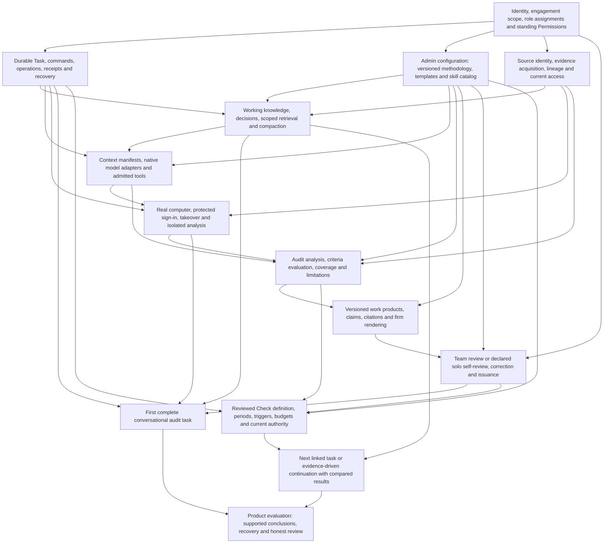

# Methodology, skills and working knowledge in the consolidated design

Consolidation recommendation for the lead design, 30 September 2026. The alternative attachment is reference material. This note does not change the selected Rust backend, fresh schema, continuing Task, managed computer or standing Permissions. It specifies the missing product contracts and dependencies without introducing a build plan or approval process for ordinary configuration edits.

## What to change in the lead

Methodology, skills and working knowledge must be present in the first complete audit task. They determine what material matters, how the work is performed, what the result means, how the paper is produced and who can review or issue it. They cannot be a knowledge feature attached after a generic conversational task engine already claims to deliver an audit product.

The lead §11 currently places “Long context, scoped memory and methodology” after the model layer and before recurring assurance. The alternative §5 goes further: Stage 6 adds methodology, skills and compaction after what it calls the first usable product. Replace both dependencies. A task uses a versioned methodology, discovers suitable skills and retrieves authorised working knowledge from its first substantive cycle; corrections and current decisions survive interruption and compaction from that point.

Retain the lead's typed standing and four scope boundaries. Add the alternative's useful concrete skill manifest and fragment provenance, but do not copy its universal instruction-precedence chain or its “Zobba proposes; a person accepts” requirement for every memory. Optional techniques must remain overridable by the auditor, and remembering ordinary instructions or source-backed working facts must not become a sequence of acceptance cards.

Lead §3.3 currently inserts Audit-manager approval for changes to mandatory methodology safeguards. Remove that default gate. **Admin owns methodology configuration. Admin edits, validates and saves it.** An Audit manager may advise on substance, and a firm may use its own governance outside or inside the system if explicitly configured, but the default product does not invent a second approver or separate publication ceremony. Review of a working paper or recurring assurance method is a different audit responsibility.

## One configuration experience

**Settings → Methodology and skills** contains the firm's methodology packages, templates, rating scales, review/issuance rules and installed skills. It is available to Admin. Auditor-facing views disclose the rules used by their work; they do not require auditors to maintain the package before asking for help.

Admin can edit directly, or ask Zobba to interpret supplied methodology material. An import produces editable proposed fields with citations to the source passages, unsupported interpretations and conflicts visibly marked. Admin corrects the proposal and uses the same **Save** action as for a direct edit. Until that action, extracted instructions are suggestions, not enforced firm configuration. The source file remains the basis of the interpretation, not an executable policy file.

**Save** performs structural and referential validation, creates an immutable version and records the author, time, diff, source citations, scope and effective timing. In one database transaction it updates the applicable assignment and creates durable change notifications for affected tasks/checks. Save failures leave the prior version effective. Editing never mutates a version already cited in an audit record. Undo saves another version; it does not remove history.

The UI says what the save applies to: for example, **“New tasks in all engagements · effective now”**. That is the default. The same screen can select particular clients/engagements, a future effective date, or **“Also apply to active tasks”**. Those are scope choices in an ordinary save, not a second authorisation ritual. Do not use “Publish for approval” where “Save” is sufficient.

Use two separate time concepts where methodology needs them: when a configuration becomes available to work, and the audit periods/conditions for which its criterion applies. A policy saved today may correctly govern transactions from an earlier specified period; “latest saved” alone cannot decide which criterion applies. Applicable criteria, sources and dates remain visible in the Working brief.

Each package contains:

- Applicable audit areas/phases, period/effective conditions and required versus optional work.
- Criteria and their authority/source; sampling and population conventions; result and rating vocabularies.
- Evidence and analytical checks, required limitations and which requirements can be evaluated automatically.
- Templates, stable section/field mappings and required outputs.
- Eligible preparer/reviewer/approver/issuer assignments and whether independent review is required.
- Suitable installed skills and any specific requirements those skills help satisfy.

Firm defaults can have explicit client/engagement overrides. Overrides name the affected fields and source assignment; they do not silently replace every inherited requirement with an empty package. Admin can change legitimate methodology settings, including review rules, within fixed platform truths: decisions remain attributable, reviewed versions remain immutable, self-review is never labelled independent, and configuration authority is never audit sign-off authority.

No fourth methodology-owner role is required. Named package stewards are metadata on an Admin responsibility. Admin can also hold an audit role if separately assigned, but saving a rule never makes that person the preparer or reviewer of a paper.

## Version binding and changing ongoing work

A task records its applicable methodology version, selected skill versions, relevant engagement decisions and a context manifest for each work cycle. A method version explains how the work was done. It is not a copy of Permissions that can defeat current revocation.

| Situation | Recommended behaviour |
|---|---|
| New task | Resolve applicable package assignment and audit period, bind exact versions, name the method/template in the Working brief and load relevant requirements before acting. |
| Admin saves for new tasks | Existing work remains bound to its recorded version. Show a concise “Methodology update available” notice only where a difference affects that work; do not pepper conversations with every typo change. |
| Admin also applies to active tasks, or an authorised auditor applies an available update | Accept a durable binding-change command. At a safe boundary, compute the changed requirements and dependent work, reassemble context and report the applied version. Rework only affected draft analyses/claims/sections. Ask a focused task question only when the change introduces a substantive unresolved criterion, scope conflict or new authority/cost requirement. |
| Version changes while a tool/model operation is in flight | The recorded operation retains its original basis. Reconcile its actual outcome, then assess applicability under the new binding. Do not relabel old work as having used a new method or silently dispatch old proposed actions under a changed basis. |
| New rule affects a paper in review | Preserve the submitted version and its review record. Identify whether the review can validly finish under its binding; if the active change requires different content or checks, create a successor/reconsideration item. No invisible mutation of the reviewer’s document. |
| New rule affects issued work | Preserve the issued version and historical decision. Create a revision/follow-up if the change is applicable to that work; a config save does not retroactively erase or fabricate approval. |
| Current access, Permissions or an explicit recall of a faulty configuration narrows use | Withhold affected new dispatch, disclosure and transitions immediately at their enforcement boundary. Reconcile dispatched work. Pinned methods do not override revocation. A recalled version is visibly unavailable for new work even before an active task adopts a replacement. |

The binding-change diff is structural where possible: template/presentation, optional advice, criterion/sampling/analysis, evidence requirements, and review/issue rules. The product uses the difference to describe its effect; Admin need not classify every edit manually. Text changes with uncertain semantic impact are conservatively treated as potentially material to the affected analysis, but that assessment is not itself a new admin approval process.

**Checks remain explicit recurring methods.** Saving a methodology package does not rewrite all Check definitions. They have exact method/source/criteria bindings and an existing audit review rule. A scoped maintenance update may adopt spelling, display metadata, formatting or optional guidance without a new audit approval when it does not alter the assurance. Record the new maintenance revision and provenance. Changes to criteria, population/sampling, analytical method, required evidence or review obligations create a proposed Check revision, assess affected results and follow the Check's existing reviewer/solo rule before that assurance changes. This is review of a new audit method, not approval of Admin's settings edit.

A Check on an older compatible version may continue if its assignment permits it. An applicable required replacement, recalled method or incompatibility pauses the affected occurrence and identifies the required revision; it cannot silently keep running an invalid method. Ordinary credential refresh, compatible source transport repair or a permitted model deployment replacement under the existing capability policy does not, by itself, require reapproving the method. Current standing Permissions, budget and processing restrictions are evaluated for every occurrence. Tightening them takes effect without waiting for Check migration.

## Distinct kinds of context, with their own standing

| Kind | What it supplies | How it becomes usable | What it cannot do |
|---|---|---|---|
| Methodology configuration | Firm requirements, criteria authority, expected work, outputs and review rules. | Admin Save plus explicit scope/effective assignment; exact version recorded. | Grant integration access, prove factual source completeness, invent human approval, or rewrite historical records. |
| Installed skill | A reusable technique, procedure of thought/tool use, scripts and resources; the deliverables it helps create. | Admin installs/enables or saves it in the scoped catalog; a task discovers and binds a suitable version. | Widen Permissions, promote its own optional advice above user direction, or make every suggested step a mandatory review gate. |
| Working knowledge | Relevant client/entity facts, source locations, prior work, systems/processes, accepted decisions, corrections, preferences and open questions. | Automatically recorded with source/scope and retrieved when relevant; explicit decisions are taken from their durable records. | Turn an assertion into verified evidence, cross client boundaries, or become methodology simply through repetition. |
| Evidence/reference content | Acquired records, policy documents, messages, application observations and source material. | Acquired and indexed with identity, provenance, coverage and current disclosure rights. | Issue runtime instructions or change user/firm authority. A retrieved file named `SKILL.md` remains source content. |

Required methodology controls that are mechanically decidable are enforced by code at their actual transition: required sections exist, prescribed review assignments are eligible, mandatory evidence checks were completed, issued content is the reviewed version. Requirements involving audit judgement remain visible obligations with supporting evidence and an accountable judgement; neither a package nor a model can mechanically prove every such requirement fulfilled.

An engagement decision can resolve which supported criterion applies without rewriting the firm's package. A skill can suggest an efficient technique and the auditor can choose another when methodology permits. An instruction such as “write this concisely” overrides optional presentation guidance. It cannot remove a required limitation or truthfully convert self-review into independent review. Use typed standing and explicit conflict resolution, not a global ordering of arbitrary text files.

## Skills that are actually used in the first task

Use a versioned skill bundle with an immutable manifest and resource digests. Include identity, purpose/description, applicability, expected inputs/outputs, compatible methodology requirements, tool/effect classes requested, resource and script entry points, trust/source information, availability scope and version. Requested tools describe what the skill may need; the normal tool admission and Permissions gates still decide what it can use.

At task start, discover applicable installed skills from the objective, engagement method, source types and current work. Filter by current organisation/client/engagement availability and model/tool capability first; rank remaining candidates by relevance. Load the selected instructions/resources on demand within a context budget. Record the reason and exact version, and show a natural activity line such as **“Using population completeness checks v3.”** The auditor can name a skill or choose one from the composer, but choosing is not a prerequisite for useful work.

Discover additional skills as the work changes, such as moving from population reconciliation to scanned-document analysis. Do not load the entire catalog into every model call. Do not execute an embedded script merely because a skill mentions it: the script runs through the normal isolated analysis port, with declared inputs, bounded resources and registered outputs. An unavailable required tool yields a specific limitation or substitute technique, never a hidden increase in authority.

Admin edits and saves a skill using the same versioning model. Enable/disable is normal configuration. Disabling new selection does not erase the history of a task that used it. A recalled unsafe or invalid skill blocks further use and marks dependent work for assessment. Optional advice versions can change without a human audit approval; a change to the method of a reviewed Check follows that Check's review contract.

## Working knowledge that helps without becoming paperwork

Use **What Zobba is using** in the task: method and skill versions, key decisions, relevant remembered facts/preferences, source references, unresolved questions and limitations. Each item shows source and scope, with actions to correct, exclude, update or forget where allowed. Keep this inspection available rather than making it a pre-task form.

Record explicit direction immediately: “Use the contractual termination date” becomes a durable scoped decision/correction and updates the working context, with acknowledgement. Relevant extracted facts can be recorded automatically as source-backed or uncertain facts; they do not require a memory-acceptance card. A user statement is attributed as a user assertion unless evidence establishes it. Stable personal presentation preferences can be learned with visible undo. Proposed cross-client generalisation is excluded by default; client content never becomes a firm preference through a summariser.

Separate these stores conceptually even if they share PostgreSQL infrastructure:

- **Current task state:** objective, Working brief, decisions, unresolved questions/effects, source bindings and outputs. Deterministic records rehydrate it.
- **Reusable working knowledge:** scoped, source-linked facts, preferences and lessons with validity and confidence; retrieval selects a small relevant subset.
- **Acquired evidence and derivations:** immutable source objects and analytical dependencies; citations lead here rather than stopping at a memory summary.

Every context fragment records kind, source/message/configuration identity, version/location, organisation/client/engagement/user scope, sensitivity/disclosure class, effective period, confidence/verification status, dependencies and validity. A manifest records what entered each model invocation and what was omitted because of access, freshness or budget. Provider opaque continuation is an optimisation tied to that manifest; it cannot substitute for durable task knowledge.

Retrieval starts with deterministic scope, current access and applicability filtering. Then lexical/vector retrieval and reranking choose useful authorised candidates. Resolve evidence citations to their registered objects and validate that returned excerpts/locations belong to them. Recheck rights and relevant versions immediately before disclosure. A missing/stale index is visible and may trigger direct-source lookup; an empty search is not proof that the population or policy is absent.

Staleness is source-specific: an organisation chart, account mapping and historic period policy do not have the same refresh rule. Record source validity and acquisition time separately. Refresh when an event or task requires current state; keep valid historical facts tied to the period they described. “Newest” is not a universal conflict rule. If sources conflict materially, preserve both and ask the specific criterion/fact question while independent work continues. Small presentational uncertainty does not block a task.

Corrections supersede knowledge with an attributable relationship and identify dependent claims/analysis. Revocation removes access to dependent extracts, memories, embeddings, previews and pending model context; reassemble summaries that cannot safely exclude the revoked fragment. Current subscription/output disclosure is rechecked as well. Restricted historical evidence may remain under the retention policy while no longer being available to the current model/user. Private sign-in screens, tokens, passwords and general credential stores never become retrievable task knowledge.

Compaction preserves exact durable decisions, unresolved operations, conflicts and source pointers. Its prose summary is derived context with a manifest, not a new source of authority or proof. Both stale inputs and later corrections can invalidate it. This is required for a long first task and reconnection, not a premium memory layer appended after the audit workflow.

## First complete task and continuing assurance dependencies

The first complete task must demonstrate the working relationship end to end: an auditor expresses an objective; Zobba applies relevant methodology, skills and working knowledge; acquires and inspects real authorised material; uses the computer and analytical tools; accepts guidance and survives a meaningful interruption; creates an inspectable work product; and supports its applicable human review/issue path. The same task can retain an evidence wait or become a reviewed recurring method. No “generic chat now, audit knowledge later” dependency is valid.

These are capability dependencies, not numbered delivery stages: evidence identity and storage must exist before context can cite it or a computer can register a capture; the knowledge capability can initially contain only the objective, method, known facts and source references. At runtime, newly acquired evidence updates the next context assembly and recurring results become new task context through those existing ports. The Task remains the owner; that feedback does not create competing ownership or a circular prerequisite for starting work.

**Roles are in the closed loop from the beginning.** Team work defaults to a preparer and a different assigned Audit manager reviewing/approving, with an authorised issuer. A solo practitioner can hold the necessary audit assignment under an explicit solo methodology and record **Self-reviewed**, never independent review. Admin configuration does not count as either. Review concerns exact work product/evidence versions. Check activation concerns its exact assurance method and uses the same applicable team/solo responsibilities; the check's future routine operations use standing Permissions without renewed per-action approvals.

**Audit evaluation is part of doing the task.** Applicable criteria, sample/population basis, evidence requirements and analytical outcomes determine supported exceptions, coverage limitations and the draft conclusion. A successful tool call is not a successful control test. An incomplete population can still establish an individual exception but cannot support an unqualified population-wide pass. Relevant deterministic checks are run as analysis and recorded; model judgement remains attributed; the human review path addresses the resulting work.

**Product evaluation uses these same complete journeys.** Required evidence includes: selecting the applicable period/version over a conflicting reference; using a relevant installed skill without granting new authority; obeying a user presentation correction while retaining mandatory review; recovering exact decisions through compaction/reconnect; asking about a material factual conflict; keeping one client's knowledge out of another; producing an inspectable paper with supported exceptions and coverage limits; team and solo review labels; applying a configuration update visibly; and a recurring occurrence retaining or deliberately revising its method. These are design acceptance obligations, not a new benchmarking exercise before committing to the architecture.

Recurring assurance therefore depends on complete method/evidence/review semantics, durable triggers, resource/budget control and the same model/computer contracts. Helper tasks depend on scoped context, resource ownership and safe output merges. Broader knowledge breadth, bigger catalogs or a Windows profile can grow, but methodology, skills, working knowledge, review and the real working environment are intrinsic to the complete task rather than deferred product identity.

## Exact source deltas for the lead writer

| Lead or alternative anchor | Consolidation treatment |
|---|---|
| Lead §3.3, especially “Audit manager … approves changes to mandatory review/issuance safeguards” | Replace with Admin edit/validate/Save, scoped immutable versions and attributable effect. No mandatory second configuration approver. Retain audit-manager responsibility for actual audit review/issuance and recurring-method approval. |
| Lead §3.4 “methodology changes, consequential client facts and cross-engagement reuse need appropriate review or explicit instruction” | Replace the blanket phrase with the typed mechanisms above: Admin saves config; explicit decisions recorded directly; factual confidence/source retained; material conflict asks a useful question; reuse passes current access/applicability. No approval for every memory. |
| Lead §§5.2–5.3 and §6.3 | Name package/skill assignments, immutable versions, task binding-change events, fragment manifests and knowledge validity. Keep them modules/records in the one Rust backend and PostgreSQL boundary. |
| Lead §11 | Replace the late methodology/memory branch with first-task prerequisites feeding context, analysis/evaluation, rendering and review. Include the repeated task/trigger closure and team/solo paths. |
| Alternative §§1.3.16/1.5/2.10 | Adopt useful package and skill contents and source-linked manifests. Remove separate methodology-owner approval machinery, global text precedence and mandatory memory-acceptance workflow. |
| Alternative §2.11 | Retain exact recurring method and per-occurrence identity. Do not copy “any model/Permissions change needs approval again” or “never opens confirmation waits”; current Permissions always apply, and an unattended task can durably wait for its responsible human when a genuinely required decision arises. |
| Alternative §5 Stage 6 and “first usable product is stages 0–5” | Reject as a product dependency. The first complete audit task already uses methodology, skills, working knowledge and long-task continuity. |

No further owner decision is required for these ordinary mechanisms. They resolve the stated direction. The existing consequential choices about hosting/app support, operating cost and commercial packaging remain with the lead design; this note creates no new approval category.
