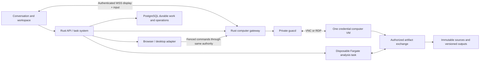

# Managed working environment: recommended design

Research date: 30 September 2026. This is a product/architecture recommendation, not an implementation plan. The direction brief is the product authority; vendor documentation below establishes specific infrastructure capabilities, not a ready-made Zobba integration.

## Recommendation

Use AWS as the initial managed execution platform. Give an active credential-bearing computer its own EBS-backed EC2 virtual machine; run general analytical code in separate disposable ECS Fargate tasks. Embed Apache Guacamole's JavaScript display client in Zobba, connect it through a Zobba-owned Rust session/input gateway to `guacd`, and use VNC for the Linux desktop and RDP for qualified Windows desktops. Keep PostgreSQL task/operation state and S3 work products authoritative. A VM is a replaceable working appliance with a recoverable private session, never the engagement record.

This chooses established VM isolation and display protocols without committing Zobba to operating a Firecracker host fleet, nested virtualization, a desktop streaming service's product shell, or two application backends. Guacamole supplies display and event transport; Zobba must implement control ownership, authorization, fencing, private sign-in, bounded delivery, and reconnection. Do not describe those as built-in Guacamole features.

Use a small, separately deployable computer gateway/control-plane process because its long-lived display connections and direct input must remain responsive during model or analysis congestion. The API and task worker stay in the shared Rust backend design; image preparation and application drivers are utilities of the execution plane.

## What the auditor experiences

The workspace panel has Computer, Analysis, Documents and Evidence views of one task. Computer displays the actual application session the agent is using. An analysis table or working paper can take the foreground without destroying the desktop or task. Closing the tab leaves authorized work running. Reopening the task restores its durable activity stream and attaches to the existing computer only if there is one.

Watching creates no input authority. Guide adds durable instructions to the task. Pause stops the task's new action dispatch and asks cancellable active work to settle. Stop cancels the task's active work while preserving receipts, artifacts and unresolved outcomes. Take over transfers the named computer's input channel to a human; independent authorized analysis can continue, with that fact visible. Hand back deliberately returns the computer and triggers fresh observation. These controls work independently of model calls. A narrow screen switches between conversation and workspace while keeping status and control available.

Use explicit computer states: Preparing; Agent controlling; Human controlling; Private sign-in; Paused; Reconnecting; Suspended; Restoring; Needs attention. Distinguish computer state from task state: a task can continue analysing while its computer is suspended or under human control.

Every computer belongs to one organization, engagement, declared environment/purpose, and credential principal. It may be leased successively by compatible tasks; only one task controls it at a time. Independent helpers get analytical sandboxes, not concurrent access to that browser. Independent browser work needs a second explicitly provisioned computer/session. There is no global browser shared across clients or unbounded machine-per-helper policy. A personal connection's session is controlled by its owner by default; delegates require an explicit supported account-sharing arrangement, not an incidental manager role.

## Execution topology and profiles

**Standard computer:** Ubuntu 24.04 LTS x86-64, a lightweight X11 desktop, headed Chromium, PDF/image viewers and LibreOffice for ordinary inspection. Use an EBS-backed general-purpose instance, initially a 2-vCPU/8-GiB class such as `m6i.large` where offered in the selected region, with encrypted storage. This is a starting capacity allocation, not a performance finding. Use a pinned, patched image. Select compatible regional instance inventory during deployment; do not base the product promise on one instance identifier. Browser automation uses a local driver/adapter and the same browser profile visible in the panel. The task engine never receives an unrestricted CDP connection, credential-host shell, browser-cookie API, or arbitrary JavaScript-evaluation capability.

**Analysis:** Linux Fargate tasks with Python, DuckDB, Polars, document parsers and bounded tool execution; allocate CPU/RAM by job class. A task sees only explicitly supplied engagement artifacts and short-lived artifact capabilities. It has no application session, connector refresh tokens, general cloud credentials, or access to computer control ports. Block general outbound access by default; fetch external inputs through authorized acquisition tools. Fargate provides per-task isolated infrastructure and does not share network interfaces, ephemeral storage, CPU or memory between tasks [6]. Keep different trust domains in different Fargate tasks; containers within one task are not separate isolation domains. No privileged container is required.

**Windows desktop:** Windows Server 2022 with native RDP, initially a 4-vCPU/16-GiB instance class and a qualified image. Offer Office LTSC 2024 through AWS License Manager user-based subscriptions, AWS Managed Microsoft AD and Remote Desktop Services SAL. AWS explicitly documents this license-included EC2 path and Office LTSC 2024; Microsoft lists Windows Server 2022 as supported for LTSC 2024 [7–9]. Windows Server is not a claim that every Windows 11 application works. Support named application/version profiles after compatibility qualification, including required drivers, add-ins, keyboard layouts and file formats. Keep each credential computer single-principal even though RDS can host multiple users.

Native Office should be available for authentic rendering, reconciliation, editing and review of templates or workbooks that require it. LibreOffice output is not promised to preserve every Word layout, Excel calculation, VBA macro, add-in or protection feature. Office LTSC is not Microsoft 365 feature parity. Microsoft 365 cloud integration can still use connectors or browser experiences under the customer's permitted account.

**Unattended desktop Office is a consequential limitation to design honestly.** The documented EC2 LTSC subscription establishes a named-user licensed remote desktop path; it does not establish every right to run background automation. Microsoft documents separate unattended Microsoft 365 RPA licensing and explains that Office remains designed for interactive end users, with reliability concerns [10–11]. Do not build unattended COM-driven Word/Excel into the universal document backend or assert that a shared technical user covers all auditors. Produce documents and repeatable calculations with supported file/API libraries; use native Office for qualified desktop workflows. An unattended Office-dependent method requires an application-specific supported/licensed deployment before it can become a recurring check. The full architecture supports such a qualified profile; entitlement and operational support are acceptance criteria, not an assumption.

## Live display, takeover and sign-in

Guacamole's protocol transports display drawing and input events over a browser tunnel; `guacd` translates to VNC/RDP [1–3]. Use authenticated WSS at Zobba's gateway. This is a real remote desktop, not a screenshot slideshow or a synthetic activity panel. Prefer standard lossless rendering for text/document readability and negotiate available encodings; actual responsiveness needs testing on target networks. No measured latency claim is made here. WebRTC is not needed for the baseline office/browser workload and is not being claimed as a Guacamole feature.

Maintain one underlying desktop session. Guacamole supports joining an existing connection by its ID [2], so authorized viewers join the same view; creating independent RDP sessions for viewers would show the wrong environment. Gateway-issued attachment capabilities are scoped to computer, user, allowed view/control mode, expiration and current control generation. Connection IDs are not exposed as sufficient authorization. Keep guacd and machine ports private. Authenticate gateway-to-VM/adapter paths and validate the RDP host certificate; never use a public unauthenticated VNC/CDP endpoint.

The authoritative gateway serializes control commands and keeps an incrementing control epoch. Every agent action carries computer ID, principal, task lease and epoch. Every human input channel carries its user capability and epoch. The gateway and local adapter reject stale epochs immediately before dispatch; the runtime cannot bypass them through a separate driver connection. Input authority covers browser navigation, DOM actions, accessibility actions, mouse, keys, touch, clipboard, upload, window manipulation and desktop commands, not only visible mouse events.

Takeover sequence:

1. Accept a priority control command independently of the model stream; record the request and new fencing epoch.
2. Block new agent actions, reject queued old-epoch inputs, release held keys/buttons and ask in-flight driver actions to settle or cancel at a bounded dispatch boundary.
3. Confirm gateway/adapter fencing before announcing human control. A click or submission already delivered cannot be recalled. Surface any possibly completed external effect as an operation requiring reconciliation; do not promise that takeover rolls it back.
4. Forward only current human input. Allow other viewers read-only attachment under Permissions.
5. On handback, fence human input, observe a fresh screen/application state, reconcile pending operations and source/account changes, invalidate stale element handles, then resume the task. Never replay the old click queue.

If the gateway restarts or loses authorization state, input fails closed. Rebuild the attachment and control lease from durable state with a new epoch; do not accept old browser socket traffic. If the controlling human disappears during sign-in or takeover, the computer becomes paused/unowned after connection loss is established, not silently handed to the agent. Independent work can continue.

Private sign-in is a restricted human-control mode. The auditor types into the actual remote application's login page. Suspend model screenshots, DOM extraction, accessibility capture, OCR, recorder frames and agent observations for that computer; disable key/payload recording throughout all modes. Keep only a metadata event that sign-in was requested/completed. Do not copy passwords, cookies or tokens into conversation or model context. After explicit completion, clear transient clipboard state and observe the resulting authenticated application. Only the credential owner, or an explicitly delegated principal, can complete this handoff. Other watchers see a privacy cover.

Prefer connector OAuth through the auditor's local browser when it can supply the required integration. An arbitrary remote desktop does not automatically support a user's local passkey, hardware key, enterprise device trust or password-manager extension. Browser-only application access therefore needs a documented customer-compatible login method (for example, supported remote entry plus external MFA approval). Do not promise generic WebAuthn/USB forwarding through Guacamole. Unsupported device-bound authentication is an application access constraint, not something to work around by collecting passwords. Any future secure-paste convenience must be a private input path with explicit payload-log exclusion, not chat or a durable server clipboard.

## Permissions must reach actual execution

Bind a permission to organization, engagement, account principal, source/application identity, declared environment (live/test/audit coordination), allowed actions, data scope and duration. Resolve these identities at each operation. A URL allowlist is useful egress control but does not prove an account is a test account or an action is read-only.

| Operating purpose | Recommended enforcement | Product consequence |
|---|---|---|
| Inspect live operational systems | Source-enforced read-only role/scopes plus gateway/tool action restrictions; downloads allowed only into authorized engagement evidence | Routine observation proceeds. Live changes to audited records have no standing authority. |
| Exercise a designated test system | Separate test account, endpoint/tenant identity, seeded synthetic data policy and allowed workflow actions | Agent may create test borrowers, submit permitted test approvals and record their receipts without per-click prompts. |
| Coordinate audit work | Specific document locations, recipients, calendars and action scopes; draft/send distinction plus standing grants | Drafting and permitted edits proceed. Sending, booking or changing an external shared artifact follows the actual configured grant. |

Pixels and generic browser clicks do not provide a reliable semantic read-only boundary. Neither does blocking HTTP POST (many reads use POST and some apparently navigational requests have side effects). If the source provides no enforceable read-only account, do not silently grant autonomous unrestricted computer interaction with live write credentials. Use a restricted connector/API, an approved narrowly supported workflow, or a human-controlled inspection. This is the necessary guarantee behind the product's live-inspection purpose.

Agent and human actions use the same application environment and account, but human takeover is not a mechanism to launder a denied agent command: record attributable control ownership and continue enforcing connection/client boundaries. The human may exercise the source permissions of their account; Zobba should not claim to enforce every semantic human action inside arbitrary third-party software. Do not represent human-created changes as agent-approved audit results.

Network policy limits the computer to approved source domains and artifact exchange, and disables access to other client networks and cloud metadata credentials. A machine management role, if present, is minimal and inaccessible to untrusted workloads. Connector credentials stay with the connector broker. Browser profiles/session cookies remain encrypted in the computer/session store; they never accompany analysis inputs or agent helpers.

## Files, durability and recovery

Use an explicit artifact exchange service, not a shared mounted home directory spanning computer and analysis. Browser downloads become immutable acquired-source objects with content hash, acquisition time, account/source identity and tool receipt. Analysis consumes versioned copies. Result files are separate versions with method/run provenance. In-app uploads and replacing shared documents are writes checked against Permissions. Generic clipboard, SFTP and RDP drive redirection are disabled by default; Guacamole has separate controls for these features [4]. Zobba's product file picker implements deliberate transfers and preserves engagement identity.

Treat document parsing and conversion as untrusted execution. Scan/isolate uploaded files and disable document macros by default. A workflow that needs macros gets a qualified disposable document environment, with no unrelated application session or broad network credentials. Do not open hostile workbook macros in the credential computer used to inspect a live application.

Suspension means the computer is idle or its task is waiting; the user closing a tab alone does not make authorized background work idle. Before stopping: stop new dispatch, settle/reconcile operations, save documents, persist artifact receipts and a session checkpoint, flush the browser/profile to encrypted EBS and release the worker lease. The baseline is graceful EC2 stop/start plus reconstruction. EBS persists, RAM does not; instance-store data must not contain work [5]. On restore, launch/start, reconnect the adapter, inspect the application, verify account/environment and session validity, and reconcile uncertain operations before resuming.

Hibernation can shorten some resumes but is an optimization of qualified AMI/instance profiles, not the recovery model. AWS requires support enabled at launch, a supported AMI/instance and encrypted root storage with RAM capacity; current documented Windows hibernation is limited to at most 16 GiB RAM [12]. Do not assume Ubuntu 24.04's baseline AMI can hibernate simply because an EC2 family supports it. Memory snapshots contain credentials and need the same custody/deletion policy as the browser profile. Session expiration, revoked MFA or source policy can require sign-in after either restart method.

Loss of the machine does not lose accepted commands, the conversation, operations, evidence or documents already saved to durable stores. Recover from the session disk/profile if trustworthy, or create a new computer and reacquire only what is needed. Never infer success from a lost VM or repeat a possibly submitted action. A download with no durable completion receipt can be reacquired under a new acquisition attempt; an email/send/test approval must be reconciled against its destination state first.

Separate retention of session credentials from engagement records. Deleting a private session should remove its profile/disk/snapshots and require a fresh login without destroying audit evidence. Reset images between principals; do not recycle another client's signed-in profile as a warm pool. Warm capacity is clean images only.

## Cost and owner recommendations

Recommend a metered managed-computer allowance plus bounded background-analysis/model usage, with an optional priced Windows desktop capability. Do not promise an unlimited always-on machine with every seat. Show the auditor meaningful budget status at task level, not a running cloud invoice at each tool call. Admin can set organization caps, concurrent-computer limits, maximum unattended spend and idle policy. A scheduled job reserves its own bounded budget. When a cap is reached, persist and pause useful work; preserve the result already earned.

Monthly infrastructure cost should be estimated from:

`sum(Linux running hours × regional Linux VM rate) + sum(Windows running hours × regional Windows VM rate) + analysis(vCPU seconds, GiB seconds, extra storage) + gateway/guacd capacity + persistent EBS/snapshot GiB-months + S3/request/retention charges + display/network egress + base networking/control-plane costs + Windows named-user Office/RDS subscriptions + Windows directory/license infrastructure + model usage`.

Include NAT gateways, load balancers and endpoints in baseline costs; their idle costs matter at small scale. Compute can stop while the browser profile retains a storage cost. AWS documents stopped EC2 as not billed for instance usage, while EBS remains billed; hibernation has a billed stopping interval [5,13]. Do not present storage as free because the machine is suspended.

Windows has an additional commercial floor: AWS Managed Microsoft AD and license infrastructure, per-user Office/RDS costs, and RDS monthly/CAL rules. The current AWS documentation explicitly describes no proration for RDS and continuing billing until the relevant CAL token expires (up to 60 days under the documented rule), with conditions for ending it [7]. This makes minute-based Windows marketing misleading. Named-user licensing and application-automation rights must be reflected in the offer. A representative 80 active hours versus a 730-hour continuously running month is approximately 11% of compute hours; it says nothing about the persistent and license components and is not a vendor quote.

Consequential recommendations for the owner:

1. **Adopt managed AWS computers as a paid product capability, with Linux standard and Windows an optional licensed profile.** This preserves the real-computer experience without absorbing arbitrary desktop licensing into every seat. The chosen initial region must satisfy customer data-processing requirements and the required Windows services; regional availability and price need a deployment quote.
2. **Make trustworthy live read access a product prerequisite.** Support capable test-account automation and audit coordination alongside it. This avoids selling a guarantee that a general computer-use model cannot enforce on writable production accounts.
3. **Define supported applications by profile, including authentication and unattended rights.** Commit to real Windows/native Office support, while offering only tested functions for each profile. For a firm requiring unattended Microsoft 365/legacy desktop use beyond the AWS LTSC path, price and qualify that environment as an additional deployment profile rather than promising universal compatibility.
4. **Keep audit work independent of machine retention.** Charge for usable work and bounded compute, allow private-session deletion, and make task restoration a first-class experience. Do not equate a live browser with the task's existence.

## Sources and evidential limits

All URLs below were fetched successfully during this review. Vendor documentation verifies the listed platform capabilities; no Zobba runtime performance, application compatibility, prices, or end-to-end security implementation was tested. Raw pages and extracted text are saved under `/workspace/zobba-design/references/infrastructure/`. Documentation is mutable; the product architecture should link these sources without treating their present limits or pricing as permanent constants.

1. Apache Guacamole architecture: https://guacamole.apache.org/doc/gug/guacamole-architecture.html — JavaScript client, protocol tunneling and guacd translation.
2. Guacamole protocol: https://guacamole.apache.org/doc/gug/guacamole-protocol.html — input/display instructions and joining an existing connection by ID.
3. Embedding/custom application: https://guacamole.apache.org/doc/gug/writing-you-own-guacamole-app.html — custom tunnel/client integration; a Rust gateway is Zobba work, not a supplied Guacamole Rust server.
4. Connection configuration: https://guacamole.apache.org/doc/gug/configuring-guacamole.html — VNC/RDP, clipboard and file-transfer controls, recording options; disable key recording.
5. EC2 stop/start: https://docs.aws.amazon.com/AWSEC2/latest/UserGuide/Stop_Start.html — EBS/instance-store and lifecycle behavior.
6. Fargate isolation/security: https://docs.aws.amazon.com/AmazonECS/latest/developerguide/fargate-security-considerations.html — per-task isolation and restricted privileged capabilities.
7. AWS user-based software subscriptions: https://docs.aws.amazon.com/license-manager/latest/userguide/user-based-subscriptions.html — Office LTSC editions, named-user/subscription billing, AD and RDS prerequisites/limits.
8. AWS subscription setup: https://docs.aws.amazon.com/license-manager/latest/userguide/user-based-subscriptions-getting-started.html — Managed Microsoft AD, EC2 and RDS setup requirements.
9. Office LTSC 2024: https://learn.microsoft.com/en-us/office/ltsc/2024/overview — supported OS and LTSC product scope.
10. Unattended Microsoft 365 licensing: https://learn.microsoft.com/en-us/microsoft-365-apps/licensing-activation/overview-unattended — separate unattended RPA licensing; not evidence that arbitrary AWS LTSC sessions have those rights.
11. Unattended Office technical considerations: https://learn.microsoft.com/en-us/office/client-developer/integration/considerations-unattended-automation-office-microsoft-365-for-unattended-rpa — interactive design/reliability constraints.
12. EC2 hibernation prerequisites: https://docs.aws.amazon.com/AWSEC2/latest/UserGuide/hibernating-prerequisites.html — AMI/family, encryption, launch-time configuration and RAM limits.
13. EC2 lifecycle billing: https://docs.aws.amazon.com/AWSEC2/latest/UserGuide/ec2-instance-lifecycle.html — stopped usage and ongoing EBS charges, hibernation stopping interval.
14. Rate sources for a later regional quote: https://aws.amazon.com/ec2/pricing/on-demand/ and https://aws.amazon.com/fargate/pricing/ — no dollar rate was copied or assumed in this design.
