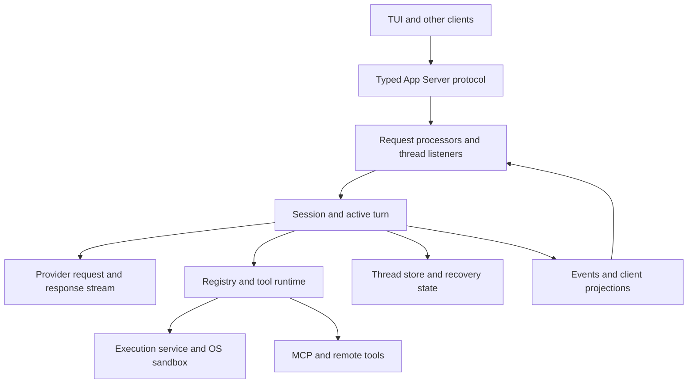
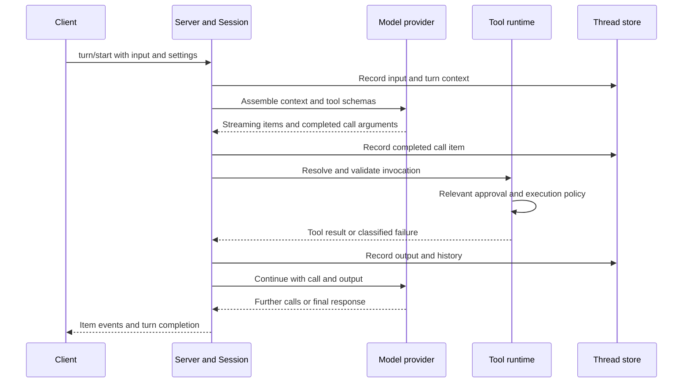
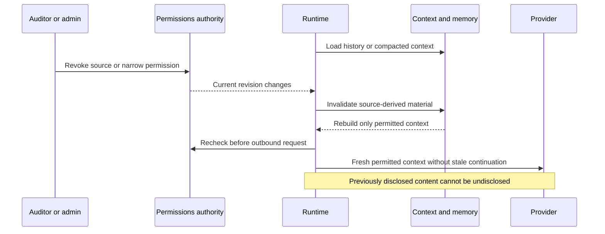
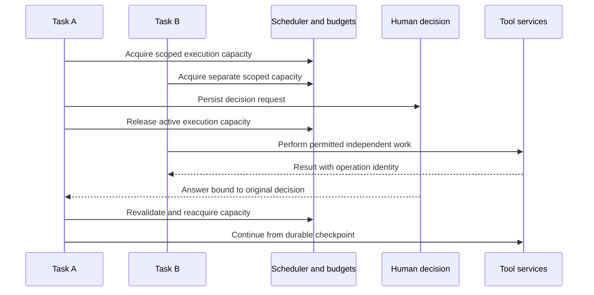
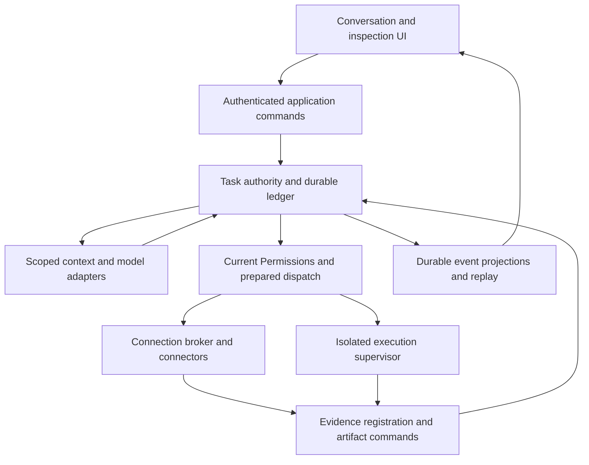

# Zobba — Codex source study and Rust architecture assessment

**For owner review · 29 September 2026 · Research only**

This report studies the implementation and test assertions at fixed source revisions. It proposes engineering choices; it does not amend an approved contract, approve a migration, or start implementation. No product source, schema, dependency manifest, sprint status or approved architecture was changed. Nothing was merged or deployed.

## 1. Executive conclusion

**Build a Zobba-owned harness. The best material to learn from Codex is its separation of clients from execution, explicit ownership of a running turn, capability-bound tool dispatch, cancellation structure, context management and failure-focused tests. Its local-user trust model and transcript recovery are insufficient as Zobba's audit authority.**

**Recommendation: take option 2, a Zobba-owned Rust runtime with deliberately retained application services, to a bounded comparative proof after this report is approved.** Rust is a credible language for the principal agent runtime and execution supervisor. A broader Rust backend is also technically credible, but this study does not establish a performance or operating-cost benefit large enough to justify porting the whole backend now. Keep option 3 open behind explicit evidence gates. Option 1 remains viable if the proof shows no useful gain or the team cannot sustainably own Rust.

This is a recommendation for the next architectural decision, **not approval to build the proof or migrate**. The current TypeScript architecture stays authoritative until the owner approves a change. Replacing the approved AI SDK adapter implementation with Rust adapters, adding a process boundary, and changing state ownership all require recorded architecture amendments and compatibility acceptance.

The highest-value conclusions, in order:

1. **Own operation identity and authority outside the model loop.** A provider tool-call ID identifies a model item. It does not establish business idempotency, current permission, evidence registration or an external operation's outcome. Codex does persist completed call items before dispatch, but its inspected persistence path can log failure and continue. Zobba must refuse dispatch when the authoritative intent cannot be committed. [C-recovery] [Z-loop]
2. **Use one durable authority for task state.** Adopt per-task ownership and cancellation, while retaining PostgreSQL-backed commands, receipts, permission checks and evidence registration. Never make a Rust worker's in-memory state and an application database competing authorities. [C-loop] [Z-events]
3. **Treat recovery as reconciliation.** Codex has real daemon suspension/recovery and useful transcript repair. A synthetic `aborted` tool output still cannot tell an auditor that a remote action did not happen. Zobba needs separate execution status and effect certainty, with a reconciliation wait for uncertain operations. [C-recovery] [Z-foundations]
4. **Make context revocation a data-flow operation.** Source excerpts, summaries, skills, memory, provider continuation and client projections have different lifecycles. Rechecking the next tool's permission does not remove a revoked source from an already assembled model request. Zobba's approved context requirements are stronger than the inspected Codex mechanisms. [C-context] [Z-loop]
5. **Bound work in bytes and resources, not just task counts.** Codex mixes bounded queues, deliberately unbounded event queues and per-connection disconnection. Adopt the explicit trade-offs and tests, not the unbounded queues. Existing Zobba timeline code also needs a slow-consumer proof; a language change alone does not provide one. [C-transport] [C-client] [Z-stream]
6. **Reuse small, understandable units selectively.** The strongest direct code candidates are the head/tail output buffer and UTF-8 truncation module, with their tests. Use them for previews only. Learn from prepared MCP calls and protocol generation, but implement the audit authorization and durable operation contracts independently. [C-buffer] [C-truncate] [C-mcp]

**Evidence limit:** 97 existing Zobba tests were executed and passed in five targeted files. Codex tests were inspected, not executed: this environment has no available Rust/Cargo/`just` toolchain. No paid model calls, production credentials, real client data, database migration or production experiment was used. There is **no measured Rust-versus-TypeScript benchmark** in this report.

## 2. Baseline and source boundary

### 2.1 Pinned revisions

| Source | Revision studied | What it means |
|---|---|---|
| `openai/codex` | [`8ffd91e42aa001b7e897bea812b02f89264f9fa0`](https://github.com/openai/codex/commit/8ffd91e42aa001b7e897bea812b02f89264f9fa0) | Fresh `main` observation; commit time 2026-09-29 19:03:30 UTC. All Codex file links below use this SHA. |
| `raeltec-systems/intellifin-audit` | [`d9c72c80976dda5308353f9ce22e8e32fd1a11a9`](https://github.com/raeltec-systems/intellifin-audit/commit/d9c72c80976dda5308353f9ce22e8e32fd1a11a9) | Fresh merged `main`; commit time 2026-09-29 16:54:32 UTC; merge of PR #64, Story 10.10. All Zobba links use this SHA unless explicitly marked PR54. |
| Zobba draft PR #54 | [`b5ed03322cea6b25f52d8673ec6b70e3ac8f599a`](https://github.com/raeltec-systems/intellifin-audit/commit/b5ed03322cea6b25f52d8673ec6b70e3ac8f599a) | Separately inspected pending branch `claude/ecstatic-turing-mxntoc`, not treated as merged implementation. |
| Zobba open PR #65 | [`498861ce5a94981d133fa91b30d3d9249cd1d446`](https://github.com/raeltec-systems/intellifin-audit/commit/498861ce5a94981d133fa91b30d3d9249cd1d446) | Tracking correction for already-merged Story 10.7; open at baseline capture. |

Both repositories were refreshed into isolated study checkouts. An existing Zobba working checkout was left untouched. Existing same-lockfile dependencies were temporarily reused only to run the isolated tests, then the temporary links were removed. The report is supplied separately so that it can be reviewed before any repository change.

### 2.2 Evidence labels

| Label | Meaning |
|---|---|
| **Observed** | Directly read implementation/control flow at the pinned revision. |
| **Test-defined** | Read a test's setup and assertions; it specifies the listed failure detection. It is not a claim that the test ran here. |
| **Executed** | Ran during this study; command, files, counts and scope appear in §10. |
| **Inference** | Engineering conclusion from the inspected paths; limits are stated. |
| **Proposed** | A recommendation for Zobba, not current or newly approved behavior. |

References such as [C-loop] and [Z-loop] lead to pinned source; §11 supplies additional call sites and tests. Negative findings mean “not found in the inspected path,” not proof that no related code exists anywhere in the repository.

### 2.3 What is approved, implemented and still pending

The PRD, addendum, architecture spine, contract register, course-correction Proposals 3a–3d, 4/4b, 5, 6, 7, Sprint Change Proposal, EXPERIENCE/DESIGN material and current implementation records were inspected. Their consolidated baseline describes a conversation-led audit harness with **Engagement as the primary business object** and Artifacts as outputs, three tenant roles (**Auditor, Audit manager, Admin**), the Pair identity and **Permissions** terminology. Configuration of methodology does not confer independent audit approval. Old repository/package names remain in actual code. [Z-baseline] [Z-experience]

| Concern | Approved direction | Observed implementation / qualification |
|---|---|---|
| Legacy delivery | Preserve compiler-1 execution, evidence and historical verification until approved transition. | Stories 10.6–10.10 are now merged. Do not restart that legacy review. Stale tracking for 10.7 is the subject of PR65. |
| Tenancy | Tenant/client/engagement scope; current principals and RLS; IDs are selectors. | PR54 Story 11.1 inventories tables/policies and contains tests of that inventory. It does **not** implement RLS. Pending tenancy choices remain owner decisions. |
| Task loop | Application-owned tool loop, native tool proposals, durable call/attempt identity and current Permissions before dispatch. | The merged runtime remains the constrained compiler-1 Run/Work Item loop. New task contracts in the register are largely planned interfaces. |
| Concurrency | Initial task tool calls execute serially. | Parallel independent tasks are distinct from parallel tools inside one task. Codex's tool parallelism is a later design option, not permission to change the approved initial loop. |
| Context | Bounded context and honest stop; revoke derivatives and provider continuation. | Story 16.8a carries the early bounded-context requirement; compaction in 16.8b is deferred. Bringing compaction forward would change sequencing. |
| Evidence | Immutable source/evidence distinction, provenance, registration, validation and attributable human review. | Existing evidence storage, digest verification, event chain, Run review and replay mechanisms are valuable assets; do not replace them with a transcript. |
| Experience | Conversation primary; contextual inspection; routine permitted work proceeds. | Existing Run conversation receipts and inspection/replay plumbing can be generalized. A fixed command console is not the destination. |

**Material document discrepancies.** Story 12.4 still contains wording about an `allowed`-only stub, while the same epic's prerequisite and the approved fail-closed direction forbid such a stub in a runnable application. Follow the stronger approved boundary; record the wording discrepancy, not a permissive implementation. PR54's description also says “no product module,” but its actual head includes a small evidence-download first-read fix and regression test. Its “no RLS implementation” characterization remains true. [Z-epics] [Z-pr54-fix]

**Residual work is not automatically undecided.** The newer PR54 follow-up record says the owner approved the grouped Epic 10 follow-up and its wording. Do not reopen those choices using older notes that still call them pending. Open PR44 contains older deployment acceptance findings; it is historical context, not evidence of the deployed product's current behavior. This study did not retest production. [Z-followup]

### 2.4 Public-source limits

Observed public boundaries include the terminal client, typed App Server client/protocol, server request processors, core session engine, model-provider clients, tool/MCP dispatch, execution services, sandbox integrations, local persistence and their tests. Public client code can call hosted APIs; that does not expose their implementation.

The desktop application's full proprietary UI, hosted model internals, hosted compaction/memory/connector services, remote control infrastructure and provider execution internals were not inspected. Cloud-backed skills/memory, model catalog/auth services and hosted tools need external services and policies. Their client code is not a self-contained substitute for those services. No claim of hosted-service correctness follows from this report.

## 3. Architecture map: what Codex actually separates



**Observed:** the current TUI uses `codex-app-server-client`; the client supports in-process and remote forms while retaining the request/notification model. The in-process facade avoids exposing direct runtime handles, though a `legacy_core` bridge explicitly remains transitional. App Server `turn/start` validates inputs and builds settings before calling `start_or_steer_turn`; it distinguishes Started, Steered and NotSubmitted. Session code owns a running turn, tool futures and context; storage and execution are separate modules. This is genuine separation, not evidence that the server is the right authority for audit work. [C-client] [C-turn-api] [C-loop]

Planning also has two meanings. A user-visible plan is an aid to work; runtime task ownership, scheduling and permission decisions are code. A generated plan does not grant access or guarantee that every step succeeded. Zobba must additionally distinguish an exploratory approach from a reviewed, frozen method eligible for recurring execution.

## 4. Four end-to-end traces

These diagrams summarize inspected control flow. They omit local helper calls, not trust boundaries. “Persist” in a Codex trace means the inspected storage attempt, **not** a claim of transactional business durability or power-loss safety.

### A. Normal work



**Observed:** the stream handler acts on a completed tool-call item, records it and builds the routed call before execution. Registry dispatch and the selected runtime handle parsing, hooks and tool-specific policy; shell and MCP have distinct enforcement paths. Tool outputs return into conversation history and client events. A turn can contain several model sampling cycles. The sampling completion barrier and call/result ordering are tested. [C-stream] [C-registry] [C-parallel-tests]

**Test-defined:** the parallel-tool suite checks call/output grouping in the next request and, with a gated provider stream, proves commands start before `response.completed`. These are useful causality tests; they do not establish business authorization or durable exactly-once effects. [A-tool-order-tests] [A-early-tool-tests]

**Proposed for Zobba:** before any port I/O, commit a step/attempt with descriptor version, canonical effective arguments, policy version, input evidence references, actor/delegation and operation identity. The trusted application injects tenant/engagement and other platform fields; conflicting model targets are refused. Validate complete arguments against a closed schema, resolve resources within scope, evaluate current Effective Permissions, then dispatch. Confirmed execution still needs independently tracked input quality before it supports a substantive assessment; unknown and partial work remain visible as limitations. Preserve serial tools initially; display meaningful progress without a confirmation for every routine read. [Z-foundations] [Z-loop]

### B. Interruption, crash points and uncertain effects

```mermaid
sequenceDiagram
    participant UI as Client
    participant S as Session
    participant D as Storage
    participant T as Tool or remote service
    UI->>S: Start work
    S->>D: Record proposed call
    S->>T: Dispatch operation
    UI->>S: Explicit interrupt
    S->>T: Cancel or terminate where supported
    Note over S,T: Remote action may already have committed
    T-->>S: Result may arrive late or be lost
    S->>D: Record available outcome or recovery state
    UI->>S: Resume after restart
    D-->>S: Recover history and eligible turn state
    S-->>UI: Recovered state; missing output is not effect proof
```

| Failure point | Codex evidence / limit | Required Zobba consequence |
|---|---|---|
| Before accepted durable intent | Recording a call precedes dispatch on the inspected path, but a storage failure is not uniformly a terminal dispatch barrier. | No committed intent means no external I/O. Admission and outbox/job publication must commit together. |
| Intent recorded, dispatch not confirmed | Transcript has a call, but that alone does not prove dispatch. | Distinguish known-not-dispatched from uncertain dispatch; reconcile before retry. |
| Remote system commits, response is lost | Local cancellation cannot undo that effect. | Keep effect certainty `unknown`; query by durable operation key or await human reconciliation. Never blindly repeat a non-idempotent action. |
| Response received, result commit fails | Runtime memory may know more than recovered history. | Retry storing the same receipt; use connector reconciliation if the receipt is lost. Do not rerun solely because the transcript lacks output. |
| Result committed, client misses event | UI may be stale although work completed. | Read durable receipt/projection and replay by cursor. A UI retry must return the same operation receipt. |
| Worker stopped while a process is live | Cancellation/kill semantics depend on the execution path and process descendants. | Fence the attempt, supervise/terminate its process group or sandbox, quarantine late artifacts and verify cleanup. Preserve any confirmed effect. |

**Observed:** Codex has explicit daemon turn suspension and continuation recovery. The inspected suspension path rejects live descendants and drops pending input/interactive waiters; it is not a blanket guarantee that all questions and outstanding operations survive. Local thread-store writes invoke record and flush, but the inspected recorder uses file flush without an `fsync`-style guarantee. Core persistence failures can be logged without preventing dispatch. Missing tool outputs can be normalized into `aborted` entries for a valid provider transcript. [C-recovery] [C-normalize]

**Test-defined:** suspension tests reopen the same turn ID; abort tests preserve the original call plus an aborted output in the subsequent model payload. They test continuation and transcript consistency, not rollback of an external system. [C-abort-tests]

**Proposed:** do not collapse `cancel_requested`, `worker_stopped`, `effect_unknown`, `confirmed` and `reconciled` into “cancelled.” A disconnected client is not evidence of cancellation. Keep the approved step state vocabulary; add attempt/dispatch/effect facts beneath it only through an approved contract. Stopping blocks subsequent work, releases resources and triggers reconciliation. It does not erase evidence or reverse an already completed effect.

### C. Compaction/resume followed by permission revocation



**This diagram's revocation behavior is proposed for Zobba, not a claim that Codex implements the whole path.** Codex compacts/resumes context and carries provider continuity; it also has useful generation checks for cloud skill reads. Its client-specific resume redaction explicitly leaves stored history and model resume history unchanged. Those mechanisms do not establish audit-source lineage across excerpts, summaries, memory and opaque provider continuation. [C-context] [C-skills] [C-resume-redaction]

**Proposed:** every included fragment carries scope, provenance, source/version, sensitivity and authorization lineage. On revocation, invalidate any dependent summary or memory that cannot safely be separated, refresh retrieval/caches, withdraw affected client projections and rebuild context. Recheck after asynchronous assembly and immediately before disclosure/dispatch. A stale opaque continuation token must be discarded when the adapter cannot prove that its retained state excludes the revoked material. Reauthorize subsequent evidence reads and exports too. Historical evidence retention and present access are separate concerns; preserve required records without continuing to disclose them.

A request already accepted by a provider cannot be made unseen. Define the effective cutoff at the application's final authorized dispatch and record any in-flight request affected by a concurrent revocation. Provider cancellation/deletion can be requested where supported, but must not be reported as retroactive confidentiality. This is a boundary to prove, not a reason to weaken the approved revocation requirement. Initial Slice 1 may stop honestly at its context limit; automatic compaction remains deferred unless separately brought forward. [Z-loop] [Z-epics]

### D. Two independent tasks while one waits



**Observed in Codex:** sessions have their own active task/context, while managers, model clients/configuration, execution services and resources may be shared. Tool concurrency inside a sampling cycle uses a read/write gate: parallel-capable calls can share access; nonparallel work is exclusive. Child agents are separately managed sessions with additional limits and inherited configuration, not equivalent to tools or a new tenant security boundary. A waiting session need not prevent another session from advancing, but no inspected mechanism proves tenant-fair scheduling. [C-loop] [C-parallel] [C-agents]

**The diagram is Zobba's proposed durable scheduling interpretation.** Persist human waits and release the worker rather than retaining a process slot for hours. Separate task admission, provider quota, connector quota, execution slots and byte budgets. A slow tool consumes its own connector/attempt allowance, not a global database lock. Tenant/client/engagement state and credentials cannot be shared just because both tasks use the same provider or method. One browser/workspace or output artifact remains exclusive unless its contract explicitly supports safe concurrent access.

For the initial approved serial loop, concurrency means multiple independent tasks. Later parallel calls are safe only when resource access, dependencies, deterministic assembly and budget accounting remain equivalent. Two reads may still differ in meaning if they observe a changing system, advance a cursor or share a browser session. Use one source snapshot/version where consistency matters; never infer independence from a tool name or an MCP read-only hint.

## 5. Engineering lessons and adaptation matrix

The matrix ranks engineering value for this product. “Adopt pattern” means write Zobba code implementing its own contracts. “Adapt code” means a specifically identified source unit, with licensing and maintenance work in §8. Neither means adding Codex as the product dependency.

| Priority / area | Observed mechanism and test evidence | Assumption or limitation | Zobba treatment and acceptance impact |
|---|---|---|---|
| **P0 · Loop ownership** | Session owns one active task; immutable StepContext binds model/tool/environment settings; ordered submissions route steering and answers. A test gates a steered input checkpoint and inspects the next request. [C-loop] [C-steer-tests] | In-memory ownership and an accepted submission are not automatically durable command acceptance. | **Adopt pattern.** One durable task owner; persist accepted guidance/waits and fence obsolete workers. Keep an immutable proposal snapshot plus a fresh permission decision. |
| **P0 · Recovery** | Record-before-dispatch on success; local writer ownership/flush; explicit graceful turn suspension; missing-output repair. Filesystem fault tests verify buffered-write retry. [C-recovery] [C-recorder-tests] | Failed persistence can permit continuation; no general external-operation receipt protocol; missing output becomes `aborted`. | **Implement independently.** Successful durable admission is mandatory; operation/attempt identity, idempotency contract and reconciliation control retry. |
| **P0 · Prepared dispatch** | PreparedMcpCall captures exact client, connection/config/catalog and metadata; stale catalog prevents irreversible preparation. Tests stall preparation/refresh and assert no preparation for a stale call. [C-mcp] [C-mcp-tests] | In-memory catalog lock is held through work. Refresh can wait; this is not immediate distributed revocation. | **Adopt pattern.** Bind actual account, arguments, descriptor, mandate revision, approval and operation key. Recheck at dispatch; do not hold a database transaction over remote I/O. |
| **P0 · Execution authority** | Shared shell orchestrator separates policy, review, sandbox selection and retry. Deny-read tests block certain escalation bypasses. [C-shell] [C-sandbox-tests] | Deliberate unsandboxed escalation exists. MCP and hooks use additional paths. | **Implement independently.** Terminal source-write/mandate denial, application-owned policy after all rewrites, audited refusals. Human confirmation cannot override immutable source protection. |
| **P0 · Context/revocation** | Context history separates model truncation from original rollout; compaction checkpoint+suffix reconstruction; generation checks before/after cloud skill reads. [C-context] [C-context-tests] [C-skills] | Opaque compaction may retain undisclosed semantics; a refreshed sandbox does not remove old source text. | **Adopt checkpoint and generation patterns; implement lineage/revocation independently.** Invalidate derived context and incompatible continuation; preserve evidence under separate access rules. |
| **P0 · Concurrent work** | Per-session tasks, shared/exclusive tool gate, ordered output assembly, child execution/residency guards. Synthetic barriers and eviction races test overlap/ownership. [C-parallel] [C-agents] | No uniform tenant-fair limit; root sessions are outside the V2 child cap; ordered collection can delay a ready result. | **Adopt ownership and cancellation patterns.** Persist each result independently of presentation order; bound global/tenant/provider/connector resources. Keep initial tools serial. |
| **P1 · Registry/validation** | ToolExecutor co-locates schema/runtime/exposure; default nonparallel; canonical namespaces and reserved-name refusal. Tests check both collision insertion orders. [C-registry] [C-registry-tests] | Advertised schema normalization is not complete argument validation. MCP path parses JSON but does not prove all semantic constraints locally. | **Adopt pattern.** Reviewed descriptor carries effect and location class; validate authoritative schema and scoped IDs before credentials/I/O. Visibility is not permission. |
| **P1 · Model portability** | Session/turn client lifetimes, typed stream events, prefix-compatible continuation, transport fallback, usage/retry classification. Parser and WebSocket tests inspect exact payloads. [C-provider] [C-provider-tests] | Multiple hosts still use Responses wire semantics; optional root reconnect can be unbounded; hosted capabilities are not locally implemented. | **Implement independent provider adapters.** Capability-tested images/tools/continuation/recovery, bounded costs/deadlines, portable task state, actual provider identity per invocation. |
| **P1 · Process/data handling** | Owned process handles, group cleanup, requested versus confirmed terminate; head/tail output buffer; bounded modern MCP framing. [C-process] [C-buffer] [C-mcp-framing] | Soft process cap can be exceeded; some paths lose output; legacy MCP compatibility permits larger messages; hook collection may precede display limits. | **Adapt selected buffer code; independently supervise execution.** Stream full registered evidence separately, cap every layer, reject unsafe output files, keep exit/effect/quality distinct. |
| **P1 · Skills/instructions** | Catalog identity, deterministic discovery order, disabled-selection handling, generation-bound cloud cache. Skill test proves metadata cannot widen sandbox. [C-skills] [C-skill-tests] | Discovery can include untrusted roots; executor read snapshots deliberately outlive file edits; implicit invocation defaults permissive. | **Adopt discovery mechanics; implement admission.** Reviewed immutable versions, scope/owner, capability declarations and revocation. Evidence named SKILL.md is not an installed skill. |
| **P1 · Memory** | Eligible-root background extraction/consolidation, bounded read interfaces and pruning. Test checks known secret redaction before extraction upload. [C-memory] | Semantic forgetting is partly prompt-directed; storage backend owns access policy; per-fragment cap is not aggregate budget. | **Adopt staged knowledge proposal pattern.** Provenance, review, expiry and deterministic read-time exclusions; active memory is neither verified evidence nor authority. |
| **P1 · Protocol/observability** | Typed JSON-RPC, generated TS/JSON schemas, stable/experimental exports; slow WebSocket disconnected; resume projections. [C-protocol] [C-transport] | Some client queues deliberately unbounded; emission timestamp is not durable event sequence; response redaction may leave model history untouched. | **Adopt typed versioned boundaries and fault tests.** Durable cursor replay, bounded byte queues, payload-free telemetry, reauthorization of projections; preserve the conversation/inspection UI. |
| **P1 · Verification/evolution** | Mock provider streams, barriers, write failures, process descendants, exact request assertions and schema fixtures. [C-parallel-tests] [C-recorder-tests] [C-protocol-tests] | Feature/platform/network skips exist; unit policy checks are not kernel enforcement or model-behavior evaluations. | **Adopt testing approach.** Count executed assertions/skips, prove deployed isolation prerequisites, separate deterministic safety from model-quality evaluation and visual review. |
| **P2 · Hooks/extensibility** | Pre-tool hook can rewrite/block; some malformed hook decisions fail open. Completed local hooks intentionally preserve detached children, even on a nonzero completed exit. [C-hooks] [C-hook-tests] | Extensibility semantics assume trusted configuration; a post-hook rejection cannot undo completed work. | **Do not adopt unchanged.** Trusted extension interfaces only initially; all final arguments face the mandatory gate. Any arbitrary command hook needs the same execution containment as generated code. |

### 5.1 Concurrency: useful structure, mixed bounds

Codex's inspected submission channel is bounded at 512 and its rollout writer command queue at 256. Session event delivery is unbounded. The in-process App Server client intentionally uses an unbounded event queue to avoid deadlocking a foreground request behind unread notifications; the corresponding test proves requests still finish and the queued notifications remain ordered. That is an explicit correctness-versus-memory trade-off, not a generally safe server design. [C-loop] [C-client]

The WebSocket path makes a different trade-off: outbound queue capacity is 32,768 messages and a full slow connection is disconnected through `try_send`; other clients can continue. Stdio waits instead. The transport test fills a slow queue and verifies that a fast recipient gets its message within a timeout. Neither message-count limit bounds bytes when individual messages can be large. [C-transport] [C-transport-tests]

Zobba already has the stronger audit-event pattern of database sequence replay with notifications as wakeups. However, the inspected stream implementation unconditionally enqueues frames and drains replay pages without a consumer-demand/byte-bound check. This is a **source-level risk, not a measured memory incident**. Preserve its cursor truth and add a bounded delivery layer. Durable receipts must complete even if no client reads; transient token deltas may be coalesced, while durable events must be replayable. [Z-stream]

Avoid holding global or tenant admission slots during human waits. Avoid a shared database pool being consumed by tasks waiting on providers. Use explicit lock order, bounded query duration, per-resource exclusion and lease fencing. Cancellation must propagate to work that can stop, while results arriving after cancellation remain attributable facts. Safe Rust removes some memory hazards; these ordering and capacity requirements remain application logic.

### 5.2 Provider adapters and context budgeting

**Observed:** `WireApi` at this pin contains Responses, while provider configuration covers OpenAI, both Bedrock variants and local compatible hosts. This supports host/auth/catalog variation; it is not evidence of native Anthropic Messages or Gemini wire compatibility. Bedrock Runtime uses an OpenAI-compatible endpoint. A Responses client cannot simply be relabeled a provider-neutral harness. [C-provider]

The SSE parser deliberately distinguishes complete output items, custom input deltas, response completion and stream failure. It can emit a completed tool call before the response completes. A closed stream without completion is an error; retries and WebSocket-to-HTTP fallback exist. Prefix reuse requires compatible non-input fields and history prefix, but Zobba must additionally bind compatibility to scope/disclosure generations. [C-provider-tests] [C-continuation]

**Proposed model port:** normalize text/media references, complete proposed calls, refusal/error/finish reasons, measured and unknown usage, and cancellation into a Zobba envelope. Keep provider-required opaque items in an encrypted, scoped continuation object. Never present those opaque items as evidence. Cap argument bytes, content items, tool count, images, output bytes/tokens, total deadline and attempts; allow only adapters whose contract tests cover the selected capabilities. A text-only fallback cannot silently continue an image-dependent task. A provider switch occurs only at the approved safe boundary and must not forward another provider's opaque state.

Full-document access and finite context are compatible. Keep complete permitted material in evidence/working storage, expose authorized page/range/visual reads, track what was inspected and what remains unexamined, and never treat an empty search result as exhaustive absence without known index coverage. Compaction is a derived work product: preserve decisions, source references, uncertainty and unresolved questions, then verify the proposed compressed context against durable records. Codex's four-bytes-per-token estimate and truncation marker are presentation heuristics, not a provider-exact budget or proof that a population was fully analyzed. [C-context] [C-truncate] [Z-loop]

### 5.3 Execution, isolation and every path to I/O

The current Linux reference uses bubblewrap by default with seccomp and `no_new_privs`; legacy Landlock is an opt-in path. Other backends include macOS Seatbelt and Windows restricted-token mechanisms. These depend on the operating system and launch configuration. The symlink-replacement enforcement test has a prerequisite skip, so a green test command can run no relevant assertion when bubblewrap is unavailable. [C-sandbox] [C-os-test]

MCP stdio startup and local hooks are separate process launch paths, not automatically covered by the shell orchestrator. The descriptor-boundary test verifies that a deliberately inherited file descriptor is absent in the MCP process and its descendant. Hook timeout tests verify group termination, while completed-hook tests intentionally preserve background descendants. A local regex secret scrubber or `Debug`-redacted string does not establish comprehensive credential containment. [C-mcp-process] [C-hook-tests] [C-redaction]

**Proposed audit execution boundary:** the supervisor receives only an admitted execution specification, immutable input hashes/mounts, script and environment version, resource profile and output contract. It grants no database, broker or object-store credentials to the program. Start with network-disabled analysis as approved; any later network capability is explicit and separately reviewed. Use read-only evidence mounts and a separate disposable output namespace. Validate traversal, symlink/hardlink aliases, special files, aggregate size and content before registering outputs. A program's manifest and stdout are untrusted claims; the supervisor measures bytes, hashes and termination.

Run heavy analysis in bounded processes/services suited to the workload. Rust may supervise Python, SQL, DuckDB or another approved engine; a TypeScript supervisor can do so too. Neither choice requires reimplementing every analytical library. Keep reproducible method source, parameters, engine/version, inputs, output digest and validation; narrative explanation alone is not independent evidence. [Z-execution]

### 5.4 Instructions, effort and injection evidence

**Observed:** configuration precedence includes trust restrictions, not just last-value-wins merging. Project configuration excludes credential-broker/provider/telemetry authority; managed deny-read requirements accumulate restrictions. Skills have separate discovery, selection and loading, but their repo/user/admin display ordering is not an audit-policy hierarchy. Preserve instruction provenance and distinguish platform rules, approved methodology, user direction and untrusted source material. [C-config] [C-skills]

Codex's reasoning settings also show why adapters need explicit mappings: `build_reasoning` uses model defaults/capabilities, and model-owned normalization maps selected values to wire values. The protocol accepts custom nonempty effort strings. Zobba's approved closed effort vocabulary and administrator policy should remain authoritative; record both requested effort and actual provider parameters, without implying that greater effort changes evidence or approval status. [C-effort] [Z-model-policy]

**Test-defined, not a model-security evaluation:** skill tests exercise sandbox non-escalation; cache tests exercise stale generations; secret-redaction tests check known patterns. Memory templates tell the model to treat raw tool text as untrusted, but instructions are not proof of adversarial robustness. No inspected test establishes the full audit path of hostile evidence → summary → resumed task → attempted unauthorized action. [C-skill-tests] [C-memory]

**Proposed:** exercise evidence that asks to read another tenant, disclose a credential, write to an original source, approve its own finding, install a skill or treat a remembered statement as permission. Test before and after compaction, resume and memory retrieval. The deterministic gate must refuse the actual forbidden action even if the model follows the hostile instruction. Separately evaluate whether the model preserves uncertainty, useful investigation and accurate citations. These are different quality and authority tests.

## 6. Proposed Zobba-owned architecture

### 6.1 Logical responsibilities

These are ownership boundaries, not a requirement to deploy a microservice for every box. The approved modular-monolith boundaries can implement most of them; option 2 introduces only justified process/service boundaries. The user continues to work through the accepted web experience.



| Owner | Concrete responsibility | It must not own |
|---|---|---|
| Authenticated application commands | Resolve identity/membership, accept idempotent human direction, validate decision targets, present current projections. | Browser-supplied tenant IDs as proof; client-side approval authority. |
| Task authority | Sole task/turn/step/wait state transitions, durable inbox, lease epochs, budgets, attempt receipts, restart reconciliation and terminal manifest obligation. | A competing model or in-memory task truth; audit approval inferred from “done.” |
| Context and model adapters | Authorized context derivation, complete-call assembly, provider capability policy, usage and bounded continuation. | Tool execution, source access grants, self-approved findings, unreviewed recurring methods. |
| Permissions and prepared dispatch | Evaluate actual parameters against current Effective Permissions; bind descriptor/account/action digest/decision/operation identity; terminal denial before I/O. | An unbounded approval cache or hook able to broaden source rights. |
| Broker/connectors | Worker-only credentials; exact-account I/O; timeout/idempotency/reconciliation contract; authoritative effect/data-quality result. | Model-selected credential destinations; treating transport success as data completeness. |
| Execution supervisor | Isolated program lifecycle, input mounts, resource limits, measured outputs, cleanup and termination receipt. | Tenant data access policy based on a script's claims; registering its own evidence without independent validation. |
| Evidence/artifact commands | Immutable registration/provenance; append-only derivations/artifact versions; claim support, quality, independent review and issuance. | Replacing original evidence with summaries or modifying a sealed result on a late receipt. |
| Event projections | Ordered scoped progress and inspection references; reconnect recovery and bounded delivery. | Task control state inferred from connection health; storing secrets in telemetry. |

### 6.2 State and persistence model

Preserve the approved `task_step` outcome vocabulary **requested / accepted / confirmed / unknown / refused** and explicit wait types; do not silently rename the contract to a generic job status. Represent attempts, lease ownership, cancellation intent, dispatch claims and later reconciliation as attributable facts. A `confirmed` operation can still return incomplete data; a completed task can still contain an exception or require review. [Z-foundations]

Effective Permissions retain the approved intersection: frozen task authority, current policy ceiling, current membership/grants and delegation, engagement/resource scope, and connection restrictions. A newly broader policy does not automatically broaden an already frozen task. Revocation can narrow it. Human confirmation binds the material action details within this boundary; prompts, skills and memory cannot expand it. [Z-foundations]

Keep four axes separate:

| Axis | Example question |
|---|---|
| Execution / effect | Was it admitted, dispatched, confirmed, refused or left uncertain? |
| Input quality / coverage | Was acquisition complete, consistent, fresh and sufficiently corroborated? |
| Audit assessment | What criterion was evaluated; what exception, limitation or hypothesis is supported? |
| Review / issuance | Which content version did an independent authorized human review or issue? |

For each external operation, the durable record binds task, turn/call, descriptor version, canonical effective parameters, source/output class, scope, permission decision, required confirmation, operation key and attempt number. Store large inputs/outputs by registered references. Commit accepted work plus an outbox/queue publication atomically. External I/O occurs outside the transaction. A returned receipt updates the same operation authority idempotently; a material payload change is a new decision/operation, not an “exact retry.”

On restart, reacquire a fenced lease and inspect state. Safe reads may be repeatable under their declared semantics; effects use their idempotency/status contract. A provider's negative lookup proves non-execution only if that API guarantees it. Expired leases or time windows prove neither non-execution nor completion. A human resolution remains `resolved-by-human`, not provider-confirmed. Late receipts can be retained under a narrow principal after stop/revocation, without enabling fresh execution or rewriting a sealed artifact. [Z-foundations]

### 6.3 Language placement and authority

**Preferred interpretation of option 2:** Rust owns the new AgentTask runtime **and its complete task aggregate command/claim/receipt implementation**. Legacy compiler-1 Runs stay under their existing TypeScript owner. The Next.js interface and authentication layer remain; task commands route to the Rust authority. Shared evidence/identity services retain one authoritative implementation through explicit versioned interfaces until deliberately transferred.

This makes Rust a principal runtime, not merely a shell helper. It also avoids rewriting the existing Run engine before the new harness proves useful. Most new task/connector/context/execution capabilities are still planned, so the decision is partly language selection for new work, not just rewriting finished software. Existing historical and in-flight Run compatibility remains substantial work. [Z-baseline] [Z-disposition]

Two valid implementation variants require comparison:

| Variant | Benefit | Cost / gate |
|---|---|---|
| Rust owns the whole new Task aggregate; TypeScript retains legacy Runs and selected services. **Recommended candidate.** | Clear durable ownership; meaningful runtime-language proof; new-task code need not first be built and then ported. | New service/transaction boundary; task queue integration and scoped principal propagation must be proven. Shared evidence registration needs idempotent command/reconciliation semantics. |
| TypeScript owns the Task aggregate; Rust provides a stateless execution/supervision service. | Smaller change and fewer ports of existing application infrastructure. | Does not establish a principal Rust harness, and does not by itself improve task durability. Evaluate if execution is the only measured bottleneck. |

Do not have both services directly update the same task state. Do not create a Rust database update followed by an unrelated Node queue insert. Retain legacy pg-boss unchanged initially; for new tasks, prove a transactional outbox plus a supported queue bridge, or obtain approval for a queue replacement. Do not depend on undocumented pg-boss table internals. A task split must have one writer, one lease/fencing scheme, explicit command versions and idempotent handoff. Cross-service consistency uses receipts and reconciliation, not an imagined transaction spanning a provider and PostgreSQL.

## 7. Rust assessment

### 7.1 Comparison of all three options

| Dimension | 1 · Continue TypeScript | 2 · Rust runtime + retained services | 3 · Rust principal backend through staged migration |
|---|---|---|---|
| Correctness tools | Existing discriminated unions, runtime schema validation, ports and tests; local async ordering remains explicit. | Rust ownership, exhaustive enums and Send/Sync improve local resource/concurrency contracts; still needs DB fencing and policy validation. | Same benefit across more backend code; more invariants must be re-established during ports. |
| Memory and concurrency | I/O concurrency is suitable; avoid large retained JS objects, unbounded streams and CPU work on the event loop. | Potentially tighter allocations and resource ownership in long-lived tasks/supervision; two runtimes add baseline memory and serialization. | Removes some bridge duplication eventually; cannot assume total RSS falls once caches, TLS, DB pools and executors are included. |
| Latency / throughput | Existing system's limits may be provider, pool or queue-related rather than language-related. | Best opportunity to measure orchestration overhead and parallel-session resource use without replacing UI/domain services. | Broad HTTP/CRUD rewrite may add little when storage/model latency dominates. No speedup established. |
| Cancellation | AbortSignal/cooperative timeouts and explicit process supervision; dropped Promise is not cancellation. | CancellationToken/Drop/owned handles help contain local work; remote effects and started blocking tasks still require reconciliation. | More consistent local patterns possible, but more migration paths to validate. |
| Failure containment | Worker processes, sandbox services and durable transactions can give strong containment. | Process boundary can isolate supervisor/runtime failures; must prevent stale Rust workers committing after restart. | Smaller language surface eventually; still requires OS isolation, quotas, process supervision and DB guards. |
| Dependencies | Current AI SDK, Better Auth, Drizzle, pg-boss and browser adapters are directly usable. | Replace model/task adapters; bridge identity/evidence/legacy services; select Rust HTTP/PG/telemetry libraries. | Port or replace more authentication, persistence, queues, export/rendering and operational tooling; do not assume drop-in equivalents. |
| Build/test | Established Node/pnpm/Vitest/Playwright/DB gates; fast incremental work familiar to current repository. | Adds Rust compilation, lockfile/toolchain/platform CI, cross-language contracts and tests. | Eventual backend consolidation, but largest period of mixed suites and duplicate build pipelines. |
| Debug/deploy | Existing worker/web deploy shapes and telemetry. | Versioned internal API, two release artifacts, correlation across processes, independent drain/rollback. | Larger operational conversion, release ordering and disaster-recovery rehearsal; potentially simpler only after transition completes. |
| Maintenance/cost | Lowest transition cost; requires deliberate concurrency discipline and continued provider SDK compatibility. | Bounded new ownership plus lasting two-language expertise; strongest learning-to-cost ratio for this study's unknowns. | Highest initial engineering cost and regression surface; credible if target runtime and subsequent pilots demonstrate sustained value. |
| Recommendation | Keep as viable fallback and baseline comparator. | **Preferred next proof; not yet approved implementation.** | Keep as a real conditional direction, not a rejected option or immediate rewrite. |

### 7.2 What Rust concretely contributes

Safe Rust constrains memory ownership and data races; resource handles, immutable step snapshots and typed state variants make accidental sharing and lifetime mistakes harder. This fits a runtime juggling sessions, streams, children, process groups and cancellation. Codex supplies actual examples, not just a language marketing argument. Yet safe Rust permits deadlocks and logical races; it cannot prove permission freshness, database isolation, correct remote effects or sound audit conclusions. The Rustonomicon explicitly makes this distinction. [R-races]

Rust also permits direct implementation of parsers, streaming hashes, bounded buffers and supervisors without a JavaScript event loop or garbage-collected object graph. These are **potential advantages to measure**, not claims of lower end-to-end latency. Poor allocation choices, large cloned payloads, unbounded channels or oversubscribed blocking work can consume memory in either language.

Tokio's `spawn_blocking` is not a killable execution sandbox: once started, blocking work cannot generally be aborted. Bound CPU work separately and use a supervised process for untrusted or hard-deadline analysis. Node worker threads can move CPU-intensive JavaScript away from the main event loop; this prevents a false comparison of sensible Rust with deliberately blocked Node. [R-tokio] [R-node]

### 7.3 Feasible stack, real replacement work

Codex's workspace demonstrates Tokio, HTTP/streaming clients, Serde types, generated protocol schemas, SQLx-backed local state, tracing and OS process tooling. Its pinned toolchain is Rust 1.95.0 and edition 2024; this is a source prerequisite, not a mandated Zobba version. [C-build] [A-rust-toolchain]

| Responsibility | Rust feasibility | Migration implication |
|---|---|---|
| Async runtime / HTTP boundary | Tokio with a typed HTTP stack such as Axum is a credible candidate. | Pin supported versions; bound body/queue sizes, deadlines and concurrency. Library defaults do not implement tenant quotas. |
| PostgreSQL | A maintained async PostgreSQL client such as SQLx supports PostgreSQL; Codex's inspected local persistence is not Zobba's PostgreSQL authorization model. | Port transaction/principal wrappers, locks, error classification and migration ownership; prove FORCE RLS with real roles and pooled connections. |
| Model providers | HTTP/SSE/WebSocket clients and typed adapter code are feasible. | Reimplement AI SDK-dependent request/response semantics and capability conformance. No tool executors hidden inside SDK transport. |
| Authentication | Retain Better Auth/Next session handling initially. | Rust receives verified, bounded identity/delegation context and performs current scope checks. Replacing auth later is an independent compatibility/security project. |
| Queue / jobs | Rust can drive leases and outbox processing. | Existing pg-boss joins application transactions; a bridge/replacement must preserve atomic admission, delivery, drain and retry behavior. |
| Browser/documents/analysis | Call approved external engines/services through ports. | Keep working browser APIs and accepted rendering outputs; do not port mature engines solely to claim a single-language backend. |
| Telemetry | Structured tracing can carry task/attempt/receipt IDs. | Preserve current allowlists. Full prompts, tool output, secrets and client evidence are not routine logs. |

Supporting library documentation: [Axum][R-axum], [SQLx][R-sqlx] and [Better Auth][R-auth], checked 29 September 2026. These establish availability of building blocks, not a selected dependency list, integration benchmark or license clearance for a future distribution.

### 7.4 Separate the performance questions

| Time/resource component | What to measure | What a language change cannot be assumed to fix |
|---|---|---|
| Provider/model | Time to first item, complete tool arguments, full response, rate limits, retries, tokens/cost. | Remote inference latency or provider quotas. |
| Network/storage | Connector latency, S3 streams, database lock/pool wait, outbox delivery. | An undersized pool, N+1 reads, missing indexes or slow remote service. |
| CPU analysis | Parsing, joins/aggregation, hashing, rendering; engine CPU/RSS and spill. | Slow analysis in the same unchanged external engine. |
| Orchestration | Admission/dispatch/receipt overhead, stream serialization, scheduler delay, cancellation coordination, per-task memory. | Correctness and boundedness absent from the architecture. |
| Client delivery | Backlog bytes, lag, reconnect and snapshot catch-up. | An unbounded buffer copied into Rust. |

No measured Codex performance result was found that establishes Zobba's expected gain. A timing assertion in a synthetic parallel-tool test is not a production benchmark. The test named `shell_tools_run_in_parallel` has a threshold too loose to establish overlap by itself; the barrier/gated-completion cases give better concurrency evidence. [C-parallel-tests]

### 7.5 Representative proof plan — proposed, not executed

Use the same small vertical slice in both languages: accept a scoped task, read a synthetic connector, compute a bounded result, register evidence, wait for a bound decision, recover from restart and stream an artifact reference. Use deterministic fake providers and a recording connector; **no paid model calls** are needed to compare orchestration.

**Controlled environment:** one recorded Linux image/kernel on fixed 4-vCPU/8-GiB worker allocation, separate identical PostgreSQL and object-store test instances, identical connection-pool caps, CPU/memory/output quotas and executor image. Record Node/Rust/compiler/library versions, release build flags, container digests, dataset seeds and provider fixture version. Compare TypeScript and Rust in separate runs, including cold and warm startup. Three repeat runs per steady workload after warm-up; report distributions and raw environment evidence. These are proposed experiment settings, not requirements already approved for production.

| Experiment | Workload / fault | Metrics | Correctness gate |
|---|---|---|---|
| Concurrent tasks | 1, 32 and 128 tasks across four synthetic tenants; provider delay 0, 250 ms and 2 s; one long human wait and one slow connector. | Throughput; p50/p95/p99 admission, dispatch and receipt latency; RSS/CPU; pool wait; per-tenant progress. | No tenant leakage or starvation from the waiting task; budgets conserved; no global lock spans human/provider wait. |
| Large outputs / populations | 100 MiB generated stdout, 1-million and 10-million-row synthetic populations streamed to the same analysis engine, bounded previews. | Peak RSS; throughput; spill/storage bytes; CPU; time to first preview; omission counts. | Full stored hashes/counts match when complete; quota stop says partial; preview never masquerades as complete population/evidence. |
| Slow clients | 1, 20 and 100 subscribers; fast reader, 1 KiB/s reader and disconnected reader; burst of durable events plus transient deltas. | Queue bytes, event lag, RSS slope, receipt latency, catch-up duration. | Bounded memory; fast clients/receipt commits progress; reconnect cursor yields complete durable order without duplicate application. |
| Cancellation | Cancel before launch, during child I/O, while output pipe is held by a descendant, and after remote effect but before response. | Requested/confirmed termination latency, orphan count, leaked handles/slots. | No false “stopped” confirmation; process descendants gone or explicitly unresolved; completed effects retained. |
| Worker recovery | Kill at each row of trace B; duplicate jobs; stale worker wakes; broker response delayed beyond lease. | Time to resume/reconcile, redelivery count, unresolved-operation count. | Idempotent connector causes one effect; non-idempotent unknown is quarantined for reconciliation; stale leases cannot commit/dispatch. |
| Revocation/context | Source read → derivation → summary/memory → compact/resume; revoke during in-flight read and before next request. | Rebuild cost and revocation-to-block time; fixture request inspection. | No revoked bytes or contaminated opaque continuation in new disclosures; historical evidence remains restricted, intact and attributable. |
| Portability | Same fixtures over Responses and another permitted native provider adapter, images/tools included; mid-stream failure and provider switch. | Adapter errors, usage accounting, recovery behavior. | No partial-argument execution, missing required image capability or replayed effect; provider-specific opaque state stays with its provider. |
| Compatibility | Same black-box commands against old and candidate owners; populated historical database; rollback/drain. | Divergences, deployment/drain time, operator steps. | Original hashes/identifiers unchanged; current permissions and independent approval enforced; no dual task writer. |

Set performance acceptance thresholds **before** running, based on deployment budget and expected workload. Correctness gates have zero tolerance for cross-scope disclosure, false evidence completeness and unauthorized effects. Do not trade those for throughput. Measure engineering cost too: time to implement the same change, CI/build duration, fault diagnosis and operator recovery steps. Option 3 needs evidence that expanding Rust ownership reduces total long-term complexity enough to justify its additional compatibility work.

## 8. Selective code reuse and licensing

### 8.1 Recommended code candidates

Only the following two units are recommended for possible **source adaptation**, conditional on choosing a Rust implementation. Neither was copied into the product. Both are small enough to understand and own without adopting the Codex workspace. TypeScript remains free to implement the same behavior independently.

| Candidate / exact unit | Dependencies and license | Required modification and test portability | Maintenance judgment |
|---|---|---|---|
| **Head/tail output preview buffer:** `codex-rs/core/src/unified_exec/head_tail_buffer.rs:1–169`, plus omission marker helper at `unified_exec/mod.rs:231–233`. [C-buffer] | Rust standard library/`VecDeque`; imports a parent capacity constant and marker formatter. Covered by repository Apache-2.0 license; no separate third-party implementation identified in this unit. | Extract the coherent buffer plus formatter into a Zobba preview module; parameterize capacity; expose omitted-byte count separately. The marker adds bytes beyond retained content, so reserve marker space if the wire payload has a hard total cap. Port `head_tail_buffer_tests.rs:1–91`: head/tail retention, exact omission, zero/tiny caps and large chunks. Add stream chunking/byte-cap properties and malformed UTF-8 display cases if conversion changes. | **Low to moderate.** Keep upstream SHA/path and an adaptation diff; monitor buffer fixes. Never use this lossy buffer as the complete evidence store. |
| **UTF-8-safe truncation module:** `codex-rs/utils/string/src/truncate.rs:1–156` and `truncate/tests.rs:1–117`. [C-truncate] | Module is standard-library code. Importing the entire string crate adds unnecessary `regex-lite`, Serde and JSON dependencies. Source Apache-2.0. Tests import `pretty_assertions` 1.4.1, dual MIT/Apache-2.0; replace with standard assertions to avoid that test dependency. [C-string-manifest] [R-pretty-license] | Preserve Unicode boundary behavior and tests; name the four-bytes/token estimate explicitly as a heuristic. Count markers and surrounding request content in the real model budget. Use for previews or a conservative pre-budget step, never population completeness or exact tokenizer accounting. | **Low.** Small algorithm with portable fixtures; token-model policy remains Zobba-owned. |

**License handling if copied later:** retain the Apache-2.0 license, applicable copyright/attribution notices and required NOTICE content; mark modified files and document the pinned source. The root NOTICE attributes OpenAI and identifies Ratatui-derived material elsewhere. Determine which notices pertain to the selected extracted unit rather than claiming all repository assets share one license. No trademark permission follows from source reuse. Both candidate test modules use `pretty_assertions`; standard assertions can preserve these fixtures without that dependency. This is a source-license inventory for engineering review, not completed distribution clearance. [C-license] [C-notice]

### 8.2 Learn the pattern; do not fork the subsystem now

| Source family | Treatment | Why source adoption is not currently recommended |
|---|---|---|
| `PreparedMcpCall`, registry identity and stale-before-preparation tests | **Implement independently**, guided by those invariants and failure fixtures. [C-mcp] [C-mcp-tests] | Coupled to Codex catalogs/configuration/auth and a long-held in-memory lock. Zobba needs durable operation identity, actual-account binding, current Permissions and distributed fencing. |
| Session/StepContext, cancellation guards and ordered tool output | **Adopt pattern**, preserving per-task ownership and independent result persistence. [C-loop] [C-parallel] | Extracting `codex-core` imports coding-agent semantics, local configuration, model history and a large dependency graph. Its storage/error behavior is not the required operation ledger. |
| Responses parser/client, continuation and compaction | **Implement adapters independently**; use exact-stream tests as design inputs. [C-provider] [C-context-tests] | Provider wire coupling and opaque hosted behavior; importing it does not provide the required second native provider or source-revocation semantics. |
| Typed protocol and generated schemas | **Adopt generation/compatibility pattern.** [C-protocol-tests] | Zobba's task, evidence, review and replay vocabulary belongs to its own contract; Codex notification types are not those domain types. |
| Cloud-skill generation checks | **Implement independently** across context and broker caches. [C-cloud-cache-tests] | A compact algorithm is more useful than adopting the entire skill service/client and authentication graph. Include a post-await generation check. |
| PTY/process/sandbox and MCP framing | **Conditional later component evaluation**, not approved reuse. [C-process] [C-mcp-framing] | Cross-platform OS/FFI code, Tokio, PTY, RMCP, auth, configuration and network dependencies require target-image qualification and transitive-license inventory. Shell containment must also cover hooks, descendants and connector launch paths. A narrow maintained execution service may cost less than a fork. |
| Hook execution, local approval policies and prompt-directed memory retirement | **Do not adopt unchanged.** [C-hook-tests] [C-memory] | Fail-open extension cases, local-user escalation and advisory forgetting conflict with mandatory audit authority and deterministic revocation. |

The root license is not a blanket dependency license. For example, the repository includes separately licensed WezTerm material and third-party voice notices describing GStreamer/GLib and other native components. Neither is in the proposed two-unit extraction. Any future expansion of reuse needs its own file/dependency/license inventory, attribution review and security-update owner. [C-third-party] [A-wezterm-license]

Track a copied unit as vendored code with an origin SHA, local changes, tests and review date. Do not make upstream `main` a moving runtime dependency. A bug fix may be backported after review; an upstream behavior change must not silently change a frozen audit contract.

## 9. Compatibility and migration implications

This section assesses options. It is not a migration schedule, new epic, dependency selection or approval to implement.

### 9.1 Existing responsibilities: retain, port, redesign or retire

| Responsibility | Recommended disposition if option 2 proceeds | Compatibility obligation |
|---|---|---|
| Accepted Next.js conversation/inspection experience and authentication | **Retain** initially. | Same Pair identity, role labels, meaningful progress, contextual artifacts and exact-bound human decisions. New internal API must preserve current identity and authorization semantics. |
| Compiler-1 Runs, versions, queue handlers and active/paused work | **Retain** under the TypeScript owner. | Continue executing supported versions and serving historical read/verify/export/replay. Do not confuse legacy constrained action proposals with the future native-tool task loop. |
| New AgentTask aggregate and model loop | **Implement in Rust if selected**, as one complete authority. | Task/step/wait/budget/claim/receipt transitions and task queue admission belong to one writer. New work can be routed by aggregate kind; never dual-dispatch a real external action. |
| Pure evaluation, canonicalization and validation functions | **Port selectively** only when the owning service moves. | Keep golden bytes and closed outcomes; preserve false-pass, missing-coverage and independent-review negatives. Do not replace domain judgment rules with model self-assessment. |
| Audit chain and evidence object registration | **Retain authority and formats** initially; transfer implementation only as a deliberate whole. | Existing lock order, atomic append/head/projection, first provenance and immutable object checks must survive. A new language cannot rewrite historical hashes or infer missing ownership. |
| Permissions, broker, connector receipts and source identity | **Build/redesign to approved new contracts**, independent of Codex policy. | Current effective authority, exact account, canonical identity/source-wins, immutable original evidence, confirmed versus unknown outcome. No duplicated TS/Rust policy truth. |
| pg-boss, Drizzle transactions and database principal wrappers | **Retain for legacy; redesign the new-task integration boundary.** | Atomic command/outbox admission, current transaction principal, lease fencing, safe retries and drain. Prove queue bridge behavior before choosing it. |
| Timeline delivery | **Retain durable cursor semantics; redesign bounded delivery.** | Ordered durable replay, no duplicate application, revocation of accessible projection, no client backpressure on receipt persistence. |
| Code/document analysis | **Isolate and supervise** through the execution port; port orchestration where useful. | Same complete/partial distinctions, actual method/version, reproducibility, quotas, output validation and evidence registration. External analysis engines can remain. |
| Legacy Builder write path and fixed command intake | **Retire only through the approved transition.** | Slice 4 acceptance and outstanding draft/queue disposition precede Builder retirement. Keep required readers and legacy operational actions. No historical evidence or version deletion. |

The current audit chain hashes canonical event bytes linked to the previous hash; it locks the Run and head before appending and updates the projection in the same transaction. The canonicalizer follows JavaScript number serialization and UTF-16 key ordering, and rejects input without a canonical storable form. A Rust `serde_json` serialization is **not** a drop-in replacement without byte-for-byte proof. Verify v1 bytes using their original envelope before upcasting for display; introduce v2 explicitly. Existing object keys, role wire values, migrations and golden fixtures remain intact. [Z-events] [Z-canonical] [Z-register] [Z-disposition]

Evidence registration also has useful existing defenses: reserve provenance before object writes, use immutable put-if-absent, and verify stored content by readback/hash. Preserve these facts independently of the task runtime. Do not infer a general durable external-operation ledger from the legacy ToolAction path: the inspected legacy browser action record is saved after the port returns. [Z-evidence] [Z-work-item]

### 9.2 Black-box continuity and safe handoff

Use language-neutral fixtures and adapter interfaces so both candidate owners receive the same commands and expose the same observable receipts, errors, stored records and event order. Preserve existing tests as regression evidence; porting a test is not enough if it merely repeats the new implementation's assumptions.

| Acceptance family | Required cross-language proof |
|---|---|
| Original bytes and history | Golden canonical JSON, audit-chain verification, result documents, registered-object hashes and populated-database upgrades. Verify original envelopes before projection/upcast. |
| Transactions and retries | Queue/state/event rollback together; exact retry returns original receipt; changed payload conflicts; duplicate delivery does not duplicate an effect. |
| Scope and current authority | Real PostgreSQL roles/FORCE RLS, pooled-connection principal reset, nested transactions, job principals, second tenant/client/engagement; removal during wait/read/retry blocks subsequent access. |
| Human decisions | Same content version and material action details; current authority on answer; independent approval remains separate from methodology configuration; stale target rejected. |
| Recovery | Worker dies after intent, dispatch, effect and receipt; late result; stale lease; stop/revoke; connector negative lookup lacks guarantee. Preserve unknown rather than inventing success or non-execution. |
| Quality and artifacts | Incomplete population cannot pass; supported exceptions remain; limitations and images survive rendering; reviewed content cannot mutate in place. |
| Events and client behavior | Cursor replay, commit-only wakeups, bounded slow consumer, authorized reconnect, same artifact/decision references and accepted UI behavior. |

Any later staged handoff needs an explicit ownership marker/version per aggregate, compatible readers first, one writer switch, drained or deliberately transferred leases and a rehearsed rollback. Shadow comparison uses recorded/synthetic inputs with effects disabled. Rollback may route **new** work back to the old owner; it cannot assume the old runtime understands new records or that it can repeat a dispatched operation safely. This handoff design must be reviewed before migration, not improvised during deployment.

### 9.3 Current epic and contract mapping

Identifiers below are the current numeric epics. Contract names come from the revision-5 register; a register entry is an approved specification, not proof that its implementation file exists. [Z-register] [Z-epics]

| Epic | Study application / relevant stories | Contracts and acceptance impact |
|---|---|---|
| **9 · Standing assurance / operations** | Keep fault, integrity, injection, accessibility and operating evidence with each delivered path. | No blanket pass from a partial unit suite or skipped kernel test. |
| **10 · Disposition and rename** | 10.3 rename, 10.4 conditional Builder retirement, 10.5 assertion mapping; preserve completed 10.6–10.10; 10.11 continuation remains scoped work. | Proposal 7; original wire names/bytes/keys and historical read/verify obligations. Already approved residual work is not reopened. |
| **11 · Tenancy and delegation** | 11.1 inventory pending in PR54; 11.2–11.8 schema, roles, FORCE RLS, principals, transaction paths and historical bindings; 11.9–11.11 roles/invitations/removal. | `tenancy-v1`, `audit-event-envelope-v2`; language-neutral scope and real-database negative tests. |
| **12 · Engagements, tasks and loop** | 12.2 ledger/budgets; 12.3 transport; 12.4 binding/gate; 12.5a/b waits; 12.6 reconciliation; 12.7a/b restart/model changes; 12.8 injection; 12.9 streams; 12.10 invocation config. | `engagement-task-v1`, `agent-loop-v1`, `live-channel-v2`; the main candidate Rust ownership boundary. |
| **13 · Permissions and connectors** | 13.1–13.4 authority/descriptor; 13.5–13.7 credentials/OAuth; connectors; 13.12 disclosure and 13.14 model policy. | `permissions-v1`, `connector-v1`, `connection-v1`, `disclosure-policy-v1`, `model-policy-v1`; one gate after final arguments and one disclosure-policy path. |
| **14 · Evidence** | 14.1 namespaces; 14.6 method/validation; 14.9 task manifests and supplements. | `evidence-package-v2`, `acquisition-v1`, `derivation-v1`, `input-quality-v1`, `retention-v1`, `export-v2`; hashes do not replace acquisition identity or coverage. |
| **15 · Artifacts and review** | 15.1 immutability, 15.2 claim support, 15.4 independence, 15.5 exact approval binding, 15.9 anchored notes. | `artifact-version-v1`, `rendering-v1`; separate execution, support, review and issuance. |
| **16 · Context, memory and skills** | 16.1 retrieval, 16.5 gate classification, 16.6 admission, 16.8a bounded context/revocation; **16.8b compaction deferred**. | `working-context-v1`, `memory-v1`, `skill-v1`, `methodology-pack-v1`, `run-level-gate-v2`; deterministic lineage and admission before convenience features. |
| **17 · Execution and processing** | 17.1 backend/profile, 17.2 supervisor/limits, 17.3 local conditions, 17.4–17.6 processing/rendering. | `code-execution-v1`, `document-extraction-v1`; qualify target image and every execution route. |
| **18 · Experience** | Preserve completed 18.2 design review; implement remaining conversation/inspection/wait/review/stream surfaces against accepted UX. | EXPERIENCE/DESIGN and Proposal 4b remain valid with either backend language. |
| **19 · Promotion and recurring checks** | 19.2 compiler 2, 19.3 lifecycle, 19.4 schedules, 19.5 bounded assist/quality, 19.9 regression, 19.11 model change. | `promotion-v1`, `executable-plan-v2`, `regression-case-set-v1`, `run-level-gate-v2`; freeze a reviewed method, never replay an exploratory transcript as a recurring program. |

### 9.4 Decisions that remain for the owner

| Decision | Recommendation and trade-off | Evidence needed before commitment |
|---|---|---|
| Approve a Rust direction/proof and its authority boundary? | Compare option 2's complete new-task authority with option 1; keep option 3 conditional. This adds a second toolchain/service boundary but tests a meaningful principal runtime. | §7 proof results, team ownership/maintenance estimate, scoped architecture amendment, task/queue/identity/evidence contracts. This report alone authorizes neither proof nor migration. |
| How should historical client-only Runs be exposed after engagement scoping? | Resolve PR54 O3 before real tenancy rollout. Do not silently grant every engagement member all legacy client Run evidence. Prefer explicit legacy-access policy/binding consistent with preservation obligations. | Inventory actual membership/access expectations, historical binding proposal, negative tests and owner-approved policy. This is a proposed choice, not a claim that engagement binding already exists. |
| Which privileged database roles/functions may enforce cross-table guards and perform maintenance/migrations? | Resolve O5/O6/O7 explicitly. Prefer narrowly scoped, hardened privileges; assess function owner, fixed search path, caller checks, column privileges and FORCE RLS interaction. | Real-role tests including hidden guard rows, maintenance and release-time writes. The approved trusted-client/GUC threat limitation remains; Rust does not remove it. [Z-tenancy] |
| Which production execution backend/profile should meet Epic 17? | Select after target-image isolation and lifecycle proof. Keep initial network-disabled analysis and no credentials in the program. | Kernel/service guarantees, descendant cleanup, mounts/output validation, quotas, licensing, operations and failure tests. No backend selected here. |
| If the Rust proof succeeds, how far should backend ownership expand? | Transfer a coherent aggregate/service only when reduced long-term complexity justifies compatibility work. Retain frontend and mature analysis engines where useful. | Measured operating cost, bridge cost, port estimates, black-box parity, drain/rollback and staffing sustainability. |

No new decision is requested on Zobba/Pair/Permissions naming, the three role labels, independent human approval, source protection, routine permitted autonomy, or already approved Epic 10 residual wording. This report does not recommend bringing parallel tool calls or automatic compaction forward; preserve their approved sequencing.

## 10. Tests executed, and what they establish

**Executed:** targeted existing tests against Zobba `d9c72c80976dda5308353f9ce22e8e32fd1a11a9`, Linux x86_64, Node v24.20.0. Run start: **2026-09-29 19:25:53.652 UTC**. Result: **97 passed, 0 failed, 0 skipped, five files**. Vitest's JSON counted 18 nested suites; this is not 18 files. The test run used existing dependencies matching the checkout's unchanged lockfile, SHA-256 `466352dd0c4cd927aac6327a3a12c81448275b0aa08eee9d343a76f6568e6865`.

Executed command, from the isolated Zobba checkout:

```bash
/workspace/scratch/82becc5e17c4/runtime/node-v24.20.0-linux-x64/bin/node node_modules/vitest/vitest.mjs run \
  packages/domain/src/runs/tool-action.test.ts \
  packages/application/src/runs/execute-agent-model-turn.test.ts \
  packages/application/src/runs/credential-guard.test.ts \
  packages/infrastructure/src/runs/agent-model-gateway.test.ts \
  tests/unit/live-channel-cadence.test.ts \
  --reporter=json --outputFile=/workspace/scratch/f2d8c3ab2f77/study/evidence/zobba-targeted-tests.json
```

| File | Passed | Assertion scope |
|---|---:|---|
| `packages/domain/src/runs/tool-action.test.ts` | 30 | Existing legacy tool-action scope, source/output and refusal rules. Pure gate tests do not prove OS or database enforcement. |
| `packages/application/src/runs/execute-agent-model-turn.test.ts` | 9 | Reservation before mocked model I/O, no call after lost claim, known/unknown usage and secret-bearing output refusal with accounting. |
| `packages/application/src/runs/credential-guard.test.ts` | 8 | Known held-secret/encoding redaction and disclosure detection fixtures; not a universal secret detector. |
| `packages/infrastructure/src/runs/agent-model-gateway.test.ts` | 47 | Synthetic transport/schema/refusal/timeout/cancellation/fallback/usage behavior of the existing legacy model gateway. |
| `tests/unit/live-channel-cadence.test.ts` | 3 | Poll and heartbeat cadence relationships; not slow-client memory/replay or multi-tenant isolation. |

**Observed/test-defined only:** the Codex source/test appendix and Zobba database integration cases in §11. Codex execution was unavailable because Rust, Cargo and `just` were absent. No toolchain or dependency installation was performed to change that. No Zobba database integration, browser journey, deployed sandbox, real provider or performance benchmark was run. No production acceptance claim follows from the 97 tests.

The actual JSON result recorded `success: true`, `numTotalTests: 97`, `numPassedTests: 97`, `numFailedTests: 0`, `numPendingTests: 0`; each of the five file results was `passed`. Result-file SHA-256: `43be2f1d8202063317c28cd64db336cd86ef51374bca244944bff5af406544f6`. Temporary dependency links were removed after the run. Both isolated source trees and the existing working checkout were clean when checked before delivery.

## 11. Source and test evidence appendix

All Codex paths in this appendix are relative to **`codex-rs/`**, unless identified as repository-root files. All Zobba paths are relative to its repository root. Every repository link uses the SHA in §2; **PR54** links use its separate unmerged SHA. Line ranges are inclusive. Tests below are **test-defined, not executed**, except the five explicitly identified in §10.

### 11.1 Loop, concurrency and durability

| Mechanism and observed call path | Inspected test assertions | Evidence boundary |
|---|---|---|
| `Session` owns input/events/active work: [session/session.rs:57–100][A-session], [state/turn.rs:31–106][A-active]; `SessionIo`, bounded submissions, event channel and submission loop: [session/mod.rs:398–1020][C-loop]. Ordered handlers: [session/handlers.rs:420–648][A-handlers]; settings snapshot: [session/step_context.rs:20–43][A-step]. | [pending_input_persistence.rs:177–307][C-steer-tests], `steered_input_checkpoint_controls_next_request`: gated store/stream; original request excludes steer, next request contains it after the required checkpoint. | Tests ordering of one session's checkpoints, not distributed durable inbox ownership. |
| Task registration/run/completion: [tasks/mod.rs:271–403][A-task]; cancellation and 100 ms graceful window: [tasks/mod.rs:921–1019][A-cancel]. Wait sender/receiver: [session/mod.rs:3036–3107][A-wait]. | [request_user_input_async.rs:376–554][A-question-tests]: async question emits expected item and returns `accepted:true`; second model request proceeds. | Optional asynchronous question is different from a durable mandatory approval. Ordinary waiters are process-local. |
| Complete call → record item → child cancellation token → dispatch future: [stream_events_utils.rs:315–357][C-stream]. Registry/router receive step snapshot. `FuturesOrdered` and collection: [session/turn.rs:2472–2499][A-ordered], [3162–3183][A-collect]. | [tool_parallelism.rs:304–429][A-early-tool-tests]: response completion held until four shell timestamps exist; dispatch must start before overall completion. | Complete tool arguments are sufficient to begin this path; partial argument deltas are not. No external-effect idempotency is tested. |
| Per-sampling read/write gate, spawned owned tasks and terminal-result cancellation race: [tools/parallel.rs:45–295][C-parallel]. | [tool_parallelism.rs:93–184][C-parallel-tests]: barrier-based synthetic tool overlap; separate shell timing case has a loose threshold. [226–298][A-tool-order-tests]: exactly three calls/outputs, call-first grouping and matching order. | Parallelism is explicitly enabled, not guaranteed for every handler; deterministic output order can delay already-ready results. |
| V2 child execution cap: [agent/control/execution.rs:17–86][C-agents]; residency/eviction guard: [residency.rs:79–214][A-residency]. | [execution_tests.rs:18–64][A-agent-cap-tests]: guard drop frees capacity; root/V1 exempt. [agent_eviction_tests.rs:59–243][A-eviction-tests]: accepted mail pins worker, canceled eviction retains ownership, no leaked reservation. | Local ownership/guard correctness, not tenant fairness, global admission or cross-host fencing. |
| Record/flush before rebuildable SQLite projection: [thread-store/src/local/live_writer.rs:317–373][A-writer]. Bounded writer queue and retry suffix: [rollout/src/recorder.rs:998–1046][A-writer-queue], [1770–1931][A-writer-retry]. | [rollout/src/recorder_tests.rs:889–979][C-recorder-tests]: filesystem blocker causes error then buffered recovery; read-only handle is reopened and unwritten text flushed. | Buffered recovery depends on surviving memory. File flush here is not a demonstrated power-loss sync guarantee. |
| Crucial failure seam: [session/mod.rs:3585–3602][C-recovery] uses persistence success for attribution but continues; [4463–4470][A-persist-error] logs failed append and returns false. | Recorder tests above detect writer failure/retry; they do not assert a mandatory Core no-dispatch barrier after persistent failure. | Zobba must make successful durable intent a prerequisite, not copy this continuation behavior. |
| Graceful suspension: [session/turn_suspension.rs:13–118][A-suspend]; eligible daemon recovery: [daemon_recovery.rs:13–44][A-daemon]. Missing outputs: [context_manager/normalize.rs:21–145][C-normalize]. | [abort_tasks.rs:74–285][C-abort-tests]: rejects loaded-child handoff; resumes same turn ID; interruption adds original call and aborted output. [history_tests.rs:2436–2470][A-normalize-test] expects synthetic `aborted`. | Recovery is constrained: local configured environment, eligible regular turn; pending waiters dropped. Neither test proves an external effect stopped or did not happen. |
| `ExecutedToolCalls` is bounded best-effort attribution, not dispatch: [tools/executed_tool_calls.rs:1–66][A-attribution]. | [stream_no_completed.rs:27–103][A-stream-retry-test] retries an early close and completes with two model requests. | The retry fixture has no external tool effect. Do not infer operation deduplication. |

### 11.2 Registry, permissions and execution

| Mechanism and exact implementation | Inspected test assertions | Evidence boundary |
|---|---|---|
| Native contract: [tools/src/tool_executor.rs:49–129][A-executor]; canonical registration and pre-tool hooks: [core/src/tools/registry.rs:339–655][C-registry]; handler call [804–818][A-handler-call]; model item to invocation: [router.rs:248–383][A-router]. | [registry_tests.rs:245–373][C-registry-tests]: canonical collision in both insertion orders, external reserved-name refusal, namespace identity. [tool_dispatch_trace_tests.rs:211–278][A-dispatch-tests]: unsupported tool/incompatible payload traced without execution. | Interface/schema exposure is not complete semantic validation or authorization. MCP JSON parsing occurs at [mcp_tool_call.rs:145–285][A-mcp-call]. |
| Approval, sandbox run, denial handling and escalation: [tools/orchestrator.rs:122–495][C-shell]; deny-read constraints [tools/sandboxing.rs:239–306][A-deny-read]. | [sandboxing_tests.rs:172–242][C-sandbox-tests]: deny-read blocks bypass except required read-only proxy shape. | Local-user approval/escalation model is not tenant policy. Zobba source-write denial remains terminal across alternative tools and confirmation. |
| Linux backend chooses bubblewrap plus seccomp/no-new-privileges, with legacy Landlock opt-in: [linux_run_main.rs:85–180][C-sandbox]; backend selection [sandboxing/src/manager.rs:310–350][A-sandbox-manager]. Path aliases: [protocol/src/permissions/local_aliases.rs:44–125][A-alias]. | [linux-sandbox/tests/suite/landlock.rs:946–979][C-os-test]: symlink replacement cannot write blocked `.codex`; skips if bubblewrap unavailable. [local_aliases_tests.rs:6–65][A-alias-tests]: denied aliases prevail on macOS. | A skipped platform prerequisite is not isolation proof. Alias policy must accompany safe actual file operations. |
| Project config strips security-authority fields: [config/src/loader/mod.rs:84–136][C-config]; deny-read requirements accumulate [requirements_layers/permissions.rs:19–72][A-requirements]. | [loader/tests.rs:24–71][A-config-tests] rejects project credential/provider overrides; [stack_tests.rs:1339–1395][A-requirements-tests] proves additive deny reads amid otherwise ordinary merges. | Not every configuration key follows narrower-wins semantics. Do not import an entire precedence algorithm as Effective Permissions. |
| Prepared call captures exact client/config/catalog; catalog authority held through preparation/execution: [codex-mcp/src/binding.rs:188–365][C-mcp], [client_tool_catalog.rs:142–198][A-catalog]. | [binding_tests.rs:154–400][C-mcp-tests]: captured connection, no reroute, stale refusal, no stale irreversible preparation, refresh blocked during preparation. | A held lock defers catalog replacement; it does not establish immediate revocation of an in-flight remote action. |
| MCP annotation-based approval choice: [mcp_tool_call.rs:2466–2496][A-mcp-hints]. | [mcp_tool_call.rs:380–431][A-mcp-hint-tests] checks read-only/destructive hint combinations, including read-only taking precedence in Writes mode. | Provider hints are descriptive input, not trustworthy evidence that an audit operation is read-only. |
| Stdio launch env/FD policy: [rmcp-client/src/stdio_server_launcher.rs:263–340][C-mcp-process]. Hook collection, cancellation Drop and Unix session: [hooks/src/engine/command_runner.rs:225–435][C-hooks]. | [stdio_descriptor_boundary.rs:31–165][A-fd-tests] hides intentionally inherited FD from server and descendant. [command_runner_tests.rs:744–889][C-hook-tests] tests cancel/timeout group kill, preserved completed descendants at exit 0/23, descendant-held-pipe timeout. | FD hygiene is not a shell sandbox. Successful or completed hooks intentionally allow background children. |
| Hook decision merge [hooks/src/events/pre_tool_use.rs:118–166][A-hook-merge]. | [pre_tool_use.rs:442–459][A-hook-open1], [556–576][A-hook-open2]: malformed/unsupported permission decisions mark failed but do not block. | Fail-open optional extension semantics cannot be the mandatory audit gate. Final rewritten arguments need revalidation. |
| Requested vs confirmed remote termination: [unified_exec/process.rs:239–271][C-process]; output dedupe/lag [530–651][A-process-output]. | [process_tests.rs:149–197][A-process-tests] preserves first failure, does not mark exited when remote termination fails; [process_group_cleanup.rs:84–179][A-group-tests] kills MCP wrapper descendants and in-flight server on shutdown. | Remote termination must be acknowledged before reporting stopped. Skipped lagged output cannot serve as complete evidence. |
| Modern MCP framing cap: [bounded_stdio_transport.rs:21–131][C-mcp-framing]; process soft cap exception: [process_manager.rs:1723–1761][A-process-cap]. | [stdio_message_limits.rs:68–134][A-frame-tests] modern path rejects oversized messages, compatibility case accepts larger input. | A bound on one mode or process count is not a bound on all bytes, modes or descendants. |

### 11.3 Providers, context, memory and skills

| Mechanism and exact implementation | Inspected test assertions | Evidence boundary |
|---|---|---|
| Provider config/Responses wire: [model-provider-info/src/lib.rs:104–202][C-provider]; Bedrock endpoint [amazon_bedrock/runtime.rs:21–39][A-bedrock]. Client lifetimes [core/src/client.rs:1–26][A-client-lifetime]; HTTP/WS routing [2210–2268][A-client-routing]. SSE complete items/errors [codex-api/src/sse/responses.rs:344–563][A-sse]. | [responses.rs:857–949][C-provider-tests]: missing completed event errors; tool input delta parsing. [stream_no_completed.rs:27–103][A-stream-retry-test]: bounded retry fixture. | Host/provider configuration is not native multi-wire portability; custom/function delta handling differs. Retry and fallback must not replay completed business operations. |
| Prefix-compatible continuation: [client.rs:1380–1445][C-continuation]; retry classification [responses_retry.rs:54–170][A-response-retry]. Effort construction [client.rs:863–881][C-effort], model normalization [reasoning_effort.rs:1–41][A-effort-map]. | [client_websockets.rs:1962–2010][A-ws-prefix], [2247–2326][A-ws-reset]: reuse prefix, reset non-prefix/changed other fields. [openai_models.rs:1362–1430][A-effort-tests]: custom values accepted, empty rejected, open-string schema. | Some root reconnect configuration permits unbounded retry; Zobba needs hard cost/deadline ceilings. Effort mappings are provider semantics, not audit authority. |
| Truncated model history versus originals [context_manager/history.rs:495–661][C-context]; local compaction [compact.rs:245–393][A-compact], retained messages/provenance [662–739][A-compact-retain]; remote v2 [compact_remote_v2.rs:386–599][A-remote-compact]. Checkpoint [session/mod.rs:4025–4100][A-context-checkpoint]; replay [rollout_reconstruction.rs:395–458][A-context-replay]. | [compact_resume_fork.rs:198–498][C-context-tests]: model-history view survives resume/fork and another compaction. [compact.rs:5562–5685][A-compact-instructions]: refreshed instructions retained on cold resume. [session/tests.rs:5830–5940][A-settings-test]: accepted settings persistence barrier. | Summary/replay correctness in fixtures does not prove source-lineage revocation or semantic accuracy of hosted compression. Encrypted compaction item types are at [protocol/src/models.rs:1227–1252][A-compaction-types]. |
| Cloud skill generation check before/after awaited read: [ext/skills/src/state.rs:364–429][C-skills]. Executor snapshots deliberately survive edits/no expiry: [tools/read.rs:155–179][A-skill-snapshot]. Discovery caps/order [loader/discovery.rs:17–113][A-discovery], [host_merge.rs:56–147][A-skill-order]. | [cloud_cache_tests.rs:108–162][C-cloud-cache-tests]: stalled old read/list cannot return/populate successor generation. [host_roots_tests.rs:245–289][A-skill-roots]: discovery includes disabled/untrusted project roots. | This is a strong cache-generation pattern, not complete admission/revocation for all context or local cached cursor pages. |
| Skill metadata/implicit policy [skills/src/model.rs:6–67][A-skill-model], selection [selection.rs:31–190][A-skill-selection]. | [skill_approval.rs:143–231][C-skill-tests]: metadata declaring extra filesystem permissions cannot create an outside file or trigger removed skill approval. | Unix/zsh-fork/platform/runtime prerequisites apply. No semantic prompt-injection immunity follows. |
| Memory eligible-root pipeline [memories/write/src/start.rs:20–92][A-memory-start]; retrieval backend contract [ext/memories/src/backend.rs:6–75][A-memory-port]; fragment cap [extension.rs:56–101][A-memory-fragments]. Prompt-directed retirement [consolidation_v2.md:40–52][A-memory-retire]. | [memories/write/src/phase1.rs:659–680][C-memory], `serializes_memory_rollout_redacts_secrets_before_prompt_upload`: fixture secret absent and redaction marker present. | Backend implements its access policy; fragment limits are not aggregate budgets. Prompt forgetting is not deterministic exclusion. |

### 11.4 Client protocol, output and observability

| Mechanism and exact implementation | Inspected tests / limits |
|---|---|
| TUI boundary: [tui/src/lib.rs:284–310][A-tui], [563–606][A-tui-start]. Typed in-process client and deliberately unbounded events: [app-server-client/src/lib.rs:317–392][C-client]. Start/steer handling: [turn_processor.rs:625–699][C-turn-api]. | [app-server-client/src/lib.rs:1269–1344][A-client-test], `unread_lossless_notifications_do_not_block_in_process_requests`: foreground requests finish and four queued notifications retain order. Detects deadlock, not bounded memory. |
| Typed turn status [app-server-protocol/src/protocol/v2/turn.rs:30–90][C-protocol]; generated schema fixtures [schema_fixtures_tests.rs:19–95][C-protocol-tests]. Timestamp field [protocol/common.rs:2042–2059][A-timestamp]. | Fixture comparisons cover stable/experimental TypeScript and JSON output. Emission timestamp is optional; it is not a durable sequence/cursor. Public protocol separation can be learned without reusing the server. |
| Slow-client policy [app-server/src/transport.rs:140–177][C-transport]; outbound message count [app-server-transport/src/transport/websocket.rs:48–49][A-ws-cap]; request overload [transport/mod.rs:238–266][A-overload]. | [transport_tests.rs:419–505][C-transport-tests]: full slow connection does not block fast connection. Stdio has an await path. Request-overload tests [transport/mod.rs:405–465][A-overload-tests] cover a separate queue, not aggregate server RSS. |
| Client resume redaction [thread_resume_redaction.rs:1–49][C-resume-redaction]. Prompt telemetry [otel/src/events/session_telemetry.rs:1123–1163][A-telemetry]; regex sanitizer [secrets/src/sanitizer.rs:4–85][C-redaction]; debug wrapper [utils/redacted-string/src/lib.rs:8–49][A-redacted-string]. | [thread_resume_redaction.rs:61–160][A-resume-tests] asserts projected redaction. Stored/model history is unchanged. Prompt logging can be enabled; debug redaction does not stop transparent serialization. Regex fixtures do not prove complete credential containment. |
| Preview buffer [core/src/unified_exec/head_tail_buffer.rs:1–169][C-buffer] and formatter [unified_exec/mod.rs:231–233][A-buffer-marker]; UTF-8 truncator [utils/string/src/truncate.rs:1–156][C-truncate]. | [head_tail_buffer_tests.rs:1–91][A-buffer-tests] and [truncate/tests.rs:1–117][A-truncate-tests]: bounded retained bytes, head/tail, omissions and UTF-8 boundaries. Marker bytes need separate budgeting. These are preview semantics, not evidence capture. |

### 11.5 Zobba baseline, implementation and test anchors

| Evidence | Pinned sources / tests and what they establish |
|---|---|
| Repository working rules and product authority | [AGENTS.md:1–109][Z-rules], [CLAUDE.md:2893–2955][Z-working-rules]; current [PRD:20–124][Z-baseline] calls Engagement the primary business object; [ARCHITECTURE-SPINE.md:47–75][Z-spine] records revision 5; [CONTRACT-REGISTER.md:14–85][Z-register] distinguishes approved future contracts from implemented files. |
| Approved obligations and precedence | [Proposal 3a:29–141][Z-foundations] scope/operation/permissions/broker; [3b:15–139][Z-execution] evidence/artifacts/execution; [3c:15–149][Z-loop] serial loop/context/skills/promotion; [3d:15–18][Z-wait-contract] wait lifetime and [211–221][Z-stack-contract] stack boundary; [4b:111–127][Z-model-policy] model policy. [EXPERIENCE:1–57][Z-experience] / [DESIGN:1–24][Z-design] set precedence and accepted identity. |
| Approval, staging and disposition | [Sprint Change Proposal:3–115][Z-sprint-proposal], [Proposal 5:326–375][Z-slices], [Proposal 6:3–35][Z-acceptance], [Proposal 7:11–121][Z-disposition]. Synthetic scenario is acceptance data; signed Workpaper Bundle is not yet built. Existing sealed results/packages are real retained assets. |
| Current tracking / pending decisions | [sprint-status.yaml:121–290][Z-tracking] and [epics.md:2509–4688][Z-epics]. **PR54** [tenancy-v1.md:306–342][Z-tenancy]: inventory tests do not execute RLS; decisions remain proposed. Main schema/migrations inspected do not implement tenant RLS. **PR54** [follow-up owner record:3–66][Z-followup] records already approved residuals; [first-read fix:163–177][Z-pr54-fix] and [test:165–179][Z-pr54-test] qualify the stale PR description. |
| Canonical event ledger | [audit-events.ts:54–164][Z-events], [verification:217–300][Z-event-verify], [canonical-json.ts:1–99][Z-canonical]. [audit-events.test.ts:88–166][Z-event-tests] defines chain/head/rollback/golden behavior. No database run here. |
| Atomic admission and waits | [derivation-queue.ts:23–107][Z-queue]. [runs.test.ts:60–270][Z-run-tests] defines state/event/queue atomicity and request-token behavior; [run-waits.test.ts:168–475][Z-wait-tests] defines durable wait/restart/revocation races. [agent-work-repository.test.ts:62–117][Z-work-tests] tests ledger replay/collision and token reservation, not general external idempotency. |
| Existing legacy execution | [execute-agent-work-item.ts:690–805][Z-work-lease], [1695–1801][Z-work-item]; [execute-agent-steps.ts:383–480][Z-step-gate]; [tool-action.ts:174–252][Z-gate]. The legacy gate precedes the port, but ToolAction persistence after the result is not a durable dispatch-intent protocol. Future native-tool parameters should be validated under new contracts, not rejected solely because legacy code rejects them. |
| Model and credential handling | [execute-agent-model-turn.ts:7–78][Z-model-accounting]; [accounting tests:19–97][Z-account-tests], [gateway tests:390–665][Z-gateway-tests], [tool-action tests][Z-gate-tests] and [credential tests][Z-credential-tests]. These four files were executed under §10; they preserve legacy behavior, not implementation of the future native tool harness. |
| Evidence storage / history | [evidence-package.ts:67–229][Z-evidence]. [sealed-evidence-upgrade.test.ts:17–147][Z-upgrade-tests] defines populated-history preservation on upgrade. Existing immutable bytes remain independently verifiable during any language transition. |
| Decisions, cancellation and review | [run-conversation.test.ts:181–303][Z-conversation-tests], [644–771][Z-decision-tests]: encrypted content, exact receipt retry/conflict and bound confirmations with current authority. [cancel-run.test.ts:117–241][Z-cancel-tests]: queued cancellation removes job; running cancellation requests stop and retains prior results. No integration test executed here. |
| Assessment and coverage | [gate.test.ts:62–286][Z-quality-tests], [478–508][Z-quality-tests2], [result.test.ts:122–204][Z-result-tests]: coverage/unknown/refusal cases and result compatibility; successful execution is not a passed control. These fixtures should survive ports. |
| Stream truth versus bounded delivery | [run-timeline-channel.ts:155–280][Z-stream]: listen/replay/wakeups with unconditional enqueue; [integration tests:250–340][Z-stream-tests], [502–801][Z-stream-tests2] define ordered replay, rollback no-wakeup and reconnect. Only the [cadence unit file][Z-cadence-tests] ran here. Slow-consumer RSS remains unmeasured. |

### 11.6 Remaining coverage limits

The study followed the material call paths and assertions above; it did not exhaustively audit Codex, independently verify every platform backend, execute every feature flag, or inspect unavailable hosted implementations. No Rust performance conclusion, universal sandbox guarantee, semantic injection resistance or deployed Zobba tenancy readiness is established. Public code and tests show valuable mechanisms and their limits. The proposed harness still needs the approved product-specific proofs at its actual deployment boundary.

[C-loop]: https://github.com/openai/codex/blob/8ffd91e42aa001b7e897bea812b02f89264f9fa0/codex-rs/core/src/session/mod.rs#L398-L1020
[C-stream]: https://github.com/openai/codex/blob/8ffd91e42aa001b7e897bea812b02f89264f9fa0/codex-rs/core/src/stream_events_utils.rs#L315-L357
[C-recovery]: https://github.com/openai/codex/blob/8ffd91e42aa001b7e897bea812b02f89264f9fa0/codex-rs/core/src/session/mod.rs#L3585-L3602
[C-normalize]: https://github.com/openai/codex/blob/8ffd91e42aa001b7e897bea812b02f89264f9fa0/codex-rs/core/src/context_manager/normalize.rs#L21-L145
[C-abort-tests]: https://github.com/openai/codex/blob/8ffd91e42aa001b7e897bea812b02f89264f9fa0/codex-rs/core/tests/suite/abort_tasks.rs#L74-L285
[C-parallel]: https://github.com/openai/codex/blob/8ffd91e42aa001b7e897bea812b02f89264f9fa0/codex-rs/core/src/tools/parallel.rs#L45-L295
[C-parallel-tests]: https://github.com/openai/codex/blob/8ffd91e42aa001b7e897bea812b02f89264f9fa0/codex-rs/core/tests/suite/tool_parallelism.rs#L93-L184
[C-agents]: https://github.com/openai/codex/blob/8ffd91e42aa001b7e897bea812b02f89264f9fa0/codex-rs/core/src/agent/control/execution.rs#L17-L86
[C-steer-tests]: https://github.com/openai/codex/blob/8ffd91e42aa001b7e897bea812b02f89264f9fa0/codex-rs/core/tests/suite/pending_input_persistence.rs#L177-L307
[C-recorder-tests]: https://github.com/openai/codex/blob/8ffd91e42aa001b7e897bea812b02f89264f9fa0/codex-rs/rollout/src/recorder_tests.rs#L889-L979
[C-client]: https://github.com/openai/codex/blob/8ffd91e42aa001b7e897bea812b02f89264f9fa0/codex-rs/app-server-client/src/lib.rs#L317-L392
[C-turn-api]: https://github.com/openai/codex/blob/8ffd91e42aa001b7e897bea812b02f89264f9fa0/codex-rs/app-server/src/request_processors/turn_processor.rs#L625-L699
[C-transport]: https://github.com/openai/codex/blob/8ffd91e42aa001b7e897bea812b02f89264f9fa0/codex-rs/app-server/src/transport.rs#L140-L177
[C-transport-tests]: https://github.com/openai/codex/blob/8ffd91e42aa001b7e897bea812b02f89264f9fa0/codex-rs/app-server/src/transport_tests.rs#L419-L505
[C-context]: https://github.com/openai/codex/blob/8ffd91e42aa001b7e897bea812b02f89264f9fa0/codex-rs/core/src/context_manager/history.rs#L495-L661
[C-context-tests]: https://github.com/openai/codex/blob/8ffd91e42aa001b7e897bea812b02f89264f9fa0/codex-rs/core/tests/suite/compact_resume_fork.rs#L198-L498
[C-skills]: https://github.com/openai/codex/blob/8ffd91e42aa001b7e897bea812b02f89264f9fa0/codex-rs/ext/skills/src/state.rs#L364-L429
[C-cloud-cache-tests]: https://github.com/openai/codex/blob/8ffd91e42aa001b7e897bea812b02f89264f9fa0/codex-rs/ext/skills/src/cloud_cache_tests.rs#L108-L162
[C-resume-redaction]: https://github.com/openai/codex/blob/8ffd91e42aa001b7e897bea812b02f89264f9fa0/codex-rs/app-server/src/request_processors/thread_resume_redaction.rs#L1-L49
[C-mcp]: https://github.com/openai/codex/blob/8ffd91e42aa001b7e897bea812b02f89264f9fa0/codex-rs/codex-mcp/src/binding.rs#L188-L365
[C-mcp-tests]: https://github.com/openai/codex/blob/8ffd91e42aa001b7e897bea812b02f89264f9fa0/codex-rs/codex-mcp/src/binding_tests.rs#L154-L400
[C-shell]: https://github.com/openai/codex/blob/8ffd91e42aa001b7e897bea812b02f89264f9fa0/codex-rs/core/src/tools/orchestrator.rs#L122-L495
[C-sandbox-tests]: https://github.com/openai/codex/blob/8ffd91e42aa001b7e897bea812b02f89264f9fa0/codex-rs/core/src/tools/sandboxing_tests.rs#L172-L242
[C-registry]: https://github.com/openai/codex/blob/8ffd91e42aa001b7e897bea812b02f89264f9fa0/codex-rs/core/src/tools/registry.rs#L339-L655
[C-registry-tests]: https://github.com/openai/codex/blob/8ffd91e42aa001b7e897bea812b02f89264f9fa0/codex-rs/core/src/tools/registry_tests.rs#L245-L373
[C-provider]: https://github.com/openai/codex/blob/8ffd91e42aa001b7e897bea812b02f89264f9fa0/codex-rs/model-provider-info/src/lib.rs#L104-L202
[C-provider-tests]: https://github.com/openai/codex/blob/8ffd91e42aa001b7e897bea812b02f89264f9fa0/codex-rs/codex-api/src/sse/responses.rs#L857-L949
[C-process]: https://github.com/openai/codex/blob/8ffd91e42aa001b7e897bea812b02f89264f9fa0/codex-rs/core/src/unified_exec/process.rs#L239-L271
[C-buffer]: https://github.com/openai/codex/blob/8ffd91e42aa001b7e897bea812b02f89264f9fa0/codex-rs/core/src/unified_exec/head_tail_buffer.rs#L1-L169
[C-truncate]: https://github.com/openai/codex/blob/8ffd91e42aa001b7e897bea812b02f89264f9fa0/codex-rs/utils/string/src/truncate.rs#L1-L156
[C-mcp-framing]: https://github.com/openai/codex/blob/8ffd91e42aa001b7e897bea812b02f89264f9fa0/codex-rs/rmcp-client/src/bounded_stdio_transport.rs#L21-L131
[C-skill-tests]: https://github.com/openai/codex/blob/8ffd91e42aa001b7e897bea812b02f89264f9fa0/codex-rs/core/tests/suite/skill_approval.rs#L143-L231
[C-memory]: https://github.com/openai/codex/blob/8ffd91e42aa001b7e897bea812b02f89264f9fa0/codex-rs/memories/write/src/phase1.rs#L659-L680
[C-protocol]: https://github.com/openai/codex/blob/8ffd91e42aa001b7e897bea812b02f89264f9fa0/codex-rs/app-server-protocol/src/protocol/v2/turn.rs#L30-L90
[C-protocol-tests]: https://github.com/openai/codex/blob/8ffd91e42aa001b7e897bea812b02f89264f9fa0/codex-rs/app-server-protocol/src/schema_fixtures_tests.rs#L19-L95
[C-hooks]: https://github.com/openai/codex/blob/8ffd91e42aa001b7e897bea812b02f89264f9fa0/codex-rs/hooks/src/engine/command_runner.rs#L225-L435
[C-hook-tests]: https://github.com/openai/codex/blob/8ffd91e42aa001b7e897bea812b02f89264f9fa0/codex-rs/hooks/src/engine/command_runner_tests.rs#L744-L889
[C-continuation]: https://github.com/openai/codex/blob/8ffd91e42aa001b7e897bea812b02f89264f9fa0/codex-rs/core/src/client.rs#L1380-L1445
[C-sandbox]: https://github.com/openai/codex/blob/8ffd91e42aa001b7e897bea812b02f89264f9fa0/codex-rs/linux-sandbox/src/linux_run_main.rs#L85-L180
[C-os-test]: https://github.com/openai/codex/blob/8ffd91e42aa001b7e897bea812b02f89264f9fa0/codex-rs/linux-sandbox/tests/suite/landlock.rs#L946-L979
[C-mcp-process]: https://github.com/openai/codex/blob/8ffd91e42aa001b7e897bea812b02f89264f9fa0/codex-rs/rmcp-client/src/stdio_server_launcher.rs#L263-L340
[C-redaction]: https://github.com/openai/codex/blob/8ffd91e42aa001b7e897bea812b02f89264f9fa0/codex-rs/secrets/src/sanitizer.rs#L4-L85
[C-config]: https://github.com/openai/codex/blob/8ffd91e42aa001b7e897bea812b02f89264f9fa0/codex-rs/config/src/loader/mod.rs#L84-L136
[C-effort]: https://github.com/openai/codex/blob/8ffd91e42aa001b7e897bea812b02f89264f9fa0/codex-rs/core/src/client.rs#L863-L881
[C-build]: https://github.com/openai/codex/blob/8ffd91e42aa001b7e897bea812b02f89264f9fa0/codex-rs/Cargo.toml#L162-L167
[C-string-manifest]: https://github.com/openai/codex/blob/8ffd91e42aa001b7e897bea812b02f89264f9fa0/codex-rs/utils/string/Cargo.toml#L1-L19
[C-license]: https://github.com/openai/codex/blob/8ffd91e42aa001b7e897bea812b02f89264f9fa0/LICENSE#L66-L141
[C-notice]: https://github.com/openai/codex/blob/8ffd91e42aa001b7e897bea812b02f89264f9fa0/NOTICE#L1-L6
[C-third-party]: https://github.com/openai/codex/blob/8ffd91e42aa001b7e897bea812b02f89264f9fa0/third_party/voice/NOTICE.md#L1-L36
[A-session]: https://github.com/openai/codex/blob/8ffd91e42aa001b7e897bea812b02f89264f9fa0/codex-rs/core/src/session/session.rs#L57-L100
[A-active]: https://github.com/openai/codex/blob/8ffd91e42aa001b7e897bea812b02f89264f9fa0/codex-rs/core/src/state/turn.rs#L31-L106
[A-handlers]: https://github.com/openai/codex/blob/8ffd91e42aa001b7e897bea812b02f89264f9fa0/codex-rs/core/src/session/handlers.rs#L420-L648
[A-step]: https://github.com/openai/codex/blob/8ffd91e42aa001b7e897bea812b02f89264f9fa0/codex-rs/core/src/session/step_context.rs#L20-L43
[A-task]: https://github.com/openai/codex/blob/8ffd91e42aa001b7e897bea812b02f89264f9fa0/codex-rs/core/src/tasks/mod.rs#L271-L403
[A-cancel]: https://github.com/openai/codex/blob/8ffd91e42aa001b7e897bea812b02f89264f9fa0/codex-rs/core/src/tasks/mod.rs#L921-L1019
[A-wait]: https://github.com/openai/codex/blob/8ffd91e42aa001b7e897bea812b02f89264f9fa0/codex-rs/core/src/session/mod.rs#L3036-L3107
[A-question-tests]: https://github.com/openai/codex/blob/8ffd91e42aa001b7e897bea812b02f89264f9fa0/codex-rs/core/tests/suite/request_user_input_async.rs#L376-L554
[A-ordered]: https://github.com/openai/codex/blob/8ffd91e42aa001b7e897bea812b02f89264f9fa0/codex-rs/core/src/session/turn.rs#L2472-L2499
[A-collect]: https://github.com/openai/codex/blob/8ffd91e42aa001b7e897bea812b02f89264f9fa0/codex-rs/core/src/session/turn.rs#L3162-L3183
[A-early-tool-tests]: https://github.com/openai/codex/blob/8ffd91e42aa001b7e897bea812b02f89264f9fa0/codex-rs/core/tests/suite/tool_parallelism.rs#L304-L429
[A-tool-order-tests]: https://github.com/openai/codex/blob/8ffd91e42aa001b7e897bea812b02f89264f9fa0/codex-rs/core/tests/suite/tool_parallelism.rs#L226-L298
[A-residency]: https://github.com/openai/codex/blob/8ffd91e42aa001b7e897bea812b02f89264f9fa0/codex-rs/core/src/agent/control/residency.rs#L79-L214
[A-agent-cap-tests]: https://github.com/openai/codex/blob/8ffd91e42aa001b7e897bea812b02f89264f9fa0/codex-rs/core/src/agent/control/execution_tests.rs#L18-L64
[A-eviction-tests]: https://github.com/openai/codex/blob/8ffd91e42aa001b7e897bea812b02f89264f9fa0/codex-rs/core/tests/suite/agent_eviction_tests.rs#L59-L243
[A-writer]: https://github.com/openai/codex/blob/8ffd91e42aa001b7e897bea812b02f89264f9fa0/codex-rs/thread-store/src/local/live_writer.rs#L317-L373
[A-writer-queue]: https://github.com/openai/codex/blob/8ffd91e42aa001b7e897bea812b02f89264f9fa0/codex-rs/rollout/src/recorder.rs#L998-L1046
[A-writer-retry]: https://github.com/openai/codex/blob/8ffd91e42aa001b7e897bea812b02f89264f9fa0/codex-rs/rollout/src/recorder.rs#L1770-L1931
[A-persist-error]: https://github.com/openai/codex/blob/8ffd91e42aa001b7e897bea812b02f89264f9fa0/codex-rs/core/src/session/mod.rs#L4463-L4470
[A-suspend]: https://github.com/openai/codex/blob/8ffd91e42aa001b7e897bea812b02f89264f9fa0/codex-rs/core/src/session/turn_suspension.rs#L13-L118
[A-daemon]: https://github.com/openai/codex/blob/8ffd91e42aa001b7e897bea812b02f89264f9fa0/codex-rs/core/src/session/daemon_recovery.rs#L13-L44
[A-normalize-test]: https://github.com/openai/codex/blob/8ffd91e42aa001b7e897bea812b02f89264f9fa0/codex-rs/core/src/context_manager/history_tests.rs#L2436-L2470
[A-attribution]: https://github.com/openai/codex/blob/8ffd91e42aa001b7e897bea812b02f89264f9fa0/codex-rs/core/src/tools/executed_tool_calls.rs#L1-L66
[A-stream-retry-test]: https://github.com/openai/codex/blob/8ffd91e42aa001b7e897bea812b02f89264f9fa0/codex-rs/core/tests/suite/stream_no_completed.rs#L27-L103
[A-executor]: https://github.com/openai/codex/blob/8ffd91e42aa001b7e897bea812b02f89264f9fa0/codex-rs/tools/src/tool_executor.rs#L49-L129
[A-handler-call]: https://github.com/openai/codex/blob/8ffd91e42aa001b7e897bea812b02f89264f9fa0/codex-rs/core/src/tools/registry.rs#L804-L818
[A-router]: https://github.com/openai/codex/blob/8ffd91e42aa001b7e897bea812b02f89264f9fa0/codex-rs/core/src/tools/router.rs#L248-L383
[A-dispatch-tests]: https://github.com/openai/codex/blob/8ffd91e42aa001b7e897bea812b02f89264f9fa0/codex-rs/core/src/tools/tool_dispatch_trace_tests.rs#L211-L278
[A-mcp-call]: https://github.com/openai/codex/blob/8ffd91e42aa001b7e897bea812b02f89264f9fa0/codex-rs/core/src/mcp_tool_call.rs#L145-L285
[A-deny-read]: https://github.com/openai/codex/blob/8ffd91e42aa001b7e897bea812b02f89264f9fa0/codex-rs/core/src/tools/sandboxing.rs#L239-L306
[A-sandbox-manager]: https://github.com/openai/codex/blob/8ffd91e42aa001b7e897bea812b02f89264f9fa0/codex-rs/sandboxing/src/manager.rs#L310-L350
[A-alias]: https://github.com/openai/codex/blob/8ffd91e42aa001b7e897bea812b02f89264f9fa0/codex-rs/protocol/src/permissions/local_aliases.rs#L44-L125
[A-alias-tests]: https://github.com/openai/codex/blob/8ffd91e42aa001b7e897bea812b02f89264f9fa0/codex-rs/protocol/src/permissions/local_aliases_tests.rs#L6-L65
[A-requirements]: https://github.com/openai/codex/blob/8ffd91e42aa001b7e897bea812b02f89264f9fa0/codex-rs/config/src/requirements_layers/permissions.rs#L19-L72
[A-config-tests]: https://github.com/openai/codex/blob/8ffd91e42aa001b7e897bea812b02f89264f9fa0/codex-rs/config/src/loader/tests.rs#L24-L71
[A-requirements-tests]: https://github.com/openai/codex/blob/8ffd91e42aa001b7e897bea812b02f89264f9fa0/codex-rs/config/src/requirements_layers/stack_tests.rs#L1339-L1395
[A-catalog]: https://github.com/openai/codex/blob/8ffd91e42aa001b7e897bea812b02f89264f9fa0/codex-rs/codex-mcp/src/client_tool_catalog.rs#L142-L198
[A-mcp-hints]: https://github.com/openai/codex/blob/8ffd91e42aa001b7e897bea812b02f89264f9fa0/codex-rs/core/src/mcp_tool_call.rs#L2466-L2496
[A-mcp-hint-tests]: https://github.com/openai/codex/blob/8ffd91e42aa001b7e897bea812b02f89264f9fa0/codex-rs/core/src/mcp_tool_call.rs#L380-L431
[A-fd-tests]: https://github.com/openai/codex/blob/8ffd91e42aa001b7e897bea812b02f89264f9fa0/codex-rs/rmcp-client/tests/stdio_descriptor_boundary.rs#L31-L165
[A-hook-merge]: https://github.com/openai/codex/blob/8ffd91e42aa001b7e897bea812b02f89264f9fa0/codex-rs/hooks/src/events/pre_tool_use.rs#L118-L166
[A-hook-open1]: https://github.com/openai/codex/blob/8ffd91e42aa001b7e897bea812b02f89264f9fa0/codex-rs/hooks/src/events/pre_tool_use.rs#L442-L459
[A-hook-open2]: https://github.com/openai/codex/blob/8ffd91e42aa001b7e897bea812b02f89264f9fa0/codex-rs/hooks/src/events/pre_tool_use.rs#L556-L576
[A-process-output]: https://github.com/openai/codex/blob/8ffd91e42aa001b7e897bea812b02f89264f9fa0/codex-rs/core/src/unified_exec/process.rs#L530-L651
[A-process-tests]: https://github.com/openai/codex/blob/8ffd91e42aa001b7e897bea812b02f89264f9fa0/codex-rs/core/src/unified_exec/process_tests.rs#L149-L197
[A-group-tests]: https://github.com/openai/codex/blob/8ffd91e42aa001b7e897bea812b02f89264f9fa0/codex-rs/rmcp-client/tests/process_group_cleanup.rs#L84-L179
[A-process-cap]: https://github.com/openai/codex/blob/8ffd91e42aa001b7e897bea812b02f89264f9fa0/codex-rs/core/src/unified_exec/process_manager.rs#L1723-L1761
[A-frame-tests]: https://github.com/openai/codex/blob/8ffd91e42aa001b7e897bea812b02f89264f9fa0/codex-rs/rmcp-client/tests/stdio_message_limits.rs#L68-L134
[A-bedrock]: https://github.com/openai/codex/blob/8ffd91e42aa001b7e897bea812b02f89264f9fa0/codex-rs/model-provider/src/amazon_bedrock/runtime.rs#L21-L39
[A-client-lifetime]: https://github.com/openai/codex/blob/8ffd91e42aa001b7e897bea812b02f89264f9fa0/codex-rs/core/src/client.rs#L1-L26
[A-client-routing]: https://github.com/openai/codex/blob/8ffd91e42aa001b7e897bea812b02f89264f9fa0/codex-rs/core/src/client.rs#L2210-L2268
[A-sse]: https://github.com/openai/codex/blob/8ffd91e42aa001b7e897bea812b02f89264f9fa0/codex-rs/codex-api/src/sse/responses.rs#L344-L563
[A-response-retry]: https://github.com/openai/codex/blob/8ffd91e42aa001b7e897bea812b02f89264f9fa0/codex-rs/core/src/responses_retry.rs#L54-L170
[A-effort-map]: https://github.com/openai/codex/blob/8ffd91e42aa001b7e897bea812b02f89264f9fa0/codex-rs/protocol/src/openai_models/reasoning_effort.rs#L1-L41
[A-ws-prefix]: https://github.com/openai/codex/blob/8ffd91e42aa001b7e897bea812b02f89264f9fa0/codex-rs/core/tests/suite/client_websockets.rs#L1962-L2010
[A-ws-reset]: https://github.com/openai/codex/blob/8ffd91e42aa001b7e897bea812b02f89264f9fa0/codex-rs/core/tests/suite/client_websockets.rs#L2247-L2326
[A-effort-tests]: https://github.com/openai/codex/blob/8ffd91e42aa001b7e897bea812b02f89264f9fa0/codex-rs/protocol/src/openai_models.rs#L1362-L1430
[A-compact]: https://github.com/openai/codex/blob/8ffd91e42aa001b7e897bea812b02f89264f9fa0/codex-rs/core/src/compact.rs#L245-L393
[A-compact-retain]: https://github.com/openai/codex/blob/8ffd91e42aa001b7e897bea812b02f89264f9fa0/codex-rs/core/src/compact.rs#L662-L739
[A-remote-compact]: https://github.com/openai/codex/blob/8ffd91e42aa001b7e897bea812b02f89264f9fa0/codex-rs/core/src/compact_remote_v2.rs#L386-L599
[A-context-checkpoint]: https://github.com/openai/codex/blob/8ffd91e42aa001b7e897bea812b02f89264f9fa0/codex-rs/core/src/session/mod.rs#L4025-L4100
[A-context-replay]: https://github.com/openai/codex/blob/8ffd91e42aa001b7e897bea812b02f89264f9fa0/codex-rs/core/src/session/rollout_reconstruction.rs#L395-L458
[A-compact-instructions]: https://github.com/openai/codex/blob/8ffd91e42aa001b7e897bea812b02f89264f9fa0/codex-rs/core/tests/suite/compact.rs#L5562-L5685
[A-settings-test]: https://github.com/openai/codex/blob/8ffd91e42aa001b7e897bea812b02f89264f9fa0/codex-rs/core/src/session/tests.rs#L5830-L5940
[A-compaction-types]: https://github.com/openai/codex/blob/8ffd91e42aa001b7e897bea812b02f89264f9fa0/codex-rs/protocol/src/models.rs#L1227-L1252
[A-skill-snapshot]: https://github.com/openai/codex/blob/8ffd91e42aa001b7e897bea812b02f89264f9fa0/codex-rs/ext/skills/src/tools/read.rs#L155-L179
[A-discovery]: https://github.com/openai/codex/blob/8ffd91e42aa001b7e897bea812b02f89264f9fa0/codex-rs/ext/skills/src/loader/discovery.rs#L17-L113
[A-skill-order]: https://github.com/openai/codex/blob/8ffd91e42aa001b7e897bea812b02f89264f9fa0/codex-rs/ext/skills/src/loader/host_merge.rs#L56-L147
[A-skill-roots]: https://github.com/openai/codex/blob/8ffd91e42aa001b7e897bea812b02f89264f9fa0/codex-rs/ext/skills/src/host_roots_tests.rs#L245-L289
[A-skill-model]: https://github.com/openai/codex/blob/8ffd91e42aa001b7e897bea812b02f89264f9fa0/codex-rs/skills/src/model.rs#L6-L67
[A-skill-selection]: https://github.com/openai/codex/blob/8ffd91e42aa001b7e897bea812b02f89264f9fa0/codex-rs/skills/src/selection.rs#L31-L190
[A-memory-start]: https://github.com/openai/codex/blob/8ffd91e42aa001b7e897bea812b02f89264f9fa0/codex-rs/memories/write/src/start.rs#L20-L92
[A-memory-port]: https://github.com/openai/codex/blob/8ffd91e42aa001b7e897bea812b02f89264f9fa0/codex-rs/ext/memories/src/backend.rs#L6-L75
[A-memory-fragments]: https://github.com/openai/codex/blob/8ffd91e42aa001b7e897bea812b02f89264f9fa0/codex-rs/ext/memories/src/extension.rs#L56-L101
[A-memory-retire]: https://github.com/openai/codex/blob/8ffd91e42aa001b7e897bea812b02f89264f9fa0/codex-rs/memories/write/templates/memories/consolidation_v2.md#L40-L52
[A-tui]: https://github.com/openai/codex/blob/8ffd91e42aa001b7e897bea812b02f89264f9fa0/codex-rs/tui/src/lib.rs#L284-L310
[A-tui-start]: https://github.com/openai/codex/blob/8ffd91e42aa001b7e897bea812b02f89264f9fa0/codex-rs/tui/src/lib.rs#L563-L606
[A-client-test]: https://github.com/openai/codex/blob/8ffd91e42aa001b7e897bea812b02f89264f9fa0/codex-rs/app-server-client/src/lib.rs#L1269-L1344
[A-timestamp]: https://github.com/openai/codex/blob/8ffd91e42aa001b7e897bea812b02f89264f9fa0/codex-rs/app-server-protocol/src/protocol/common.rs#L2042-L2059
[A-ws-cap]: https://github.com/openai/codex/blob/8ffd91e42aa001b7e897bea812b02f89264f9fa0/codex-rs/app-server-transport/src/transport/websocket.rs#L48-L49
[A-overload]: https://github.com/openai/codex/blob/8ffd91e42aa001b7e897bea812b02f89264f9fa0/codex-rs/app-server-transport/src/transport/mod.rs#L238-L266
[A-overload-tests]: https://github.com/openai/codex/blob/8ffd91e42aa001b7e897bea812b02f89264f9fa0/codex-rs/app-server-transport/src/transport/mod.rs#L405-L465
[A-telemetry]: https://github.com/openai/codex/blob/8ffd91e42aa001b7e897bea812b02f89264f9fa0/codex-rs/otel/src/events/session_telemetry.rs#L1123-L1163
[A-redacted-string]: https://github.com/openai/codex/blob/8ffd91e42aa001b7e897bea812b02f89264f9fa0/codex-rs/utils/redacted-string/src/lib.rs#L8-L49
[A-resume-tests]: https://github.com/openai/codex/blob/8ffd91e42aa001b7e897bea812b02f89264f9fa0/codex-rs/app-server/src/request_processors/thread_resume_redaction.rs#L61-L160
[A-buffer-marker]: https://github.com/openai/codex/blob/8ffd91e42aa001b7e897bea812b02f89264f9fa0/codex-rs/core/src/unified_exec/mod.rs#L231-L233
[A-buffer-tests]: https://github.com/openai/codex/blob/8ffd91e42aa001b7e897bea812b02f89264f9fa0/codex-rs/core/src/unified_exec/head_tail_buffer_tests.rs#L1-L91
[A-truncate-tests]: https://github.com/openai/codex/blob/8ffd91e42aa001b7e897bea812b02f89264f9fa0/codex-rs/utils/string/src/truncate/tests.rs#L1-L117
[Z-baseline]: https://github.com/raeltec-systems/intellifin-audit/blob/d9c72c80976dda5308353f9ce22e8e32fd1a11a9/_bmad-output/planning-artifacts/prds/prd-IntelliFin%20Audit-2026-08-31/prd.md#L20-L124
[Z-experience]: https://github.com/raeltec-systems/intellifin-audit/blob/d9c72c80976dda5308353f9ce22e8e32fd1a11a9/_bmad-output/planning-artifacts/ux-designs/ux-Zobba-2026-09-25/EXPERIENCE.md#L1-L57
[Z-design]: https://github.com/raeltec-systems/intellifin-audit/blob/d9c72c80976dda5308353f9ce22e8e32fd1a11a9/_bmad-output/planning-artifacts/ux-designs/ux-Zobba-2026-09-25/DESIGN.md#L1-L24
[Z-spine]: https://github.com/raeltec-systems/intellifin-audit/blob/d9c72c80976dda5308353f9ce22e8e32fd1a11a9/_bmad-output/planning-artifacts/architecture/architecture-IntelliFin%20Audit-2026-09-01/ARCHITECTURE-SPINE.md#L47-L75
[Z-register]: https://github.com/raeltec-systems/intellifin-audit/blob/d9c72c80976dda5308353f9ce22e8e32fd1a11a9/_bmad-output/planning-artifacts/architecture/architecture-IntelliFin%20Audit-2026-09-01/CONTRACT-REGISTER.md#L14-L85
[Z-epics]: https://github.com/raeltec-systems/intellifin-audit/blob/d9c72c80976dda5308353f9ce22e8e32fd1a11a9/_bmad-output/planning-artifacts/epics.md#L2509-L4688
[Z-tracking]: https://github.com/raeltec-systems/intellifin-audit/blob/d9c72c80976dda5308353f9ce22e8e32fd1a11a9/_bmad-output/implementation-artifacts/sprint-status.yaml#L121-L290
[Z-foundations]: https://github.com/raeltec-systems/intellifin-audit/blob/d9c72c80976dda5308353f9ce22e8e32fd1a11a9/_bmad-output/planning-artifacts/course-correction-2026-09-24/proposal-3a-architecture-foundations.md#L29-L141
[Z-execution]: https://github.com/raeltec-systems/intellifin-audit/blob/d9c72c80976dda5308353f9ce22e8e32fd1a11a9/_bmad-output/planning-artifacts/course-correction-2026-09-24/proposal-3b-architecture-sources-evidence-artifacts-execution.md#L15-L139
[Z-loop]: https://github.com/raeltec-systems/intellifin-audit/blob/d9c72c80976dda5308353f9ce22e8e32fd1a11a9/_bmad-output/planning-artifacts/course-correction-2026-09-24/proposal-3c-architecture-agent-loop-memory-skills-promotion.md#L15-L149
[Z-wait-contract]: https://github.com/raeltec-systems/intellifin-audit/blob/d9c72c80976dda5308353f9ce22e8e32fd1a11a9/_bmad-output/planning-artifacts/course-correction-2026-09-24/proposal-3d-architecture-spine-revision-and-contracts.md#L15-L18
[Z-stack-contract]: https://github.com/raeltec-systems/intellifin-audit/blob/d9c72c80976dda5308353f9ce22e8e32fd1a11a9/_bmad-output/planning-artifacts/course-correction-2026-09-24/proposal-3d-architecture-spine-revision-and-contracts.md#L211-L221
[Z-model-policy]: https://github.com/raeltec-systems/intellifin-audit/blob/d9c72c80976dda5308353f9ce22e8e32fd1a11a9/_bmad-output/planning-artifacts/course-correction-2026-09-24/proposal-4b-zobba-design-reconciliation.md#L111-L127
[Z-sprint-proposal]: https://github.com/raeltec-systems/intellifin-audit/blob/d9c72c80976dda5308353f9ce22e8e32fd1a11a9/_bmad-output/planning-artifacts/sprint-change-proposal-2026-09-24.md#L3-L115
[Z-slices]: https://github.com/raeltec-systems/intellifin-audit/blob/d9c72c80976dda5308353f9ce22e8e32fd1a11a9/_bmad-output/planning-artifacts/course-correction-2026-09-24/proposal-5-epics.md#L326-L375
[Z-acceptance]: https://github.com/raeltec-systems/intellifin-audit/blob/d9c72c80976dda5308353f9ce22e8e32fd1a11a9/_bmad-output/planning-artifacts/course-correction-2026-09-24/proposal-6-acceptance-journey.md#L3-L35
[Z-disposition]: https://github.com/raeltec-systems/intellifin-audit/blob/d9c72c80976dda5308353f9ce22e8e32fd1a11a9/_bmad-output/planning-artifacts/course-correction-2026-09-24/proposal-7-codebase-disposition.md#L11-L121
[Z-pr54-fix]: https://github.com/raeltec-systems/intellifin-audit/blob/b5ed03322cea6b25f52d8673ec6b70e3ac8f599a/apps/web/src/runs/evidence-grant-download.ts#L163-L177
[Z-pr54-test]: https://github.com/raeltec-systems/intellifin-audit/blob/b5ed03322cea6b25f52d8673ec6b70e3ac8f599a/apps/web/src/runs/evidence-snapshot-reader.test.ts#L165-L179
[Z-followup]: https://github.com/raeltec-systems/intellifin-audit/blob/b5ed03322cea6b25f52d8673ec6b70e3ac8f599a/_bmad-output/implementation-artifacts/epic-10-follow-up-owner-items.md#L3-L66
[Z-tenancy]: https://github.com/raeltec-systems/intellifin-audit/blob/b5ed03322cea6b25f52d8673ec6b70e3ac8f599a/docs/contracts/tenancy-v1.md#L306-L342
[Z-events]: https://github.com/raeltec-systems/intellifin-audit/blob/d9c72c80976dda5308353f9ce22e8e32fd1a11a9/packages/infrastructure/src/db/audit-events.ts#L54-L164
[Z-event-verify]: https://github.com/raeltec-systems/intellifin-audit/blob/d9c72c80976dda5308353f9ce22e8e32fd1a11a9/packages/infrastructure/src/db/audit-events.ts#L217-L300
[Z-event-tests]: https://github.com/raeltec-systems/intellifin-audit/blob/d9c72c80976dda5308353f9ce22e8e32fd1a11a9/tests/integration/audit-events.test.ts#L88-L166
[Z-canonical]: https://github.com/raeltec-systems/intellifin-audit/blob/d9c72c80976dda5308353f9ce22e8e32fd1a11a9/packages/domain/src/canonical-json.ts#L1-L99
[Z-stream]: https://github.com/raeltec-systems/intellifin-audit/blob/d9c72c80976dda5308353f9ce22e8e32fd1a11a9/packages/infrastructure/src/runs/run-timeline-channel.ts#L155-L280
[Z-evidence]: https://github.com/raeltec-systems/intellifin-audit/blob/d9c72c80976dda5308353f9ce22e8e32fd1a11a9/packages/application/src/runs/evidence-package.ts#L67-L229
[Z-work-item]: https://github.com/raeltec-systems/intellifin-audit/blob/d9c72c80976dda5308353f9ce22e8e32fd1a11a9/packages/application/src/runs/execute-agent-work-item.ts#L1695-L1801
[Z-work-lease]: https://github.com/raeltec-systems/intellifin-audit/blob/d9c72c80976dda5308353f9ce22e8e32fd1a11a9/packages/application/src/runs/execute-agent-work-item.ts#L690-L805
[Z-step-gate]: https://github.com/raeltec-systems/intellifin-audit/blob/d9c72c80976dda5308353f9ce22e8e32fd1a11a9/packages/application/src/runs/execute-agent-steps.ts#L383-L480
[Z-gate]: https://github.com/raeltec-systems/intellifin-audit/blob/d9c72c80976dda5308353f9ce22e8e32fd1a11a9/packages/domain/src/runs/tool-action.ts#L174-L252
[Z-queue]: https://github.com/raeltec-systems/intellifin-audit/blob/d9c72c80976dda5308353f9ce22e8e32fd1a11a9/packages/infrastructure/src/procedures/derivation-queue.ts#L23-L107
[Z-run-tests]: https://github.com/raeltec-systems/intellifin-audit/blob/d9c72c80976dda5308353f9ce22e8e32fd1a11a9/tests/integration/runs.test.ts#L60-L270
[Z-wait-tests]: https://github.com/raeltec-systems/intellifin-audit/blob/d9c72c80976dda5308353f9ce22e8e32fd1a11a9/tests/integration/run-waits.test.ts#L168-L475
[Z-work-tests]: https://github.com/raeltec-systems/intellifin-audit/blob/d9c72c80976dda5308353f9ce22e8e32fd1a11a9/tests/integration/agent-work-repository.test.ts#L62-L117
[Z-model-accounting]: https://github.com/raeltec-systems/intellifin-audit/blob/d9c72c80976dda5308353f9ce22e8e32fd1a11a9/packages/application/src/runs/execute-agent-model-turn.ts#L7-L78
[Z-account-tests]: https://github.com/raeltec-systems/intellifin-audit/blob/d9c72c80976dda5308353f9ce22e8e32fd1a11a9/packages/application/src/runs/execute-agent-model-turn.test.ts#L19-L97
[Z-gateway-tests]: https://github.com/raeltec-systems/intellifin-audit/blob/d9c72c80976dda5308353f9ce22e8e32fd1a11a9/packages/infrastructure/src/runs/agent-model-gateway.test.ts#L390-L665
[Z-gate-tests]: https://github.com/raeltec-systems/intellifin-audit/blob/d9c72c80976dda5308353f9ce22e8e32fd1a11a9/packages/domain/src/runs/tool-action.test.ts#L1-L175
[Z-credential-tests]: https://github.com/raeltec-systems/intellifin-audit/blob/d9c72c80976dda5308353f9ce22e8e32fd1a11a9/packages/application/src/runs/credential-guard.test.ts#L1-L105
[Z-upgrade-tests]: https://github.com/raeltec-systems/intellifin-audit/blob/d9c72c80976dda5308353f9ce22e8e32fd1a11a9/tests/integration/sealed-evidence-upgrade.test.ts#L17-L147
[Z-conversation-tests]: https://github.com/raeltec-systems/intellifin-audit/blob/d9c72c80976dda5308353f9ce22e8e32fd1a11a9/tests/integration/run-conversation.test.ts#L181-L303
[Z-decision-tests]: https://github.com/raeltec-systems/intellifin-audit/blob/d9c72c80976dda5308353f9ce22e8e32fd1a11a9/tests/integration/run-conversation.test.ts#L644-L771
[Z-cancel-tests]: https://github.com/raeltec-systems/intellifin-audit/blob/d9c72c80976dda5308353f9ce22e8e32fd1a11a9/tests/integration/cancel-run.test.ts#L117-L241
[Z-quality-tests]: https://github.com/raeltec-systems/intellifin-audit/blob/d9c72c80976dda5308353f9ce22e8e32fd1a11a9/packages/domain/src/runs/gate.test.ts#L62-L286
[Z-quality-tests2]: https://github.com/raeltec-systems/intellifin-audit/blob/d9c72c80976dda5308353f9ce22e8e32fd1a11a9/packages/domain/src/runs/gate.test.ts#L478-L508
[Z-result-tests]: https://github.com/raeltec-systems/intellifin-audit/blob/d9c72c80976dda5308353f9ce22e8e32fd1a11a9/packages/domain/src/runs/result.test.ts#L122-L204
[Z-stream-tests]: https://github.com/raeltec-systems/intellifin-audit/blob/d9c72c80976dda5308353f9ce22e8e32fd1a11a9/tests/integration/run-timeline-channel.test.ts#L250-L340
[Z-stream-tests2]: https://github.com/raeltec-systems/intellifin-audit/blob/d9c72c80976dda5308353f9ce22e8e32fd1a11a9/tests/integration/run-timeline-channel.test.ts#L502-L801
[Z-cadence-tests]: https://github.com/raeltec-systems/intellifin-audit/blob/d9c72c80976dda5308353f9ce22e8e32fd1a11a9/tests/unit/live-channel-cadence.test.ts#L1-L45
[Z-rules]: https://github.com/raeltec-systems/intellifin-audit/blob/d9c72c80976dda5308353f9ce22e8e32fd1a11a9/AGENTS.md#L1-L109
[Z-working-rules]: https://github.com/raeltec-systems/intellifin-audit/blob/d9c72c80976dda5308353f9ce22e8e32fd1a11a9/CLAUDE.md#L2893-L2955
[A-rust-toolchain]: https://github.com/openai/codex/blob/8ffd91e42aa001b7e897bea812b02f89264f9fa0/codex-rs/rust-toolchain.toml#L1-L3
[A-wezterm-license]: https://github.com/openai/codex/blob/8ffd91e42aa001b7e897bea812b02f89264f9fa0/third_party/wezterm/LICENSE#L1-L21
[R-races]: https://doc.rust-lang.org/nomicon/races.html
[R-tokio]: https://docs.rs/tokio/1.53.1/tokio/task/fn.spawn_blocking.html
[R-node]: https://nodejs.org/download/release/v24.20.0/docs/api/worker_threads.html
[R-axum]: https://github.com/tokio-rs/axum
[R-sqlx]: https://github.com/transact-rs/sqlx
[R-auth]: https://github.com/better-auth/better-auth
[R-pretty-license]: https://docs.rs/crate/pretty_assertions/1.4.1/source/Cargo.toml
